# ⏰ Background Task Scheduling

The Neuroglia framework provides enterprise-grade background task scheduling capabilities through seamless APScheduler integration, enabling complex workflow orchestration with Redis persistence, reactive stream processing, and comprehensive error handling.

## 🎯 Overview

Background task scheduling is essential for microservices that need to perform operations asynchronously, handle periodic tasks, or respond to events with delayed processing. The framework's implementation provides:

- **APScheduler Integration**: Full integration with Advanced Python Scheduler
- **Redis Persistence**: Distributed job persistence across service instances
- **Reactive Processing**: Real-time event stream processing
- **Fault Tolerance**: Circuit breaker patterns and retry policies
- **Monitoring**: Comprehensive job execution monitoring and error handling

## 🏗️ Architecture

```mermaid
graph TB
    subgraph "🍕 Mario's Pizzeria Application"
        OrderService[Order Service]
        DeliveryService[Delivery Service]
        KitchenService[Kitchen Service]
    end

    subgraph "⏰ Background Task Scheduler"
        Scheduler[Task Scheduler]
        JobStore[Redis Job Store]
        Executor[Task Executor]
    end

    subgraph "🔄 Task Types"
        Periodic[Periodic Tasks]
        Delayed[Delayed Tasks]
        Reactive[Event-Driven Tasks]
    end

    OrderService --> Scheduler
    DeliveryService --> Scheduler
    KitchenService --> Scheduler

    Scheduler --> JobStore
    Scheduler --> Executor

    Executor --> Periodic
    Executor --> Delayed
    Executor --> Reactive

    style Scheduler fill:#e3f2fd
    style JobStore fill:#ffebee
    style Executor fill:#e8f5e8
```



## 🚀 Basic Usage

### Service Registration

```python
from neuroglia.hosting.web import WebApplicationBuilder
from neuroglia.scheduling import BackgroundTaskScheduler

def create_app():
    builder = WebApplicationBuilder()

    # Register background task scheduler
    builder.services.add_background_task_scheduler(
        redis_url="redis://localhost:6379",
        job_store_prefix="mario_pizzeria"
    )

    app = builder.build()
    return app
```

### Scheduled Task Definition

```python
from neuroglia.scheduling import BackgroundTask, schedule_task
from neuroglia.dependency_injection import ServiceProviderBase
from datetime import datetime, timedelta

class PizzaOrderService:
    def __init__(self, service_provider: ServiceProviderBase):
        self.service_provider = service_provider
        self.scheduler = service_provider.get_service(BackgroundTaskScheduler)

    async def schedule_order_reminders(self, order_id: str):
        """Schedule reminder tasks for a pizza order."""

        # Schedule preparation reminder (15 minutes)
        await self.scheduler.schedule_delayed_task(
            "order_preparation_reminder",
            self.send_preparation_reminder,
            delay_minutes=15,
            args=[order_id],
            tags=["order", "reminder"]
        )

        # Schedule delivery reminder (45 minutes)
        await self.scheduler.schedule_delayed_task(
            "order_delivery_reminder",
            self.send_delivery_reminder,
            delay_minutes=45,
            args=[order_id],
            tags=["delivery", "reminder"]
        )

    async def send_preparation_reminder(self, order_id: str):
        """Send preparation reminder to kitchen."""
        print(f"🍕 Kitchen reminder: Start preparing order {order_id}")

        # Business logic for kitchen notification
        kitchen_service = self.service_provider.get_service(KitchenService)
        await kitchen_service.notify_preparation_due(order_id)

    async def send_delivery_reminder(self, order_id: str):
        """Send delivery reminder to delivery team."""
        print(f"🚚 Delivery reminder: Order {order_id} ready for delivery")

        # Business logic for delivery notification
        delivery_service = self.service_provider.get_service(DeliveryService)
        await delivery_service.schedule_pickup(order_id)
```

## 📅 Periodic Tasks

### Daily Operations

```python
@schedule_task(cron="0 8 * * *")  # Daily at 8 AM
async def daily_inventory_check():
    """Check pizza ingredient inventory daily."""
    inventory_service = get_service(InventoryService)

    # Check ingredient levels
    low_ingredients = await inventory_service.get_low_stock_ingredients()

    if low_ingredients:
        # Schedule reorder tasks
        for ingredient in low_ingredients:
            await schedule_ingredient_reorder(ingredient)

    print(f"📊 Daily inventory check completed: {len(low_ingredients)} items need reordering")

@schedule_task(cron="0 23 * * *")  # Daily at 11 PM
async def daily_sales_report():
    """Generate daily sales report."""
    analytics_service = get_service(AnalyticsService)

    today = datetime.now().date()
    report = await analytics_service.generate_daily_report(today)

    # Send report to management
    notification_service = get_service(NotificationService)
    await notification_service.send_sales_report(report)

    print(f"📈 Daily sales report generated: {report.total_orders} orders, ${report.total_revenue}")
```

### Hourly Monitoring

```python
@schedule_task(cron="0 * * * *")  # Every hour
async def hourly_order_monitoring():
    """Monitor order processing efficiency."""
    order_service = get_service(OrderService)

    # Check for delayed orders
    delayed_orders = await order_service.get_delayed_orders()

    for order in delayed_orders:
        # Escalate delayed orders
        await order_service.escalate_delayed_order(order.id)

        # Notify customer
        notification_service = get_service(NotificationService)
        await notification_service.send_delay_notification(order.customer_id, order.id)

    print(f"🔍 Hourly monitoring: {len(delayed_orders)} delayed orders processed")
```

## 🔄 Reactive Task Processing

### Event-Driven Scheduling

```python
from neuroglia.eventing import EventHandler, DomainEvent
from neuroglia.scheduling import ReactiveTaskProcessor

class OrderPlacedEvent(DomainEvent):
    def __init__(self, order_id: str, customer_id: str, estimated_delivery: datetime):
        super().__init__()
        self.order_id = order_id
        self.customer_id = customer_id
        self.estimated_delivery = estimated_delivery

class OrderTaskScheduler(EventHandler[OrderPlacedEvent]):
    def __init__(self, task_scheduler: BackgroundTaskScheduler):
        self.task_scheduler = task_scheduler

    async def handle_async(self, event: OrderPlacedEvent):
        """Schedule all tasks related to a new order."""

        # Schedule kitchen preparation task
        prep_time = event.estimated_delivery - timedelta(minutes=30)
        await self.task_scheduler.schedule_at(
            "kitchen_preparation",
            self.start_kitchen_preparation,
            scheduled_time=prep_time,
            args=[event.order_id]
        )

        # Schedule delivery dispatch task
        dispatch_time = event.estimated_delivery - timedelta(minutes=10)
        await self.task_scheduler.schedule_at(
            "delivery_dispatch",
            self.dispatch_delivery,
            scheduled_time=dispatch_time,
            args=[event.order_id, event.customer_id]
        )

        # Schedule customer notification task
        notify_time = event.estimated_delivery - timedelta(minutes=5)
        await self.task_scheduler.schedule_at(
            "customer_notification",
            self.notify_customer_ready,
            scheduled_time=notify_time,
            args=[event.customer_id, event.order_id]
        )
```

### Stream Processing Integration

```python
from neuroglia.reactive import Observable, StreamProcessor

class OrderStreamProcessor(StreamProcessor):
    def __init__(self, task_scheduler: BackgroundTaskScheduler):
        self.task_scheduler = task_scheduler
        self.order_stream = Observable.create_subject()

    async def process_order_events(self):
        """Process continuous stream of order events."""

        async def handle_order_stream(order_event):
            if order_event.type == "order_placed":
                await self.schedule_order_workflow(order_event)
            elif order_event.type == "order_cancelled":
                await self.cancel_order_tasks(order_event.order_id)
            elif order_event.type == "order_modified":
                await self.reschedule_order_tasks(order_event)

        # Subscribe to order event stream
        self.order_stream.subscribe(handle_order_stream)

    async def schedule_order_workflow(self, order_event):
        """Schedule complete order workflow."""
        workflow_tasks = [
            ("inventory_check", 0, self.check_inventory),
            ("kitchen_queue", 5, self.add_to_kitchen_queue),
            ("preparation_start", 15, self.start_preparation),
            ("quality_check", 25, self.perform_quality_check),
            ("delivery_ready", 35, self.mark_ready_for_delivery)
        ]

        for task_name, delay_minutes, task_func in workflow_tasks:
            await self.task_scheduler.schedule_delayed_task(
                f"{task_name}_{order_event.order_id}",
                task_func,
                delay_minutes=delay_minutes,
                args=[order_event.order_id],
                tags=["workflow", order_event.order_id]
            )
```

## 🛡️ Error Handling and Resilience

### Circuit Breaker Integration

```python
from neuroglia.scheduling import CircuitBreakerPolicy, RetryPolicy

class ResilientOrderProcessor:
    def __init__(self, task_scheduler: BackgroundTaskScheduler):
        self.task_scheduler = task_scheduler

        # Configure circuit breaker for external services
        self.circuit_breaker = CircuitBreakerPolicy(
            failure_threshold=5,
            recovery_timeout=60,
            success_threshold=3
        )

        # Configure retry policy
        self.retry_policy = RetryPolicy(
            max_attempts=3,
            backoff_factor=2.0,
            max_delay=300
        )

    @circuit_breaker.apply
    @retry_policy.apply
    async def process_payment_task(self, order_id: str, amount: float):
        """Process payment with circuit breaker and retry policies."""
        try:
            payment_service = get_service(PaymentService)
            result = await payment_service.charge_customer(order_id, amount)

            if result.success:
                # Schedule order fulfillment
                await self.task_scheduler.schedule_immediate_task(
                    "order_fulfillment",
                    self.fulfill_order,
                    args=[order_id]
                )
            else:
                # Schedule payment retry
                await self.task_scheduler.schedule_delayed_task(
                    "payment_retry",
                    self.retry_payment,
                    delay_minutes=5,
                    args=[order_id, amount]
                )

        except PaymentServiceUnavailableError:
            # Schedule fallback payment processing
            await self.task_scheduler.schedule_delayed_task(
                "fallback_payment",
                self.process_fallback_payment,
                delay_minutes=10,
                args=[order_id, amount]
            )
```

### Comprehensive Error Monitoring

```python
from neuroglia.scheduling import TaskExecutionResult, TaskFailureHandler

class OrderTaskMonitor(TaskFailureHandler):
    def __init__(self, notification_service: NotificationService):
        self.notification_service = notification_service

    async def handle_task_failure(self, task_name: str, exception: Exception, context: dict):
        """Handle task execution failures with comprehensive logging."""

        error_details = {
            "task_name": task_name,
            "error_type": type(exception).__name__,
            "error_message": str(exception),
            "execution_time": context.get("execution_time"),
            "retry_count": context.get("retry_count", 0)
        }

        # Log error details
        logger.error(f"Task execution failed: {task_name}", extra=error_details)

        # Critical task failure notifications
        if task_name.startswith("payment_") or task_name.startswith("order_"):
            await self.notification_service.send_critical_alert(
                f"Critical task failure: {task_name}",
                error_details
            )

        # Schedule recovery tasks based on failure type
        if isinstance(exception, InventoryShortageError):
            await self.schedule_inventory_reorder(context.get("order_id"))
        elif isinstance(exception, KitchenOverloadError):
            await self.schedule_order_delay_notification(context.get("order_id"))

    async def handle_task_success(self, task_name: str, result: any, context: dict):
        """Monitor successful task executions."""

        # Track task performance metrics
        execution_time = context.get("execution_time")
        if execution_time > 30:  # Tasks taking longer than 30 seconds
            logger.warning(f"Slow task execution: {task_name} took {execution_time}s")

        # Update order status based on completed tasks
        if task_name.startswith("delivery_"):
            order_id = context.get("order_id")
            await self.update_order_status(order_id, "delivered")
```

## 🔧 Advanced Configuration

### Redis Job Store Configuration

```python
from neuroglia.scheduling import RedisJobStoreConfig, SchedulerConfig

def configure_advanced_scheduler():
    redis_config = RedisJobStoreConfig(
        host="redis://localhost:6379",
        db=1,
        password="your_redis_password",
        connection_pool_size=20,
        health_check_interval=30,

        # Job persistence settings
        job_defaults={
            'coalesce': True,
            'max_instances': 3,
            'misfire_grace_time': 300
        },

        # Distributed locking
        distributed_lock_timeout=60,
        lock_prefix="mario_pizzeria_locks"
    )

    scheduler_config = SchedulerConfig(
        job_stores={'redis': redis_config},
        executors={
            'default': {'type': 'threadpool', 'max_workers': 20},
            'processpool': {'type': 'processpool', 'max_workers': 5}
        },
        job_defaults={
            'coalesce': False,
            'max_instances': 3
        },
        timezone='UTC'
    )

    return scheduler_config
```

### Custom Task Executors

```python
from neuroglia.scheduling import CustomTaskExecutor
import asyncio

class PizzaOrderExecutor(CustomTaskExecutor):
    """Custom executor optimized for pizza order processing."""

    def __init__(self, max_concurrent_orders: int = 10):
        super().__init__()
        self.semaphore = asyncio.Semaphore(max_concurrent_orders)
        self.active_orders = set()

    async def execute_task(self, task_func, *args, **kwargs):
        """Execute task with order-specific resource management."""
        async with self.semaphore:
            order_id = kwargs.get('order_id') or args[0] if args else None

            if order_id:
                if order_id in self.active_orders:
                    # Skip duplicate order processing
                    return {"status": "skipped", "reason": "already_processing"}

                self.active_orders.add(order_id)

            try:
                # Execute the actual task
                result = await task_func(*args, **kwargs)
                return {"status": "completed", "result": result}

            except Exception as e:
                return {"status": "failed", "error": str(e)}

            finally:
                if order_id:
                    self.active_orders.discard(order_id)
```

## 🧪 Testing

### Unit Testing with Mocks

```python
import pytest
from unittest.mock import AsyncMock, Mock
from neuroglia.scheduling import BackgroundTaskScheduler

class TestOrderTaskScheduling:

    @pytest.fixture
    def mock_scheduler(self):
        scheduler = Mock(spec=BackgroundTaskScheduler)
        scheduler.schedule_delayed_task = AsyncMock()
        scheduler.schedule_at = AsyncMock()
        return scheduler

    @pytest.fixture
    def order_service(self, mock_scheduler):
        return PizzaOrderService(mock_scheduler)

    @pytest.mark.asyncio
    async def test_schedule_order_reminders(self, order_service, mock_scheduler):
        """Test order reminder scheduling."""
        order_id = "order_123"

        await order_service.schedule_order_reminders(order_id)

        # Verify preparation reminder scheduled
        mock_scheduler.schedule_delayed_task.assert_any_call(
            "order_preparation_reminder",
            order_service.send_preparation_reminder,
            delay_minutes=15,
            args=[order_id],
            tags=["order", "reminder"]
        )

        # Verify delivery reminder scheduled
        mock_scheduler.schedule_delayed_task.assert_any_call(
            "order_delivery_reminder",
            order_service.send_delivery_reminder,
            delay_minutes=45,
            args=[order_id],
            tags=["delivery", "reminder"]
        )

    @pytest.mark.asyncio
    async def test_reactive_order_processing(self, mock_scheduler):
        """Test reactive task scheduling from events."""
        event = OrderPlacedEvent("order_123", "customer_456", datetime.now() + timedelta(hours=1))
        handler = OrderTaskScheduler(mock_scheduler)

        await handler.handle_async(event)

        # Verify all order-related tasks were scheduled
        assert mock_scheduler.schedule_at.call_count == 3
```

### Integration Testing

```python
@pytest.mark.integration
class TestSchedulerIntegration:

    @pytest.fixture
    async def redis_scheduler(self):
        scheduler = BackgroundTaskScheduler(
            redis_url="redis://localhost:6379/15",  # Test database
            job_store_prefix="test_mario_pizzeria"
        )
        await scheduler.start()
        yield scheduler
        await scheduler.shutdown()
        await scheduler.clear_all_jobs()  # Cleanup

    @pytest.mark.asyncio
    async def test_end_to_end_order_workflow(self, redis_scheduler):
        """Test complete order processing workflow."""
        order_id = "integration_test_order"
        executed_tasks = []

        async def track_task_execution(task_name):
            executed_tasks.append(task_name)

        # Schedule workflow tasks
        await redis_scheduler.schedule_immediate_task(
            "inventory_check",
            track_task_execution,
            args=["inventory_check"]
        )

        # Wait for task execution
        await asyncio.sleep(2)

        assert "inventory_check" in executed_tasks
```

## 📊 Monitoring and Observability

### Task Execution Metrics

```python
from neuroglia.scheduling import TaskMetrics, MetricsCollector

class PizzaOrderMetrics(MetricsCollector):
    def __init__(self):
        self.metrics = TaskMetrics()

    async def collect_order_metrics(self):
        """Collect pizza order processing metrics."""
        return {
            "total_orders_processed": self.metrics.get_counter("orders_processed"),
            "average_preparation_time": self.metrics.get_gauge("avg_prep_time"),
            "failed_tasks_count": self.metrics.get_counter("task_failures"),
            "active_tasks": self.metrics.get_gauge("active_tasks"),
            "task_queue_size": self.metrics.get_gauge("queue_size")
        }

    async def export_metrics_to_prometheus(self):
        """Export metrics in Prometheus format."""
        metrics = await self.collect_order_metrics()

        prometheus_metrics = []
        for metric_name, value in metrics.items():
            prometheus_metrics.append(f"mario_pizzeria_{metric_name} {value}")

        return "\n".join(prometheus_metrics)
```

## 🔗 Related Documentation

- [🔧 Dependency Injection](dependency-injection.md) - Service registration patterns
- [📨 Event Sourcing](event-sourcing.md) - Event-driven architecture
- [🔄 Reactive Programming](reactive-programming.md) - Stream processing
- [⚡ Redis Cache Repository](redis-cache-repository.md) - Distributed caching
- [🌐 HTTP Service Client](http-service-client.md) - External service integration

---

The background task scheduling system provides enterprise-grade capabilities for building resilient,
scalable microservices with complex workflow requirements. By leveraging APScheduler with Redis
persistence and reactive processing, Mario's Pizzeria can handle high-volume operations with
confidence and reliability.
