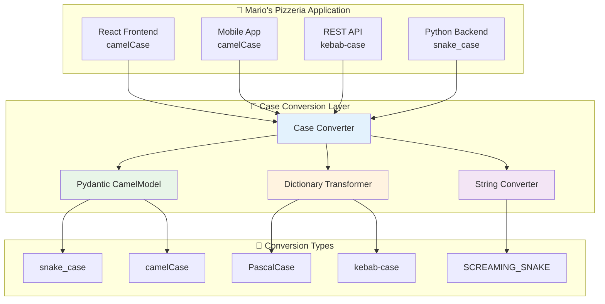

# 🔄 Case Conversion Utilities

The Neuroglia framework provides comprehensive case conversion utilities for seamless data
transformation between different naming conventions, enabling smooth integration between frontend
frameworks, APIs, and backend services with automatic Pydantic model integration.

## 🎯 Overview

Modern applications often need to work with multiple naming conventions simultaneously - JavaScript frontends use camelCase, Python backends use snake_case, and APIs might use kebab-case or PascalCase. The framework's case conversion utilities provide:

- **Comprehensive Case Conversions**: Support for all major naming conventions
- **Pydantic Integration**: Automatic model field conversion with CamelModel
- **Dictionary Transformations**: Deep conversion of nested data structures
- **String Transformations**: Individual string case conversions
- **Preservation of Context**: Maintains data integrity during conversions
- **Performance Optimized**: Efficient conversion algorithms with caching

## 🏗️ Architecture



## 🚀 Basic Usage

### Service Registration

```python
from neuroglia.hosting.web import WebApplicationBuilder
from neuroglia.utilities.case_conversion import CaseConverter

def create_app():
    builder = WebApplicationBuilder()

    # Register case conversion utilities
    builder.services.add_case_conversion_utilities()

    app = builder.build()
    return app
```

### String Case Conversions

```python
from neuroglia.utilities.case_conversion import CaseConverter

class MenuItemService:
    def __init__(self, service_provider: ServiceProviderBase):
        self.case_converter = service_provider.get_service(CaseConverter)

    def demonstrate_string_conversions(self):
        """Demonstrate various string case conversions."""

        original_field = "pizza_item_name"

        # Convert to different case formats
        conversions = {
            "camelCase": self.case_converter.to_camel_case(original_field),
            "PascalCase": self.case_converter.to_pascal_case(original_field),
            "kebab-case": self.case_converter.to_kebab_case(original_field),
            "SCREAMING_SNAKE": self.case_converter.to_screaming_snake_case(original_field),
            "Title Case": self.case_converter.to_title_case(original_field)
        }

        print("🔄 String Case Conversions:")
        print(f"Original: {original_field}")
        for case_name, converted in conversions.items():
            print(f"{case_name}: {converted}")

        return conversions

        # Output:
        # Original: pizza_item_name
        # camelCase: pizzaItemName
        # PascalCase: PizzaItemName
        # kebab-case: pizza-item-name
        # SCREAMING_SNAKE: PIZZA_ITEM_NAME
        # Title Case: Pizza Item Name

    def convert_api_field_names(self, api_response: dict) -> dict:
        """Convert API response field names from kebab-case to snake_case."""

        # Example API response with kebab-case fields
        api_data = {
            "menu-item-id": "margherita_001",
            "display-name": "Margherita Pizza",
            "base-price": 12.99,
            "available-sizes": ["small", "medium", "large"],
            "nutritional-info": {
                "calories-per-slice": 285,
                "total-fat-grams": 10.4,
                "protein-grams": 12.2
            }
        }

        # Convert all keys from kebab-case to snake_case
        converted_data = self.case_converter.convert_dict_keys(
            api_data,
            target_case="snake_case"
        )

        print("🍕 API Field Name Conversion:")
        print(f"Original keys: {list(api_data.keys())}")
        print(f"Converted keys: {list(converted_data.keys())}")

        return converted_data

        # Result:
        # {
        #     "menu_item_id": "margherita_001",
        #     "display_name": "Margherita Pizza",
        #     "base_price": 12.99,
        #     "available_sizes": ["small", "medium", "large"],
        #     "nutritional_info": {
        #         "calories_per_slice": 285,
        #         "total_fat_grams": 10.4,
        #         "protein_grams": 12.2
        #     }
        # }
```

## 📦 Pydantic CamelModel Integration

### Automatic Field Conversion Models

```python
from neuroglia.utilities.case_conversion import CamelModel
from pydantic import Field
from typing import List, Optional
from datetime import datetime

class PizzaOrderDto(CamelModel):
    """DTO that automatically converts between camelCase and snake_case."""

    order_id: str = Field(..., description="Unique order identifier")
    customer_name: str = Field(..., description="Customer full name")
    customer_email: str = Field(..., description="Customer email address")
    phone_number: Optional[str] = Field(None, description="Customer phone number")

    # Complex nested fields
    delivery_address: 'DeliveryAddressDto' = Field(..., description="Delivery address details")
    order_items: List['OrderItemDto'] = Field(..., description="List of ordered items")

    # Calculated fields
    subtotal_amount: float = Field(..., description="Subtotal before tax and delivery")
    tax_amount: float = Field(..., description="Tax amount")
    delivery_fee: float = Field(..., description="Delivery fee")
    total_amount: float = Field(..., description="Total order amount")

    # Timestamps
    order_placed_at: datetime = Field(..., description="When order was placed")
    estimated_delivery_time: datetime = Field(..., description="Estimated delivery time")

    # Status and preferences
    order_status: str = Field(default="pending", description="Current order status")
    special_instructions: Optional[str] = Field(None, description="Special delivery instructions")
    is_rush_order: bool = Field(default=False, description="Rush order flag")

class DeliveryAddressDto(CamelModel):
    """Delivery address with automatic case conversion."""

    street_address: str = Field(..., description="Street address")
    apartment_number: Optional[str] = Field(None, description="Apartment/unit number")
    city_name: str = Field(..., description="City name")
    state_code: str = Field(..., description="State/province code")
    postal_code: str = Field(..., description="ZIP/postal code")
    country_code: str = Field(default="US", description="Country code")

    # Location metadata
    is_business_address: bool = Field(default=False, description="Business address flag")
    delivery_instructions: Optional[str] = Field(None, description="Delivery instructions")

class OrderItemDto(CamelModel):
    """Individual order item with case conversion."""

    menu_item_id: str = Field(..., description="Menu item identifier")
    item_name: str = Field(..., description="Menu item name")
    item_size: str = Field(..., description="Size selection")
    base_price: float = Field(..., description="Base item price")

    # Customizations
    selected_toppings: List[str] = Field(default_factory=list, description="Selected toppings")
    removed_ingredients: List[str] = Field(default_factory=list, description="Removed ingredients")
    special_requests: Optional[str] = Field(None, description="Special preparation requests")

    # Pricing
    toppings_price: float = Field(default=0.0, description="Additional toppings cost")
    item_quantity: int = Field(default=1, description="Quantity ordered")
    line_item_total: float = Field(..., description="Total for this line item")

# Usage demonstration
class OrderProcessingService:
    def __init__(self, service_provider: ServiceProviderBase):
        self.case_converter = service_provider.get_service(CaseConverter)

    def process_frontend_order(self, frontend_data: dict) -> PizzaOrderDto:
        """Process order data from JavaScript frontend (camelCase)."""

        # Frontend sends data in camelCase
        frontend_order = {
            "orderId": "ORD_20241201_001",
            "customerName": "Mario Rossi",
            "customerEmail": "mario.rossi@email.com",
            "phoneNumber": "+1-555-0123",
            "deliveryAddress": {
                "streetAddress": "123 Pizza Street",
                "apartmentNumber": "Apt 2B",
                "cityName": "New York",
                "stateCode": "NY",
                "postalCode": "10001",
                "isBusinessAddress": False,
                "deliveryInstructions": "Ring doorbell twice"
            },
            "orderItems": [
                {
                    "menuItemId": "margherita_large",
                    "itemName": "Margherita Pizza",
                    "itemSize": "large",
                    "basePrice": 18.99,
                    "selectedToppings": ["extra_cheese", "fresh_basil"],
                    "removedIngredients": [],
                    "toppingsPrice": 3.50,
                    "itemQuantity": 2,
                    "lineItemTotal": 44.98
                }
            ],
            "subtotalAmount": 44.98,
            "taxAmount": 3.60,
            "deliveryFee": 2.99,
            "totalAmount": 51.57,
            "orderPlacedAt": "2024-12-01T14:30:00Z",
            "estimatedDeliveryTime": "2024-12-01T15:15:00Z",
            "specialInstructions": "Please call when arriving",
            "isRushOrder": True
        }

        # CamelModel automatically converts camelCase to snake_case for internal processing
        order_dto = PizzaOrderDto(**frontend_order)

        print("🍕 Order processed from frontend:")
        print(f"Order ID: {order_dto.order_id}")
        print(f"Customer: {order_dto.customer_name}")
        print(f"Items: {len(order_dto.order_items)}")
        print(f"Total: ${order_dto.total_amount}")

        return order_dto

    def send_to_frontend(self, order: PizzaOrderDto) -> dict:
        """Convert order back to camelCase for frontend response."""

        # CamelModel automatically converts snake_case to camelCase for API response
        frontend_response = order.dict(by_alias=True)  # Uses camelCase aliases

        print("📤 Sending to frontend in camelCase:")
        print(f"Keys: {list(frontend_response.keys())}")

        return frontend_response

        # Response will have camelCase keys:
        # {
        #     "orderId": "ORD_20241201_001",
        #     "customerName": "Mario Rossi",
        #     "customerEmail": "mario.rossi@email.com",
        #     "deliveryAddress": {...},
        #     "orderItems": [...],
        #     "totalAmount": 51.57,
        #     ...
        # }
```

## 🔄 Dictionary Transformations

### Deep Nested Structure Conversion

```python
from neuroglia.utilities.case_conversion import DictCaseConverter

class MenuManagementService:
    def __init__(self, service_provider: ServiceProviderBase):
        self.dict_converter = service_provider.get_service(DictCaseConverter)

    def process_complex_menu_data(self):
        """Process complex nested menu data with different case conventions."""

        # Complex menu structure from external system (mixed case conventions)
        external_menu_data = {
            "restaurantInfo": {
                "restaurant_name": "Mario's Pizzeria",
                "businessHours": {
                    "monday-friday": {
                        "opening_time": "11:00",
                        "closingTime": "22:00"
                    },
                    "weekend_hours": {
                        "saturday_opening": "12:00",
                        "sunday-closing": "21:00"
                    }
                },
                "contact-information": {
                    "phone_number": "+1-555-PIZZA",
                    "emailAddress": "orders@mariospizzeria.com"
                }
            },
            "menuCategories": [
                {
                    "category_id": "pizzas",
                    "displayName": "Artisan Pizzas",
                    "menu-items": [
                        {
                            "item_id": "margherita_classic",
                            "itemName": "Classic Margherita",
                            "basePrice": 16.99,
                            "available-sizes": {
                                "small_size": {"price": 12.99, "diameter_inches": 10},
                                "mediumSize": {"price": 16.99, "diameter-inches": 12},
                                "large_option": {"price": 21.99, "diameter_inches": 14}
                            },
                            "nutritional-data": {
                                "calories_per_slice": 285,
                                "macroNutrients": {
                                    "total_fat": 10.4,
                                    "saturatedFat": 4.8,
                                    "total-carbs": 36.2,
                                    "protein_content": 12.2
                                },
                                "allergen-info": {
                                    "contains_gluten": True,
                                    "dairy_products": True,
                                    "nut_free": True
                                }
                            }
                        }
                    ]
                }
            ]
        }

        # Convert entire structure to consistent snake_case
        snake_case_menu = self.dict_converter.convert_nested_dict(
            external_menu_data,
            target_case="snake_case",
            preserve_arrays=True,
            max_depth=10
        )

        print("🐍 Converted to snake_case:")
        self.print_menu_structure(snake_case_menu)

        # Convert to camelCase for frontend API
        camel_case_menu = self.dict_converter.convert_nested_dict(
            snake_case_menu,
            target_case="camelCase",
            preserve_arrays=True
        )

        print("🐪 Converted to camelCase:")
        self.print_menu_structure(camel_case_menu)

        # Convert to kebab-case for URL-friendly slugs
        kebab_case_menu = self.dict_converter.convert_nested_dict(
            snake_case_menu,
            target_case="kebab-case",
            preserve_arrays=True,
            key_filter=lambda key: key not in ['item_id', 'category_id']  # Preserve IDs
        )

        return {
            "snake_case": snake_case_menu,
            "camelCase": camel_case_menu,
            "kebab-case": kebab_case_menu
        }

    def print_menu_structure(self, menu_data: dict, indent: int = 0):
        """Print menu structure with indentation."""
        for key, value in menu_data.items():
            if isinstance(value, dict):
                print("  " * indent + f"📁 {key}:")
                self.print_menu_structure(value, indent + 1)
            elif isinstance(value, list) and value and isinstance(value[0], dict):
                print("  " * indent + f"📋 {key}: [{len(value)} items]")
            else:
                print("  " * indent + f"📄 {key}: {type(value).__name__}")
```

### Selective Field Conversion

```python
class CustomerProfileService:
    def __init__(self, service_provider: ServiceProviderBase):
        self.dict_converter = service_provider.get_service(DictCaseConverter)

    def convert_with_field_mapping(self, customer_data: dict) -> dict:
        """Convert customer data with custom field mappings."""

        # Original customer data from CRM system
        crm_customer_data = {
            "customer_id": "CUST_001",
            "personalInfo": {
                "firstName": "Giuseppe",
                "lastName": "Verdi",
                "date_of_birth": "1985-03-15",
                "email-address": "giuseppe.verdi@email.com"
            },
            "loyaltyProgram": {
                "membership_level": "gold",
                "points_balance": 1250,
                "next-reward-threshold": 1500
            },
            "orderHistory": {
                "total_orders": 47,
                "favorite-items": ["margherita", "quattro_stagioni"],
                "average_order_value": 28.75
            }
        }

        # Define custom field mappings
        field_mappings = {
            "firstName": "given_name",
            "lastName": "family_name",
            "email-address": "primary_email",
            "membership_level": "loyalty_tier",
            "points_balance": "reward_points",
            "next-reward-threshold": "next_milestone",
            "favorite-items": "preferred_menu_items",
            "average_order_value": "avg_purchase_amount"
        }

        # Convert with custom mappings and case conversion
        converted_data = self.dict_converter.convert_with_mapping(
            crm_customer_data,
            field_mappings=field_mappings,
            target_case="snake_case",
            preserve_structure=True
        )

        print("👤 Customer Data Conversion:")
        print(f"Original keys: {self.get_all_keys(crm_customer_data)}")
        print(f"Converted keys: {self.get_all_keys(converted_data)}")

        return converted_data

        # Result:
        # {
        #     "customer_id": "CUST_001",
        #     "personal_info": {
        #         "given_name": "Giuseppe",
        #         "family_name": "Verdi",
        #         "date_of_birth": "1985-03-15",
        #         "primary_email": "giuseppe.verdi@email.com"
        #     },
        #     "loyalty_program": {
        #         "loyalty_tier": "gold",
        #         "reward_points": 1250,
        #         "next_milestone": 1500
        #     },
        #     "order_history": {
        #         "total_orders": 47,
        #         "preferred_menu_items": ["margherita", "quattro_stagioni"],
        #         "avg_purchase_amount": 28.75
        #     }
        # }

    def get_all_keys(self, data: dict, keys=None) -> list:
        """Recursively get all keys from nested dictionary."""
        if keys is None:
            keys = []

        for key, value in data.items():
            keys.append(key)
            if isinstance(value, dict):
                self.get_all_keys(value, keys)

        return keys
```

## 🎨 Advanced Case Conversion Patterns

### API Boundary Conversion

```python
from neuroglia.mvc import ControllerBase
from neuroglia.utilities.case_conversion import ApiCaseConverter

class PizzaMenuController(ControllerBase):
    """Controller demonstrating automatic case conversion at API boundaries."""

    def __init__(self, service_provider: ServiceProviderBase,
                 mapper: Mapper, mediator: Mediator):
        super().__init__(service_provider, mapper, mediator)
        self.api_converter = service_provider.get_service(ApiCaseConverter)

    @get("/menu/{category_id}")
    async def get_menu_category(self, category_id: str) -> dict:
        """Get menu category with automatic case conversion for API response."""

        # Internal service returns snake_case data
        internal_menu_data = await self.get_internal_menu_data(category_id)

        # Convert to camelCase for frontend consumption
        api_response = self.api_converter.convert_for_api_response(
            internal_menu_data,
            input_case="snake_case",
            output_case="camelCase"
        )

        return api_response

    @post("/menu/items")
    async def create_menu_item(self, menu_item_data: dict) -> dict:
        """Create menu item with automatic request/response conversion."""

        # Frontend sends camelCase data
        print(f"📥 Received from frontend: {list(menu_item_data.keys())}")

        # Convert to snake_case for internal processing
        internal_data = self.api_converter.convert_for_internal_processing(
            menu_item_data,
            input_case="camelCase",
            output_case="snake_case"
        )

        print(f"🔄 Converted for internal use: {list(internal_data.keys())}")

        # Process internally (snake_case)
        created_item = await self.create_internal_menu_item(internal_data)

        # Convert response back to camelCase
        api_response = self.api_converter.convert_for_api_response(
            created_item,
            input_case="snake_case",
            output_case="camelCase"
        )

        print(f"📤 Sending to frontend: {list(api_response.keys())}")

        return api_response

class DatabaseIntegrationService:
    """Service demonstrating database field name conversion."""

    def __init__(self, service_provider: ServiceProviderBase):
        self.case_converter = service_provider.get_service(CaseConverter)
        self.db_converter = service_provider.get_service(DatabaseCaseConverter)

    async def save_order_with_field_mapping(self, order_data: dict):
        """Save order data with database field name conversion."""

        # Application uses snake_case
        application_order = {
            "order_id": "ORD_001",
            "customer_name": "Mario Rossi",
            "order_total": 45.99,
            "delivery_address": "123 Main St",
            "order_status": "confirmed",
            "created_at": datetime.utcnow(),
            "estimated_delivery": datetime.utcnow() + timedelta(minutes=30)
        }

        # Database uses different naming convention
        database_field_mapping = {
            "order_id": "ORDER_ID",
            "customer_name": "CUSTOMER_FULL_NAME",
            "order_total": "TOTAL_AMOUNT_USD",
            "delivery_address": "DELIVERY_ADDR_LINE1",
            "order_status": "ORDER_STATUS_CODE",
            "created_at": "CREATED_TIMESTAMP",
            "estimated_delivery": "EST_DELIVERY_TIME"
        }

        # Convert for database insertion
        database_record = self.db_converter.convert_for_database(
            application_order,
            field_mapping=database_field_mapping,
            target_case="SCREAMING_SNAKE_CASE"
        )

        print("💾 Database Record:")
        for db_field, value in database_record.items():
            print(f"  {db_field}: {value}")

        # Simulate database save
        await self.save_to_database(database_record)

        return database_record
```

## 🧪 Testing

### Case Conversion Testing

```python
import pytest
from neuroglia.utilities.case_conversion import CaseConverter, CamelModel

class TestCaseConversions:

    @pytest.fixture
    def case_converter(self):
        return CaseConverter()

    def test_string_case_conversions(self, case_converter):
        """Test various string case conversions."""

        test_cases = [
            # (input, expected_camel, expected_pascal, expected_kebab, expected_snake)
            ("hello_world", "helloWorld", "HelloWorld", "hello-world", "hello_world"),
            ("getUserName", "getUserName", "GetUserName", "get-user-name", "get_user_name"),
            ("XML-HTTP-Request", "xmlHttpRequest", "XmlHttpRequest", "xml-http-request", "xml_http_request"),
            ("pizza_item_ID", "pizzaItemId", "PizzaItemId", "pizza-item-id", "pizza_item_id"),
        ]

        for input_str, expected_camel, expected_pascal, expected_kebab, expected_snake in test_cases:
            assert case_converter.to_camel_case(input_str) == expected_camel
            assert case_converter.to_pascal_case(input_str) == expected_pascal
            assert case_converter.to_kebab_case(input_str) == expected_kebab
            assert case_converter.to_snake_case(input_str) == expected_snake

    def test_nested_dict_conversion(self, case_converter):
        """Test nested dictionary case conversion."""

        input_dict = {
            "user_name": "Mario",
            "contactInfo": {
                "email_address": "mario@test.com",
                "phoneNumber": "+1234567890"
            },
            "orderHistory": [
                {
                    "order_id": "001",
                    "totalAmount": 25.99
                }
            ]
        }

        # Convert to camelCase
        camel_result = case_converter.convert_dict_keys(input_dict, "camelCase")

        assert "userName" in camel_result
        assert "contactInfo" in camel_result
        assert "emailAddress" in camel_result["contactInfo"]
        assert "phoneNumber" in camel_result["contactInfo"]
        assert "orderId" in camel_result["orderHistory"][0]
        assert "totalAmount" in camel_result["orderHistory"][0]

    def test_camel_model_integration(self):
        """Test Pydantic CamelModel integration."""

        class TestModel(CamelModel):
            user_name: str
            email_address: str
            phone_number: Optional[str] = None

        # Test with camelCase input
        camel_data = {
            "userName": "Mario",
            "emailAddress": "mario@test.com",
            "phoneNumber": "+1234567890"
        }

        model = TestModel(**camel_data)

        # Internal representation uses snake_case
        assert model.user_name == "Mario"
        assert model.email_address == "mario@test.com"
        assert model.phone_number == "+1234567890"

        # Export with camelCase aliases
        exported = model.dict(by_alias=True)
        assert "userName" in exported
        assert "emailAddress" in exported
        assert "phoneNumber" in exported

    @pytest.mark.parametrize("input_case,output_case,input_key,expected_key", [
        ("snake_case", "camelCase", "pizza_item_name", "pizzaItemName"),
        ("camelCase", "snake_case", "pizzaItemName", "pizza_item_name"),
        ("kebab-case", "PascalCase", "pizza-item-name", "PizzaItemName"),
        ("PascalCase", "kebab-case", "PizzaItemName", "pizza-item-name"),
    ])
    def test_parametrized_conversions(self, case_converter, input_case, output_case, input_key, expected_key):
        """Test parametrized case conversions."""

        result = case_converter.convert_case(input_key, target_case=output_case)
        assert result == expected_key
```

### Integration Testing

```python
@pytest.mark.integration
class TestCaseConversionIntegration:

    @pytest.fixture
    def pizza_order_data(self):
        return {
            "orderId": "ORD_001",
            "customerName": "Mario Rossi",
            "pizzaItems": [
                {
                    "itemName": "Margherita",
                    "basePrice": 16.99,
                    "selectedToppings": ["extra_cheese"]
                }
            ],
            "deliveryAddress": {
                "streetAddress": "123 Pizza St",
                "cityName": "New York"
            }
        }

    def test_full_order_processing_flow(self, pizza_order_data):
        """Test complete order processing with case conversions."""

        # Simulate frontend -> backend -> database flow
        converter = CaseConverter()

        # Step 1: Convert from frontend camelCase to internal snake_case
        internal_data = converter.convert_dict_keys(pizza_order_data, "snake_case")

        assert "order_id" in internal_data
        assert "customer_name" in internal_data
        assert "pizza_items" in internal_data
        assert "delivery_address" in internal_data

        # Step 2: Process internally (would involve business logic)
        processed_data = {
            **internal_data,
            "order_status": "confirmed",
            "total_amount": 19.99
        }

        # Step 3: Convert back to camelCase for API response
        api_response = converter.convert_dict_keys(processed_data, "camelCase")

        assert "orderId" in api_response
        assert "orderStatus" in api_response
        assert "totalAmount" in api_response

        # Verify data integrity maintained
        assert api_response["customerName"] == "Mario Rossi"
        assert api_response["totalAmount"] == 19.99
```

## 📊 Performance Optimization

### Caching and Performance

```python
from neuroglia.utilities.case_conversion import CachedCaseConverter
import time
from typing import Dict

class PerformanceOptimizedConverter:
    """High-performance case converter with caching and optimization."""

    def __init__(self):
        self.cached_converter = CachedCaseConverter(cache_size=1000)
        self.conversion_stats = {
            "cache_hits": 0,
            "cache_misses": 0,
            "total_conversions": 0
        }

    def benchmark_conversions(self, test_data: Dict[str, any], iterations: int = 1000):
        """Benchmark case conversion performance."""

        print(f"🚀 Performance Benchmark ({iterations} iterations)")

        # Test without caching
        start_time = time.time()
        for _ in range(iterations):
            converter = CaseConverter()  # New instance each time
            result = converter.convert_dict_keys(test_data, "camelCase")

        uncached_time = time.time() - start_time

        # Test with caching
        start_time = time.time()
        for _ in range(iterations):
            result = self.cached_converter.convert_dict_keys(test_data, "camelCase")

        cached_time = time.time() - start_time

        performance_improvement = ((uncached_time - cached_time) / uncached_time) * 100

        print(f"Without caching: {uncached_time:.4f}s")
        print(f"With caching: {cached_time:.4f}s")
        print(f"Performance improvement: {performance_improvement:.1f}%")
        print(f"Cache hit rate: {self.get_cache_hit_rate():.1f}%")

        return {
            "uncached_time": uncached_time,
            "cached_time": cached_time,
            "improvement_percent": performance_improvement,
            "cache_hit_rate": self.get_cache_hit_rate()
        }

    def get_cache_hit_rate(self) -> float:
        """Calculate cache hit rate percentage."""
        total = self.conversion_stats["cache_hits"] + self.conversion_stats["cache_misses"]
        return (self.conversion_stats["cache_hits"] / total * 100) if total > 0 else 0
```

## 🔗 Related Documentation

- [🔧 Dependency Injection](../patterns/dependency-injection.md) - Service registration patterns
- [🌐 HTTP Service Client](http-service-client.md) - API request/response transformation
- [📊 Enhanced Model Validation](enhanced-model-validation.md) - Model field validation
- [📁 Data Access](data-access.md) - Database field mapping
- [📨 CQRS & Mediation](../patterns/cqrs.md) - Command/query object conversion

---

The Case Conversion Utilities provide seamless transformation capabilities that enable Mario's
Pizzeria to work with multiple naming conventions across different layers of the application.
Through comprehensive conversion support and Pydantic integration, the system maintains data
consistency while adapting to various API and framework requirements.
