# 📊 Enhanced Model Validation

The Neuroglia framework provides comprehensive model validation capabilities with business rule
enforcement, custom validators, and sophisticated exception handling, enabling robust data
integrity across all application layers with contextual validation and error reporting.

## 🎯 Overview

Modern applications require sophisticated validation beyond basic type checking - business rules,
cross-field validation, conditional logic, and contextual constraints. The framework's enhanced
validation system provides:

- **Business Rule Validation**: Domain-specific validation logic
- **Custom Validators**: Reusable validation components
- **Cross-Field Validation**: Dependencies between model fields
- **Contextual Validation**: Different rules based on context
- **Rich Error Reporting**: Detailed validation error messages
- **Performance Optimized**: Efficient validation with early termination

## 🏗️ Architecture

```mermaid
graph TB
    subgraph "🍕 Mario's Pizzeria Models"
        OrderModel[Pizza Order Model]
        CustomerModel[Customer Model]
        MenuModel[Menu Item Model]
        InventoryModel[Inventory Model]
    end

    subgraph "📊 Enhanced Validation Layer"
        ValidationEngine[Validation Engine]
        BusinessRules[Business Rule Validators]
        CustomValidators[Custom Validators]
        ContextValidators[Context-Aware Validators]
    end

    subgraph "🎯 Validation Types"
        FieldValidation[Field Validation]
        CrossFieldValidation[Cross-Field Validation]
        ConditionalValidation[Conditional Validation]
        BusinessLogicValidation[Business Logic Validation]
    end

    subgraph "📋 Error Handling"
        ValidationExceptions[Validation Exceptions]
        ErrorAggregation[Error Aggregation]
        ContextualMessages[Contextual Messages]
    end

    OrderModel --> ValidationEngine
    CustomerModel --> ValidationEngine
    MenuModel --> ValidationEngine
    InventoryModel --> ValidationEngine

    ValidationEngine --> BusinessRules
    ValidationEngine --> CustomValidators
    ValidationEngine --> ContextValidators

    BusinessRules --> FieldValidation
    CustomValidators --> CrossFieldValidation
    ContextValidators --> ConditionalValidation
    ValidationEngine --> BusinessLogicValidation

    ValidationEngine --> ValidationExceptions
    ValidationExceptions --> ErrorAggregation
    ErrorAggregation --> ContextualMessages

    style ValidationEngine fill:#e3f2fd
    style BusinessRules fill:#e8f5e8
    style CustomValidators fill:#fff3e0
    style ContextValidators fill:#f3e5f5
```



## 🚀 Basic Usage

### Service Registration

```python
from neuroglia.hosting.web import WebApplicationBuilder
from neuroglia.validation import EnhancedModelValidator, ValidationConfig

def create_app():
    builder = WebApplicationBuilder()

    # Register enhanced model validation
    validation_config = ValidationConfig(
        strict_mode=True,
        fail_fast=False,  # Collect all validation errors
        include_field_context=True,
        custom_error_messages=True
    )

    builder.services.add_enhanced_model_validation(validation_config)

    app = builder.build()
    return app
```

### Basic Field Validation

```python
from neuroglia.validation import BusinessRuleValidator, ValidationContext
from pydantic import BaseModel, Field, validator
from typing import List, Optional
from datetime import datetime, time
from decimal import Decimal

class PizzaOrderModel(BaseModel):
    """Pizza order with comprehensive validation."""

    order_id: str = Field(..., min_length=3, max_length=20,
                         description="Unique order identifier")
    customer_id: str = Field(..., min_length=5, max_length=50,
                            description="Customer identifier")

    # Order items with business validation
    order_items: List['OrderItemModel'] = Field(..., min_items=1, max_items=20,
                                               description="Items in the order")

    # Financial fields with precision validation
    subtotal: Decimal = Field(..., ge=0, decimal_places=2,
                             description="Order subtotal")
    tax_amount: Decimal = Field(..., ge=0, decimal_places=2,
                               description="Tax amount")
    delivery_fee: Decimal = Field(default=Decimal('0.00'), ge=0, decimal_places=2,
                                 description="Delivery fee")
    total_amount: Decimal = Field(..., ge=0, decimal_places=2,
                                 description="Total order amount")

    # Timing validation
    order_placed_at: datetime = Field(..., description="Order placement time")
    requested_delivery_time: Optional[datetime] = Field(None,
                                                       description="Requested delivery time")

    # Special requirements
    special_instructions: Optional[str] = Field(None, max_length=500,
                                              description="Special instructions")
    is_rush_order: bool = Field(default=False, description="Rush order flag")

    @validator('order_id')
    def validate_order_id_format(cls, v):
        """Validate order ID format."""
        import re
        if not re.match(r'^ORD_\d{8}_\d{3}$', v):
            raise ValueError('Order ID must follow format: ORD_YYYYMMDD_XXX')
        return v

    @validator('requested_delivery_time')
    def validate_delivery_time(cls, v, values):
        """Validate requested delivery time."""
        if v is None:
            return v

        order_placed_at = values.get('order_placed_at')
        if order_placed_at and v <= order_placed_at:
            raise ValueError('Delivery time must be after order placement')

        # Business rule: delivery must be within next 4 hours
        if order_placed_at:
            max_delivery_time = order_placed_at + timedelta(hours=4)
            if v > max_delivery_time:
                raise ValueError('Delivery time cannot be more than 4 hours from now')

        # Business rule: no deliveries between 2 AM and 10 AM
        delivery_hour = v.hour
        if 2 <= delivery_hour < 10:
            raise ValueError('Deliveries not available between 2 AM and 10 AM')

        return v

    @validator('total_amount')
    def validate_total_calculation(cls, v, values):
        """Validate total amount calculation."""
        subtotal = values.get('subtotal', Decimal('0'))
        tax_amount = values.get('tax_amount', Decimal('0'))
        delivery_fee = values.get('delivery_fee', Decimal('0'))

        expected_total = subtotal + tax_amount + delivery_fee

        if abs(v - expected_total) > Decimal('0.01'):  # Allow 1 cent rounding difference
            raise ValueError(
                f'Total amount {v} does not match calculated total {expected_total}'
            )

        return v

    @validator('order_items')
    def validate_order_items_business_rules(cls, v):
        """Validate business rules for order items."""
        if not v:
            raise ValueError('Order must contain at least one item')

        # Business rule: maximum 5 of same item
        item_counts = {}
        for item in v:
            key = f"{item.menu_item_id}_{item.size}"
            item_counts[key] = item_counts.get(key, 0) + item.quantity
            if item_counts[key] > 5:
                raise ValueError(f'Cannot order more than 5 of the same item: {item.item_name}')

        # Business rule: rush orders limited to 3 items total
        is_rush = any(getattr(cls, 'is_rush_order', False) for cls in [cls])
        if is_rush and len(v) > 3:
            raise ValueError('Rush orders are limited to 3 items maximum')

        return v

class OrderItemModel(BaseModel):
    """Individual order item with validation."""

    menu_item_id: str = Field(..., min_length=3, max_length=50)
    item_name: str = Field(..., min_length=1, max_length=100)
    size: str = Field(..., regex=r'^(small|medium|large|xl)$')
    base_price: Decimal = Field(..., gt=0, decimal_places=2)

    # Customizations
    selected_toppings: List[str] = Field(default_factory=list, max_items=10)
    removed_ingredients: List[str] = Field(default_factory=list, max_items=5)

    # Quantity and pricing
    quantity: int = Field(..., ge=1, le=10, description="Item quantity")
    toppings_price: Decimal = Field(default=Decimal('0.00'), ge=0, decimal_places=2)
    line_total: Decimal = Field(..., ge=0, decimal_places=2)

    @validator('selected_toppings')
    def validate_toppings(cls, v):
        """Validate topping selections."""
        if len(v) != len(set(v)):
            raise ValueError('Duplicate toppings are not allowed')

        # Business rule: premium toppings limit
        premium_toppings = ['truffle', 'caviar', 'gold_flakes']
        premium_count = sum(1 for topping in v if topping in premium_toppings)
        if premium_count > 2:
            raise ValueError('Maximum 2 premium toppings allowed per item')

        return v

    @validator('line_total')
    def validate_line_total(cls, v, values):
        """Validate line total calculation."""
        base_price = values.get('base_price', Decimal('0'))
        toppings_price = values.get('toppings_price', Decimal('0'))
        quantity = values.get('quantity', 1)

        expected_total = (base_price + toppings_price) * quantity

        if abs(v - expected_total) > Decimal('0.01'):
            raise ValueError(
                f'Line total {v} does not match calculated total {expected_total}'
            )

        return v
```

## 🏗️ Business Rule Validators

### Custom Business Logic Validation

```python
from neuroglia.validation import BusinessRuleValidator, ValidationResult

class PizzaOrderBusinessValidator(BusinessRuleValidator):
    """Comprehensive business rule validation for pizza orders."""

    def __init__(self, service_provider: ServiceProviderBase):
        super().__init__(service_provider)
        self.inventory_service = service_provider.get_service(InventoryService)
        self.customer_service = service_provider.get_service(CustomerService)
        self.menu_service = service_provider.get_service(MenuService)

    async def validate_order_business_rules(self, order: PizzaOrderModel,
                                          context: ValidationContext) -> ValidationResult:
        """Validate comprehensive business rules for pizza orders."""

        errors = []
        warnings = []

        # Rule 1: Customer validation
        customer_validation = await self.validate_customer_eligibility(order.customer_id)
        if not customer_validation.is_valid:
            errors.extend(customer_validation.errors)

        # Rule 2: Inventory availability
        inventory_validation = await self.validate_inventory_availability(order.order_items)
        if not inventory_validation.is_valid:
            errors.extend(inventory_validation.errors)

        # Rule 3: Menu item availability
        menu_validation = await self.validate_menu_items(order.order_items, context)
        if not menu_validation.is_valid:
            errors.extend(menu_validation.errors)
        warnings.extend(menu_validation.warnings)

        # Rule 4: Order timing validation
        timing_validation = self.validate_order_timing(order, context)
        if not timing_validation.is_valid:
            errors.extend(timing_validation.errors)

        # Rule 5: Financial validation
        financial_validation = await self.validate_financial_constraints(order)
        if not financial_validation.is_valid:
            errors.extend(financial_validation.errors)

        return ValidationResult(
            is_valid=len(errors) == 0,
            errors=errors,
            warnings=warnings,
            context=context
        )

    async def validate_customer_eligibility(self, customer_id: str) -> ValidationResult:
        """Validate customer is eligible to place orders."""

        customer = await self.customer_service.get_customer_async(customer_id)
        errors = []

        if not customer:
            errors.append(ValidationError(
                field="customer_id",
                message="Customer not found",
                code="CUSTOMER_NOT_FOUND"
            ))
            return ValidationResult(is_valid=False, errors=errors)

        # Check customer account status
        if customer.status == "suspended":
            errors.append(ValidationError(
                field="customer_id",
                message="Customer account is suspended",
                code="CUSTOMER_SUSPENDED"
            ))

        # Check outstanding balance
        if customer.outstanding_balance > Decimal('100.00'):
            errors.append(ValidationError(
                field="customer_id",
                message=f"Outstanding balance of ${customer.outstanding_balance} exceeds limit",
                code="OUTSTANDING_BALANCE_LIMIT"
            ))

        # Check daily order limit
        today_orders = await self.customer_service.get_today_order_count(customer_id)
        if today_orders >= 10:
            errors.append(ValidationError(
                field="customer_id",
                message="Daily order limit exceeded (10 orders per day)",
                code="DAILY_ORDER_LIMIT"
            ))

        return ValidationResult(is_valid=len(errors) == 0, errors=errors)

    async def validate_inventory_availability(self, order_items: List[OrderItemModel]) -> ValidationResult:
        """Validate ingredient availability for all order items."""

        errors = []

        for item in order_items:
            # Get recipe ingredients for menu item
            recipe = await self.menu_service.get_recipe_async(item.menu_item_id)
            if not recipe:
                errors.append(ValidationError(
                    field=f"order_items[{item.menu_item_id}]",
                    message=f"Recipe not found for item: {item.item_name}",
                    code="RECIPE_NOT_FOUND"
                ))
                continue

            # Check base ingredients
            for ingredient in recipe.base_ingredients:
                required_quantity = ingredient.quantity * item.quantity
                available_quantity = await self.inventory_service.get_available_quantity(
                    ingredient.ingredient_id
                )

                if available_quantity < required_quantity:
                    errors.append(ValidationError(
                        field=f"order_items[{item.menu_item_id}].quantity",
                        message=f"Insufficient {ingredient.name}: need {required_quantity}, have {available_quantity}",
                        code="INSUFFICIENT_INVENTORY"
                    ))

            # Check topping availability
            for topping_id in item.selected_toppings:
                topping_quantity = await self.inventory_service.get_available_quantity(topping_id)
                required_quantity = item.quantity  # 1 unit per pizza

                if topping_quantity < required_quantity:
                    errors.append(ValidationError(
                        field=f"order_items[{item.menu_item_id}].selected_toppings",
                        message=f"Topping '{topping_id}' not available in sufficient quantity",
                        code="TOPPING_UNAVAILABLE"
                    ))

        return ValidationResult(is_valid=len(errors) == 0, errors=errors)

    async def validate_menu_items(self, order_items: List[OrderItemModel],
                                context: ValidationContext) -> ValidationResult:
        """Validate menu item availability and special conditions."""

        errors = []
        warnings = []

        for item in order_items:
            menu_item = await self.menu_service.get_menu_item_async(item.menu_item_id)

            if not menu_item:
                errors.append(ValidationError(
                    field=f"order_items[{item.menu_item_id}]",
                    message=f"Menu item not found: {item.menu_item_id}",
                    code="MENU_ITEM_NOT_FOUND"
                ))
                continue

            # Check if item is available
            if not menu_item.is_available:
                errors.append(ValidationError(
                    field=f"order_items[{item.menu_item_id}]",
                    message=f"Menu item is currently unavailable: {item.item_name}",
                    code="MENU_ITEM_UNAVAILABLE"
                ))

            # Check size availability
            if item.size not in menu_item.available_sizes:
                errors.append(ValidationError(
                    field=f"order_items[{item.menu_item_id}].size",
                    message=f"Size '{item.size}' not available for {item.item_name}",
                    code="SIZE_UNAVAILABLE"
                ))

            # Check seasonal availability
            if menu_item.is_seasonal and not self.is_in_season(menu_item, context.current_date):
                warnings.append(ValidationWarning(
                    field=f"order_items[{item.menu_item_id}]",
                    message=f"'{item.item_name}' is a seasonal item and may not be available",
                    code="SEASONAL_ITEM_WARNING"
                ))

            # Validate price matches current menu price
            current_price = menu_item.get_price_for_size(item.size)
            if abs(item.base_price - current_price) > Decimal('0.01'):
                errors.append(ValidationError(
                    field=f"order_items[{item.menu_item_id}].base_price",
                    message=f"Price mismatch: expected {current_price}, got {item.base_price}",
                    code="PRICE_MISMATCH"
                ))

        return ValidationResult(
            is_valid=len(errors) == 0,
            errors=errors,
            warnings=warnings
        )

    def validate_order_timing(self, order: PizzaOrderModel,
                            context: ValidationContext) -> ValidationResult:
        """Validate order timing constraints."""

        errors = []
        current_time = context.current_datetime

        # Check restaurant hours
        restaurant_hours = self.get_restaurant_hours(current_time.weekday())
        current_hour = current_time.hour

        if not (restaurant_hours.open_hour <= current_hour < restaurant_hours.close_hour):
            errors.append(ValidationError(
                field="order_placed_at",
                message=f"Restaurant is closed. Hours: {restaurant_hours.open_hour}:00 - {restaurant_hours.close_hour}:00",
                code="RESTAURANT_CLOSED"
            ))

        # Rush order timing validation
        if order.is_rush_order:
            # Rush orders not allowed in last hour before closing
            if current_hour >= restaurant_hours.close_hour - 1:
                errors.append(ValidationError(
                    field="is_rush_order",
                    message="Rush orders not available in the last hour before closing",
                    code="RUSH_ORDER_TOO_LATE"
                ))

            # Check rush order capacity
            current_rush_orders = context.get("current_rush_orders", 0)
            if current_rush_orders >= 5:  # Max 5 rush orders at once
                errors.append(ValidationError(
                    field="is_rush_order",
                    message="Rush order capacity exceeded. Please try again later.",
                    code="RUSH_ORDER_CAPACITY_EXCEEDED"
                ))

        return ValidationResult(is_valid=len(errors) == 0, errors=errors)

    async def validate_financial_constraints(self, order: PizzaOrderModel) -> ValidationResult:
        """Validate financial business rules."""

        errors = []

        # Minimum order value
        minimum_order = Decimal('10.00')
        if order.subtotal < minimum_order:
            errors.append(ValidationError(
                field="subtotal",
                message=f"Minimum order value is ${minimum_order}",
                code="MINIMUM_ORDER_NOT_MET"
            ))

        # Maximum single order value (fraud prevention)
        maximum_order = Decimal('500.00')
        if order.total_amount > maximum_order:
            errors.append(ValidationError(
                field="total_amount",
                message=f"Maximum single order value is ${maximum_order}",
                code="MAXIMUM_ORDER_EXCEEDED"
            ))

        # Rush order surcharge validation
        if order.is_rush_order:
            expected_rush_fee = order.subtotal * Decimal('0.20')  # 20% surcharge
            if abs(order.delivery_fee - expected_rush_fee) > Decimal('0.01'):
                errors.append(ValidationError(
                    field="delivery_fee",
                    message=f"Rush order delivery fee should be ${expected_rush_fee}",
                    code="RUSH_DELIVERY_FEE_INCORRECT"
                ))

        return ValidationResult(is_valid=len(errors) == 0, errors=errors)
```

## 🎯 Context-Aware Validation

### Dynamic Validation Based on Context

```python
from neuroglia.validation import ContextAwareValidator, ValidationContext

class CustomerRegistrationValidator(ContextAwareValidator):
    """Context-aware validation for customer registration."""

    async def validate_customer_registration(self, customer_data: dict,
                                           context: ValidationContext) -> ValidationResult:
        """Validate customer registration with context-specific rules."""

        errors = []
        warnings = []

        # Different validation rules based on registration source
        registration_source = context.get("registration_source", "web")

        if registration_source == "mobile_app":
            # Mobile app requires phone verification
            mobile_validation = await self.validate_mobile_app_requirements(customer_data)
            errors.extend(mobile_validation.errors)

        elif registration_source == "social_login":
            # Social login has different email validation
            social_validation = await self.validate_social_login_requirements(customer_data)
            errors.extend(social_validation.errors)

        elif registration_source == "in_store":
            # In-store registration allows relaxed validation
            store_validation = await self.validate_in_store_requirements(customer_data)
            warnings.extend(store_validation.warnings)

        # Location-based validation
        customer_location = context.get("customer_location")
        if customer_location:
            location_validation = await self.validate_location_requirements(
                customer_data, customer_location
            )
            errors.extend(location_validation.errors)

        # Time-based validation (different rules for peak hours)
        current_hour = context.current_datetime.hour
        if 11 <= current_hour <= 14:  # Lunch rush
            # Expedited validation during peak hours
            peak_validation = self.validate_peak_hour_registration(customer_data)
            if not peak_validation.is_valid:
                # Convert some errors to warnings during peak hours
                warnings.extend([
                    ValidationWarning(
                        field=error.field,
                        message=f"Peak hours: {error.message}",
                        code=f"PEAK_{error.code}"
                    ) for error in peak_validation.errors
                ])

        return ValidationResult(
            is_valid=len(errors) == 0,
            errors=errors,
            warnings=warnings,
            context=context
        )

    async def validate_mobile_app_requirements(self, customer_data: dict) -> ValidationResult:
        """Validate requirements specific to mobile app registration."""

        errors = []

        # Phone number is required for mobile registration
        if not customer_data.get("phone_number"):
            errors.append(ValidationError(
                field="phone_number",
                message="Phone number is required for mobile registration",
                code="MOBILE_PHONE_REQUIRED"
            ))

        # Push notification consent
        if not customer_data.get("accepts_push_notifications"):
            errors.append(ValidationError(
                field="accepts_push_notifications",
                message="Push notification consent required for mobile app",
                code="PUSH_CONSENT_REQUIRED"
            ))

        return ValidationResult(is_valid=len(errors) == 0, errors=errors)

    async def validate_location_requirements(self, customer_data: dict,
                                           location: dict) -> ValidationResult:
        """Validate location-specific requirements."""

        errors = []

        # Check if we deliver to this location
        is_in_delivery_zone = await self.check_delivery_zone(location)
        if not is_in_delivery_zone:
            errors.append(ValidationError(
                field="address",
                message="Sorry, we don't deliver to this location yet",
                code="OUTSIDE_DELIVERY_ZONE"
            ))

        # State-specific validation (e.g., age verification requirements)
        state = location.get("state")
        if state in ["CA", "NY"]:  # States with stricter requirements
            if not customer_data.get("date_of_birth"):
                errors.append(ValidationError(
                    field="date_of_birth",
                    message=f"Date of birth required for registration in {state}",
                    code="STATE_DOB_REQUIRED"
                ))

        return ValidationResult(is_valid=len(errors) == 0, errors=errors)
```

## 🧪 Testing

### Comprehensive Validation Testing

```python
import pytest
from decimal import Decimal
from datetime import datetime, timedelta
from neuroglia.validation import ValidationContext, ValidationResult

class TestPizzaOrderValidation:

    @pytest.fixture
    def valid_order_data(self):
        return {
            "order_id": "ORD_20241201_001",
            "customer_id": "CUST_12345",
            "order_items": [
                {
                    "menu_item_id": "margherita_large",
                    "item_name": "Margherita Pizza",
                    "size": "large",
                    "base_price": Decimal("18.99"),
                    "selected_toppings": ["extra_cheese"],
                    "removed_ingredients": [],
                    "quantity": 1,
                    "toppings_price": Decimal("2.50"),
                    "line_total": Decimal("21.49")
                }
            ],
            "subtotal": Decimal("21.49"),
            "tax_amount": Decimal("1.72"),
            "delivery_fee": Decimal("2.99"),
            "total_amount": Decimal("26.20"),
            "order_placed_at": datetime.utcnow(),
            "requested_delivery_time": datetime.utcnow() + timedelta(minutes=45),
            "special_instructions": "Ring doorbell",
            "is_rush_order": False
        }

    @pytest.fixture
    def validation_context(self):
        return ValidationContext(
            current_datetime=datetime.utcnow(),
            current_date=datetime.utcnow().date(),
            user_context={"customer_id": "CUST_12345"},
            request_context={"source": "web_app"}
        )

    def test_valid_order_passes_validation(self, valid_order_data):
        """Test that a valid order passes all validation."""

        order = PizzaOrderModel(**valid_order_data)

        # Should not raise any validation errors
        assert order.order_id == "ORD_20241201_001"
        assert order.total_amount == Decimal("26.20")
        assert len(order.order_items) == 1

    def test_invalid_order_id_format(self, valid_order_data):
        """Test order ID format validation."""

        valid_order_data["order_id"] = "INVALID_FORMAT"

        with pytest.raises(ValueError) as exc_info:
            PizzaOrderModel(**valid_order_data)

        assert "Order ID must follow format" in str(exc_info.value)

    def test_total_calculation_validation(self, valid_order_data):
        """Test total amount calculation validation."""

        # Set incorrect total
        valid_order_data["total_amount"] = Decimal("99.99")

        with pytest.raises(ValueError) as exc_info:
            PizzaOrderModel(**valid_order_data)

        assert "Total amount" in str(exc_info.value)
        assert "does not match calculated total" in str(exc_info.value)

    def test_delivery_time_validation(self, valid_order_data):
        """Test delivery time business rules."""

        # Set delivery time in the past
        valid_order_data["requested_delivery_time"] = datetime.utcnow() - timedelta(hours=1)

        with pytest.raises(ValueError) as exc_info:
            PizzaOrderModel(**valid_order_data)

        assert "Delivery time must be after order placement" in str(exc_info.value)

    def test_delivery_time_early_hours_restriction(self, valid_order_data):
        """Test early hours delivery restriction."""

        # Set delivery time at 3 AM (restricted hours)
        tomorrow_3am = datetime.utcnow().replace(hour=3, minute=0, second=0) + timedelta(days=1)
        valid_order_data["requested_delivery_time"] = tomorrow_3am

        with pytest.raises(ValueError) as exc_info:
            PizzaOrderModel(**valid_order_data)

        assert "not available between 2 AM and 10 AM" in str(exc_info.value)

    def test_maximum_item_quantity_validation(self, valid_order_data):
        """Test maximum quantity validation."""

        # Set quantity above limit
        valid_order_data["order_items"][0]["quantity"] = 15
        valid_order_data["order_items"][0]["line_total"] = Decimal("322.35")  # Adjust total
        valid_order_data["subtotal"] = Decimal("322.35")
        valid_order_data["total_amount"] = Decimal("350.00")  # Adjust totals

        with pytest.raises(ValueError) as exc_info:
            PizzaOrderModel(**valid_order_data)

        assert "quantity" in str(exc_info.value)

    def test_duplicate_toppings_validation(self, valid_order_data):
        """Test duplicate toppings validation."""

        # Add duplicate toppings
        valid_order_data["order_items"][0]["selected_toppings"] = [
            "extra_cheese", "extra_cheese", "pepperoni"
        ]

        with pytest.raises(ValueError) as exc_info:
            PizzaOrderModel(**valid_order_data)

        assert "Duplicate toppings are not allowed" in str(exc_info.value)

    @pytest.mark.asyncio
    async def test_business_rule_validation(self, valid_order_data, validation_context):
        """Test comprehensive business rule validation."""

        # Mock services
        business_validator = PizzaOrderBusinessValidator(mock_service_provider())

        order = PizzaOrderModel(**valid_order_data)
        result = await business_validator.validate_order_business_rules(order, validation_context)

        # Should pass basic validation (with mocked services)
        assert isinstance(result, ValidationResult)

    def test_line_total_calculation_validation(self, valid_order_data):
        """Test line total calculation validation."""

        # Set incorrect line total
        valid_order_data["order_items"][0]["line_total"] = Decimal("99.99")
        # Keep other totals consistent to isolate this validation

        with pytest.raises(ValueError) as exc_info:
            PizzaOrderModel(**valid_order_data)

        assert "Line total" in str(exc_info.value)
        assert "does not match calculated total" in str(exc_info.value)

def mock_service_provider():
    """Create mock service provider for testing."""
    from unittest.mock import Mock

    service_provider = Mock()

    # Mock inventory service
    inventory_service = Mock()
    inventory_service.get_available_quantity = Mock(return_value=100)  # Always available

    # Mock customer service
    customer_service = Mock()
    mock_customer = Mock()
    mock_customer.status = "active"
    mock_customer.outstanding_balance = Decimal("0.00")
    customer_service.get_customer_async = Mock(return_value=mock_customer)
    customer_service.get_today_order_count = Mock(return_value=0)

    # Mock menu service
    menu_service = Mock()
    mock_recipe = Mock()
    mock_recipe.base_ingredients = []
    menu_service.get_recipe_async = Mock(return_value=mock_recipe)

    mock_menu_item = Mock()
    mock_menu_item.is_available = True
    mock_menu_item.available_sizes = ["small", "medium", "large"]
    mock_menu_item.is_seasonal = False
    mock_menu_item.get_price_for_size = Mock(return_value=Decimal("18.99"))
    menu_service.get_menu_item_async = Mock(return_value=mock_menu_item)

    service_provider.get_service.side_effect = lambda service_type: {
        'InventoryService': inventory_service,
        'CustomerService': customer_service,
        'MenuService': menu_service
    }.get(service_type.__name__ if hasattr(service_type, '__name__') else str(service_type))

    return service_provider
```

### Performance Testing

```python
import time
import pytest
from concurrent.futures import ThreadPoolExecutor

class TestValidationPerformance:

    def test_validation_performance(self, valid_order_data):
        """Test validation performance with large datasets."""

        # Create 100 order variations
        orders_data = []
        for i in range(100):
            order_data = valid_order_data.copy()
            order_data["order_id"] = f"ORD_20241201_{i:03d}"
            orders_data.append(order_data)

        # Time validation
        start_time = time.time()

        valid_orders = []
        for order_data in orders_data:
            try:
                order = PizzaOrderModel(**order_data)
                valid_orders.append(order)
            except ValueError:
                pass  # Skip invalid orders

        end_time = time.time()
        duration = end_time - start_time

        print(f"✅ Validated {len(valid_orders)} orders in {duration:.3f}s")
        print(f"📊 Average validation time: {(duration/len(orders_data)*1000):.1f}ms per order")

        # Performance assertion
        assert duration < 1.0, f"Validation took too long: {duration:.3f}s"
        assert len(valid_orders) == 100, "Some valid orders failed validation"
```

## 📊 Error Aggregation and Reporting

### Comprehensive Error Handling

```python
from neuroglia.validation import ValidationErrorAggregator, ValidationReport

class OrderValidationService:
    """Service for comprehensive order validation with detailed reporting."""

    def __init__(self, service_provider: ServiceProviderBase):
        self.business_validator = service_provider.get_service(PizzaOrderBusinessValidator)
        self.error_aggregator = ValidationErrorAggregator()

    async def validate_order_comprehensively(self, order_data: dict,
                                           context: ValidationContext) -> ValidationReport:
        """Perform comprehensive validation with detailed error reporting."""

        validation_report = ValidationReport()

        try:
            # Step 1: Basic model validation
            validation_report.add_step("Model Validation")
            order_model = PizzaOrderModel(**order_data)
            validation_report.mark_step_success("Model Validation")

        except ValueError as e:
            validation_report.mark_step_failed("Model Validation", str(e))
            return validation_report

        # Step 2: Business rule validation
        validation_report.add_step("Business Rules Validation")
        business_result = await self.business_validator.validate_order_business_rules(
            order_model, context
        )

        if business_result.is_valid:
            validation_report.mark_step_success("Business Rules Validation")
        else:
            validation_report.mark_step_failed(
                "Business Rules Validation",
                business_result.errors
            )
            validation_report.add_warnings(business_result.warnings)

        # Step 3: Context-specific validation
        validation_report.add_step("Context Validation")
        context_result = await self.validate_context_specific_rules(order_model, context)

        if context_result.is_valid:
            validation_report.mark_step_success("Context Validation")
        else:
            validation_report.mark_step_failed("Context Validation", context_result.errors)

        # Generate comprehensive report
        validation_report.finalize()

        print("📋 Validation Report:")
        print(f"Overall Status: {'✅ VALID' if validation_report.is_valid else '❌ INVALID'}")
        print(f"Total Errors: {len(validation_report.all_errors)}")
        print(f"Total Warnings: {len(validation_report.all_warnings)}")

        if validation_report.all_errors:
            print("\n🚨 Validation Errors:")
            for error in validation_report.all_errors:
                print(f"  • {error.field}: {error.message} ({error.code})")

        if validation_report.all_warnings:
            print("\n⚠️ Validation Warnings:")
            for warning in validation_report.all_warnings:
                print(f"  • {warning.field}: {warning.message} ({warning.code})")

        return validation_report
```

## 🔗 Related Documentation

- [🔧 Dependency Injection](dependency-injection.md) - Service registration for validators
- [🔄 Case Conversion Utilities](case-conversion-utilities.md) - Model field transformations
- [📨 CQRS & Mediation](cqrs-mediation.md) - Command validation patterns
- [🌐 HTTP Service Client](http-service-client.md) - Request/response validation
- [📁 Data Access](data-access.md) - Data persistence validation

---

The Enhanced Model Validation system provides comprehensive data integrity enforcement
throughout Mario's Pizzeria application. Through business rules, contextual validation,
and detailed error reporting, the system ensures reliable operations while providing
clear feedback for resolution of validation issues.
