# 🌐 HTTP Service Client

The Neuroglia framework provides enterprise-grade HTTP client capabilities with advanced resilience patterns, enabling reliable communication with external services through circuit breakers, retry policies, and comprehensive request/response interception.

## 🎯 Overview

Modern microservices rely heavily on external service communication for payment processing, third-party APIs, and inter-service coordination. The framework's HTTP client implementation provides:

- **Circuit Breaker Pattern**: Protection against cascading failures
- **Retry Policies**: Configurable retry strategies with exponential backoff
- **Request/Response Interception**: Middleware for authentication, logging, and monitoring
- **Connection Pooling**: Optimized HTTP connection management
- **Timeout Management**: Configurable timeouts for different scenarios
- **Request/Response Validation**: Automatic data validation and transformation

## 🏗️ Architecture

```mermaid
graph TB
    subgraph "🍕 Mario's Pizzeria Services"
        OrderService[Order Service]
        PaymentService[Payment Service]
        DeliveryService[Delivery Service]
        NotificationService[Notification Service]
    end

    subgraph "🌐 HTTP Service Client"
        HttpClient[HTTP Client Manager]
        CircuitBreaker[Circuit Breaker]
        RetryPolicy[Retry Policy]
        Interceptors[Request/Response Interceptors]
    end

    subgraph "🔌 External Services"
        PaymentGateway[Payment Gateway API]
        DeliveryAPI[Delivery Tracking API]
        EmailService[Email Service API]
        SMSService[SMS Service API]
    end

    OrderService --> HttpClient
    PaymentService --> HttpClient
    DeliveryService --> HttpClient
    NotificationService --> HttpClient

    HttpClient --> CircuitBreaker
    HttpClient --> RetryPolicy
    HttpClient --> Interceptors

    CircuitBreaker --> PaymentGateway
    CircuitBreaker --> DeliveryAPI
    CircuitBreaker --> EmailService
    CircuitBreaker --> SMSService

    style HttpClient fill:#e3f2fd
    style CircuitBreaker fill:#ffebee
    style RetryPolicy fill:#e8f5e8
    style Interceptors fill:#fff3e0
```



## 🚀 Basic Usage

### Service Registration

```python
from neuroglia.hosting.web import WebApplicationBuilder
from neuroglia.http import HttpServiceClient, HttpClientConfig

def create_app():
    builder = WebApplicationBuilder()

    # Register HTTP service client
    http_config = HttpClientConfig(
        base_timeout=30.0,
        connection_timeout=5.0,
        max_connections=100,
        max_connections_per_host=20,
        enable_circuit_breaker=True,
        enable_retry_policy=True
    )

    builder.services.add_http_service_client(http_config)

    app = builder.build()
    return app
```

### Simple HTTP Operations

```python
from neuroglia.http import HttpServiceClient
from neuroglia.dependency_injection import ServiceProviderBase
from typing import Optional

class PaymentGatewayService:
    def __init__(self, service_provider: ServiceProviderBase):
        self.http_client = service_provider.get_service(HttpServiceClient)
        self.base_url = "https://api.payment-gateway.com/v1"
        self.api_key = "your_api_key_here"

    async def charge_customer(self, order_id: str, amount: float, currency: str = "USD") -> dict:
        """Charge customer payment through external gateway."""

        payment_request = {
            "order_id": order_id,
            "amount": amount,
            "currency": currency,
            "description": f"Mario's Pizzeria Order {order_id}",
            "metadata": {
                "restaurant": "marios_pizzeria",
                "order_type": "online"
            }
        }

        headers = {
            "Authorization": f"Bearer {self.api_key}",
            "Content-Type": "application/json",
            "X-Idempotency-Key": f"order_{order_id}"
        }

        try:
            response = await self.http_client.post_async(
                url=f"{self.base_url}/charges",
                json=payment_request,
                headers=headers,
                timeout=15.0
            )

            if response.is_success:
                print(f"💳 Payment successful for order {order_id}: ${amount}")
                return response.json()
            else:
                print(f"❌ Payment failed for order {order_id}: {response.status_code}")
                raise PaymentProcessingError(f"Payment failed: {response.text}")

        except Exception as e:
            print(f"💥 Payment service error: {e}")
            raise PaymentServiceUnavailableError(f"Cannot process payment: {e}")

    async def refund_payment(self, charge_id: str, amount: Optional[float] = None) -> dict:
        """Process refund through payment gateway."""

        refund_request = {
            "charge_id": charge_id,
            "reason": "customer_request"
        }

        if amount:
            refund_request["amount"] = amount

        headers = {
            "Authorization": f"Bearer {self.api_key}",
            "Content-Type": "application/json"
        }

        response = await self.http_client.post_async(
            url=f"{self.base_url}/refunds",
            json=refund_request,
            headers=headers
        )

        if response.is_success:
            refund_data = response.json()
            print(f"💰 Refund processed: {refund_data['refund_id']}")
            return refund_data
        else:
            raise RefundProcessingError(f"Refund failed: {response.text}")
```

## 🔄 Circuit Breaker Pattern

### Resilient External Service Integration

```python
from neuroglia.http import CircuitBreakerPolicy, CircuitBreakerState

class DeliveryTrackingService:
    def __init__(self, service_provider: ServiceProviderBase):
        self.http_client = service_provider.get_service(HttpServiceClient)
        self.base_url = "https://api.delivery-service.com/v2"

        # Configure circuit breaker for delivery API
        self.circuit_breaker = CircuitBreakerPolicy(
            failure_threshold=5,        # Open after 5 failures
            recovery_timeout=60,        # Try recovery after 60 seconds
            success_threshold=3,        # Close after 3 successful calls
            timeout=10.0               # Individual request timeout
        )

    @circuit_breaker.apply
    async def create_delivery_request(self, order_id: str, delivery_address: dict) -> dict:
        """Create delivery request with circuit breaker protection."""

        delivery_request = {
            "order_id": order_id,
            "pickup_address": {
                "street": "123 Pizza Street",
                "city": "Pizza City",
                "zip": "12345"
            },
            "delivery_address": delivery_address,
            "priority": "standard",
            "special_instructions": "Handle with care - hot pizza!"
        }

        try:
            response = await self.http_client.post_async(
                url=f"{self.base_url}/deliveries",
                json=delivery_request,
                timeout=self.circuit_breaker.timeout
            )

            if response.is_success:
                delivery_data = response.json()
                print(f"🚚 Delivery scheduled: {delivery_data['tracking_id']}")
                return delivery_data
            else:
                raise DeliveryServiceError(f"Delivery creation failed: {response.status_code}")

        except Exception as e:
            print(f"🔴 Delivery service unavailable: {e}")
            # Circuit breaker will handle this failure
            raise

    async def get_delivery_status(self, tracking_id: str) -> dict:
        """Get delivery status with fallback handling."""

        if self.circuit_breaker.state == CircuitBreakerState.OPEN:
            # Circuit is open - use fallback
            return await self.get_fallback_delivery_status(tracking_id)

        try:
            response = await self.http_client.get_async(
                url=f"{self.base_url}/deliveries/{tracking_id}",
                timeout=5.0
            )

            if response.is_success:
                return response.json()
            else:
                return await self.get_fallback_delivery_status(tracking_id)

        except Exception:
            return await self.get_fallback_delivery_status(tracking_id)

    async def get_fallback_delivery_status(self, tracking_id: str) -> dict:
        """Fallback delivery status when service is unavailable."""
        print(f"📋 Using fallback status for delivery {tracking_id}")

        return {
            "tracking_id": tracking_id,
            "status": "in_transit",
            "estimated_delivery": "Service temporarily unavailable",
            "fallback": True
        }
```

## 🔄 Retry Policies

### Configurable Retry Strategies

```python
from neuroglia.http import RetryPolicy, ExponentialBackoff, RetryCondition

class NotificationService:
    def __init__(self, service_provider: ServiceProviderBase):
        self.http_client = service_provider.get_service(HttpServiceClient)

        # Configure retry policy for notifications
        self.retry_policy = RetryPolicy(
            max_attempts=3,
            backoff_strategy=ExponentialBackoff(
                initial_delay=1.0,
                max_delay=30.0,
                backoff_factor=2.0
            ),
            retry_conditions=[
                RetryCondition.on_timeout(),
                RetryCondition.on_status_codes([429, 502, 503, 504]),
                RetryCondition.on_exceptions([ConnectionError, TimeoutError])
            ]
        )

    @retry_policy.apply
    async def send_order_confirmation_email(self, customer_email: str, order_details: dict) -> bool:
        """Send order confirmation email with retry policy."""

        email_request = {
            "to": customer_email,
            "subject": f"🍕 Order Confirmation - #{order_details['order_id']}",
            "template": "order_confirmation",
            "variables": {
                "customer_name": order_details['customer_name'],
                "order_id": order_details['order_id'],
                "items": order_details['items'],
                "total_amount": order_details['total_amount'],
                "estimated_delivery": order_details['estimated_delivery']
            }
        }

        response = await self.http_client.post_async(
            url="https://api.email-service.com/v1/send",
            json=email_request,
            headers={
                "Authorization": f"Bearer {self.get_email_api_key()}",
                "Content-Type": "application/json"
            },
            timeout=10.0
        )

        if response.is_success:
            print(f"📧 Order confirmation sent to {customer_email}")
            return True
        else:
            error_msg = f"Failed to send email: {response.status_code} - {response.text}"
            print(f"❌ {error_msg}")
            raise EmailDeliveryError(error_msg)

    @retry_policy.apply
    async def send_sms_notification(self, phone_number: str, message: str) -> bool:
        """Send SMS notification with retry policy."""

        sms_request = {
            "to": phone_number,
            "message": message,
            "from": "Mario's Pizzeria"
        }

        response = await self.http_client.post_async(
            url="https://api.sms-service.com/v1/messages",
            json=sms_request,
            headers={
                "Authorization": f"Bearer {self.get_sms_api_key()}",
                "Content-Type": "application/json"
            }
        )

        if response.is_success:
            print(f"📱 SMS sent to {phone_number}")
            return True
        else:
            raise SMSDeliveryError(f"SMS failed: {response.status_code}")
```

## 🔍 Request/Response Interception

### Middleware for Cross-Cutting Concerns

```python
from neuroglia.http import RequestInterceptor, ResponseInterceptor, HttpContext

class AuthenticationInterceptor(RequestInterceptor):
    """Add authentication to all external service requests."""

    async def intercept_request(self, request: HttpRequest, context: HttpContext) -> HttpRequest:
        # Add API key based on service
        if "payment-gateway.com" in request.url:
            request.headers["Authorization"] = f"Bearer {self.get_payment_api_key()}"
        elif "delivery-service.com" in request.url:
            request.headers["X-API-Key"] = self.get_delivery_api_key()
        elif "email-service.com" in request.url:
            request.headers["Authorization"] = f"Bearer {self.get_email_api_key()}"

        # Add common headers
        request.headers["User-Agent"] = "MariosPizzeria/1.0"
        request.headers["X-Request-ID"] = context.correlation_id

        return request

    def get_payment_api_key(self) -> str:
        return "payment_api_key_here"

    def get_delivery_api_key(self) -> str:
        return "delivery_api_key_here"

    def get_email_api_key(self) -> str:
        return "email_api_key_here"

class LoggingInterceptor(RequestInterceptor, ResponseInterceptor):
    """Log all HTTP requests and responses."""

    async def intercept_request(self, request: HttpRequest, context: HttpContext) -> HttpRequest:
        print(f"🌐 HTTP Request: {request.method} {request.url}")
        print(f"📋 Headers: {dict(request.headers)}")

        if request.json:
            print(f"📄 Request Body: {request.json}")

        context.start_time = time.time()
        return request

    async def intercept_response(self, response: HttpResponse, context: HttpContext) -> HttpResponse:
        duration = time.time() - context.start_time

        print(f"📨 HTTP Response: {response.status_code} ({duration:.2f}s)")
        print(f"📄 Response Size: {len(response.content)} bytes")

        if not response.is_success:
            print(f"❌ Error Response: {response.text}")

        return response

class RateLimitInterceptor(RequestInterceptor):
    """Handle rate limiting with backoff."""

    def __init__(self):
        self.rate_limit_trackers = {}

    async def intercept_request(self, request: HttpRequest, context: HttpContext) -> HttpRequest:
        service_key = self.extract_service_key(request.url)

        # Check if we're rate limited
        if self.is_rate_limited(service_key):
            wait_time = self.get_rate_limit_wait_time(service_key)
            print(f"⏳ Rate limited for {service_key}, waiting {wait_time}s")
            await asyncio.sleep(wait_time)

        return request

    async def intercept_response(self, response: HttpResponse, context: HttpContext) -> HttpResponse:
        if response.status_code == 429:  # Too Many Requests
            service_key = self.extract_service_key(context.request.url)
            self.handle_rate_limit_response(service_key, response)

        return response

    def extract_service_key(self, url: str) -> str:
        """Extract service identifier from URL."""
        if "payment-gateway.com" in url:
            return "payment_gateway"
        elif "delivery-service.com" in url:
            return "delivery_service"
        elif "email-service.com" in url:
            return "email_service"
        return "unknown"

    def is_rate_limited(self, service_key: str) -> bool:
        """Check if service is currently rate limited."""
        tracker = self.rate_limit_trackers.get(service_key)
        if not tracker:
            return False

        return time.time() < tracker["retry_after"]

    def handle_rate_limit_response(self, service_key: str, response: HttpResponse):
        """Handle rate limit response headers."""
        retry_after = response.headers.get("Retry-After", "60")

        self.rate_limit_trackers[service_key] = {
            "retry_after": time.time() + int(retry_after),
            "limit_exceeded_at": time.time()
        }
```

### Registering Interceptors

```python
def configure_http_interceptors(services: ServiceCollection):
    """Configure HTTP client interceptors."""

    # Register interceptors in order of execution
    services.add_singleton(AuthenticationInterceptor)
    services.add_singleton(LoggingInterceptor)
    services.add_singleton(RateLimitInterceptor)

    # Configure HTTP client with interceptors
    http_config = HttpClientConfig(
        request_interceptors=[
            AuthenticationInterceptor,
            RateLimitInterceptor,
            LoggingInterceptor
        ],
        response_interceptors=[
            LoggingInterceptor,
            RateLimitInterceptor
        ]
    )

    services.add_http_service_client(http_config)
```

## 🧪 Testing

### Unit Testing with HTTP Mocks

```python
import pytest
from unittest.mock import AsyncMock, Mock
from neuroglia.http import HttpServiceClient, HttpResponse

class TestPaymentGatewayService:

    @pytest.fixture
    def mock_http_client(self):
        client = Mock(spec=HttpServiceClient)
        client.post_async = AsyncMock()
        client.get_async = AsyncMock()
        return client

    @pytest.fixture
    def payment_service(self, mock_http_client):
        service_provider = Mock()
        service_provider.get_service.return_value = mock_http_client
        return PaymentGatewayService(service_provider)

    @pytest.mark.asyncio
    async def test_successful_payment(self, payment_service, mock_http_client):
        """Test successful payment processing."""

        # Mock successful response
        mock_response = Mock(spec=HttpResponse)
        mock_response.is_success = True
        mock_response.json.return_value = {
            "charge_id": "ch_123456",
            "status": "succeeded",
            "amount": 25.99
        }
        mock_http_client.post_async.return_value = mock_response

        # Test payment
        result = await payment_service.charge_customer("order_123", 25.99)

        # Verify request was made correctly
        mock_http_client.post_async.assert_called_once()
        call_args = mock_http_client.post_async.call_args

        assert "charges" in call_args[1]["url"]
        assert call_args[1]["json"]["amount"] == 25.99
        assert call_args[1]["json"]["order_id"] == "order_123"

        # Verify response
        assert result["charge_id"] == "ch_123456"
        assert result["status"] == "succeeded"

    @pytest.mark.asyncio
    async def test_payment_failure(self, payment_service, mock_http_client):
        """Test payment processing failure."""

        # Mock failed response
        mock_response = Mock(spec=HttpResponse)
        mock_response.is_success = False
        mock_response.status_code = 402
        mock_response.text = "Insufficient funds"
        mock_http_client.post_async.return_value = mock_response

        # Test payment failure
        with pytest.raises(PaymentProcessingError) as exc_info:
            await payment_service.charge_customer("order_123", 25.99)

        assert "Payment failed" in str(exc_info.value)

    @pytest.mark.asyncio
    async def test_service_unavailable(self, payment_service, mock_http_client):
        """Test handling of service unavailability."""

        # Mock connection error
        mock_http_client.post_async.side_effect = ConnectionError("Service unavailable")

        # Test service unavailable handling
        with pytest.raises(PaymentServiceUnavailableError) as exc_info:
            await payment_service.charge_customer("order_123", 25.99)

        assert "Cannot process payment" in str(exc_info.value)
```

### Integration Testing with Test Servers

```python
@pytest.mark.integration
class TestHttpServiceIntegration:

    @pytest.fixture
    async def test_server(self):
        """Start test HTTP server for integration testing."""
        from aiohttp import web
        from aiohttp.test_utils import TestServer

        async def payment_handler(request):
            data = await request.json()

            if data.get("amount", 0) <= 0:
                return web.json_response(
                    {"error": "Invalid amount"},
                    status=400
                )

            return web.json_response({
                "charge_id": "ch_test_123",
                "status": "succeeded",
                "amount": data["amount"]
            })

        async def rate_limit_handler(request):
            return web.json_response(
                {"error": "Rate limit exceeded"},
                status=429,
                headers={"Retry-After": "5"}
            )

        app = web.Application()
        app.router.add_post("/charges", payment_handler)
        app.router.add_post("/rate-limited", rate_limit_handler)

        server = TestServer(app)
        await server.start_server()
        yield server
        await server.close()

    @pytest.fixture
    def http_client(self):
        config = HttpClientConfig(
            base_timeout=5.0,
            enable_circuit_breaker=True,
            enable_retry_policy=True
        )
        return HttpServiceClient(config)

    @pytest.mark.asyncio
    async def test_end_to_end_payment(self, test_server, http_client):
        """Test end-to-end payment processing."""

        payment_data = {
            "order_id": "integration_test_order",
            "amount": 19.99,
            "currency": "USD"
        }

        response = await http_client.post_async(
            url=f"{test_server.make_url('/charges')}",
            json=payment_data,
            timeout=10.0
        )

        assert response.is_success
        result = response.json()
        assert result["status"] == "succeeded"
        assert result["amount"] == 19.99

    @pytest.mark.asyncio
    async def test_circuit_breaker_behavior(self, test_server, http_client):
        """Test circuit breaker with failing service."""

        # Make multiple requests to trigger circuit breaker
        for i in range(6):  # Trigger failure threshold
            try:
                await http_client.post_async(
                    url=f"{test_server.make_url('/rate-limited')}",
                    json={"test": "data"},
                    timeout=1.0
                )
            except Exception:
                pass  # Expected failures

        # Circuit should now be open - next request should fail fast
        start_time = time.time()

        with pytest.raises(Exception):  # Circuit breaker should fail fast
            await http_client.post_async(
                url=f"{test_server.make_url('/rate-limited')}",
                json={"test": "data"}
            )

        duration = time.time() - start_time
        assert duration < 0.1  # Should fail fast, not wait for timeout
```

## 📊 Monitoring and Observability

### HTTP Client Metrics

```python
from neuroglia.http import HttpMetrics, MetricsCollector

class HttpServiceMonitor:
    def __init__(self, http_client: HttpServiceClient):
        self.http_client = http_client
        self.metrics = HttpMetrics()

    async def track_request_metrics(self, service_name: str, endpoint: str,
                                  status_code: int, duration: float):
        """Track HTTP request metrics."""

        # Increment counters
        await self.metrics.increment_counter(f"http_requests_total", {
            "service": service_name,
            "endpoint": endpoint,
            "status_code": status_code
        })

        # Track response times
        await self.metrics.observe_histogram(f"http_request_duration_seconds", duration, {
            "service": service_name,
            "endpoint": endpoint
        })

        # Track error rates
        if status_code >= 400:
            await self.metrics.increment_counter(f"http_errors_total", {
                "service": service_name,
                "status_code": status_code
            })

    async def get_service_health_summary(self) -> dict:
        """Get HTTP service health summary."""

        total_requests = await self.metrics.get_counter("http_requests_total")
        total_errors = await self.metrics.get_counter("http_errors_total")
        avg_duration = await self.metrics.get_gauge("http_request_duration_seconds")

        error_rate = (total_errors / total_requests) if total_requests > 0 else 0

        return {
            "total_requests": total_requests,
            "total_errors": total_errors,
            "error_rate": error_rate,
            "average_response_time": avg_duration,
            "circuit_breaker_states": await self.get_circuit_breaker_states()
        }

    async def get_circuit_breaker_states(self) -> dict:
        """Get current circuit breaker states for all services."""
        return {
            "payment_gateway": "closed",
            "delivery_service": "half_open",
            "email_service": "closed",
            "sms_service": "open"
        }
```

## 🔧 Advanced Configuration

### Connection Pool and Performance Tuning

```python
from neuroglia.http import HttpClientConfig, ConnectionPoolConfig

def create_optimized_http_config():
    connection_config = ConnectionPoolConfig(
        # Connection limits
        max_connections=200,
        max_connections_per_host=50,

        # Timeouts
        connection_timeout=5.0,
        request_timeout=30.0,
        pool_timeout=10.0,

        # Keep-alive settings
        keep_alive_timeout=75.0,
        keep_alive_max_requests=1000,

        # SSL/TLS settings
        ssl_verify=True,
        ssl_cert_file=None,
        ssl_key_file=None,

        # Compression
        enable_compression=True,
        compression_threshold=1024
    )

    http_config = HttpClientConfig(
        connection_pool=connection_config,

        # Default timeouts
        base_timeout=30.0,
        connection_timeout=5.0,

        # Resilience patterns
        enable_circuit_breaker=True,
        circuit_breaker_config={
            "failure_threshold": 5,
            "recovery_timeout": 60,
            "success_threshold": 3
        },

        enable_retry_policy=True,
        retry_policy_config={
            "max_attempts": 3,
            "backoff_factor": 2.0,
            "max_delay": 60.0
        },

        # Request/Response settings
        max_response_size=10 * 1024 * 1024,  # 10MB
        enable_request_compression=True,
        enable_response_decompression=True,

        # Security
        allowed_redirect_count=3,
        trust_env_proxy_settings=True
    )

    return http_config
```

## 🔗 Related Documentation

- [⏰ Background Task Scheduling](background-task-scheduling.md) - Scheduling external API calls
- [⚡ Redis Cache Repository](redis-cache-repository.md) - Caching API responses
- [🔧 Dependency Injection](dependency-injection.md) - Service registration patterns
- [📊 Enhanced Model Validation](enhanced-model-validation.md) - Request/response validation
- [📨 Event Sourcing](event-sourcing.md) - Event-driven external service integration

---

The HTTP Service Client provides enterprise-grade capabilities for reliable external service
communication. Through circuit breakers, retry policies, and comprehensive interception,
Mario's Pizzeria can confidently integrate with payment gateways, delivery services, and
notification providers while maintaining system resilience and performance.
