# 🚀 Framework Features

The Neuroglia Python framework provides a comprehensive set of features designed to support modern microservice development with clean architecture principles. Each feature is designed to work seamlessly together while maintaining loose coupling and high testability.

## 🎯 Core Architecture Features

### [🔧 Dependency Injection](dependency-injection.md)

Comprehensive IoC container with lifecycle management, service registration, and automatic resolution. Supports singleton, scoped, and transient lifetimes with built-in service discovery patterns.

**Key Capabilities:**

- Service registration with multiple lifetimes
- Constructor injection patterns
- Service provider resolution
- Automatic service discovery

### [📡 CQRS & Mediation](cqrs-mediation.md)

Command Query Responsibility Segregation with a powerful mediator pattern that decouples request handling from business logic. Enables clean separation between read and write operations.

**Key Capabilities:**

- Command and query separation
- Pipeline behaviors for cross-cutting concerns
- Request/response mediation
- Asynchronous processing support

### [🌐 MVC Controllers](mvc-controllers.md)

FastAPI-integrated controller framework that automatically discovers and registers API endpoints. Provides consistent patterns for request handling and response formatting.

**Key Capabilities:**

- Automatic controller discovery
- Consistent API patterns
- Built-in validation and serialization
- Integration with dependency injection

### [💾 Data Access](data-access.md)

Flexible data access patterns supporting multiple storage backends including MongoDB, file-based storage, and in-memory repositories. Implements repository and unit of work patterns.

**Key Capabilities:**

- Repository pattern implementations
- Multiple storage backends
- Async/await data operations
- Transaction support

## 🔄 Event & Integration Features

### [📨 Event Sourcing](event-sourcing.md)

Complete event sourcing implementation with event stores, projections, and replay capabilities. Supports CloudEvents standard for interoperability.

**Key Capabilities:**

- Event store implementation
- Event replay and projections
- CloudEvents integration
- Snapshot support

### [📊 Mermaid Diagrams](mermaid-diagrams.md)

Built-in support for generating and validating Mermaid diagrams for architecture documentation. Includes diagram validation and preview capabilities.

**Key Capabilities:**

- Architecture diagram generation
- Diagram validation
- Multiple diagram types
- Documentation integration

## 🏗️ Advanced Architecture Features

### [🎯 Resource Oriented Architecture](resource-oriented-architecture.md)

Implementation of resource-oriented patterns for building RESTful APIs and microservices. Focuses on resource identification and manipulation through standard HTTP verbs.

**Key Capabilities:**

- Resource identification patterns
- RESTful API design
- HTTP verb mapping
- Resource lifecycle management

### [Serialization](serialization.md)

Powerful JSON serialization system with automatic type handling, custom encoders, and seamless integration with domain objects.

**Key Capabilities:**

- Automatic type conversion (enums, decimals, datetime)
- Custom JsonEncoder for complex objects
- Dependency injection integration
- Comprehensive error handling

### [🎯 Object Mapping](object-mapping.md)

Advanced object-to-object mapping with convention-based property matching, custom transformations, and type conversion support.

**Key Capabilities:**

- Convention-based automatic mapping
- Custom mapping configurations
- Type conversion and validation
- Mapping profiles and reusable configurations

### [🔄 Reactive Programming](reactive-programming.md)

Reactive programming capabilities using Observable patterns with RxPY integration for building event-driven, responsive applications.

**Key Capabilities:**

- Observable streams and event processing
- AsyncRx integration for async/await patterns
- Background service integration
- Real-time data flow management

## 🧪 Development & Testing Features

All features include comprehensive testing support with:

- **Unit Testing**: Isolated testing with mocking support
- **Integration Testing**: Full-stack testing capabilities
- **Performance Testing**: Built-in performance monitoring
- **Documentation**: Comprehensive examples and guides

## 🔗 Feature Integration

The framework features are designed to work together seamlessly:

```mermaid
graph TB
    subgraph "🌐 Presentation Layer"
        MVC[MVC Controllers]
    end

    subgraph "💼 Application Layer"
        CQRS[CQRS & Mediation]
        Watcher[Watcher Patterns]
    end

    subgraph "🏛️ Domain Layer"
        Events[Event Sourcing]
        Resources[Resource Patterns]
    end

    subgraph "🔌 Infrastructure Layer"
        DI[Dependency Injection]
        Data[Data Access]
        Diagrams[Mermaid Diagrams]
    end

    MVC --> CQRS
    CQRS --> Events
    CQRS --> Data
    Watcher --> Events
    Watcher --> Resources

    DI -.-> MVC
    DI -.-> CQRS
    DI -.-> Data

    style MVC fill:#e3f2fd
    style CQRS fill:#f3e5f5
    style Events fill:#e8f5e8
    style DI fill:#fff3e0
```

## 🚀 Getting Started

1. **Start with [Dependency Injection](dependency-injection.md)** - Foundation for all other features
2. **Add [CQRS & Mediation](cqrs-mediation.md)** - Core application patterns
3. **Implement [MVC Controllers](mvc-controllers.md)** - API layer development
4. **Choose [Data Access](data-access.md)** - Persistence strategy
5. **Enhance with specialized features** - Event sourcing, watchers, etc.

## 📚 Related Documentation

- [🎯 Architecture Patterns](../patterns/) - Design patterns and principles
- [📖 Implementation Guides](../guides/) - Step-by-step implementation guides
- [🍕 Mario's Pizzeria](../mario-pizzeria.md) - Complete working example
- [💼 Sample Applications](../samples/) - Real-world implementation examples

---

Each feature page contains detailed implementation examples, best practices, and integration patterns. The framework is designed to be incrementally adoptable - start with the core features and add specialized capabilities as needed.
