# 🚀 Framework Features

The Neuroglia Python framework provides a comprehensive set of **concrete framework capabilities** and implementation utilities. Features are specific tools and utilities provided by the framework, while [**Patterns**](../patterns/index.md) define architectural approaches and design principles.

## 🎯 Features vs Patterns

| **Features** (This Section)                          | **Patterns** (../patterns/index.md)         |
| ---------------------------------------------------- | ------------------------------------------- |
| **What**: Specific framework capabilities            | **What**: Architectural design approaches   |
| **Purpose**: Tools and utilities you use             | **Purpose**: How to structure and design    |
| **Examples**: Serialization, Validation, HTTP Client | **Examples**: CQRS, DDD, Pipeline Behaviors |

## 🎯 Core Architecture Features

### [🌐 MVC Controllers](mvc-controllers.md)

FastAPI-integrated controller framework that automatically discovers and registers API endpoints. Provides consistent patterns for request handling and response formatting.

**Key Capabilities:**

- Automatic controller discovery
- Consistent API patterns
- Built-in validation and serialization
- Integration with dependency injection

### [💾 Data Access](data-access.md)

Flexible data access patterns supporting multiple storage backends including MongoDB, file-based storage, and in-memory repositories. Implements repository and unit of work patterns.

**Key Capabilities:**

- Repository pattern implementations
- Multiple storage backends
- Async/await data operations
- Transaction support

## 🔄 Event & Integration Features

### [📊 Mermaid Diagrams](mermaid-diagrams.md)

Built-in support for generating and validating Mermaid diagrams for architecture documentation. Includes diagram validation and preview capabilities.

**Key Capabilities:**

- Architecture diagram generation
- Diagram validation
- Multiple diagram types
- Documentation integration

## 🏗️ Advanced Architecture Features

### [🎯 Resource Oriented Architecture](resource-oriented-architecture.md)

Implementation of resource-oriented patterns for building RESTful APIs and microservices. Focuses on resource identification and manipulation through standard HTTP verbs.

**Key Capabilities:**

- Resource identification patterns
- RESTful API design
- HTTP verb mapping
- Resource lifecycle management

### [Serialization](serialization.md)

Powerful JSON serialization system with automatic type handling, custom encoders, and seamless integration with domain objects.

**Key Capabilities:**

- Automatic type conversion (enums, decimals, datetime)
- Custom JsonEncoder for complex objects
- Dependency injection integration
- Comprehensive error handling

### [🎯 Object Mapping](object-mapping.md)

Advanced object-to-object mapping with convention-based property matching, custom transformations, and type conversion support.

**Key Capabilities:**

- Convention-based automatic mapping
- Custom mapping configurations
- Type conversion and validation
- Mapping profiles and reusable configurations

## 🚀 Enhanced Integration Features

### [⏰ Background Task Scheduling](background-task-scheduling.md)

Enterprise-grade background task scheduling with APScheduler integration, Redis persistence, and comprehensive error handling for complex workflow orchestration.

**Key Capabilities:**

- APScheduler integration with multiple job stores
- Redis persistence for distributed scheduling
- Reactive stream processing for real-time events
- Circuit breaker patterns and retry policies
- Comprehensive monitoring and error handling

### [⚡ Redis Cache Repository](redis-cache-repository.md)

High-performance Redis-based caching repository with async operations, distributed locks, and intelligent cache management for scalable microservices.

**Key Capabilities:**

- Async Redis operations with connection pooling
- Distributed locks for cache consistency
- Hash-based storage with automatic serialization
- TTL management and cache invalidation strategies
- Comprehensive error handling and fallback mechanisms

### [🌐 HTTP Service Client](http-service-client.md)

Resilient HTTP client with retry policies, circuit breaker patterns, request/response interceptors, and comprehensive error handling for external API integration.

**Key Capabilities:**

- Circuit breaker patterns for fault tolerance
- Configurable retry policies with exponential backoff
- Request/response interceptors for cross-cutting concerns
- Comprehensive error handling and logging
- Service-specific configuration management

### [🔤 Case Conversion utilities](case-conversion-utilities.md)

Comprehensive string and object case conversion utilities supporting snake_case, camelCase, PascalCase, kebab-case, and Title Case transformations with Pydantic integration.

**Key Capabilities:**

- Comprehensive case conversion (snake_case ↔ camelCase ↔ PascalCase ↔ kebab-case ↔ Title Case)
- Recursive dictionary key transformation for nested objects
- Pydantic CamelModel base class with automatic alias generation
- API serialization compatibility for different naming conventions
- Optional dependency management with graceful fallback

### [✅ Enhanced Model Validation](enhanced-model-validation.md)

Advanced validation system with business rules, conditional validation, custom validators, and comprehensive error reporting for complex domain logic validation.

**Key Capabilities:**

- Business rule validation with fluent API
- Conditional validation rules that apply based on context
- Property and entity validators with composite logic
- Comprehensive error aggregation and field-specific reporting
- Decorator-based method parameter validation
- Integration with domain-driven design patterns

## 🧪 Development & Testing Features

All features include comprehensive testing support with:

- **Unit Testing**: Isolated testing with mocking support
- **Integration Testing**: Full-stack testing capabilities
- **Performance Testing**: Built-in performance monitoring
- **Documentation**: Comprehensive examples and guides

## 🔗 Feature Integration

The framework features are designed to work together seamlessly:

```mermaid
graph TB
    subgraph "🌐 Presentation Layer"
        MVC[MVC Controllers]
    end

    subgraph "💼 Application Layer"
        Watcher[Watcher Patterns]
        Validation[Model Validation]
    end

    subgraph "🏛️ Domain Layer"
        Resources[Resource Patterns]
        Mapping[Object Mapping]
    end

    subgraph "🔌 Infrastructure Layer"
        Data[Data Access]
        Diagrams[Mermaid Diagrams]
        Redis[Redis Cache]
        HTTP[HTTP Client]
        Background[Background Tasks]
    end

    MVC --> Watcher
    MVC --> Data
    Watcher --> Resources
    Mapping --> Data

    Redis -.-> Data
    HTTP -.-> MVC
    Background -.-> Watcher

    style MVC fill:#e3f2fd
    style Watcher fill:#f3e5f5
    style Resources fill:#e8f5e8
    style Data fill:#fff3e0
```

## 🚀 Getting Started

1. **Start with [📖 Architecture Patterns](../patterns/index.md)** - Foundation patterns (DI, CQRS, etc.)
2. **Implement [MVC Controllers](mvc-controllers.md)** - API layer development
3. **Choose [Data Access](data-access.md)** - Persistence strategy
4. **Add [Object Mapping](object-mapping.md)** - Data transformation
5. **Enhance with specialized features** - Caching, validation, watchers, etc.

## 📚 Related Documentation

- [🎯 Architecture Patterns](../patterns/index.md) - Design patterns and principles
- [📖 Implementation Guides](../guides/index.md) - Step-by-step implementation guides
- [🍕 Mario's Pizzeria](../mario-pizzeria.md) - Complete working example
- [💼 Sample Applications](../samples/index.md) - Real-world implementation examples

---

Each feature page contains detailed implementation examples, best practices, and integration patterns. The framework is designed to be incrementally adoptable - start with the core features and add specialized capabilities as needed.
