# 📊 Mermaid Diagrams in Documentation

The Neuroglia Python Framework documentation supports [Mermaid](https://mermaid.js.org/) diagrams for creating visual representations of architecture, workflows, and system interactions.

## 🎯 Overview

Mermaid is a powerful diagramming tool that allows you to create diagrams using simple text-based syntax. Our documentation site automatically renders Mermaid diagrams when you include them in markdown files.

## 🏗️ Supported Diagram Types

### Flowcharts

Perfect for representing decision flows, process flows, and system workflows:


### Sequence Diagrams

Ideal for showing interaction between components over time:


### Class Diagrams

Great for documenting domain models and relationships:


### Architecture Diagrams

Perfect for system overview and component relationships:

```mermaid
graph TB
    subgraph "🌐 API Layer"
        A[Controllers]
        B[DTOs]
        C[Middleware]
    end
    
    subgraph "💼 Application Layer"
        D[Commands/Queries]
        E[Handlers]
        F[Services]
        G[Mediator]
    end
    
    subgraph "🏛️ Domain Layer"
        H[Entities]
        I[Value Objects]
        J[Domain Events]
        K[Business Rules]
    end
    
    subgraph "🔌 Integration Layer"
        L[Repositories]
        M[External APIs]
        N[Database]
        O[Event Bus]
    end
    
    A --> G
    G --> E
    E --> H
    E --> L
    L --> N
    E --> O
    
    style A fill:#e1f5fe
    style G fill:#f3e5f5
    style H fill:#e8f5e8
    style L fill:#fff3e0
```



### State Diagrams

Useful for modeling entity lifecycle and business processes:


## 🚀 Usage in Documentation

### Basic Syntax

To include a Mermaid diagram in your documentation:

````markdown

````

### Best Practices

1. **Use Descriptive Labels**: Make node labels clear and meaningful
2. **Consistent Styling**: Use subgraphs for logical grouping
3. **Appropriate Diagram Types**: Choose the right diagram for your content
4. **Keep It Simple**: Don't overcomplicate diagrams
5. **Use Colors Wisely**: Leverage styling for emphasis

### Advanced Styling

You can add custom styling to your diagrams:


## 🔧 Configuration

The documentation site is configured with:

- **Theme**: Auto (follows system dark/light mode)
- **Primary Color**: Blue (#1976d2) matching Material theme
- **Auto-refresh**: Diagrams update automatically during development
- **High DPI**: Support for crisp diagrams on retina displays

## 📝 Documentation Standards

When adding Mermaid diagrams to documentation:

1. **Always include a text description** before the diagram
2. **Use consistent terminology** across all diagrams
3. **Reference framework concepts** (Controllers, Handlers, etc.)
4. **Include diagrams in relevant sections** of feature documentation
5. **Test rendering** locally before committing

## 🔗 Related Documentation

- [CQRS & Mediation](../features/cqrs-mediation.md)
- [Dependency Injection](../features/dependency-injection.md)
- [Sample Applications](../samples/openbank.md)

## 📚 External Resources

- [Mermaid Documentation](https://mermaid.js.org/)
- [Mermaid Live Editor](https://mermaid.live/)
- [MkDocs Material](https://squidfunk.github.io/mkdocs-material/)
