# 🎮 MVC Controllers

FastAPI-powered class-based controllers with automatic discovery, dependency injection, and comprehensive routing capabilities for building maintainable REST APIs.

## 🎯 Overview

Neuroglia's MVC controller system provides a structured approach to building web APIs that aligns with **clean architecture principles** and **domain-driven design**. Controllers serve as the **presentation layer**, translating HTTP requests into commands/queries and formatting responses for clients.

### What are MVC Controllers?

**Model-View-Controller (MVC)** is an architectural pattern that separates application concerns:

- **Model**: Domain entities and business logic (Domain Layer)
- **View**: Response formatting and serialization (DTOs)
- **Controller**: HTTP request handling and routing (API Layer)

In Neuroglia's architecture:

```mermaid
graph TB
    Client[Client Application]
    Controller[🎮 Controller<br/>API Layer]
    Mediator[📬 Mediator<br/>Application Layer]
    Handler[⚙️ Command/Query Handler<br/>Application Layer]
    Domain[🏛️ Domain Entities<br/>Domain Layer]
    Repository[💾 Repository<br/>Integration Layer]

    Client -->|HTTP Request| Controller
    Controller -->|Command/Query| Mediator
    Mediator -->|Route| Handler
    Handler -->|Business Logic| Domain
    Handler -->|Persist/Query| Repository
    Repository -->|Data| Handler
    Handler -->|OperationResult| Mediator
    Mediator -->|Result| Controller
    Controller -->|HTTP Response| Client

    style Controller fill:#e3f2fd
    style Mediator fill:#f3e5f5
    style Handler fill:#fff3e0
    style Domain fill:#e8f5e8
    style Repository fill:#fce4ec
```



### Why Use Controllers?

1. **Separation of Concerns**: Keep HTTP concerns separate from business logic
2. **Testability**: Easy to unit test with mocked dependencies
3. **Maintainability**: Consistent structure across all endpoints
4. **Type Safety**: Strong typing with Pydantic models
5. **Auto-Documentation**: Automatic OpenAPI/Swagger generation
6. **Dependency Injection**: Automatic service resolution

### Controllers in Clean Architecture

Controllers belong to the **outermost layer** (API/Infrastructure) and should:

- ✅ Handle HTTP-specific concerns (routing, status codes, headers)
- ✅ Validate request payloads
- ✅ Delegate to application layer via Mediator
- ✅ Format responses using DTOs
- ❌ **Never** contain business logic
- ❌ **Never** directly access repositories
- ❌ **Never** manipulate domain entities

## 🏗️ Controller Basics

### Creating a Controller

All controllers inherit from `ControllerBase`:

```python
from neuroglia.mvc import ControllerBase
from neuroglia.dependency_injection import ServiceProviderBase
from neuroglia.mapping import Mapper
from neuroglia.mediation import Mediator
from classy_fastapi.decorators import get, post, put, delete

class OrdersController(ControllerBase):
    """Handles order management operations"""

    def __init__(self,
                 service_provider: ServiceProviderBase,
                 mapper: Mapper,
                 mediator: Mediator):
        super().__init__(service_provider, mapper, mediator)

    @get("/", response_model=List[OrderDto])
    async def get_orders(self) -> List[OrderDto]:
        """Retrieve all orders"""
        query = GetOrdersQuery()
        result = await self.mediator.execute_async(query)
        return self.process(result)

    @post("/", response_model=OrderDto, status_code=201)
    async def create_order(self, dto: CreateOrderDto) -> OrderDto:
        """Create a new order"""
        command = self.mapper.map(dto, CreateOrderCommand)
        result = await self.mediator.execute_async(command)
        return self.process(result)
```

### Controller Dependencies

Controllers receive three core dependencies via constructor injection:

1. **ServiceProvider**: Access to registered services
2. **Mapper**: Object-to-object transformation
3. **Mediator**: Command/query execution

```python
def __init__(self,
             service_provider: ServiceProviderBase,
             mapper: Mapper,
             mediator: Mediator):
    super().__init__(service_provider, mapper, mediator)

    # Access additional services
    self.logger = service_provider.get_service(ILogger)
    self.cache = service_provider.get_service(ICacheService)
```

### Routing Decorators

Neuroglia uses [classy-fastapi](https://github.com/Goldsmith42/classy-fastapi) decorators for routing:

```python
from classy_fastapi.decorators import get, post, put, patch, delete

@get("/users/{user_id}")           # GET /api/users/{user_id}
@post("/users")                     # POST /api/users
@put("/users/{user_id}")            # PUT /api/users/{user_id}
@patch("/users/{user_id}")          # PATCH /api/users/{user_id}
@delete("/users/{user_id}")         # DELETE /api/users/{user_id}
```

## ⚙️ Configuration & Registration

### Automatic Controller Discovery

Controllers are automatically discovered and registered using `SubAppConfig`:

```python
from neuroglia.hosting.web import WebApplicationBuilder, SubAppConfig
from neuroglia.mediation import Mediator
from neuroglia.mapping import Mapper

def create_app():
    builder = WebApplicationBuilder()

    # Configure core services
    Mediator.configure(builder, ["application.commands", "application.queries"])
    Mapper.configure(builder, ["application.mapping", "api.dtos"])

    # Add SubApp with automatic controller discovery
    builder.add_sub_app(
        SubAppConfig(
            path="/api",
            name="api",
            title="My API",
            description="REST API for my application",
            version="1.0.0",
            controllers=["api.controllers"],  # Auto-discover all controllers
            docs_url="/docs",
            redoc_url="/redoc"
        )
    )

    return builder.build()
```

### Multiple SubApps

Organize controllers into separate sub-applications:

```python
def create_app():
    builder = WebApplicationBuilder()

    # Configure services
    Mediator.configure(builder, ["application"])
    Mapper.configure(builder, ["application.mapping", "api.dtos"])

    # Public API - No authentication
    builder.add_sub_app(
        SubAppConfig(
            path="/api",
            name="public_api",
            title="Public API",
            controllers=["api.public"],
            docs_url="/docs"
        )
    )

    # Admin API - Requires authentication
    builder.add_sub_app(
        SubAppConfig(
            path="/admin",
            name="admin_api",
            title="Admin API",
            controllers=["api.admin"],
            middleware=[
                (SessionMiddleware, {"secret_key": "admin-secret"})
            ],
            docs_url="/admin/docs"
        )
    )

    return builder.build()
```

### Manual Controller Registration

Register specific controllers explicitly:

```python
builder.add_sub_app(
    SubAppConfig(
        path="/api",
        name="api",
        controllers=[
            UsersController,
            OrdersController,
            ProductsController
        ]
    )
)
```

## 🔄 Request Handling

### Path Parameters

Extract values from URL paths:

```python
@get("/users/{user_id}")
async def get_user(self, user_id: str) -> UserDto:
    """Get user by ID"""
    query = GetUserByIdQuery(user_id=user_id)
    result = await self.mediator.execute_async(query)
    return self.process(result)

@get("/users/{user_id}/orders/{order_id}")
async def get_user_order(self, user_id: str, order_id: str) -> OrderDto:
    """Get specific order for a user"""
    query = GetUserOrderQuery(user_id=user_id, order_id=order_id)
    result = await self.mediator.execute_async(query)
    return self.process(result)
```

### Query Parameters

Handle URL query strings:

```python
from fastapi import Query
from typing import Optional

@get("/users")
async def get_users(self,
                    page: int = Query(1, ge=1, description="Page number"),
                    page_size: int = Query(20, ge=1, le=100, description="Items per page"),
                    status: Optional[str] = Query(None, description="Filter by status"),
                    sort_by: str = Query("created_at", description="Sort field")) -> List[UserDto]:
    """Get users with filtering and pagination"""
    query = GetUsersQuery(
        page=page,
        page_size=page_size,
        status=status,
        sort_by=sort_by
    )
    result = await self.mediator.execute_async(query)
    return self.process(result)
```

### Request Body Validation

Use Pydantic models for automatic validation:

```python
from pydantic import BaseModel, Field, EmailStr, validator
from typing import Optional

class CreateUserDto(BaseModel):
    email: EmailStr = Field(..., description="User's email address")
    first_name: str = Field(..., min_length=1, max_length=50)
    last_name: str = Field(..., min_length=1, max_length=50)
    age: Optional[int] = Field(None, ge=0, le=150)

    @validator('email')
    def email_must_be_lowercase(cls, v):
        return v.lower()

    class Config:
        schema_extra = {
            "example": {
                "email": "john.doe@example.com",
                "first_name": "John",
                "last_name": "Doe",
                "age": 30
            }
        }

@post("/users", response_model=UserDto, status_code=201)
async def create_user(self, dto: CreateUserDto) -> UserDto:
    """Create a new user with validated input"""
    command = self.mapper.map(dto, CreateUserCommand)
    result = await self.mediator.execute_async(command)
    return self.process(result)
```

### File Uploads

Handle file uploads with FastAPI:

```python
from fastapi import UploadFile, File, Form

@post("/users/{user_id}/avatar")
async def upload_avatar(self,
                        user_id: str,
                        file: UploadFile = File(..., description="Avatar image"),
                        description: Optional[str] = Form(None)) -> UserDto:
    """Upload user avatar"""

    # Validate file type
    if not file.content_type.startswith('image/'):
        return self.bad_request("File must be an image")

    # Validate file size (max 5MB)
    content = await file.read()
    if len(content) > 5 * 1024 * 1024:
        return self.bad_request("File size must not exceed 5MB")

    command = UploadAvatarCommand(
        user_id=user_id,
        file_name=file.filename,
        content_type=file.content_type,
        file_content=content,
        description=description
    )

    result = await self.mediator.execute_async(command)
    return self.process(result)
```

### Headers and Cookies

Access request headers and cookies:

```python
from fastapi import Header, Cookie

@get("/profile")
async def get_profile(self,
                     authorization: str = Header(..., description="Bearer token"),
                     session_id: Optional[str] = Cookie(None)) -> UserDto:
    """Get user profile from token"""
    token = authorization.replace("Bearer ", "")

    query = GetProfileQuery(token=token, session_id=session_id)
    result = await self.mediator.execute_async(query)
    return self.process(result)
```

## 📤 Response Processing

### The `process()` Method

The `process()` method handles `OperationResult` objects automatically:

```python
# Success with 200 OK
result = OperationResult.success(user_dto)
return self.process(result)  # Returns user_dto with 200 status

# Created with 201 Created
result = OperationResult.created(user_dto)
return self.process(result)  # Returns user_dto with 201 status

# Not Found with 404
result = OperationResult.not_found("User not found")
return self.process(result)  # Raises HTTPException with 404

# Bad Request with 400
result = OperationResult.validation_error(["Email is required"])
return self.process(result)  # Raises HTTPException with 400

# Conflict with 409
result = OperationResult.conflict("Email already exists")
return self.process(result)  # Raises HTTPException with 409

# Internal Error with 500
result = OperationResult.internal_server_error("Database connection failed")
return self.process(result)  # Raises HTTPException with 500
```

### Helper Methods

ControllerBase provides convenience methods:

```python
class UsersController(ControllerBase):

    @post("/users")
    async def create_user(self, dto: CreateUserDto) -> UserDto:
        # Validate input
        if not dto.email:
            return self.bad_request("Email is required")

        # Check for conflict
        if await self.user_exists(dto.email):
            return self.conflict("User with this email already exists")

        # Execute command
        command = self.mapper.map(dto, CreateUserCommand)
        result = await self.mediator.execute_async(command)

        if not result.is_success:
            return self.internal_server_error("Failed to create user")

        return self.created(result.data)

    # Available helper methods:
    # - self.ok(data)                    # 200 OK
    # - self.created(data)                # 201 Created
    # - self.no_content()                 # 204 No Content
    # - self.bad_request(message)         # 400 Bad Request
    # - self.unauthorized(message)        # 401 Unauthorized
    # - self.forbidden(message)           # 403 Forbidden
    # - self.not_found(message)           # 404 Not Found
    # - self.conflict(message)            # 409 Conflict
    # - self.internal_server_error(msg)   # 500 Internal Server Error
```

### Custom Response Headers

Set custom headers in responses:

```python
from fastapi import Response

@get("/users/{user_id}/export")
async def export_user(self, user_id: str, response: Response):
    """Export user data as CSV"""
    query = ExportUserQuery(user_id=user_id)
    result = await self.mediator.execute_async(query)

    if not result.is_success:
        return self.process(result)

    # Set custom headers
    response.headers["Content-Type"] = "text/csv"
    response.headers["Content-Disposition"] = f"attachment; filename=user_{user_id}.csv"
    response.headers["X-Generated-At"] = datetime.utcnow().isoformat()

    return result.data
```

### Response Models

Define explicit response models for documentation:

```python
from pydantic import BaseModel
from typing import List, Optional

class UserDto(BaseModel):
    id: str
    email: str
    first_name: str
    last_name: str
    created_at: datetime

class PaginatedResponse(BaseModel):
    items: List[UserDto]
    total: int
    page: int
    page_size: int
    has_next: bool
    has_previous: bool

@get("/users", response_model=PaginatedResponse)
async def get_users(self, page: int = 1, page_size: int = 20) -> PaginatedResponse:
    """Get paginated list of users"""
    query = GetUsersQuery(page=page, page_size=page_size)
    result = await self.mediator.execute_async(query)
    return self.process(result)
```

## 🛡️ Error Handling

### Built-in Error Responses

Controllers automatically handle common HTTP errors:

```python
@get("/{user_id}",
     response_model=UserDto,
     responses={
         200: {"description": "User found"},
         400: {"description": "Invalid user ID"},
         404: {"description": "User not found"},
         500: {"description": "Internal server error"}
     })
async def get_user(self, user_id: str) -> UserDto:
    """Get user by ID with documented error responses"""
    query = GetUserByIdQuery(user_id=user_id)
    result = await self.mediator.execute_async(query)
    return self.process(result)  # Automatically handles all error cases
```

### Custom Exception Handling

Create custom exceptions and handlers:

```python
from fastapi import HTTPException, Request
from fastapi.responses import JSONResponse

class UserNotFoundException(Exception):
    def __init__(self, user_id: str):
        self.user_id = user_id
        super().__init__(f"User {user_id} not found")

class EmailAlreadyExistsException(Exception):
    def __init__(self, email: str):
        self.email = email
        super().__init__(f"User with email {email} already exists")

# Exception handlers
async def user_not_found_handler(request: Request, exc: UserNotFoundException):
    return JSONResponse(
        status_code=404,
        content={
            "error": "user_not_found",
            "message": str(exc),
            "user_id": exc.user_id
        }
    )

async def email_exists_handler(request: Request, exc: EmailAlreadyExistsException):
    return JSONResponse(
        status_code=409,
        content={
            "error": "email_already_exists",
            "message": str(exc),
            "email": exc.email
        }
    )

# Register handlers in app
app.add_exception_handler(UserNotFoundException, user_not_found_handler)
app.add_exception_handler(EmailAlreadyExistsException, email_exists_handler)
```

### Validation Error Handling

Handle Pydantic validation errors gracefully:

```python
from fastapi.exceptions import RequestValidationError
from fastapi.responses import JSONResponse

async def validation_exception_handler(request: Request, exc: RequestValidationError):
    """Custom validation error handler"""
    errors = []
    for error in exc.errors():
        errors.append({
            "field": ".".join(str(x) for x in error["loc"]),
            "message": error["msg"],
            "type": error["type"]
        })

    return JSONResponse(
        status_code=422,
        content={
            "error": "validation_error",
            "message": "Request validation failed",
            "details": errors
        }
    )

app.add_exception_handler(RequestValidationError, validation_exception_handler)
```

## 🔐 Authentication & Authorization

### Dependency-Based Authentication

Use FastAPI dependencies for authentication:

```python
from fastapi import Depends, HTTPException, status
from fastapi.security import HTTPBearer, HTTPAuthorizationCredentials

security = HTTPBearer()

async def get_current_user(
    credentials: HTTPAuthorizationCredentials = Depends(security)
) -> User:
    """Extract and validate user from JWT token"""
    token = credentials.credentials

    # Validate token (implement your logic)
    user = await validate_token(token)
    if not user:
        raise HTTPException(
            status_code=status.HTTP_401_UNAUTHORIZED,
            detail="Invalid authentication credentials",
            headers={"WWW-Authenticate": "Bearer"},
        )

    return user

class UsersController(ControllerBase):

    @get("/profile", response_model=UserDto)
    async def get_profile(self, current_user: User = Depends(get_current_user)) -> UserDto:
        """Get current user's profile"""
        query = GetUserByIdQuery(user_id=current_user.id)
        result = await self.mediator.execute_async(query)
        return self.process(result)
```

### Role-Based Access Control

Implement RBAC with custom dependencies:

```python
from functools import wraps
from typing import List

def require_roles(roles: List[str]):
    """Decorator to require specific roles"""
    async def role_checker(current_user: User = Depends(get_current_user)) -> User:
        if not any(role in current_user.roles for role in roles):
            raise HTTPException(
                status_code=status.HTTP_403_FORBIDDEN,
                detail=f"Insufficient permissions. Required roles: {', '.join(roles)}"
            )
        return current_user
    return role_checker

class UsersController(ControllerBase):

    @get("/all", response_model=List[UserDto])
    async def get_all_users(
        self,
        current_user: User = Depends(require_roles(["admin", "manager"]))
    ) -> List[UserDto]:
        """Get all users (admin/manager only)"""
        query = GetAllUsersQuery()
        result = await self.mediator.execute_async(query)
        return self.process(result)

    @delete("/{user_id}")
    async def delete_user(
        self,
        user_id: str,
        current_user: User = Depends(require_roles(["admin"]))
    ):
        """Delete user (admin only)"""
        command = DeleteUserCommand(user_id=user_id, deleted_by=current_user.id)
        result = await self.mediator.execute_async(command)
        return self.process(result)
```

### Permission-Based Authorization

Fine-grained permission checking:

```python
from enum import Enum

class Permission(str, Enum):
    READ_USERS = "read:users"
    WRITE_USERS = "write:users"
    DELETE_USERS = "delete:users"
    READ_ORDERS = "read:orders"
    WRITE_ORDERS = "write:orders"

def require_permission(permission: Permission):
    """Check if user has specific permission"""
    async def permission_checker(current_user: User = Depends(get_current_user)) -> User:
        if permission not in current_user.permissions:
            raise HTTPException(
                status_code=status.HTTP_403_FORBIDDEN,
                detail=f"Missing required permission: {permission}"
            )
        return current_user
    return permission_checker

class UsersController(ControllerBase):

    @post("/users", response_model=UserDto, status_code=201)
    async def create_user(
        self,
        dto: CreateUserDto,
        current_user: User = Depends(require_permission(Permission.WRITE_USERS))
    ) -> UserDto:
        """Create user (requires write:users permission)"""
        command = self.mapper.map(dto, CreateUserCommand)
        command.created_by = current_user.id
        result = await self.mediator.execute_async(command)
        return self.process(result)
```

For comprehensive OAuth 2.0, OpenID Connect, and JWT implementation, see **[OAuth, OIDC & JWT Reference](../references/oauth-oidc-jwt.md)** and **[RBAC & Authorization Guide](../guides/rbac-authorization.md)**.

## 📊 Advanced Features

### Pagination

Implement consistent pagination:

```python
from pydantic import BaseModel
from typing import Generic, TypeVar, List

T = TypeVar('T')

class PagedResult(BaseModel, Generic[T]):
    items: List[T]
    total: int
    page: int
    page_size: int
    total_pages: int
    has_next: bool
    has_previous: bool

@get("/users", response_model=PagedResult[UserDto])
async def get_users(self,
                    page: int = Query(1, ge=1),
                    page_size: int = Query(20, ge=1, le=100)) -> PagedResult[UserDto]:
    """Get paginated users"""
    query = GetUsersQuery(page=page, page_size=page_size)
    result = await self.mediator.execute_async(query)
    return self.process(result)
```

### Filtering and Sorting

Complex query parameters:

```python
from enum import Enum

class SortOrder(str, Enum):
    ASC = "asc"
    DESC = "desc"

class UserStatus(str, Enum):
    ACTIVE = "active"
    INACTIVE = "inactive"
    SUSPENDED = "suspended"

@get("/users", response_model=List[UserDto])
async def get_users(self,
                    status: Optional[UserStatus] = None,
                    department: Optional[str] = None,
                    created_after: Optional[datetime] = None,
                    created_before: Optional[datetime] = None,
                    sort_by: str = Query("created_at", regex="^(created_at|email|last_name)$"),
                    sort_order: SortOrder = SortOrder.DESC,
                    page: int = Query(1, ge=1),
                    page_size: int = Query(20, ge=1, le=100)) -> List[UserDto]:
    """Get users with advanced filtering and sorting"""
    query = GetUsersQuery(
        status=status,
        department=department,
        created_after=created_after,
        created_before=created_before,
        sort_by=sort_by,
        sort_order=sort_order,
        page=page,
        page_size=page_size
    )
    result = await self.mediator.execute_async(query)
    return self.process(result)
```

### Bulk Operations

Handle multiple items in a single request:

```python
@post("/users/bulk", response_model=BulkOperationResult)
async def bulk_create_users(self, users: List[CreateUserDto]) -> BulkOperationResult:
    """Create multiple users"""
    if len(users) > 100:
        return self.bad_request("Maximum 100 users per bulk operation")

    command = BulkCreateUsersCommand(users=users)
    result = await self.mediator.execute_async(command)
    return self.process(result)

@patch("/users/bulk", response_model=BulkOperationResult)
async def bulk_update_users(self, updates: List[UpdateUserDto]) -> BulkOperationResult:
    """Update multiple users"""
    command = BulkUpdateUsersCommand(updates=updates)
    result = await self.mediator.execute_async(command)
    return self.process(result)

@delete("/users/bulk")
async def bulk_delete_users(self, user_ids: List[str]) -> BulkOperationResult:
    """Delete multiple users"""
    if len(user_ids) > 50:
        return self.bad_request("Maximum 50 deletions per bulk operation")

    command = BulkDeleteUsersCommand(user_ids=user_ids)
    result = await self.mediator.execute_async(command)
    return self.process(result)
```

### Versioning

API versioning strategies:

```python
# Version 1 Controller
class V1UsersController(ControllerBase):
    """Version 1 of Users API"""

    @get("/users", response_model=List[V1UserDto])
    async def get_users(self) -> List[V1UserDto]:
        """Get users (v1 format)"""
        query = GetUsersQuery(version=1)
        result = await self.mediator.execute_async(query)
        return self.process(result)

# Version 2 Controller (with breaking changes)
class V2UsersController(ControllerBase):
    """Version 2 of Users API with enhanced features"""

    @get("/users", response_model=PagedResult[V2UserDto])
    async def get_users(self, page: int = 1, page_size: int = 20) -> PagedResult[V2UserDto]:
        """Get users (v2 format with pagination)"""
        query = GetUsersQuery(version=2, page=page, page_size=page_size)
        result = await self.mediator.execute_async(query)
        return self.process(result)

# Register in separate SubApps
builder.add_sub_app(SubAppConfig(path="/api/v1", controllers=[V1UsersController]))
builder.add_sub_app(SubAppConfig(path="/api/v2", controllers=[V2UsersController]))
```

### Caching

Implement response caching:

```python
from functools import wraps
from neuroglia.caching import ICacheService

def cached(ttl_seconds: int = 300):
    """Decorator to cache controller responses"""
    def decorator(func):
        @wraps(func)
        async def wrapper(self, *args, **kwargs):
            # Generate cache key
            cache_key = f"{func.__name__}:{args}:{kwargs}"

            # Check cache
            cache = self.service_provider.get_service(ICacheService)
            cached_value = await cache.get_async(cache_key)
            if cached_value is not None:
                return cached_value

            # Execute function
            result = await func(self, *args, **kwargs)

            # Store in cache
            await cache.set_async(cache_key, result, ttl_seconds)

            return result
        return wrapper
    return decorator

class UsersController(ControllerBase):

    @get("/users/{user_id}", response_model=UserDto)
    @cached(ttl_seconds=600)  # Cache for 10 minutes
    async def get_user(self, user_id: str) -> UserDto:
        """Get user with caching"""
        query = GetUserByIdQuery(user_id=user_id)
        result = await self.mediator.execute_async(query)
        return self.process(result)
```

### Rate Limiting

Implement rate limiting per endpoint:

```python
from slowapi import Limiter
from slowapi.util import get_remote_address

limiter = Limiter(key_func=get_remote_address)

class UsersController(ControllerBase):

    @post("/users", response_model=UserDto, status_code=201)
    @limiter.limit("10/minute")  # 10 requests per minute
    async def create_user(self, dto: CreateUserDto) -> UserDto:
        """Create user with rate limiting"""
        command = self.mapper.map(dto, CreateUserCommand)
        result = await self.mediator.execute_async(command)
        return self.process(result)
```

## 🧪 Testing Controllers

### Unit Testing

Test controllers with mocked dependencies:

```python
import pytest
from unittest.mock import Mock, AsyncMock
from neuroglia.mediation import OperationResult

class TestUsersController:

    @pytest.fixture
    def mock_mediator(self):
        mediator = AsyncMock()
        return mediator

    @pytest.fixture
    def controller(self, mock_mediator):
        service_provider = Mock()
        mapper = Mock()
        return UsersController(service_provider, mapper, mock_mediator)

    @pytest.mark.asyncio
    async def test_get_user_success(self, controller, mock_mediator):
        # Arrange
        user_dto = UserDto(id="123", email="test@example.com")
        mock_mediator.execute_async.return_value = OperationResult.success(user_dto)

        # Act
        result = await controller.get_user("123")

        # Assert
        assert result.id == "123"
        assert result.email == "test@example.com"
        mock_mediator.execute_async.assert_called_once()

    @pytest.mark.asyncio
    async def test_get_user_not_found(self, controller, mock_mediator):
        # Arrange
        mock_mediator.execute_async.return_value = OperationResult.not_found("User not found")

        # Act & Assert
        with pytest.raises(HTTPException) as exc_info:
            await controller.get_user("999")

        assert exc_info.value.status_code == 404
```

### Integration Testing

Test with TestClient:

```python
from fastapi.testclient import TestClient

def test_create_user_integration():
    # Arrange
    client = TestClient(app)
    user_data = {
        "email": "test@example.com",
        "first_name": "John",
        "last_name": "Doe"
    }

    # Act
    response = client.post("/api/users", json=user_data)

    # Assert
    assert response.status_code == 201
    user = response.json()
    assert user["email"] == "test@example.com"
    assert "id" in user

def test_get_user_integration():
    client = TestClient(app)

    # Create user first
    create_response = client.post("/api/users", json=test_user_data)
    user_id = create_response.json()["id"]

    # Get user
    get_response = client.get(f"/api/users/{user_id}")

    assert get_response.status_code == 200
    assert get_response.json()["id"] == user_id
```

## 📚 API Documentation

### OpenAPI Configuration

Enhance auto-generated documentation:

```python
from fastapi.openapi.utils import get_openapi

def custom_openapi():
    if app.openapi_schema:
        return app.openapi_schema

    openapi_schema = get_openapi(
        title="My API",
        version="1.0.0",
        description="""
        # My Application API

        This API provides comprehensive functionality for managing users, orders, and products.

        ## Authentication

        All endpoints except public ones require Bearer token authentication.

        ## Rate Limits

        - Authenticated users: 1000 requests/hour
        - Anonymous users: 100 requests/hour
        """,
        routes=app.routes,
    )

    # Add security schemes
    openapi_schema["components"]["securitySchemes"] = {
        "BearerAuth": {
            "type": "http",
            "scheme": "bearer",
            "bearerFormat": "JWT"
        }
    }

    # Add tags
    openapi_schema["tags"] = [
        {"name": "Users", "description": "User management operations"},
        {"name": "Orders", "description": "Order processing"},
        {"name": "Products", "description": "Product catalog"}
    ]

    app.openapi_schema = openapi_schema
    return app.openapi_schema

app.openapi = custom_openapi
```

### Documenting Endpoints

Comprehensive endpoint documentation:

```python
@post("/users",
      response_model=UserDto,
      status_code=201,
      summary="Create a new user",
      description="Creates a new user account with the provided information",
      response_description="The created user with generated ID",
      tags=["Users"],
      responses={
          201: {
              "description": "User created successfully",
              "content": {
                  "application/json": {
                      "example": {
                          "id": "user_123",
                          "email": "john.doe@example.com",
                          "first_name": "John",
                          "last_name": "Doe",
                          "created_at": "2025-11-01T12:00:00Z"
                      }
                  }
              }
          },
          400: {"description": "Invalid input data"},
          409: {"description": "User with this email already exists"}
      })
async def create_user(self, dto: CreateUserDto) -> UserDto:
    """
    Create a new user account.

    This endpoint creates a new user with the provided information:

    - **email**: Must be a valid email address and unique in the system
    - **first_name**: User's first name (1-50 characters)
    - **last_name**: User's last name (1-50 characters)

    The user will be created with a generated unique ID and timestamp.
    """
    command = self.mapper.map(dto, CreateUserCommand)
    result = await self.mediator.execute_async(command)
    return self.process(result)
```

## 🎯 Best Practices

### 1. Keep Controllers Thin

**Good** - Delegate to application layer:

```python
@post("/users", response_model=UserDto)
async def create_user(self, dto: CreateUserDto) -> UserDto:
    command = self.mapper.map(dto, CreateUserCommand)
    result = await self.mediator.execute_async(command)
    return self.process(result)
```

**Avoid** - Business logic in controller:

```python
@post("/users", response_model=UserDto)
async def create_user(self, dto: CreateUserDto) -> UserDto:
    # DON'T: Business logic doesn't belong here
    if await self.user_repo.exists_by_email(dto.email):
        raise HTTPException(409, "Email exists")

    user = User(dto.email, dto.first_name, dto.last_name)
    await self.user_repo.save(user)
    # ... more business logic
```

### 2. Use DTOs for API Contracts

Always separate API models from domain models:

```python
# API DTO
class CreateUserDto(BaseModel):
    email: EmailStr
    first_name: str
    last_name: str

# Domain Entity
class User(Entity[str]):
    def __init__(self, email: str, first_name: str, last_name: str):
        super().__init__()
        self.email = email
        # ... domain logic
```

### 3. Consistent Error Responses

Use `ProblemDetails` for RFC 7807 compliance:

```python
from neuroglia.core import ProblemDetails

@post("/users")
async def create_user(self, dto: CreateUserDto) -> UserDto:
    command = self.mapper.map(dto, CreateUserCommand)
    result = await self.mediator.execute_async(command)

    if not result.is_success:
        problem = ProblemDetails(
            type="https://api.example.com/errors/user-creation-failed",
            title="User Creation Failed",
            status=result.status_code,
            detail=result.error_message,
            instance=f"/users"
        )
        raise HTTPException(result.status_code, detail=problem.dict())

    return result.data
```

### 4. Validate at the Boundary

Use Pydantic validators for input validation:

```python
class CreateOrderDto(BaseModel):
    customer_id: str
    items: List[OrderItemDto]

    @validator('items')
    def items_not_empty(cls, v):
        if not v:
            raise ValueError('Order must contain at least one item')
        return v

    @validator('customer_id')
    def customer_id_valid_format(cls, v):
        if not v.startswith('cust_'):
            raise ValueError('Invalid customer ID format')
        return v
```

### 5. Document Thoroughly

Provide examples and clear descriptions:

```python
class CreateUserDto(BaseModel):
    """User creation request"""
    email: EmailStr = Field(..., description="User's email address", example="john.doe@example.com")
    first_name: str = Field(..., min_length=1, max_length=50, description="First name", example="John")
    last_name: str = Field(..., min_length=1, max_length=50, description="Last name", example="Doe")
```

## 🔧 Framework Improvements

### Current Framework Features

Neuroglia's MVC system currently supports:

✅ **Automatic controller discovery** via package scanning
✅ **Dependency injection** for controller dependencies
✅ **OperationResult processing** with automatic HTTP status mapping
✅ **Classy-FastAPI integration** for decorator-based routing
✅ **SubApp mounting** for modular organization
✅ **Mapper integration** for DTO transformations
✅ **Mediator integration** for CQRS

### Suggested Improvements

#### 1. Built-in Validation Decorators

**Effort**: Medium (2-3 days)

```python
# Proposed API
from neuroglia.mvc.validation import validate_body, validate_query

class UsersController(ControllerBase):

    @post("/users")
    @validate_body(CreateUserDto)
    @validate_query({"include_profile": bool, "send_email": bool})
    async def create_user(self, body: CreateUserDto, query: dict):
        # Validation already done
        pass
```

**Benefits**: Reduces boilerplate, consistent validation patterns

#### 2. Response Caching Decorator

**Effort**: Medium (2-3 days)

```python
# Proposed API
from neuroglia.mvc.caching import cache_response

class UsersController(ControllerBase):

    @get("/users/{user_id}")
    @cache_response(ttl=600, vary_by=["user_id"])
    async def get_user(self, user_id: str):
        # Response automatically cached
        pass
```

**Benefits**: Easy caching without Redis setup, performance improvement

#### 3. Built-in Rate Limiting

**Effort**: Medium (3-4 days)

```python
# Proposed API
from neuroglia.mvc.rate_limiting import rate_limit

class UsersController(ControllerBase):

    @post("/users")
    @rate_limit(requests=10, window=60, key="ip")
    async def create_user(self, dto: CreateUserDto):
        # Rate limiting enforced automatically
        pass
```

**Benefits**: Protection against abuse, no external dependencies

#### 4. Automatic API Versioning

**Effort**: Large (5-7 days)

```python
# Proposed API
from neuroglia.mvc.versioning import api_version

@api_version("1.0", deprecated=True, sunset_date="2026-01-01")
class V1UsersController(ControllerBase):
    pass

@api_version("2.0")
class V2UsersController(ControllerBase):
    pass

# Automatic headers: X-API-Version, Sunset, Deprecation
```

**Benefits**: Clear deprecation paths, automatic header management

#### 5. Request/Response Logging Middleware

**Effort**: Small (1-2 days)

```python
# Proposed API
from neuroglia.mvc.logging import log_requests

class UsersController(ControllerBase):

    @post("/users")
    @log_requests(include_body=True, include_response=True, log_level="INFO")
    async def create_user(self, dto: CreateUserDto):
        # Automatic logging of request/response
        pass
```

**Benefits**: Observability, audit trails, debugging

#### 6. Automatic Pagination

**Effort**: Medium (2-3 days)

```python
# Proposed API
from neuroglia.mvc.pagination import paginate, PagedResponse

class UsersController(ControllerBase):

    @get("/users")
    @paginate(default_page_size=20, max_page_size=100)
    async def get_users(self) -> PagedResponse[UserDto]:
        # Pagination parameters automatically injected
        query = GetUsersQuery(page=request.page, page_size=request.page_size)
        result = await self.mediator.execute_async(query)
        return PagedResponse(items=result.data, total=result.total)
```

**Benefits**: Consistent pagination, automatic link headers (RFC 8288)

#### 7. GraphQL Controller Support

**Effort**: Large (7-10 days)

```python
# Proposed API
from neuroglia.mvc.graphql import GraphQLController, query, mutation

class UsersGraphQLController(GraphQLController):

    @query
    async def user(self, id: str) -> UserDto:
        query = GetUserByIdQuery(user_id=id)
        result = await self.mediator.execute_async(query)
        return self.process(result)

    @mutation
    async def createUser(self, input: CreateUserInput) -> UserDto:
        command = self.mapper.map(input, CreateUserCommand)
        result = await self.mediator.execute_async(command)
        return self.process(result)
```

**Benefits**: Modern API alternative, efficient data fetching

#### 8. WebSocket Controller Support

**Effort**: Large (5-7 days)

```python
# Proposed API
from neuroglia.mvc.websockets import WebSocketController

class NotificationsWebSocketController(WebSocketController):

    async def on_connect(self, websocket: WebSocket):
        await websocket.accept()

    async def on_message(self, websocket: WebSocket, data: dict):
        # Handle incoming message
        pass

    async def on_disconnect(self, websocket: WebSocket):
        # Cleanup
        pass
```

**Benefits**: Real-time communication, bidirectional data flow

## 🔗 Related Documentation

- **[Getting Started](../getting-started.md)** - Complete framework introduction
- **[CQRS & Mediation](../concepts/mediator.md)** - Command/query patterns
- **[Dependency Injection](../concepts/dependency-injection.md)** - Service registration
- **[OAuth & JWT](../references/oauth-oidc-jwt.md)** - Authentication implementation
- **[RBAC & Authorization](../guides/rbac-authorization.md)** - Authorization patterns
- **[Simple-UI Sample](../samples/simple-ui.md)** - SubApp pattern example
- **[Mario's Pizzeria](../mario-pizzeria.md)** - Complete controller examples

---

Neuroglia's MVC controllers provide a clean, testable way to build REST APIs that respect clean architecture principles while leveraging FastAPI's power and performance.
