# 🎯 Object Mapping

Neuroglia's object mapping system provides powerful and flexible capabilities for transforming objects between types.
Whether converting domain entities to DTOs, mapping API requests to commands, or transforming data between layers, the Mapper class handles complex object-to-object conversions with ease.

!!! info "🎯 What You'll Learn" - Automatic property mapping with convention-based matching - Custom mapping configurations and transformations - Type conversion and validation - Integration with Mario's Pizzeria domain objects

## 🎯 Overview

Neuroglia's mapping system offers:

- **🔄 Automatic Mapping** - Convention-based property matching with intelligent type conversion
- **🎨 Custom Configurations** - Fine-grained control over property mappings and transformations
- **📋 Mapping Profiles** - Reusable mapping configurations organized in profiles
- **🔧 Type Conversion** - Built-in converters for common type transformations
- **💉 DI Integration** - Service-based mapper with configurable profiles

### Key Benefits

- **Productivity**: Eliminate repetitive mapping code with automatic conventions
- **Type Safety**: Strongly-typed mappings with compile-time validation
- **Flexibility**: Custom transformations for complex mapping scenarios
- **Testability**: Easy mocking and testing of mapping logic
- **Performance**: Efficient mapping with minimal reflection overhead

## 🏗️ Architecture Overview

```mermaid
flowchart TD
    A["🎯 Source Object<br/>Domain Entity"]
    B["🔄 Mapper<br/>Main Mapping Service"]
    C["📋 Mapping Profiles<br/>Configuration Sets"]
    D["🎨 Type Converters<br/>Custom Transformations"]

    subgraph "🔧 Mapping Pipeline"
        E["Property Matching"]
        F["Type Conversion"]
        G["Custom Logic"]
        H["Validation"]
    end

    subgraph "🎯 Target Types"
        I["DTOs"]
        J["Commands"]
        K["View Models"]
        L["API Responses"]
    end

    A --> B
    B --> C
    B --> D
    B --> E
    E --> F
    F --> G
    G --> H

    H --> I
    H --> J
    H --> K
    H --> L

    style B fill:#e1f5fe,stroke:#0277bd,stroke-width:3px
    style C fill:#f3e5f5,stroke:#7b1fa2,stroke-width:2px
    style D fill:#e8f5e8,stroke:#2e7d32,stroke-width:2px

    classDef pipeline fill:#fff3e0,stroke:#f57c00,stroke-width:2px
    class E,F,G,H pipeline

    classDef targets fill:#e3f2fd,stroke:#1976d2,stroke-width:1px
    class I,J,K,L targets
```



## 🍕 Basic Usage in Mario's Pizzeria

### Entity to DTO Mapping

Let's see how Mario's Pizzeria uses mapping for API responses:

```python title="From samples/mario-pizzeria/domain/entities/" linenums="1"
from neuroglia.mapping.mapper import Mapper, map_from, map_to
from decimal import Decimal
from datetime import datetime, timezone
from enum import Enum
from typing import Optional
from uuid import uuid4
from pydantic import BaseModel, Field, field_validator

# Domain Entities (from actual Mario's Pizzeria)
class PizzaSize(Enum):
    """Pizza size options"""
    SMALL = "small"
    MEDIUM = "medium"
    LARGE = "large"

class OrderStatus(Enum):
    """Order lifecycle statuses"""
    PENDING = "pending"
    CONFIRMED = "confirmed"
    COOKING = "cooking"
    READY = "ready"

@map_from("PizzaDto")
@map_to("PizzaDto")
class Pizza:
    """Pizza entity with sophisticated pricing logic"""

    def __init__(self, name: str, base_price: Decimal, size: PizzaSize):
        self.id = str(uuid4())
        self.name = name
        self.base_price = base_price
        self.size = size
        self.toppings: list[str] = []

    @property
    def size_multiplier(self) -> Decimal:
        """Size-based pricing multipliers"""
        multipliers = {
            PizzaSize.SMALL: Decimal("1.0"),
            PizzaSize.MEDIUM: Decimal("1.3"),
            PizzaSize.LARGE: Decimal("1.6")
        }
        return multipliers[self.size]

    @property
    def topping_price(self) -> Decimal:
        """Calculate total topping cost"""
        return Decimal("2.50") * len(self.toppings)

    @property
    def total_price(self) -> Decimal:
        """Calculate total pizza price with size and toppings"""
        return (self.base_price * self.size_multiplier) + self.topping_price

@map_from("OrderDto")
@map_to("OrderDto")
class Order:
    """Order entity with pizzas and status management"""

    def __init__(self, customer_id: str, estimated_ready_time: Optional[datetime] = None):
        self.id = str(uuid4())
        self.customer_id = customer_id
        self.pizzas: list[Pizza] = []
        self.status = OrderStatus.PENDING
        self.order_time = datetime.now(timezone.utc)
        self.confirmed_time: Optional[datetime] = None
        self.cooking_started_time: Optional[datetime] = None
        self.actual_ready_time: Optional[datetime] = None
        self.estimated_ready_time = estimated_ready_time
        self.notes: Optional[str] = None

    @property
    def total_amount(self) -> Decimal:
        """Calculate total order amount"""
        return sum((pizza.total_price for pizza in self.pizzas), Decimal("0.00"))

# DTOs for API responses (from actual Mario's Pizzeria)
class PizzaDto(BaseModel):
    """DTO for pizza information"""
    id: Optional[str] = None
    name: str = Field(..., min_length=1, max_length=100)
    size: str = Field(..., description="Pizza size: small, medium, or large")
    toppings: list[str] = Field(default_factory=list)
    base_price: Optional[Decimal] = None
    total_price: Optional[Decimal] = None

    @field_validator("size")
    @classmethod
    def validate_size(cls, v):
        if v not in ["small", "medium", "large"]:
            raise ValueError("Size must be: small, medium, or large")
        return v

class OrderDto(BaseModel):
    """DTO for complete order information"""
    id: str
    customer: Optional["CustomerDto"] = None
    customer_name: Optional[str] = None
    customer_phone: Optional[str] = None
    customer_address: Optional[str] = None
    pizzas: list[PizzaDto] = Field(default_factory=list)
    status: str
    order_time: datetime
    confirmed_time: Optional[datetime] = None
    cooking_started_time: Optional[datetime] = None
    actual_ready_time: Optional[datetime] = None
    estimated_ready_time: Optional[datetime] = None
    notes: Optional[str] = None
    total_amount: Decimal
    pizza_count: int
    payment_method: Optional[str] = None

# Using the Mapper with Auto-Mapping Decorators
class OrderService:
    def __init__(self, mapper: Mapper):
        self.mapper = mapper

    def get_order_dto(self, order: Order, customer_name: str = "Unknown") -> OrderDto:
        """Convert domain order to API DTO using auto-mapping"""
        # The @map_to decorator on Order entity handles automatic conversion
        dto = self.mapper.map(order, OrderDto)
        # Set customer information (since Order only has customer_id)
        dto.customer_name = customer_name
        dto.pizza_count = len(order.pizzas)
        return dto

    def get_pizza_dto(self, pizza: Pizza) -> PizzaDto:
        """Convert domain pizza to API DTO using auto-mapping"""
        # The @map_to decorator on Pizza entity handles automatic conversion
        return self.mapper.map(pizza, PizzaDto)

# Example usage with actual Mario's Pizzeria entities
mapper = Mapper()

# Create a pizza with sophisticated pricing
from domain.entities import PizzaSize

pizza = Pizza(
    name="Supreme",
    base_price=Decimal("17.99"),
    size=PizzaSize.LARGE  # 1.6x multiplier
)
pizza.add_topping("pepperoni")
pizza.add_topping("mushrooms")
# Total: $17.99 * 1.6 + $2.50 * 2 = $33.78

# Create an order
order = Order(customer_id="cust-123")
order.add_pizza(pizza)
order.confirm_order()  # Sets status to CONFIRMED

# Convert to DTOs using auto-mapping
service = OrderService(mapper)
pizza_dto = service.get_pizza_dto(pizza)
order_dto = service.get_order_dto(order, customer_name="Luigi Mario")

print(f"Pizza: {pizza_dto.name} ({pizza_dto.size}) - ${pizza_dto.total_price}")
print(f"Order {order_dto.id} total: ${order_dto.total_amount} ({order_dto.status})")

# Map objects
order = create_sample_order()
order_dto = mapper.map(order, OrderDto)

print(f"Order {order_dto.id} for {order_dto.customer}")
# Output: Order order-123 for Mario Luigi
```

## 🎨 Mapping Configurations

### Convention-Based Mapping

The mapper automatically matches properties with the same names:

```python
@dataclass
class Customer:
    id: str
    name: str
    email: str
    phone: str

@dataclass
class CustomerDto:
    id: str      # Automatically mapped
    name: str    # Automatically mapped
    email: str   # Automatically mapped
    phone: str   # Automatically mapped

# Simple mapping - no configuration needed
mapper = Mapper()
customer = Customer("123", "Luigi Mario", "luigi@pizzeria.com", "+1-555-LUIGI")
customer_dto = mapper.map(customer, CustomerDto)
```

### Custom Member Mapping

For properties that don't match by name or need transformation:

```python
@dataclass
class Address:
    street_address: str
    city_name: str
    postal_code: str
    country_name: str

@dataclass
class AddressDto:
    address_line: str    # Combined field
    city: str           # Different name
    zip_code: str       # Different name
    country: str        # Different name

# Configure custom mappings
mapper.create_map(Address, AddressDto) \
    .map_member("address_line", lambda ctx: ctx.source.street_address) \
    .map_member("city", lambda ctx: ctx.source.city_name) \
    .map_member("zip_code", lambda ctx: ctx.source.postal_code) \
    .map_member("country", lambda ctx: ctx.source.country_name)
```

### Type Conversion

Automatic conversion between compatible types:

```python
@dataclass
class MenuItem:
    name: str
    price: Decimal       # Decimal type
    available: bool
    category_id: int

@dataclass
class MenuItemDto:
    name: str
    price: float         # Converted to float
    available: str       # Converted to string
    category_id: str     # Converted to string

# Automatic type conversion
mapper = Mapper()
item = MenuItem("Margherita", Decimal("15.99"), True, 1)
item_dto = mapper.map(item, MenuItemDto)

assert item_dto.price == 15.99
assert item_dto.available == "True"
assert item_dto.category_id == "1"
```

## 📋 Mapping Profiles

Organize related mappings in reusable profiles:

```python
from neuroglia.mapping.mapper import MappingProfile

class PizzeriaMappingProfile(MappingProfile):
    """Mapping profile for Mario's Pizzeria domain objects"""

    def configure(self):
        # Order mappings
        self.create_map(Order, OrderDto) \
            .map_member("customer", lambda ctx: ctx.source.customer_name) \
            .map_member("phone", lambda ctx: ctx.source.customer_phone) \
            .map_member("items", lambda ctx: self.map_list(ctx.source.pizzas, PizzaDto)) \
            .map_member("ordered_at", lambda ctx: ctx.source.order_time.isoformat()) \
            .map_member("total", lambda ctx: str(ctx.source.total_amount))

        # Pizza mappings
        self.create_map(Pizza, PizzaDto) \
            .map_member("price", lambda ctx: str(ctx.source.total_price)) \
            .map_member("prep_time", lambda ctx: ctx.source.preparation_time_minutes)

        # Customer mappings
        self.create_map(Customer, CustomerDto)  # Convention-based

        # Address mappings
        self.create_map(Address, AddressDto) \
            .map_member("address_line", lambda ctx: f"{ctx.source.street_address}") \
            .map_member("city", lambda ctx: ctx.source.city_name) \
            .map_member("zip_code", lambda ctx: ctx.source.postal_code)

# Register profile with mapper
mapper = Mapper()
mapper.add_profile(PizzeriaMappingProfile())
```

## 🔧 Advanced Mapping Patterns

### Collection Mapping

```python
from typing import List, Dict

@dataclass
class Menu:
    sections: List[MenuSection]
    featured_items: Dict[str, Pizza]

@dataclass
class MenuDto:
    sections: List[MenuSectionDto]
    featured: Dict[str, PizzaDto]

# Configure collection mappings
mapper.create_map(Menu, MenuDto) \
    .map_member("sections", lambda ctx: mapper.map_list(ctx.source.sections, MenuSectionDto)) \
    .map_member("featured", lambda ctx: {
        k: mapper.map(v, PizzaDto)
        for k, v in ctx.source.featured_items.items()
    })
```

### Conditional Mapping

```python
@dataclass
class OrderSummaryDto:
    id: str
    customer: str
    status: str
    total: str
    special_instructions: str  # Only for certain statuses

# Conditional member mapping
mapper.create_map(Order, OrderSummaryDto) \
    .map_member("special_instructions", lambda ctx:
        getattr(ctx.source, 'special_instructions', '')
        if ctx.source.status in [OrderStatus.COOKING, OrderStatus.READY]
        else None
    )
```

### Flattening Complex Objects

```python
@dataclass
class OrderWithCustomer:
    id: str
    customer: Customer
    pizzas: List[Pizza]
    status: OrderStatus

@dataclass
class FlatOrderDto:
    order_id: str
    customer_name: str      # Flattened from customer
    customer_email: str     # Flattened from customer
    pizza_count: int        # Computed field
    status: str

# Flattening mapping
mapper.create_map(OrderWithCustomer, FlatOrderDto) \
    .map_member("order_id", lambda ctx: ctx.source.id) \
    .map_member("customer_name", lambda ctx: ctx.source.customer.name) \
    .map_member("customer_email", lambda ctx: ctx.source.customer.email) \
    .map_member("pizza_count", lambda ctx: len(ctx.source.pizzas))
```

## 🧪 Testing Object Mapping

### Unit Testing Patterns

```python
import pytest
from neuroglia.mapping.mapper import Mapper

class TestPizzeriaMapping:

    def setup_method(self):
        self.mapper = Mapper()
        self.mapper.add_profile(PizzeriaMappingProfile())

    def test_pizza_to_dto_mapping(self):
        """Test Pizza to PizzaDto mapping"""
        # Arrange
        pizza = Pizza(
            id="pizza-123",
            name="Margherita",
            size="large",
            base_price=Decimal("15.99"),
            toppings=["basil", "mozzarella"],
            preparation_time_minutes=18
        )

        # Act
        pizza_dto = self.mapper.map(pizza, PizzaDto)

        # Assert
        assert pizza_dto.id == "pizza-123"
        assert pizza_dto.name == "Margherita"
        assert pizza_dto.price == "18.99"  # base_price + toppings
        assert pizza_dto.prep_time == 18
        assert pizza_dto.toppings == ["basil", "mozzarella"]

    def test_order_to_dto_mapping_preserves_structure(self):
        """Test complex Order to OrderDto mapping"""
        # Arrange
        order = create_sample_order_with_multiple_pizzas()

        # Act
        order_dto = self.mapper.map(order, OrderDto)

        # Assert
        assert order_dto.id == order.id
        assert order_dto.customer == order.customer_name
        assert len(order_dto.items) == len(order.pizzas)
        assert order_dto.total == str(order.total_amount)

    def test_mapping_handles_none_values(self):
        """Test mapping with None values"""
        # Arrange
        customer = Customer(
            id="123",
            name="Test Customer",
            email=None,  # None value
            phone="+1-555-TEST"
        )

        # Act
        customer_dto = self.mapper.map(customer, CustomerDto)

        # Assert
        assert customer_dto.email is None
        assert customer_dto.name == "Test Customer"

    def test_collection_mapping_preserves_order(self):
        """Test that collection mapping preserves order"""
        # Arrange
        pizzas = [
            create_pizza("Margherita"),
            create_pizza("Pepperoni"),
            create_pizza("Hawaiian")
        ]

        # Act
        pizza_dtos = self.mapper.map_list(pizzas, PizzaDto)

        # Assert
        assert len(pizza_dtos) == 3
        assert pizza_dtos[0].name == "Margherita"
        assert pizza_dtos[1].name == "Pepperoni"
        assert pizza_dtos[2].name == "Hawaiian"
```

## 🎯 Real-World Use Cases

### 1. API Controller Integration

```python
from neuroglia.mvc import ControllerBase
from fastapi import HTTPException

class OrdersController(ControllerBase):
    def __init__(self,
                 service_provider: ServiceProviderBase,
                 mapper: Mapper,
                 mediator: Mediator,
                 order_service: OrderService):
        super().__init__(service_provider, mapper, mediator)
        self.order_service = order_service

    @get("/{order_id}")
    async def get_order(self, order_id: str) -> OrderDto:
        """Get order by ID with automatic DTO mapping"""
        order = await self.order_service.get_by_id_async(order_id)

        if not order:
            raise HTTPException(status_code=404, detail="Order not found")

        # Map domain entity to DTO
        return self.mapper.map(order, OrderDto)

    @post("/")
    async def create_order(self, create_order_request: CreateOrderRequest) -> OrderDto:
        """Create new order with request mapping"""
        # Map request to command
        command = self.mapper.map(create_order_request, CreateOrderCommand)

        # Execute command
        result = await self.mediator.execute_async(command)

        if not result.is_success:
            raise HTTPException(status_code=400, detail=result.error_message)

        # Map result to DTO
        return self.mapper.map(result.value, OrderDto)
```

### 2. Command/Query Mapping

```python
from neuroglia.mediation import Command, CommandHandler

@dataclass
class CreateOrderRequest:
    customer_name: str
    customer_phone: str
    pizza_requests: List[PizzaRequest]

@dataclass
class CreateOrderCommand(Command[Order]):
    customer_name: str
    customer_phone: str
    pizza_items: List[PizzaOrderItem]

# Map request to command
class OrderMappingProfile(MappingProfile):
    def configure(self):
        self.create_map(CreateOrderRequest, CreateOrderCommand) \
            .map_member("pizza_items", lambda ctx:
                [self.map(req, PizzaOrderItem) for req in ctx.source.pizza_requests]
            )
```

### 3. Event Data Transformation

```python
from neuroglia.eventing import DomainEvent

@dataclass
class OrderStatusChangedEvent(DomainEvent):
    order_id: str
    old_status: str
    new_status: str
    customer_email: str
    notification_data: dict

class OrderEventService:
    def __init__(self, mapper: Mapper):
        self.mapper = mapper

    def create_status_change_event(self, order: Order, old_status: OrderStatus) -> OrderStatusChangedEvent:
        """Create event with mapped data"""

        # Map order data to event notification data
        notification_data = {
            "order_summary": self.mapper.map(order, OrderSummaryDto),
            "estimated_time": order.estimated_ready_time.isoformat(),
            "total_amount": str(order.total_amount)
        }

        return OrderStatusChangedEvent(
            order_id=order.id,
            old_status=old_status.value,
            new_status=order.status.value,
            customer_email=order.customer.email,
            notification_data=notification_data
        )
```

## 🔍 Performance Optimization

### Mapping Performance Tips

```python
class OptimizedMappingService:
    def __init__(self, mapper: Mapper):
        self.mapper = mapper
        # Pre-compile mappings for better performance
        self._initialize_mappings()

    def _initialize_mappings(self):
        """Pre-configure frequently used mappings"""
        # Frequently used mappings
        self.mapper.create_map(Order, OrderDto)
        self.mapper.create_map(Pizza, PizzaDto)
        self.mapper.create_map(Customer, CustomerDto)

        # Warm up mapper with sample objects
        sample_order = create_sample_order()
        self.mapper.map(sample_order, OrderDto)

    def bulk_map_orders(self, orders: List[Order]) -> List[OrderDto]:
        """Efficiently map large collections"""
        return [self.mapper.map(order, OrderDto) for order in orders]

    def map_with_caching(self, source: Any, target_type: Type[T]) -> T:
        """Map with result caching for immutable objects"""
        cache_key = f"{type(source)}-{target_type}-{hash(source)}"

        if cache_key not in self._mapping_cache:
            self._mapping_cache[cache_key] = self.mapper.map(source, target_type)

        return self._mapping_cache[cache_key]
```

## 🔄 Integration with Other Features

### Mapping with Serialization

```python
class OrderApiService:
    def __init__(self, mapper: Mapper, serializer: JsonSerializer):
        self.mapper = mapper
        self.serializer = serializer

    def export_orders_json(self, orders: List[Order]) -> str:
        """Export orders as JSON with DTO mapping"""
        # Map to DTOs first
        order_dtos = self.mapper.map_list(orders, OrderDto)

        # Then serialize
        return self.serializer.serialize_to_text(order_dtos)

    def import_orders_json(self, json_data: str) -> List[Order]:
        """Import orders from JSON with DTO mapping"""
        # Deserialize to DTOs
        order_dtos = self.serializer.deserialize_from_text(json_data, List[OrderDto])

        # Map to domain entities
        return self.mapper.map_list(order_dtos, Order)
```

## 🚀 Dependency Injection Integration

### Configuring Mapper in DI Container

```python
from neuroglia.hosting import WebApplicationBuilder

def configure_mapping(builder: WebApplicationBuilder):
    """Configure object mapping services"""

    # Register mapper as singleton
    mapper = Mapper()

    # Add mapping profiles
    mapper.add_profile(PizzeriaMappingProfile())
    mapper.add_profile(CustomerMappingProfile())
    mapper.add_profile(EventMappingProfile())

    builder.services.add_singleton(Mapper, lambda: mapper)

    # Register mapping services
    builder.services.add_scoped(OrderMappingService)
    builder.services.add_scoped(CustomerMappingService)

# Usage in controllers
class MenuController(ControllerBase):
    def __init__(self,
                 service_provider: ServiceProviderBase,
                 mapper: Mapper,  # Injected automatically
                 mediator: Mediator):
        super().__init__(service_provider, mapper, mediator)
```

## 🔗 Integration Points

### Framework Integration

Object mapping integrates seamlessly with:

- **[Serialization](serialization.md)** - Map objects before serialization/after deserialization
- **[CQRS & Mediation](../patterns/cqrs.md)** - Map requests to commands and queries
- **[MVC Controllers](mvc-controllers.md)** - Automatic request/response mapping
- **[Event Sourcing](../patterns/event-sourcing.md)** - Transform domain events to external formats

## 📚 Next Steps

Explore related Neuroglia features:

- **[Serialization](serialization.md)** - Convert mapped objects to JSON
- **[CQRS & Mediation](../patterns/cqrs.md)** - Use mapping in command/query handlers
- **[MVC Controllers](mvc-controllers.md)** - Automatic API object mapping
- **[Getting Started Guide](../guides/mario-pizzeria-tutorial.md)** - Complete pizzeria implementation

---

!!! tip "🎯 Best Practice"
Organize related mappings in profiles and register the Mapper as a singleton in your DI container for optimal performance and maintainability.
