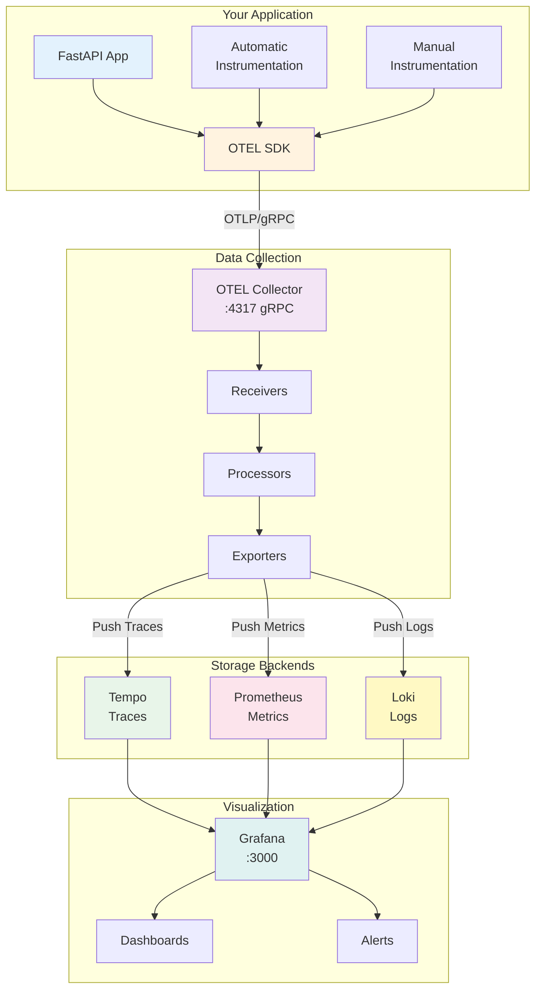
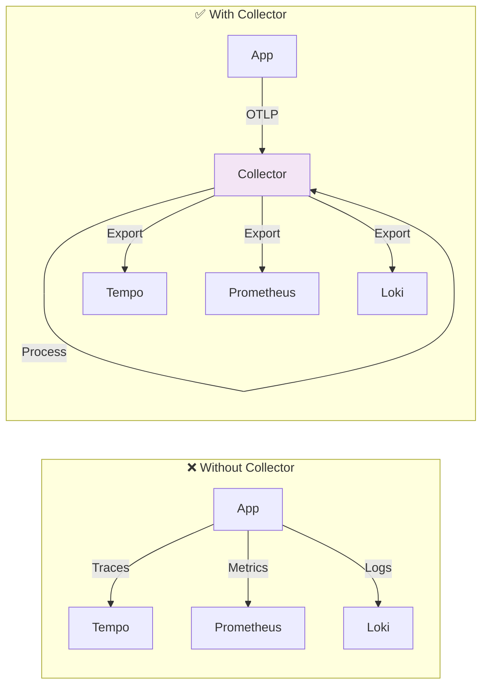
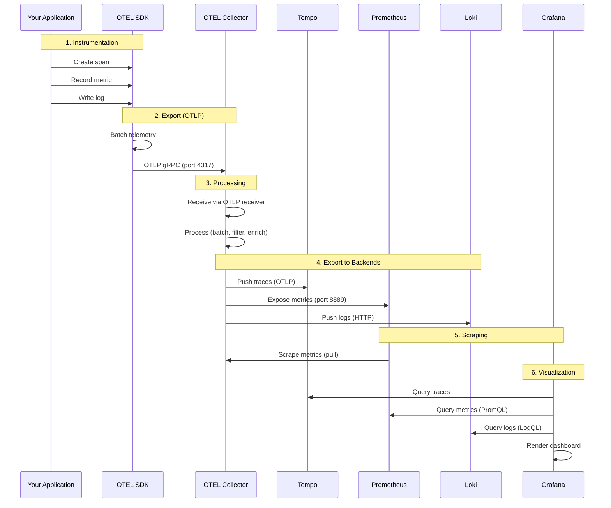

# 🔭 Observability with OpenTelemetry

_Estimated reading time: 25 minutes | Audience: Beginners to Advanced Developers_

## 📚 Table of Contents

- [🎯 What & Why Observability](#-what--why-observability)
- [🏗️ Architecture Overview for Beginners](#️-architecture-overview-for-beginners)
- [🚀 Quick Start](#-quick-start)
- [🔧 Infrastructure Setup](#-infrastructure-setup)
- [👨‍💻 Developer Implementation Guide](#-developer-implementation-guide)
- [📊 Understanding Metric Types](#-understanding-metric-types)
- [🌊 Data Flow Explained](#-data-flow-explained)
- [💡 Real-World Example](#-real-world-example)
- [🔥 Advanced Features](#-advanced-features)
- [📖 API Reference](#-api-reference)

## 🎯 What & Why Observability

**Observability** is the ability to understand what's happening inside your application by examining its outputs. The Neuroglia framework provides comprehensive observability through **OpenTelemetry integration**, supporting the three pillars:

1. **Metrics** - What's happening (counters, gauges, histograms)
2. **Tracing** - Where requests flow (distributed traces across services)
3. **Logging** - Why things happened (structured logs with trace correlation)

### Why You Need Observability

Without observability, troubleshooting distributed systems is like debugging in the dark:

- ❓ **Which service is slow?** - No visibility into request flow
- ❓ **Why did it fail?** - No correlation between logs and requests
- ❓ **Is performance degrading?** - No historical metrics
- ❓ **What's the user impact?** - No business metrics tracking

### The Problem Without Observability

```python
# ❌ Without observability - debugging is painful
@app.post("/orders")
async def create_order(data: dict):
    # Why is this slow?
    # Which service failed?
    # How many orders per minute?
    # What's the error rate?
    order = await order_service.create(data)
    return order
```

### The Solution With Observability

```python
# ✅ With observability - full visibility
from neuroglia.observability import Observability

builder = WebApplicationBuilder(app_settings)
Observability.configure(builder)  # Automatic instrumentation!

# Now you get:
# - Automatic request tracing
# - Response time metrics
# - Correlated logs with trace IDs
# - Service dependency maps
# - Error rate tracking
# - System metrics (CPU, memory)
```

## 🏗️ Architecture Overview for Beginners

### The Complete Observability Stack

Understanding the observability stack is crucial. Here's how all components work together:



### The Three Pillars Explained

#### 1. 📊 Metrics - "What is Happening?"

**Purpose**: Quantitative measurements over time

**Types**:

- **Counter**: Monotonically increasing value (e.g., total orders, requests)
- **Gauge**: Current value that can go up/down (e.g., active connections, queue size)
- **Histogram**: Distribution of values (e.g., request duration, response size)

**Example Metrics**:

```python
orders_created_total = 1,247  # Counter
active_users = 32             # Gauge
request_duration_ms = [12, 45, 23, 67, ...]  # Histogram
```

**Use Cases**:

- Monitor system health (CPU, memory, disk)
- Track business KPIs (orders/hour, revenue)
- Measure performance (latency, throughput)
- Set alerts on thresholds

#### 2. 🔍 Tracing - "Where Did the Request Go?"

**Purpose**: Track request flow across services and layers

**Key Concepts**:

- **Trace**: Complete journey of a request
- **Span**: Single operation within a trace
- **Parent/Child**: Relationships between spans

**Example Trace**:

```
Trace ID: abc123
├─ Span: HTTP POST /orders (200ms)
   ├─ Span: validate_order (10ms)
   ├─ Span: check_inventory (50ms)
   │  └─ Span: MongoDB query (40ms)
   ├─ Span: process_payment (100ms)
   │  └─ Span: HTTP POST to payment API (95ms)
   └─ Span: save_order (40ms)
      └─ Span: MongoDB insert (35ms)
```

**Use Cases**:

- Identify bottlenecks in request processing
- Debug distributed system failures
- Understand service dependencies
- Measure end-to-end latency

#### 3. � Logging - "Why Did This Happen?"

**Purpose**: Structured event records with context

**Key Features**:

- **Structured**: JSON format, not plain text
- **Trace Correlation**: Every log includes trace_id and span_id
- **Severity Levels**: DEBUG, INFO, WARNING, ERROR, CRITICAL
- **Context**: Request ID, user ID, environment

**Example Log**:

```json
{
  "timestamp": "2025-11-02T12:34:56.789Z",
  "level": "ERROR",
  "message": "Payment processing failed",
  "trace_id": "abc123",
  "span_id": "xyz789",
  "service": "mario-pizzeria",
  "environment": "production",
  "order_id": "ORD-1234",
  "error": "Insufficient funds"
}
```

**Use Cases**:

- Debug specific errors
- Audit user actions
- Correlate with traces and metrics
- Root cause analysis

### Why Use OpenTelemetry Collector?

You might wonder: "Why not send data directly to Tempo/Prometheus/Loki?"

**Benefits of OTEL Collector**:

1. **Single Integration Point**
   - Your app only talks to one endpoint (`:4317`)
   - Change backends without code changes
2. **Data Processing**
   - Filter sensitive data before export
   - Batch data for efficiency
   - Sample high-volume traces
3. **Multiple Backends**
   - Export to multiple destinations simultaneously
   - Console export for debugging + production backends
4. **Resilience**
   - Buffer data during backend outages
   - Retry failed exports
5. **Performance**
   - Offload processing from your app
   - Compress and batch data efficiently

**Direct vs Collector Architecture**:



**When to skip the collector**: Only for very simple, single-service applications in development.

## 🚀 Quick Start

### Framework-Style Configuration (Recommended)

The easiest way to enable observability is through `WebApplicationBuilder`:

```python
from neuroglia.hosting.web import WebApplicationBuilder
from neuroglia.observability import Observability, ApplicationSettingsWithObservability

# Step 1: Use settings class with observability
class PizzeriaSettings(ApplicationSettingsWithObservability):
    # Your app settings
    database_url: str = Field(default="mongodb://localhost:27017")

    # Observability settings inherited:
    # - service_name, service_version, deployment_environment
    # - otel_enabled, otel_endpoint, tracing_enabled, metrics_enabled
    # - instrument_fastapi, instrument_httpx, instrument_logging

# Step 2: Configure observability
builder = WebApplicationBuilder(PizzeriaSettings())
Observability.configure(builder)  # Uses settings automatically

# Step 3: Build and run
app = builder.build()
app.run()

# 🎉 You now have:
# - /metrics endpoint with Prometheus metrics
# - /health endpoint with service health
# - Distributed tracing to OTLP collector
# - Structured logs with trace correlation
```

### Manual Configuration (Advanced)

For fine-grained control:

```python
from neuroglia.observability import configure_opentelemetry

# Configure OpenTelemetry directly
configure_opentelemetry(
    service_name="mario-pizzeria",
    service_version="1.0.0",
    otlp_endpoint="http://otel-collector:4317",
    enable_console_export=False,  # Set True for debugging
    deployment_environment="production",

    # Instrumentation toggles
    enable_fastapi_instrumentation=True,
    enable_httpx_instrumentation=True,
    enable_logging_instrumentation=True,
    enable_system_metrics=True,

    # Performance tuning
    batch_span_processor_max_queue_size=2048,
    batch_span_processor_schedule_delay_millis=5000,
    metric_export_interval_millis=60000  # 1 minute
)
```

## 🔧 Infrastructure Setup

Before instrumenting your code, you need to provision the observability stack. This section guides you through setting up the complete infrastructure.

### Prerequisites

- Docker and Docker Compose installed
- 8GB RAM minimum (12GB recommended)
- Ports available: 3000, 3100, 3200, 4317, 4318, 8888, 9090, 9095

### Option 1: Using Docker Compose (Recommended)

The Neuroglia framework provides a complete docker-compose configuration:

```yaml
# deployment/docker-compose/docker-compose.shared.yml
version: "3.8"

services:
  # OpenTelemetry Collector - Central hub for telemetry
  otel-collector:
    image: otel/opentelemetry-collector-contrib:latest
    container_name: otel-collector
    command: ["--config=/etc/otel-collector-config.yaml"]
    volumes:
      - ../otel/otel-collector-config.yaml:/etc/otel-collector-config.yaml
    ports:
      - "4317:4317" # OTLP gRPC receiver
      - "4318:4318" # OTLP HTTP receiver
      - "8888:8888" # Prometheus metrics about collector
      - "13133:13133" # Health check endpoint
    networks:
      - observability

  # Tempo - Distributed tracing backend
  tempo:
    image: grafana/tempo:latest
    container_name: tempo
    command: ["-config.file=/etc/tempo.yaml"]
    volumes:
      - ../tempo/tempo.yaml:/etc/tempo.yaml
      - tempo-data:/tmp/tempo
    ports:
      - "3200:3200" # Tempo HTTP API
      - "9095:9095" # Tempo gRPC API
      - "4317" # OTLP gRPC receiver
    networks:
      - observability

  # Prometheus - Metrics storage and querying
  prometheus:
    image: prom/prometheus:latest
    container_name: prometheus
    command:
      - "--config.file=/etc/prometheus/prometheus.yml"
      - "--storage.tsdb.path=/prometheus"
      - "--web.console.libraries=/etc/prometheus/console_libraries"
      - "--web.console.templates=/etc/prometheus/consoles"
      - "--enable-feature=exemplar-storage" # Link metrics to traces
    volumes:
      - ../prometheus/prometheus.yml:/etc/prometheus/prometheus.yml
      - prometheus-data:/prometheus
    ports:
      - "9090:9090"
    networks:
      - observability

  # Loki - Log aggregation system
  loki:
    image: grafana/loki:latest
    container_name: loki
    command: -config.file=/etc/loki/loki-config.yaml
    volumes:
      - ../loki/loki-config.yaml:/etc/loki/loki-config.yaml
      - loki-data:/loki
    ports:
      - "3100:3100"
    networks:
      - observability

  # Grafana - Visualization and dashboards
  grafana:
    image: grafana/grafana:latest
    container_name: grafana
    environment:
      - GF_AUTH_ANONYMOUS_ENABLED=true
      - GF_AUTH_ANONYMOUS_ORG_ROLE=Admin
      - GF_FEATURE_TOGGLES_ENABLE=traceqlEditor
    volumes:
      - ../grafana/datasources:/etc/grafana/provisioning/datasources
      - ../grafana/dashboards:/etc/grafana/provisioning/dashboards
      - grafana-data:/var/lib/grafana
    ports:
      - "3000:3000"
    networks:
      - observability
    depends_on:
      - tempo
      - prometheus
      - loki

networks:
  observability:
    driver: bridge

volumes:
  tempo-data:
  prometheus-data:
  loki-data:
  grafana-data:
```

**Start the stack**:

```bash
# From project root
cd deployment/docker-compose
docker-compose -f docker-compose.shared.yml up -d

# Verify all services are running
docker-compose -f docker-compose.shared.yml ps

# Check logs
docker-compose -f docker-compose.shared.yml logs -f grafana
```

**Access the services**:

- 🎨 **Grafana**: [http://localhost:3000](http://localhost:3000)
- 📊 **Prometheus**: [http://localhost:9090](http://localhost:9090)
- 🔍 **Tempo**: [http://localhost:3200](http://localhost:3200)
- 📝 **Loki**: [http://localhost:3100](http://localhost:3100)
- 🔄 **OTEL Collector**: [http://localhost:8888/metrics](http://localhost:8888/metrics)

### Option 2: Kubernetes/Helm Deployment

For production Kubernetes deployments:

```bash
# Add Grafana helm repository
helm repo add grafana https://grafana.github.io/helm-charts
helm repo update

# Install Grafana stack
helm install observability grafana/grafana \
  --namespace observability \
  --create-namespace \
  -f deployment/helm/values.yaml
```

### Verify Infrastructure Health

```bash
# Check OTEL Collector health
curl http://localhost:13133

# Check Prometheus targets
curl http://localhost:9090/api/v1/targets

# Check Tempo readiness
curl http://localhost:3200/ready

# Check Loki readiness
curl http://localhost:3100/ready
```

### Configuration Files

#### OTEL Collector Configuration

```yaml
# deployment/otel/otel-collector-config.yaml
receivers:
  otlp:
    protocols:
      grpc:
        endpoint: 0.0.0.0:4317
      http:
        endpoint: 0.0.0.0:4318

processors:
  batch:
    timeout: 10s
    send_batch_size: 1024

  memory_limiter:
    check_interval: 1s
    limit_mib: 512

  resource:
    attributes:
      - key: deployment.environment
        from_attribute: environment
        action: upsert

exporters:
  # Traces to Tempo
  otlp/tempo:
    endpoint: tempo:4317
    tls:
      insecure: true

  # Metrics to Prometheus
  prometheus:
    endpoint: "0.0.0.0:8889"
    namespace: neuroglia

  # Logs to Loki
  loki:
    endpoint: http://loki:3100/loki/api/v1/push

  # Console for debugging
  logging:
    loglevel: debug

service:
  pipelines:
    traces:
      receivers: [otlp]
      processors: [memory_limiter, batch, resource]
      exporters: [otlp/tempo, logging]

    metrics:
      receivers: [otlp]
      processors: [memory_limiter, batch]
      exporters: [prometheus, logging]

    logs:
      receivers: [otlp]
      processors: [memory_limiter, batch]
      exporters: [loki, logging]
```

#### Grafana Data Sources

```yaml
# deployment/grafana/datasources/datasources.yml
apiVersion: 1

datasources:
  # Prometheus for metrics
  - name: Prometheus
    type: prometheus
    access: proxy
    url: http://prometheus:9090
    isDefault: true
    jsonData:
      timeInterval: 15s
      exemplarTraceIdDestinations:
        - name: trace_id
          datasourceUid: tempo

  # Tempo for traces
  - name: Tempo
    type: tempo
    access: proxy
    url: http://tempo:3200
    uid: tempo
    jsonData:
      tracesToLogs:
        datasourceUid: loki
        filterByTraceID: true
        filterBySpanID: true
      serviceMap:
        datasourceUid: prometheus

  # Loki for logs
  - name: Loki
    type: loki
    access: proxy
    url: http://loki:3100
    uid: loki
    jsonData:
      derivedFields:
        - datasourceUid: tempo
          matcherRegex: "trace_id=(\\w+)"
          name: TraceID
          url: "$${__value.raw}"
```

### Troubleshooting Infrastructure

**Problem**: OTEL Collector not receiving data

```bash
# Check collector logs
docker logs otel-collector

# Verify endpoint is accessible from your app
curl http://localhost:4317

# Check firewall rules
netstat -an | grep 4317
```

**Problem**: Grafana can't connect to data sources

```bash
# Check network connectivity
docker network inspect observability_observability

# Test Prometheus from Grafana container
docker exec grafana curl http://prometheus:9090/-/healthy

# Check datasource configuration
curl http://localhost:3000/api/datasources
```

**Problem**: High memory usage

```yaml
# Adjust OTEL Collector memory limits
processors:
  memory_limiter:
    check_interval: 1s
    limit_mib: 256 # Reduce if needed
    spike_limit_mib: 64
```

## 🏗️ Core Components

### 1. Observability Framework Integration

The `Observability` class provides framework-integrated configuration:

```python
from neuroglia.observability import Observability

# Basic configuration
Observability.configure(builder)

# With overrides
Observability.configure(
    builder,
    tracing_enabled=True,      # Override from settings
    metrics_enabled=True,      # Override from settings
    logging_enabled=True       # Override from settings
)
```

**Key Features:**

- Reads configuration from `app_settings` (must inherit from `ObservabilitySettingsMixin`)
- Configures OpenTelemetry SDK based on enabled pillars
- Registers `/metrics` and `/health` endpoints automatically
- Applies tracing middleware to CQRS handlers

### 2. Distributed Tracing

Trace requests across service boundaries with automatic span creation:

```python
from neuroglia.observability import trace_async, get_tracer, add_span_attributes

# Automatic tracing with decorator
@trace_async(name="create_order")  # Custom span name
async def create_order(order_data: dict):
    # Span automatically created and closed

    # Add custom attributes
    add_span_attributes({
        "order.id": order_data["id"],
        "order.total": order_data["total"],
        "customer.type": "premium"
    })

    # Call other services - trace propagates automatically
    await payment_service.charge(order_data["total"])
    await inventory_service.reserve(order_data["items"])

    return order

# Manual tracing for fine control
tracer = get_tracer(__name__)

async def process_payment(amount: float):
    with tracer.start_as_current_span("payment_processing") as span:
        span.set_attribute("payment.amount", amount)

        # Add events for important moments
        from neuroglia.observability import add_span_event
        add_span_event("payment_validated", {
            "validation_result": "approved"
        })

        result = await payment_gateway.charge(amount)
        span.set_attribute("payment.transaction_id", result.transaction_id)

        return result
```

### 3. Metrics Collection

Create and record metrics for monitoring:

```python
from neuroglia.observability import get_meter, create_counter, create_histogram

# Get meter for your component
meter = get_meter(__name__)

# Create metrics
order_counter = create_counter(
    meter,
    name="orders_created_total",
    description="Total number of orders created",
    unit="orders"
)

order_value_histogram = create_histogram(
    meter,
    name="order_value",
    description="Distribution of order values",
    unit="USD"
)

# Record metrics
def record_order_created(order: Order):
    order_counter.add(1, {
        "order.type": order.order_type,
        "customer.segment": order.customer_segment
    })

    order_value_histogram.record(order.total_amount, {
        "order.type": order.order_type
    })
```

**Available Metric Types:**

- **Counter**: Monotonically increasing value (e.g., total requests)
- **UpDownCounter**: Can increase or decrease (e.g., active connections)
- **Histogram**: Distribution of values (e.g., request duration)
- **ObservableGauge**: Callback-based metric (e.g., queue size)

### 4. Structured Logging with Trace Correlation

Logs automatically include trace context:

```python
from neuroglia.observability import get_logger_with_trace_context, log_with_trace
import logging

# Get logger with automatic trace correlation
logger = get_logger_with_trace_context(__name__)

async def process_order(order_id: str):
    # Logs automatically include trace_id and span_id
    logger.info(f"Processing order: {order_id}")

    try:
        result = await order_service.process(order_id)
        logger.info(f"Order processed successfully: {order_id}")
        return result
    except Exception as e:
        # Exception automatically recorded in current span
        logger.error(f"Order processing failed: {order_id}", exc_info=True)

        # Record exception in span
        from neuroglia.observability import record_exception
        record_exception(e)
        raise

# Manual trace correlation
log_with_trace(
    logger.info,
    "Custom log message",
    extra_attributes={"custom.field": "value"}
)
```

## �‍💻 Developer Implementation Guide

This section provides layer-by-layer guidance for instrumenting your Neuroglia application.

### Layer 1: API Layer (Controllers)

Controllers are automatically instrumented by FastAPI, but you can add custom attributes:

```python
from neuroglia.mvc import ControllerBase
from neuroglia.observability import add_span_attributes, add_span_event
from classy_fastapi.decorators import post

class OrdersController(ControllerBase):

    @post("/", response_model=OrderDto, status_code=201)
    async def create_order(self, dto: CreateOrderDto) -> OrderDto:
        """Create order - automatically traced by FastAPI instrumentation"""

        # Add custom attributes to the current HTTP span
        add_span_attributes({
            "order.total_amount": dto.total_amount,
            "order.item_count": len(dto.items),
            "customer.type": dto.customer_type,
            "http.route.template": "/api/orders"
        })

        # Record important events
        add_span_event("order_validation_started", {
            "validation.rules": ["amount", "items", "customer"]
        })

        # Delegate to mediator (automatically creates child spans)
        command = self.mapper.map(dto, CreateOrderCommand)
        result = await self.mediator.execute_async(command)

        add_span_event("order_created", {
            "order.id": result.data.id
        })

        return self.process(result)
```

**What you get automatically**:

- HTTP method, path, status code
- Request/response sizes
- Client IP address
- User agent
- Request duration

### Layer 2: Application Layer (Handlers)

Command and query handlers should use the `@trace_async` decorator:

```python
from neuroglia.mediation import CommandHandler
from neuroglia.observability import trace_async, get_meter, add_span_attributes

class CreateOrderHandler(CommandHandler[CreateOrderCommand, OperationResult[OrderDto]]):

    def __init__(self, order_repository, payment_service, inventory_service):
        self.order_repository = order_repository
        self.payment_service = payment_service
        self.inventory_service = inventory_service

        # Create metrics for this handler
        meter = get_meter(__name__)
        self.orders_created = meter.create_counter(
            "orders_created_total",
            description="Total orders created",
            unit="orders"
        )
        self.order_value = meter.create_histogram(
            "order_value_usd",
            description="Order value distribution",
            unit="USD"
        )

    @trace_async(name="create_order_handler")
    async def handle_async(self, command: CreateOrderCommand) -> OperationResult[OrderDto]:
        """Handle order creation with full observability"""

        # Add command details to span
        add_span_attributes({
            "command.type": "CreateOrderCommand",
            "order.customer_id": command.customer_id,
            "order.total": command.total_amount
        })

        try:
            # Each of these creates child spans automatically
            await self._validate_order(command)
            await self._check_inventory(command)
            await self._process_payment(command)

            # Create order entity
            order = Order(
                customer_id=command.customer_id,
                items=command.items,
                total_amount=command.total_amount
            )

            # Save (repository creates its own span)
            await self.order_repository.save_async(order)

            # Record metrics
            self.orders_created.add(1, {
                "customer.type": command.customer_type,
                "order.channel": "web"
            })
            self.order_value.record(command.total_amount, {
                "customer.type": command.customer_type
            })

            return self.created(self.mapper.map(order, OrderDto))

        except PaymentError as e:
            add_span_attributes({"error": True, "error.type": "payment_failed"})
            return self.bad_request(f"Payment failed: {str(e)}")

    @trace_async(name="validate_order")
    async def _validate_order(self, command: CreateOrderCommand):
        """Validation logic with its own span"""
        add_span_attributes({"validation.rules_count": 3})
        # Validation logic...

    @trace_async(name="check_inventory")
    async def _check_inventory(self, command: CreateOrderCommand):
        """Inventory check with its own span"""
        # Inventory logic...

    @trace_async(name="process_payment")
    async def _process_payment(self, command: CreateOrderCommand):
        """Payment processing with its own span"""
        # Payment logic...
```

**Key patterns**:

- Use `@trace_async` on handler methods
- Add meaningful attributes (customer_id, order_id, amounts)
- Record business metrics (orders created, revenue)
- Track errors with error attributes

### Layer 3: Domain Layer (Entities & Services)

Domain logic can be traced for complex operations:

```python
from neuroglia.data import AggregateRoot, DomainEvent
from neuroglia.observability import trace_async, add_span_attributes, add_span_event

class Order(AggregateRoot):
    """Order aggregate with observability"""

    def __init__(self, customer_id: str, items: list, total_amount: float):
        super().__init__()
        self.customer_id = customer_id
        self.items = items
        self.total_amount = total_amount
        self.status = "pending"

        # Raise domain event
        self.raise_event(OrderCreatedEvent(
            order_id=self.id,
            customer_id=customer_id,
            total_amount=total_amount
        ))

    @trace_async(name="order.validate")
    def validate(self):
        """Complex validation logic"""
        add_span_attributes({
            "order.items_count": len(self.items),
            "order.total": self.total_amount
        })

        if self.total_amount < 10:
            add_span_event("validation_failed", {
                "reason": "minimum_amount_not_met"
            })
            raise ValueError("Minimum order amount is $10")

        add_span_event("validation_passed")

    @trace_async(name="order.calculate_tax")
    def calculate_tax(self, tax_rate: float) -> float:
        """Tax calculation"""
        tax = self.total_amount * tax_rate
        add_span_attributes({
            "tax.rate": tax_rate,
            "tax.amount": tax
        })
        return tax
```

**When to trace domain logic**:

- ✅ Complex business rules
- ✅ Calculations that might be slow
- ✅ State transitions
- ❌ Simple getters/setters
- ❌ Property access

### Layer 4: Integration Layer (Repositories & External Services)

Repositories and external service calls need explicit tracing:

```python
from neuroglia.data import Repository
from neuroglia.observability import trace_async, add_span_attributes
from motor.motor_asyncio import AsyncIOMotorClient

class MongoOrderRepository(Repository[Order, str]):

    def __init__(self, mongo_client: AsyncIOMotorClient):
        self.collection = mongo_client.pizzeria.orders

    @trace_async(name="repository.save_order")
    async def save_async(self, order: Order) -> None:
        """Save order with tracing"""
        add_span_attributes({
            "db.system": "mongodb",
            "db.operation": "insert",
            "db.collection": "orders",
            "order.id": order.id
        })

        document = self._to_document(order)
        result = await self.collection.insert_one(document)

        add_span_attributes({
            "db.inserted_id": str(result.inserted_id),
            "db.success": result.acknowledged
        })

    @trace_async(name="repository.get_order")
    async def get_by_id_async(self, order_id: str) -> Optional[Order]:
        """Get order by ID with tracing"""
        add_span_attributes({
            "db.system": "mongodb",
            "db.operation": "findOne",
            "db.collection": "orders",
            "order.id": order_id
        })

        document = await self.collection.find_one({"_id": order_id})

        add_span_attributes({
            "db.found": document is not None
        })

        return self._from_document(document) if document else None
```

**HTTP Service Clients** (automatically instrumented by HTTPX):

```python
from neuroglia.integration import HttpServiceClient
from neuroglia.observability import add_span_attributes

class PaymentServiceClient:

    def __init__(self, http_client: HttpServiceClient):
        self.client = http_client

    async def process_payment(self, amount: float, card_token: str) -> PaymentResult:
        """Process payment - HTTPX automatically creates spans"""

        # HTTPX instrumentation will create a span automatically
        # But we can add context to the current span
        add_span_attributes({
            "payment.amount": amount,
            "payment.provider": "stripe"
        })

        response = await self.client.post(
            "/api/payments",
            json={
                "amount": amount,
                "card_token": card_token
            }
        )

        add_span_attributes({
            "payment.transaction_id": response.json()["transaction_id"],
            "payment.status": response.json()["status"]
        })

        return PaymentResult.from_json(response.json())
```

### Layer-Specific Metric Types

Different layers should use different metric types:

| Layer                 | Metric Type        | Examples                                                                      |
| --------------------- | ------------------ | ----------------------------------------------------------------------------- |
| **API Layer**         | Counter, Histogram | `http_requests_total`, `http_request_duration_seconds`                        |
| **Application Layer** | Counter, Histogram | `commands_executed_total`, `command_duration_seconds`                         |
| **Domain Layer**      | Counter, Gauge     | `orders_created_total`, `order_value_usd`                                     |
| **Integration Layer** | Counter, Histogram | `db_queries_total`, `db_query_duration_seconds`, `http_client_requests_total` |

## 📊 Understanding Metric Types

Choosing the right metric type is crucial for effective monitoring.

### Counter - Ever-Increasing Values

**Definition**: A cumulative metric that only increases (or resets to zero on restart).

**Use Cases**:

- Total requests
- Total orders
- Total errors
- Bytes sent/received

**Example**:

```python
from neuroglia.observability import get_meter

meter = get_meter(__name__)

# Create counter
orders_total = meter.create_counter(
    "orders_created_total",
    description="Total number of orders created since start",
    unit="orders"
)

# Increment counter
orders_total.add(1, {
    "customer.type": "premium",
    "payment.method": "credit_card"
})
```

**Visualization**: Use `rate()` or `increase()` in Prometheus to see rate of change:

```promql
# Orders per second
rate(orders_created_total[5m])

# Total orders in last hour
increase(orders_created_total[1h])
```

**When NOT to use**: For values that can decrease (use Gauge) or need percentiles (use Histogram).

### Gauge - Current Value

**Definition**: A metric that represents a value that can go up or down.

**Use Cases**:

- Current active connections
- Queue size
- Memory usage
- Temperature
- Number of items in stock

**Example**:

```python
# Create gauge
active_orders = meter.create_up_down_counter(
    "active_orders_current",
    description="Number of orders currently being processed",
    unit="orders"
)

# Increase when order starts
active_orders.add(1, {"kitchen.station": "pizza"})

# Decrease when order completes
active_orders.add(-1, {"kitchen.station": "pizza"})
```

**Visualization**: Display current value or average:

```promql
# Current active orders
active_orders_current

# Average over last 5 minutes
avg_over_time(active_orders_current[5m])
```

**When NOT to use**: For cumulative totals (use Counter) or distributions (use Histogram).

### Histogram - Distribution of Values

**Definition**: Samples observations and counts them in configurable buckets.

**Use Cases**:

- Request duration (latency)
- Response sizes
- Order values
- Queue wait times

**Example**:

```python
# Create histogram
order_value_histogram = meter.create_histogram(
    "order_value_usd",
    description="Distribution of order values",
    unit="USD"
)

# Record observations
order_value_histogram.record(45.99, {"customer.type": "regular"})
order_value_histogram.record(125.50, {"customer.type": "premium"})
order_value_histogram.record(22.00, {"customer.type": "regular"})
```

**Visualization**: Calculate percentiles and averages:

```promql
# 95th percentile order value
histogram_quantile(0.95, rate(order_value_usd_bucket[5m]))

# Average order value
rate(order_value_usd_sum[5m]) / rate(order_value_usd_count[5m])

# Orders over $100
sum(rate(order_value_usd_bucket{le="100"}[5m]))
```

**Key Benefits**:

- Calculate percentiles (p50, p95, p99)
- Understand distribution of values
- Identify outliers
- Aggregate across dimensions

**When NOT to use**: For simple counts (use Counter) or current values (use Gauge).

### Comparison Table

| Metric Type   | Direction         | Use For           | Query Functions                     |
| ------------- | ----------------- | ----------------- | ----------------------------------- |
| **Counter**   | ↗️ Only increases | Cumulative totals | `rate()`, `increase()`              |
| **Gauge**     | ↕️ Up and down    | Current values    | Direct value, `avg_over_time()`     |
| **Histogram** | 📊 Distribution   | Latency, sizes    | `histogram_quantile()`, percentiles |

### Real-World Metric Examples

```python
from neuroglia.observability import get_meter

meter = get_meter("mario.pizzeria")

# Counter: Track total pizzas made
pizzas_made = meter.create_counter(
    "pizzas_made_total",
    description="Total pizzas prepared",
    unit="pizzas"
)
pizzas_made.add(1, {"type": "margherita", "size": "large"})

# Gauge: Track current oven temperature
oven_temp = meter.create_up_down_counter(
    "oven_temperature_celsius",
    description="Current oven temperature",
    unit="celsius"
)
oven_temp.add(25, {})  # Heating up
oven_temp.add(-5, {})  # Cooling down

# Histogram: Track pizza prep time
prep_time = meter.create_histogram(
    "pizza_prep_duration_seconds",
    description="Time to prepare a pizza",
    unit="seconds"
)
prep_time.record(180, {"type": "margherita"})  # 3 minutes
prep_time.record(420, {"type": "suprema"})     # 7 minutes
```

## 🌊 Data Flow Explained

Understanding how your telemetry data flows from application to dashboard is key to troubleshooting and optimization.

### Complete Data Flow Architecture



### Step-by-Step Flow

#### Step 1: Application Instrumentation

```python
# In your application code
from neuroglia.observability import trace_async, get_meter

@trace_async(name="process_order")
async def process_order(order_id: str):
    # Creates a span
    meter = get_meter(__name__)
    counter = meter.create_counter("orders_processed")
    counter.add(1)  # Records a metric
    logger.info(f"Processing {order_id}")  # Writes a log
```

**What happens**:

1. `@trace_async` creates a span with start time
2. `counter.add()` increments a metric
3. `logger.info()` writes a structured log with trace context
4. Span ends with duration calculated

#### Step 2: OTEL SDK Batching

```python
# Configured in neuroglia.observability
configure_opentelemetry(
    batch_span_processor_max_queue_size=2048,
    batch_span_processor_schedule_delay_millis=5000,  # Export every 5s
    metric_export_interval_millis=60000  # Export every 60s
)
```

**What happens**:

1. SDK accumulates spans in memory (up to 2048)
2. Every 5 seconds, batches are exported
3. Metrics are aggregated and exported every 60 seconds
4. Logs are batched and sent with trace context

**Why batching matters**:

- Reduces network overhead
- Improves application performance
- Prevents overwhelming the collector

#### Step 3: OTEL Collector Processing

```yaml
processors:
  batch:
    timeout: 10s
    send_batch_size: 1024

  memory_limiter:
    limit_mib: 512
    spike_limit_mib: 128

  resource:
    attributes:
      - key: environment
        value: production
        action: upsert
```

**What happens**:

1. **Receiver** accepts OTLP data on port 4317
2. **Batch Processor** combines multiple signals
3. **Memory Limiter** prevents OOM crashes
4. **Resource Processor** adds common attributes
5. **Exporters** send to respective backends

**Why use collector**:

- Centralized configuration
- Data transformation and filtering
- Multiple export destinations
- Resilience and buffering

#### Step 4: Storage in Backends

**Tempo (Traces)**:

```
Trace stored as:
{
  "traceID": "abc123...",
  "spans": [
    {
      "spanID": "xyz789...",
      "name": "process_order",
      "startTime": 1699000000000,
      "duration": 1250000,  // microseconds
      "attributes": {...}
    }
  ]
}
```

**Prometheus (Metrics)**:

```
# Time-series stored as:
orders_processed_total{service="mario-pizzeria",env="prod"} 1247 @1699000000
orders_processed_total{service="mario-pizzeria",env="prod"} 1248 @1699000015
```

**Loki (Logs)**:

```
{
  "timestamp": "2025-11-02T12:34:56Z",
  "level": "INFO",
  "message": "Processing ORD-1234",
  "trace_id": "abc123",
  "span_id": "xyz789",
  "service": "mario-pizzeria"
}
```

#### Step 5: Grafana Queries and Correlation

**Trace → Metrics** (Exemplars):

```promql
# Query shows metrics with links to traces
rate(http_request_duration_seconds_bucket[5m])
# Click on data point → opens trace in Tempo
```

**Trace → Logs** (Trace ID):

```logql
# Find logs for specific trace
{service="mario-pizzeria"} | json | trace_id="abc123"
```

**Metrics → Traces** (Service Map):

```
Prometheus metrics → Tempo service map → Trace details
```

### Why This Architecture?

**Benefits**:

1. **Separation of Concerns**

   - App focuses on business logic
   - SDK handles telemetry
   - Collector handles routing

2. **Performance**

   - Batching reduces overhead
   - Async export doesn't block app
   - Collector buffers during outages

3. **Flexibility**

   - Change backends without code changes
   - Add new exporters easily
   - Test with console exporter

4. **Observability of Observability**
   - Collector exposes its own metrics
   - Monitor data flow health
   - Track export failures

### Data Flow Performance Impact

| Component                | Overhead            | Mitigation                    |
| ------------------------ | ------------------- | ----------------------------- |
| **SDK Instrumentation**  | < 1ms per span      | Use sampling for high-volume  |
| **Batching**             | Memory: ~10MB       | Configure batch sizes         |
| **Network Export**       | Async, non-blocking | Collector handles retries     |
| **Collector Processing** | CPU: 5-10%          | Scale collectors horizontally |

### Monitoring the Data Flow

```bash
# Check app is exporting
curl http://localhost:8888/metrics | grep otelcol_receiver

# Check collector is receiving
curl http://localhost:8888/metrics | grep otelcol_receiver_accepted

# Check collector is exporting
curl http://localhost:8888/metrics | grep otelcol_exporter_sent

# Check Tempo is receiving
curl http://localhost:3200/metrics | grep tempo_ingester_traces_created_total

# Check Prometheus is scraping
curl http://localhost:9090/api/v1/targets

# Check Loki is receiving
curl http://localhost:3100/metrics | grep loki_distributor_lines_received_total
```

## �💡 Real-World Example: Mario's Pizzeria

Complete observability setup for Mario's Pizzeria:

```python
# settings.py
from neuroglia.observability import ApplicationSettingsWithObservability
from pydantic import Field

class PizzeriaSettings(ApplicationSettingsWithObservability):
    # Application settings
    database_url: str = Field(default="mongodb://localhost:27017")
    redis_url: str = Field(default="redis://localhost:6379")

    # Observability settings (inherited):
    # service_name: str = "mario-pizzeria"
    # service_version: str = "1.0.0"
    # otel_enabled: bool = True
    # otel_endpoint: str = "http://otel-collector:4317"
    # tracing_enabled: bool = True
    # metrics_enabled: bool = True
    # logging_enabled: bool = True

# main.py
from neuroglia.hosting.web import WebApplicationBuilder
from neuroglia.observability import Observability

def create_app():
    # Load settings from environment
    settings = PizzeriaSettings()

    # Create builder with observability-enabled settings
    builder = WebApplicationBuilder(settings)

    # Configure core services
    Mediator.configure(builder, ["application.commands", "application.queries"])
    Mapper.configure(builder, ["application.mapping", "api.dtos"])

    # Register application services
    builder.services.add_scoped(IOrderRepository, MongoOrderRepository)
    builder.services.add_scoped(OrderService)

    # Configure observability (automatic!)
    Observability.configure(builder)

    # Add SubApp with controllers
    builder.add_sub_app(
        SubAppConfig(
            path="/api",
            name="api",
            controllers=["api.controllers"]
        )
    )

    # Build application
    app = builder.build_app_with_lifespan(
        title="Mario's Pizzeria API",
        version="1.0.0"
    )
```

    return app

# order_handler.py

from neuroglia.observability import trace_async, add_span_attributes, create_counter, get_meter
from neuroglia.mediation import CommandHandler

# Create metrics

meter = get_meter(**name**)
orders_created = create_counter(meter, "orders_created_total", "Total orders created")

class CreateOrderHandler(CommandHandler[CreateOrderCommand, OperationResult[OrderDto]]):
def **init**(
self,
order_repository: IOrderRepository,
payment_service: PaymentService,
mapper: Mapper
):
super().**init**()
self.order_repository = order_repository
self.payment_service = payment_service
self.mapper = mapper

    @trace_async(name="create_order_handler")  # Automatic tracing
    async def handle_async(self, command: CreateOrderCommand) -> OperationResult[OrderDto]:
        # Add span attributes for filtering/analysis
        add_span_attributes({
            "order.customer_id": command.customer_id,
            "order.item_count": len(command.items),
            "order.total": command.total_amount
        })

        # Create order entity
        order = Order(
            customer_id=command.customer_id,
            items=command.items,
            total_amount=command.total_amount
        )

        # Process payment (automatically traced via httpx instrumentation)
        payment_result = await self.payment_service.charge(
            command.customer_id,
            command.total_amount
        )

        if not payment_result.success:
            return self.bad_request("Payment failed")

        # Save order (MongoDB operations automatically traced)
        await self.order_repository.save_async(order)

        # Record metric
        orders_created.add(1, {
            "customer.segment": "premium" if command.total_amount > 50 else "standard"
        })

        # Return result (logs automatically include trace_id)
        self.logger.info(f"Order created successfully: {order.id}")
        return self.created(self.mapper.map(order, OrderDto))

# Run the application

if **name** == "**main**":
import uvicorn
app = create_app()

    # Uvicorn automatically instrumented via FastAPI instrumentation
    uvicorn.run(app, host="0.0.0.0", port=8000)

````

**What You Get:**

```bash
# Prometheus metrics at /metrics
curl http://localhost:8000/metrics

# Sample output:
# orders_created_total{customer_segment="premium"} 42
# orders_created_total{customer_segment="standard"} 158
# http_server_duration_milliseconds_bucket{http_route="/api/orders",http_method="POST",le="100"} 95
# http_server_active_requests{http_route="/api/orders"} 3

# Health check at /health
curl http://localhost:8000/health

# Sample output:
# {
#   "status": "healthy",
#   "service": "mario-pizzeria",
#   "version": "1.0.0",
#   "timestamp": "2024-01-15T10:30:00Z"
# }

# Traces exported to OTLP collector
# - View in Jaeger UI: http://localhost:16686
# - Each request shows full trace with:
#   - HTTP request span
#   - create_order_handler span
#   - Payment service call span
#   - MongoDB query spans
#   - Timing for each operation

# Logs with trace correlation
# [2024-01-15 10:30:00] INFO [trace_id=abc123 span_id=def456] Order created successfully: ord_789
````

## 🔧 Advanced Features

### 1. Custom Resource Attributes

Add metadata to all telemetry:

```python
from neuroglia.observability import configure_opentelemetry

configure_opentelemetry(
    service_name="mario-pizzeria",
    service_version="1.0.0",
    additional_resource_attributes={
        "deployment.region": "us-east-1",
        "deployment.zone": "zone-a",
        "environment": "production",
        "team": "backend",
        "cost_center": "engineering"
    }
)

# All traces, metrics, and logs now include these attributes
```

### 2. Custom Instrumentation

Instrument specific code sections:

```python
from neuroglia.observability import get_tracer, trace_sync

tracer = get_tracer(__name__)

# Async function tracing
@trace_async(name="complex_calculation")
async def complex_calculation(data: list):
    with tracer.start_as_current_span("data_validation"):
        validated = validate_data(data)

    with tracer.start_as_current_span("processing"):
        result = await process_data(validated)

    with tracer.start_as_current_span("persistence"):
        await save_result(result)

    return result

# Sync function tracing
@trace_sync(name="legacy_sync_function")
def legacy_function(x: int) -> int:
    return x * 2
```

### 3. Performance Tuning

Optimize for high-throughput scenarios:

```python
from neuroglia.observability import configure_opentelemetry

configure_opentelemetry(
    service_name="high-throughput-service",

    # Increase queue size for high request volume
    batch_span_processor_max_queue_size=8192,  # Default: 2048

    # Export more frequently
    batch_span_processor_schedule_delay_millis=2000,  # Default: 5000 (5s)

    # Larger export batches
    batch_span_processor_max_export_batch_size=1024,  # Default: 512

    # Metrics export every 30 seconds instead of 60
    metric_export_interval_millis=30000,
    metric_export_timeout_millis=15000
)
```

### 4. Context Propagation

Propagate trace context across service boundaries:

```python
from neuroglia.observability import add_baggage, get_baggage
import httpx

async def call_external_service():
    # Add baggage (propagates with trace)
    add_baggage("user.id", "user_123")
    add_baggage("request.priority", "high")

    # HTTPx automatically includes trace headers
    async with httpx.AsyncClient() as client:
        response = await client.post(
            "http://other-service/api/process",
            json={"data": "value"}
        )
        # Trace context automatically propagated!

# In the other service:
async def process_request():
    # Retrieve baggage
    user_id = get_baggage("user.id")  # "user_123"
    priority = get_baggage("request.priority")  # "high"
```

### 5. Selective Instrumentation

Control which components get instrumented:

```python
from pydantic import Field

class PizzeriaSettings(ApplicationSettingsWithObservability):
    # Fine-grained control over instrumentation
    otel_instrument_fastapi: bool = Field(default=True)
    otel_instrument_httpx: bool = Field(default=True)
    otel_instrument_logging: bool = Field(default=True)
    otel_instrument_system_metrics: bool = Field(default=False)  # Disable for serverless

builder = WebApplicationBuilder(settings)
Observability.configure(builder)  # Respects instrumentation flags
```

## 🧪 Testing with Observability

Test observability components in your test suite:

```python
import pytest
from neuroglia.observability import configure_opentelemetry, get_tracer, get_meter

@pytest.fixture
def observability_configured():
    """Configure observability for tests"""
    configure_opentelemetry(
        service_name="mario-pizzeria-test",
        service_version="test",
        enable_console_export=True,  # See traces in test output
        otlp_endpoint="http://localhost:4317"
    )
    yield

    from neuroglia.observability import shutdown_opentelemetry
    shutdown_opentelemetry()

@pytest.mark.asyncio
async def test_order_handler_creates_span(observability_configured):
    """Test that handler creates trace span"""
    tracer = get_tracer(__name__)

    # Execute handler
    handler = CreateOrderHandler(mock_repository, mock_payment)
    command = CreateOrderCommand(customer_id="123", items=[], total_amount=50.0)

    with tracer.start_as_current_span("test_span") as span:
        result = await handler.handle_async(command)

        # Verify span created
        assert span.is_recording()
        assert result.is_success

@pytest.mark.asyncio
async def test_metrics_recorded():
    """Test that metrics are recorded correctly"""
    meter = get_meter(__name__)
    counter = meter.create_counter("test_counter")

    # Record metric
    counter.add(1, {"test": "value"})

    # Verify (in real tests, you'd check Prometheus endpoint)
    # In tests, just verify no exceptions
    assert True
```

## ⚠️ Common Mistakes

### 1. Forgetting to Configure Before Running

```python
# ❌ Wrong - observability not configured
app = FastAPI()
uvicorn.run(app)  # No traces, no metrics

# ✅ Correct - configure during app setup
builder = WebApplicationBuilder(settings)
Observability.configure(builder)
app = builder.build()
uvicorn.run(app)  # Full observability!
```

### 2. Instrumenting Sub-Apps

```python
# ❌ Wrong - duplicate instrumentation
from neuroglia.observability import instrument_fastapi_app

app = FastAPI()
api_app = FastAPI()
app.mount("/api", api_app)

instrument_fastapi_app(app, "main")
instrument_fastapi_app(api_app, "api")  # Causes warnings!

# ✅ Correct - only instrument main app
instrument_fastapi_app(app, "main")  # Captures all endpoints
```

### 3. Missing Settings Mixin

```python
# ❌ Wrong - no observability settings
class MySettings(ApplicationSettings):
    database_url: str

builder = WebApplicationBuilder(MySettings())
Observability.configure(builder)  # Raises ValueError!

# ✅ Correct - inherit from ApplicationSettingsWithObservability
class MySettings(ApplicationSettingsWithObservability):
    database_url: str

builder = WebApplicationBuilder(MySettings())
Observability.configure(builder)  # Works!
```

## 🚫 When NOT to Use

### 1. Serverless Functions with Cold Start Sensitivity

OpenTelemetry adds ~100-200ms to cold starts. For AWS Lambda or similar:

```python
# Consider lightweight alternatives:
# - CloudWatch Logs only
# - X-Ray for tracing
# - Custom metrics to CloudWatch
```

### 2. Ultra-High Throughput Services

For services handling >100k requests/second:

```python
# Consider:
# - Sampling traces (only 1% of requests)
# - Tail-based sampling
# - Metrics-only observability
# - Custom lightweight instrumentation
```

### 3. Development/Prototyping

For quick prototypes:

```python
# Simple logging may be sufficient:
import logging
logging.basicConfig(level=logging.INFO)
logger = logging.getLogger(__name__)
logger.info("Order created")
```

## 📝 Key Takeaways

1. **Framework Integration**: Use `Observability.configure(builder)` for automatic setup
2. **Three Pillars**: Traces show flow, metrics show health, logs show details
3. **Automatic Instrumentation**: FastAPI, HTTPx, and logging instrumented by default
4. **Trace Correlation**: Logs automatically include trace_id and span_id
5. **Decorator Pattern**: Use `@trace_async()` for easy span creation
6. **Performance Aware**: Tune batch processing for your throughput needs

## 🔗 Related Documentation

- **[OpenTelemetry Integration Guide](../guides/opentelemetry-integration.md)** - Complete infrastructure setup and deployment
- **[Getting Started](../getting-started.md)** - Initial framework setup
- **[Tutorial Part 8: Observability](../tutorials/mario-pizzeria-08-observability.md)** - Step-by-step observability tutorial
- **[Application Hosting](hosting.md)** - WebApplicationBuilder integration
- **[CQRS & Mediation](simple-cqrs.md)** - Handler tracing integration
- **[Mario's Pizzeria](../mario-pizzeria.md)** - Real-world observability implementation

## 📚 API Reference

### Observability.configure()

```python
@classmethod
def configure(
    cls,
    builder: WebApplicationBuilder,
    **overrides
) -> None:
    """
    Configure comprehensive observability for the application.

    Args:
        builder: WebApplicationBuilder with app_settings
        **overrides: Optional configuration overrides
                     (tracing_enabled, metrics_enabled, logging_enabled)

    Raises:
        ValueError: If app_settings doesn't have observability configuration
    """
```

### configure_opentelemetry()

```python
def configure_opentelemetry(
    service_name: str,
    service_version: str = "unknown",
    otlp_endpoint: str = "http://localhost:4317",
    enable_console_export: bool = False,
    deployment_environment: str = "development",
    additional_resource_attributes: Optional[dict[str, str]] = None,
    enable_fastapi_instrumentation: bool = True,
    enable_httpx_instrumentation: bool = True,
    enable_logging_instrumentation: bool = True,
    enable_system_metrics: bool = False,
    batch_span_processor_max_queue_size: int = 2048,
    batch_span_processor_schedule_delay_millis: int = 5000,
    batch_span_processor_max_export_batch_size: int = 512,
    metric_export_interval_millis: int = 60000,
    metric_export_timeout_millis: int = 30000
) -> None:
    """
    Configure OpenTelemetry SDK with comprehensive observability setup.

    Initializes tracing, metrics, logging, and instrumentation.
    """
```

### @trace_async() / @trace_sync()

```python
def trace_async(name: Optional[str] = None) -> Callable:
    """
    Decorator for automatic async function tracing.

    Args:
        name: Optional span name (defaults to function name)

    Returns:
        Decorator function
    """

def trace_sync(name: Optional[str] = None) -> Callable:
    """
    Decorator for automatic sync function tracing.

    Args:
        name: Optional span name (defaults to function name)

    Returns:
        Decorator function
    """
```

### get_tracer()

```python
def get_tracer(name: str) -> Tracer:
    """
    Get a tracer instance for manual instrumentation.

    Args:
        name: Tracer name (typically __name__)

    Returns:
        OpenTelemetry Tracer instance
    """
```

### get_meter()

```python
def get_meter(name: str) -> Meter:
    """
    Get a meter instance for creating metrics.

    Args:
        name: Meter name (typically __name__)

    Returns:
        OpenTelemetry Meter instance
    """
```

### ApplicationSettingsWithObservability

```python
class ApplicationSettingsWithObservability(ApplicationSettings, ObservabilitySettingsMixin):
    """
    Base settings class with built-in observability configuration.

    Attributes:
        service_name: str = Field(default="neuroglia-service")
        service_version: str = Field(default="1.0.0")
        deployment_environment: str = Field(default="development")
        otel_enabled: bool = Field(default=True)
        otel_endpoint: str = Field(default="http://localhost:4317")
        otel_console_export: bool = Field(default=False)
        tracing_enabled: bool = Field(default=True)
        metrics_enabled: bool = Field(default=True)
        logging_enabled: bool = Field(default=True)
        instrument_fastapi: bool = Field(default=True)
        instrument_httpx: bool = Field(default=True)
        instrument_logging: bool = Field(default=True)
        instrument_system_metrics: bool = Field(default=True)
    """
```
