# 🔄 Reactive Programming

Neuroglia's reactive programming capabilities enable asynchronous event-driven architectures using Observable patterns. Built on RxPY integration, the framework provides powerful tools for handling event streams, background processing, and real-time data flows in Mario's Pizzeria and other applications.

!!! info "🔄 What You'll Learn" - Reactive patterns with AsyncRx and Observable streams - Event stream processing and subscription management  
 - Integration with background services and event sourcing - Real-time data flows in pizzeria order processing

## 🎯 Overview

Neuroglia's reactive programming system offers:

- **🌊 Observable Streams** - RxPY-based event streams for asynchronous data processing
- **🔄 AsyncRx Integration** - Bridge between async/await and reactive patterns
- **📡 Event Subscription** - Flexible subscription and disposal mechanisms
- **⚡ Real-time Processing** - Live data streams and immediate event handling
- **🏭 Background Services** - Long-running reactive processes

### Key Benefits

- **Responsiveness**: React to events as they happen with minimal latency
- **Scalability**: Handle high-throughput event streams efficiently
- **Decoupling**: Loose coupling between event producers and consumers
- **Composability**: Chain and transform event streams declaratively
- **Error Handling**: Built-in resilience and retry mechanisms

## 🏗️ Architecture Overview

```mermaid
flowchart TD
    subgraph "🔄 Reactive Layer"
        A["📡 Event Sources<br/>Domain Events, External APIs"]
        B["🌊 Observable Streams<br/>RxPY Integration"]
        C["🔄 AsyncRx Bridge<br/>Async/Await Integration"]
        D["📋 Stream Processing<br/>Filter, Map, Reduce"]
    end

    subgraph "🎯 Event Processing Pipeline"
        E["🔍 Event Filtering<br/>Business Logic"]
        F["🔄 Event Transformation<br/>Data Mapping"]
        G["🎭 Event Aggregation<br/>State Updates"]
        H["📤 Event Distribution<br/>Multiple Handlers"]
    end

    subgraph "🏭 Background Services"
        I["📊 Event Store Reconciliation<br/>Read Model Updates"]
        J["🔔 Notification Services<br/>Real-time Alerts"]
        K["📈 Analytics Processing<br/>Business Intelligence"]
        L["🧹 Maintenance Tasks<br/>Scheduled Operations"]
    end

    A --> B
    B --> C
    C --> D
    D --> E
    E --> F
    F --> G
    G --> H

    H --> I
    H --> J
    H --> K
    H --> L

    style B fill:#e1f5fe,stroke:#0277bd,stroke-width:3px
    style C fill:#f3e5f5,stroke:#7b1fa2,stroke-width:2px
    style D fill:#e8f5e8,stroke:#2e7d32,stroke-width:2px

    classDef pipeline fill:#fff3e0,stroke:#f57c00,stroke-width:2px
    class E,F,G,H pipeline

    classDef services fill:#fce4ec,stroke:#ad1457,stroke-width:2px
    class I,J,K,L services
```



## 🍕 Basic Usage in Mario's Pizzeria

### Real-time Order Processing

Let's see how Mario's Pizzeria uses reactive patterns for live order tracking:

```python
import asyncio
from typing import List, Callable
from rx.subject.subject import Subject
from rx.core.typing import Disposable
from neuroglia.reactive import AsyncRx
from neuroglia.eventing import DomainEvent
from dataclasses import dataclass
from datetime import datetime
from enum import Enum

# Domain Events for Reactive Processing
class OrderStatus(str, Enum):
    PLACED = "placed"
    CONFIRMED = "confirmed"
    COOKING = "cooking"
    READY = "ready"
    DELIVERED = "delivered"

@dataclass
class OrderStatusChangedEvent(DomainEvent):
    order_id: str
    previous_status: OrderStatus
    new_status: OrderStatus
    timestamp: datetime
    estimated_completion: datetime

@dataclass
class KitchenCapacityEvent(DomainEvent):
    available_ovens: int
    current_orders: int
    estimated_wait_minutes: int

# Reactive Order Processing Service
class ReactiveOrderProcessor:
    def __init__(self):
        # Observable streams for different event types
        self.order_status_stream = Subject()
        self.kitchen_capacity_stream = Subject()
        self.customer_notification_stream = Subject()

        # Subscription management
        self.subscriptions: List[Disposable] = []

        # Setup reactive processing pipelines
        self._setup_order_tracking()
        self._setup_kitchen_monitoring()
        self._setup_customer_notifications()

    def _setup_order_tracking(self):
        """Setup reactive order status tracking"""
        subscription = AsyncRx.subscribe(
            self.order_status_stream,
            lambda event: asyncio.create_task(self._process_order_status_change(event))
        )
        self.subscriptions.append(subscription)

    def _setup_kitchen_monitoring(self):
        """Setup reactive kitchen capacity monitoring"""
        subscription = AsyncRx.subscribe(
            self.kitchen_capacity_stream,
            lambda event: asyncio.create_task(self._update_kitchen_dashboard(event))
        )
        self.subscriptions.append(subscription)

    def _setup_customer_notifications(self):
        """Setup reactive customer notification processing"""
        subscription = AsyncRx.subscribe(
            self.customer_notification_stream,
            lambda event: asyncio.create_task(self._send_customer_update(event))
        )
        self.subscriptions.append(subscription)

    # Event Publishers
    def publish_order_status_change(self, event: OrderStatusChangedEvent):
        """Publish order status change to reactive stream"""
        self.order_status_stream.on_next(event)

        # Trigger customer notification based on status
        if event.new_status in [OrderStatus.READY, OrderStatus.DELIVERED]:
            self.customer_notification_stream.on_next(event)

    def publish_kitchen_capacity_update(self, event: KitchenCapacityEvent):
        """Publish kitchen capacity update to reactive stream"""
        self.kitchen_capacity_stream.on_next(event)

    # Event Handlers
    async def _process_order_status_change(self, event: OrderStatusChangedEvent):
        """Process order status changes reactively"""
        print(f"🔄 Processing order {event.order_id}: {event.previous_status} → {event.new_status}")

        # Update order tracking dashboard
        await self._update_order_dashboard(event)

        # Update estimated delivery times for other orders
        if event.new_status == OrderStatus.COOKING:
            await self._recalculate_delivery_estimates(event)

        # Trigger kitchen workflow updates
        if event.new_status == OrderStatus.CONFIRMED:
            await self._notify_kitchen_new_order(event)

    async def _update_kitchen_dashboard(self, event: KitchenCapacityEvent):
        """Update kitchen capacity dashboard reactively"""
        print(f"👨‍🍳 Kitchen Update: {event.available_ovens} ovens, {event.current_orders} orders")

        # Update real-time kitchen display
        await self._refresh_kitchen_display(event)

        # Adjust order acceptance if capacity is low
        if event.available_ovens == 0:
            await self._enable_queue_mode()

    async def _send_customer_update(self, event: OrderStatusChangedEvent):
        """Send customer notifications reactively"""
        print(f"📱 Notifying customer about order {event.order_id}: {event.new_status}")

        # Send SMS/email notification
        await self._send_notification(event)

        # Update customer mobile app
        await self._update_mobile_app(event)

# Example Usage
async def demonstrate_reactive_order_processing():
    """Demonstrate reactive order processing in action"""
    processor = ReactiveOrderProcessor()

    # Simulate order lifecycle events
    events = [
        OrderStatusChangedEvent(
            order_id="ORDER-123",
            previous_status=OrderStatus.PLACED,
            new_status=OrderStatus.CONFIRMED,
            timestamp=datetime.now(),
            estimated_completion=datetime.now()
        ),
        KitchenCapacityEvent(
            available_ovens=2,
            current_orders=5,
            estimated_wait_minutes=15
        ),
        OrderStatusChangedEvent(
            order_id="ORDER-123",
            previous_status=OrderStatus.CONFIRMED,
            new_status=OrderStatus.COOKING,
            timestamp=datetime.now(),
            estimated_completion=datetime.now()
        )
    ]

    # Publish events to reactive streams
    for event in events:
        if isinstance(event, OrderStatusChangedEvent):
            processor.publish_order_status_change(event)
        elif isinstance(event, KitchenCapacityEvent):
            processor.publish_kitchen_capacity_update(event)

        # Small delay to see reactive processing
        await asyncio.sleep(0.1)

    # Cleanup
    for subscription in processor.subscriptions:
        subscription.dispose()

# Run the demonstration
if __name__ == "__main__":
    asyncio.run(demonstrate_reactive_order_processing())
```

## 🌊 Event Stream Processing

### Stream Transformations and Filtering

```python
from rx import operators as ops
from typing import AsyncIterable, Dict, Any

class PizzeriaEventStreamProcessor:
    def __init__(self):
        self.order_events_stream = Subject()
        self.processed_events_stream = Subject()

        # Setup stream processing pipeline
        self._setup_event_processing_pipeline()

    def _setup_event_processing_pipeline(self):
        """Setup complex event processing with transformations"""

        # Filter and transform order events
        filtered_stream = self.order_events_stream.pipe(
            # Filter only high-priority orders
            ops.filter(lambda event: self._is_high_priority_order(event)),

            # Transform events to include additional context
            ops.map(lambda event: self._enrich_event_with_context(event)),

            # Group events by order ID
            ops.group_by(lambda event: event.order_id),

            # Buffer events for batch processing
            ops.buffer_with_time(timespan=5.0),  # 5-second windows

            # Process only non-empty buffers
            ops.filter(lambda events: len(events) > 0)
        )

        # Subscribe to processed stream
        AsyncRx.subscribe(
            filtered_stream,
            lambda events: asyncio.create_task(self._process_event_batch(events))
        )

    def _is_high_priority_order(self, event: OrderStatusChangedEvent) -> bool:
        """Filter for high-priority orders (VIP customers, large orders, etc.)"""
        # Business logic for priority determination
        return (
            hasattr(event, 'customer_tier') and event.customer_tier == 'VIP' or
            hasattr(event, 'order_value') and event.order_value > 100.0
        )

    def _enrich_event_with_context(self, event: OrderStatusChangedEvent) -> Dict[str, Any]:
        """Enrich events with additional context for processing"""
        return {
            'original_event': event,
            'processing_timestamp': datetime.now(),
            'priority_score': self._calculate_priority_score(event),
            'estimated_impact': self._estimate_kitchen_impact(event)
        }

    async def _process_event_batch(self, events: List[Dict[str, Any]]):
        """Process batched events for efficiency"""
        print(f"🔄 Processing batch of {len(events)} high-priority events")

        # Aggregate processing for better performance
        order_ids = [e['original_event'].order_id for e in events]
        await self._batch_update_order_priorities(order_ids)

        # Send consolidated notifications
        await self._send_batch_notifications(events)
```

## 🏭 Background Services with Reactive Patterns

### Event Store Reconciliation

```python
from neuroglia.hosting.abstractions import HostedService
from neuroglia.data.infrastructure.event_sourcing import EventStore
from rx.core.typing import Disposable

class ReactiveEventStoreReconciliator(HostedService):
    """Reactive service for reconciling read models from event store"""

    def __init__(self, event_store: EventStore, mediator: Mediator):
        self.event_store = event_store
        self.mediator = mediator
        self.subscription: Optional[Disposable] = None

    async def start_async(self):
        """Start reactive event store reconciliation"""
        print("🔄 Starting reactive event store reconciliation")

        # Subscribe to event store stream
        observable = await self.event_store.observe_async('$all')
        self.subscription = AsyncRx.subscribe(
            observable,
            lambda event: asyncio.create_task(self._process_event_record(event))
        )

    async def stop_async(self):
        """Stop reactive reconciliation"""
        if self.subscription:
            self.subscription.dispose()
        print("⏹️ Stopped reactive event store reconciliation")

    async def _process_event_record(self, event_record):
        """Process individual event records reactively"""
        try:
            # Deserialize domain event
            domain_event = self._deserialize_event(event_record)

            # Route to appropriate read model updaters
            if isinstance(domain_event, OrderStatusChangedEvent):
                await self._update_order_read_models(domain_event)
            elif isinstance(domain_event, KitchenCapacityEvent):
                await self._update_kitchen_read_models(domain_event)

            # Acknowledge event processing
            await event_record.ack_async()

        except Exception as ex:
            print(f"❌ Error processing event record: {ex}")
            await event_record.nack_async()

    async def _update_order_read_models(self, event: OrderStatusChangedEvent):
        """Update order-related read models"""
        # Update order status projection
        update_command = UpdateOrderProjectionCommand(
            order_id=event.order_id,
            status=event.new_status,
            timestamp=event.timestamp
        )
        await self.mediator.execute_async(update_command)

        # Update customer order history
        history_command = UpdateCustomerOrderHistoryCommand(
            order_id=event.order_id,
            status_change=event
        )
        await self.mediator.execute_async(history_command)
```

### Reactive Background Task Scheduler

```python
from apscheduler.schedulers.asyncio import AsyncIOScheduler
from rx.subject.subject import Subject

class ReactiveBackgroundTaskScheduler(HostedService):
    """Reactive background task scheduler for pizzeria operations"""

    def __init__(self, scheduler: AsyncIOScheduler):
        self.scheduler = scheduler
        self.task_request_stream = Subject()
        self.task_completion_stream = Subject()
        self.subscription: Optional[Disposable] = None

    async def start_async(self):
        """Start reactive task scheduling"""
        print("⚡ Starting reactive background task scheduler")

        self.scheduler.start()

        # Subscribe to task request stream
        self.subscription = AsyncRx.subscribe(
            self.task_request_stream,
            lambda task: asyncio.create_task(self._process_task_request(task))
        )

    async def stop_async(self):
        """Stop reactive task scheduling"""
        if self.subscription:
            self.subscription.dispose()
        self.scheduler.shutdown(wait=False)
        print("⏹️ Stopped reactive background task scheduler")

    def schedule_reactive_task(self, task_descriptor: 'TaskDescriptor'):
        """Schedule a task through reactive stream"""
        self.task_request_stream.on_next(task_descriptor)

    async def _process_task_request(self, task_descriptor: 'TaskDescriptor'):
        """Process task requests reactively"""
        try:
            # Create task instance
            task_instance = self._create_task_instance(task_descriptor)

            # Schedule with APScheduler
            job = self.scheduler.add_job(
                func=self._execute_task_with_completion_tracking,
                args=[task_instance, task_descriptor],
                trigger='date',
                run_date=task_descriptor.scheduled_time,
                id=task_descriptor.id
            )

            print(f"📅 Scheduled task {task_descriptor.name} for {task_descriptor.scheduled_time}")

        except Exception as ex:
            print(f"❌ Error scheduling task {task_descriptor.name}: {ex}")

    async def _execute_task_with_completion_tracking(self, task_instance, task_descriptor):
        """Execute task and track completion reactively"""
        try:
            # Execute the actual task
            result = await task_instance.execute_async()

            # Publish completion event
            completion_event = TaskCompletionEvent(
                task_id=task_descriptor.id,
                task_name=task_descriptor.name,
                status='completed',
                result=result,
                completed_at=datetime.now()
            )
            self.task_completion_stream.on_next(completion_event)

        except Exception as ex:
            # Publish failure event
            failure_event = TaskCompletionEvent(
                task_id=task_descriptor.id,
                task_name=task_descriptor.name,
                status='failed',
                error=str(ex),
                completed_at=datetime.now()
            )
            self.task_completion_stream.on_next(failure_event)

# Example background tasks for Mario's Pizzeria
@dataclass
class TaskDescriptor:
    id: str
    name: str
    task_type: str
    scheduled_time: datetime
    parameters: Dict[str, Any]

class InventoryCheckTask:
    """Reactive background task for inventory checking"""

    async def execute_async(self) -> Dict[str, Any]:
        """Execute inventory check with reactive notifications"""
        print("📦 Executing reactive inventory check")

        # Simulate inventory checking
        await asyncio.sleep(1)

        # Return results that can trigger other reactive processes
        return {
            'low_stock_items': ['mozzarella', 'tomato_sauce'],
            'reorder_required': True,
            'next_check_time': datetime.now() + timedelta(hours=4)
        }

class OvenMaintenanceTask:
    """Reactive background task for oven maintenance"""

    async def execute_async(self) -> Dict[str, Any]:
        """Execute oven maintenance with reactive status updates"""
        print("🔧 Executing reactive oven maintenance")

        # Simulate maintenance process
        maintenance_steps = [
            'temperature_calibration',
            'cleaning_cycle',
            'performance_test'
        ]

        results = {}
        for step in maintenance_steps:
            print(f"   Performing {step}...")
            await asyncio.sleep(0.5)  # Simulate work
            results[step] = 'completed'

        return {
            'maintenance_completed': True,
            'oven_status': 'operational',
            'next_maintenance': datetime.now() + timedelta(days=7)
        }
```

## 🧪 Testing Reactive Components

### Unit Testing Patterns

```python
import pytest
from unittest.mock import Mock, AsyncMock
from rx.subject.subject import Subject
from rx.core.typing import Disposable

class TestReactiveOrderProcessor:

    def setup_method(self):
        self.processor = ReactiveOrderProcessor()
        self.mock_notifications = []

        # Mock external dependencies
        self.processor._send_notification = AsyncMock()
        self.processor._update_mobile_app = AsyncMock()
        self.processor._refresh_kitchen_display = AsyncMock()

    @pytest.mark.asyncio
    async def test_order_status_change_triggers_processing(self):
        """Test that order status changes trigger reactive processing"""
        # Arrange
        event = OrderStatusChangedEvent(
            order_id="TEST-001",
            previous_status=OrderStatus.PLACED,
            new_status=OrderStatus.CONFIRMED,
            timestamp=datetime.now(),
            estimated_completion=datetime.now()
        )

        # Act
        self.processor.publish_order_status_change(event)
        await asyncio.sleep(0.1)  # Allow reactive processing

        # Assert
        # Verify reactive handlers were called
        assert len(self.processor.subscriptions) > 0

    @pytest.mark.asyncio
    async def test_kitchen_capacity_update_triggers_dashboard(self):
        """Test kitchen capacity updates trigger dashboard updates"""
        # Arrange
        event = KitchenCapacityEvent(
            available_ovens=1,
            current_orders=8,
            estimated_wait_minutes=25
        )

        # Act
        self.processor.publish_kitchen_capacity_update(event)
        await asyncio.sleep(0.1)  # Allow reactive processing

        # Assert
        self.processor._refresh_kitchen_display.assert_called()

    @pytest.mark.asyncio
    async def test_reactive_stream_subscription_management(self):
        """Test proper subscription lifecycle management"""
        # Arrange
        initial_subscription_count = len(self.processor.subscriptions)

        # Act - Create additional reactive subscription
        test_stream = Subject()
        test_subscription = AsyncRx.subscribe(
            test_stream,
            lambda x: asyncio.create_task(self._test_handler(x))
        )
        self.processor.subscriptions.append(test_subscription)

        # Assert
        assert len(self.processor.subscriptions) == initial_subscription_count + 1

        # Cleanup
        test_subscription.dispose()
        self.processor.subscriptions.remove(test_subscription)

        assert len(self.processor.subscriptions) == initial_subscription_count

    async def _test_handler(self, event):
        """Test event handler for reactive processing"""
        self.mock_notifications.append(event)

class TestReactiveEventStoreReconciliator:

    def setup_method(self):
        self.mock_event_store = Mock()
        self.mock_mediator = Mock()
        self.reconciliator = ReactiveEventStoreReconciliator(
            self.mock_event_store,
            self.mock_mediator
        )

    @pytest.mark.asyncio
    async def test_start_creates_subscription(self):
        """Test that starting the service creates event store subscription"""
        # Arrange
        mock_observable = Mock()
        self.mock_event_store.observe_async.return_value = mock_observable

        # Act
        await self.reconciliator.start_async()

        # Assert
        self.mock_event_store.observe_async.assert_called_once_with('$all')
        assert self.reconciliator.subscription is not None

    @pytest.mark.asyncio
    async def test_stop_disposes_subscription(self):
        """Test that stopping the service properly disposes subscription"""
        # Arrange
        mock_subscription = Mock()
        self.reconciliator.subscription = mock_subscription

        # Act
        await self.reconciliator.stop_async()

        # Assert
        mock_subscription.dispose.assert_called_once()
```

## 🎯 Real-World Integration Patterns

### 1. Event-Driven Order Pipeline

```python
class ReactiveOrderPipeline:
    """Complete reactive pipeline for order processing"""

    def __init__(self, mediator: Mediator, event_store: EventStore):
        self.mediator = mediator
        self.event_store = event_store

        # Reactive streams for different stages
        self.order_placement_stream = Subject()
        self.payment_processing_stream = Subject()
        self.kitchen_workflow_stream = Subject()
        self.delivery_tracking_stream = Subject()

        self._setup_reactive_pipeline()

    def _setup_reactive_pipeline(self):
        """Setup complete reactive order processing pipeline"""

        # Order placement → Payment processing
        AsyncRx.subscribe(
            self.order_placement_stream,
            lambda order: self.payment_processing_stream.on_next(order)
        )

        # Payment processing → Kitchen workflow
        AsyncRx.subscribe(
            self.payment_processing_stream.pipe(
                ops.filter(lambda order: order.payment_status == 'confirmed')
            ),
            lambda order: self.kitchen_workflow_stream.on_next(order)
        )

        # Kitchen workflow → Delivery tracking
        AsyncRx.subscribe(
            self.kitchen_workflow_stream.pipe(
                ops.filter(lambda order: order.status == OrderStatus.READY)
            ),
            lambda order: self.delivery_tracking_stream.on_next(order)
        )

        # Final delivery processing
        AsyncRx.subscribe(
            self.delivery_tracking_stream,
            lambda order: asyncio.create_task(self._complete_order_delivery(order))
        )

    async def process_new_order(self, order: 'Order'):
        """Process new order through reactive pipeline"""
        self.order_placement_stream.on_next(order)
```

### 2. Real-time Analytics Dashboard

```python
class ReactiveAnalyticsDashboard:
    """Reactive analytics dashboard for pizzeria metrics"""

    def __init__(self):
        self.metrics_stream = Subject()
        self.dashboard_updates = Subject()

        # Setup reactive metrics processing
        self._setup_metrics_processing()

    def _setup_metrics_processing(self):
        """Setup reactive metrics aggregation and dashboard updates"""

        # Aggregate metrics in time windows
        windowed_metrics = self.metrics_stream.pipe(
            ops.buffer_with_time(timespan=60.0),  # 1-minute windows
            ops.filter(lambda metrics: len(metrics) > 0),
            ops.map(lambda metrics: self._aggregate_metrics(metrics))
        )

        # Update dashboard reactively
        AsyncRx.subscribe(
            windowed_metrics,
            lambda aggregated: self.dashboard_updates.on_next(aggregated)
        )

        # Setup dashboard update handler
        AsyncRx.subscribe(
            self.dashboard_updates,
            lambda update: asyncio.create_task(self._update_dashboard(update))
        )

    def publish_metric(self, metric_name: str, value: float, timestamp: datetime):
        """Publish metric to reactive stream"""
        self.metrics_stream.on_next({
            'name': metric_name,
            'value': value,
            'timestamp': timestamp
        })

    async def _update_dashboard(self, aggregated_metrics):
        """Update dashboard with aggregated metrics"""
        print(f"📊 Dashboard Update: {aggregated_metrics}")
        # Update real-time dashboard, WebSocket connections, etc.
```

## 🔄 Integration with Framework Features

### Event Sourcing Integration

Reactive programming integrates seamlessly with Neuroglia's event sourcing:

```python
class ReactiveEventSourcingService:
    """Integration between reactive streams and event sourcing"""

    def __init__(self, event_store: EventStore):
        self.event_store = event_store
        self.domain_event_stream = Subject()

        # Setup event sourcing reactive pipeline
        self._setup_event_sourcing_integration()

    def _setup_event_sourcing_integration(self):
        """Integrate reactive streams with event sourcing"""

        # Process domain events reactively
        AsyncRx.subscribe(
            self.domain_event_stream,
            lambda event: asyncio.create_task(self._persist_domain_event(event))
        )

    async def _persist_domain_event(self, domain_event: DomainEvent):
        """Persist domain events and trigger read model updates"""
        # Store event in event store
        await self.event_store.append_async(
            stream_id=f"order-{domain_event.aggregate_id}",
            events=[domain_event]
        )

        # Trigger reactive read model reconciliation
        # (handled by ReactiveEventStoreReconciliator)
```

## 🚀 Dependency Injection Integration

### Configuring Reactive Services

```python
from neuroglia.hosting import WebApplicationBuilder

def configure_reactive_services(builder: WebApplicationBuilder):
    """Configure reactive programming services"""

    # Register reactive services
    builder.services.add_singleton(ReactiveOrderProcessor)
    builder.services.add_singleton(ReactiveEventStoreReconciliator)
    builder.services.add_singleton(ReactiveBackgroundTaskScheduler)
    builder.services.add_singleton(ReactiveAnalyticsDashboard)

    # Register hosted services for background processing
    builder.services.add_hosted_service(ReactiveEventStoreReconciliator)
    builder.services.add_hosted_service(ReactiveBackgroundTaskScheduler)

# Usage in application startup
def create_pizzeria_app():
    builder = WebApplicationBuilder()

    # Configure reactive services
    configure_reactive_services(builder)

    # Other configurations...

    return builder.build()
```

## 🔗 Integration Points

### Framework Integration

Reactive programming integrates with:

- **[Event Sourcing](event-sourcing.md)** - Reactive event store reconciliation
- **[CQRS & Mediation](cqrs-mediation.md)** - Reactive command/query processing
- **[Serialization](serialization.md)** - Reactive data transformation
- **[Object Mapping](object-mapping.md)** - Stream-based object conversions

## 📚 Next Steps

Explore related Neuroglia features:

- **[Event Sourcing](event-sourcing.md)** - Event store integration with reactive patterns
- **[CQRS & Mediation](cqrs-mediation.md)** - Reactive command/query handling
- **[Dependency Injection](dependency-injection.md)** - Service registration for reactive components
- **[Getting Started Guide](../guides/mario-pizzeria-tutorial.md)** - Complete reactive pizzeria implementation

---

!!! tip "🔄 Best Practice"
Use reactive programming for event-driven architectures, real-time data processing, and background services. Always properly manage subscriptions and dispose of them during application shutdown to prevent memory leaks.
