# ⚡ Redis Cache Repository

The Neuroglia framework provides high-performance distributed caching through Redis integration, enabling scalable data access patterns with advanced features like distributed locking, hash-based storage, and automatic expiration management.

## 🎯 Overview

Redis caching is essential for modern microservices that need fast data access, session management, and distributed coordination. The framework's Redis implementation provides:

- **Distributed Caching**: Shared cache across multiple service instances
- **Advanced Data Structures**: Strings, hashes, lists, sets, and sorted sets
- **Distributed Locking**: Coordination across service instances
- **Automatic Expiration**: TTL-based cache invalidation
- **Connection Pooling**: Optimized Redis connection management
- **Circuit Breaker**: Resilience against Redis unavailability

## 🏗️ Architecture

```mermaid
graph TB
    subgraph "🍕 Mario's Pizzeria Services"
        OrderService[Order Service]
        MenuService[Menu Service]
        CustomerService[Customer Service]
        InventoryService[Inventory Service]
    end

    subgraph "⚡ Redis Cache Layer"
        RedisCache[Redis Cache Repository]
        DistributedLock[Distributed Lock Manager]
        ConnectionPool[Connection Pool]
    end

    subgraph "💾 Redis Data Structures"
        Strings[String Cache]
        Hashes[Hash Storage]
        Sets[Set Operations]
        SortedSets[Sorted Sets]
    end

    subgraph "🗄️ Data Sources"
        MenuDB[(Menu Database)]
        OrderDB[(Order Database)]
        CustomerDB[(Customer Database)]
    end

    OrderService --> RedisCache
    MenuService --> RedisCache
    CustomerService --> RedisCache
    InventoryService --> RedisCache

    RedisCache --> DistributedLock
    RedisCache --> ConnectionPool

    ConnectionPool --> Strings
    ConnectionPool --> Hashes
    ConnectionPool --> Sets
    ConnectionPool --> SortedSets

    RedisCache -.->|Cache Miss| MenuDB
    RedisCache -.->|Cache Miss| OrderDB
    RedisCache -.->|Cache Miss| CustomerDB

    style RedisCache fill:#e3f2fd
    style DistributedLock fill:#ffebee
    style ConnectionPool fill:#e8f5e8
```



## 🚀 Basic Usage

### Service Registration

```python
from neuroglia.hosting.web import WebApplicationBuilder
from neuroglia.data.redis import RedisRepository, RedisConfig

def create_app():
    builder = WebApplicationBuilder()

    # Register Redis cache repository
    redis_config = RedisConfig(
        host="localhost",
        port=6379,
        db=0,
        password="your_redis_password",
        connection_pool_size=20,
        health_check_interval=30
    )

    builder.services.add_redis_repository(redis_config)

    app = builder.build()
    return app
```

### Simple Cache Operations

```python
from neuroglia.data.redis import RedisRepository
from neuroglia.dependency_injection import ServiceProviderBase
import json
from datetime import timedelta

class MenuCacheService:
    def __init__(self, service_provider: ServiceProviderBase):
        self.redis = service_provider.get_service(RedisRepository)
        self.cache_prefix = "mario_pizzeria:menu"

    async def cache_menu_item(self, item_id: str, menu_item: dict, ttl_hours: int = 24):
        """Cache a menu item with automatic expiration."""
        cache_key = f"{self.cache_prefix}:item:{item_id}"
        cache_value = json.dumps(menu_item)

        await self.redis.set_async(
            key=cache_key,
            value=cache_value,
            expiration=timedelta(hours=ttl_hours)
        )

        print(f"🍕 Cached menu item: {menu_item['name']} (expires in {ttl_hours}h)")

    async def get_cached_menu_item(self, item_id: str) -> dict:
        """Retrieve cached menu item."""
        cache_key = f"{self.cache_prefix}:item:{item_id}"

        cached_value = await self.redis.get_async(cache_key)

        if cached_value:
            return json.loads(cached_value)

        # Cache miss - load from database
        menu_item = await self.load_menu_item_from_db(item_id)
        if menu_item:
            await self.cache_menu_item(item_id, menu_item)

        return menu_item

    async def invalidate_menu_cache(self, item_id: str = None):
        """Invalidate menu cache entries."""
        if item_id:
            # Invalidate specific item
            cache_key = f"{self.cache_prefix}:item:{item_id}"
            await self.redis.delete_async(cache_key)
        else:
            # Invalidate all menu items
            pattern = f"{self.cache_prefix}:item:*"
            await self.redis.delete_pattern_async(pattern)

        print(f"🗑️ Menu cache invalidated: {item_id or 'all items'}")
```

## 📦 Hash-Based Storage

### Customer Session Management

```python
from neuroglia.data.redis import RedisHashRepository

class CustomerSessionService:
    def __init__(self, service_provider: ServiceProviderBase):
        self.redis = service_provider.get_service(RedisRepository)
        self.session_prefix = "mario_pizzeria:sessions"

    async def create_customer_session(self, customer_id: str, session_data: dict):
        """Create customer session using Redis hash."""
        session_key = f"{self.session_prefix}:{customer_id}"

        # Store session data as hash fields
        session_fields = {
            "customer_id": customer_id,
            "login_time": str(datetime.utcnow()),
            "cart_items": json.dumps(session_data.get("cart_items", [])),
            "preferences": json.dumps(session_data.get("preferences", {})),
            "last_activity": str(datetime.utcnow())
        }

        await self.redis.hset_async(session_key, session_fields)
        await self.redis.expire_async(session_key, timedelta(hours=4))  # 4-hour session

        print(f"👤 Created session for customer {customer_id}")

    async def update_customer_cart(self, customer_id: str, cart_items: list):
        """Update customer cart in session."""
        session_key = f"{self.session_prefix}:{customer_id}"

        # Update specific hash fields
        updates = {
            "cart_items": json.dumps(cart_items),
            "last_activity": str(datetime.utcnow())
        }

        await self.redis.hset_async(session_key, updates)
        print(f"🛒 Updated cart for customer {customer_id}: {len(cart_items)} items")

    async def get_customer_session(self, customer_id: str) -> dict:
        """Retrieve complete customer session."""
        session_key = f"{self.session_prefix}:{customer_id}"

        session_data = await self.redis.hgetall_async(session_key)

        if not session_data:
            return None

        # Deserialize JSON fields
        return {
            "customer_id": session_data.get("customer_id"),
            "login_time": session_data.get("login_time"),
            "cart_items": json.loads(session_data.get("cart_items", "[]")),
            "preferences": json.loads(session_data.get("preferences", "{}")),
            "last_activity": session_data.get("last_activity")
        }

    async def get_customer_cart(self, customer_id: str) -> list:
        """Get only the cart items from customer session."""
        session_key = f"{self.session_prefix}:{customer_id}"

        cart_json = await self.redis.hget_async(session_key, "cart_items")
        return json.loads(cart_json) if cart_json else []
```

## 🔒 Distributed Locking

### Order Processing Coordination

```python
from neuroglia.data.redis import DistributedLock, LockTimeoutError
import asyncio

class OrderProcessingService:
    def __init__(self, service_provider: ServiceProviderBase):
        self.redis = service_provider.get_service(RedisRepository)
        self.lock_timeout = 30  # 30 seconds

    async def process_order_safely(self, order_id: str):
        """Process order with distributed locking to prevent race conditions."""
        lock_key = f"mario_pizzeria:order_lock:{order_id}"

        async with DistributedLock(self.redis, lock_key, timeout=self.lock_timeout):
            try:
                # Critical section - only one service instance can process this order
                order = await self.get_order(order_id)

                if order.status != "pending":
                    print(f"⚠️ Order {order_id} already processed")
                    return

                # Process the order
                await self.validate_inventory(order)
                await self.charge_customer(order)
                await self.update_order_status(order_id, "processing")
                await self.notify_kitchen(order)

                print(f"✅ Order {order_id} processed successfully")

            except InventoryShortageError as e:
                await self.handle_inventory_shortage(order_id, e)
            except PaymentError as e:
                await self.handle_payment_failure(order_id, e)

    async def coordinate_inventory_update(self, ingredient_id: str, quantity_change: int):
        """Update inventory with distributed coordination."""
        lock_key = f"mario_pizzeria:inventory_lock:{ingredient_id}"

        try:
            async with DistributedLock(self.redis, lock_key, timeout=10):
                # Get current inventory
                current_stock = await self.get_ingredient_stock(ingredient_id)

                # Validate the change
                new_stock = current_stock + quantity_change
                if new_stock < 0:
                    raise InsufficientInventoryError(
                        f"Cannot reduce {ingredient_id} by {abs(quantity_change)}. "
                        f"Current stock: {current_stock}"
                    )

                # Update inventory atomically
                await self.update_ingredient_stock(ingredient_id, new_stock)

                # Update cache
                await self.cache_ingredient_stock(ingredient_id, new_stock)

                print(f"📦 Inventory updated: {ingredient_id} = {new_stock}")

        except LockTimeoutError:
            print(f"⏰ Could not acquire inventory lock for {ingredient_id}")
            raise ConcurrentUpdateError("Inventory update failed due to concurrent access")
```

### Kitchen Queue Management

```python
class KitchenQueueService:
    def __init__(self, service_provider: ServiceProviderBase):
        self.redis = service_provider.get_service(RedisRepository)
        self.queue_key = "mario_pizzeria:kitchen_queue"
        self.processing_key = "mario_pizzeria:kitchen_processing"

    async def add_order_to_queue(self, order_id: str, priority: int = 0):
        """Add order to kitchen queue with priority."""
        # Use Redis sorted set for priority queue
        order_data = {
            "order_id": order_id,
            "queued_at": datetime.utcnow().isoformat(),
            "priority": priority
        }

        await self.redis.zadd_async(
            self.queue_key,
            {json.dumps(order_data): priority}
        )

        print(f"👨‍🍳 Added order {order_id} to kitchen queue (priority: {priority})")

    async def get_next_order(self, kitchen_station_id: str) -> dict:
        """Get next order for kitchen processing with distributed coordination."""
        lock_key = f"mario_pizzeria:queue_lock"

        async with DistributedLock(self.redis, lock_key, timeout=5):
            # Get highest priority order
            orders = await self.redis.zrange_async(
                self.queue_key,
                0, 0,
                desc=True,
                withscores=True
            )

            if not orders:
                return None

            order_json, priority = orders[0]
            order_data = json.loads(order_json)

            # Move from queue to processing
            await self.redis.zrem_async(self.queue_key, order_json)

            processing_data = {
                **order_data,
                "kitchen_station": kitchen_station_id,
                "started_at": datetime.utcnow().isoformat()
            }

            await self.redis.hset_async(
                self.processing_key,
                order_data["order_id"],
                json.dumps(processing_data)
            )

            return order_data

    async def complete_order_processing(self, order_id: str):
        """Mark order processing as complete."""
        await self.redis.hdel_async(self.processing_key, order_id)
        print(f"✅ Order {order_id} processing completed")
```

## 📊 Advanced Data Structures

### Real-time Analytics with Sorted Sets

```python
class PizzaAnalyticsService:
    def __init__(self, service_provider: ServiceProviderBase):
        self.redis = service_provider.get_service(RedisRepository)
        self.analytics_prefix = "mario_pizzeria:analytics"

    async def track_popular_pizzas(self, pizza_name: str):
        """Track pizza popularity using sorted sets."""
        popularity_key = f"{self.analytics_prefix}:pizza_popularity"

        # Increment pizza order count
        await self.redis.zincrby_async(popularity_key, 1, pizza_name)

        # Keep only top 50 pizzas
        await self.redis.zremrangebyrank_async(popularity_key, 0, -51)

    async def get_top_pizzas(self, limit: int = 10) -> list:
        """Get most popular pizzas."""
        popularity_key = f"{self.analytics_prefix}:pizza_popularity"

        top_pizzas = await self.redis.zrevrange_async(
            popularity_key,
            0,
            limit - 1,
            withscores=True
        )

        return [
            {"name": pizza.decode(), "order_count": int(score)}
            for pizza, score in top_pizzas
        ]

    async def track_hourly_orders(self, hour: int):
        """Track orders per hour using hash."""
        today = datetime.now().date().isoformat()
        hourly_key = f"{self.analytics_prefix}:hourly:{today}"

        await self.redis.hincrby_async(hourly_key, str(hour), 1)
        await self.redis.expire_async(hourly_key, timedelta(days=7))  # Keep for a week

    async def get_hourly_distribution(self, date: str = None) -> dict:
        """Get order distribution by hour."""
        if not date:
            date = datetime.now().date().isoformat()

        hourly_key = f"{self.analytics_prefix}:hourly:{date}"
        hourly_data = await self.redis.hgetall_async(hourly_key)

        return {
            int(hour): int(count)
            for hour, count in hourly_data.items()
        }
```

### Set Operations for Customer Segmentation

```python
class CustomerSegmentationService:
    def __init__(self, service_provider: ServiceProviderBase):
        self.redis = service_provider.get_service(RedisRepository)
        self.segment_prefix = "mario_pizzeria:segments"

    async def add_customer_to_segment(self, customer_id: str, segment: str):
        """Add customer to marketing segment."""
        segment_key = f"{self.segment_prefix}:{segment}"
        await self.redis.sadd_async(segment_key, customer_id)

        # Set segment expiration (30 days)
        await self.redis.expire_async(segment_key, timedelta(days=30))

    async def get_segment_customers(self, segment: str) -> set:
        """Get all customers in a segment."""
        segment_key = f"{self.segment_prefix}:{segment}"
        return await self.redis.smembers_async(segment_key)

    async def find_overlapping_customers(self, segment1: str, segment2: str) -> set:
        """Find customers in both segments."""
        key1 = f"{self.segment_prefix}:{segment1}"
        key2 = f"{self.segment_prefix}:{segment2}"

        return await self.redis.sinter_async([key1, key2])

    async def create_targeted_campaign(self, segments: list, campaign_id: str):
        """Create campaign targeting multiple segments."""
        segment_keys = [f"{self.segment_prefix}:{seg}" for seg in segments]
        campaign_key = f"{self.segment_prefix}:campaign:{campaign_id}"

        # Union of all target segments
        await self.redis.sunionstore_async(campaign_key, segment_keys)

        # Campaign expires in 7 days
        await self.redis.expire_async(campaign_key, timedelta(days=7))

        target_count = await self.redis.scard_async(campaign_key)
        print(f"🎯 Campaign {campaign_id} targets {target_count} customers")

        return target_count
```

## 🛡️ Circuit Breaker and Resilience

### Resilient Cache Operations

```python
from neuroglia.data.redis import CircuitBreakerPolicy, CacheException

class ResilientMenuService:
    def __init__(self, service_provider: ServiceProviderBase):
        self.redis = service_provider.get_service(RedisRepository)
        self.circuit_breaker = CircuitBreakerPolicy(
            failure_threshold=5,
            recovery_timeout=60,
            success_threshold=3
        )
        self.fallback_cache = {}  # In-memory fallback

    @circuit_breaker.apply
    async def get_menu_with_fallback(self, menu_id: str) -> dict:
        """Get menu with circuit breaker and fallback."""
        try:
            # Try Redis cache first
            cache_key = f"mario_pizzeria:menu:{menu_id}"
            cached_menu = await self.redis.get_async(cache_key)

            if cached_menu:
                menu_data = json.loads(cached_menu)
                # Update fallback cache
                self.fallback_cache[menu_id] = menu_data
                return menu_data

            # Cache miss - load from database
            menu_data = await self.load_menu_from_database(menu_id)

            # Cache in Redis
            await self.redis.set_async(
                cache_key,
                json.dumps(menu_data),
                expiration=timedelta(hours=6)
            )

            # Update fallback cache
            self.fallback_cache[menu_id] = menu_data
            return menu_data

        except CacheException as e:
            print(f"⚠️ Redis unavailable, using fallback cache: {e}")

            # Use fallback cache
            if menu_id in self.fallback_cache:
                return self.fallback_cache[menu_id]

            # Last resort - load from database
            return await self.load_menu_from_database(menu_id)

    async def warm_fallback_cache(self):
        """Pre-load frequently accessed items into fallback cache."""
        popular_menus = ["margherita", "pepperoni", "quattro_stagioni"]

        for menu_id in popular_menus:
            try:
                menu_data = await self.get_menu_with_fallback(menu_id)
                self.fallback_cache[menu_id] = menu_data
            except Exception as e:
                print(f"Failed to warm cache for {menu_id}: {e}")
```

## 🔧 Advanced Configuration

### Connection Pool and Performance Tuning

```python
from neuroglia.data.redis import RedisConfig, ConnectionPoolConfig

def create_optimized_redis_config():
    connection_config = ConnectionPoolConfig(
        max_connections=50,
        retry_on_timeout=True,
        health_check_interval=30,

        # Connection timeouts
        socket_timeout=2.0,
        socket_connect_timeout=2.0,

        # Connection pooling
        connection_pool_class_kwargs={
            'max_connections_per_pool': 50,
            'retry_on_timeout': True,
            'socket_keepalive': True,
            'socket_keepalive_options': {},
        },

        # Cluster configuration (if using Redis Cluster)
        skip_full_coverage_check=True,
        decode_responses=True
    )

    redis_config = RedisConfig(
        host="redis://localhost:6379",
        connection_pool=connection_config,

        # Performance settings
        retry_policy={
            'retries': 3,
            'retry_delay': 0.1,
            'backoff_factor': 2,
            'max_retry_delay': 1.0
        },

        # Monitoring
        enable_metrics=True,
        metrics_prefix="mario_pizzeria_redis",

        # Security
        ssl_cert_reqs=None,
        ssl_ca_certs=None,
        ssl_keyfile=None,
        ssl_certfile=None
    )

    return redis_config
```

### Custom Serialization Strategies

```python
from neuroglia.data.redis import SerializationStrategy
import pickle
import msgpack

class CustomSerializationService:
    def __init__(self, service_provider: ServiceProviderBase):
        self.redis = service_provider.get_service(RedisRepository)

    async def cache_with_msgpack(self, key: str, data: dict):
        """Cache data using MessagePack serialization."""
        serialized = msgpack.packb(data)
        await self.redis.set_async(key, serialized)

    async def get_with_msgpack(self, key: str) -> dict:
        """Retrieve data with MessagePack deserialization."""
        serialized = await self.redis.get_async(key)
        if serialized:
            return msgpack.unpackb(serialized, raw=False)
        return None

    async def cache_complex_object(self, key: str, obj):
        """Cache complex Python objects using pickle."""
        serialized = pickle.dumps(obj)
        await self.redis.set_async(key, serialized)

    async def get_complex_object(self, key: str):
        """Retrieve complex Python objects."""
        serialized = await self.redis.get_async(key)
        if serialized:
            return pickle.loads(serialized)
        return None
```

## 🧪 Testing

### Unit Testing with Redis Mock

```python
import pytest
from unittest.mock import AsyncMock, Mock
from neuroglia.data.redis import RedisRepository

class TestMenuCacheService:

    @pytest.fixture
    def mock_redis(self):
        redis = Mock(spec=RedisRepository)
        redis.get_async = AsyncMock()
        redis.set_async = AsyncMock()
        redis.delete_async = AsyncMock()
        redis.hget_async = AsyncMock()
        redis.hset_async = AsyncMock()
        return redis

    @pytest.fixture
    def menu_service(self, mock_redis):
        service_provider = Mock()
        service_provider.get_service.return_value = mock_redis
        return MenuCacheService(service_provider)

    @pytest.mark.asyncio
    async def test_cache_menu_item(self, menu_service, mock_redis):
        """Test menu item caching."""
        menu_item = {"name": "Margherita", "price": 12.99}

        await menu_service.cache_menu_item("margherita", menu_item)

        mock_redis.set_async.assert_called_once()
        call_args = mock_redis.set_async.call_args
        assert "mario_pizzeria:menu:item:margherita" in call_args[1]["key"]

    @pytest.mark.asyncio
    async def test_cache_hit(self, menu_service, mock_redis):
        """Test successful cache retrieval."""
        cached_data = '{"name": "Margherita", "price": 12.99}'
        mock_redis.get_async.return_value = cached_data

        result = await menu_service.get_cached_menu_item("margherita")

        assert result["name"] == "Margherita"
        assert result["price"] == 12.99

    @pytest.mark.asyncio
    async def test_cache_miss(self, menu_service, mock_redis):
        """Test cache miss behavior."""
        mock_redis.get_async.return_value = None
        menu_service.load_menu_item_from_db = AsyncMock(
            return_value={"name": "Pepperoni", "price": 15.99}
        )

        result = await menu_service.get_cached_menu_item("pepperoni")

        assert result["name"] == "Pepperoni"
        # Should cache the loaded data
        mock_redis.set_async.assert_called()
```

### Integration Testing with Redis

```python
@pytest.mark.integration
class TestRedisIntegration:

    @pytest.fixture
    async def redis_repository(self):
        config = RedisConfig(
            host="redis://localhost:6379/15",  # Test database
            connection_pool_size=5
        )
        redis = RedisRepository(config)
        await redis.connect()
        yield redis
        await redis.flushdb()  # Clean up
        await redis.disconnect()

    @pytest.mark.asyncio
    async def test_distributed_locking(self, redis_repository):
        """Test distributed locking behavior."""
        lock_key = "test_lock"

        # Acquire lock
        lock = DistributedLock(redis_repository, lock_key, timeout=5)

        async with lock:
            # Lock should be held
            assert await redis_repository.exists_async(lock_key)

        # Lock should be released
        assert not await redis_repository.exists_async(lock_key)

    @pytest.mark.asyncio
    async def test_hash_operations(self, redis_repository):
        """Test Redis hash operations."""
        hash_key = "test_hash"

        # Set hash fields
        fields = {"field1": "value1", "field2": "value2"}
        await redis_repository.hset_async(hash_key, fields)

        # Get specific field
        value = await redis_repository.hget_async(hash_key, "field1")
        assert value == "value1"

        # Get all fields
        all_fields = await redis_repository.hgetall_async(hash_key)
        assert all_fields == fields
```

## 📊 Monitoring and Performance

### Cache Performance Metrics

```python
from neuroglia.data.redis import CacheMetrics

class CachePerformanceMonitor:
    def __init__(self, redis: RedisRepository):
        self.redis = redis
        self.metrics = CacheMetrics()

    async def track_cache_operation(self, operation: str, key: str, hit: bool = None):
        """Track cache operation metrics."""
        await self.metrics.increment_counter(f"cache_operations_{operation}")

        if hit is not None:
            status = "hit" if hit else "miss"
            await self.metrics.increment_counter(f"cache_{status}")
            await self.metrics.set_gauge("cache_hit_ratio", self.calculate_hit_ratio())

    async def get_performance_summary(self) -> dict:
        """Get cache performance summary."""
        return {
            "total_operations": await self.metrics.get_counter("cache_operations_total"),
            "cache_hits": await self.metrics.get_counter("cache_hit"),
            "cache_misses": await self.metrics.get_counter("cache_miss"),
            "hit_ratio": await self.metrics.get_gauge("cache_hit_ratio"),
            "active_connections": await self.redis.connection_pool.created_connections,
            "memory_usage": await self.redis.memory_usage()
        }

    def calculate_hit_ratio(self) -> float:
        """Calculate cache hit ratio."""
        hits = self.metrics.get_counter("cache_hit")
        misses = self.metrics.get_counter("cache_miss")
        total = hits + misses

        return (hits / total) if total > 0 else 0.0
```

## 🔗 Related Documentation

- [⏰ Background Task Scheduling](background-task-scheduling.md) - Distributed job coordination
- [🔧 Dependency Injection](dependency-injection.md) - Service registration patterns
- [🌐 HTTP Service Client](http-service-client.md) - External service caching
- [📊 Enhanced Model Validation](enhanced-model-validation.md) - Data validation caching
- [📁 Data Access](data-access.md) - Repository patterns

---

The Redis Cache Repository provides enterprise-grade caching capabilities that enable Mario's Pizzeria
to handle high-volume operations with optimal performance. Through distributed locking, advanced data
structures, and comprehensive resilience patterns, the system ensures reliable and scalable caching
across all service instances.
