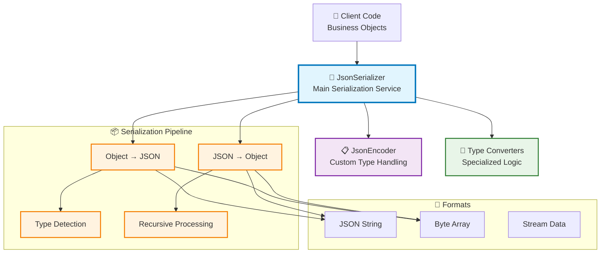

# 🔄 Serialization & Deserialization

Neuroglia provides powerful and flexible serialization capabilities for converting objects to and from various formats like JSON.
The framework includes built-in serializers with automatic type handling, custom converters, and seamless integration with the dependency injection system.

!!! info "🎯 What You'll Learn" - JSON serialization with automatic type handling - Custom serializers and converters - Integration with Mario's Pizzeria domain objects - Best practices for data transformation

## 🎯 Overview

Neuroglia's serialization system offers:

- **🔄 Automatic Type Handling** - Seamless conversion of complex objects, enums, and collections
- **📅 Built-in Type Support** - Native handling of dates, decimals, UUIDs, and custom types
- **🎨 Custom Converters** - Extensible system for specialized serialization logic
- **💉 DI Integration** - Service-based serializers with configurable lifetimes
- **🧪 Test-Friendly** - Easy mocking and testing of serialization logic

### Key Benefits

- **Type Safety**: Strongly-typed deserialization with validation
- **Performance**: Efficient JSON processing with minimal overhead
- **Flexibility**: Support for custom serialization logic and converters
- **Consistency**: Unified serialization patterns across the application

## 🏗️ Architecture Overview



## 🍕 Basic Usage in Mario's Pizzeria

### Pizza Order Serialization

Let's see how Mario's Pizzeria uses serialization for order processing:

```python
from neuroglia.serialization.json import JsonSerializer
from neuroglia.dependency_injection import ServiceCollection
from decimal import Decimal
from dataclasses import dataclass
from datetime import datetime
from enum import Enum

# Domain objects from Mario's Pizzeria
class OrderStatus(str, Enum):
    PENDING = "pending"
    COOKING = "cooking"
    READY = "ready"
    DELIVERED = "delivered"

@dataclass
class Pizza:
    id: str
    name: str
    size: str
    base_price: Decimal
    toppings: list[str]

@dataclass
class Order:
    id: str
    customer_name: str
    customer_phone: str
    pizzas: list[Pizza]
    status: OrderStatus
    order_time: datetime
    total_amount: Decimal

# Using JsonSerializer
class OrderService:
    def __init__(self, serializer: JsonSerializer):
        self.serializer = serializer

    def serialize_order(self, order: Order) -> str:
        """Convert order to JSON for storage or API responses"""
        return self.serializer.serialize_to_text(order)

    def deserialize_order(self, json_data: str) -> Order:
        """Convert JSON back to Order object"""
        return self.serializer.deserialize_from_text(json_data, Order)

# Example usage
serializer = JsonSerializer()
order = Order(
    id="order-123",
    customer_name="Mario Luigi",
    customer_phone="+1-555-PIZZA",
    pizzas=[
        Pizza("pizza-1", "Margherita", "large", Decimal("15.99"), ["basil", "mozzarella"])
    ],
    status=OrderStatus.PENDING,
    order_time=datetime.now(),
    total_amount=Decimal("17.49")
)

# Serialize to JSON
json_order = serializer.serialize_to_text(order)
print(json_order)
# Output: {"id": "order-123", "customer_name": "Mario Luigi", ...}

# Deserialize back to object
restored_order = serializer.deserialize_from_text(json_order, Order)
assert restored_order.customer_name == "Mario Luigi"
assert restored_order.status == OrderStatus.PENDING
```

## 🎨 Custom JSON Encoder

Neuroglia includes a custom `JsonEncoder` that handles special types automatically:

```python
from neuroglia.serialization.json import JsonEncoder
import json
from datetime import datetime
from decimal import Decimal
from enum import Enum

class PizzaSize(str, Enum):
    SMALL = "small"
    MEDIUM = "medium"
    LARGE = "large"

# The JsonEncoder automatically handles these types:
data = {
    "order_time": datetime.now(),       # → ISO format string
    "total_amount": Decimal("15.99"),   # → string representation
    "size": PizzaSize.LARGE,           # → enum name
    "custom_object": Pizza(...)         # → object's __dict__
}

json_string = json.dumps(data, cls=JsonEncoder)
```

### Encoder Features

The `JsonEncoder` provides:

- **DateTime Conversion**: Automatic ISO format serialization
- **Enum Handling**: Uses enum names for consistent serialization
- **Decimal Support**: Preserves precision for monetary values
- **Object Filtering**: Excludes private attributes and None values
- **Fallback Handling**: Safe string conversion for unknown types

## 🔧 Advanced Serialization Patterns

### 1. Nested Object Serialization

```python
@dataclass
class Customer:
    id: str
    name: str
    email: str
    addresses: list[Address]

@dataclass
class Address:
    street: str
    city: str
    postal_code: str

# Automatic recursive serialization
customer = Customer(
    id="cust-123",
    name="Luigi Mario",
    email="luigi@pizzeria.com",
    addresses=[
        Address("123 Main St", "Pizza City", "12345"),
        Address("456 Oak Ave", "Pepperoni Town", "67890")
    ]
)

serializer = JsonSerializer()
json_data = serializer.serialize_to_text(customer)
restored_customer = serializer.deserialize_from_text(json_data, Customer)
```

### 2. Generic Type Handling

```python
from typing import List, Dict, Optional

@dataclass
class MenuSection:
    name: str
    pizzas: List[Pizza]
    metadata: Dict[str, str]
    featured_pizza: Optional[Pizza] = None

# Serializer handles generic types automatically
menu_section = MenuSection(
    name="Classic Pizzas",
    pizzas=[margherita_pizza, pepperoni_pizza],
    metadata={"category": "traditional", "popularity": "high"},
    featured_pizza=margherita_pizza
)

# Serialization preserves type information
json_data = serializer.serialize_to_text(menu_section)
restored_section = serializer.deserialize_from_text(json_data, MenuSection)
```

### 3. Integration with Dependency Injection

```python
from neuroglia.hosting import WebApplicationBuilder

def configure_serialization(builder: WebApplicationBuilder):
    """Configure serialization services"""

    # Register JsonSerializer as singleton
    builder.services.add_singleton(JsonSerializer)

    # Use in controllers
    class OrdersController(ControllerBase):
        def __init__(self,
                     service_provider: ServiceProviderBase,
                     mapper: Mapper,
                     mediator: Mediator,
                     serializer: JsonSerializer):  # Injected automatically
            super().__init__(service_provider, mapper, mediator)
            self.serializer = serializer

        @post("/export")
        async def export_orders(self) -> str:
            """Export all orders as JSON"""
            orders = await self.get_all_orders()
            return self.serializer.serialize_to_text(orders)
```

## 🧪 Testing Serialization

### Unit Testing Patterns

```python
import pytest
from neuroglia.serialization.json import JsonSerializer

class TestPizzaOrderSerialization:

    def setup_method(self):
        self.serializer = JsonSerializer()

    def test_order_serialization_round_trip(self):
        """Test complete serialization/deserialization cycle"""
        # Arrange
        original_order = create_test_order()

        # Act
        json_data = self.serializer.serialize_to_text(original_order)
        restored_order = self.serializer.deserialize_from_text(json_data, Order)

        # Assert
        assert restored_order.id == original_order.id
        assert restored_order.customer_name == original_order.customer_name
        assert restored_order.status == original_order.status
        assert len(restored_order.pizzas) == len(original_order.pizzas)

    def test_handles_none_values_gracefully(self):
        """Test serialization with None values"""
        # Arrange
        order = Order(
            id="test-order",
            customer_name="Test Customer",
            customer_phone=None,  # None value
            pizzas=[],
            status=OrderStatus.PENDING,
            order_time=datetime.now(),
            total_amount=Decimal("0.00")
        )

        # Act & Assert
        json_data = self.serializer.serialize_to_text(order)
        restored_order = self.serializer.deserialize_from_text(json_data, Order)

        assert restored_order.customer_phone is None

    def test_decimal_precision_preserved(self):
        """Test that decimal precision is maintained"""
        # Arrange
        pizza = Pizza(
            id="test-pizza",
            name="Test Pizza",
            size="medium",
            base_price=Decimal("12.99"),
            toppings=[]
        )

        # Act
        json_data = self.serializer.serialize_to_text(pizza)
        restored_pizza = self.serializer.deserialize_from_text(json_data, Pizza)

        # Assert
        assert restored_pizza.base_price == Decimal("12.99")
        assert isinstance(restored_pizza.base_price, Decimal)
```

## 🎯 Real-World Use Cases

### 1. API Response Serialization

```python
from fastapi import FastAPI
from fastapi.responses import JSONResponse

class MenuController(ControllerBase):

    @get("/menu")
    async def get_menu(self) -> JSONResponse:
        """Get pizzeria menu as JSON"""
        menu_items = await self.get_menu_items()

        # Serialize complex menu structure
        json_data = self.serializer.serialize_to_text(menu_items)

        return JSONResponse(
            content=json_data,
            media_type="application/json"
        )
```

### 2. Event Payload Serialization

```python
from neuroglia.eventing import DomainEvent

@dataclass
class OrderPlacedEvent(DomainEvent):
    order_id: str
    customer_email: str
    order_details: Order

class OrderEventHandler:
    def __init__(self, serializer: JsonSerializer):
        self.serializer = serializer

    async def handle_order_placed(self, event: OrderPlacedEvent):
        """Handle order placed event with serialization"""

        # Serialize event for external systems
        event_json = self.serializer.serialize_to_text(event)

        # Send to message queue, webhook, etc.
        await self.send_to_external_system(event_json)

        # Log structured event data
        logger.info("Order placed", extra={
            "event_data": event_json,
            "order_id": event.order_id
        })
```

### 3. Configuration and Settings

```python
@dataclass
class PizzeriaConfig:
    name: str
    address: Address
    operating_hours: Dict[str, str]
    menu_sections: List[MenuSection]
    pricing_rules: Dict[str, Decimal]

class ConfigurationService:
    def __init__(self, serializer: JsonSerializer):
        self.serializer = serializer

    def load_config(self, config_path: str) -> PizzeriaConfig:
        """Load pizzeria configuration from JSON file"""
        with open(config_path, 'r') as f:
            json_data = f.read()

        return self.serializer.deserialize_from_text(json_data, PizzeriaConfig)

    def save_config(self, config: PizzeriaConfig, config_path: str):
        """Save pizzeria configuration to JSON file"""
        json_data = self.serializer.serialize_to_text(config)

        with open(config_path, 'w') as f:
            f.write(json_data)
```

## 🔍 Error Handling and Validation

### Robust Serialization Patterns

```python
from typing import Union
import logging

class SafeSerializationService:
    def __init__(self, serializer: JsonSerializer):
        self.serializer = serializer
        self.logger = logging.getLogger(__name__)

    def safe_serialize(self, obj: Any) -> Union[str, None]:
        """Safely serialize object with error handling"""
        try:
            return self.serializer.serialize_to_text(obj)
        except Exception as e:
            self.logger.error(f"Serialization failed for {type(obj)}: {e}")
            return None

    def safe_deserialize(self, json_data: str, target_type: Type[T]) -> Union[T, None]:
        """Safely deserialize with validation"""
        try:
            if not json_data or not json_data.strip():
                return None

            result = self.serializer.deserialize_from_text(json_data, target_type)

            # Additional validation
            if hasattr(result, 'validate'):
                result.validate()

            return result

        except json.JSONDecodeError as e:
            self.logger.error(f"Invalid JSON format: {e}")
            return None
        except Exception as e:
            self.logger.error(f"Deserialization failed: {e}")
            return None
```

## 🚀 Performance Considerations

### Optimization Tips

1. **Reuse Serializer Instances**: Register as singleton in DI container
2. **Minimize Object Creation**: Use object pooling for high-frequency serialization
3. **Stream Processing**: Use byte arrays for large data sets
4. **Selective Serialization**: Exclude unnecessary fields to reduce payload size

```python
# Performance-optimized serialization
class OptimizedOrderService:
    def __init__(self, serializer: JsonSerializer):
        self.serializer = serializer
        self._byte_buffer = bytearray(8192)  # Reusable buffer

    def serialize_order_summary(self, order: Order) -> str:
        """Serialize only essential order information"""
        summary = {
            "id": order.id,
            "customer_name": order.customer_name,
            "status": order.status.value,
            "total_amount": str(order.total_amount),
            "pizza_count": len(order.pizzas)
        }
        return self.serializer.serialize_to_text(summary)
```

## 🔗 Integration Points

### Framework Integration

Serialization integrates seamlessly with:

- **[Object Mapping](object-mapping.md)** - Automatic DTO conversion before serialization
- **[MVC Controllers](mvc-controllers.md)** - Automatic request/response serialization
- **[Event Sourcing](event-sourcing.md)** - Event payload serialization for persistence
- **[Data Access](data-access.md)** - Document serialization for MongoDB storage

## 📚 Next Steps

Explore related Neuroglia features:

- **[Object Mapping](object-mapping.md)** - Transform objects before serialization
- **[MVC Controllers](mvc-controllers.md)** - Automatic API serialization
- **[Event Sourcing](event-sourcing.md)** - Event payload handling
- **[Getting Started Guide](../guides/mario-pizzeria-tutorial.md)** - Complete pizzeria implementation

---

!!! tip "🎯 Best Practice"
Always register `JsonSerializer` as a singleton in your DI container for optimal performance and consistent behavior across your application.
