# 🚀 Getting Started with Neuroglia

Welcome to **Neuroglia** - a lightweight Python framework for building maintainable microservices using clean architecture principles.

## 🎯 What You'll Learn

This guide will take you from zero to your first working application in just a few minutes. By the end, you'll understand:

- How to install Neuroglia and create your first project
- The basics of clean architecture and why it matters
- How to build a simple CRUD API using CQRS patterns
- Where to go next for advanced features

!!! tip "New to Clean Architecture?"
Don't worry! This guide assumes no prior knowledge. We'll explain concepts as we go.

## ⚡ Quick Installation

### Prerequisites

- Python 3.11 or higher
- pip (Python package manager)
- Basic familiarity with Python and REST APIs

### Install Neuroglia

```bash
pip install neuroglia
```

That's it! Neuroglia is built on FastAPI, so it will install all necessary dependencies automatically.

## 👋 Hello World - Your First Application

Let's create the simplest possible Neuroglia application to verify everything works.

### Step 1: Create a Simple API

Create a file named `main.py`:

```python
from fastapi import FastAPI
from neuroglia.hosting.web import WebApplicationBuilder

# Create the application builder
builder = WebApplicationBuilder()

# Build the FastAPI application
app = builder.build()

# Add a simple endpoint
@app.get("/")
async def hello():
    return {"message": "Hello from Neuroglia!"}

# Run the application (if executed directly)
if __name__ == "__main__":
    app.run()
```

### Step 2: Run It

```bash
python main.py
```

### Step 3: Test It

Open your browser to [http://localhost:8080](http://localhost:8080) or use curl:

```bash
curl http://localhost:8080
# Output: {"message": "Hello from Neuroglia!"}
```

🎉 **Congratulations!** You've just built your first Neuroglia application!

!!! info "What Just Happened?"
`WebApplicationBuilder` is Neuroglia's main entry point. It sets up FastAPI with sensible defaults and provides hooks for dependency injection, middleware, and more. The `.build()` method creates the FastAPI app instance, and `.run()` starts the development server.

## 🏗️ Understanding Clean Architecture

Before we build something more complex, let's understand **why** Neuroglia enforces a specific structure.

### The Problem: Spaghetti Code

Traditional applications often mix concerns:

```python
# ❌ Everything in one place - hard to test and maintain
@app.post("/orders")
async def create_order(order_data: dict):
    # Database access mixed with business logic
    conn = psycopg2.connect("...")
    # Business validation mixed with data access
    if order_data["total"] < 0:
        raise ValueError("Invalid total")
    # HTTP concerns mixed with everything else
    cursor.execute("INSERT INTO orders...")
    return {"id": result}
```

### The Solution: Layered Architecture

Neuroglia separates your code into clear layers:

```
📁 your_project/
├── api/           # 🌐 Handles HTTP requests/responses
├── application/   # 💼 Orchestrates business operations
├── domain/        # 🏛️ Contains business rules and logic
└── integration/   # 🔌 Talks to databases and external services
```

**Key Benefit**: Each layer has one job, making code easier to test, understand, and change.

### The Dependency Rule

Dependencies only flow inward → toward the domain:

```mermaid
flowchart LR
    API[🌐 API] --> APP[💼 Application]
    APP --> DOM[🏛️ Domain]
    INT[🔌 Integration] --> DOM

    style DOM fill:#e1f5fe,stroke:#0277bd,stroke-width:3px
```



**Why This Matters**: Your business logic (Domain) never depends on HTTP, databases, or external services. This means you can:

- Test business logic without a database
- Switch from PostgreSQL to MongoDB without changing business rules
- Change API frameworks without touching core logic

## 🍕 Building a Real Application: Pizza Orders

Let's build a simple pizza ordering system to see clean architecture in action.

### Step 1: Define the Domain

The domain represents your business concepts. Create `domain/pizza_order.py`:

```python
from dataclasses import dataclass
from datetime import datetime
from uuid import uuid4

@dataclass
class PizzaOrder:
    """A pizza order - our core business entity."""
    id: str
    customer_name: str
    pizza_type: str
    size: str
    created_at: datetime

    @staticmethod
    def create(customer_name: str, pizza_type: str, size: str):
        """Factory method to create a new order."""
        return PizzaOrder(
            id=str(uuid4()),
            customer_name=customer_name,
            pizza_type=pizza_type,
            size=size,
            created_at=datetime.utcnow()
        )

    def is_valid(self) -> bool:
        """Business rule: validate order."""
        valid_sizes = ["small", "medium", "large"]
        return self.size in valid_sizes and len(self.customer_name) > 0
```

!!! note "Domain Layer"
Notice: No imports from FastAPI, no database code. Just pure Python business logic.

### Step 2: Create Commands and Queries (CQRS)

CQRS separates **write operations** (Commands) from **read operations** (Queries).

Create `application/commands.py`:

```python
from dataclasses import dataclass
from neuroglia.mediation import Command

@dataclass
class CreatePizzaOrderCommand(Command[dict]):
    """Command to create a new pizza order."""
    customer_name: str
    pizza_type: str
    size: str
```

Create `application/queries.py`:

```python
from dataclasses import dataclass
from neuroglia.mediation import Query

@dataclass
class GetPizzaOrderQuery(Query[dict]):
    """Query to retrieve a pizza order."""
    order_id: str
```

!!! info "CQRS Pattern"
Commands change state (create, update, delete). Queries read state (get, list). Separating them makes code clearer and enables advanced patterns like event sourcing.

### Step 3: Implement Handlers

Handlers contain the logic to execute commands and queries. Create `application/handlers.py`:

```python
from neuroglia.mediation import CommandHandler, QueryHandler
from application.commands import CreatePizzaOrderCommand
from application.queries import GetPizzaOrderQuery
from domain.pizza_order import PizzaOrder

# Simple in-memory storage for this example
orders_db = {}

class CreatePizzaOrderHandler(CommandHandler[CreatePizzaOrderCommand, dict]):
    """Handles creating new pizza orders."""

    async def handle_async(self, command: CreatePizzaOrderCommand) -> dict:
        # Create domain entity
        order = PizzaOrder.create(
            customer_name=command.customer_name,
            pizza_type=command.pizza_type,
            size=command.size
        )

        # Validate business rules
        if not order.is_valid():
            raise ValueError("Invalid order")

        # Store (in real app, this would use a Repository)
        orders_db[order.id] = order

        # Return result
        return {
            "id": order.id,
            "customer_name": order.customer_name,
            "pizza_type": order.pizza_type,
            "size": order.size,
            "created_at": order.created_at.isoformat()
        }


class GetPizzaOrderHandler(QueryHandler[GetPizzaOrderQuery, dict]):
    """Handles retrieving pizza orders."""

    async def handle_async(self, query: GetPizzaOrderQuery) -> dict:
        order = orders_db.get(query.order_id)
        if not order:
            return None

        return {
            "id": order.id,
            "customer_name": order.customer_name,
            "pizza_type": order.pizza_type,
            "size": order.size,
            "created_at": order.created_at.isoformat()
        }
```

### Step 4: Create API Controller

Now let's expose this via HTTP. Create `api/orders_controller.py`:

```python
from neuroglia.mvc import ControllerBase
from neuroglia.mediation import Mediator
from application.commands import CreatePizzaOrderCommand
from application.queries import GetPizzaOrderQuery
from classy_fastapi.decorators import get, post
from pydantic import BaseModel

class CreateOrderRequest(BaseModel):
    customer_name: str
    pizza_type: str
    size: str

class OrdersController(ControllerBase):
    """Pizza orders API endpoint."""

    @post("/", status_code=201)
    async def create_order(self, request: CreateOrderRequest):
        """Create a new pizza order."""
        command = CreatePizzaOrderCommand(
            customer_name=request.customer_name,
            pizza_type=request.pizza_type,
            size=request.size
        )
        result = await self.mediator.execute_async(command)
        return result

    @get("/{order_id}")
    async def get_order(self, order_id: str):
        """Retrieve a pizza order by ID."""
        query = GetPizzaOrderQuery(order_id=order_id)
        result = await self.mediator.execute_async(query)
        return result if result else {"error": "Order not found"}
```

!!! note "API Layer"
The controller is thin - it just translates HTTP requests to commands/queries and sends them to the Mediator.

### Step 5: Wire It All Together

Update your `main.py`:

```python
from neuroglia.hosting.web import WebApplicationBuilder
from application.handlers import CreatePizzaOrderHandler, GetPizzaOrderHandler
from api.orders_controller import OrdersController

# Create application builder
builder = WebApplicationBuilder()

# Register handlers
services = builder.services
services.add_singleton(CreatePizzaOrderHandler)
services.add_singleton(GetPizzaOrderHandler)

# Add mediator and controllers
services.add_mediator()
services.add_controllers([OrdersController])

# Build and configure app
app = builder.build()
app.use_controllers()

if __name__ == "__main__":
    app.run()
```

### Step 6: Test Your API

Run the application:

```bash
python main.py
```

Create an order:

```bash
curl -X POST http://localhost:8080/orders \
  -H "Content-Type: application/json" \
  -d '{"customer_name":"John","pizza_type":"Margherita","size":"large"}'
```

Response:

```json
{
  "id": "550e8400-e29b-41d4-a716-446655440000",
  "customer_name": "John",
  "pizza_type": "Margherita",
  "size": "large",
  "created_at": "2025-10-25T10:30:00"
}
```

Get the order:

```bash
curl http://localhost:8080/orders/550e8400-e29b-41d4-a716-446655440000
```

### 🎓 What You Just Built

You've created a clean architecture application with:

- ✅ **Domain Layer**: `PizzaOrder` entity with business rules
- ✅ **Application Layer**: Commands, Queries, and Handlers
- ✅ **API Layer**: REST controller using FastAPI
- ✅ **CQRS Pattern**: Separate write and read operations
- ✅ **Dependency Injection**: Automatic service resolution
- ✅ **Mediator Pattern**: Decoupled command/query execution

## 🚀 What's Next?

### For Beginners

1. **[3-Minute Bootstrap](guides/3-min-bootstrap.md)** - See more setup options
2. **[Core Concepts](concepts/index.md)** - Understand Clean Architecture, DDD, CQRS (coming soon)
3. **[Complete Tutorial](tutorials/mario-pizzeria-01-setup.md)** - Build full Mario's Pizzeria app (coming soon)

### Learn Framework Features

- **[Dependency Injection](patterns/dependency-injection.md)** - Service lifetime and registration
- **[CQRS & Mediation](features/simple-cqrs.md)** - Advanced command/query patterns
- **[MVC Controllers](features/mvc-controllers.md)** - REST API development
- **[Data Access](features/data-access.md)** - Repository pattern and persistence
- **[Event Sourcing](patterns/event-sourcing.md)** - Event-driven architecture

### Explore Advanced Topics

- **[Mario's Pizzeria Tutorial](guides/mario-pizzeria-tutorial.md)** - Complete production app
- **[Architecture Patterns](patterns/index.md)** - Deep dive into patterns
- **[Sample Applications](samples/index.md)** - More real-world examples

## 🐛 Troubleshooting

### Common Issues

**Q: Import errors when running the application**

```
ModuleNotFoundError: No module named 'neuroglia'
```

**A:** Make sure Neuroglia is installed: `pip install neuroglia`

**Q: Application won't start**

```
Address already in use
```

**A:** Port 8080 is taken. Change the port: `app.run(port=8081)`

**Q: Mediator can't find handlers**

```
No handler registered for command
```

**A:** Make sure handlers are registered with `services.add_singleton(YourHandler)` before calling `services.add_mediator()`

**Q: Module import errors in project**

```
ImportError: attempted relative import with no known parent package
```

**A:** Add your project root to `PYTHONPATH`: `export PYTHONPATH=.` or run with `python -m main`

### Getting Help

- **Documentation**: Explore [features](features/index.md) and [patterns](patterns/index.md)
- **Examples**: Check [sample applications](samples/index.md)
- **Issues**: Report bugs on [GitHub](https://github.com/bvandewe/pyneuro/issues)

## 💡 Key Takeaways

1. **Clean Architecture** separates concerns into layers with clear dependencies
2. **CQRS** separates writes (Commands) from reads (Queries)
3. **Mediator** decouples controllers from handlers
4. **Domain Layer** contains pure business logic with no external dependencies
5. **Controllers** are thin - they delegate to the application layer

!!! success "You're Ready!"
You now understand the fundamentals of Neuroglia. Continue with the [Mario's Pizzeria tutorial](guides/mario-pizzeria-tutorial.md) to build a complete production-ready application!

## 💡 Key Takeaways

1. **Clean Architecture** separates concerns into layers with clear dependencies
2. **CQRS** separates writes (Commands) from reads (Queries)
3. **Mediator** decouples controllers from handlers
4. **Domain Layer** contains pure business logic with no external dependencies
5. **Controllers** are thin - they delegate to the application layer

!!! success "You're Ready!"
You now understand the fundamentals of Neuroglia. Continue with the [Mario's Pizzeria tutorial](guides/mario-pizzeria-tutorial.md) to build a complete production-ready application!

---

## 📚 Additional Resources

### Framework Documentation

- **[Feature Documentation](features/index.md)** - Complete guide to all framework features
- **[Architecture Patterns](patterns/index.md)** - Deep dive into design patterns
- **[Sample Applications](samples/index.md)** - Real-world example applications
- **[How-To Guides](guides/index.md)** - Practical implementation guides

### External Learning Resources

#### Essential Reading

- [Clean Architecture by Robert C. Martin](https://blog.cleancoder.com/uncle-bob/2012/08/13/the-clean-architecture.html)
- [Domain-Driven Design by Eric Evans](https://domainlanguage.com/ddd/)
- [FastAPI Documentation](https://fastapi.tiangolo.com/)
- [Python Type Hints](https://docs.python.org/3/library/typing.html)

#### Recommended Books

- **Clean Code** by Robert C. Martin - Writing maintainable code
- **Implementing Domain-Driven Design** by Vaughn Vernon - Practical DDD
- **Enterprise Integration Patterns** by Gregor Hohpe - Messaging patterns
- **Building Microservices** by Sam Newman - Distributed systems

---
