# 🚀 Getting Started with Neuroglia

Welcome to **Neuroglia** - a lightweight, opinionated Python framework that enforces clean architecture principles and provides comprehensive tooling for building maintainable microservices.

Built on [FastAPI](https://fastapi.tiangolo.com/), Neuroglia emphasizes [CQRS](patterns/cqrs.md), [event-driven architecture](patterns/event-driven.md),
[dependency injection](patterns/dependency-injection.md), and [domain-driven design](patterns/domain-driven-design.md) patterns. Learn how to build [REST APIs with FastAPI integration](features/mvc-controllers.md).

!!! tip "🎯 Choose Your Learning Path"
Pick the approach that best fits your current needs and experience level.

## 🏗️ What is Neuroglia?

Neuroglia is designed around **[clean architecture principles](patterns/clean-architecture.md)** with strict separation of concerns:

### Architecture Layers

```
src/
├── api/           # 🌐 API Layer (Controllers, DTOs, Routes)
├── application/   # 💼 Application Layer (Commands, Queries, Handlers, Services)
├── domain/        # 🏛️ Domain Layer (Entities, Value Objects, Business Rules)
└── integration/   # 🔌 Integration Layer (External APIs, Repositories, Infrastructure)
```

**Learn More About Each Layer:**

- **[MVC Controllers](features/mvc-controllers.md)** - Building REST APIs and handling HTTP requests
- **[CQRS & Mediation](patterns/cqrs.md)** - Application layer command and query patterns
- **[Domain-Driven Design](patterns/domain-driven-design.md)** - Creating rich domain models and business logic
- **[Data Access](features/data-access.md)** - Repository pattern and integration layer implementation

### The Dependency Rule

**Dependencies only point inward**: API → Application → Domain ← Integration

```mermaid
flowchart TD
    API["🌐 API Layer<br/>Controllers, DTOs, Routes<br/><i>Handles HTTP requests</i>"]
    APP["💼 Application Layer<br/>Commands, Queries, Handlers<br/><i>Orchestrates business logic</i>"]
    DOM["🏛️ Domain Layer<br/>Entities, Value Objects, Business Rules<br/><i>Pure business logic</i>"]
    INT["🔌 Integration Layer<br/>Repositories, External APIs<br/><i>Infrastructure concerns</i>"]

    API -->|"depends on"| APP
    APP -->|"depends on"| DOM
    INT -->|"depends on"| DOM

    style DOM fill:#e1f5fe,stroke:#0277bd,stroke-width:3px
    style APP fill:#f3e5f5,stroke:#7b1fa2,stroke-width:2px
    style API fill:#e8f5e8,stroke:#2e7d32,stroke-width:2px
    style INT fill:#fff3e0,stroke:#f57c00,stroke-width:2px

    classDef dependencyArrow stroke:#1565c0,stroke-width:3px,color:#1565c0
```



!!! info "🎯 Key Principle"
The **Domain Layer** is at the center and has no dependencies on outer layers. This ensures business logic remains pure and testable, while outer layers can be easily swapped without affecting core functionality.

**External References:**

- [Clean Architecture by Robert C. Martin](https://blog.cleancoder.com/uncle-bob/2012/08/13/the-clean-architecture.html)
- [Domain-Driven Design by Eric Evans](https://domainlanguage.com/ddd/)
- [Hexagonal Architecture](https://alistair.cockburn.us/hexagonal-architecture/)

### Core Framework Principles

- **🎯 [CQRS Pattern](patterns/cqrs.md)** - Separate commands (write) from queries (read) for clarity and scalability
- **🏛️ [Domain-Driven Design](patterns/domain-driven-design.md)** - Business logic lives in the domain layer, isolated from infrastructure concerns
- **💉 [Dependency Injection](patterns/dependency-injection.md)** - Constructor-based DI with service lifetime management (Singleton, Scoped, Transient)
- **📡 [Event-Driven Architecture](patterns/event-driven.md)** - Domain events enable loose coupling and eventual consistency
- **🧪 [Test-First Development](guides/testing-setup.md)** - Framework designed for comprehensive unit and integration testing
- **🏷️ Consistent Naming** - Enforced [naming conventions](references/source_code_naming_convention.md) across all layers for maintainable code

## 🚀 Quick Start Options

### ⚡ 3-Minute Bootstrap

**Perfect for**: First-time framework validation, quick demos, proof of concepts

Get a "Hello World" API running in under 3 minutes to validate your environment and see Neuroglia in action.

[**👉 Start 3-Minute Bootstrap**](guides/3-min-bootstrap.md)

**What you'll get**: Simple controller, [FastAPI](https://fastapi.tiangolo.com/) integration, basic project structure

**Related:** [MVC Controllers Guide](features/mvc-controllers.md) for detailed FastAPI integration patterns

---

### 🛠️ Local Development Setup

**Perfect for**: Setting up a complete development environment, team onboarding, production-ready tooling

Configure a professional development environment with debugging, testing, linting, and database integration.

[**👉 Set Up Development Environment**](guides/local-development.md)

**What you'll get**: IDE configuration, [Docker](https://docker.com/) services, testing frameworks, debugging setup

**Related:** [Project Setup Guide](guides/project-setup.md) for comprehensive project scaffolding

---

### 🍕 Complete Tutorial: Mario's Pizzeria

**Perfect for**: Learning all framework features, building production applications, comprehensive examples

Build a complete pizza ordering system that demonstrates clean architecture, CQRS, event-driven design, authentication, and web development.

[**👉 Build Mario's Pizzeria**](guides/mario-pizzeria-tutorial.md)

**What you'll get**: Full-stack application with REST API, web UI, authentication, persistence, events

**Deep Dive Resources:**

- **[OAuth, OIDC & JWT Reference](references/oauth-oidc-jwt.md)** - Authentication implementation
- **[Event Sourcing Patterns](patterns/event-sourcing.md)** - Event-driven architecture
- **[Data Access Guide](features/data-access.md)** - Persistence and repository patterns
- **[MVC Controllers](features/mvc-controllers.md)** - REST API development

## 🔍 Framework Features Overview

| Feature                                                      | Purpose                                                                        | When to Use                                         |
| ------------------------------------------------------------ | ------------------------------------------------------------------------------ | --------------------------------------------------- |
| **[Dependency Injection](patterns/dependency-injection.md)** | Service container and lifetime management                                      | All applications - foundation for testability       |
| **[CQRS & Mediation](patterns/cqrs.md)**                     | Command/Query separation with pipeline behaviors                               | Complex business logic, cross-cutting concerns      |
| **[MVC Controllers](features/mvc-controllers.md)**           | REST API development with [FastAPI](https://fastapi.tiangolo.com/) integration | Web APIs, microservices, external interfaces        |
| **[Data Access](features/data-access.md)**                   | Repository pattern with [MongoDB](https://mongodb.com/), file storage          | Persistence, data abstraction, testing              |
| **[Event Sourcing](patterns/event-sourcing.md)**             | Event-driven architecture with domain events                                   | Complex domains, audit trails, eventual consistency |

## 📚 Documentation Structure

Deep dive into [clean architecture principles](patterns/clean-architecture.md), layer responsibilities, and design patterns used throughout Neuroglia.

**Essential Reading:** [Architecture Overview](architecture.md) for comprehensive framework design principles.

### 🚀 [Feature Documentation](features/)

Comprehensive guides for each framework feature with practical examples and best practices:

- **[Object Mapping](features/object-mapping.md)** - DTO transformations and auto-mapping
- **[Background Task Scheduling](features/background-task-scheduling.md)** - Asynchronous processing
- **[Enhanced Model Validation](features/enhanced-model-validation.md)** - Business rule validation

### 📋 [Sample Applications](samples/)

Complete, working applications that demonstrate real-world usage patterns:

- **[Mario's Pizzeria](guides/mario-pizzeria-tutorial.md)** - Complete tutorial application
- **[OpenBank](samples/openbank.md)** - Banking domain with event sourcing
- **[API Gateway](samples/api_gateway.md)** - Microservice gateway patterns
- **[Desktop Controller](samples/desktop_controller.md)** - Background services and system integration
- **[Lab Resource Manager](samples/lab-resource-manager.md)** - Watcher and reconciliation patterns

### 🛠️ [Implementation Guides](guides/)

Step-by-step tutorials for common development scenarios and project setup:

- **[3-Minute Bootstrap](guides/3-min-bootstrap.md)** - Quick start validation
- **[Local Development Setup](guides/local-development.md)** - Complete dev environment
- **[Project Setup](guides/project-setup.md)** - Project scaffolding and structure

## 🤝 Framework Philosophy

Neuroglia is **opinionated by design** to promote:

1. **Consistency** - Unified patterns across all applications
2. **Maintainability** - Clear separation of concerns and dependencies
3. **Testability** - Framework designed for comprehensive testing
4. **Productivity** - Reduce boilerplate while maintaining flexibility
5. **Quality** - Built-in patterns for error handling, logging, and monitoring

### 📏 Framework Standards

Neuroglia applications follow industry best practices and standards:

- **[Source Code Naming Conventions](references/source_code_naming_convention.md)** - Consistent naming patterns across all layers (snake_case, PascalCase, layer-specific conventions)
- **[12-Factor App Methodology](references/12-factor-app.md)** - Cloud-native application principles ([external reference](https://12factor.net/))
- **[Python Typing Guide](references/python_typing_guide.md)** - Complete guide to [type hints](https://docs.python.org/3/library/typing.html) and generic types for better code clarity and framework integration

**External Standards:**

- [PEP 8 - Python Style Guide](https://pep8.org/)
- [Python Type Hints Documentation](https://docs.python.org/3/library/typing.html)
- [FastAPI Best Practices](https://fastapi.tiangolo.com/tutorial/)

## 🚀 Ready to Start?

Choose your path:

- **New to the framework?** → [⚡ 3-Minute Bootstrap](guides/3-min-bootstrap.md)
- **Setting up your environment?** → [🛠️ Development Setup](guides/local-development.md)
- **Want to build something real?** → [🍕 Mario's Pizzeria Tutorial](guides/mario-pizzeria-tutorial.md)
- **Need architectural context?** → [🏛️ Architecture Guide](architecture.md)
- **Looking for specific features?** → [📚 Feature Documentation](features/index.md)
- **Want real-world examples?** → [🔬 Sample Applications](samples/index.md)
- **Need design patterns?** → [⚙️ Pattern Documentation](patterns/index.md)

**External Resources:**

- [FastAPI Documentation](https://fastapi.tiangolo.com/) - Framework foundation
- [Python Official Documentation](https://docs.python.org/3/) - Language reference
- [Clean Architecture Blog](https://blog.cleancoder.com/uncle-bob/2012/08/13/the-clean-architecture.html) - Architecture principles

## 📚 Recommended Readings

Expand your knowledge with these essential resources that complement the Neuroglia framework:

### 📖 Clean Code & Architecture

- **[Clean Code](https://www.amazon.com/Clean-Code-Handbook-Software-Craftsmanship/dp/0132350884)** by Robert C. Martin - Writing readable, maintainable code
- **[Clean Architecture](https://www.amazon.com/Clean-Architecture-Craftsmans-Software-Structure/dp/0134494164)** by Robert C. Martin - System design and architecture principles
- **[Refactoring](https://martinfowler.com/books/refactoring.html)** by Martin Fowler - Improving code structure without changing behavior
- **[Design Patterns](https://www.amazon.com/Design-Patterns-Elements-Reusable-Object-Oriented/dp/0201633612)** by Gang of Four - Essential software design patterns

### 🏗️ Domain-Driven Design (DDD)

- **[Domain-Driven Design](https://www.amazon.com/Domain-Driven-Design-Tackling-Complexity-Software/dp/0321125215)** by Eric Evans - The foundational DDD book
- **[Implementing Domain-Driven Design](https://www.amazon.com/Implementing-Domain-Driven-Design-Vaughn-Vernon/dp/0321834577)** by Vaughn Vernon - Practical DDD implementation
- **[DDD Reference](https://www.domainlanguage.com/wp-content/uploads/2016/05/DDD_Reference_2015-03.pdf)** by Eric Evans - Quick DDD concepts reference (PDF)
- **[Domain Modeling Made Functional](https://pragprog.com/titles/swdddf/domain-modeling-made-functional/)** by Scott Wlaschin - DDD with functional programming concepts

### 🎯 CQRS & Event Sourcing

- **[CQRS Journey](<https://docs.microsoft.com/en-us/previous-versions/msp-n-p/jj554200(v=pandp.10)>)** by Microsoft - Comprehensive CQRS guide
- **[Event Sourcing](https://martinfowler.com/eaaDev/EventSourcing.html)** by Martin Fowler - Event sourcing patterns and concepts
- **[Versioning in an Event Sourced System](https://leanpub.com/esversioning)** by Greg Young - Handling evolution in event-sourced systems
- **[Building Microservices](https://www.amazon.com/Building-Microservices-Designing-Fine-Grained-Systems/dp/1491950358)** by Sam Newman - Distributed system design patterns

### ⚡ Event-Driven Architecture

- **[Enterprise Integration Patterns](https://www.enterpriseintegrationpatterns.com/)** by Gregor Hohpe - Messaging and integration patterns
- **[Reactive Systems](https://www.reactivemanifesto.org/)** - The Reactive Manifesto principles
- **[Designing Event-Driven Systems](https://www.confluent.io/designing-event-driven-systems/)** by Ben Stopford - Modern event streaming architectures
- **[Building Event-Driven Microservices](https://www.amazon.com/Building-Event-Driven-Microservices-Leveraging-Organizational/dp/1492057894)** by Adam Bellemare - Practical event-driven design

### 🐍 Python Best Practices

- **[Effective Python](https://effectivepython.com/)** by Brett Slatkin - Advanced Python techniques and idioms
- **[Python Tricks](https://realpython.com/python-tricks/)** by Dan Bader - Intermediate Python best practices
- **[Architecture Patterns with Python](https://www.cosmicpython.com/)** by Harry Percival & Bob Gregory - Python architecture patterns
- **[FastAPI Documentation](https://fastapi.tiangolo.com/)** - Modern Python web framework (used by Neuroglia)

### 🧪 Testing & Quality

- **[Test Driven Development](https://www.amazon.com/Test-Driven-Development-Kent-Beck/dp/0321146530)** by Kent Beck - TDD fundamentals and practices
- **[Growing Object-Oriented Software](http://www.growing-object-oriented-software.com/)** by Steve Freeman - TDD with mock objects
- **[The Pragmatic Programmer](https://pragprog.com/titles/tpp20/the-pragmatic-programmer-20th-anniversary-edition/)** by Andy Hunt & Dave Thomas - Software development best practices
- **[Clean Code in Python](https://www.packtpub.com/product/clean-code-in-python/9781788835831)** by Mariano Anaya - Python-specific clean coding techniques

### 🌐 Web Development & APIs

- **[RESTful Web APIs](http://restfulwebapis.org/)** by Leonard Richardson - REST API design principles
- **[API Design Patterns](https://www.manning.com/books/api-design-patterns)** by JJ Geewax - Modern API design patterns
- **[OAuth 2 in Action](https://www.manning.com/books/oauth-2-in-action)** by Justin Richer - OAuth and OpenID Connect security
- **[HTTP: The Definitive Guide](https://www.amazon.com/HTTP-Definitive-Guide-Guides/dp/1565925092)** by David Gourley - Deep dive into HTTP protocol

### 📊 DevOps & Deployment

- **[The Phoenix Project](https://www.amazon.com/Phoenix-Project-DevOps-Helping-Business/dp/0988262592)** by Gene Kim - DevOps principles through narrative
- **[Infrastructure as Code](https://www.manning.com/books/infrastructure-as-code)** by Kief Morris - Managing infrastructure programmatically
- **[Docker Deep Dive](https://www.amazon.com/Docker-Deep-Dive-Nigel-Poulton/dp/1521822808)** by Nigel Poulton - Container technology mastery
- **[Kubernetes in Action](https://www.manning.com/books/kubernetes-in-action)** by Marko Luksa - Container orchestration

---

!!! info "💡 Framework Consistency"
All documentation examples use the **[Mario's Pizzeria](guides/mario-pizzeria-tutorial.md)** domain for consistency - once you complete the tutorial, you'll feel at home with any advanced feature documentation.

**See Mario's Pizzeria Throughout the Docs:**

- [Object Mapping Examples](features/object-mapping.md#basic-usage-in-marios-pizzeria)
- [CQRS Pattern Implementation](patterns/cqrs.md#marios-pizzeria-example)
- [Repository Pattern Usage](features/data-access.md#marios-pizzeria-repositories)
