# 🚀 Getting Started with Neuroglia

Welcome to **Neuroglia** - a lightweight, opinionated Python framework that enforces clean architecture principles and provides comprehensive tooling for building maintainable microservices.

Built on FastAPI, Neuroglia emphasizes CQRS, event-driven architecture, dependency injection, and domain-driven design patterns.

!!! tip "🎯 Choose Your Learning Path"
Pick the approach that best fits your current needs and experience level.

## 🏗️ What is Neuroglia?

Neuroglia is designed around **clean architecture principles** with strict separation of concerns:

### Architecture Layers

```
src/
├── api/           # 🌐 API Layer (Controllers, DTOs, Routes)
├── application/   # 💼 Application Layer (Commands, Queries, Handlers, Services)
├── domain/        # 🏛️ Domain Layer (Entities, Value Objects, Business Rules)
└── integration/   # 🔌 Integration Layer (External APIs, Repositories, Infrastructure)
```

### The Dependency Rule

**Dependencies only point inward**: API → Application → Domain ← Integration

```mermaid
flowchart TD
    API["🌐 API Layer<br/>Controllers, DTOs, Routes<br/><i>Handles HTTP requests</i>"]
    APP["💼 Application Layer<br/>Commands, Queries, Handlers<br/><i>Orchestrates business logic</i>"]
    DOM["🏛️ Domain Layer<br/>Entities, Value Objects, Business Rules<br/><i>Pure business logic</i>"]
    INT["🔌 Integration Layer<br/>Repositories, External APIs<br/><i>Infrastructure concerns</i>"]

    API -->|"depends on"| APP
    APP -->|"depends on"| DOM
    INT -->|"depends on"| DOM

    style DOM fill:#e1f5fe,stroke:#0277bd,stroke-width:3px
    style APP fill:#f3e5f5,stroke:#7b1fa2,stroke-width:2px
    style API fill:#e8f5e8,stroke:#2e7d32,stroke-width:2px
    style INT fill:#fff3e0,stroke:#f57c00,stroke-width:2px

    classDef dependencyArrow stroke:#1565c0,stroke-width:3px,color:#1565c0
```



!!! info "🎯 Key Principle"
The **Domain Layer** is at the center and has no dependencies on outer layers. This ensures business logic remains pure and testable, while outer layers can be easily swapped without affecting core functionality.

### Core Framework Principles

- **🎯 CQRS Pattern** - Separate commands (write) from queries (read) for clarity and scalability
- **🏛️ Domain-Driven Design** - Business logic lives in the domain layer, isolated from infrastructure concerns
- **💉 Dependency Injection** - Constructor-based DI with service lifetime management (Singleton, Scoped, Transient)
- **📡 Event-Driven Architecture** - Domain events enable loose coupling and eventual consistency
- **🧪 Test-First Development** - Framework designed for comprehensive unit and integration testing

## 🚀 Quick Start Options

### ⚡ 3-Minute Bootstrap

**Perfect for**: First-time framework validation, quick demos, proof of concepts

Get a "Hello World" API running in under 3 minutes to validate your environment and see Neuroglia in action.

[**👉 Start 3-Minute Bootstrap**](guides/3-min-bootstrap.md)

**What you'll get**: Simple controller, FastAPI integration, basic project structure

---

### 🛠️ Local Development Setup

**Perfect for**: Setting up a complete development environment, team onboarding, production-ready tooling

Configure a professional development environment with debugging, testing, linting, and database integration.

[**👉 Set Up Development Environment**](guides/local-development.md)

**What you'll get**: IDE configuration, Docker services, testing frameworks, debugging setup

---

### 🍕 Complete Tutorial: Mario's Pizzeria

**Perfect for**: Learning all framework features, building production applications, comprehensive examples

Build a complete pizza ordering system that demonstrates clean architecture, CQRS, event-driven design, authentication, and web development.

[**👉 Build Mario's Pizzeria**](guides/mario-pizzeria-tutorial.md)

**What you'll get**: Full-stack application with REST API, web UI, authentication, persistence, events

## 🔍 Framework Features Overview

| Feature                                                      | Purpose                                          | When to Use                                         |
| ------------------------------------------------------------ | ------------------------------------------------ | --------------------------------------------------- |
| **[Dependency Injection](features/dependency-injection.md)** | Service container and lifetime management        | All applications - foundation for testability       |
| **[CQRS & Mediation](features/cqrs-mediation.md)**           | Command/Query separation with pipeline behaviors | Complex business logic, cross-cutting concerns      |
| **[MVC Controllers](features/mvc-controllers.md)**           | REST API development with FastAPI integration    | Web APIs, microservices, external interfaces        |
| **[Data Access](features/data-access.md)**                   | Repository pattern with MongoDB, file storage    | Persistence, data abstraction, testing              |
| **[Event Sourcing](features/event-sourcing.md)**             | Event-driven architecture with domain events     | Complex domains, audit trails, eventual consistency |

## 📚 Documentation Structure


Deep dive into clean architecture principles, layer responsibilities, and design patterns used throughout Neuroglia.

### 🚀 [Feature Documentation](features/)

Comprehensive guides for each framework feature with practical examples and best practices.

### 📋 [Sample Applications](samples/)

Complete, working applications that demonstrate real-world usage patterns:

- **[OpenBank](samples/openbank.md)** - Banking domain with event sourcing
- **[API Gateway](samples/api_gateway.md)** - Microservice gateway patterns
- **[Desktop Controller](samples/desktop_controller.md)** - Background services and system integration

### 🛠️ [Implementation Guides](guides/)

Step-by-step tutorials for common development scenarios and project setup.

## 🤝 Framework Philosophy

Neuroglia is **opinionated by design** to promote:

1. **Consistency** - Unified patterns across all applications
2. **Maintainability** - Clear separation of concerns and dependencies
3. **Testability** - Framework designed for comprehensive testing
4. **Productivity** - Reduce boilerplate while maintaining flexibility
5. **Quality** - Built-in patterns for error handling, logging, and monitoring

## 🚀 Ready to Start?

Choose your path:

- **New to the framework?** → [⚡ 3-Minute Bootstrap](guides/3-min-bootstrap.md)
- **Setting up your environment?** → [🛠️ Development Setup](guides/local-development.md)
- **Want to build something real?** → [🍕 Mario's Pizzeria Tutorial](guides/mario-pizzeria-tutorial.md)
- **Need architectural context?** → [🏛️ Architecture Guide](architecture.md)

---

!!! info "💡 Framework Consistency"
All documentation examples use the **Mario's Pizzeria** domain for consistency - once you complete the tutorial, you'll feel at home with any advanced feature documentation.
