# 🛡️ RBAC & Authorization Guide

This guide provides comprehensive patterns for implementing Role-Based Access Control (RBAC) in Neuroglia applications, with practical examples showing how to secure commands, queries, and resources.

## 🎯 What is RBAC?

**Role-Based Access Control (RBAC)** is an authorization approach where access decisions are based on the roles assigned to users. Instead of granting permissions directly to users, permissions are assigned to roles, and roles are assigned to users.

### RBAC Core Concepts

- **User**: An individual with specific roles (e.g., john@company.com)
- **Role**: A named collection of permissions (e.g., "admin", "manager", "customer")
- **Permission**: Specific action on a resource (e.g., "orders:create", "kitchen:manage")
- **Resource**: Entity being accessed (e.g., Order, Pizza, User Account)

### Why RBAC?

✅ **Simplified Management**: Assign roles instead of individual permissions
✅ **Scalability**: Add new users without reconfiguring permissions
✅ **Principle of Least Privilege**: Users only get access they need
✅ **Audit Trail**: Easy to track who can do what
✅ **Compliance**: Meets regulatory requirements (SOC 2, GDPR, etc.)

## 🏗️ RBAC Architecture in Neuroglia

### Authorization in the Application Layer

**Key Principle:** In Neuroglia, authorization happens in the **Application Layer** (handlers), not at the API layer (controllers).

**Why?**

✅ **Business Logic Ownership**: Authorization is a business rule
✅ **Testability**: Easy to unit test without HTTP infrastructure
✅ **Reusability**: Same auth logic works across different interfaces (REST, GraphQL, gRPC)
✅ **Fine-Grained Control**: Can implement complex resource-level authorization

```mermaid
graph LR
    subgraph "API Layer"
        Controller["🌐 Controller<br/>(Thin Layer)"]
    end

    subgraph "Application Layer"
        Handler["⚙️ Handler<br/>(RBAC Logic Here)"]
        AuthCheck{"🛡️ Authorization<br/>Check"}
    end

    subgraph "Domain Layer"
        Entity["🏛️ Entity"]
        Repo["📦 Repository"]
    end

    Controller -->|"Pass user context"| Handler
    Handler --> AuthCheck
    AuthCheck -->|"Authorized"| Entity
    AuthCheck -->|"Forbidden"| Controller
    Entity --> Repo

    style AuthCheck fill:#ffccbc
    style Handler fill:#fff9c4
```



### User Context Flow

```mermaid
sequenceDiagram
    participant Client as 👤 Client
    participant API as 🌐 API Controller
    participant Middleware as 🔒 JWT Middleware
    participant Handler as ⚙️ Command/Query Handler
    participant Domain as 🏛️ Domain Layer

    Client->>+API: Request with JWT<br/>Authorization: Bearer {token}
    API->>+Middleware: Validate JWT
    Middleware->>Middleware: Decode token<br/>(extract user, roles)
    Middleware-->>-API: User context<br/>{user_id, username, roles}

    API->>API: Create Command/Query<br/>with user context
    API->>+Handler: Execute via Mediator

    Handler->>Handler: Check authorization<br/>based on roles

    alt Authorized
        Handler->>+Domain: Execute business logic
        Domain-->>-Handler: Result
        Handler-->>API: OperationResult (Success)
    else Forbidden
        Handler-->>API: OperationResult (Forbidden)
    end

    API-->>-Client: HTTP Response<br/>(200 OK or 403 Forbidden)
```



## 🔑 JWT Token Structure for RBAC

### Token Claims

A typical JWT for RBAC contains:

```json
{
  "sub": "550e8400-e29b-41d4-a716-446655440000",
  "username": "mario.rossi",
  "email": "mario.rossi@example.com",
  "roles": ["customer", "vip"],
  "permissions": ["orders:read", "orders:create", "menu:read"],
  "department": "sales",
  "organization_id": "acme-corp",
  "exp": 1730494800,
  "iat": 1730491200,
  "iss": "https://auth.mariospizzeria.com",
  "aud": "pizzeria-api"
}
```

### Extracting User Context

**In FastAPI Controller:**

```python
from fastapi import Depends, HTTPException, status
from fastapi.security import HTTPBearer, HTTPAuthorizationCredentials
import jwt

security = HTTPBearer()

def get_current_user(credentials: HTTPAuthorizationCredentials = Depends(security)) -> dict:
    """Extract and validate user information from JWT."""
    token = credentials.credentials

    try:
        payload = jwt.decode(
            token,
            settings.JWT_SECRET_KEY,
            algorithms=["HS256"],
            audience=settings.JWT_AUDIENCE
        )

        return {
            "user_id": payload.get("sub"),
            "username": payload.get("username"),
            "email": payload.get("email"),
            "roles": payload.get("roles", []),
            "permissions": payload.get("permissions", []),
            "department": payload.get("department"),
            "organization_id": payload.get("organization_id")
        }
    except jwt.ExpiredSignatureError:
        raise HTTPException(
            status_code=status.HTTP_401_UNAUTHORIZED,
            detail="Token has expired"
        )
    except jwt.InvalidTokenError:
        raise HTTPException(
            status_code=status.HTTP_401_UNAUTHORIZED,
            detail="Invalid token"
        )

class OrdersController(ControllerBase):

    @post("/", response_model=OrderDto, status_code=201)
    async def create_order(
        self,
        create_order_dto: CreateOrderDto,
        user: dict = Depends(get_current_user)
    ) -> OrderDto:
        """Create order with user context."""
        command = CreateOrderCommand(
            customer_id=create_order_dto.customer_id,
            items=create_order_dto.items,
            user_context=user  # Pass user context to handler
        )

        result = await self.mediator.execute_async(command)
        return self.process(result)
```

## 🎯 RBAC Implementation Patterns

### Pattern 1: Role-Based Authorization

Check if user has specific role(s):

```python
from neuroglia.mediation import CommandHandler, Command
from neuroglia.core import OperationResult
from dataclasses import dataclass

@dataclass
class DeleteOrderCommand(Command[OperationResult[bool]]):
    order_id: str
    user_context: dict

class DeleteOrderHandler(CommandHandler[DeleteOrderCommand, OperationResult[bool]]):

    def __init__(self, order_repository: OrderRepository):
        super().__init__()
        self.order_repository = order_repository

    async def handle_async(self, command: DeleteOrderCommand) -> OperationResult[bool]:
        """Only admins can delete orders."""

        # Authorization check
        if not self._has_role(command.user_context, "admin"):
            return self.forbidden("Only administrators can delete orders")

        # Business logic
        await self.order_repository.delete_async(command.order_id)
        return self.ok(True)

    def _has_role(self, user_context: dict, role: str) -> bool:
        """Check if user has specific role."""
        return role in user_context.get("roles", [])
```

### Pattern 2: Permission-Based Authorization

Check if user has specific permission(s):

```python
@dataclass
class UpdateMenuPricesCommand(Command[OperationResult[None]]):
    price_updates: dict[str, Decimal]
    user_context: dict

class UpdateMenuPricesHandler(CommandHandler[UpdateMenuPricesCommand, OperationResult[None]]):

    async def handle_async(self, command: UpdateMenuPricesCommand) -> OperationResult[None]:
        """Check permission to update menu prices."""

        # Permission-based authorization
        if not self._has_permission(command.user_context, "menu:update:prices"):
            return self.forbidden("Insufficient permissions to update menu prices")

        # Business logic
        for pizza_id, new_price in command.price_updates.items():
            await self.pizza_repository.update_price_async(pizza_id, new_price)

        return self.ok(None)

    def _has_permission(self, user_context: dict, permission: str) -> bool:
        """Check if user has specific permission."""
        return permission in user_context.get("permissions", [])
```

### Pattern 3: Resource-Level Authorization

Check ownership or relationship to resource:

```python
@dataclass
class GetOrderQuery(Query[OperationResult[OrderDto]]):
    order_id: str
    user_context: dict

class GetOrderHandler(QueryHandler[GetOrderQuery, OperationResult[OrderDto]]):

    async def handle_async(self, query: GetOrderQuery) -> OperationResult[OrderDto]:
        """Get order with resource-level authorization."""

        order = await self.order_repository.get_by_id_async(query.order_id)

        if not order:
            return self.not_found(f"Order {query.order_id} not found")

        # Resource-level authorization
        if not self._can_access_order(query.user_context, order):
            return self.forbidden("You do not have access to this order")

        order_dto = self.mapper.map(order, OrderDto)
        return self.ok(order_dto)

    def _can_access_order(self, user_context: dict, order: Order) -> bool:
        """Check if user can access specific order."""
        user_roles = user_context.get("roles", [])
        user_id = user_context.get("user_id")

        # Admins can see all orders
        if "admin" in user_roles or "kitchen_manager" in user_roles:
            return True

        # Customers can only see their own orders
        if "customer" in user_roles:
            return order.customer_id == user_id

        # Delivery drivers can see orders assigned to them
        if "delivery" in user_roles:
            return order.assigned_driver_id == user_id

        return False
```

### Pattern 4: Multi-Role Authorization

Allow access if user has ANY of the required roles:

```python
@dataclass
class ViewKitchenDashboardQuery(Query[OperationResult[KitchenDashboardDto]]):
    user_context: dict

class ViewKitchenDashboardHandler(QueryHandler[ViewKitchenDashboardQuery, OperationResult[KitchenDashboardDto]]):

    ALLOWED_ROLES = ["admin", "kitchen_manager", "chef", "cook"]

    async def handle_async(self, query: ViewKitchenDashboardQuery) -> OperationResult[KitchenDashboardDto]:
        """Kitchen dashboard accessible by multiple roles."""

        # Multi-role authorization
        if not self._has_any_role(query.user_context, self.ALLOWED_ROLES):
            return self.forbidden("Access to kitchen dashboard denied")

        # Fetch dashboard data
        dashboard = await self._build_dashboard()
        return self.ok(dashboard)

    def _has_any_role(self, user_context: dict, allowed_roles: list[str]) -> bool:
        """Check if user has any of the allowed roles."""
        user_roles = set(user_context.get("roles", []))
        return bool(user_roles & set(allowed_roles))
```

### Pattern 5: Hierarchical Role Authorization

Implement role hierarchy where higher roles inherit lower role permissions:

```python
class RoleHierarchy:
    """Define role hierarchy for authorization."""

    HIERARCHY = {
        "admin": ["kitchen_manager", "delivery_manager", "customer_service", "customer"],
        "kitchen_manager": ["chef", "cook"],
        "delivery_manager": ["delivery"],
        "customer_service": ["customer"],
        "chef": ["cook"],
    }

    @classmethod
    def has_role_or_higher(cls, user_roles: list[str], required_role: str) -> bool:
        """Check if user has required role or any higher role."""
        # Direct role match
        if required_role in user_roles:
            return True

        # Check if user has higher role
        for user_role in user_roles:
            if cls._is_role_higher(user_role, required_role):
                return True

        return False

    @classmethod
    def _is_role_higher(cls, user_role: str, required_role: str) -> bool:
        """Check if user_role is higher than required_role in hierarchy."""
        subordinates = cls.HIERARCHY.get(user_role, [])

        if required_role in subordinates:
            return True

        # Check recursively
        for subordinate in subordinates:
            if cls._is_role_higher(subordinate, required_role):
                return True

        return False

# Usage in handler
class StartCookingHandler(CommandHandler[StartCookingCommand, OperationResult[None]]):

    async def handle_async(self, command: StartCookingCommand) -> OperationResult[None]:
        """Start cooking pizza (requires cook role or higher)."""

        user_roles = command.user_context.get("roles", [])

        # Check hierarchical authorization
        if not RoleHierarchy.has_role_or_higher(user_roles, "cook"):
            return self.forbidden("Insufficient role to start cooking")

        # Business logic...
        return self.ok(None)
```

### Pattern 6: Context-Aware Authorization

Authorization decisions based on current application state:

```python
@dataclass
class CancelOrderCommand(Command[OperationResult[None]]):
    order_id: str
    user_context: dict

class CancelOrderHandler(CommandHandler[CancelOrderCommand, OperationResult[None]]):

    async def handle_async(self, command: CancelOrderCommand) -> OperationResult[None]:
        """Cancel order with context-aware authorization."""

        order = await self.order_repository.get_by_id_async(command.order_id)

        if not order:
            return self.not_found("Order not found")

        user_roles = command.user_context.get("roles", [])
        user_id = command.user_context.get("user_id")

        # Context-aware authorization
        can_cancel = self._can_cancel_order(order, user_roles, user_id)

        if not can_cancel:
            return self.forbidden("Cannot cancel order in current state")

        # Business logic
        order.cancel()
        await self.order_repository.update_async(order)

        return self.ok(None)

    def _can_cancel_order(self, order: Order, user_roles: list[str], user_id: str) -> bool:
        """Complex authorization logic based on order state and user context."""

        # Admins can always cancel
        if "admin" in user_roles:
            return True

        # Customers can cancel their own orders if not yet cooking
        if "customer" in user_roles:
            return (
                order.customer_id == user_id and
                order.status in [OrderStatus.PENDING, OrderStatus.CONFIRMED]
            )

        # Kitchen managers can cancel while cooking
        if "kitchen_manager" in user_roles:
            return order.status in [OrderStatus.PENDING, OrderStatus.CONFIRMED, OrderStatus.COOKING]

        return False
```

## 🔐 Integration with Keycloak

### Keycloak Setup

Keycloak is the recommended identity provider for production Neuroglia applications.

**Realm Configuration:**

```json
{
  "realm": "mario-pizzeria",
  "enabled": true,
  "clients": [
    {
      "clientId": "pizzeria-api",
      "enabled": true,
      "protocol": "openid-connect",
      "publicClient": false,
      "standardFlowEnabled": true,
      "directAccessGrantsEnabled": true,
      "bearerOnly": false
    }
  ],
  "roles": {
    "realm": [
      { "name": "admin" },
      { "name": "kitchen_manager" },
      { "name": "chef" },
      { "name": "cook" },
      { "name": "delivery" },
      { "name": "customer" }
    ]
  }
}
```

### Keycloak JWT Validation

```python
from jose import jwt, JWTError
from typing import Optional
import httpx

class KeycloakAuthService:
    """Validate Keycloak JWT tokens."""

    def __init__(self, keycloak_url: str, realm: str):
        self.keycloak_url = keycloak_url
        self.realm = realm
        self.public_key: Optional[str] = None

    async def get_public_key(self) -> str:
        """Fetch Keycloak public key for JWT validation."""
        if self.public_key:
            return self.public_key

        url = f"{self.keycloak_url}/realms/{self.realm}"
        async with httpx.AsyncClient() as client:
            response = await client.get(url)
            realm_info = response.json()
            self.public_key = f"-----BEGIN PUBLIC KEY-----\n{realm_info['public_key']}\n-----END PUBLIC KEY-----"
            return self.public_key

    async def validate_token(self, token: str) -> dict:
        """Validate Keycloak JWT and extract claims."""
        public_key = await self.get_public_key()

        try:
            payload = jwt.decode(
                token,
                public_key,
                algorithms=["RS256"],
                audience="pizzeria-api",
                options={"verify_aud": True}
            )

            # Extract roles from Keycloak token structure
            resource_access = payload.get("resource_access", {})
            client_roles = resource_access.get("pizzeria-api", {}).get("roles", [])
            realm_roles = payload.get("realm_access", {}).get("roles", [])

            return {
                "user_id": payload.get("sub"),
                "username": payload.get("preferred_username"),
                "email": payload.get("email"),
                "roles": client_roles + realm_roles,
                "permissions": payload.get("scope", "").split(),
                "token_type": payload.get("typ"),
                "expires_at": payload.get("exp")
            }
        except JWTError as e:
            raise UnauthorizedException(f"Invalid token: {str(e)}")
```

### FastAPI Dependency with Keycloak

```python
from fastapi import Depends, HTTPException
from fastapi.security import HTTPBearer, HTTPAuthorizationCredentials

security = HTTPBearer()

async def get_current_user_keycloak(
    credentials: HTTPAuthorizationCredentials = Depends(security),
    auth_service: KeycloakAuthService = Depends()
) -> dict:
    """Validate Keycloak token and return user context."""
    try:
        user_context = await auth_service.validate_token(credentials.credentials)
        return user_context
    except UnauthorizedException as e:
        raise HTTPException(status_code=401, detail=str(e))

# Usage in controller
class OrdersController(ControllerBase):

    @get("/", response_model=List[OrderDto])
    async def get_orders(
        self,
        user: dict = Depends(get_current_user_keycloak)
    ) -> List[OrderDto]:
        """Get orders with Keycloak authentication."""
        query = GetOrdersQuery(user_context=user)
        result = await self.mediator.execute_async(query)
        return self.process(result)
```

## 🧪 Testing RBAC

### Unit Testing Handlers with RBAC

```python
import pytest
from unittest.mock import Mock, AsyncMock

@pytest.mark.asyncio
class TestDeleteOrderHandler:

    async def test_admin_can_delete_order(self):
        """Admins should be able to delete any order."""
        # Arrange
        order_repo = Mock(spec=OrderRepository)
        order_repo.delete_async = AsyncMock()
        handler = DeleteOrderHandler(order_repo)

        command = DeleteOrderCommand(
            order_id="order-123",
            user_context={
                "user_id": "admin-user",
                "username": "admin",
                "roles": ["admin"]
            }
        )

        # Act
        result = await handler.handle_async(command)

        # Assert
        assert result.is_success
        order_repo.delete_async.assert_called_once_with("order-123")

    async def test_customer_cannot_delete_order(self):
        """Customers should not be able to delete orders."""
        # Arrange
        order_repo = Mock(spec=OrderRepository)
        handler = DeleteOrderHandler(order_repo)

        command = DeleteOrderCommand(
            order_id="order-123",
            user_context={
                "user_id": "customer-user",
                "username": "customer",
                "roles": ["customer"]
            }
        )

        # Act
        result = await handler.handle_async(command)

        # Assert
        assert not result.is_success
        assert result.status_code == 403
        assert "administrator" in result.error_message.lower()
        order_repo.delete_async.assert_not_called()
```

### Integration Testing with JWT

```python
import pytest
from fastapi.testclient import TestClient
import jwt
from datetime import datetime, timedelta

@pytest.fixture
def test_jwt_token():
    """Generate test JWT token."""
    payload = {
        "sub": "test-user-id",
        "username": "test_user",
        "roles": ["customer"],
        "exp": datetime.utcnow() + timedelta(hours=1),
        "iat": datetime.utcnow()
    }
    return jwt.encode(payload, "test-secret", algorithm="HS256")

@pytest.fixture
def test_admin_token():
    """Generate admin JWT token."""
    payload = {
        "sub": "admin-user-id",
        "username": "admin_user",
        "roles": ["admin"],
        "exp": datetime.utcnow() + timedelta(hours=1),
        "iat": datetime.utcnow()
    }
    return jwt.encode(payload, "test-secret", algorithm="HS256")

def test_customer_can_view_own_orders(test_client: TestClient, test_jwt_token: str):
    """Test customer authorization for viewing orders."""
    headers = {"Authorization": f"Bearer {test_jwt_token}"}

    response = test_client.get("/api/orders", headers=headers)

    assert response.status_code == 200
    orders = response.json()
    assert isinstance(orders, list)

def test_customer_cannot_delete_orders(test_client: TestClient, test_jwt_token: str):
    """Test customer cannot delete orders."""
    headers = {"Authorization": f"Bearer {test_jwt_token}"}

    response = test_client.delete("/api/orders/order-123", headers=headers)

    assert response.status_code == 403
    assert "administrator" in response.json()["detail"].lower()

def test_admin_can_delete_orders(test_client: TestClient, test_admin_token: str):
    """Test admin can delete orders."""
    headers = {"Authorization": f"Bearer {test_admin_token}"}

    response = test_client.delete("/api/orders/order-123", headers=headers)

    assert response.status_code == 200
```

## 📚 Best Practices

### 1. Authorization at Application Layer

✅ **DO**: Implement authorization in handlers

```python
class Handler:
    async def handle_async(self, command):
        if not self._authorized(command.user_context):
            return self.forbidden("Access denied")
```

❌ **DON'T**: Implement authorization in controllers

```python
@get("/orders")
async def get_orders(user: dict = Depends(get_current_user)):
    if "admin" not in user["roles"]:  # ❌ Wrong place!
        raise HTTPException(403)
```

### 2. Use Composition Over Duplication

Create reusable authorization helpers:

```python
class AuthorizationHelper:
    """Reusable authorization logic."""

    @staticmethod
    def has_role(user_context: dict, role: str) -> bool:
        return role in user_context.get("roles", [])

    @staticmethod
    def has_any_role(user_context: dict, roles: list[str]) -> bool:
        user_roles = set(user_context.get("roles", []))
        return bool(user_roles & set(roles))

    @staticmethod
    def has_permission(user_context: dict, permission: str) -> bool:
        return permission in user_context.get("permissions", [])

    @staticmethod
    def is_resource_owner(user_context: dict, resource_owner_id: str) -> bool:
        return user_context.get("user_id") == resource_owner_id
```

### 3. Fail Securely

Default to deny access:

```python
def _can_access(self, user_context: dict, resource: Resource) -> bool:
    """Default to deny access."""
    # Explicit allow conditions
    if self._is_admin(user_context):
        return True

    if self._is_owner(user_context, resource):
        return True

    # Default deny
    return False  # ✅ Fail securely
```

### 4. Audit Authorization Decisions

Log authorization failures for security monitoring:

```python
async def handle_async(self, command: Command) -> OperationResult:
    if not self._authorized(command.user_context):
        self.logger.warning(
            f"Authorization failed: User {command.user_context['username']} "
            f"attempted {command.__class__.__name__} without sufficient permissions"
        )
        return self.forbidden("Access denied")
```

### 5. Keep Roles and Permissions Configurable

Don't hardcode role names:

```python
# settings.py
class AuthorizationSettings:
    ADMIN_ROLES = ["admin", "super_admin"]
    KITCHEN_ROLES = ["admin", "kitchen_manager", "chef", "cook"]
    DELIVERY_ROLES = ["admin", "delivery_manager", "delivery"]

# handler.py
class Handler:
    def __init__(self, auth_settings: AuthorizationSettings):
        self.auth_settings = auth_settings

    def _is_admin(self, user_context: dict) -> bool:
        user_roles = set(user_context.get("roles", []))
        admin_roles = set(self.auth_settings.ADMIN_ROLES)
        return bool(user_roles & admin_roles)
```

## 🔗 Related Documentation

- **[OAuth & JWT Reference](../references/oauth-oidc-jwt.md)** - Comprehensive authentication guide
- **[Simple UI Sample](../samples/simple-ui.md)** - Complete RBAC implementation example
- **[Mario's Pizzeria Authentication](../tutorials/mario-pizzeria-07-auth.md)** - Step-by-step auth tutorial
- **[CQRS Pattern](../patterns/cqrs.md)** - Command and query separation

## 💡 Summary

RBAC in Neuroglia follows these principles:

1. **Authorization in Application Layer**: Handlers contain authorization logic
2. **User Context from JWT**: Extract roles and permissions from token
3. **Multiple Authorization Patterns**: Role-based, permission-based, resource-level
4. **Keycloak Integration**: Production-ready identity management
5. **Testable**: Easy to unit test without HTTP infrastructure
6. **Fail Securely**: Default to deny access

By following these patterns, you can build secure, maintainable, and testable authorization into your Neuroglia applications.
