# 🧪 Testing Setup Guide

!!! warning "🚧 Under Construction"
This guide is currently being developed with comprehensive testing strategies and examples. More detailed test patterns and best practices are being added.

Complete guide for setting up comprehensive testing in Neuroglia applications, covering unit tests, integration tests, and testing best practices.

## 🎯 Overview

Testing is crucial for maintaining high-quality Neuroglia applications. This guide demonstrates testing strategies using Mario's Pizzeria as an example, covering all architectural layers.

## 🏗️ Testing Strategy

### Testing Pyramid

```mermaid
flowchart TD
    subgraph "🧪 Testing Pyramid"
        E2E[End-to-End Tests<br/>🌐 Full Application Flow]
        Integration[Integration Tests<br/>🔌 Component Interaction]
        Unit[Unit Tests<br/>⚡ Individual Components]
    end

    E2E --> Integration
    Integration --> Unit

    Unit -.->|"Most Tests"| Fast[Fast Execution]
    Integration -.->|"Moderate Tests"| Medium[Medium Execution]
    E2E -.->|"Few Tests"| Slow[Slower Execution]
```



### Layer-Specific Testing

- **Domain Layer**: Pure unit tests for business logic
- **Application Layer**: Handler tests with mocked dependencies
- **API Layer**: Integration tests with test client
- **Integration Layer**: Repository and service tests

## 🔧 Test Setup

### Dependencies

```toml
[tool.poetry.group.dev.dependencies]
pytest = "^7.4.0"
pytest-asyncio = "^0.21.0"
pytest-cov = "^4.1.0"
httpx = "^0.25.0"
pytest-mock = "^3.12.0"
faker = "^19.0.0"
```

### Configuration

Create `pytest.ini`:

```ini
[tool:pytest]
asyncio_mode = auto
testpaths = tests
python_files = test_*.py *_test.py
python_classes = Test*
python_functions = test_*
addopts =
    --strict-markers
    --strict-config
    --cov=src
    --cov-report=html
    --cov-report=term-missing
    --cov-fail-under=90
markers =
    unit: Unit tests
    integration: Integration tests
    e2e: End-to-end tests
    slow: Slow running tests
```

## 🎯 Unit Testing

### Domain Entity Tests

```python
# tests/unit/domain/test_order.py
import pytest
from decimal import Decimal
from src.domain.entities.order import Order, OrderItem, OrderStatus

class TestOrder:
    def test_order_creation_calculates_total_with_tax(self):
        # Arrange
        items = [
            OrderItem("Margherita", "Large", 1, Decimal('15.99')),
            OrderItem("Pepperoni", "Medium", 2, Decimal('12.99'))
        ]

        # Act
        order = Order("customer-123", items, "123 Pizza St")

        # Assert
        expected_subtotal = Decimal('41.97')  # 15.99 + (2 * 12.99)
        expected_tax = expected_subtotal * Decimal('0.08')
        expected_total = expected_subtotal + expected_tax

        assert order.total == expected_total
        assert order.status == OrderStatus.PENDING

    def test_order_raises_domain_event(self):
        # Arrange
        items = [OrderItem("Margherita", "Large", 1, Decimal('15.99'))]

        # Act
        order = Order("customer-123", items, "123 Pizza St")
        events = order.get_uncommitted_events()

        # Assert
        assert len(events) == 1
        assert events[0].order_id == order.id
        assert events[0].customer_id == "customer-123"
```

### Command Handler Tests

```python
# tests/unit/application/test_place_order_handler.py
import pytest
from unittest.mock import Mock, AsyncMock
from decimal import Decimal
from src.application.handlers.place_order_handler import PlaceOrderHandler, PlaceOrderCommand
from src.domain.entities.order import OrderItem

class TestPlaceOrderHandler:
    def setup_method(self):
        self.mock_repository = Mock()
        self.mock_repository.save_async = AsyncMock()
        self.handler = PlaceOrderHandler(self.mock_repository)

    @pytest.mark.asyncio
    async def test_place_order_success(self):
        # Arrange
        items = [OrderItem("Margherita", "Large", 1, Decimal('15.99'))]
        command = PlaceOrderCommand(
            customer_id="customer-123",
            items=items,
            delivery_address="123 Pizza St"
        )

        # Act
        result = await self.handler.handle_async(command)

        # Assert
        assert result.is_success
        assert result.data.customer_id == "customer-123"
        self.mock_repository.save_async.assert_called_once()

    @pytest.mark.asyncio
    async def test_place_order_repository_error(self):
        # Arrange
        self.mock_repository.save_async.side_effect = Exception("Database error")
        command = PlaceOrderCommand(
            customer_id="customer-123",
            items=[OrderItem("Margherita", "Large", 1, Decimal('15.99'))],
            delivery_address="123 Pizza St"
        )

        # Act
        result = await self.handler.handle_async(command)

        # Assert
        assert not result.is_success
        assert "Database error" in result.error_message
```

## 🔌 Integration Testing

### Controller Integration Tests

```python
# tests/integration/api/test_orders_controller.py
import pytest
from httpx import AsyncClient
from src.main import create_app

class TestOrdersController:
    @pytest.fixture
    async def test_app(self):
        app = await create_app()
        return app

    @pytest.fixture
    async def test_client(self, test_app):
        async with AsyncClient(app=test_app, base_url="http://test") as client:
            yield client

    @pytest.mark.asyncio
    async def test_place_order_success(self, test_client):
        # Arrange
        order_data = {
            "customer_id": "customer-123",
            "items": [
                {
                    "pizza_name": "Margherita",
                    "size": "Large",
                    "quantity": 1,
                    "price": 15.99
                }
            ],
            "delivery_address": "123 Pizza St"
        }

        # Act
        response = await test_client.post("/orders", json=order_data)

        # Assert
        assert response.status_code == 201
        data = response.json()
        assert data["customer_id"] == "customer-123"
        assert "id" in data

    @pytest.mark.asyncio
    async def test_place_order_validation_error(self, test_client):
        # Arrange - Invalid data (missing required fields)
        invalid_data = {"customer_id": "customer-123"}

        # Act
        response = await test_client.post("/orders", json=invalid_data)

        # Assert
        assert response.status_code == 422  # Validation error
```

### Repository Integration Tests

```python
# tests/integration/repositories/test_mongo_order_repository.py
import pytest
from motor.motor_asyncio import AsyncIOMotorClient
from src.integration.repositories.mongo_order_repository import MongoOrderRepository
from src.domain.entities.order import Order, OrderItem
from decimal import Decimal

@pytest.mark.integration
class TestMongoOrderRepository:
    @pytest.fixture
    async def mongo_client(self):
        client = AsyncIOMotorClient("mongodb://localhost:27017")
        yield client
        # Cleanup
        await client.test_pizzeria.orders.drop()
        client.close()

    @pytest.fixture
    def repository(self, mongo_client):
        collection = mongo_client.test_pizzeria.orders
        return MongoOrderRepository(collection)

    @pytest.mark.asyncio
    async def test_save_and_retrieve_order(self, repository):
        # Arrange
        items = [OrderItem("Margherita", "Large", 1, Decimal('15.99'))]
        order = Order("customer-123", items, "123 Pizza St")

        # Act
        await repository.save_async(order)
        retrieved = await repository.get_by_id_async(order.id)

        # Assert
        assert retrieved is not None
        assert retrieved.customer_id == "customer-123"
        assert len(retrieved.items) == 1
        assert retrieved.items[0].pizza_name == "Margherita"

    @pytest.mark.asyncio
    async def test_find_by_customer(self, repository):
        # Arrange
        items = [OrderItem("Margherita", "Large", 1, Decimal('15.99'))]
        order1 = Order("customer-123", items, "123 Pizza St")
        order2 = Order("customer-123", items, "456 Pizza Ave")
        order3 = Order("customer-456", items, "789 Pizza Blvd")

        await repository.save_async(order1)
        await repository.save_async(order2)
        await repository.save_async(order3)

        # Act
        customer_orders = await repository.find_by_customer_async("customer-123")

        # Assert
        assert len(customer_orders) == 2
        assert all(order.customer_id == "customer-123" for order in customer_orders)
```

## 🌐 End-to-End Testing

### Full Workflow Tests

```python
# tests/e2e/test_pizza_ordering_workflow.py
import pytest
from httpx import AsyncClient
from src.main import create_app

@pytest.mark.e2e
class TestPizzaOrderingWorkflow:
    @pytest.fixture
    async def test_client(self):
        app = await create_app()
        async with AsyncClient(app=app, base_url="http://test") as client:
            yield client

    @pytest.mark.asyncio
    async def test_complete_order_workflow(self, test_client):
        # 1. Get menu
        menu_response = await test_client.get("/menu")
        assert menu_response.status_code == 200
        menu = menu_response.json()
        assert len(menu) > 0

        # 2. Place order
        order_data = {
            "customer_id": "customer-123",
            "items": [
                {
                    "pizza_name": menu[0]["name"],
                    "size": "Large",
                    "quantity": 1,
                    "price": menu[0]["price"]
                }
            ],
            "delivery_address": "123 Pizza St"
        }

        order_response = await test_client.post("/orders", json=order_data)
        assert order_response.status_code == 201
        order = order_response.json()
        order_id = order["id"]

        # 3. Check order status
        status_response = await test_client.get(f"/orders/{order_id}")
        assert status_response.status_code == 200
        status_data = status_response.json()
        assert status_data["id"] == order_id
        assert status_data["status"] == "pending"

        # 4. Get customer order history
        history_response = await test_client.get(
            f"/orders?customer_id=customer-123"
        )
        assert history_response.status_code == 200
        history = history_response.json()
        assert len(history) >= 1
        assert any(o["id"] == order_id for o in history)
```

## 🎭 Test Fixtures and Factories

### Data Factories

```python
# tests/factories.py
from faker import Faker
from decimal import Decimal
from src.domain.entities.order import Order, OrderItem

fake = Faker()

class OrderFactory:
    @staticmethod
    def create_order_item(
        pizza_name: str = None,
        size: str = "Large",
        quantity: int = 1,
        price: Decimal = None
    ) -> OrderItem:
        return OrderItem(
            pizza_name=pizza_name or fake.word(),
            size=size,
            quantity=quantity,
            price=price or Decimal(str(fake.pydecimal(left_digits=2, right_digits=2, positive=True)))
        )

    @staticmethod
    def create_order(
        customer_id: str = None,
        items: list = None,
        delivery_address: str = None
    ) -> Order:
        return Order(
            customer_id=customer_id or fake.uuid4(),
            items=items or [OrderFactory.create_order_item()],
            delivery_address=delivery_address or fake.address()
        )

# Usage in tests
def test_order_with_factory():
    order = OrderFactory.create_order(
        customer_id="test-customer",
        items=[
            OrderFactory.create_order_item("Margherita", "Large", 2, Decimal('15.99'))
        ]
    )
    assert order.customer_id == "test-customer"
```

### Shared Fixtures

```python
# tests/conftest.py
import pytest
from unittest.mock import Mock
from src.domain.entities.order import OrderItem
from decimal import Decimal

@pytest.fixture
def sample_pizza_items():
    return [
        OrderItem("Margherita", "Large", 1, Decimal('15.99')),
        OrderItem("Pepperoni", "Medium", 2, Decimal('12.99')),
        OrderItem("Vegetarian", "Small", 1, Decimal('10.99'))
    ]

@pytest.fixture
def mock_order_repository():
    repository = Mock()
    repository.save_async = Mock()
    repository.get_by_id_async = Mock()
    repository.find_by_customer_async = Mock()
    return repository

@pytest.fixture
def mock_sms_service():
    service = Mock()
    service.send_async = Mock()
    return service
```

## 📊 Coverage and Quality

### Coverage Configuration

```bash
# Run tests with coverage
poetry run pytest --cov=src --cov-report=html --cov-report=term

# Coverage configuration in pyproject.toml
[tool.coverage.run]
source = ["src"]
omit = [
    "src/__init__.py",
    "src/main.py",
    "*/tests/*",
]

[tool.coverage.report]
exclude_lines = [
    "pragma: no cover",
    "def __repr__",
    "raise AssertionError",
    "raise NotImplementedError",
    "if __name__ == .__main__.:",
]
```

## 🚀 Test Execution

### Running Tests

```bash
# All tests
poetry run pytest

# Unit tests only
poetry run pytest tests/unit -m unit

# Integration tests only
poetry run pytest tests/integration -m integration

# E2E tests only
poetry run pytest tests/e2e -m e2e

# Specific test file
poetry run pytest tests/unit/test_order.py -v

# With coverage
poetry run pytest --cov=src --cov-report=html
```

### Continuous Integration

```yaml
# .github/workflows/test.yml
name: Tests
on: [push, pull_request]

jobs:
  test:
    runs-on: ubuntu-latest

    services:
      mongodb:
        image: mongo:5.0
        ports:
          - 27017:27017

    steps:
      - uses: actions/checkout@v3
      - uses: actions/setup-python@v4
        with:
          python-version: "3.9"

      - name: Install Poetry
        run: pip install poetry

      - name: Install dependencies
        run: poetry install

      - name: Run tests
        run: poetry run pytest --cov=src --cov-report=xml

      - name: Upload coverage
        uses: codecov/codecov-action@v3
```

## 🔗 Related Guides

- **[Project Setup](project-setup.md)** - Initial project configuration
- **[API Development](api-development.md)** - Testing API endpoints
- **[Database Integration](database-integration.md)** - Testing data access

---

_This guide establishes comprehensive testing practices that ensure high-quality, maintainable Neuroglia applications._ 🧪
