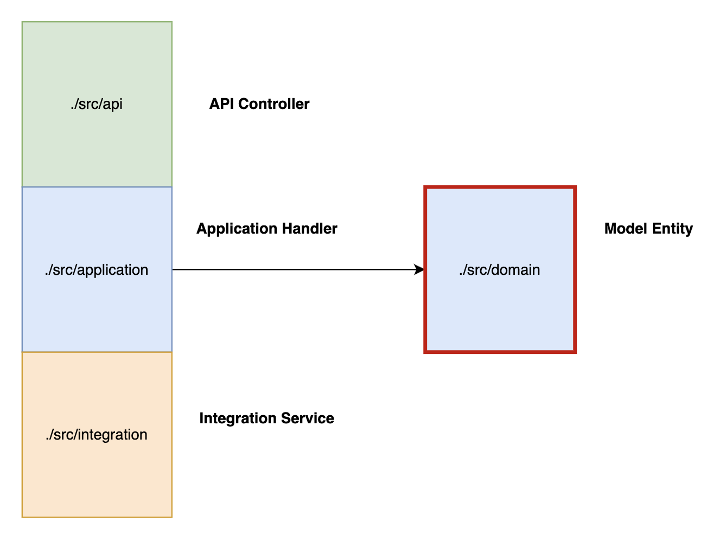

# Neuroglia Python Framework

This Python framework is a lightweight layer built on top of [FastAPI](https://fastapi.tiangolo.com/). It offers developers a set of useful tools and features that can be applied to any microservice, no matter its specific purpose or domain. These features include:

- Adherence to [12-Factor](https://12factor.net/) App principles.
- **Built-in MVC Web App structure**: It provides a foundation for building web applications using the Model-View-Controller pattern, with essential abstractions.
- **Simplified Dependency Injection**: A straightforward mechanism for managing dependencies, including automatic discovery and instantiation of classes.
- **Class-based API Controllers with Automatic Loading**: Easily define API controllers using classes, with the framework automatically finding and loading them.
- **Modular Command/Query Separation (CQRS)**: Supports a clear separation of commands (actions that change data) and queries (actions that retrieve data).
- **Optional Event-Sourcing**: Provides the option to implement event-sourcing for building event-driven domain models.
- **Clean, Layered Code**: Encourages a clean architecture approach, similar to the principles outlined in [link to clean architecture article].

    - Pure Domain Models: Allows you to define domain models that are independent of any specific persistence mechanism.
    - Application Handlers: Provides a structure for handling commands, queries, events, and background tasks within your application logic.
    - Repository Pattern Implementation: Includes support for the Repository pattern for abstracting data access.
    - Separation of API and Domain: Keeps API controllers, endpoints, and data transfer objects (DTOs) separate from your core domain models and business logic.

- **Native Asynchronous Event Handling** with RxPy: Offers built-in support for handling, emitting, and ingesting asynchronous events (in JSON CloudEvent format) using the ReactiveX programming paradigm with RxPy.
- **Data Model Mapping**: Provides tools for easily mapping data between your domain models and integration layers.
- Easy Background Task Scheduling: Integrates seamlessly with apscheduler for scheduling background tasks.
- And more...

## Code Structure

### Entry Point

The main entry point of your application is typically the `src/main.py` file (or `src/api/main.py`).
This file is where you define all the necessary dependencies and specify the sub-folders where the framework should dynamically load your **API**, **Application**, **Integration**, and **Domain** Layers.

### Framework Conventions

The `src` folder contains four distinct Layers:

- **API Layer** (Controllers): `uses the Application Layer`
    - Defines the endpoints available to external clients (incl. OpenAPI specs)
    - Maps each endpoint to its corresponding Application handler.
    - Maps external data (DTO's) models (API Requests and Responses schemas) to internal Domain layer

- **Application Layer** (Handlers and Services): `executes the main biz logic, uses the Domain and Integration Layers`
    - Loads the logic for handling commands, queries, events, tasks, and any other business logic services.

- **Integration Layer** (Dependencies): `provides reusable independent logic (persistence Layer, API clients, external logic)`
    - Loads any external API client services, persistence layer clients, and their associated data models (API DTOs for requests and responses).

## Samples

## OpenBank

Implements a simplified Bank that manages Accounts, Users and Transactions with full [Event Sourcing](https://microservices.io/patterns/data/event-sourcing.html), [CQRS](https://microservices.io/patterns/data/cqrs.html)

[Explore OpenBank](https://github.com/bvandewe/pyneuro/tree/main/samples/openbank)

## Desktop Controller

Remotely and securely control custom files or commands on a Desktop running the app as a Docker container...

[Explore Desktop Controller](https://github.com/bvandewe/pyneuro/tree/main/samples/desktop-controller)

## API Gateway

Expose single entry point for 3rd party clients into an internal layer, like a GenAI stack...
Models a Prompt entity, enforces a business logic (e.g. Prompt' state-machine), handles scheduled background task (with persistence), exposes API with multiple Security schemes, ...

[Explore API Gateway](https://github.com/bvandewe/pyneuro/tree/main/samples/api-gateway)
