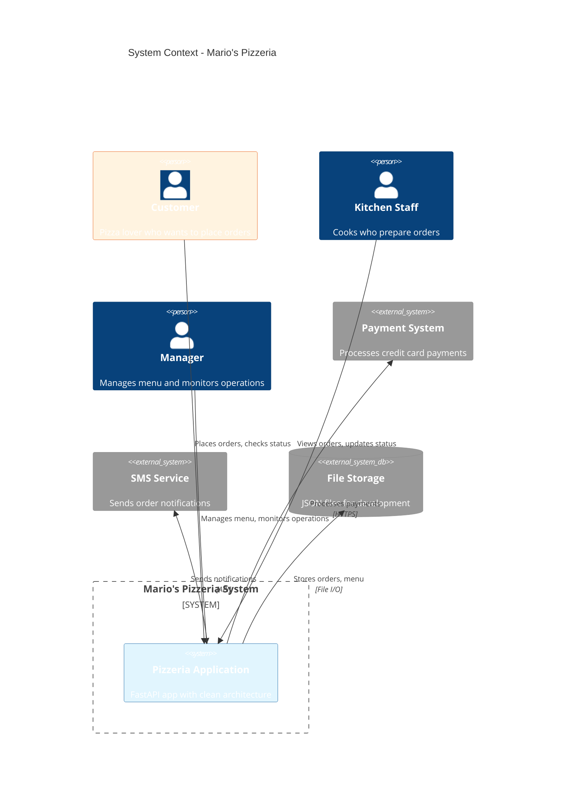
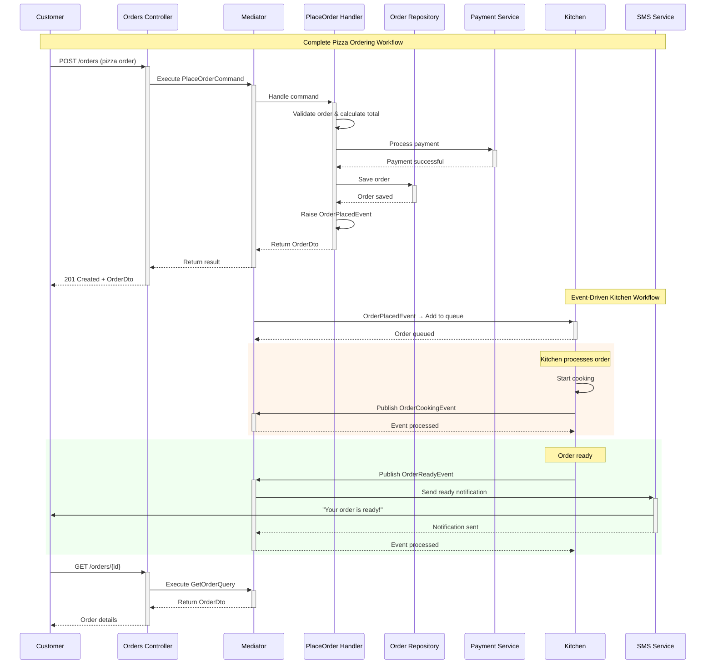
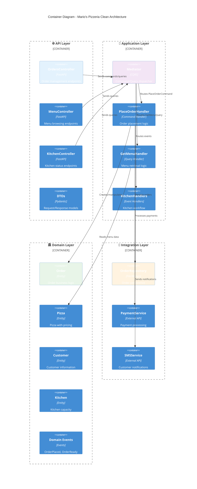
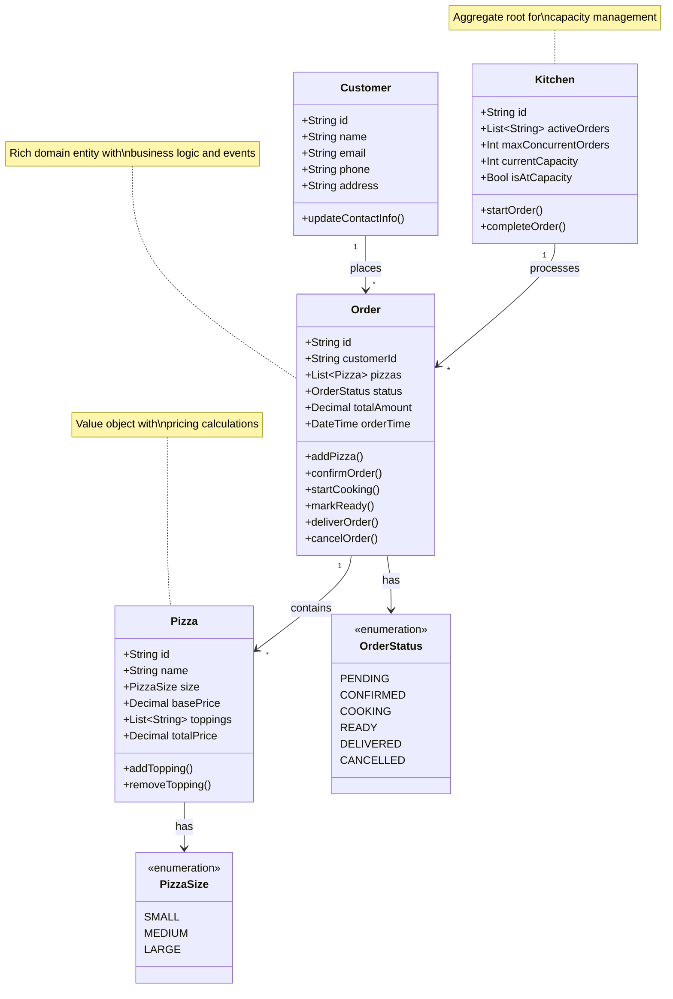
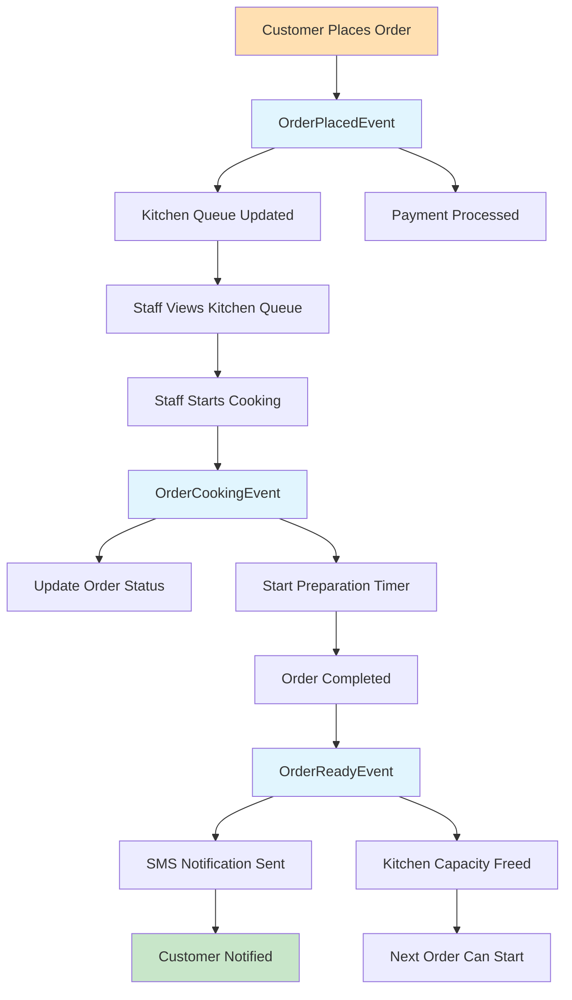

# 🍕 Mario's Pizzeria: Complete Bounded Context

Mario's Pizzeria is the comprehensive business domain used throughout the Neuroglia framework documentation. This real-world example demonstrates clean architecture, CQRS patterns, event-driven design, and all framework features through a production-ready pizza ordering system.

## 🎯 Business Overview

**Mario's Pizzeria** is a local pizza restaurant that needs a digital ordering system to handle:

- **Customer Orders**: Online pizza ordering with customizations
- **Menu Management**: Pizza catalog with sizes, toppings, and pricing
- **Kitchen Operations**: Order queue management and preparation workflow
- **Payment Processing**: Multiple payment methods and transaction handling
- **Customer Notifications**: SMS alerts for order status updates

The pizzeria demonstrates how a simple restaurant business can be modeled using domain-driven design principles:

- Takes pizza orders from customers
- Manages pizza recipes and inventory
- Cooks pizzas in the kitchen with capacity management
- Tracks order status through complete lifecycle
- Handles payments and customer notifications
- Provides real-time status updates to customers and staff

## 🏗️ System Architecture

The pizzeria system demonstrates clean architecture with clear layer separation:



## 🔄 Main System Interactions

The following sequence diagram illustrates the complete pizza ordering workflow:



## 🏛️ Clean Architecture Layers

Mario's Pizzeria demonstrates the four-layer clean architecture:



## 📊 Domain Model

The core business entities and their relationships:



## 🏗️ Detailed Domain Entities

### Pizza Entity

```python
from dataclasses import dataclass
from typing import List, Optional
from decimal import Decimal
from neuroglia.data.abstractions import Entity

@dataclass
class Pizza(Entity[str]):
    """A pizza with toppings and size"""
    id: str
    name: str
    size: str  # "small", "medium", "large"
    base_price: Decimal
    toppings: List[str]
    preparation_time_minutes: int

    @property
    def total_price(self) -> Decimal:
        return self.base_price + (Decimal("1.50") * len(self.toppings))

    def add_topping(self, topping: str) -> None:
        if topping not in self.toppings:
            self.toppings.append(topping)

    def remove_topping(self, topping: str) -> None:
        if topping in self.toppings:
            self.toppings.remove(topping)
```

### Order Entity

```python
@dataclass
class Order(Entity[str]):
    """A customer pizza order"""
    id: str
    customer_name: str
    customer_phone: str
    pizzas: List[Pizza]
    status: str  # "pending", "cooking", "ready", "delivered"
    order_time: datetime
    estimated_ready_time: Optional[datetime] = None
    total_amount: Optional[Decimal] = None

    def __post_init__(self):
        if self.total_amount is None:
            self.total_amount = sum(pizza.total_price for pizza in self.pizzas)

    def add_pizza(self, pizza: Pizza) -> None:
        self.pizzas.append(pizza)
        self.total_amount = sum(p.total_price for p in self.pizzas)

    def confirm_order(self) -> None:
        if self.status == "pending":
            self.status = "confirmed"

    def start_cooking(self) -> None:
        if self.status == "confirmed":
            self.status = "cooking"

    def mark_ready(self) -> None:
        if self.status == "cooking":
            self.status = "ready"
```

### Kitchen Entity

```python
@dataclass
class Kitchen(Entity[str]):
    """Kitchen state and cooking capacity"""
    id: str
    active_orders: List[str]  # Order IDs being cooked
    max_concurrent_orders: int = 3

    @property
    def is_busy(self) -> bool:
        return len(self.active_orders) >= self.max_concurrent_orders

    @property
    def current_capacity(self) -> int:
        return len(self.active_orders)

    def start_order(self, order_id: str) -> bool:
        if not self.is_busy:
            self.active_orders.append(order_id)
            return True
        return False

    def complete_order(self, order_id: str) -> None:
        if order_id in self.active_orders:
            self.active_orders.remove(order_id)
```

## 📊 Value Objects

### Address

```python
@dataclass
class Address:
    street: str
    city: str
    zip_code: str

    def __str__(self) -> str:
        return f"{self.street}, {self.city} {self.zip_code}"
```

### Money

```python
@dataclass
class Money:
    amount: Decimal
    currency: str = "USD"

    def __str__(self) -> str:
        return f"${self.amount:.2f}"

    def add(self, other: 'Money') -> 'Money':
        if self.currency != other.currency:
            raise ValueError("Cannot add different currencies")
        return Money(self.amount + other.amount, self.currency)
```

## 🎯 CQRS Commands and Queries

The system uses CQRS pattern with clear separation between write and read operations:

### Commands (Write Operations)

```python
@dataclass
class PlaceOrderCommand(Command[OperationResult[OrderDto]]):
    customer_name: str
    customer_phone: str
    customer_address: str
    pizzas: List[PizzaOrderDto]
    payment_method: str

@dataclass
class StartCookingCommand(Command[OperationResult[OrderDto]]):
    order_id: str
    kitchen_staff_id: str

@dataclass
class CompleteOrderCommand(Command[OperationResult[OrderDto]]):
    order_id: str
    completion_time: Optional[datetime] = None
```

## 📡 Domain Events

The pizzeria system uses domain events to handle complex business workflows:

### OrderPlacedEvent

```python
@dataclass
class OrderPlacedEvent(DomainEvent):
    order_id: str
    customer_name: str
    total_amount: Decimal
    estimated_ready_time: datetime
```

### CookingStartedEvent

```python
@dataclass
class CookingStartedEvent(DomainEvent):
    order_id: str
    started_at: datetime
```

### OrderReadyEvent

```python
@dataclass
class OrderReadyEvent(DomainEvent):
    order_id: str
    customer_name: str
    customer_phone: str
```

## 📋 Data Transfer Objects (DTOs)

### OrderDto

```python
@dataclass
class OrderDto:
    id: str
    customer_name: str
    customer_phone: str
    pizzas: List[PizzaDto]
    status: str
    total_amount: str  # Formatted money
    order_time: str   # ISO datetime
    estimated_ready_time: Optional[str] = None
```

### PizzaDto

```python
@dataclass
class PizzaDto:
    id: str
    name: str
    size: str
    toppings: List[str]
    price: str  # Formatted money
```

### CreateOrderDto

```python
@dataclass
class CreateOrderDto:
    customer_name: str
    customer_phone: str
    pizzas: List[PizzaOrderItem]
    delivery_address: Optional[AddressDto] = None
```

### KitchenStatusDto

```python
@dataclass
class KitchenStatusDto:
    current_capacity: int
    max_concurrent_orders: int
    active_orders: List[str]
    is_at_capacity: bool
```

### Queries (Read Operations)

```python
@dataclass
class GetOrderByIdQuery(Query[Optional[OrderDto]]):
    order_id: str

@dataclass
class GetMenuQuery(Query[List[PizzaDto]]):
    category: Optional[str] = None

@dataclass
class GetKitchenStatusQuery(Query[KitchenStatusDto]):
    pass

@dataclass
class GetActiveOrdersQuery(Query[List[OrderDto]]):
    pass
```

## 📡 Event-Driven Workflow

The system uses domain events to handle complex business workflows:



### Key Domain Events

- **OrderPlacedEvent**: Triggered when customer places order
- **OrderConfirmedEvent**: Triggered when payment is successful
- **OrderCookingEvent**: Triggered when kitchen starts preparation
- **OrderReadyEvent**: Triggered when order is completed
- **OrderDeliveredEvent**: Triggered when order is picked up

## 🗄️ Data Storage Strategy

Mario's Pizzeria demonstrates multiple persistence approaches:

### File-Based Storage (Development)

```text
data/
├── orders/
│   ├── order_001.json
│   ├── order_002.json
│   └── ...
├── menu/
│   └── pizzas.json
└── kitchen/
    └── status.json
```

### MongoDB Storage (Production)

```javascript
// Orders Collection
{
  "_id": "order_001",
  "customer_name": "Mario Rossi",
  "customer_phone": "+1-555-0123",
  "pizzas": [
    {
      "name": "Margherita",
      "size": "large",
      "toppings": ["extra cheese"],
      "price": 15.99
    }
  ],
  "total_amount": 15.99,
  "status": "ready",
  "order_time": "2025-09-25T10:30:00Z"
}
```

### Event Sourcing (Advanced)

```text
Event Store:
├── order_001_stream
│   ├── OrderPlacedEvent
│   ├── PaymentProcessedEvent
│   ├── OrderConfirmedEvent
│   ├── CookingStartedEvent
│   └── OrderReadyEvent
```

### Detailed File Structure

```text
pizzeria_data/
├── orders/
│   ├── 2024-09-22/           # Orders by date
│   │   ├── order_001.json
│   │   ├── order_002.json
│   │   └── order_003.json
│   └── index.json            # Order index
├── menu/
│   └── pizzas.json           # Available pizzas
├── kitchen/
│   └── status.json           # Kitchen state
└── customers/
    └── customers.json        # Customer history
```

## 🌐 API Endpoints

Complete RESTful API for all pizzeria operations:

### Order Management

| Method   | Endpoint              | Description                      |
| -------- | --------------------- | -------------------------------- |
| `POST`   | `/orders`             | Place new pizza order            |
| `GET`    | `/orders`             | List orders (with status filter) |
| `GET`    | `/orders/{id}`        | Get specific order details       |
| `PUT`    | `/orders/{id}/status` | Update order status              |
| `DELETE` | `/orders/{id}`        | Cancel order                     |

### Menu Operations

| Method | Endpoint            | Description            |
| ------ | ------------------- | ---------------------- |
| `GET`  | `/menu/pizzas`      | Get available pizzas   |
| `GET`  | `/menu/pizzas/{id}` | Get pizza details      |
| `GET`  | `/menu/toppings`    | Get available toppings |

### Kitchen Management

| Method | Endpoint                        | Description                 |
| ------ | ------------------------------- | --------------------------- |
| `GET`  | `/kitchen/status`               | Get kitchen capacity status |
| `GET`  | `/kitchen/queue`                | Get current cooking queue   |
| `POST` | `/kitchen/orders/{id}/start`    | Start cooking order         |
| `POST` | `/kitchen/orders/{id}/complete` | Complete order              |

## 🔐 OAuth Scopes

The pizzeria system uses OAuth2 scopes for fine-grained access control:

```python
SCOPES = {
    "orders:read": "Read order information",
    "orders:write": "Create and modify orders",
    "kitchen:read": "View kitchen status",
    "kitchen:manage": "Manage kitchen operations",
    "menu:read": "View menu items",
    "admin": "Full administrative access"
}
```

## 🎨 Simple UI Pages

The pizzeria system provides a complete user interface:

1. **Menu Page** - Display available pizzas with ordering interface
2. **Order Page** - Place new orders with customization options
3. **Status Page** - Check order status and estimated ready time
4. **Kitchen Dashboard** - Manage cooking queue (staff only)
5. **Admin Panel** - Manage menu and view analytics

## 🚀 Benefits of This Domain Model

- **Familiar Context** - Everyone understands pizza ordering workflows
- **Clear Bounded Context** - Well-defined business operations and boundaries
- **Rich Domain Logic** - Complex pricing, cooking times, status workflows
- **Event-Driven** - Natural events (order placed, cooking started, ready)
- **Multiple User Types** - Customers, kitchen staff, managers with different needs
- **Simple Data Model** - Easy to understand and maintain
- **Realistic Complexity** - Enough features to demonstrate patterns without being overwhelming
- **Production Ready** - Real business logic that could be deployed

## 🧪 Testing Strategy

Mario's Pizzeria includes comprehensive testing at all levels:

### Unit Tests

```python
class TestOrderEntity:
    def test_order_creation(self):
        order = Order(customer_id="cust_1")
        assert order.status == OrderStatus.PENDING
        assert order.total_amount == Decimal('0.00')

    def test_add_pizza_to_order(self):
        order = Order(customer_id="cust_1")
        pizza = Pizza("Margherita", PizzaSize.LARGE, Decimal('15.99'))

        order.add_pizza(pizza)

        assert len(order.pizzas) == 1
        assert order.total_amount == Decimal('15.99')

    def test_order_status_transitions(self):
        order = Order(customer_id="cust_1")
        order.add_pizza(Pizza("Pepperoni", PizzaSize.MEDIUM, Decimal('12.99')))

        order.confirm_order()
        assert order.status == OrderStatus.CONFIRMED

        order.start_cooking()
        assert order.status == OrderStatus.COOKING

        order.mark_ready()
        assert order.status == OrderStatus.READY
```

### Integration Tests

```python
class TestOrdersController:
    async def test_place_order_success(self, test_client):
        order_data = {
            "customer_name": "Mario Rossi",
            "customer_phone": "+1-555-0123",
            "pizzas": [{"name": "Margherita", "size": "large"}],
            "payment_method": "credit_card"
        }

        response = await test_client.post("/orders", json=order_data)

        assert response.status_code == 201
        data = response.json()
        assert data["customer_name"] == "Mario Rossi"
        assert data["status"] == "confirmed"
        assert len(data["pizzas"]) == 1

    async def test_get_kitchen_status(self, test_client):
        response = await test_client.get("/kitchen/status")

        assert response.status_code == 200
        data = response.json()
        assert "current_capacity" in data
        assert "max_concurrent_orders" in data
        assert "active_orders" in data
```

### End-to-End Tests

```python
class TestPizzeriaWorkflow:
    async def test_complete_order_workflow(self, test_client):
        # 1. Customer places order
        order_response = await test_client.post("/orders", json=order_data)
        order_id = order_response.json()["id"]

        # 2. Kitchen starts cooking
        await test_client.post(f"/kitchen/orders/{order_id}/start")

        # 3. Kitchen completes order
        await test_client.post(f"/kitchen/orders/{order_id}/complete")

        # 4. Verify final status
        final_response = await test_client.get(f"/orders/{order_id}")
        assert final_response.json()["status"] == "ready"
```

## 🚀 Getting Started with Mario's Pizzeria

Ready to build the complete pizzeria system? Follow our step-by-step guide:

1. **[Set up the project structure](getting-started.md#project-setup)**
2. **[Implement domain entities](getting-started.md#domain-layer)**
3. **[Create CQRS handlers](getting-started.md#application-layer)**
4. **[Build API controllers](getting-started.md#api-layer)**
5. **[Add data persistence](getting-started.md#integration-layer)**
6. **[Configure dependency injection](getting-started.md#dependency-injection)**
7. **[Run and test the application](getting-started.md#testing)**

**[👉 Start Building Mario's Pizzeria](getting-started.md)**

## 📚 Deep Dive Topics

Explore specific aspects of Mario's Pizzeria implementation:

- **[Clean Architecture Patterns](patterns.md#clean-architecture)** - Layer separation and dependency inversion
- **[CQRS Implementation](patterns.md#cqrs)** - Command/query separation with practical examples
- **[Event-Driven Design](patterns.md#event-driven)** - Domain events and reactive workflows
- **[Repository Pattern](patterns.md#repository)** - Data access abstraction and testing
- **[Dependency Injection](features/dependency-injection.md)** - Service container and lifetime management
- **[Testing Strategies](patterns.md#testing)** - Unit, integration, and end-to-end testing

Mario's Pizzeria showcases how all these patterns work together in a real-world application, providing you with practical examples and best practices for building your own production-ready systems.
