# 🏢 Mario's Pizzeria: Business Analysis & Requirements

> **Customer**: Mario's Family Restaurant | **Project**: Digital Transformation Initiative
> **Consultant**: Neuroglia Architecture Team | **Date**: 2024

## 📊 Executive Summary

Mario's Pizzeria represents a typical small business digital transformation case study. This family-owned restaurant requires a modern ordering system to compete in today's digital marketplace while maintaining operational efficiency and customer satisfaction.

**Project Scope**: Design and implement a comprehensive digital ordering platform that streamlines operations, improves customer experience, and provides real-time visibility into business operations.

---

## 🎯 Business Overview

**Mario's Pizzeria** is a local pizza restaurant that needs a digital ordering system to handle:

- **Customer Orders**: Online pizza ordering with customizations
- **Menu Management**: Pizza catalog with sizes, toppings, and pricing
- **Kitchen Operations**: Order queue management and preparation workflow
- **Payment Processing**: Multiple payment methods and transaction handling
- **Customer Notifications**: SMS alerts for order status updates

The pizzeria demonstrates how a simple restaurant business can be modeled using domain-driven design principles:

- Takes pizza orders from customers
- Manages pizza recipes and inventory
- Cooks pizzas in the kitchen with capacity management
- Tracks order status through complete lifecycle
- Handles payments and customer notifications
- Provides real-time status updates to customers and staff

## 🏗️ System Architecture

The pizzeria system demonstrates clean architecture with clear layer separation:

```mermaid
graph TB
    %% Actors
    Customer[👤 Customer<br/>Pizza lover who wants to place orders]
    KitchenStaff[👨‍🍳 Kitchen Staff<br/>Cooks who prepare orders]
    Manager[👨‍💼 Manager<br/>Manages menu and monitors operations]

    %% System Boundary
    subgraph PizzeriaSystem[Mario's Pizzeria System]
        PizzeriaApp[🍕 Pizzeria Application<br/>FastAPI app with clean architecture]
    end

    %% External Systems
    PaymentSystem[💳 Payment System<br/>Processes credit card payments]
    SMSService[📱 SMS Service<br/>Sends order notifications]
    FileStorage[💾 File Storage<br/>JSON files for development]

    %% Relationships
    Customer -->|Places orders, checks status| PizzeriaApp
    KitchenStaff -->|Views orders, updates status| PizzeriaApp
    Manager -->|Manages menu, monitors operations| PizzeriaApp

    PizzeriaApp -->|Processes payments via HTTPS| PaymentSystem
    PizzeriaApp -->|Sends notifications via API| SMSService
    PizzeriaApp -->|Stores orders and menu via File I/O| FileStorage

    %% Styling
    classDef customer fill:#FFF3E0,stroke:#E65100,stroke-width:2px
    classDef system fill:#E1F5FE,stroke:#01579B,stroke-width:3px
    classDef external fill:#F3E5F5,stroke:#7B1FA2,stroke-width:2px
    classDef storage fill:#E8F5E8,stroke:#2E7D32,stroke-width:2px

    class Customer,KitchenStaff,Manager customer
    class PizzeriaApp system
    class PaymentSystem,SMSService external
    class FileStorage storage
```

## 🔄 Main System Interactions

The following sequence diagram illustrates the complete pizza ordering workflow:

## 💼 Business Requirements Analysis

### Primary Stakeholders

| Stakeholder       | Role               | Key Needs                                                |
| ----------------- | ------------------ | -------------------------------------------------------- |
| **Customers**     | Order pizza online | Easy ordering, real-time status, reliable delivery       |
| **Kitchen Staff** | Prepare orders     | Clear order queue, cooking instructions, status updates  |
| **Management**    | Business oversight | Sales reporting, inventory tracking, performance metrics |
| **Delivery**      | Order fulfillment  | Route optimization, customer contact, payment collection |

### Functional Requirements

| Category          | Requirement                     | Priority | Complexity |
| ----------------- | ------------------------------- | -------- | ---------- |
| **Ordering**      | Browse menu with customizations | High     | Medium     |
| **Ordering**      | Calculate pricing with taxes    | High     | Low        |
| **Ordering**      | Process secure payments         | High     | High       |
| **Kitchen**       | Manage cooking queue            | High     | Medium     |
| **Kitchen**       | Track preparation time          | Medium   | Low        |
| **Notifications** | SMS order updates               | Medium   | Medium     |
| **Management**    | Sales analytics                 | Low      | High       |

### Non-Functional Requirements

| Requirement       | Target                | Rationale           |
| ----------------- | --------------------- | ------------------- |
| **Response Time** | < 2 seconds           | Customer experience |
| **Availability**  | 99.5% uptime          | Business continuity |
| **Scalability**   | 100 concurrent orders | Peak dinner rush    |
| **Security**      | PCI DSS compliance    | Payment processing  |
| **Usability**     | Mobile-first design   | Customer preference |

## 🚀 Success Metrics

### Business KPIs

- **Order Volume**: 30% increase in daily orders
- **Average Order Value**: $25 → $30 target
- **Customer Satisfaction**: > 4.5/5 rating
- **Order Accuracy**: > 98% correct orders
- **Kitchen Efficiency**: < 15 minute average prep time

### Technical Metrics

- **API Response Time**: < 500ms average
- **System Uptime**: > 99.5%
- **Error Rate**: < 0.1%
- **Payment Success**: > 99.9%

## 🔗 Related Documentation

- [Technical Architecture](technical-architecture.md) - System design and infrastructure
- [Domain Design](domain-design.md) - Business logic and data models
- [Implementation Guide](implementation-guide.md) - Development patterns and APIs
- [Testing & Deployment](testing-deployment.md) - Quality assurance and operations

---

_This analysis serves as the foundation for Mario's Pizzeria digital transformation, demonstrating modern software architecture principles applied to real-world business scenarios._
