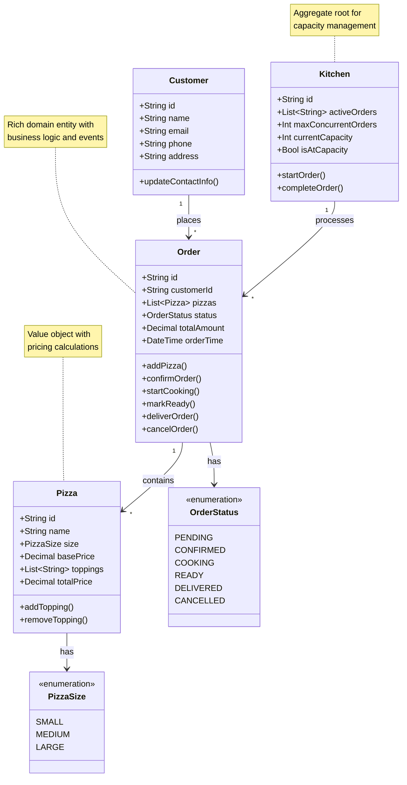

# 🎯 Mario's Pizzeria: Domain Design & Business Logic

> **Domain Modeling Document** | **Approach**: Domain-Driven Design (DDD)
> **Patterns**: Rich Domain Models, Value Objects, Domain Events | **Status**: Reference Implementation

## 🎯 Domain Overview

The Mario's Pizzeria domain captures the essential business concepts and workflows of a pizza restaurant operation. Using Domain-Driven Design principles, we model the core business entities with rich behavior, clear boundaries, and event-driven workflows.

**Core Domain Concepts**:

- **Orders**: Central to the business, capturing customer requests and tracking fulfillment
- **Pizza**: Product catalog with pricing and customization logic
- **Kitchen**: Resource management and capacity planning
- **Customer**: Contact information and order history

---

## 📊 Domain Model

The core business entities and their relationships:



## 🏗️ Detailed Domain Entities

### Pizza Entity

The Pizza entity encapsulates product information, pricing logic, and customization capabilities:

```python
from dataclasses import dataclass
from typing import List, Optional
from decimal import Decimal
from neuroglia.data.abstractions import Entity

@dataclass
class Pizza(Entity[str]):
    """A pizza with toppings and size"""
    id: str
    name: str
    size: str  # "small", "medium", "large"
    base_price: Decimal
    toppings: List[str]
    preparation_time_minutes: int

    @property
    def total_price(self) -> Decimal:
        """Calculate total price including toppings"""
        return self.base_price + (Decimal("1.50") * len(self.toppings))

    def add_topping(self, topping: str) -> None:
        """Add a topping if not already present"""
        if topping not in self.toppings:
            self.toppings.append(topping)

    def remove_topping(self, topping: str) -> None:
        """Remove a topping if present"""
        if topping in self.toppings:
            self.toppings.remove(topping)

    def estimate_cooking_time(self) -> int:
        """Estimate cooking time based on complexity"""
        base_time = self.preparation_time_minutes
        complexity_modifier = len(self.toppings) * 2  # 2 minutes per topping
        return base_time + complexity_modifier
```

**Business Rules**:

- Each topping adds $1.50 to the base price
- Cooking time increases with topping complexity
- Maximum 10 toppings per pizza

### Order Entity

The Order aggregate root manages the complete order lifecycle and business rules:

```python
@dataclass
class Order(Entity[str]):
    """A customer pizza order with complete lifecycle management"""
    id: str
    customer_name: str
    customer_phone: str
    pizzas: List[Pizza]
    status: str  # "pending", "confirmed", "cooking", "ready", "delivered"
    order_time: datetime
    estimated_ready_time: Optional[datetime] = None
    total_amount: Optional[Decimal] = None

    def __post_init__(self):
        if self.total_amount is None:
            self.calculate_total()

    def calculate_total(self) -> None:
        """Calculate order total including taxes and fees"""
        subtotal = sum(pizza.total_price for pizza in self.pizzas)
        tax_rate = Decimal("0.08")  # 8% tax
        delivery_fee = Decimal("2.50")

        self.total_amount = subtotal + (subtotal * tax_rate) + delivery_fee

    def add_pizza(self, pizza: Pizza) -> None:
        """Add pizza to order and recalculate total"""
        self.pizzas.append(pizza)
        self.calculate_total()

        # Raise domain event
        self.raise_event(PizzaAddedToOrderEvent(
            order_id=self.id,
            pizza_name=pizza.name,
            new_total=self.total_amount
        ))

    def confirm_order(self) -> None:
        """Confirm order after payment processing"""
        if self.status != "pending":
            raise InvalidOrderStateError("Order must be pending to confirm")

        self.status = "confirmed"
        self.estimated_ready_time = self._calculate_ready_time()

        # Raise domain event
        self.raise_event(OrderConfirmedEvent(
            order_id=self.id,
            customer_name=self.customer_name,
            estimated_ready_time=self.estimated_ready_time
        ))

    def start_cooking(self) -> None:
        """Start cooking process"""
        if self.status != "confirmed":
            raise InvalidOrderStateError("Order must be confirmed to start cooking")

        self.status = "cooking"

        # Raise domain event
        self.raise_event(CookingStartedEvent(
            order_id=self.id,
            started_at=datetime.utcnow()
        ))

    def mark_ready(self) -> None:
        """Mark order as ready for pickup/delivery"""
        if self.status != "cooking":
            raise InvalidOrderStateError("Order must be cooking to mark ready")

        self.status = "ready"

        # Raise domain event
        self.raise_event(OrderReadyEvent(
            order_id=self.id,
            customer_name=self.customer_name,
            customer_phone=self.customer_phone
        ))

    def _calculate_ready_time(self) -> datetime:
        """Calculate estimated ready time based on pizza complexity"""
        total_cooking_time = sum(pizza.estimate_cooking_time() for pizza in self.pizzas)
        return self.order_time + timedelta(minutes=total_cooking_time + 10)  # +10 for prep
```

### Kitchen Entity

The Kitchen entity manages cooking capacity and workflow coordination:

```python
@dataclass
class Kitchen(Entity[str]):
    """Kitchen state and cooking capacity management"""
    id: str
    active_orders: List[str]  # Order IDs being cooked
    max_concurrent_orders: int = 3
    staff_count: int = 2

    @property
    def is_at_capacity(self) -> bool:
        """Check if kitchen is at maximum capacity"""
        return len(self.active_orders) >= self.max_concurrent_orders

    @property
    def current_capacity(self) -> int:
        """Current number of orders being processed"""
        return len(self.active_orders)

    @property
    def available_capacity(self) -> int:
        """Remaining cooking slots available"""
        return self.max_concurrent_orders - len(self.active_orders)

    def start_order(self, order_id: str) -> bool:
        """Start cooking an order if capacity allows"""
        if self.is_at_capacity:
            return False

        self.active_orders.append(order_id)

        # Raise domain event
        self.raise_event(KitchenOrderStartedEvent(
            kitchen_id=self.id,
            order_id=order_id,
            remaining_capacity=self.available_capacity
        ))

        return True

    def complete_order(self, order_id: str) -> None:
        """Complete cooking an order"""
        if order_id not in self.active_orders:
            raise OrderNotInKitchenError(f"Order {order_id} not in kitchen")

        self.active_orders.remove(order_id)

        # Raise domain event
        self.raise_event(KitchenOrderCompletedEvent(
            kitchen_id=self.id,
            order_id=order_id,
            available_capacity=self.available_capacity
        ))

    def adjust_capacity(self, new_max: int) -> None:
        """Adjust maximum capacity based on staffing"""
        if new_max < len(self.active_orders):
            raise CapacityError("Cannot reduce capacity below current active orders")

        old_capacity = self.max_concurrent_orders
        self.max_concurrent_orders = new_max

        # Raise domain event
        self.raise_event(KitchenCapacityAdjustedEvent(
            kitchen_id=self.id,
            old_capacity=old_capacity,
            new_capacity=new_max
        ))
```

## 📊 Value Objects

### Address Value Object

```python
@dataclass(frozen=True)
class Address:
    """Immutable address value object"""
    street: str
    city: str
    zip_code: str
    state: str = "CA"

    def __str__(self) -> str:
        return f"{self.street}, {self.city}, {self.state} {self.zip_code}"

    def is_valid(self) -> bool:
        """Validate address format"""
        return (
            len(self.street) > 0 and
            len(self.city) > 0 and
            len(self.zip_code) == 5 and
            self.zip_code.isdigit()
        )
```

### Money Value Object

```python
@dataclass(frozen=True)
class Money:
    """Immutable money value object"""
    amount: Decimal
    currency: str = "USD"

    def __str__(self) -> str:
        return f"${self.amount:.2f}"

    def add(self, other: 'Money') -> 'Money':
        """Add two money amounts"""
        if self.currency != other.currency:
            raise ValueError("Cannot add different currencies")
        return Money(self.amount + other.amount, self.currency)

    def multiply(self, factor: Decimal) -> 'Money':
        """Multiply money by a factor"""
        return Money(self.amount * factor, self.currency)

    def is_positive(self) -> bool:
        """Check if amount is positive"""
        return self.amount > 0
```

## 📡 Domain Events

Domain events capture important business occurrences and enable loose coupling:

### Order Lifecycle Events

```python
@dataclass
class OrderPlacedEvent(DomainEvent):
    """Raised when customer places an order"""
    order_id: str
    customer_name: str
    customer_phone: str
    total_amount: Decimal
    estimated_ready_time: datetime

@dataclass
class OrderConfirmedEvent(DomainEvent):
    """Raised when order payment is processed"""
    order_id: str
    customer_name: str
    estimated_ready_time: datetime

@dataclass
class CookingStartedEvent(DomainEvent):
    """Raised when kitchen starts cooking order"""
    order_id: str
    started_at: datetime
    estimated_completion: datetime

@dataclass
class OrderReadyEvent(DomainEvent):
    """Raised when order is ready for pickup"""
    order_id: str
    customer_name: str
    customer_phone: str
    ready_at: datetime
```

### Kitchen Events

```python
@dataclass
class KitchenOrderStartedEvent(DomainEvent):
    """Raised when kitchen starts processing order"""
    kitchen_id: str
    order_id: str
    remaining_capacity: int

@dataclass
class KitchenCapacityAdjustedEvent(DomainEvent):
    """Raised when kitchen capacity changes"""
    kitchen_id: str
    old_capacity: int
    new_capacity: int
    reason: str
```

## 🎯 Business Rules & Invariants

### Order Rules

- Orders must have at least one pizza
- Total amount must be positive
- Status transitions must follow: pending → confirmed → cooking → ready → delivered
- Orders cannot be cancelled once cooking starts

### Kitchen Rules

- Maximum concurrent orders based on staff capacity
- Orders processed in first-in-first-out order
- Capacity adjustments cannot go below current active orders

### Pizza Rules

- Maximum 10 toppings per pizza
- All toppings must be from approved list
- Pricing must include all applicable taxes and fees

## 🔗 Related Documentation

- [Business Analysis](business-analysis.md) - Requirements and stakeholder analysis
- [Technical Architecture](technical-architecture.md) - System design and infrastructure
- [Implementation Guide](implementation-guide.md) - Development patterns and APIs
- [Testing & Deployment](testing-deployment.md) - Quality assurance and operations

---

_This domain model provides a solid foundation for implementing Mario's Pizzeria using Domain-Driven Design principles, ensuring the code reflects the actual business operations._
