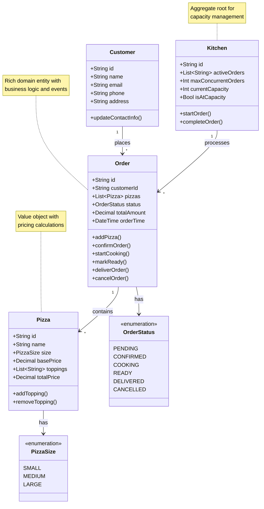

# 🎯 Mario's Pizzeria: Domain Design & Business Logic

> **Domain Modeling Document** | **Approach**: Domain-Driven Design (DDD)
> **Patterns**: Rich Domain Models, Value Objects, Domain Events | **Status**: Reference Implementation

---

> 💡 **Pattern in Action**: This document demonstrates **[Domain-Driven Design](../patterns/domain-driven-design.md)** with rich domain models that contain business logic, not just data. See how Mario's Pizzeria avoids the [anemic domain model anti-pattern](../patterns/domain-driven-design.md#common-mistakes).

---

## 🎯 Domain Overview

The Mario's Pizzeria domain captures the essential business concepts and workflows of a pizza restaurant operation. Using **[Domain-Driven Design](../patterns/domain-driven-design.md)** principles, we model the core business entities with rich behavior, clear boundaries, and event-driven workflows.

**Core Domain Concepts**:

- **Orders**: Central to the business, capturing customer requests and tracking fulfillment
- **Pizza**: Product catalog with pricing and customization logic
- **Kitchen**: Resource management and capacity planning
- **Customer**: Contact information and order history

**Key Patterns Demonstrated**:

- ✅ **Rich Domain Models** - Entities contain business logic, not just data
- ✅ **Aggregate Roots** - Kitchen controls order processing boundaries
- ✅ **Value Objects** - Money, Address with equality semantics
- ✅ **Domain Events** - OrderPlaced, OrderReady for workflow automation
- ✅ **[Repository Pattern](../patterns/repository.md)** - Data access abstraction

> ⚠️ **Avoid Common Mistake**: Don't create anemic domain models with only getters/setters! Our Order entity has methods like `confirmOrder()` and `startCooking()` that enforce business rules. Learn more in [DDD Common Mistakes](../patterns/domain-driven-design.md#common-mistakes).

---

## 📊 Domain Model

The core business entities and their relationships:



## 🏗️ Detailed Domain Entities

### Pizza Aggregate Root

The Pizza aggregate root encapsulates product information, pricing logic, and customization capabilities with sophisticated size-based pricing using event sourcing:

> 📋 **[View Source Code](https://github.com/bvandewe/pyneuro/blob/main/samples/mario-pizzeria/domain/entities/pizza.py)**

```python
from neuroglia.data.abstractions import AggregateRoot, AggregateState
from domain.entities.enums import PizzaSize

@dataclass
class PizzaState(AggregateState[str]):
    """State object for Pizza aggregate - contains all persisted data"""

    name: Optional[str] = None
    base_price: Optional[Decimal] = None
    size: Optional[PizzaSize] = None
    description: str = ""
    toppings: list[str] = field(default_factory=list)

    @dispatch(PizzaCreatedEvent)
    def on(self, event: PizzaCreatedEvent) -> None:
        """Handle PizzaCreatedEvent to initialize pizza state"""
        self.id = event.aggregate_id
        self.name = event.name
        self.base_price = event.base_price
        self.size = PizzaSize(event.size)
        self.description = event.description or ""
        self.toppings = event.toppings.copy()

    @dispatch(ToppingsUpdatedEvent)
    def on(self, event: ToppingsUpdatedEvent) -> None:
        """Handle ToppingsUpdatedEvent to update toppings list"""
        self.toppings = event.toppings.copy()

@map_from(PizzaDto)
@map_to(PizzaDto)
class Pizza(AggregateRoot[PizzaState, str]):
    """Pizza aggregate root with pricing and toppings"""

    def __init__(self, name: str, base_price: Decimal, size: PizzaSize, description: Optional[str] = None):
        super().__init__()

        # Register event and apply it to state using multipledispatch
        self.state.on(
            self.register_event(
                PizzaCreatedEvent(
                    aggregate_id=str(uuid4()),
                    name=name,
                    size=size.value,
                    base_price=base_price,
                    description=description or "",
                    toppings=[]
                )
            )
        )

    @property
    def size_multiplier(self) -> Decimal:
        """Get price multiplier based on pizza size"""
        if self.state.size is None:
            return Decimal("1.0")
        multipliers = {
            PizzaSize.SMALL: Decimal("1.0"),
            PizzaSize.MEDIUM: Decimal("1.3"),
            PizzaSize.LARGE: Decimal("1.6"),
        }
        return multipliers[self.state.size]

    @property
    def topping_price(self) -> Decimal:
        """Calculate total price for all toppings"""
        return Decimal(str(len(self.state.toppings))) * Decimal("2.50")

    @property
    def total_price(self) -> Decimal:
        """Calculate total pizza price including size and toppings"""
        base_with_size = self.state.base_price * self.size_multiplier
        return base_with_size + self.topping_price

    def add_topping(self, topping: str) -> None:
        """Add a topping to the pizza"""
        if topping not in self.state.toppings:
            new_toppings = self.state.toppings + [topping]
            self.state.on(
                self.register_event(
                    ToppingsUpdatedEvent(
                        aggregate_id=self.id(),
                        toppings=new_toppings
                    )
                )
            )

    def remove_topping(self, topping: str) -> None:
        """Remove a topping from the pizza"""
        if topping in self.state.toppings:
            new_toppings = [t for t in self.state.toppings if t != topping]
            self.state.on(
                self.register_event(
                    ToppingsUpdatedEvent(
                        aggregate_id=self.id(),
                        toppings=new_toppings
                    )
                )
            )
```

**Business Rules**:

- Size multipliers: Small (1.0x), Medium (1.3x), Large (1.6x) of base price
- Each topping adds $2.50 to the total price
- Automatic mapping to/from DTOs using `@map_from` and `@map_to` decorators
- UUID-based entity identification

### Order Aggregate Root

The Order aggregate root manages the complete order lifecycle and business rules using event sourcing with separate state management:

> 📋 **[View Source Code](https://github.com/bvandewe/pyneuro/blob/main/samples/mario-pizzeria/domain/entities/order.py)**

```python
from neuroglia.data.abstractions import AggregateRoot, AggregateState
from domain.entities.enums import OrderStatus
from domain.entities.order_item import OrderItem

class OrderState(AggregateState[str]):
    """State for Order aggregate - contains all persisted data"""

    customer_id: Optional[str]
    order_items: list[OrderItem]
    status: OrderStatus
    order_time: Optional[datetime]
    confirmed_time: Optional[datetime]
    cooking_started_time: Optional[datetime]
    actual_ready_time: Optional[datetime]
    estimated_ready_time: Optional[datetime]
    delivery_person_id: Optional[str]
    out_for_delivery_time: Optional[datetime]
    notes: Optional[str]

    # User tracking fields
    chef_user_id: Optional[str]
    chef_name: Optional[str]
    ready_by_user_id: Optional[str]
    ready_by_name: Optional[str]
    delivery_user_id: Optional[str]
    delivery_name: Optional[str]

@map_from(OrderDto)
@map_to(OrderDto)
class Order(AggregateRoot[OrderState, str]):
    """Order aggregate root with pizzas and status management"""

    def __init__(self, customer_id: str, estimated_ready_time: Optional[datetime] = None):
        super().__init__()

        # Register event and apply it to state
        self.state.on(
            self.register_event(
                OrderCreatedEvent(
                    aggregate_id=str(uuid4()),
                    customer_id=customer_id,
                    order_time=datetime.now(timezone.utc)
                )
            )
        )

        if estimated_ready_time:
            self.state.estimated_ready_time = estimated_ready_time

    @property
    def total_amount(self) -> Decimal:
        """Calculate total order amount"""
        return sum((item.total_price for item in self.state.order_items), Decimal("0.00"))

    @property
    def pizza_count(self) -> int:
        """Get total number of pizzas in the order"""
        return len(self.state.order_items)

    def add_order_item(self, order_item: OrderItem) -> None:
        """Add an order item (pizza) to the order"""
        if self.state.status != OrderStatus.PENDING:
            raise ValueError("Cannot modify confirmed orders")

        self.state.order_items.append(order_item)

        self.state.on(
            self.register_event(
                PizzaAddedToOrderEvent(
                    aggregate_id=self.id(),
                    line_item_id=order_item.line_item_id,
                    pizza_name=order_item.name,
                    pizza_size=order_item.size.value,
                    price=order_item.total_price
                )
            )
        )

    def confirm_order(self) -> None:
        """Confirm the order and set status to confirmed"""
        if self.state.status != OrderStatus.PENDING:
            raise ValueError("Only pending orders can be confirmed")

        if not self.state.order_items:
            raise ValueError("Cannot confirm empty order")

        self.state.on(
            self.register_event(
                OrderConfirmedEvent(
                    aggregate_id=self.id(),
                    confirmed_time=datetime.now(timezone.utc),
                    total_amount=self.total_amount,
                    pizza_count=self.pizza_count
                )
            )
        )

    def start_cooking(self, user_id: str, user_name: str) -> None:
        """Start cooking the order"""
        if self.state.status != OrderStatus.CONFIRMED:
            raise ValueError("Only confirmed orders can start cooking")

        self.state.on(
            self.register_event(
                CookingStartedEvent(
                    aggregate_id=self.id(),
                    cooking_started_time=datetime.now(timezone.utc),
                    user_id=user_id,
                    user_name=user_name
                )
            )
        )

    def mark_ready(self, user_id: str, user_name: str) -> None:
        """Mark order as ready for pickup/delivery"""
        if self.state.status != OrderStatus.COOKING:
            raise ValueError("Only cooking orders can be marked ready")

        self.state.on(
            self.register_event(
                OrderReadyEvent(
                    aggregate_id=self.id(),
                    ready_time=datetime.now(timezone.utc),
                    user_id=user_id,
                    user_name=user_name
                )
            )
        )
```

**Key Architectural Patterns**:

- **Aggregate Root**: Order is the entry point for all order-related operations
- **Separate State**: OrderState class holds all persisted data (event sourcing pattern)
- **Event Sourcing**: All state changes happen through domain events
- **Business Rules**: State transitions validated before raising events
- **User Tracking**: Records who performed cooking, ready, and delivery actions

### Kitchen Entity

The Kitchen entity manages cooking capacity and workflow coordination:

> 📋 **[View Source Code](https://github.com/bvandewe/pyneuro/blob/main/samples/mario-pizzeria/domain/entities/kitchen.py)**

```python
from neuroglia.data.abstractions import Entity

@map_from(KitchenStatusDto)
@map_to(KitchenStatusDto)
class Kitchen(Entity[str]):
    """Kitchen state and capacity management"""

    def __init__(self, max_concurrent_orders: int = 3):
        super().__init__()
        self.id = "kitchen"  # Singleton kitchen
        self.active_orders: list[str] = []  # Order IDs currently being prepared
        self.max_concurrent_orders = max_concurrent_orders
        self.total_orders_processed = 0

    @property
    def current_capacity(self) -> int:
        """Get current number of orders being prepared"""
        return len(self.active_orders)

    @property
    def available_capacity(self) -> int:
        """Get remaining capacity for new orders"""
        return self.max_concurrent_orders - self.current_capacity

    @property
    def is_at_capacity(self) -> bool:
        """Check if kitchen is at maximum capacity"""
        return self.current_capacity >= self.max_concurrent_orders

    def start_order(self, order_id: str) -> bool:
        """Start cooking an order if capacity allows"""
        if self.is_at_capacity:
            return False

        self.active_orders.append(order_id)
        return True

    def complete_order(self, order_id: str) -> None:
        """Complete cooking an order and free up capacity"""
        if order_id in self.active_orders:
            self.active_orders.remove(order_id)
            self.total_orders_processed += 1

    def adjust_capacity(self, new_max: int) -> None:
        """Adjust maximum capacity based on staffing"""
        if new_max < len(self.active_orders):
            raise CapacityError("Cannot reduce capacity below current active orders")

        old_capacity = self.max_concurrent_orders
        self.max_concurrent_orders = new_max

        # Raise domain event
        self.raise_event(KitchenCapacityAdjustedEvent(
            kitchen_id=self.id,
            old_capacity=old_capacity,
            new_capacity=new_max
        ))
```

## 📊 Value Objects

### Address Value Object

```python
@dataclass(frozen=True)
class Address:
    """Immutable address value object"""
    street: str
    city: str
    zip_code: str
    state: str = "CA"

    def __str__(self) -> str:
        return f"{self.street}, {self.city}, {self.state} {self.zip_code}"

    def is_valid(self) -> bool:
        """Validate address format"""
        return (
            len(self.street) > 0 and
            len(self.city) > 0 and
            len(self.zip_code) == 5 and
            self.zip_code.isdigit()
        )
```

### Money Value Object

```python
@dataclass(frozen=True)
class Money:
    """Immutable money value object"""
    amount: Decimal
    currency: str = "USD"

    def __str__(self) -> str:
        return f"${self.amount:.2f}"

    def add(self, other: 'Money') -> 'Money':
        """Add two money amounts"""
        if self.currency != other.currency:
            raise ValueError("Cannot add different currencies")
        return Money(self.amount + other.amount, self.currency)

    def multiply(self, factor: Decimal) -> 'Money':
        """Multiply money by a factor"""
        return Money(self.amount * factor, self.currency)

    def is_positive(self) -> bool:
        """Check if amount is positive"""
        return self.amount > 0
```

---

## 📡 Domain Events

Domain events capture important business occurrences and enable loose coupling through **[event-driven architecture](../patterns/event-driven.md)**:

> 🎯 **Why Domain Events?**: Events decouple the order placement from kitchen processing and customer notifications. The order handler doesn't need to know about the kitchen or SMS service! Learn more about [Event-Driven Architecture](../patterns/event-driven.md#what--why-the-event-driven-pattern).

> ⚠️ **Common Mistake Alert**: Don't forget to use **[Unit of Work](../patterns/unit-of-work.md)** to automatically collect and dispatch events! See the [Unit of Work pattern](../patterns/unit-of-work.md#common-mistakes) to avoid manual event management.

### Order Lifecycle Events

```python
@dataclass
class OrderPlacedEvent(DomainEvent):
    """Raised when customer places an order"""
    order_id: str
    customer_name: str
    customer_phone: str
    total_amount: Decimal
    estimated_ready_time: datetime

@dataclass
class OrderConfirmedEvent(DomainEvent):
    """Raised when order payment is processed"""
    order_id: str
    customer_name: str
    estimated_ready_time: datetime

@dataclass
class CookingStartedEvent(DomainEvent):
    """Raised when kitchen starts cooking order"""
    order_id: str
    started_at: datetime
    estimated_completion: datetime

@dataclass
class OrderReadyEvent(DomainEvent):
    """Raised when order is ready for pickup"""
    order_id: str
    customer_name: str
    customer_phone: str
    ready_at: datetime
```

### Kitchen Events

```python
@dataclass
class KitchenOrderStartedEvent(DomainEvent):
    """Raised when kitchen starts processing order"""
    kitchen_id: str
    order_id: str
    remaining_capacity: int

@dataclass
class KitchenCapacityAdjustedEvent(DomainEvent):
    """Raised when kitchen capacity changes"""
    kitchen_id: str
    old_capacity: int
    new_capacity: int
    reason: str
```

---

### Pizza Size Enumeration

The pizza size enumeration defines the available size options with clear business values:

**Source**: [`samples/mario-pizzeria/domain/entities/enums.py`](https://github.com/bvandewe/pyneuro/blob/main/samples/mario-pizzeria/domain/entities/enums.py)

```python title="samples/mario-pizzeria/domain/entities/enums.py" linenums="6"
class PizzaSize(Enum):
    """Pizza size options"""

    SMALL = "small"
    MEDIUM = "medium"
    LARGE = "large"
```

### Order Status Enumeration

The order status enumeration tracks the complete order lifecycle:

```python title="samples/mario-pizzeria/domain/entities/enums.py" linenums="14"
class OrderStatus(Enum):
    """Order lifecycle statuses"""

    PENDING = "pending"
    CONFIRMED = "confirmed"
    COOKING = "cooking"
    READY = "ready"
    DELIVERED = "delivered"
    CANCELLED = "cancelled"
```

**Status Flow**: `PENDING` → `CONFIRMED` → `COOKING` → `READY` → `DELIVERED`

Alternative flow: Any status → `CANCELLED` (with business rules)

## 🎯 Business Rules & Invariants

### Order Rules

- Orders must have at least one pizza
- Total amount must be positive
- Status transitions must follow: pending → confirmed → cooking → ready → delivered
- Orders cannot be cancelled once cooking starts

### Kitchen Rules

- Maximum concurrent orders based on staff capacity
- Orders processed in first-in-first-out order
- Capacity adjustments cannot go below current active orders

### Pizza Rules

- Maximum 10 toppings per pizza
- All toppings must be from approved list
- Pricing must include all applicable taxes and fees

## 🔗 Related Documentation

### Case Study Documents

- [Business Analysis](business-analysis.md) - Requirements and stakeholder analysis
- [Technical Architecture](technical-architecture.md) - System design and infrastructure
- [Implementation Guide](implementation-guide.md) - Development patterns and APIs
- [Testing & Deployment](testing-deployment.md) - Quality assurance and operations

### Framework Patterns Demonstrated

- **[Domain-Driven Design](../patterns/domain-driven-design.md)** - Rich domain models with business logic
- **[Event-Driven Architecture](../patterns/event-driven.md)** - Domain events for workflow automation
- **[Repository Pattern](../patterns/repository.md)** - Data access abstraction for entities
- **[Unit of Work](../patterns/unit-of-work.md)** - Automatic domain event collection and dispatching
- **[Clean Architecture](../patterns/clean-architecture.md)** - Domain layer independence

> 💡 **Learning Tip**: See how Mario's Pizzeria domain entities avoid the [anemic domain model anti-pattern](../patterns/domain-driven-design.md#common-mistakes) by keeping business logic where it belongs - in the domain!

---

_This domain model provides a solid foundation for implementing Mario's Pizzeria using Domain-Driven Design principles, ensuring the code reflects the actual business operations._
