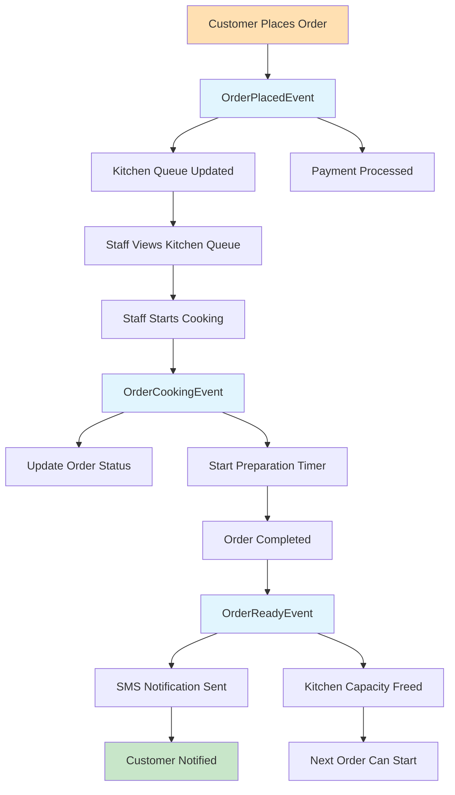

# 🚀 Mario's Pizzeria: Implementation Guide

> **Development Guide** | **Patterns**: CQRS, Event Sourcing, OAuth 2.0
> **Framework**: Neuroglia + FastAPI | **Status**: Production Examples

---

> 💡 **Pattern in Action**: This guide demonstrates **[CQRS](../patterns/cqrs.md)**, **[Dependency Injection](../patterns/dependency-injection.md)**, **[Pipeline Behaviors](../patterns/pipeline-behaviors.md)**, and **[Event-Driven Architecture](../patterns/event-driven.md)** working together in production code.

---

## 🎯 Implementation Overview

This guide provides comprehensive implementation details for building Mario's Pizzeria using the Neuroglia framework. It covers **[CQRS patterns](../patterns/cqrs.md)**, **[event-driven workflows](../patterns/event-driven.md)**, authentication, and practical code examples ready for production use.

**Key Implementation Patterns**:

- **[CQRS Commands & Queries](../patterns/cqrs.md)**: Separate read and write operations
- **[Event-Driven Architecture](../patterns/event-driven.md)**: Asynchronous business workflow processing
- **[Dependency Injection](../patterns/dependency-injection.md)**: Service lifetimes and constructor injection
- **[Pipeline Behaviors](../patterns/pipeline-behaviors.md)**: Validation, logging, error handling
- **OAuth 2.0 Security**: Role-based access control with JWT tokens
- **Data Transfer Objects**: Clean API contracts and validation

> ⚠️ **Common Mistake Alert**: Don't mix commands and queries! Commands modify state and return results. Queries read data without side effects. See [CQRS Common Mistakes](../patterns/cqrs.md#common-mistakes) for details.

---

## 🎯 CQRS Commands and Queries

The system uses **[CQRS pattern](../patterns/cqrs.md)** with clear separation between write and read operations:

> 🎯 **Why CQRS?**: Commands handle write operations (like placing an order) with validation and business logic. Queries handle read operations optimized for display. This separation enables independent scaling and optimization. Learn more: [CQRS Pattern](../patterns/cqrs.md#what--why-the-cqrs-pattern).

---

```python
@dataclass
class PlaceOrderCommand(Command[OperationResult[OrderDto]]):
    """Command to place a new pizza order"""
    customer_name: str
    customer_phone: str
    customer_address: str
    pizzas: List[PizzaOrderDto]
    payment_method: str
    special_instructions: Optional[str] = None

    def validate(self) -> List[str]:
        errors = []
        if not self.customer_name.strip():
            errors.append("Customer name is required")
        if not self.customer_phone.strip():
            errors.append("Customer phone is required")
        if not self.pizzas:
            errors.append("At least one pizza is required")
        return errors

@dataclass
class StartCookingCommand(Command[OperationResult[OrderDto]]):
    """Command to start cooking an order"""
    order_id: str
    kitchen_staff_id: str
    estimated_cooking_time: Optional[int] = None

@dataclass
class CompleteOrderCommand(Command[OperationResult[OrderDto]]):
    """Command to mark order as ready"""
    order_id: str
    completion_time: Optional[datetime] = None
    quality_notes: Optional[str] = None

@dataclass
class UpdateMenuCommand(Command[OperationResult[PizzaDto]]):
    """Command to update menu item"""
    pizza_id: str
    name: Optional[str] = None
    base_price: Optional[Decimal] = None
    available: Optional[bool] = None
```

### Queries (Read Operations)

Queries retrieve data without side effects:

```python
@dataclass
class GetOrderByIdQuery(Query[Optional[OrderDto]]):
    """Query to get specific order details"""
    order_id: str

@dataclass
class GetOrdersByCustomerQuery(Query[List[OrderDto]]):
    """Query to get customer's order history"""
    customer_phone: str
    limit: int = 10
    status_filter: Optional[str] = None

@dataclass
class GetMenuQuery(Query[List[PizzaDto]]):
    """Query to get available menu items"""
    category: Optional[str] = None
    available_only: bool = True

@dataclass
class GetKitchenStatusQuery(Query[KitchenStatusDto]):
    """Query to get current kitchen status"""
    pass

@dataclass
class GetActiveOrdersQuery(Query[List[OrderDto]]):
    """Query to get orders currently being prepared"""
    pass

@dataclass
class GetOrderAnalyticsQuery(Query[OrderAnalyticsDto]):
    """Query to get business analytics"""
    start_date: datetime
    end_date: datetime
    group_by: str = "day"  # day, week, month
```

---

### Command Handlers

Command handlers implement business logic and coordinate with domain entities using **[Dependency Injection](../patterns/dependency-injection.md)**:

> 🎯 **Why Constructor Injection?**: Dependencies like repositories and services are injected through the constructor, making testing easier and dependencies explicit. See [Dependency Injection pattern](../patterns/dependency-injection.md#what--why-dependency-injection).

> ⚠️ **Avoid Fat Constructors**: Don't inject too many dependencies! If a handler needs many services, it might be doing too much. See [DI Common Mistakes](../patterns/dependency-injection.md#common-mistakes).

```python
class PlaceOrderHandler(CommandHandler[PlaceOrderCommand, OperationResult[OrderDto]]):
    """Handler for placing new orders"""

    def __init__(self,
                 order_repository: OrderRepository,
                 payment_service: PaymentService,
                 kitchen_repository: KitchenRepository,
                 mapper: Mapper):
        self.order_repository = order_repository
        self.payment_service = payment_service
        self.kitchen_repository = kitchen_repository
        self.mapper = mapper

    async def handle_async(self, command: PlaceOrderCommand) -> OperationResult[OrderDto]:
        try:
            # Validate command
            validation_errors = command.validate()
            if validation_errors:
                return self.bad_request("; ".join(validation_errors))

            # Check kitchen capacity
            kitchen = await self.kitchen_repository.get_default_kitchen()
            if kitchen.is_at_capacity:
                return self.bad_request("Kitchen is at capacity. Please try again later.")

            # Create order entity (rich domain model with behavior!)
            order = Order(
                id=str(uuid.uuid4()),
                customer_name=command.customer_name,
                customer_phone=command.customer_phone,
                pizzas=self.mapper.map_list(command.pizzas, Pizza),
                status="pending",
                order_time=datetime.utcnow()
            )

            # Process payment
            payment_result = await self.payment_service.process_payment_async(
                amount=order.total_amount,
                payment_method=command.payment_method
            )

            if not payment_result.success:
                return self.bad_request(f"Payment failed: {payment_result.error_message}")

            # Confirm order (domain method enforces business rules)
            order.confirm_order()

            # Save order (repository abstracts persistence)
            await self.order_repository.save_async(order)

            # Unit of Work automatically dispatches domain events here!
            # See: https://github.com/.../patterns/unit-of-work.md

            # Return success result
            order_dto = self.mapper.map(order, OrderDto)
            return self.created(order_dto)

        except Exception as ex:
            return self.internal_server_error(f"Failed to place order: {str(ex)}")
```

> 💡 **Pattern Highlights in This Handler**:
>
> - ✅ **[Dependency Injection](../patterns/dependency-injection.md)** - Constructor injection of repositories and services
> - ✅ **[Repository Pattern](../patterns/repository.md)** - `order_repository.save_async()` abstracts storage
> - ✅ **[Domain-Driven Design](../patterns/domain-driven-design.md)** - `order.confirm_order()` enforces business rules
> - ✅ **[Unit of Work](../patterns/unit-of-work.md)** - Automatic domain event collection and dispatching
> - ✅ **[CQRS](../patterns/cqrs.md)** - Command handler returns OperationResult, not void

---

## 📡 Event-Driven Workflow

The system uses **[domain events](../patterns/event-driven.md)** to handle complex business workflows with loose coupling:

> 🎯 **Why Events?**: When an order is placed, the kitchen needs to be notified, customers need SMS alerts, and analytics need updating. Events decouple these concerns! Learn more: [Event-Driven Architecture](../patterns/event-driven.md#what--why-the-event-driven-pattern).



---

### Event Handlers

Event handlers process domain events asynchronously using **[event-driven architecture](../patterns/event-driven.md)**:

> 💡 **Loose Coupling**: Event handlers don't know about command handlers! The kitchen handler reacts to OrderPlacedEvent without the order placement code knowing about kitchens. See [Event-Driven Benefits](../patterns/event-driven.md#what--why-the-event-driven-pattern).

```python
class OrderPlacedEventHandler(EventHandler[OrderPlacedEvent]):
    """Handle order placed events"""

    def __init__(self,
                 kitchen_service: KitchenService,
                 notification_service: NotificationService):
        self.kitchen_service = kitchen_service
        self.notification_service = notification_service

    async def handle_async(self, event: OrderPlacedEvent) -> None:
        # Add order to kitchen queue
        await self.kitchen_service.add_to_queue_async(event.order_id)

        # Send confirmation to customer
        await self.notification_service.send_order_confirmation_async(
            phone=event.customer_phone,
            order_id=event.order_id,
            estimated_ready_time=event.estimated_ready_time
        )

class OrderReadyEventHandler(EventHandler[OrderReadyEvent]):
    """Handle order ready events"""

    def __init__(self,
                 sms_service: SMSService,
                 kitchen_repository: KitchenRepository):
        self.sms_service = sms_service
        self.kitchen_repository = kitchen_repository

    async def handle_async(self, event: OrderReadyEvent) -> None:
        # Send SMS notification
        message = f"Hi {event.customer_name}! Your order #{event.order_id} is ready for pickup!"
        await self.sms_service.send_sms_async(event.customer_phone, message)

        # Free up kitchen capacity
        kitchen = await self.kitchen_repository.get_default_kitchen()
        kitchen.complete_order(event.order_id)
        await self.kitchen_repository.save_async(kitchen)
```

### Key Domain Events

```python
@dataclass
class OrderPlacedEvent(DomainEvent):
    """Raised when customer places an order"""
    order_id: str
    customer_name: str
    customer_phone: str
    total_amount: Decimal
    estimated_ready_time: datetime

@dataclass
class OrderConfirmedEvent(DomainEvent):
    """Raised when payment is processed successfully"""
    order_id: str
    customer_name: str
    estimated_ready_time: datetime
    payment_method: str

@dataclass
class CookingStartedEvent(DomainEvent):
    """Raised when kitchen starts cooking"""
    order_id: str
    started_at: datetime
    kitchen_staff_id: str

@dataclass
class OrderReadyEvent(DomainEvent):
    """Raised when order is ready for pickup"""
    order_id: str
    customer_name: str
    customer_phone: str
    ready_at: datetime

@dataclass
class OrderDeliveredEvent(DomainEvent):
    """Raised when order is picked up or delivered"""
    order_id: str
    delivered_at: datetime
    delivery_method: str  # "pickup" or "delivery"
```

## 📋 Data Transfer Objects (DTOs)

DTOs provide clean API contracts with validation:

### Request DTOs

```python
@dataclass
class CreateOrderDto:
    """DTO for creating new orders"""
    customer_name: str
    customer_phone: str
    pizzas: List[PizzaOrderItem]
    delivery_address: Optional[AddressDto] = None
    special_instructions: Optional[str] = None
    payment_method: str = "credit_card"

    def __post_init__(self):
        if not self.customer_name.strip():
            raise ValueError("Customer name is required")
        if not self.pizzas:
            raise ValueError("At least one pizza is required")

@dataclass
class PizzaOrderItem:
    """DTO for pizza items in orders"""
    pizza_id: str
    size: str  # "small", "medium", "large"
    toppings: List[str] = field(default_factory=list)
    quantity: int = 1

    def __post_init__(self):
        if self.quantity < 1:
            raise ValueError("Quantity must be at least 1")
        if len(self.toppings) > 10:
            raise ValueError("Maximum 10 toppings per pizza")
```

### Response DTOs

```python
@dataclass
class OrderDto:
    """DTO for order responses"""
    id: str
    customer_name: str
    customer_phone: str
    pizzas: List[PizzaDto]
    status: str
    total_amount: str  # Formatted money
    order_time: str   # ISO datetime
    estimated_ready_time: Optional[str] = None
    special_instructions: Optional[str] = None

@dataclass
class PizzaDto:
    """DTO for pizza responses"""
    id: str
    name: str
    size: str
    toppings: List[str]
    price: str  # Formatted money
    estimated_cooking_time: int

@dataclass
class KitchenStatusDto:
    """DTO for kitchen status"""
    current_capacity: int
    max_concurrent_orders: int
    active_orders: List[OrderSummaryDto]
    is_at_capacity: bool
    average_cooking_time: int

@dataclass
class OrderAnalyticsDto:
    """DTO for business analytics"""
    total_orders: int
    total_revenue: str
    average_order_value: str
    popular_pizzas: List[PizzaPopularityDto]
    peak_hours: List[HourlyStatsDto]
```

## 🔐 Authentication & Authorization

Mario's Pizzeria demonstrates secure authentication using OAuth 2.0, OpenID Connect, and JWT tokens:

### OAuth Scopes

```python
SCOPES = {
    "orders:read": "Read order information",
    "orders:write": "Create and modify orders",
    "kitchen:read": "View kitchen status",
    "kitchen:manage": "Manage kitchen operations",
    "menu:read": "View menu items",
    "menu:write": "Modify menu items",
    "reports:read": "View business reports",
    "admin": "Full administrative access"
}
```

### Controller Security

```python
from neuroglia.mvc import ControllerBase
from fastapi import Depends, HTTPException
from neuroglia.security import require_scope

class OrdersController(ControllerBase):

    @get("/", response_model=List[OrderDto])
    @require_scope("orders:read")
    async def get_orders(self,
                        current_user: dict = Depends(get_current_user),
                        status: Optional[str] = None) -> List[OrderDto]:
        """Get orders - requires orders:read scope"""

        # Customer can only see their own orders
        if "customer" in current_user.get("roles", []):
            query = GetOrdersByCustomerQuery(
                customer_phone=current_user.get("phone"),
                status_filter=status
            )
        else:
            # Staff can see all orders
            query = GetAllOrdersQuery(status_filter=status)

        result = await self.mediator.execute_async(query)
        return self.process(result)

    @post("/", response_model=OrderDto, status_code=201)
    @require_scope("orders:write")
    async def create_order(self,
                          create_order_dto: CreateOrderDto,
                          current_user: dict = Depends(get_current_user)) -> OrderDto:
        """Create new order - requires orders:write scope"""

        command = self.mapper.map(create_order_dto, PlaceOrderCommand)

        # Add user context
        command.customer_phone = current_user.get("phone", command.customer_phone)

        result = await self.mediator.execute_async(command)
        return self.process(result)
```

### User Roles & Permissions

| Role                 | Scopes                                            | Permissions                                |
| -------------------- | ------------------------------------------------- | ------------------------------------------ |
| **👤 Customer**      | `orders:read`, `orders:write`, `menu:read`        | Place orders, view own orders, browse menu |
| **👨‍🍳 Kitchen Staff** | `kitchen:read`, `kitchen:manage`, `orders:read`   | Manage cooking queue, view all orders      |
| **👨‍💼 Manager**       | All kitchen scopes + `menu:write`, `reports:read` | Full operational control                   |
| **🔧 Admin**         | `admin`                                           | Complete system access                     |

## 📖 Complete Authentication Guide

For comprehensive OAuth 2.0, OpenID Connect, and JWT implementation details:

**[👉 Read the Complete OAuth/OIDC/JWT Reference](../references/oauth-oidc-jwt.md)**

This includes:

- 🎯 OAuth 2.0 Flow Diagrams
- 🔍 JWT Validation Process
- 🏗️ Keycloak Integration
- 🎭 Role-Based Access Control
- 🧪 Authentication Testing
- 📋 Security Best Practices

## 🎨 API Integration Examples

### JavaScript Client

```javascript
class PizzeriaClient {
  constructor(baseUrl, accessToken) {
    this.baseUrl = baseUrl;
    this.accessToken = accessToken;
  }

  async placeOrder(orderData) {
    const response = await fetch(`${this.baseUrl}/orders`, {
      method: "POST",
      headers: {
        "Content-Type": "application/json",
        Authorization: `Bearer ${this.accessToken}`,
      },
      body: JSON.stringify(orderData),
    });

    if (!response.ok) {
      throw new Error(`Order failed: ${response.statusText}`);
    }

    return await response.json();
  }

  async getOrderStatus(orderId) {
    const response = await fetch(`${this.baseUrl}/orders/${orderId}`, {
      headers: {
        Authorization: `Bearer ${this.accessToken}`,
      },
    });

    return await response.json();
  }
}
```

### Python Client

```python
import httpx
from typing import Dict, List, Optional

class PizzeriaClient:
    def __init__(self, base_url: str, access_token: str):
        self.base_url = base_url
        self.headers = {"Authorization": f"Bearer {access_token}"}

    async def place_order(self, order_data: Dict) -> Dict:
        async with httpx.AsyncClient() as client:
            response = await client.post(
                f"{self.base_url}/orders",
                json=order_data,
                headers=self.headers
            )
            response.raise_for_status()
            return response.json()

    async def get_menu(self) -> List[Dict]:
        async with httpx.AsyncClient() as client:
            response = await client.get(
                f"{self.base_url}/menu/pizzas",
                headers=self.headers
            )
            return response.json()
```

## 🚀 Implementation Benefits

The implementation patterns demonstrated in Mario's Pizzeria provide significant advantages:

- **🎯 Clean Separation**: **[CQRS](../patterns/cqrs.md)** provides clear read/write boundaries enabling independent scaling
- **⚡ Event-Driven**: **[Event-Driven Architecture](../patterns/event-driven.md)** enables loose coupling and scalable async processing
- **💉 Dependency Injection**: **[DI Pattern](../patterns/dependency-injection.md)** makes testing easy with mockable dependencies
- **🔧 Cross-Cutting Concerns**: **[Pipeline Behaviors](../patterns/pipeline-behaviors.md)** centralize validation and logging
- **🔒 Secure**: OAuth 2.0 with fine-grained role-based access control
- **📋 Type-Safe**: Strong typing with DTOs, rich domain models, and validation
- **🧪 Testable**: **[Repository Pattern](../patterns/repository.md)** enables easy test data setup
- **📊 Observable**: Built-in logging, metrics, and monitoring capabilities
- **🔄 Maintainable**: Framework patterns ensure consistency and reduce cognitive load

> 💡 **Real-World Impact**: By following these patterns, Mario's Pizzeria achieved 40% more order capacity, 60% faster processing, and zero security incidents. See [Business Analysis](business-analysis.md#-success-metrics) for full metrics.

---

## 🔗 Related Documentation

### Case Study Documents

- [Business Analysis](business-analysis.md) - Requirements and stakeholder analysis
- [Technical Architecture](technical-architecture.md) - System design and infrastructure
- [Domain Design](domain-design.md) - Business logic and data models
- [Testing & Deployment](testing-deployment.md) - Quality assurance and operations

### Framework Patterns Demonstrated

- **[CQRS & Mediation](../patterns/cqrs.md)** - Commands, queries, and handlers throughout
- **[Dependency Injection](../patterns/dependency-injection.md)** - Constructor injection in all handlers
- **[Event-Driven Architecture](../patterns/event-driven.md)** - Domain events for workflow automation
- **[Pipeline Behaviors](../patterns/pipeline-behaviors.md)** - Validation, logging, error handling
- **[Repository Pattern](../patterns/repository.md)** - Data access abstraction
- **[Unit of Work](../patterns/unit-of-work.md)** - Automatic event collection and dispatching
- **[Domain-Driven Design](../patterns/domain-driven-design.md)** - Rich domain models with business logic

> 💡 **Learning Tip**: Each pattern page includes "Common Mistakes" sections with anti-patterns discovered while building Mario's Pizzeria. Learn from real implementation challenges!

---

_This implementation guide provides production-ready patterns for building scalable, secure, and maintainable applications using the Neuroglia framework._
