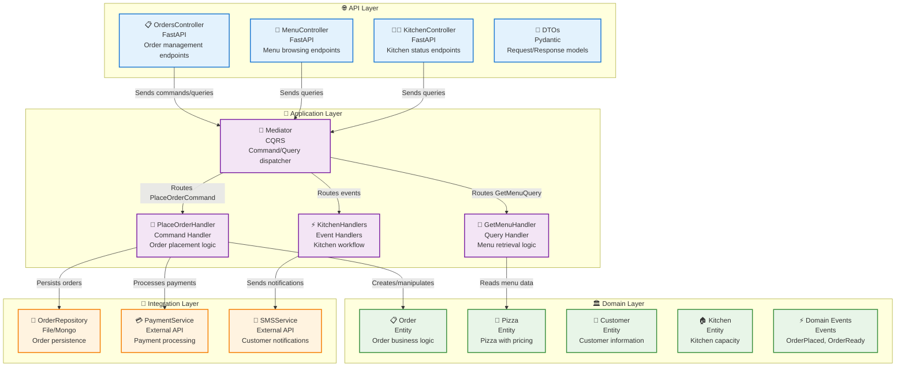

# 🏗️ Mario's Pizzeria: Technical Architecture

> **System Design Document** > **Architecture**: Clean Architecture + CQRS + Event Sourcing
> **Technology Stack**: FastAPI, Python, MongoDB, OAuth 2.0
> **Status**: Production Ready

---

> 💡 **Pattern in Action**: This document demonstrates **[Clean Architecture](../patterns/clean-architecture.md)** layer separation with the **[Repository Pattern](../patterns/repository.md)** for data access abstraction and **[Event-Driven Architecture](../patterns/event-driven.md)** for scalability.

---

## 📋 Architecture Overview

Mario's Pizzeria implements a modern, scalable architecture following **[clean architecture principles](../patterns/clean-architecture.md)** with **[CQRS](../patterns/cqrs.md)** (Command Query Responsibility Segregation) and **[event-driven patterns](../patterns/event-driven.md)**. This design ensures maintainability, testability, and scalability for a growing restaurant business.

**Key Architectural Decisions**:

- **[Clean Architecture](../patterns/clean-architecture.md)**: Clear separation of concerns across four distinct layers
- **[CQRS Pattern](../patterns/cqrs.md)**: Separate models for read and write operations
- **[Event-Driven Design](../patterns/event-driven.md)**: Asynchronous processing and loose coupling
- **[Repository Pattern](../patterns/repository.md)**: Abstracted data access with multiple storage options
- **[Dependency Injection](../patterns/dependency-injection.md)**: Testable and maintainable service management

> ⚠️ **Architecture Principle**: Dependencies point INWARD only (API → Application → Domain ← Integration). The domain layer has ZERO dependencies on outer layers! See [Clean Architecture](../patterns/clean-architecture.md#what--why-clean-architecture) for why this matters.

---

## 🏛️ Clean Architecture Layers

Mario's Pizzeria demonstrates the four-layer clean architecture:



## 🗄️ Data Storage Strategy

Mario's Pizzeria demonstrates multiple persistence approaches to support different deployment scenarios:

### File-Based Storage (Development)

Perfect for development and testing environments with simple JSON persistence:

```text
pizzeria_data/
├── orders/
│   ├── 2024-09-22/           # Orders by date
│   │   ├── order_001.json
│   │   ├── order_002.json
│   │   └── order_003.json
│   └── index.json            # Order index
├── menu/
│   └── pizzas.json           # Available pizzas
├── kitchen/
│   └── status.json           # Kitchen state
└── customers/
    └── customers.json        # Customer history
```

**Benefits**: Zero configuration, version control friendly, fast local development

### MongoDB Storage (Production)

Scalable document database for production workloads:

```javascript
// Orders Collection
{
  "_id": "order_001",
  "customer_name": "Mario Rossi",
  "customer_phone": "+1-555-0123",
  "pizzas": [
    {
      "name": "Margherita",
      "size": "large",
      "toppings": ["extra cheese"],
      "price": 15.99
    }
  ],
  "total_amount": 15.99,
  "status": "ready",
  "order_time": "2025-09-25T10:30:00Z"
}
```

**Benefits**: Horizontal scaling, rich queries, built-in replication, ACID transactions

### Event Sourcing (Advanced)

Complete audit trail and temporal queries using event streams:

```text
Event Store:
├── order_001_stream
│   ├── OrderPlacedEvent
│   ├── PaymentProcessedEvent
│   ├── OrderConfirmedEvent
│   ├── CookingStartedEvent
│   └── OrderReadyEvent
```

**Benefits**: Complete audit trail, temporal queries, replay capability, debugging

## 🌐 API Endpoints

Complete RESTful API designed for different client types (web, mobile, POS systems):

### Order Management

| Method   | Endpoint              | Description                      | Auth Required    |
| -------- | --------------------- | -------------------------------- | ---------------- |
| `POST`   | `/orders`             | Place new pizza order            | Customer         |
| `GET`    | `/orders`             | List orders (with status filter) | Staff            |
| `GET`    | `/orders/{id}`        | Get specific order details       | Owner/Customer   |
| `PUT`    | `/orders/{id}/status` | Update order status              | Kitchen          |
| `DELETE` | `/orders/{id}`        | Cancel order                     | Customer/Manager |

### Menu Operations

| Method | Endpoint            | Description            | Auth Required |
| ------ | ------------------- | ---------------------- | ------------- |
| `GET`  | `/menu/pizzas`      | Get available pizzas   | Public        |
| `GET`  | `/menu/pizzas/{id}` | Get pizza details      | Public        |
| `GET`  | `/menu/toppings`    | Get available toppings | Public        |

### Kitchen Management

| Method | Endpoint                        | Description                 | Auth Required |
| ------ | ------------------------------- | --------------------------- | ------------- |
| `GET`  | `/kitchen/status`               | Get kitchen capacity status | Staff         |
| `GET`  | `/kitchen/queue`                | Get current cooking queue   | Kitchen       |
| `POST` | `/kitchen/orders/{id}/start`    | Start cooking order         | Kitchen       |
| `POST` | `/kitchen/orders/{id}/complete` | Complete order              | Kitchen       |

## 🔐 Security Architecture

### OAuth 2.0 Scopes

Fine-grained access control using OAuth2 scopes:

```python
SCOPES = {
    "orders:read": "Read order information",
    "orders:write": "Create and modify orders",
    "kitchen:read": "View kitchen status",
    "kitchen:manage": "Manage kitchen operations",
    "menu:read": "View menu items",
    "admin": "Full administrative access"
}
```

### Role-Based Access Control

| Role              | Scopes                          | Permissions             |
| ----------------- | ------------------------------- | ----------------------- |
| **Customer**      | `orders:write`, `menu:read`     | Place orders, view menu |
| **Kitchen Staff** | `kitchen:manage`, `orders:read` | Manage cooking queue    |
| **Manager**       | `admin`                         | Full system access      |
| **Public**        | `menu:read`                     | Browse menu only        |

## 🚀 Scalability Considerations

### Horizontal Scaling

- **API Layer**: Stateless controllers scale horizontally behind load balancer (see [Clean Architecture](../patterns/clean-architecture.md))
- **Application Layer**: Event handlers can be distributed across multiple instances (see [Event-Driven Architecture](../patterns/event-driven.md))
- **Database Layer**: MongoDB supports sharding and replica sets (see [Repository Pattern](../patterns/repository.md))
- **External Services**: Circuit breakers prevent cascade failures

> 💡 **Event-Driven Scalability**: Kitchen event handlers can run on separate servers from order handlers, scaling independently based on load! Learn more: [Event-Driven Architecture Benefits](../patterns/event-driven.md#what--why-the-event-driven-pattern).

### Performance Optimizations

- **Caching**: Redis for frequently accessed menu items and customer data
- **Background Processing**: **[Event-driven](../patterns/event-driven.md)** async handling for notifications and reporting
- **Database Indexing**: Optimized queries for order status and customer lookups
- **CDN**: Static assets (images, CSS) served from edge locations
- **Read Models**: Separate **[CQRS](../patterns/cqrs.md)** read models optimized for queries

### Monitoring & Observability

- **Health Checks**: Endpoint monitoring for all critical services
- **Metrics**: Custom business metrics (orders/hour, kitchen efficiency)
- **Logging**: Structured logging with correlation IDs using **[Pipeline Behaviors](../patterns/pipeline-behaviors.md)**
- **Tracing**: Distributed tracing for request flows

> 💡 **Cross-Cutting Concerns**: Logging, metrics, and tracing are implemented as [Pipeline Behaviors](../patterns/pipeline-behaviors.md) that automatically wrap all command and query handlers!

---

## 🔧 Infrastructure Requirements

### Development Environment

- **Python**: 3.9+ with FastAPI and Neuroglia framework
- **Storage**: Local JSON files for rapid development (see [Repository Pattern](../patterns/repository.md))
- **Authentication**: Development OAuth server (Keycloak)

### Production Environment

- **Compute**: 2+ CPU cores, 4GB RAM minimum per instance
- **Database**: MongoDB cluster with replica sets
- **Caching**: Redis cluster for session and menu caching
- **Load Balancer**: NGINX or cloud load balancer
- **Authentication**: Production OAuth provider (Auth0, Keycloak)

---

## 🔗 Related Documentation

### Case Study Documents

- [Business Analysis](business-analysis.md) - Requirements and stakeholder analysis
- [Domain Design](domain-design.md) - Business logic and data models
- [Implementation Guide](implementation-guide.md) - Development patterns and APIs
- [Testing & Deployment](testing-deployment.md) - Quality assurance and operations

### Framework Patterns Used

- **[Clean Architecture](../patterns/clean-architecture.md)** - Four-layer separation with dependency rules
- **[CQRS Pattern](../patterns/cqrs.md)** - Separate read and write models for scalability
- **[Event-Driven Architecture](../patterns/event-driven.md)** - Async workflows and loose coupling
- **[Repository Pattern](../patterns/repository.md)** - Multiple storage implementations (File, MongoDB)
- **[Dependency Injection](../patterns/dependency-injection.md)** - Service lifetimes and testability
- **[Pipeline Behaviors](../patterns/pipeline-behaviors.md)** - Logging, validation, error handling

> 💡 **Architecture Learning**: See how Mario's Pizzeria avoids [common clean architecture mistakes](../patterns/clean-architecture.md#common-mistakes) like mixing layers and breaking dependency rules!

---

_This technical architecture provides a scalable, maintainable foundation for Mario's Pizzeria using proven patterns from the Neuroglia framework._

- [Testing & Deployment](testing-deployment.md) - Quality assurance and operations

---

_This technical architecture ensures Mario's Pizzeria can scale from a single location to a multi-restaurant franchise while maintaining code quality and operational excellence._
