# 🏗️ Clean Architecture Pattern

**Estimated reading time: 20 minutes**

The Clean Architecture pattern enforces a layered approach where dependencies only flow inward, ensuring testability, maintainability, and independence from external concerns.

## 🎯 What & Why

### The Problem: Tightly Coupled Layers

Without clean architecture, code becomes tangled with business logic mixed with infrastructure concerns:

```python
# ❌ Problem: Business logic tightly coupled to framework and database
from fastapi import FastAPI, HTTPException
from pymongo import MongoClient
import stripe

app = FastAPI()
mongo_client = MongoClient("mongodb://localhost:27017")
db = mongo_client.pizzeria

@app.post("/orders")
async def place_order(order_data: dict):
    # ❌ HTTP framework logic mixed with business logic
    try:
        # ❌ Database details in endpoint handler
        customer = db.customers.find_one({"_id": order_data["customer_id"]})
        if not customer:
            raise HTTPException(status_code=404, detail="Customer not found")

        # ❌ Business rules scattered in controller
        subtotal = sum(item["price"] for item in order_data["items"])
        tax = subtotal * 0.08
        total = subtotal + tax

        # ❌ Direct payment API call in controller
        stripe.api_key = "sk_test_..."
        charge = stripe.Charge.create(
            amount=int(total * 100),
            currency="usd",
            source=order_data["payment_token"]
        )

        # ❌ Direct MongoDB operations
        order_doc = {
            "customer_id": order_data["customer_id"],
            "items": order_data["items"],
            "total": total,
            "status": "pending",
            "stripe_charge_id": charge.id
        }
        result = db.orders.insert_one(order_doc)

        # ❌ HTTP response mixed with business logic
        return {
            "order_id": str(result.inserted_id),
            "total": total,
            "status": "pending"
        }

    except stripe.error.CardError as e:
        # ❌ Infrastructure exceptions in business layer
        raise HTTPException(status_code=402, detail=str(e))
    except Exception as e:
        # ❌ Generic error handling
        raise HTTPException(status_code=500, detail=str(e))

# ❌ Testing requires real MongoDB and Stripe
# ❌ Can't swap database without rewriting entire endpoint
# ❌ Business logic can't be reused for CLI or mobile app
# ❌ Framework upgrade requires changing business logic
```

**Problems with this approach:**

1. **No Testability**: Can't test without real database and payment service
2. **Tight Coupling**: Business logic depends on FastAPI, MongoDB, Stripe
3. **No Reusability**: Can't use order placement logic in CLI or batch jobs
4. **Hard to Maintain**: Changes to infrastructure affect business logic
5. **Framework Lock-in**: Stuck with FastAPI, can't migrate to another framework
6. **No Business Focus**: Domain rules lost in infrastructure code

### The Solution: Clean Architecture with Layer Separation

Separate concerns into layers with clear dependency direction:

```python
# ✅ Solution: Layer 1 - Domain (Core Business Logic)
# domain/entities/order.py
from neuroglia.data.abstractions import Entity

class Order(Entity):
    """Pure business logic - no framework dependencies"""

    def __init__(self, customer_id: str, items: List[OrderItem]):
        super().__init__()
        self.customer_id = customer_id
        self.items = items
        self.status = OrderStatus.PENDING
        self.total = self._calculate_total()

        # ✅ Domain events for business occurrences
        self.raise_event(OrderPlacedEvent(
            order_id=self.id,
            customer_id=customer_id,
            total=self.total
        ))

    def _calculate_total(self) -> Decimal:
        """✅ Business rule encapsulated in entity"""
        subtotal = sum(item.price * item.quantity for item in self.items)
        tax = subtotal * Decimal('0.08')  # 8% tax
        return subtotal + tax

# ✅ Layer 2 - Application (Use Cases)
# application/handlers/place_order_handler.py
from neuroglia.mediation import CommandHandler

class PlaceOrderHandler(CommandHandler[PlaceOrderCommand, OperationResult[OrderDto]]):
    """Orchestrates use case - depends only on abstractions"""

    def __init__(
        self,
        order_repository: IOrderRepository,  # ✅ Interface, not implementation
        payment_service: IPaymentService,    # ✅ Interface, not Stripe directly
        mapper: Mapper
    ):
        self._repository = order_repository
        self._payment = payment_service
        self._mapper = mapper

    async def handle_async(self, command: PlaceOrderCommand):
        # ✅ Use domain entity (business logic)
        order = Order(command.customer_id, command.items)

        # ✅ Use abstraction (can swap implementations)
        payment_result = await self._payment.process_async(
            amount=order.total,
            payment_method=command.payment_method
        )

        if not payment_result.success:
            return self.bad_request("Payment failed")

        # ✅ Use repository abstraction
        await self._repository.save_async(order)

        # ✅ Return DTO, not entity
        return self.created(self._mapper.map(order, OrderDto))

# ✅ Layer 3 - API (External Interface)
# api/controllers/orders_controller.py
from neuroglia.mvc import ControllerBase

class OrdersController(ControllerBase):
    """Thin controller - no business logic"""

    @post("/", response_model=OrderDto, status_code=201)
    async def place_order(self, request: PlaceOrderRequest):
        # ✅ Map HTTP request to command
        command = self.mapper.map(request, PlaceOrderCommand)

        # ✅ Delegate to mediator (no direct handler dependency)
        result = await self.mediator.execute_async(command)

        # ✅ Process result (handles error codes)
        return self.process(result)

# ✅ Layer 4 - Integration (Infrastructure)
# integration/services/stripe_payment_service.py
class StripePaymentService(IPaymentService):
    """Implementation detail - can be swapped"""

    async def process_async(
        self,
        amount: Decimal,
        payment_method: str
    ) -> PaymentResult:
        try:
            charge = stripe.Charge.create(
                amount=int(amount * 100),
                currency="usd",
                source=payment_method
            )
            return PaymentResult(success=True, transaction_id=charge.id)
        except stripe.error.CardError as e:
            return PaymentResult(success=False, error=str(e))

# integration/repositories/mongo_order_repository.py
class MongoOrderRepository(IOrderRepository):
    """Implementation detail - can be swapped"""

    async def save_async(self, order: Order) -> None:
        doc = self._entity_to_document(order)
        await self._collection.insert_one(doc)
```

**Benefits of clean architecture:**

1. **Testability**: Test business logic without infrastructure
2. **Flexibility**: Swap MongoDB for PostgreSQL without changing business logic
3. **Reusability**: Use same handlers for API, CLI, or background jobs
4. **Maintainability**: Infrastructure changes don't affect domain
5. **Framework Independence**: Business logic doesn't depend on FastAPI
6. **Business Focus**: Domain logic is pure and clear

## 🎓 Understanding Clean Architecture

Before diving into code, it's helpful to understand the architectural principles that guide Neuroglia:

### The Dependency Rule

```mermaid
graph TD
    A[🌐 API Layer<br/>Controllers, DTOs] --> B[💼 Application Layer<br/>Commands, Queries, Handlers]
    B --> C[🏛️ Domain Layer<br/>Entities, Business Rules]
    D[🔌 Integration Layer<br/>Repositories, External APIs] --> C

    style C fill:#e1f5fe
    style B fill:#f3e5f5
    style A fill:#e8f5e8
    style D fill:#fff3e0
```



**Key principle**: Inner layers never depend on outer layers. This enables:

- **Testability** - Easy to mock external dependencies
- **Flexibility** - Swap implementations without affecting business logic
- **Maintainability** - Changes in infrastructure don't break business rules
- **Domain Focus** - Business logic stays pure and framework-agnostic

### CQRS in Practice


**Commands** (Write): Create, Update, Delete operations that change system state
**Queries** (Read): Retrieve operations that return data without side effects

This separation enables:

- **Performance Optimization** - Different models for reads vs writes
- **Scalability** - Scale read and write operations independently
- **Clarity** - Clear intent whether operation changes state
- **Event Sourcing** - Natural fit for event-driven architectures

## 🎯 Overview

Clean Architecture organizes code into four distinct layers, with the **Mario's Pizzeria** system serving as our primary example of how this pattern enables scalable, maintainable applications.

```mermaid
C4Container
    title Clean Architecture - Mario's Pizzeria System

    Container_Boundary(api, "🌐 API Layer") {
        Container(orders_controller, "Orders Controller", "FastAPI", "REST endpoints for pizza orders")
        Container(menu_controller, "Menu Controller", "FastAPI", "Menu management and retrieval")
        Container(kitchen_controller, "Kitchen Controller", "FastAPI", "Kitchen workflow management")
    }

    Container_Boundary(app, "💼 Application Layer") {
        Container(mediator, "Mediator", "CQRS", "Command/Query routing")
        Container(handlers, "Command/Query Handlers", "Business Logic", "Order processing, menu queries")
        Container(pipeline, "Pipeline Behaviors", "Cross-cutting", "Validation, logging, caching")
    }

    Container_Boundary(domain, "🏛️ Domain Layer") {
        Container(entities, "Pizza Entities", "Domain Models", "Order, Pizza, Customer entities")
        Container(events, "Domain Events", "Business Events", "OrderPlaced, PizzaReady events")
        Container(rules, "Business Rules", "Domain Logic", "Pricing, validation rules")
    }

    Container_Boundary(integration, "🔌 Integration Layer") {
        Container(repos, "Repositories", "Data Access", "Order, Menu data persistence")
        Container(external, "External Services", "Third-party", "Payment, SMS notifications")
        Container(storage, "Data Storage", "Persistence", "MongoDB, File System")
    }

    Rel(orders_controller, mediator, "sends commands/queries")
    Rel(menu_controller, mediator, "sends queries")
    Rel(kitchen_controller, mediator, "sends commands")

    Rel(mediator, handlers, "routes to")
    Rel(handlers, entities, "uses")
    Rel(handlers, events, "publishes")

    Rel(handlers, repos, "persists via")
    Rel(repos, storage, "stores in")
    Rel(handlers, external, "integrates with")
```



## ✅ Benefits

### 1. **Testability**

Each layer can be tested independently using mocks and stubs:

```python
# Testing Order Handler without database dependencies
class TestPlaceOrderHandler:
    def setup_method(self):
        self.mock_repository = Mock(spec=OrderRepository)
        self.mock_payment = Mock(spec=PaymentService)
        self.handler = PlaceOrderHandler(self.mock_repository, self.mock_payment)

    async def test_place_order_success(self):
        # Arrange
        command = PlaceOrderCommand(customer_id="123", pizzas=["margherita"])

        # Act
        result = await self.handler.handle_async(command)

        # Assert
        assert result.is_success
        self.mock_repository.save_async.assert_called_once()
```

### 2. **Independence**

Business logic in the domain layer is completely independent of frameworks, databases, and external services.

### 3. **Maintainability**

Changes to external systems (databases, APIs) don't affect business logic.

## 🔄 Data Flow

The pizza ordering workflow demonstrates clean architecture data flow:

```mermaid
sequenceDiagram
    participant Customer
    participant API as OrdersController
    participant Med as Mediator
    participant Handler as PlaceOrderHandler
    participant Domain as Order Entity
    participant Repo as OrderRepository
    participant DB as MongoDB

    Customer->>+API: POST /orders (pizza order)
    Note over API: 🌐 API Layer - HTTP endpoint

    API->>+Med: Execute PlaceOrderCommand
    Note over Med: 💼 Application Layer - CQRS routing

    Med->>+Handler: Handle command
    Note over Handler: 💼 Application Layer - Business workflow

    Handler->>+Domain: Create Order entity
    Note over Domain: 🏛️ Domain Layer - Business rules
    Domain-->>-Handler: Order with domain events

    Handler->>+Repo: Save order
    Note over Repo: 🔌 Integration Layer - Data access
    Repo->>+DB: Insert document
    Note over DB: 🔌 Integration Layer - Persistence
    DB-->>-Repo: Success
    Repo-->>-Handler: Order saved

    Handler-->>-Med: OrderDto result
    Med-->>-API: Success response
    API-->>-Customer: 201 Created + OrderDto
```



## 🎯 Use Cases

Clean Architecture is ideal for:

- **Complex Business Logic**: When domain rules are intricate (pricing, promotions, kitchen workflows)
- **Multiple Interfaces**: Supporting web APIs, mobile apps, and admin panels
- **Long-term Maintenance**: Systems that need to evolve over time
- **Team Collaboration**: Clear boundaries enable parallel development

## 🍕 Implementation in Mario's Pizzeria

### Domain Layer (Core Business)

```python
# domain/entities/order.py
class Order(Entity):
    def __init__(self, customer_id: str, items: List[OrderItem]):
        super().__init__()
        self.customer_id = customer_id
        self.items = items
        self.status = OrderStatus.PENDING
        self.total = self._calculate_total()

        # Domain event for business workflow
        self.raise_event(OrderPlacedEvent(
            order_id=self.id,
            customer_id=customer_id,
            total=self.total
        ))

    def _calculate_total(self) -> Decimal:
        """Business rule: Calculate order total with tax"""
        subtotal = sum(item.price for item in self.items)
        tax = subtotal * Decimal('0.08')  # 8% tax
        return subtotal + tax
```

### Application Layer (Use Cases)

```python
# application/handlers/place_order_handler.py
class PlaceOrderHandler(CommandHandler[PlaceOrderCommand, OperationResult[OrderDto]]):
    def __init__(self,
                 order_repository: OrderRepository,
                 payment_service: PaymentService,
                 mapper: Mapper):
        self._repository = order_repository
        self._payment = payment_service
        self._mapper = mapper

    async def handle_async(self, command: PlaceOrderCommand) -> OperationResult[OrderDto]:
        # Create domain entity (business logic)
        order = Order(command.customer_id, command.items)

        # Process payment (external integration)
        payment_result = await self._payment.process_async(order.total)
        if not payment_result.success:
            return self.bad_request("Payment failed")

        # Persist order (data access)
        await self._repository.save_async(order)

        # Return result
        dto = self._mapper.map(order, OrderDto)
        return self.created(dto)
```

### API Layer (Interface)

```python
# api/controllers/orders_controller.py
class OrdersController(ControllerBase):
    @post("/", response_model=OrderDto, status_code=201)
    async def place_order(self, request: PlaceOrderRequest) -> OrderDto:
        command = self.mapper.map(request, PlaceOrderCommand)
        result = await self.mediator.execute_async(command)
        return self.process(result)
```

### Integration Layer (External Concerns)

```python
# integration/repositories/mongo_order_repository.py
class MongoOrderRepository(Repository[Order, str]):
    def __init__(self, collection: Collection):
        self._collection = collection

    async def save_async(self, order: Order) -> None:
        document = {
            "_id": order.id,
            "customer_id": order.customer_id,
            "items": [{"name": item.name, "price": float(item.price)}
                     for item in order.items],
            "total": float(order.total),
            "status": order.status.value
        }
        await self._collection.insert_one(document)
```

## 🧪 Testing Clean Architecture

### Unit Testing Domain Layer

```python
import pytest
from decimal import Decimal

class TestOrderEntity:
    def test_order_calculates_total_with_tax(self):
        # Arrange
        items = [
            OrderItem(pizza_name="Margherita", price=Decimal("12.99"), quantity=2),
            OrderItem(pizza_name="Pepperoni", price=Decimal("14.99"), quantity=1)
        ]

        # Act
        order = Order(customer_id="cust_123", items=items)

        # Assert
        expected_subtotal = Decimal("40.97")  # 12.99*2 + 14.99
        expected_tax = expected_subtotal * Decimal("0.08")
        expected_total = expected_subtotal + expected_tax
        assert order.total == expected_total

    def test_order_raises_domain_event(self):
        # Arrange
        items = [OrderItem(pizza_name="Margherita", price=Decimal("12.99"), quantity=1)]

        # Act
        order = Order(customer_id="cust_123", items=items)

        # Assert
        events = order.get_uncommitted_events()
        assert len(events) == 1
        assert isinstance(events[0], OrderPlacedEvent)
        assert events[0].order_id == order.id
```

### Unit Testing Application Layer

```python
@pytest.mark.asyncio
async def test_place_order_handler_success():
    # Arrange
    mock_repository = AsyncMock(spec=IOrderRepository)
    mock_payment = AsyncMock(spec=IPaymentService)
    mock_payment.process_async.return_value = PaymentResult(success=True)

    handler = PlaceOrderHandler(mock_repository, mock_payment, Mock())

    command = PlaceOrderCommand(
        customer_id="cust_123",
        items=[OrderItemDto(pizza_name="Margherita", price="12.99", quantity=1)],
        payment_method="card"
    )

    # Act
    result = await handler.handle_async(command)

    # Assert
    assert result.is_success
    mock_payment.process_async.assert_called_once()
    mock_repository.save_async.assert_called_once()

@pytest.mark.asyncio
async def test_place_order_handler_payment_failure():
    # Arrange
    mock_repository = AsyncMock(spec=IOrderRepository)
    mock_payment = AsyncMock(spec=IPaymentService)
    mock_payment.process_async.return_value = PaymentResult(
        success=False,
        error="Card declined"
    )

    handler = PlaceOrderHandler(mock_repository, mock_payment, Mock())
    command = PlaceOrderCommand(customer_id="cust_123", items=[], payment_method="card")

    # Act
    result = await handler.handle_async(command)

    # Assert
    assert not result.is_success
    assert "Payment failed" in result.error_message
    mock_repository.save_async.assert_not_called()
```

### Integration Testing

```python
@pytest.mark.integration
@pytest.mark.asyncio
async def test_complete_order_workflow():
    # Arrange - use test app with real mediator and in-memory repositories
    app = create_test_app()
    client = TestClient(app)

    order_data = {
        "customer_id": "test_customer",
        "items": [
            {"pizza_name": "Margherita", "price": "12.99", "quantity": 2}
        ],
        "payment_method": "card"
    }

    # Act
    response = client.post("/api/orders", json=order_data)

    # Assert
    assert response.status_code == 201
    result = response.json()
    assert "order_id" in result
    assert result["total"] == "27.95"  # (12.99 * 2) * 1.08
```

## ⚠️ Common Mistakes

### 1. Layer Violations (Breaking Dependency Rule)

```python
# ❌ Wrong - Domain layer depends on infrastructure
from pymongo import Collection  # ❌ Infrastructure import in domain

class Order(Entity):
    def __init__(self, customer_id: str, collection: Collection):
        # ❌ Domain entity depends on MongoDB
        self.collection = collection

    async def save(self):
        # ❌ Domain entity performing data access
        await self.collection.insert_one(self.__dict__)

# ✅ Correct - Domain layer has no infrastructure dependencies
class Order(Entity):
    def __init__(self, customer_id: str, items: List[OrderItem]):
        # ✅ Pure business logic only
        self.customer_id = customer_id
        self.items = items
        self.total = self._calculate_total()

    # ✅ Repository handles persistence (integration layer)
```

### 2. Business Logic in Controllers

```python
# ❌ Wrong - Business logic in API layer
class OrdersController(ControllerBase):
    @post("/orders")
    async def place_order(self, request: dict):
        # ❌ Tax calculation in controller
        subtotal = sum(item["price"] for item in request["items"])
        tax = subtotal * 0.08
        total = subtotal + tax

        # ❌ Validation in controller
        if total > 1000:
            return {"error": "Order too large"}

        order_doc = {"total": total, "items": request["items"]}
        await self._db.orders.insert_one(order_doc)
        return order_doc

# ✅ Correct - Thin controller delegates to application layer
class OrdersController(ControllerBase):
    @post("/orders", response_model=OrderDto)
    async def place_order(self, request: PlaceOrderRequest):
        # ✅ Map and delegate
        command = self.mapper.map(request, PlaceOrderCommand)
        result = await self.mediator.execute_async(command)
        return self.process(result)
```

### 3. Direct Repository Dependencies in Controllers

```python
# ❌ Wrong - Controller directly uses repository
class OrdersController:
    def __init__(self, order_repository: IOrderRepository):
        # ❌ Controller depends on repository
        self._repository = order_repository

    @post("/orders")
    async def place_order(self, request: dict):
        order = Order(**request)
        # ❌ Controller calling repository directly
        await self._repository.save_async(order)
        return order

# ✅ Correct - Controller uses mediator
class OrdersController(ControllerBase):
    # ✅ Only depends on base class (provides mediator)

    @post("/orders", response_model=OrderDto)
    async def place_order(self, request: PlaceOrderRequest):
        # ✅ Uses mediator for all operations
        command = self.mapper.map(request, PlaceOrderCommand)
        result = await self.mediator.execute_async(command)
        return self.process(result)
```

### 4. Returning Domain Entities from API

```python
# ❌ Wrong - Exposing domain entities to API
class OrdersController(ControllerBase):
    @get("/orders/{order_id}")
    async def get_order(self, order_id: str) -> Order:  # ❌ Returns entity
        query = GetOrderQuery(order_id=order_id)
        order = await self.mediator.execute_async(query)
        return order  # ❌ Exposing domain entity

# ✅ Correct - Return DTOs
class OrdersController(ControllerBase):
    @get("/orders/{order_id}", response_model=OrderDto)  # ✅ Returns DTO
    async def get_order(self, order_id: str) -> OrderDto:
        query = GetOrderQuery(order_id=order_id)
        result = await self.mediator.execute_async(query)
        return self.process(result)  # ✅ Returns mapped DTO
```

### 5. Mixing Infrastructure Code in Application Layer

```python
# ❌ Wrong - Application layer with infrastructure details
class PlaceOrderHandler(CommandHandler):
    async def handle_async(self, command: PlaceOrderCommand):
        # ❌ Direct MongoDB access in handler
        from pymongo import MongoClient
        client = MongoClient("mongodb://localhost")
        db = client.pizzeria

        order_doc = {"customer_id": command.customer_id}
        await db.orders.insert_one(order_doc)

# ✅ Correct - Application layer uses abstractions
class PlaceOrderHandler(CommandHandler):
    def __init__(self, repository: IOrderRepository):
        # ✅ Depends on interface
        self._repository = repository

    async def handle_async(self, command: PlaceOrderCommand):
        order = Order(command.customer_id, command.items)
        # ✅ Uses repository abstraction
        await self._repository.save_async(order)
```

### 6. Anemic Domain Models

```python
# ❌ Wrong - Domain entity with no behavior
class Order:
    def __init__(self):
        self.customer_id = None
        self.items = []
        self.total = 0
        # ❌ Just a data bag, no business logic

# Business logic scattered in handlers
class PlaceOrderHandler:
    async def handle_async(self, command: PlaceOrderCommand):
        order = Order()
        order.customer_id = command.customer_id
        order.items = command.items
        # ❌ Calculating total in handler
        order.total = sum(item.price for item in order.items) * 1.08

# ✅ Correct - Rich domain model with behavior
class Order(Entity):
    def __init__(self, customer_id: str, items: List[OrderItem]):
        # ✅ Business logic in entity
        self.customer_id = customer_id
        self.items = items
        self.total = self._calculate_total()
        self.raise_event(OrderPlacedEvent(...))

    def _calculate_total(self) -> Decimal:
        # ✅ Business rule encapsulated
        subtotal = sum(item.price * item.quantity for item in self.items)
        return subtotal * Decimal("1.08")

    def apply_discount(self, percentage: Decimal):
        # ✅ Business behavior on entity
        if percentage > Decimal("0.5"):
            raise ValueError("Discount cannot exceed 50%")
        self.total = self.total * (Decimal("1") - percentage)
```

## 🚫 When NOT to Use

### 1. Simple CRUD Applications

For basic applications with minimal business logic:

```python
# Clean architecture is overkill for simple CRUD
@app.get("/pizzas")
async def get_pizzas(db: Database):
    return await db.pizzas.find().to_list(None)

@app.post("/pizzas")
async def create_pizza(pizza: PizzaDto, db: Database):
    result = await db.pizzas.insert_one(pizza.dict())
    return {"id": str(result.inserted_id)}
```

### 2. Prototypes and Proof of Concepts

When rapidly testing ideas without long-term maintenance needs:

```python
# Quick prototype - simple FastAPI endpoints sufficient
@app.post("/orders")
async def place_order(order_data: dict, db: Database):
    # Direct implementation without layers
    result = await db.orders.insert_one(order_data)
    return {"order_id": str(result.inserted_id)}
```

### 3. Single-Purpose Scripts

For one-off data migration or batch processing scripts:

```python
# Simple script doesn't need architecture layers
import pymongo

client = pymongo.MongoClient("mongodb://localhost")
db = client.pizzeria

# Direct operations
for order in db.orders.find({"status": "pending"}):
    db.orders.update_one({"_id": order["_id"]}, {"$set": {"status": "completed"}})
```

### 4. Very Small Teams Without Architecture Experience

When team lacks experience with layered architecture:

```python
# Simple service pattern may be better
class OrderService:
    def __init__(self, db: Database):
        self.db = db

    async def create_order(self, order_data: dict):
        return await self.db.orders.insert_one(order_data)
```

## 📝 Key Takeaways

1. **Dependency Rule**: Dependencies flow inward - outer layers depend on inner layers
2. **Four Layers**: API → Application → Domain ← Integration
3. **Domain Independence**: Business logic has no framework or infrastructure dependencies
4. **Testability**: Test each layer independently with mocks
5. **Abstractions**: Application layer depends on interfaces, not implementations
6. **DTOs at Boundaries**: API layer uses DTOs, not domain entities
7. **Rich Domain Models**: Entities contain business logic, not just data
8. **Single Responsibility**: Each layer has clear, focused responsibilities
9. **Framework Independence**: Business logic doesn't depend on FastAPI, Django, etc.
10. **Long-Term Maintainability**: Architecture supports evolution and scaling

## 🔗 Related Patterns

- [CQRS Pattern](cqrs.md) - Separates commands and queries within the application layer
- [Event-Driven Architecture](event-driven.md) - Uses domain events for decoupled communication
- [Repository Pattern](repository.md) - Abstracts data access in the integration layer
- [Domain-Driven Design](domain-driven-design.md) - Rich domain models with business behavior
- [Dependency Injection](dependency-injection.md) - Wires abstractions to implementations

---

_This pattern guide demonstrates Clean Architecture using Mario's Pizzeria as a practical example. The four-layer approach shown here scales from simple applications to complex enterprise systems._ 🏗️
