# 🏗️ Clean Architecture Pattern

!!! warning "🚧 Under Construction"
This page is currently being developed with comprehensive examples from Mario's Pizzeria. More detailed implementations and code samples are being added.

The Clean Architecture pattern enforces a layered approach where dependencies only flow inward, ensuring testability, maintainability, and independence from external concerns.

## 🎓 Understanding Clean Architecture

Before diving into code, it's helpful to understand the architectural principles that guide Neuroglia:

### The Dependency Rule

```mermaid
graph TD
    A[🌐 API Layer<br/>Controllers, DTOs] --> B[💼 Application Layer<br/>Commands, Queries, Handlers]
    B --> C[🏛️ Domain Layer<br/>Entities, Business Rules]
    D[🔌 Integration Layer<br/>Repositories, External APIs] --> C

    style C fill:#e1f5fe
    style B fill:#f3e5f5
    style A fill:#e8f5e8
    style D fill:#fff3e0
```



**Key principle**: Inner layers never depend on outer layers. This enables:

- **Testability** - Easy to mock external dependencies
- **Flexibility** - Swap implementations without affecting business logic
- **Maintainability** - Changes in infrastructure don't break business rules
- **Domain Focus** - Business logic stays pure and framework-agnostic

### CQRS in Practice


**Commands** (Write): Create, Update, Delete operations that change system state  
**Queries** (Read): Retrieve operations that return data without side effects

This separation enables:

- **Performance Optimization** - Different models for reads vs writes
- **Scalability** - Scale read and write operations independently
- **Clarity** - Clear intent whether operation changes state
- **Event Sourcing** - Natural fit for event-driven architectures

## 🎯 Overview

Clean Architecture organizes code into four distinct layers, with the **Mario's Pizzeria** system serving as our primary example of how this pattern enables scalable, maintainable applications.

```mermaid
C4Container
    title Clean Architecture - Mario's Pizzeria System

    Container_Boundary(api, "🌐 API Layer") {
        Container(orders_controller, "Orders Controller", "FastAPI", "REST endpoints for pizza orders")
        Container(menu_controller, "Menu Controller", "FastAPI", "Menu management and retrieval")
        Container(kitchen_controller, "Kitchen Controller", "FastAPI", "Kitchen workflow management")
    }

    Container_Boundary(app, "💼 Application Layer") {
        Container(mediator, "Mediator", "CQRS", "Command/Query routing")
        Container(handlers, "Command/Query Handlers", "Business Logic", "Order processing, menu queries")
        Container(pipeline, "Pipeline Behaviors", "Cross-cutting", "Validation, logging, caching")
    }

    Container_Boundary(domain, "🏛️ Domain Layer") {
        Container(entities, "Pizza Entities", "Domain Models", "Order, Pizza, Customer entities")
        Container(events, "Domain Events", "Business Events", "OrderPlaced, PizzaReady events")
        Container(rules, "Business Rules", "Domain Logic", "Pricing, validation rules")
    }

    Container_Boundary(integration, "🔌 Integration Layer") {
        Container(repos, "Repositories", "Data Access", "Order, Menu data persistence")
        Container(external, "External Services", "Third-party", "Payment, SMS notifications")
        Container(storage, "Data Storage", "Persistence", "MongoDB, File System")
    }

    Rel(orders_controller, mediator, "sends commands/queries")
    Rel(menu_controller, mediator, "sends queries")
    Rel(kitchen_controller, mediator, "sends commands")

    Rel(mediator, handlers, "routes to")
    Rel(handlers, entities, "uses")
    Rel(handlers, events, "publishes")

    Rel(handlers, repos, "persists via")
    Rel(repos, storage, "stores in")
    Rel(handlers, external, "integrates with")
```



## ✅ Benefits

### 1. **Testability**

Each layer can be tested independently using mocks and stubs:

```python
# Testing Order Handler without database dependencies
class TestPlaceOrderHandler:
    def setup_method(self):
        self.mock_repository = Mock(spec=OrderRepository)
        self.mock_payment = Mock(spec=PaymentService)
        self.handler = PlaceOrderHandler(self.mock_repository, self.mock_payment)

    async def test_place_order_success(self):
        # Arrange
        command = PlaceOrderCommand(customer_id="123", pizzas=["margherita"])

        # Act
        result = await self.handler.handle_async(command)

        # Assert
        assert result.is_success
        self.mock_repository.save_async.assert_called_once()
```

### 2. **Independence**

Business logic in the domain layer is completely independent of frameworks, databases, and external services.

### 3. **Maintainability**

Changes to external systems (databases, APIs) don't affect business logic.

## 🔄 Data Flow

The pizza ordering workflow demonstrates clean architecture data flow:

```mermaid
sequenceDiagram
    participant Customer
    participant API as OrdersController
    participant Med as Mediator
    participant Handler as PlaceOrderHandler
    participant Domain as Order Entity
    participant Repo as OrderRepository
    participant DB as MongoDB

    Customer->>+API: POST /orders (pizza order)
    Note over API: 🌐 API Layer - HTTP endpoint

    API->>+Med: Execute PlaceOrderCommand
    Note over Med: 💼 Application Layer - CQRS routing

    Med->>+Handler: Handle command
    Note over Handler: 💼 Application Layer - Business workflow

    Handler->>+Domain: Create Order entity
    Note over Domain: 🏛️ Domain Layer - Business rules
    Domain-->>-Handler: Order with domain events

    Handler->>+Repo: Save order
    Note over Repo: 🔌 Integration Layer - Data access
    Repo->>+DB: Insert document
    Note over DB: 🔌 Integration Layer - Persistence
    DB-->>-Repo: Success
    Repo-->>-Handler: Order saved

    Handler-->>-Med: OrderDto result
    Med-->>-API: Success response
    API-->>-Customer: 201 Created + OrderDto
```



## 🎯 Use Cases

Clean Architecture is ideal for:

- **Complex Business Logic**: When domain rules are intricate (pricing, promotions, kitchen workflows)
- **Multiple Interfaces**: Supporting web APIs, mobile apps, and admin panels
- **Long-term Maintenance**: Systems that need to evolve over time
- **Team Collaboration**: Clear boundaries enable parallel development

## 🍕 Implementation in Mario's Pizzeria

### Domain Layer (Core Business)

```python
# domain/entities/order.py
class Order(Entity):
    def __init__(self, customer_id: str, items: List[OrderItem]):
        super().__init__()
        self.customer_id = customer_id
        self.items = items
        self.status = OrderStatus.PENDING
        self.total = self._calculate_total()

        # Domain event for business workflow
        self.raise_event(OrderPlacedEvent(
            order_id=self.id,
            customer_id=customer_id,
            total=self.total
        ))

    def _calculate_total(self) -> Decimal:
        """Business rule: Calculate order total with tax"""
        subtotal = sum(item.price for item in self.items)
        tax = subtotal * Decimal('0.08')  # 8% tax
        return subtotal + tax
```

### Application Layer (Use Cases)

```python
# application/handlers/place_order_handler.py
class PlaceOrderHandler(CommandHandler[PlaceOrderCommand, OperationResult[OrderDto]]):
    def __init__(self,
                 order_repository: OrderRepository,
                 payment_service: PaymentService,
                 mapper: Mapper):
        self._repository = order_repository
        self._payment = payment_service
        self._mapper = mapper

    async def handle_async(self, command: PlaceOrderCommand) -> OperationResult[OrderDto]:
        # Create domain entity (business logic)
        order = Order(command.customer_id, command.items)

        # Process payment (external integration)
        payment_result = await self._payment.process_async(order.total)
        if not payment_result.success:
            return self.bad_request("Payment failed")

        # Persist order (data access)
        await self._repository.save_async(order)

        # Return result
        dto = self._mapper.map(order, OrderDto)
        return self.created(dto)
```

### API Layer (Interface)

```python
# api/controllers/orders_controller.py
class OrdersController(ControllerBase):
    @post("/", response_model=OrderDto, status_code=201)
    async def place_order(self, request: PlaceOrderRequest) -> OrderDto:
        command = self.mapper.map(request, PlaceOrderCommand)
        result = await self.mediator.execute_async(command)
        return self.process(result)
```

### Integration Layer (External Concerns)

```python
# integration/repositories/mongo_order_repository.py
class MongoOrderRepository(Repository[Order, str]):
    def __init__(self, collection: Collection):
        self._collection = collection

    async def save_async(self, order: Order) -> None:
        document = {
            "_id": order.id,
            "customer_id": order.customer_id,
            "items": [{"name": item.name, "price": float(item.price)}
                     for item in order.items],
            "total": float(order.total),
            "status": order.status.value
        }
        await self._collection.insert_one(document)
```

## 🔗 Related Patterns

- **[CQRS Pattern](cqrs.md)** - Separates commands and queries within the application layer
- **[Event-Driven Pattern](event-driven.md)** - Uses domain events for decoupled communication
- **[Repository Pattern](repository.md)** - Abstracts data access in the integration layer

---

_This pattern guide demonstrates Clean Architecture using Mario's Pizzeria as a practical example. The four-layer approach shown here scales from simple applications to complex enterprise systems._ 🏗️
