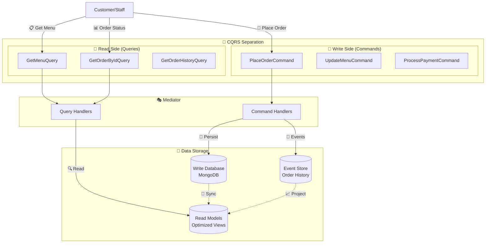
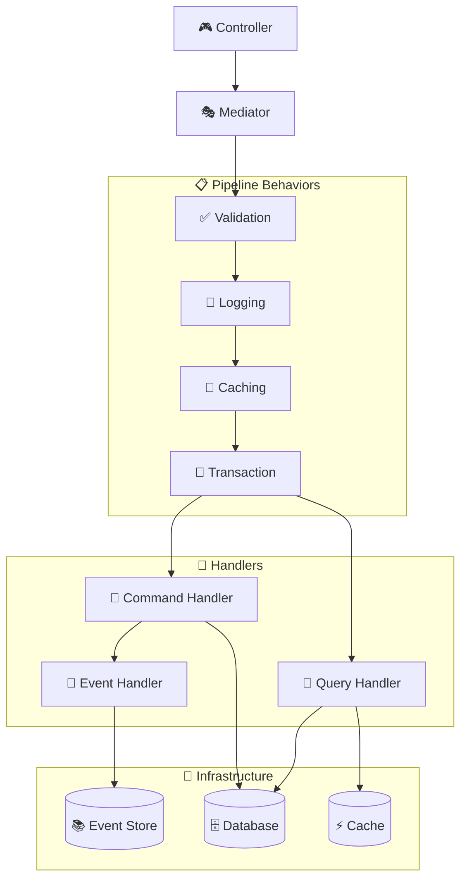
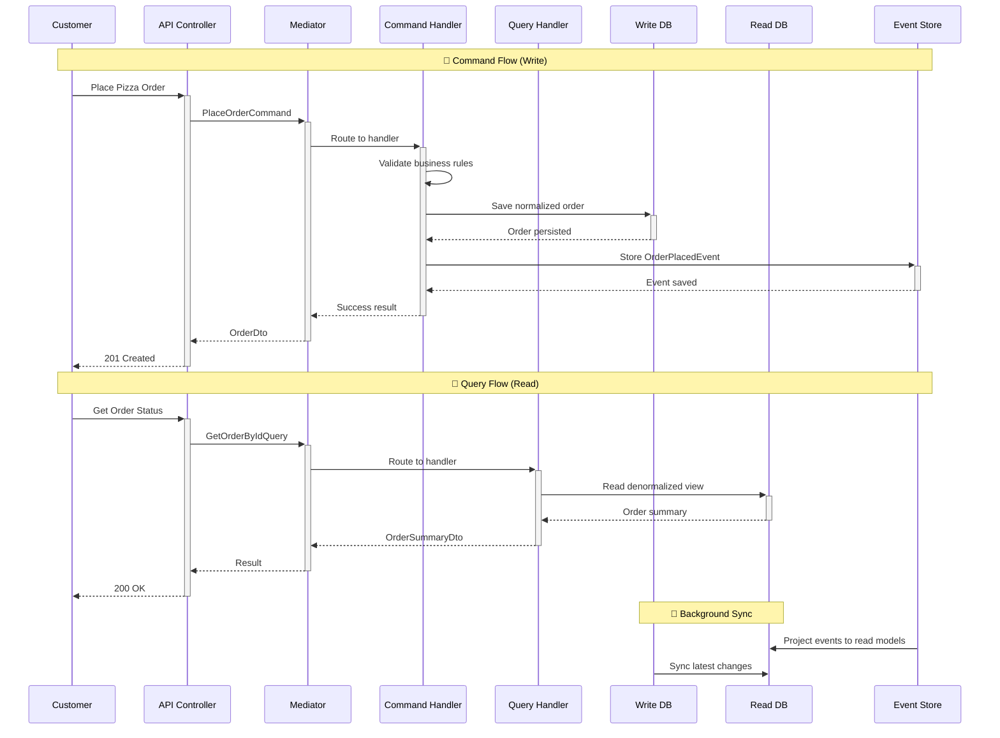

# 🎯 CQRS & Mediation Pattern

**Estimated reading time: 25 minutes**

Command Query Responsibility Segregation (CQRS) with Mediation separates read and write operations into distinct
models while using a mediator to decouple application logic and promote clean separation between commands, queries,
and their handlers. This pattern combines the scalability benefits of CQRS with the architectural benefits of the
mediator pattern.

## 🎯 What & Why

### The Problem: Mixed Read/Write Concerns

Without CQRS, controllers directly call services that handle both reads and writes, creating tight coupling and performance bottlenecks:

```python
# ❌ Problem: Single service handles both reads and writes
class OrderService:
    def __init__(
        self,
        order_repository: OrderRepository,
        payment_service: PaymentService,
        inventory_service: InventoryService,
        kitchen_service: KitchenService,
        notification_service: NotificationService,
        analytics_service: AnalyticsService
    ):
        # Service has too many responsibilities
        self._order_repo = order_repository
        self._payment = payment_service
        self._inventory = inventory_service
        self._kitchen = kitchen_service
        self._notification = notification_service
        self._analytics = analytics_service

    async def place_order(self, order_data: dict) -> Order:
        # ❌ Complex write operation mixed with business logic
        order = Order(**order_data)
        await self._payment.process_payment(order)
        await self._inventory.reserve_ingredients(order)
        await self._order_repo.save(order)
        await self._kitchen.add_to_queue(order)
        await self._notification.send_confirmation(order)
        return order

    async def get_order_history(self, customer_id: str) -> List[Order]:
        # ❌ Simple read operation uses same service as complex writes
        orders = await self._order_repo.find_by_customer(customer_id)
        # ❌ Returns full entities even when only summary data needed
        return orders

    async def get_menu(self) -> List[Pizza]:
        # ❌ Can't cache or optimize reads separately from writes
        return await self._pizza_repo.find_all()

# Controller tightly coupled to service
class OrdersController:
    def __init__(self, order_service: OrderService):
        self._order_service = order_service

    async def place_order(self, request: dict):
        # ❌ Controller knows about service implementation details
        return await self._order_service.place_order(request)

    async def get_orders(self, customer_id: str):
        # ❌ Same service for reads and writes - can't scale independently
        return await self._order_service.get_order_history(customer_id)
```

**Problems with this approach:**

1. **Mixed Responsibilities**: Service handles both reads and writes
2. **No Optimization**: Can't optimize reads separately from writes
3. **Tight Coupling**: Controller depends directly on service
4. **Poor Testability**: Must mock entire service for simple tests
5. **No Cross-Cutting Concerns**: Validation, caching, logging duplicated everywhere
6. **Scaling Issues**: Read-heavy operations slow down writes

### The Solution: CQRS with Mediation

Separate commands (writes) from queries (reads) and use a mediator to route requests:

```python
# ✅ Solution: Separate command for writes
@dataclass
class PlaceOrderCommand(Command[OperationResult[OrderDto]]):
    customer_id: str
    items: List[OrderItemDto]
    delivery_address: str
    payment_method: str

class PlaceOrderHandler(CommandHandler[PlaceOrderCommand, OperationResult[OrderDto]]):
    def __init__(
        self,
        repository: IOrderRepository,
        mapper: Mapper
    ):
        # ✅ Handler only depends on what it needs
        self._repository = repository
        self._mapper = mapper

    async def handle_async(self, command: PlaceOrderCommand):
        # ✅ Focused on single responsibility: order placement
        order = Order.create(
            command.customer_id,
            command.items,
            command.delivery_address
        )

        await self._repository.save_async(order)

        # ✅ Domain events automatically published
        return self.created(self._mapper.map(order, OrderDto))

# ✅ Solution: Separate query for reads
@dataclass
class GetOrderHistoryQuery(Query[List[OrderSummaryDto]]):
    customer_id: str
    page: int = 1
    page_size: int = 20

class GetOrderHistoryHandler(QueryHandler[GetOrderHistoryQuery, List[OrderSummaryDto]]):
    def __init__(self, read_repository: IOrderReadRepository):
        # ✅ Uses optimized read repository
        self._read_repo = read_repository

    async def handle_async(self, query: GetOrderHistoryQuery):
        # ✅ Optimized for reading with denormalized data
        orders = await self._read_repo.get_customer_history_async(
            query.customer_id,
            query.page,
            query.page_size
        )

        # ✅ Returns lightweight DTOs, not full entities
        return [OrderSummaryDto(
            order_id=o.id,
            total=o.total,
            status=o.status,
            order_date=o.created_at
        ) for o in orders]

# ✅ Controller uses mediator - no direct dependencies
class OrdersController(ControllerBase):
    # ✅ No service dependencies - only mediator

    @post("/", response_model=OrderDto, status_code=201)
    async def place_order(self, request: PlaceOrderRequest):
        # ✅ Mediator routes to appropriate handler
        command = self.mapper.map(request, PlaceOrderCommand)
        result = await self.mediator.execute_async(command)
        return self.process(result)

    @get("/history", response_model=List[OrderSummaryDto])
    async def get_history(self, customer_id: str, page: int = 1):
        # ✅ Separate query handler with optimized read model
        query = GetOrderHistoryQuery(customer_id=customer_id, page=page)
        result = await self.mediator.execute_async(query)
        return result
```

**Benefits of CQRS with Mediation:**

1. **Clear Separation**: Commands write, queries read - single responsibility
2. **Independent Optimization**: Optimize reads and writes separately
3. **Loose Coupling**: Controllers don't know about handlers
4. **Easy Testing**: Test handlers in isolation with minimal mocks
5. **Cross-Cutting Concerns**: Pipeline behaviors handle validation, caching, logging
6. **Independent Scaling**: Scale read and write sides independently
7. **Event-Driven**: Commands naturally produce domain events

## 🎯 Overview

CQRS divides your application's operations into two distinct paths: **Commands** for writes (state changes) and **Queries** for reads (data retrieval). Mario's Pizzeria demonstrates this pattern through its order management and menu systems.



## 🎭 Mediation Pattern Integration

The mediation layer provides centralized request routing and cross-cutting concerns:

- **Mediator**: Central dispatcher that routes commands, queries, and events to appropriate handlers
- **Pipeline Behaviors**: Cross-cutting concerns like validation, logging, caching, and transactions
- **Handler Discovery**: Automatic registration and resolution of command/query handlers
- **Event Publishing**: Automatic dispatch of domain events to registered event handlers

### Mediator Architecture



## ✅ Benefits

### 1. **Optimized Performance**

Different models for reads and writes enable performance optimization:

```python
# Write Model - Normalized for consistency
class PlaceOrderCommand(Command[OperationResult[OrderDto]]):
    customer_id: str
    items: List[OrderItemDto]
    delivery_address: AddressDto
    payment_method: PaymentMethodDto

# Read Model - Denormalized for speed
class OrderSummaryDto:
    order_id: str
    customer_name: str  # Denormalized
    total_amount: Decimal
    status: str
    estimated_delivery: datetime
    items_count: int  # Pre-calculated
```

### 2. **Independent Scaling**

Read and write sides can scale independently based on usage patterns:

```python
# Heavy read operations don't impact write performance
class GetPopularPizzasQuery(Query[List[PopularPizzaDto]]):
    time_period: str = "last_30_days"
    limit: int = 10

# Complex writes don't slow down simple reads
class ProcessOrderWorkflowCommand(Command[OperationResult]):
    order_id: str
    # Complex business logic with multiple validations
```

### 3. **Clear Separation of Concerns**

Commands handle business logic while queries focus on data presentation.

## 🔄 Data Flow

The pizza ordering process demonstrates CQRS data flow:



## 🎯 Use Cases

CQRS is particularly effective for:

- **High-Traffic Applications**: Different read/write performance requirements
- **Complex Business Logic**: Commands handle intricate workflows
- **Reporting Systems**: Optimized read models for analytics
- **Event-Driven Systems**: Natural fit with event sourcing

## 🍕 Implementation in Mario's Pizzeria

### Commands (Write Operations)

```python
# Command: Place a pizza order
@dataclass
class PlaceOrderCommand(Command[OperationResult[OrderDto]]):
    customer_id: str
    pizzas: List[PizzaSelectionDto]
    delivery_address: str
    payment_method: str
    special_instructions: Optional[str] = None

class PlaceOrderHandler(CommandHandler[PlaceOrderCommand, OperationResult[OrderDto]]):
    def __init__(self,
                 order_repository: OrderRepository,
                 payment_service: PaymentService,
                 inventory_service: InventoryService):
        self._order_repo = order_repository
        self._payment = payment_service
        self._inventory = inventory_service

    async def handle_async(self, command: PlaceOrderCommand) -> OperationResult[OrderDto]:
        try:
            # 1. Validate business rules
            if not await self._inventory.check_availability(command.pizzas):
                return self.bad_request("Some pizzas are not available")

            # 2. Create domain entity
            order = Order.create(
                customer_id=command.customer_id,
                pizzas=command.pizzas,
                delivery_address=command.delivery_address
            )

            # 3. Process payment
            payment_result = await self._payment.charge_async(
                order.total, command.payment_method
            )
            if not payment_result.success:
                return self.bad_request("Payment failed")

            # 4. Persist order
            await self._order_repo.save_async(order)

            # 5. Return result
            dto = self.mapper.map(order, OrderDto)
            return self.created(dto)

        except Exception as ex:
            return self.internal_server_error(f"Order placement failed: {str(ex)}")
```

### Queries (Read Operations)

```python
# Query: Get menu with pricing
@dataclass
class GetMenuQuery(Query[List[MenuItemDto]]):
    category: Optional[str] = None
    include_unavailable: bool = False

class GetMenuHandler(QueryHandler[GetMenuQuery, List[MenuItemDto]]):
    def __init__(self, menu_read_repository: MenuReadRepository):
        self._menu_repo = menu_read_repository

    async def handle_async(self, query: GetMenuQuery) -> List[MenuItemDto]:
        # Optimized read from denormalized menu view
        menu_items = await self._menu_repo.get_menu_items_async(
            category=query.category,
            include_unavailable=query.include_unavailable
        )

        return [self.mapper.map(item, MenuItemDto) for item in menu_items]

# Query: Get order history with analytics
@dataclass
class GetOrderHistoryQuery(Query[OrderHistoryDto]):
    customer_id: str
    page: int = 1
    page_size: int = 10

class GetOrderHistoryHandler(QueryHandler[GetOrderHistoryQuery, OrderHistoryDto]):
    async def handle_async(self, query: GetOrderHistoryQuery) -> OrderHistoryDto:
        # Read from optimized history view with pre-calculated stats
        history = await self._order_read_repo.get_customer_history_async(
            customer_id=query.customer_id,
            page=query.page,
            page_size=query.page_size
        )

        return OrderHistoryDto(
            orders=history.orders,
            total_orders=history.total_count,
            total_spent=history.lifetime_value,  # Pre-calculated
            favorite_pizzas=history.top_pizzas,  # Pre-calculated
            page=query.page,
            page_size=query.page_size
        )
```

### Controller Integration

```python
# Controllers use mediator to route commands and queries
class OrdersController(ControllerBase):

    @post("/", response_model=OrderDto, status_code=201)
    async def place_order(self, request: PlaceOrderRequest) -> OrderDto:
        # Route to command handler
        command = self.mapper.map(request, PlaceOrderCommand)
        result = await self.mediator.execute_async(command)
        return self.process(result)

    @get("/{order_id}", response_model=OrderDto)
    async def get_order(self, order_id: str) -> OrderDto:
        # Route to query handler
        query = GetOrderByIdQuery(order_id=order_id)
        result = await self.mediator.execute_async(query)
        return self.process(result)

    @get("/", response_model=List[OrderSummaryDto])
    async def get_orders(self,
                        customer_id: Optional[str] = None,
                        status: Optional[str] = None) -> List[OrderSummaryDto]:
        # Route to query handler with filters
        query = GetOrdersQuery(customer_id=customer_id, status=status)
        result = await self.mediator.execute_async(query)
        return result
```

### Read Model Optimization

```python
# Optimized read models for different use cases
class OrderSummaryDto:
    """Lightweight order summary for lists"""
    order_id: str
    customer_name: str  # Denormalized
    total: Decimal
    status: OrderStatus
    order_date: datetime
    estimated_delivery: datetime

class OrderDetailDto:
    """Complete order details for single order view"""
    order_id: str
    customer: CustomerDto  # Full customer details
    items: List[OrderItemDetailDto]  # Expanded item details
    payment: PaymentDetailDto
    delivery: DeliveryDetailDto
    timeline: List[OrderEventDto]  # Order history
    total_breakdown: OrderTotalDto  # Tax, discounts, etc.
```

## 🧪 Testing CQRS

```python
# Test commands and queries separately
class TestPlaceOrderCommand:
    async def test_place_order_success(self):
        # Arrange
        handler = PlaceOrderHandler(mock_repo, mock_payment, mock_inventory)
        command = PlaceOrderCommand(
            customer_id="123",
            pizzas=[PizzaSelectionDto(name="Margherita", size="Large")]
        )

        # Act
        result = await handler.handle_async(command)

        # Assert
        assert result.is_success
        mock_repo.save_async.assert_called_once()

class TestGetMenuQuery:
    async def test_get_menu_filters_by_category(self):
        # Arrange
        handler = GetMenuHandler(mock_read_repo)
        query = GetMenuQuery(category="Pizza")

        # Act
        result = await handler.handle_async(query)

        # Assert
        assert len(result) > 0
        assert all(item.category == "Pizza" for item in result)
```

## 🔗 Related Patterns

- **[Clean Architecture](clean-architecture.md)** - CQRS fits naturally in the application layer
- **[Event-Driven Pattern](event-driven.md)** - Commands often produce events
- **[Repository Pattern](repository.md)** - Separate repositories for reads and writes

## 🎪 Handler Implementation Patterns

### Command Handlers with Business Logic

```python
from neuroglia.mediation.mediator import CommandHandler
from neuroglia.mapping.mapper import Mapper
from neuroglia.data.abstractions import Repository
from decimal import Decimal

class PlaceOrderCommandHandler(CommandHandler[PlaceOrderCommand, OperationResult]):
    """Handles pizza order placement with full business logic"""

    def __init__(self,
                 order_repository: Repository[Order, str],
                 pizza_repository: Repository[Pizza, str],
                 mapper: Mapper,
                 payment_service: IPaymentService,
                 notification_service: INotificationService):
        self.order_repository = order_repository
        self.pizza_repository = pizza_repository
        self.mapper = mapper
        self.payment_service = payment_service
        self.notification_service = notification_service

    async def handle_async(self, command: PlaceOrderCommand) -> OperationResult:
        try:
            # 1. Validate pizza availability
            pizza_ids = [item.pizza_id for item in command.pizza_items]
            available_pizzas = await self.pizza_repository.get_by_ids_async(pizza_ids)

            if len(available_pizzas) != len(pizza_ids):
                return self.bad_request("One or more pizzas are not available")

            # 2. Calculate total with size and topping modifications
            total_amount = Decimal("0")
            order_pizzas = []

            for item in command.pizza_items:
                base_pizza = next(p for p in available_pizzas if p.id == item.pizza_id)

                customized_pizza = Pizza(
                    name=base_pizza.name,
                    size=item.size,
                    base_price=self._calculate_size_price(base_pizza.base_price, item.size),
                    toppings=item.toppings,
                    special_instructions=item.special_instructions
                )

                order_pizzas.append(customized_pizza)
                total_amount += customized_pizza.total_price

            # 3. Create order domain entity
            order = Order.create(
                customer_name=command.customer_name,
                customer_phone=command.customer_phone,
                customer_address=command.customer_address,
                pizzas=order_pizzas,
                payment_method=command.payment_method
            )

            # 4. Persist order (domain events will be published automatically)
            await self.order_repository.save_async(order)

            # 5. Return success result
            return self.created({
                "order_id": order.id,
                "total_amount": str(total_amount),
                "estimated_ready_time": order.estimated_ready_time.isoformat()
            })

        except PaymentDeclinedException:
            return self.bad_request("Payment was declined. Please try a different payment method.")
        except KitchenOverloadedException:
            return self.service_unavailable("Kitchen is at capacity. Estimated wait time is 45 minutes.")
        except Exception as ex:
            return self.internal_server_error(f"Failed to place order: {str(ex)}")

    def _calculate_size_price(self, base_price: Decimal, size: str) -> Decimal:
        """Calculate price based on pizza size"""
        multipliers = {"small": Decimal("0.8"), "medium": Decimal("1.0"), "large": Decimal("1.3")}
        return base_price * multipliers.get(size, Decimal("1.0"))
```

### Query Handlers with Caching

```python
from neuroglia.mediation.mediator import QueryHandler

class GetMenuQueryHandler(QueryHandler[GetMenuQuery, OperationResult[List[dict]]]):
    """Handles menu retrieval queries with caching optimization"""

    def __init__(self,
                 pizza_repository: Repository[Pizza, str],
                 cache_service: ICacheService):
        self.pizza_repository = pizza_repository
        self.cache_service = cache_service

    async def handle_async(self, query: GetMenuQuery) -> OperationResult[List[dict]]:
        # Check cache first for performance
        cache_key = f"menu:{query.category}:{query.include_seasonal}"
        cached_menu = await self.cache_service.get_async(cache_key)

        if cached_menu:
            return self.ok(cached_menu)

        # Fetch from repository
        pizzas = await self.pizza_repository.get_all_async()

        # Apply filters
        if query.category:
            pizzas = [p for p in pizzas if p.category == query.category]

        if not query.include_seasonal:
            pizzas = [p for p in pizzas if not p.is_seasonal]

        # Build optimized menu response
        menu_items = []
        for pizza in pizzas:
            menu_items.append({
                "id": pizza.id,
                "name": pizza.name,
                "description": pizza.description,
                "base_price": str(pizza.base_price),
                "category": pizza.category,
                "preparation_time_minutes": pizza.preparation_time_minutes,
                "available_sizes": ["small", "medium", "large"],
                "available_toppings": pizza.available_toppings,
                "is_seasonal": pizza.is_seasonal
            })

        # Cache for 15 minutes
        await self.cache_service.set_async(cache_key, menu_items, expire_minutes=15)

        return self.ok(menu_items)

class GetKitchenQueueQueryHandler(QueryHandler[GetKitchenQueueQuery, OperationResult[List[dict]]]):
    """Handles kitchen queue queries for staff dashboard"""

    def __init__(self, order_repository: Repository[Order, str]):
        self.order_repository = order_repository

    async def handle_async(self, query: GetKitchenQueueQuery) -> OperationResult[List[dict]]:
        # Get orders by status
        orders = await self.order_repository.get_by_status_async(query.status)

        # Sort by order time (FIFO)
        orders.sort(key=lambda o: o.order_time)

        # Build optimized queue response
        queue_items = []
        for order in orders:
            queue_items.append({
                "order_id": order.id,
                "customer_name": order.customer_name,
                "order_time": order.order_time.isoformat(),
                "estimated_ready_time": order.estimated_ready_time.isoformat() if order.estimated_ready_time else None,
                "pizza_count": len(order.pizzas),
                "total_prep_time": sum(p.preparation_time_minutes for p in order.pizzas),
                "special_instructions": [p.special_instructions for p in order.pizzas if p.special_instructions]
            })

        return self.ok(queue_items)
```

### Event Handlers for Side Effects

```python
from neuroglia.mediation.mediator import EventHandler

class OrderPlacedEventHandler(EventHandler[OrderPlacedEvent]):
    """Handles order placed events - sends notifications and analytics"""

    def __init__(self,
                 notification_service: INotificationService,
                 analytics_service: IAnalyticsService):
        self.notification_service = notification_service
        self.analytics_service = analytics_service

    async def handle_async(self, event: OrderPlacedEvent):
        # Send SMS confirmation to customer
        await self.notification_service.send_sms(
            phone=event.customer_phone,
            message=f"Order {event.order_id[:8]} confirmed! "
                   f"Total: ${event.total_amount}. "
                   f"Ready by: {event.estimated_ready_time.strftime('%H:%M')}"
        )

        # Notify kitchen staff
        await self.notification_service.notify_kitchen_staff(
            f"New order {event.order_id[:8]} from {event.customer_name}"
        )

        # Track order analytics
        await self.analytics_service.track_order_placed(
            order_id=event.order_id,
            amount=event.total_amount,
            customer_type="returning" if await self._is_returning_customer(event.customer_phone) else "new"
        )

class PizzaReadyEventHandler(EventHandler[PizzaReadyEvent]):
    """Handles pizza ready events - manages completion tracking"""

    def __init__(self,
                 order_service: IOrderService,
                 performance_service: IPerformanceService):
        self.order_service = order_service
        self.performance_service = performance_service

    async def handle_async(self, event: PizzaReadyEvent):
        # Check if entire order is complete
        order_complete = await self.order_service.check_if_order_complete(event.order_id)

        if order_complete:
            # Mark order as ready and notify customer
            await self.order_service.mark_order_ready(event.order_id)

        # Track pizza cooking performance
        await self.performance_service.track_pizza_completion(
            order_id=event.order_id,
            pizza_index=event.pizza_index,
            actual_time=event.actual_cooking_time_minutes,
            completed_at=event.completed_at
        )
```

## 🛡️ Pipeline Behaviors

### Validation Behavior

```python
from neuroglia.mediation.mediator import PipelineBehavior

class OrderValidationBehavior(PipelineBehavior):
    """Validates pizza orders before processing"""

    async def handle_async(self, request, next_handler):
        # Only validate order commands
        if isinstance(request, PlaceOrderCommand):
            # Business rule: minimum order amount
            if not request.pizza_items:
                return OperationResult.validation_error("Order must contain at least one pizza")

            # Business rule: validate customer info
            if not request.customer_phone or len(request.customer_phone) < 10:
                return OperationResult.validation_error("Valid phone number required")

            # Business rule: validate business hours
            if not await self._is_within_business_hours():
                return OperationResult.validation_error("Sorry, we're closed! Kitchen hours are 11 AM - 10 PM")

        # Continue to next behavior/handler
        return await next_handler()

    async def _is_within_business_hours(self) -> bool:
        """Check if current time is within business hours"""
        from datetime import datetime
        current_hour = datetime.now().hour
        return 11 <= current_hour <= 22  # 11 AM to 10 PM
```

### Caching Behavior

```python
class QueryCachingBehavior(PipelineBehavior):
    """Caches query results based on query type and parameters"""

    def __init__(self, cache_service: ICacheService):
        self.cache_service = cache_service

    async def handle_async(self, request, next_handler):
        # Only cache queries, not commands
        if not isinstance(request, Query):
            return await next_handler()

        # Generate cache key
        cache_key = self._generate_cache_key(request)

        # Try to get from cache first
        cached_result = await self.cache_service.get_async(cache_key)
        if cached_result:
            return cached_result

        # Execute query
        result = await next_handler()

        # Cache successful results
        if result.is_success:
            # Different TTL based on query type
            ttl_minutes = self._get_cache_ttl(type(request))
            await self.cache_service.set_async(cache_key, result, expire_minutes=ttl_minutes)

        return result

    def _generate_cache_key(self, request: Query) -> str:
        """Generate cache key from request"""
        request_type = type(request).__name__
        request_data = str(request.__dict__)
        return f"query:{request_type}:{hash(request_data)}"

    def _get_cache_ttl(self, query_type: Type) -> int:
        """Get cache TTL based on query type"""
        cache_strategies = {
            GetMenuQuery: 30,           # Menu changes infrequently
            GetOrderStatusQuery: 1,     # Order status changes frequently
            GetKitchenQueueQuery: 2,    # Kitchen queue changes regularly
        }
        return cache_strategies.get(query_type, 5)  # Default 5 minutes
```

### Transaction Behavior

```python
class OrderTransactionBehavior(PipelineBehavior):
    """Wraps order commands in database transactions"""

    def __init__(self, unit_of_work: IUnitOfWork):
        self.unit_of_work = unit_of_work

    async def handle_async(self, request, next_handler):
        # Only apply transactions to commands that modify data
        if not isinstance(request, (PlaceOrderCommand, StartCookingCommand, ProcessPaymentCommand)):
            return await next_handler()

        async with self.unit_of_work.begin_transaction():
            try:
                result = await next_handler()

                if result.is_success:
                    await self.unit_of_work.commit_async()
                else:
                    await self.unit_of_work.rollback_async()

                return result
            except Exception:
                await self.unit_of_work.rollback_async()
                raise
```

## 🚀 Framework Integration

### Service Registration

```python
from neuroglia.hosting.web import WebApplicationBuilder
from neuroglia.mediation.mediator import Mediator

def configure_cqrs_services(builder: WebApplicationBuilder):
    """Configure CQRS with mediator services"""

    # Configure mediator with handler modules
    Mediator.configure(builder, [
        "src.application.commands",  # Command handlers
        "src.application.queries",   # Query handlers
        "src.application.events"     # Event handlers
    ])

    # Register pipeline behaviors
    builder.services.add_pipeline_behavior(OrderValidationBehavior)
    builder.services.add_pipeline_behavior(QueryCachingBehavior)
    builder.services.add_pipeline_behavior(OrderTransactionBehavior)

    # Register infrastructure services
    builder.services.add_scoped(Repository[Order, str])
    builder.services.add_scoped(Repository[Pizza, str])
    builder.services.add_singleton(ICacheService)
    builder.services.add_scoped(INotificationService)

def create_pizzeria_app():
    """Create pizzeria application with CQRS"""
    builder = WebApplicationBuilder()

    # Configure CQRS services
    configure_cqrs_services(builder)

    # Build application
    app = builder.build()

    return app
```

### Controller Integration

```python
from neuroglia.mvc.controller_base import ControllerBase
from classy_fastapi.decorators import get, post, put

class OrdersController(ControllerBase):
    """Pizza orders API controller using CQRS with mediation"""

    @post("/", response_model=dict, status_code=201)
    async def place_order(self, order_request: dict) -> dict:
        # Create command from request
        command = PlaceOrderCommand(
            customer_name=order_request["customer_name"],
            customer_phone=order_request["customer_phone"],
            customer_address=order_request["customer_address"],
            pizza_items=[PizzaItem(**item) for item in order_request["pizza_items"]],
            payment_method=order_request.get("payment_method", "cash")
        )

        # Execute through mediator (with pipeline behaviors)
        result = await self.mediator.execute_async(command)

        # Process result and return
        return self.process(result)

    @get("/{order_id}/status", response_model=dict)
    async def get_order_status(self, order_id: str) -> dict:
        # Create query
        query = GetOrderStatusQuery(order_id=order_id)

        # Execute through mediator (with caching behavior)
        result = await self.mediator.execute_async(query)

        # Process result and return
        return self.process(result)

    @put("/{order_id}/cook", response_model=dict)
    async def start_cooking(self, order_id: str, cooking_request: dict) -> dict:
        # Create command
        command = StartCookingCommand(
            order_id=order_id,
            kitchen_staff_id=cooking_request["kitchen_staff_id"],
            estimated_cooking_time_minutes=cooking_request["estimated_cooking_time_minutes"]
        )

        # Execute through mediator (with transaction behavior)
        result = await self.mediator.execute_async(command)

        # Process result and return
        return self.process(result)
```

## 🧪 Testing Patterns

### Command Handler Testing

```python
import pytest
from unittest.mock import Mock, AsyncMock

@pytest.mark.asyncio
async def test_place_order_command_handler_success():
    # Arrange
    mock_order_repo = AsyncMock(spec=IOrderRepository)
    mock_mapper = Mock(spec=Mapper)
    mock_mapper.map.return_value = OrderDto(order_id="123", total=Decimal("25.99"))

    handler = PlaceOrderCommandHandler(
        order_repository=mock_order_repo,
        pizza_repository=Mock(),
        mapper=mock_mapper,
        payment_service=Mock(),
        notification_service=Mock()
    )

    # Mock pizza availability
    margherita = Pizza("margherita", "Margherita", "medium", Decimal("12.99"), [], 15)
    handler.pizza_repository.get_by_ids_async = AsyncMock(return_value=[margherita])

    command = PlaceOrderCommand(
        customer_name="John Doe",
        customer_phone="555-0123",
        customer_address="123 Pizza St",
        pizza_items=[PizzaItem(pizza_id="margherita", size="large", toppings=["extra_cheese"])],
        payment_method="cash"
    )

    # Act
    result = await handler.handle_async(command)

    # Assert
    assert result.is_success
    assert "order_id" in result.data
    assert "total_amount" in result.data
    mock_order_repo.save_async.assert_called_once()

@pytest.mark.asyncio
async def test_place_order_command_handler_validation_failure():
    # Arrange
    handler = PlaceOrderCommandHandler(
        Mock(), Mock(), Mock(), Mock(), Mock()
    )

    command = PlaceOrderCommand(
        customer_name="John Doe",
        customer_phone="555-0123",
        customer_address="123 Pizza St",
        pizza_items=[],  # Empty items should fail validation
        payment_method="cash"
    )

    # Act
    result = await handler.handle_async(command)

    # Assert
    assert not result.is_success
    assert "at least one pizza" in result.error_message
```

### Query Handler Testing

```python
@pytest.mark.asyncio
async def test_get_menu_query_handler():
    # Arrange
    mock_read_repo = AsyncMock(spec=IMenuReadRepository)
    mock_read_repo.get_menu_items_async.return_value = [
        MenuItem(id="1", name="Margherita", category="Pizza", price=Decimal("12.99")),
        MenuItem(id="2", name="Pepperoni", category="Pizza", price=Decimal("14.99"))
    ]

    handler = GetMenuHandler(mock_read_repo)
    query = GetMenuQuery(category="Pizza")

    # Act
    result = await handler.handle_async(query)

    # Assert
    assert len(result) == 2
    assert all(item.category == "Pizza" for item in result)
    mock_read_repo.get_menu_items_async.assert_called_once_with(
        category="Pizza",
        include_unavailable=False
    )
```

### Integration Testing

```python
@pytest.mark.integration
@pytest.mark.asyncio
async def test_complete_order_workflow():
    """Test the complete order placement and cooking workflow through mediator"""

    # Arrange - use test client with real mediator
    test_client = TestClient(create_pizzeria_app())

    # Create order
    order_data = {
        "customer_name": "John Doe",
        "customer_phone": "555-0123",
        "customer_address": "123 Pizza St",
        "pizza_items": [
            {
                "pizza_id": "margherita",
                "size": "large",
                "toppings": ["extra_cheese"],
                "special_instructions": "Extra crispy"
            }
        ],
        "payment_method": "cash"
    }

    # Act & Assert - Place order
    response = test_client.post("/api/orders", json=order_data)
    assert response.status_code == 201

    order_result = response.json()
    order_id = order_result["order_id"]
    assert "total_amount" in order_result
    assert "estimated_ready_time" in order_result

    # Act & Assert - Check order status (should use cache)
    status_response = test_client.get(f"/api/orders/{order_id}/status")
    assert status_response.status_code == 200

    status_data = status_response.json()
    assert status_data["status"] == "pending"
    assert status_data["customer_name"] == "John Doe"
```

## ⚠️ Common Mistakes

### 1. Queries That Modify State

```python
# ❌ Wrong - query should not modify data
@dataclass
class GetOrderQuery(Query[OrderDto]):
    order_id: str
    mark_as_viewed: bool = True  # ❌ Side effect in query!

class GetOrderHandler(QueryHandler[GetOrderQuery, OrderDto]):
    async def handle_async(self, query: GetOrderQuery):
        order = await self._repository.get_by_id_async(query.order_id)

        # ❌ Query modifying state!
        if query.mark_as_viewed:
            order.mark_as_viewed()
            await self._repository.save_async(order)

        return self._mapper.map(order, OrderDto)

# ✅ Correct - queries only read, commands modify
@dataclass
class GetOrderQuery(Query[OrderDto]):
    order_id: str  # ✅ No side effects

@dataclass
class MarkOrderAsViewedCommand(Command[OperationResult]):
    order_id: str  # ✅ Separate command for modification

class GetOrderHandler(QueryHandler[GetOrderQuery, OrderDto]):
    async def handle_async(self, query: GetOrderQuery):
        order = await self._read_repository.get_by_id_async(query.order_id)
        return self._mapper.map(order, OrderDto)  # ✅ Read-only
```

### 2. Commands That Return Domain Entities

```python
# ❌ Wrong - command returns full entity
@dataclass
class PlaceOrderCommand(Command[Order]):  # ❌ Returns entity
    customer_id: str
    items: List[OrderItemDto]

class PlaceOrderHandler(CommandHandler[PlaceOrderCommand, Order]):
    async def handle_async(self, command: PlaceOrderCommand) -> Order:
        order = Order.create(command.customer_id, command.items)
        await self._repository.save_async(order)
        return order  # ❌ Exposing domain entity to API layer

# ✅ Correct - command returns DTO or result object
@dataclass
class PlaceOrderCommand(Command[OperationResult[OrderDto]]):  # ✅ Returns DTO
    customer_id: str
    items: List[OrderItemDto]

class PlaceOrderHandler(CommandHandler[PlaceOrderCommand, OperationResult[OrderDto]]):
    async def handle_async(self, command: PlaceOrderCommand):
        order = Order.create(command.customer_id, command.items)
        await self._repository.save_async(order)

        # ✅ Map to DTO before returning
        dto = self._mapper.map(order, OrderDto)
        return self.created(dto)
```

### 3. Not Using Mediator - Direct Handler Calls

```python
# ❌ Wrong - controller directly instantiates and calls handler
class OrdersController:
    def __init__(self, repository: IOrderRepository):
        self._repository = repository

    async def place_order(self, request: dict):
        # ❌ Manually creating handler
        handler = PlaceOrderHandler(self._repository, mapper, ...)
        command = PlaceOrderCommand(**request)

        # ❌ Direct call bypasses pipeline behaviors
        result = await handler.handle_async(command)
        return result

# ✅ Correct - use mediator for routing
class OrdersController(ControllerBase):
    # ✅ No handler dependencies

    async def place_order(self, request: PlaceOrderRequest):
        # ✅ Map request to command
        command = self.mapper.map(request, PlaceOrderCommand)

        # ✅ Mediator handles routing and pipeline behaviors
        result = await self.mediator.execute_async(command)
        return self.process(result)
```

### 4. Shared Models Between Commands and Queries

```python
# ❌ Wrong - using same DTO for both commands and queries
class OrderDto:
    # Used for both reading and writing
    order_id: str
    customer_id: str
    items: List[OrderItemDto]
    total: Decimal
    status: str
    created_at: datetime
    updated_at: datetime
    # ❌ Write operations don't need all these fields
    # ❌ Read operations might need different fields

# ✅ Correct - separate DTOs for commands and queries
@dataclass
class CreateOrderDto:
    """DTO for order creation command"""
    customer_id: str
    items: List[OrderItemDto]
    delivery_address: str
    # ✅ Only fields needed for creation

@dataclass
class OrderSummaryDto:
    """DTO for order list query"""
    order_id: str
    customer_name: str  # Denormalized
    total: Decimal
    status: str
    order_date: datetime
    # ✅ Optimized for display

@dataclass
class OrderDetailDto:
    """DTO for single order query"""
    order_id: str
    customer: CustomerDto  # Full customer info
    items: List[OrderItemDetailDto]  # Expanded items
    payment: PaymentDetailDto
    timeline: List[OrderEventDto]
    # ✅ Complete information for detail view
```

### 5. Missing Validation in Pipeline

```python
# ❌ Wrong - validation scattered across handlers
class PlaceOrderHandler(CommandHandler):
    async def handle_async(self, command: PlaceOrderCommand):
        # ❌ Validation logic in handler
        if not command.items:
            return self.bad_request("No items")
        if not command.customer_id:
            return self.bad_request("No customer")

        # Business logic...

# ✅ Correct - validation in pipeline behavior
class ValidationBehavior(PipelineBehavior):
    async def handle_async(self, request, next_handler):
        # ✅ Centralized validation
        if isinstance(request, PlaceOrderCommand):
            if not request.items:
                return OperationResult.validation_error("Order must contain items")
            if not request.customer_id:
                return OperationResult.validation_error("Customer ID required")

        return await next_handler()

class PlaceOrderHandler(CommandHandler):
    async def handle_async(self, command: PlaceOrderCommand):
        # ✅ Handler focuses on business logic only
        order = Order.create(command.customer_id, command.items)
        await self._repository.save_async(order)
        return self.created(order_dto)
```

### 6. Not Leveraging Caching for Queries

```python
# ❌ Wrong - expensive query executed every time
class GetPopularPizzasHandler(QueryHandler):
    async def handle_async(self, query: GetPopularPizzasQuery):
        # ❌ Expensive aggregation query runs every request
        result = await self._repository.calculate_popular_pizzas_async(
            days=30
        )
        return result

# ✅ Correct - caching behavior for expensive queries
class CachingBehavior(PipelineBehavior):
    async def handle_async(self, request, next_handler):
        if not isinstance(request, Query):
            return await next_handler()

        # ✅ Check cache first
        cache_key = self._generate_key(request)
        cached = await self._cache.get_async(cache_key)
        if cached:
            return cached

        # Execute query
        result = await next_handler()

        # ✅ Cache result with appropriate TTL
        ttl = self._get_ttl(type(request))
        await self._cache.set_async(cache_key, result, ttl)

        return result
```

## 🚫 When NOT to Use

### 1. Simple CRUD Applications

For basic create, read, update, delete operations without complex business logic:

```python
# CQRS is overkill for simple CRUD
@app.get("/pizzas")
async def get_pizzas(db: Database):
    # Simple read - no need for query handler
    return await db.pizzas.find().to_list(None)

@app.post("/pizzas")
async def create_pizza(pizza: PizzaDto, db: Database):
    # Simple write - no need for command handler
    return await db.pizzas.insert_one(pizza.dict())
```

### 2. Applications with Identical Read/Write Models

When your read and write operations use the same data structure:

```python
# If you're just saving and retrieving the same structure,
# CQRS separation doesn't provide value
class CustomerService:
    async def save_customer(self, customer: Customer):
        await self._db.save(customer)

    async def get_customer(self, id: str) -> Customer:
        return await self._db.get(id)
    # No need for CQRS - same model for both operations
```

### 3. Small Teams Without CQRS Experience

The pattern adds complexity that may not be worth it for small teams:

```python
# Simple service pattern may be better for small teams
class OrderService:
    async def place_order(self, data: dict) -> Order:
        order = Order(**data)
        await self._db.save(order)
        return order

    async def get_order(self, order_id: str) -> Order:
        return await self._db.get(order_id)
    # Simpler pattern, easier to understand and maintain
```

### 4. Real-Time Systems Requiring Immediate Consistency

When reads must immediately reflect writes:

```python
# CQRS with eventual consistency won't work
async def transfer_funds(from_account: str, to_account: str, amount: Decimal):
    # Need immediate consistency - both operations must succeed or fail together
    await debit_account(from_account, amount)
    await credit_account(to_account, amount)

    # Next read MUST show updated balances immediately
    # Eventual consistency is not acceptable
```

## 📝 Key Takeaways

1. **Separation of Concerns**: Commands modify state, queries read state - never mix
2. **Mediator Pattern**: Centralized routing eliminates direct dependencies
3. **Pipeline Behaviors**: Cross-cutting concerns (validation, caching, logging) in one place
4. **Independent Optimization**: Optimize reads and writes separately for performance
5. **Testability**: Test handlers in isolation with minimal mocking
6. **Event-Driven**: Commands naturally produce domain events for other handlers
7. **DTOs Not Entities**: Commands and queries work with DTOs, not domain entities
8. **Caching for Queries**: Leverage pipeline behaviors to cache expensive queries
9. **Validation First**: Use pipeline behaviors for consistent validation
10. **Know When Not To Use**: Simple CRUD doesn't need CQRS complexity

## 🎯 Pattern Benefits

### CQRS with Mediation Advantages

- **Decoupled Architecture**: Mediator eliminates direct dependencies between controllers and business logic
- **Cross-Cutting Concerns**: Pipeline behaviors handle validation, caching, logging, and transactions consistently
- **Testability**: Each handler can be unit tested in isolation without complex setup
- **Scalability**: Commands and queries can scale independently with optimized read/write models
- **Event-Driven Integration**: Domain events enable loose coupling between bounded contexts
- **Single Responsibility**: Each handler has one clear responsibility and business purpose

### When to Use

- Applications with complex business logic requiring clear separation of concerns
- Systems needing different optimization strategies for reads and writes
- Microservices architectures requiring decoupled communication
- Applications with cross-cutting concerns like caching, validation, and transaction management
- Event-driven systems where domain events drive business processes
- Teams wanting to enforce consistent patterns and reduce coupling

## 🔗 Related Patterns

- [Event-Driven Architecture](event-driven.md) - Commands produce events consumed by event handlers
- [Repository Pattern](repository.md) - Separate repositories for command and query sides
- [Domain-Driven Design](domain-driven-design.md) - Aggregates and domain events align with CQRS
- [Clean Architecture](clean-architecture.md) - CQRS handlers belong in application layer
- [Event Sourcing](event-sourcing.md) - Commands naturally produce events for event sourcing

---

_This pattern guide demonstrates CQRS with Mediation using Mario's Pizzeria's order management system, showing clear separation between commands and queries with centralized request routing._ 🎯
