# 🎯 CQRS Pattern

!!! warning "🚧 Under Construction"
This page is currently being developed with comprehensive examples from Mario's Pizzeria. More detailed implementations and code samples are being added.

Command Query Responsibility Segregation (CQRS) separates read and write operations into distinct models, enabling optimized data access patterns and scalable architecture.

## 🎯 Overview

CQRS divides your application's operations into two distinct paths: **Commands** for writes (state changes) and **Queries** for reads (data retrieval). Mario's Pizzeria demonstrates this pattern through its order management and menu systems.


## ✅ Benefits

### 1. **Optimized Performance**

Different models for reads and writes enable performance optimization:

```python
# Write Model - Normalized for consistency
class PlaceOrderCommand(Command[OperationResult[OrderDto]]):
    customer_id: str
    items: List[OrderItemDto]
    delivery_address: AddressDto
    payment_method: PaymentMethodDto

# Read Model - Denormalized for speed
class OrderSummaryDto:
    order_id: str
    customer_name: str  # Denormalized
    total_amount: Decimal
    status: str
    estimated_delivery: datetime
    items_count: int  # Pre-calculated
```

### 2. **Independent Scaling**

Read and write sides can scale independently based on usage patterns:

```python
# Heavy read operations don't impact write performance
class GetPopularPizzasQuery(Query[List[PopularPizzaDto]]):
    time_period: str = "last_30_days"
    limit: int = 10

# Complex writes don't slow down simple reads
class ProcessOrderWorkflowCommand(Command[OperationResult]):
    order_id: str
    # Complex business logic with multiple validations
```

### 3. **Clear Separation of Concerns**

Commands handle business logic while queries focus on data presentation.

## 🔄 Data Flow

The pizza ordering process demonstrates CQRS data flow:

```mermaid
sequenceDiagram
    participant Customer
    participant API as API Controller
    participant Med as Mediator
    participant CH as Command Handler
    participant QH as Query Handler
    participant WDB as Write DB
    participant RDB as Read DB
    participant ES as Event Store

    Note over Customer,ES: 📝 Command Flow (Write)
    Customer->>+API: Place Pizza Order
    API->>+Med: PlaceOrderCommand
    Med->>+CH: Route to handler

    CH->>CH: Validate business rules
    CH->>+WDB: Save normalized order
    WDB-->>-CH: Order persisted

    CH->>+ES: Store OrderPlacedEvent
    ES-->>-CH: Event saved

    CH-->>-Med: Success result
    Med-->>-API: OrderDto
    API-->>-Customer: 201 Created

    Note over Customer,ES: 📖 Query Flow (Read)
    Customer->>+API: Get Order Status
    API->>+Med: GetOrderByIdQuery
    Med->>+QH: Route to handler

    QH->>+RDB: Read denormalized view
    RDB-->>-QH: Order summary

    QH-->>-Med: OrderSummaryDto
    Med-->>-API: Result
    API-->>-Customer: 200 OK

    Note over WDB,RDB: 🔄 Background Sync
    ES->>RDB: Project events to read models
    WDB->>RDB: Sync latest changes
```



## 🎯 Use Cases

CQRS is particularly effective for:

- **High-Traffic Applications**: Different read/write performance requirements
- **Complex Business Logic**: Commands handle intricate workflows
- **Reporting Systems**: Optimized read models for analytics
- **Event-Driven Systems**: Natural fit with event sourcing

## 🍕 Implementation in Mario's Pizzeria

### Commands (Write Operations)

```python
# Command: Place a pizza order
@dataclass
class PlaceOrderCommand(Command[OperationResult[OrderDto]]):
    customer_id: str
    pizzas: List[PizzaSelectionDto]
    delivery_address: str
    payment_method: str
    special_instructions: Optional[str] = None

class PlaceOrderHandler(CommandHandler[PlaceOrderCommand, OperationResult[OrderDto]]):
    def __init__(self,
                 order_repository: OrderRepository,
                 payment_service: PaymentService,
                 inventory_service: InventoryService):
        self._order_repo = order_repository
        self._payment = payment_service
        self._inventory = inventory_service

    async def handle_async(self, command: PlaceOrderCommand) -> OperationResult[OrderDto]:
        try:
            # 1. Validate business rules
            if not await self._inventory.check_availability(command.pizzas):
                return self.bad_request("Some pizzas are not available")

            # 2. Create domain entity
            order = Order.create(
                customer_id=command.customer_id,
                pizzas=command.pizzas,
                delivery_address=command.delivery_address
            )

            # 3. Process payment
            payment_result = await self._payment.charge_async(
                order.total, command.payment_method
            )
            if not payment_result.success:
                return self.bad_request("Payment failed")

            # 4. Persist order
            await self._order_repo.save_async(order)

            # 5. Return result
            dto = self.mapper.map(order, OrderDto)
            return self.created(dto)

        except Exception as ex:
            return self.internal_server_error(f"Order placement failed: {str(ex)}")
```

### Queries (Read Operations)

```python
# Query: Get menu with pricing
@dataclass
class GetMenuQuery(Query[List[MenuItemDto]]):
    category: Optional[str] = None
    include_unavailable: bool = False

class GetMenuHandler(QueryHandler[GetMenuQuery, List[MenuItemDto]]):
    def __init__(self, menu_read_repository: MenuReadRepository):
        self._menu_repo = menu_read_repository

    async def handle_async(self, query: GetMenuQuery) -> List[MenuItemDto]:
        # Optimized read from denormalized menu view
        menu_items = await self._menu_repo.get_menu_items_async(
            category=query.category,
            include_unavailable=query.include_unavailable
        )

        return [self.mapper.map(item, MenuItemDto) for item in menu_items]

# Query: Get order history with analytics
@dataclass
class GetOrderHistoryQuery(Query[OrderHistoryDto]):
    customer_id: str
    page: int = 1
    page_size: int = 10

class GetOrderHistoryHandler(QueryHandler[GetOrderHistoryQuery, OrderHistoryDto]):
    async def handle_async(self, query: GetOrderHistoryQuery) -> OrderHistoryDto:
        # Read from optimized history view with pre-calculated stats
        history = await self._order_read_repo.get_customer_history_async(
            customer_id=query.customer_id,
            page=query.page,
            page_size=query.page_size
        )

        return OrderHistoryDto(
            orders=history.orders,
            total_orders=history.total_count,
            total_spent=history.lifetime_value,  # Pre-calculated
            favorite_pizzas=history.top_pizzas,  # Pre-calculated
            page=query.page,
            page_size=query.page_size
        )
```

### Controller Integration

```python
# Controllers use mediator to route commands and queries
class OrdersController(ControllerBase):

    @post("/", response_model=OrderDto, status_code=201)
    async def place_order(self, request: PlaceOrderRequest) -> OrderDto:
        # Route to command handler
        command = self.mapper.map(request, PlaceOrderCommand)
        result = await self.mediator.execute_async(command)
        return self.process(result)

    @get("/{order_id}", response_model=OrderDto)
    async def get_order(self, order_id: str) -> OrderDto:
        # Route to query handler
        query = GetOrderByIdQuery(order_id=order_id)
        result = await self.mediator.execute_async(query)
        return self.process(result)

    @get("/", response_model=List[OrderSummaryDto])
    async def get_orders(self,
                        customer_id: Optional[str] = None,
                        status: Optional[str] = None) -> List[OrderSummaryDto]:
        # Route to query handler with filters
        query = GetOrdersQuery(customer_id=customer_id, status=status)
        result = await self.mediator.execute_async(query)
        return result
```

### Read Model Optimization

```python
# Optimized read models for different use cases
class OrderSummaryDto:
    """Lightweight order summary for lists"""
    order_id: str
    customer_name: str  # Denormalized
    total: Decimal
    status: OrderStatus
    order_date: datetime
    estimated_delivery: datetime

class OrderDetailDto:
    """Complete order details for single order view"""
    order_id: str
    customer: CustomerDto  # Full customer details
    items: List[OrderItemDetailDto]  # Expanded item details
    payment: PaymentDetailDto
    delivery: DeliveryDetailDto
    timeline: List[OrderEventDto]  # Order history
    total_breakdown: OrderTotalDto  # Tax, discounts, etc.
```

## 🧪 Testing CQRS

```python
# Test commands and queries separately
class TestPlaceOrderCommand:
    async def test_place_order_success(self):
        # Arrange
        handler = PlaceOrderHandler(mock_repo, mock_payment, mock_inventory)
        command = PlaceOrderCommand(
            customer_id="123",
            pizzas=[PizzaSelectionDto(name="Margherita", size="Large")]
        )

        # Act
        result = await handler.handle_async(command)

        # Assert
        assert result.is_success
        mock_repo.save_async.assert_called_once()

class TestGetMenuQuery:
    async def test_get_menu_filters_by_category(self):
        # Arrange
        handler = GetMenuHandler(mock_read_repo)
        query = GetMenuQuery(category="Pizza")

        # Act
        result = await handler.handle_async(query)

        # Assert
        assert len(result) > 0
        assert all(item.category == "Pizza" for item in result)
```

## 🔗 Related Patterns

- **[Clean Architecture](clean-architecture.md)** - CQRS fits naturally in the application layer
- **[Event-Driven Pattern](event-driven.md)** - Commands often produce events
- **[Repository Pattern](repository.md)** - Separate repositories for reads and writes

---

_This pattern guide demonstrates CQRS using Mario's Pizzeria's order and menu management systems. The separation of commands and queries enables optimized, scalable data access patterns._ 🎯
