# 🏛️ Domain Driven Design Pattern

Domain Driven Design (DDD) forms the architectural foundation of the Neuroglia framework, providing core
abstractions and patterns that enable rich, expressive domain models while maintaining clean separation of concerns.
This pattern serves as the primary reference for understanding how domain logic flows through the API, Application,
Domain, and Integration layers.

## 🎯 Pattern Overview

**Domain Driven Design** is a software development methodology that emphasizes modeling complex business domains
through rich domain models, ubiquitous language, and strategic design patterns. The Neuroglia framework implements
DDD principles through a comprehensive set of base abstractions that support both traditional CRUD operations and
advanced patterns like event sourcing.

### 🌟 Core DDD Principles

- **🏛️ Rich Domain Models**: Business logic lives in domain entities, not in services
- **🗣️ Ubiquitous Language**: Common vocabulary shared between business and technical teams
- **🎯 Bounded Contexts**: Clear boundaries around cohesive domain models
- **📚 Aggregate Boundaries**: Consistency boundaries that encapsulate business invariants
- **⚡ Domain Events**: First-class representation of business events and state changes

### 🔄 Framework Integration

The framework provides core abstractions that seamlessly integrate with all architectural layers:


## 🍕 Core Domain Abstractions

### 1. Entity Base Class

**Entities** represent objects with distinct identity that persist over time:

```python
from neuroglia.data.abstractions import Entity
from datetime import datetime
from typing import List
import uuid

class Pizza(Entity[str]):
    """Pizza entity with business logic and identity"""

    def __init__(self, name: str, price: float, ingredients: List[str], id: str = None):
        super().__init__()
        self.id = id or f"pizza_{uuid.uuid4().hex[:8]}"
        self.name = name
        self.price = price
        self.ingredients = ingredients.copy()
        self.is_available = True
        self.created_at = datetime.now()

        # Business rule validation
        if price <= 0:
            raise ValueError("Pizza price must be positive")
        if not ingredients:
            raise ValueError("Pizza must have at least one ingredient")

    def add_ingredient(self, ingredient: str) -> None:
        """Add ingredient with business rule validation"""
        if ingredient in self.ingredients:
            raise ValueError(f"Ingredient '{ingredient}' already exists")

        self.ingredients.append(ingredient)
        self.price += 2.50  # Business rule: each ingredient adds $2.50
        self.updated_at = datetime.now()

    def remove_ingredient(self, ingredient: str) -> None:
        """Remove ingredient with business validation"""
        if ingredient not in self.ingredients:
            raise ValueError(f"Ingredient '{ingredient}' not found")
        if len(self.ingredients) <= 1:
            raise ValueError("Pizza must have at least one ingredient")

        self.ingredients.remove(ingredient)
        self.price -= 2.50
        self.updated_at = datetime.now()

    def make_unavailable(self, reason: str) -> None:
        """Business operation to make pizza unavailable"""
        self.is_available = False
        self.unavailable_reason = reason
        self.updated_at = datetime.now()
```

### 2. Domain Events

**Domain Events** represent important business occurrences that other parts of the system need to know about:

```python
from neuroglia.data.abstractions import DomainEvent
from dataclasses import dataclass
from decimal import Decimal
from datetime import datetime
from typing import List, Dict, Any

@dataclass
class PizzaOrderPlacedEvent(DomainEvent[str]):
    """Domain event representing a pizza order being placed"""
    customer_id: str
    items: List[Dict[str, Any]]
    total_amount: Decimal
    special_instructions: str

    def __init__(self, aggregate_id: str, customer_id: str, items: List[Dict[str, Any]],
                 total_amount: Decimal, special_instructions: str = ""):
        super().__init__(aggregate_id)
        self.customer_id = customer_id
        self.items = items
        self.total_amount = total_amount
        self.special_instructions = special_instructions

@dataclass
class OrderStatusChangedEvent(DomainEvent[str]):
    """Domain event representing order status changes"""
    previous_status: str
    new_status: str
    changed_by: str
    reason: str

    def __init__(self, aggregate_id: str, previous_status: str, new_status: str,
                 changed_by: str, reason: str = ""):
        super().__init__(aggregate_id)
        self.previous_status = previous_status
        self.new_status = new_status
        self.changed_by = changed_by
        self.reason = reason

@dataclass
class PaymentProcessedEvent(DomainEvent[str]):
    """Domain event representing successful payment processing"""
    payment_method: str
    amount: Decimal
    transaction_id: str
    processed_at: datetime

    def __init__(self, aggregate_id: str, payment_method: str, amount: Decimal,
                 transaction_id: str):
        super().__init__(aggregate_id)
        self.payment_method = payment_method
        self.amount = amount
        self.transaction_id = transaction_id
        self.processed_at = datetime.now()
```

### 3. Aggregate Root

**Aggregate Roots** define consistency boundaries and coordinate multiple entities:

```python
from neuroglia.data.abstractions import AggregateRoot, AggregateState
from multipledispatch import dispatch
from enum import Enum
from typing import Optional

class OrderStatus(Enum):
    PENDING = "PENDING"
    CONFIRMED = "CONFIRMED"
    PREPARING = "PREPARING"
    READY = "READY"
    DELIVERED = "DELIVERED"
    CANCELLED = "CANCELLED"

class PizzaOrderState(AggregateState[str]):
    """State for pizza order aggregate"""

    def __init__(self):
        super().__init__()
        self.customer_id = ""
        self.items = []
        self.total_amount = Decimal('0.00')
        self.status = OrderStatus.PENDING
        self.special_instructions = ""
        self.estimated_delivery = None
        self.payment_status = "UNPAID"

    @dispatch(PizzaOrderPlacedEvent)
    def on(self, event: PizzaOrderPlacedEvent):
        """Apply order placed event to state"""
        self.id = event.aggregate_id
        self.customer_id = event.customer_id
        self.items = event.items.copy()
        self.total_amount = event.total_amount
        self.special_instructions = event.special_instructions
        self.created_at = event.created_at

    @dispatch(OrderStatusChangedEvent)
    def on(self, event: OrderStatusChangedEvent):
        """Apply status change event to state"""
        self.status = OrderStatus(event.new_status)
        self.last_modified = event.created_at

    @dispatch(PaymentProcessedEvent)
    def on(self, event: PaymentProcessedEvent):
        """Apply payment processed event to state"""
        self.payment_status = "PAID"
        self.last_modified = event.created_at

class PizzaOrderAggregate(AggregateRoot[PizzaOrderState, str]):
    """Pizza order aggregate root implementing business rules"""

    def __init__(self, order_id: str = None):
        super().__init__()
        if order_id:
            self.state.id = order_id

    def place_order(self, customer_id: str, items: List[Dict[str, Any]],
                   special_instructions: str = "") -> None:
        """Place a new pizza order with business validation"""

        # Business rule validation
        if not items:
            raise ValueError("Order must contain at least one item")

        # Calculate total with business rules
        total = Decimal('0.00')
        for item in items:
            if item['quantity'] <= 0:
                raise ValueError("Item quantity must be positive")
            total += Decimal(str(item['price'])) * item['quantity']

        # Minimum order business rule
        if total < Decimal('10.00'):
            raise ValueError("Minimum order amount is $10.00")

        # Create and apply domain event
        event = PizzaOrderPlacedEvent(
            aggregate_id=self.state.id,
            customer_id=customer_id,
            items=items,
            total_amount=total,
            special_instructions=special_instructions
        )

        self.state.on(event)
        self.register_event(event)

    def confirm_order(self, estimated_delivery: datetime, confirmed_by: str) -> None:
        """Confirm order with business rules"""
        if self.state.status != OrderStatus.PENDING:
            raise ValueError(f"Cannot confirm order in {self.state.status.value} status")

        self.state.estimated_delivery = estimated_delivery

        # Create status change event
        event = OrderStatusChangedEvent(
            aggregate_id=self.state.id,
            previous_status=self.state.status.value,
            new_status=OrderStatus.CONFIRMED.value,
            changed_by=confirmed_by,
            reason="Order confirmed by kitchen"
        )

        self.state.on(event)
        self.register_event(event)

    def process_payment(self, payment_method: str, transaction_id: str) -> None:
        """Process payment with business validation"""
        if self.state.payment_status == "PAID":
            raise ValueError("Order is already paid")

        if self.state.status == OrderStatus.CANCELLED:
            raise ValueError("Cannot process payment for cancelled order")

        event = PaymentProcessedEvent(
            aggregate_id=self.state.id,
            payment_method=payment_method,
            amount=self.state.total_amount,
            transaction_id=transaction_id
        )

        self.state.on(event)
        self.register_event(event)

    def cancel_order(self, reason: str, cancelled_by: str) -> None:
        """Cancel order with business rules"""
        if self.state.status in [OrderStatus.DELIVERED, OrderStatus.CANCELLED]:
            raise ValueError(f"Cannot cancel order in {self.state.status.value} status")

        event = OrderStatusChangedEvent(
            aggregate_id=self.state.id,
            previous_status=self.state.status.value,
            new_status=OrderStatus.CANCELLED.value,
            changed_by=cancelled_by,
            reason=reason
        )

        self.state.on(event)
        self.register_event(event)
```

## 🔄 Transaction Flow with Multiple Domain Events

When a single command requires multiple domain events, the framework ensures transactional consistency through the aggregate boundary:

### Complex Business Transaction Example

```python
from typing import List
from decimal import Decimal

class OrderWithPromotionAggregate(AggregateRoot[PizzaOrderState, str]):
    """Extended order aggregate with promotion handling"""

    def place_order_with_promotion(self, customer_id: str, items: List[Dict[str, Any]],
                                  promotion_code: str = None) -> None:
        """Place order with potential promotion - multiple events in single transaction"""

        # Step 1: Validate and place base order
        self.place_order(customer_id, items)

        # Step 2: Apply promotion if valid
        if promotion_code:
            discount_amount = self._validate_and_calculate_promotion(promotion_code)
            if discount_amount > 0:
                # Create promotion applied event
                promotion_event = PromotionAppliedEvent(
                    aggregate_id=self.state.id,
                    promotion_code=promotion_code,
                    discount_amount=discount_amount,
                    original_amount=self.state.total_amount
                )

                self.state.on(promotion_event)
                self.register_event(promotion_event)

        # Step 3: Check for loyalty points
        loyalty_points = self._calculate_loyalty_points()
        if loyalty_points > 0:
            loyalty_event = LoyaltyPointsEarnedEvent(
                aggregate_id=self.state.id,
                customer_id=customer_id,
                points_earned=loyalty_points,
                transaction_amount=self.state.total_amount
            )

            self.register_event(loyalty_event)

    def _validate_and_calculate_promotion(self, promotion_code: str) -> Decimal:
        """Business logic for promotion validation"""
        promotions = {
            "FIRST10": Decimal('10.00'),
            "STUDENT15": self.state.total_amount * Decimal('0.15')
        }
        return promotions.get(promotion_code, Decimal('0.00'))

    def _calculate_loyalty_points(self) -> int:
        """Business logic for loyalty points calculation"""
        # 1 point per dollar spent
        return int(self.state.total_amount)

@dataclass
class PromotionAppliedEvent(DomainEvent[str]):
    """Domain event for promotion application"""
    promotion_code: str
    discount_amount: Decimal
    original_amount: Decimal

@dataclass
class LoyaltyPointsEarnedEvent(DomainEvent[str]):
    """Domain event for loyalty points"""
    customer_id: str
    points_earned: int
    transaction_amount: Decimal
```

### Transaction Flow Visualization


## 🌐 Domain Events vs Integration Events

The framework distinguishes between **Domain Events** (internal business events) and **Integration Events** (cross-boundary communication):

### Domain Event → Integration Event Flow

```python
from neuroglia.eventing import DomainEventHandler
from neuroglia.eventing.cloud_events import CloudEvent
from typing import Dict, Any

class OrderDomainEventHandler(DomainEventHandler[PizzaOrderPlacedEvent]):
    """Handles domain events and publishes integration events"""

    def __init__(self, event_bus: EventBus, mapper: Mapper):
        self.event_bus = event_bus
        self.mapper = mapper

    async def handle_async(self, domain_event: PizzaOrderPlacedEvent) -> None:
        """Convert domain event to integration event (CloudEvent)"""

        # Transform domain event to integration event data
        integration_data = {
            "orderId": domain_event.aggregate_id,
            "customerId": domain_event.customer_id,
            "totalAmount": float(domain_event.total_amount),
            "items": domain_event.items,
            "orderPlacedAt": domain_event.created_at.isoformat()
        }

        # Create CloudEvent for external systems
        cloud_event = CloudEvent(
            source="mario-pizzeria/orders",
            type="com.mario-pizzeria.order.placed.v1",
            data=integration_data,
            datacontenttype="application/json"
        )

        # Publish to external systems
        await self.event_bus.publish_async(cloud_event)

        # Handle internal business workflows
        await self._notify_kitchen(domain_event)
        await self._update_inventory(domain_event)
        await self._send_customer_confirmation(domain_event)

    async def _notify_kitchen(self, event: PizzaOrderPlacedEvent) -> None:
        """Internal business workflow - kitchen notification"""
        kitchen_notification = KitchenOrderReceivedEvent(
            order_id=event.aggregate_id,
            items=event.items,
            special_instructions=event.special_instructions
        )
        await self.event_bus.publish_async(kitchen_notification)

    async def _update_inventory(self, event: PizzaOrderPlacedEvent) -> None:
        """Internal business workflow - inventory management"""
        for item in event.items:
            inventory_event = IngredientReservedEvent(
                pizza_type=item['name'],
                quantity=item['quantity'],
                order_id=event.aggregate_id
            )
            await self.event_bus.publish_async(inventory_event)
```

### Event Types Comparison

| Aspect        | Domain Events                               | Integration Events (CloudEvents)     |
| ------------- | ------------------------------------------- | ------------------------------------ |
| **Scope**     | Internal to bounded context                 | Cross-boundary communication         |
| **Format**    | Domain-specific objects                     | Standardized CloudEvent format       |
| **Audience**  | Internal domain handlers                    | External systems & services          |
| **Coupling**  | Tightly coupled to domain                   | Loosely coupled via contracts        |
| **Evolution** | Can change with domain                      | Must maintain backward compatibility |
| **Examples**  | `OrderPlacedEvent`, `PaymentProcessedEvent` | `com.mario-pizzeria.order.placed.v1` |

```mermaid
flowchart TB
    subgraph "🏛️ Domain Layer"
        DomainOp["Domain Operation<br/>(place_order)"]
        DomainEvent["Domain Event<br/>(OrderPlacedEvent)"]
    end

    subgraph "💼 Application Layer"
        EventHandler["Domain Event Handler<br/>(OrderDomainEventHandler)"]
        Transform["Event Transformation<br/>(Domain → Integration)"]
    end

    subgraph "🔌 Integration Layer"
        CloudEvent["Integration Event<br/>(CloudEvent)"]
        EventBus["Event Bus<br/>(External Publishing)"]
    end

    subgraph "🌐 External Systems"
        Payment["Payment Service"]
        Inventory["Inventory System"]
        Analytics["Analytics Platform"]
        CRM["Customer CRM"]
    end

    DomainOp --> DomainEvent
    DomainEvent --> EventHandler
    EventHandler --> Transform
    Transform --> CloudEvent
    CloudEvent --> EventBus
    EventBus --> Payment
    EventBus --> Inventory
    EventBus --> Analytics
    EventBus --> CRM

    style DomainEvent fill:#e8f5e8
    style CloudEvent fill:#fff3e0
    style Transform fill:#e3f2fd
```



## 🎯 Event Sourcing vs Traditional Implementation

The framework supports both traditional state-based and event sourcing implementations:

### Traditional CRUD Implementation

```python
class TraditionalOrderService:
    """Traditional CRUD approach - current state only"""

    def __init__(self, repository: Repository[PizzaOrder, str]):
        self.repository = repository

    async def place_order_async(self, command: PlaceOrderCommand) -> PizzaOrder:
        """Traditional approach - direct state mutation"""

        # Create order entity with current state
        order = PizzaOrder(
            customer_id=command.customer_id,
            items=command.items,
            total_amount=self._calculate_total(command.items),
            status=OrderStatus.PENDING,
            created_at=datetime.now()
        )

        # Validate business rules
        self._validate_order(order)

        # Save current state only
        saved_order = await self.repository.add_async(order)

        # Manually trigger side effects
        await self._send_notifications(saved_order)
        await self._update_inventory(saved_order)

        return saved_order

    async def update_status_async(self, order_id: str, new_status: OrderStatus) -> PizzaOrder:
        """Traditional approach - direct state update"""
        order = await self.repository.get_async(order_id)
        if not order:
            raise ValueError("Order not found")

        # Direct state mutation (loses history)
        old_status = order.status
        order.status = new_status
        order.updated_at = datetime.now()

        # Save updated state (old state is lost)
        return await self.repository.update_async(order)
```

### Event Sourcing Implementation

```python
from neuroglia.data.infrastructure.event_sourcing import EventSourcingRepository

class EventSourcedOrderService:
    """Event sourcing approach - complete history preservation"""

    def __init__(self, repository: EventSourcingRepository[PizzaOrderAggregate, str]):
        self.repository = repository

    async def place_order_async(self, command: PlaceOrderCommand) -> PizzaOrderAggregate:
        """Event sourcing approach - event-based state building"""

        # Create new aggregate
        aggregate = PizzaOrderAggregate(f"order_{uuid.uuid4().hex[:8]}")

        # Apply business operation (generates events)
        aggregate.place_order(
            customer_id=command.customer_id,
            items=command.items,
            special_instructions=command.special_instructions
        )

        # Repository saves events and publishes them
        return await self.repository.add_async(aggregate)

    async def update_status_async(self, order_id: str, new_status: OrderStatus,
                                 changed_by: str, reason: str) -> PizzaOrderAggregate:
        """Event sourcing approach - reconstruct from events"""

        # Reconstruct aggregate from events
        aggregate = await self.repository.get_async(order_id)
        if not aggregate:
            raise ValueError("Order not found")

        # Apply business operation (generates new events)
        if new_status == OrderStatus.CONFIRMED:
            aggregate.confirm_order(
                estimated_delivery=datetime.now() + timedelta(minutes=30),
                confirmed_by=changed_by
            )
        elif new_status == OrderStatus.CANCELLED:
            aggregate.cancel_order(reason, changed_by)

        # Save new events (all history preserved)
        return await self.repository.update_async(aggregate)
```

### Implementation Comparison

| Aspect            | Traditional CRUD          | Event Sourcing                     |
| ----------------- | ------------------------- | ---------------------------------- |
| **State Storage** | Current state only        | Complete event history             |
| **History**       | Lost on updates           | Full audit trail preserved         |
| **Rollback**      | Manual snapshots required | Replay to any point in time        |
| **Analytics**     | Limited to current state  | Rich temporal analysis             |
| **Debugging**     | Current state only        | Complete operation history         |
| **Performance**   | Fast reads                | Fast writes, reads via projections |
| **Complexity**    | Lower                     | Higher initial complexity          |

```mermaid
flowchart LR
    subgraph "📊 Traditional CRUD"
        CRUD_State["Current State<br/>❌ History Lost"]
        CRUD_DB[("Database<br/>Single Record")]
    end

    subgraph "📈 Event Sourcing"
        Events["Event Stream<br/>📜 Complete History"]
        EventStore[("Event Store<br/>Immutable Events")]
        Projections["Read Models<br/>📊 Optimized Views"]
    end

    subgraph "🔍 Capabilities Comparison"
        Audit["✅ Audit Trail"]
        Rollback["✅ Time Travel"]
        Analytics["✅ Business Intelligence"]
        Debugging["✅ Complete Debugging"]
    end

    CRUD_State --> CRUD_DB
    Events --> EventStore
    EventStore --> Projections

    Events --> Audit
    Events --> Rollback
    Events --> Analytics
    Events --> Debugging

    style Events fill:#e8f5e8
    style EventStore fill:#fff3e0
    style Projections fill:#e3f2fd
    style CRUD_State fill:#ffebee
```



## 🏗️ Data Flow Across Layers

### Complete Request-Response Flow

```mermaid
sequenceDiagram
    participant Client as 🌐 Client
    participant Controller as 🎮 API Controller
    participant Handler as 💼 Command Handler
    participant Aggregate as 🏛️ Aggregate Root
    participant Repository as 🔌 Repository
    participant EventBus as 📡 Event Bus
    participant Integration as 🌍 External Systems

    Client->>Controller: POST /orders (PlaceOrderDto)

    Note over Controller: 🔄 DTO → Command Mapping
    Controller->>Controller: Map DTO to PlaceOrderCommand

    Controller->>Handler: mediator.execute_async(command)

    Note over Handler: 💼 Application Logic
    Handler->>Handler: Validate command
    Handler->>Aggregate: Create/Load aggregate

    Note over Aggregate: 🏛️ Domain Logic
    Aggregate->>Aggregate: Apply business rules
    Aggregate->>Aggregate: Generate domain events

    Handler->>Repository: save_async(aggregate)

    Note over Repository: 🔌 Persistence
    Repository->>Repository: Save aggregate state
    Repository->>Repository: Extract pending events

    loop For each Domain Event
        Repository->>EventBus: publish_domain_event()
        EventBus->>EventBus: Convert to integration event
        EventBus->>Integration: Publish CloudEvent
    end

    Repository-->>Handler: Persisted aggregate
    Handler->>Handler: Map aggregate to DTO
    Handler-->>Controller: OperationResult<OrderDto>
    Controller-->>Client: HTTP 201 Created (OrderDto)

    Note over Integration: 🌍 External Processing
    Integration->>Integration: Payment processing
    Integration->>Integration: Inventory updates
    Integration->>Integration: Customer notifications
```



### Data Transformation Flow

```python
from neuroglia.mvc import ControllerBase
from neuroglia.mediation import Mediator, Command, OperationResult
from neuroglia.mapping import Mapper

# 1. API Layer - Controllers and DTOs
@dataclass
class PlaceOrderDto:
    """Data Transfer Object for API requests"""
    customer_id: str
    items: List[Dict[str, Any]]
    special_instructions: str = ""

@dataclass
class OrderDto:
    """Data Transfer Object for API responses"""
    id: str
    customer_id: str
    items: List[Dict[str, Any]]
    total_amount: float
    status: str
    created_at: str

class OrdersController(ControllerBase):
    """API Controller handling HTTP requests"""

    @post("/orders", response_model=OrderDto, status_code=201)
    async def place_order(self, dto: PlaceOrderDto) -> OrderDto:
        """🌐 API Layer: Transform DTO to Command"""
        command = self.mapper.map(dto, PlaceOrderCommand)
        result = await self.mediator.execute_async(command)
        return self.process(result)

# 2. Application Layer - Commands and Handlers
@dataclass
class PlaceOrderCommand(Command[OperationResult[OrderDto]]):
    """Application command for placing orders"""
    customer_id: str
    items: List[Dict[str, Any]]
    special_instructions: str = ""

class PlaceOrderHandler(CommandHandler[PlaceOrderCommand, OperationResult[OrderDto]]):
    """💼 Application Layer: Business orchestration"""

    def __init__(self, repository: Repository[PizzaOrderAggregate, str],
                 mapper: Mapper):
        self.repository = repository
        self.mapper = mapper

    async def handle_async(self, command: PlaceOrderCommand) -> OperationResult[OrderDto]:
        """Handle command with domain coordination"""
        try:
            # Create domain aggregate
            aggregate = PizzaOrderAggregate()

            # Apply domain operation
            aggregate.place_order(
                customer_id=command.customer_id,
                items=command.items,
                special_instructions=command.special_instructions
            )

            # Persist with events
            saved_aggregate = await self.repository.add_async(aggregate)

            # Transform back to DTO
            dto = self.mapper.map(saved_aggregate.state, OrderDto)
            return self.created(dto)

        except ValueError as e:
            return self.bad_request(str(e))
        except Exception as e:
            return self.internal_server_error(f"Failed to place order: {str(e)}")

# 3. Integration Layer - Event Handlers
class OrderIntegrationEventHandler(DomainEventHandler[PizzaOrderPlacedEvent]):
    """🔌 Integration Layer: External system coordination"""

    async def handle_async(self, event: PizzaOrderPlacedEvent) -> None:
        """Transform domain events to integration events"""

        # Convert to CloudEvent for external systems
        cloud_event = CloudEvent(
            source="mario-pizzeria/orders",
            type="com.mario-pizzeria.order.placed.v1",
            data={
                "orderId": event.aggregate_id,
                "customerId": event.customer_id,
                "totalAmount": float(event.total_amount),
                "timestamp": event.created_at.isoformat()
            }
        )

        await self.event_bus.publish_async(cloud_event)
```

## 🎯 When to Use Domain Driven Design

### ✅ Ideal Use Cases

- **Complex Business Logic**: Rich domain rules and workflows
- **Long-term Projects**: Systems that will evolve over years
- **Large Teams**: Multiple developers working on same domain
- **Event-driven Systems**: Business events drive system behavior
- **Audit Requirements**: Need complete operation history
- **Collaborative Development**: Business experts and developers working together

### ❌ Consider Alternatives When

- **Simple CRUD**: Basic data entry with minimal business rules
- **Short-term Projects**: Quick prototypes or temporary solutions
- **Small Teams**: 1-2 developers with simple requirements
- **Performance Critical**: Microsecond latency requirements
- **Read-heavy Systems**: Mostly queries with minimal writes

### 🚀 Migration Path


## 🔗 Related Patterns

- **[🏗️ Clean Architecture](clean-architecture.md)** - Foundational layering that supports DDD
- **[📡 CQRS & Mediation](cqrs.md)** - Command/Query patterns for domain operations
- **[🎯 Event Sourcing](event-sourcing.md)** - Advanced persistence using domain events
- **[🔄 Event-Driven Architecture](event-driven.md)** - System integration through domain events
- **[💾 Repository Pattern](repository.md)** - Data access abstraction for aggregates

---

_Domain Driven Design provides the foundation for building maintainable, business-focused applications. The Neuroglia
framework's abstractions support both simple domain models and advanced patterns like event sourcing, allowing teams
to evolve their architecture as complexity grows._
