# 🏛️ Domain Driven Design Pattern

**Estimated reading time: 45 minutes**

Domain Driven Design (DDD) forms the architectural foundation of the Neuroglia framework, providing core abstractions and patterns that enable rich, expressive domain models while maintaining clean separation of concerns.

This pattern serves as the primary reference for understanding how domain logic flows through the API, Application, Domain, and Integration layers.

## 🎯 What & Why

### The Problem: Anemic Domain Models

Without DDD, business logic scatters across services and controllers, resulting in anemic domain models:

```python
# ❌ Problem: Anemic domain model - just a data bag
class Order:
    def __init__(self):
        self.id = None
        self.customer_id = None
        self.items = []
        self.total = 0
        self.status = "pending"
        # ❌ No behavior, just properties

# ❌ Business logic scattered in service
class OrderService:
    async def place_order(self, order_data: dict):
        # ❌ Business rules in service layer
        order = Order()
        order.customer_id = order_data["customer_id"]
        order.items = order_data["items"]

        # ❌ Total calculation logic here
        subtotal = sum(item["price"] * item["quantity"] for item in order.items)
        tax = subtotal * 0.08
        order.total = subtotal + tax

        # ❌ Validation logic here
        if order.total > 1000:
            raise ValueError("Order exceeds maximum amount")

        # ❌ Business rule enforcement here
        if len(order.items) == 0:
            raise ValueError("Order must have items")

        await self._db.save(order)

        # ❌ Events created manually, not from domain
        await self._event_bus.publish({"type": "OrderPlaced", "order_id": order.id})

# ❌ Different service duplicates same logic
class ReportingService:
    async def calculate_revenue(self, orders: List[Order]):
        # ❌ Duplicating total calculation logic
        total_revenue = 0
        for order in orders:
            subtotal = sum(item["price"] * item["quantity"] for item in order.items)
            tax = subtotal * 0.08
            total_revenue += subtotal + tax
        return total_revenue
```

**Problems with this approach:**

1. **Scattered Business Logic**: Rules spread across services, controllers, utilities
2. **Duplication**: Same calculations repeated in multiple places
3. **No Encapsulation**: Anyone can modify order state without validation
4. **Hard to Test**: Must test through services with infrastructure dependencies
5. **Lost Domain Knowledge**: Business rules not expressed in domain language
6. **Difficult Maintenance**: Changes require hunting through multiple files

### The Solution: Rich Domain Models with DDD

Encapsulate business logic in domain entities with clear behavior:

```python
# ✅ Solution: Rich domain model with behavior
from neuroglia.data.abstractions import Entity
from decimal import Decimal

class Order(Entity):
    """Rich domain entity with business logic and validation"""

    def __init__(self, customer_id: str, items: List[OrderItem]):
        super().__init__()

        # ✅ Business rule validation at construction
        if not items:
            raise ValueError("Order must contain at least one item")

        self.customer_id = customer_id
        self.items = items
        self.status = OrderStatus.PENDING
        self.total = self._calculate_total()  # ✅ Encapsulated calculation

        # ✅ Business rule enforcement
        if self.total > Decimal("1000.00"):
            raise ValueError("Order exceeds maximum allowed amount")

        # ✅ Domain event automatically raised
        self.raise_event(OrderPlacedEvent(
            order_id=self.id,
            customer_id=customer_id,
            total=self.total,
            items=[item.to_dto() for item in items]
        ))

    def _calculate_total(self) -> Decimal:
        """✅ Business rule: Calculate total with tax"""
        subtotal = sum(item.price * item.quantity for item in self.items)
        tax = subtotal * Decimal("0.08")  # 8% tax rate
        return subtotal + tax

    def add_item(self, item: OrderItem):
        """✅ Business operation with validation"""
        if self.status != OrderStatus.PENDING:
            raise InvalidOperationError("Cannot modify confirmed order")

        # ✅ Check business constraint
        new_total = self.total + (item.price * item.quantity * Decimal("1.08"))
        if new_total > Decimal("1000.00"):
            raise ValueError("Adding item would exceed maximum order amount")

        self.items.append(item)
        self.total = self._calculate_total()

        # ✅ Domain event for business occurrence
        self.raise_event(OrderItemAddedEvent(
            order_id=self.id,
            item=item.to_dto()
        ))

    def confirm(self, payment_transaction_id: str):
        """✅ Business workflow encapsulated"""
        if self.status != OrderStatus.PENDING:
            raise InvalidOperationError(f"Cannot confirm order in {self.status} status")

        self.status = OrderStatus.CONFIRMED
        self.payment_transaction_id = payment_transaction_id
        self.confirmed_at = datetime.utcnow()

        # ✅ Domain event for state change
        self.raise_event(OrderConfirmedEvent(
            order_id=self.id,
            transaction_id=payment_transaction_id
        ))

# ✅ Service layer is thin - just orchestration
class PlaceOrderHandler(CommandHandler):
    async def handle_async(self, command: PlaceOrderCommand):
        # ✅ Domain entity handles all business logic
        order = Order(command.customer_id, command.items)

        # ✅ Process payment (external concern)
        payment = await self._payment_service.process_async(order.total)
        if not payment.success:
            return self.bad_request("Payment failed")

        order.confirm(payment.transaction_id)

        # ✅ Persist (infrastructure concern)
        await self._repository.save_async(order)

        # ✅ Events automatically published by framework
        return self.created(self._mapper.map(order, OrderDto))
```

**Benefits of DDD approach:**

1. **Encapsulated Business Logic**: All rules in domain entities
2. **Single Source of Truth**: Business calculations in one place
3. **Self-Validating**: Entities enforce invariants automatically
4. **Easy Testing**: Test pure domain logic without infrastructure
5. **Ubiquitous Language**: Code matches business terminology
6. **Maintainability**: Changes localized to domain entities
7. **Domain Events**: First-class representation of business occurrences

## 🎯 Pattern Overview

**Domain Driven Design** is a software development methodology that emphasizes modeling complex business domains
through rich domain models, ubiquitous language, and strategic design patterns. The Neuroglia framework implements
DDD principles through a comprehensive set of base abstractions that support both traditional CRUD operations and
advanced patterns like event sourcing.

### 🌟 Core DDD Principles

- **🏛️ Rich Domain Models**: Business logic lives in domain entities, not in services
- **🗣️ Ubiquitous Language**: Common vocabulary shared between business and technical teams
- **🎯 Bounded Contexts**: Clear boundaries around cohesive domain models
- **📚 Aggregate Boundaries**: Consistency boundaries that encapsulate business invariants
- **⚡ Domain Events**: First-class representation of business events and state changes

### 🔄 Framework Integration

The framework provides core abstractions that seamlessly integrate with all architectural layers:

```mermaid
graph TB
    subgraph "🌐 API Layer"
        Controllers["Controllers<br/>HTTP Endpoints"]
        DTOs["DTOs<br/>Data Transfer Objects"]
    end

    subgraph "💼 Application Layer"
        Commands["Commands<br/>Write Operations"]
        Queries["Queries<br/>Read Operations"]
        Handlers["Handlers<br/>Business Orchestration"]
    end

    subgraph "🏛️ Domain Layer"
        Entities["Entities<br/>Business Objects"]
        Aggregates["Aggregate Roots<br/>Consistency Boundaries"]
        DomainEvents["Domain Events<br/>Business Events"]
        ValueObjects["Value Objects<br/>Immutable Data"]
    end

    subgraph "🔌 Integration Layer"
        Repositories["Repositories<br/>Data Access"]
        EventBus["Event Bus<br/>Integration Events"]
        ExternalAPIs["External APIs<br/>Third-party Services"]
    end

    Controllers --> Commands
    Controllers --> Queries
    Commands --> Handlers
    Queries --> Handlers
    Handlers --> Aggregates
    Handlers --> Repositories
    Aggregates --> DomainEvents
    DomainEvents --> EventBus
    Repositories --> ExternalAPIs

    style Entities fill:#e8f5e8
    style Aggregates fill:#e8f5e8
    style DomainEvents fill:#fff3e0
    style ValueObjects fill:#e8f5e8
```



## 🍕 Core Domain Abstractions

### 1. Entity Base Class

**Entities** represent objects with distinct identity that persist over time:

```python
from neuroglia.data.abstractions import Entity
from datetime import datetime
from typing import List
import uuid

class Pizza(Entity[str]):
    """Pizza entity with business logic and identity"""

    def __init__(self, name: str, price: float, ingredients: List[str], id: str = None):
        super().__init__()
        self.id = id or f"pizza_{uuid.uuid4().hex[:8]}"
        self.name = name
        self.price = price
        self.ingredients = ingredients.copy()
        self.is_available = True
        self.created_at = datetime.now()

        # Business rule validation
        if price <= 0:
            raise ValueError("Pizza price must be positive")
        if not ingredients:
            raise ValueError("Pizza must have at least one ingredient")

    def add_ingredient(self, ingredient: str) -> None:
        """Add ingredient with business rule validation"""
        if ingredient in self.ingredients:
            raise ValueError(f"Ingredient '{ingredient}' already exists")

        self.ingredients.append(ingredient)
        self.price += 2.50  # Business rule: each ingredient adds $2.50
        self.updated_at = datetime.now()

    def remove_ingredient(self, ingredient: str) -> None:
        """Remove ingredient with business validation"""
        if ingredient not in self.ingredients:
            raise ValueError(f"Ingredient '{ingredient}' not found")
        if len(self.ingredients) <= 1:
            raise ValueError("Pizza must have at least one ingredient")

        self.ingredients.remove(ingredient)
        self.price -= 2.50
        self.updated_at = datetime.now()

    def make_unavailable(self, reason: str) -> None:
        """Business operation to make pizza unavailable"""
        self.is_available = False
        self.unavailable_reason = reason
        self.updated_at = datetime.now()
```

### 2. Domain Events

**Domain Events** represent important business occurrences that other parts of the system need to know about:

```python
from neuroglia.data.abstractions import DomainEvent
from dataclasses import dataclass
from decimal import Decimal
from datetime import datetime
from typing import List, Dict, Any

@dataclass
class PizzaOrderPlacedEvent(DomainEvent[str]):
    """Domain event representing a pizza order being placed"""
    customer_id: str
    items: List[Dict[str, Any]]
    total_amount: Decimal
    special_instructions: str

    def __init__(self, aggregate_id: str, customer_id: str, items: List[Dict[str, Any]],
                 total_amount: Decimal, special_instructions: str = ""):
        super().__init__(aggregate_id)
        self.customer_id = customer_id
        self.items = items
        self.total_amount = total_amount
        self.special_instructions = special_instructions

@dataclass
class OrderStatusChangedEvent(DomainEvent[str]):
    """Domain event representing order status changes"""
    previous_status: str
    new_status: str
    changed_by: str
    reason: str

    def __init__(self, aggregate_id: str, previous_status: str, new_status: str,
                 changed_by: str, reason: str = ""):
        super().__init__(aggregate_id)
        self.previous_status = previous_status
        self.new_status = new_status
        self.changed_by = changed_by
        self.reason = reason

@dataclass
class PaymentProcessedEvent(DomainEvent[str]):
    """Domain event representing successful payment processing"""
    payment_method: str
    amount: Decimal
    transaction_id: str
    processed_at: datetime

    def __init__(self, aggregate_id: str, payment_method: str, amount: Decimal,
                 transaction_id: str):
        super().__init__(aggregate_id)
        self.payment_method = payment_method
        self.amount = amount
        self.transaction_id = transaction_id
        self.processed_at = datetime.now()
```

## 🏗️ Framework Data Abstractions

### Core Base Classes

The Neuroglia framework provides a comprehensive set of base abstractions that form the foundation of domain-driven design. These abstractions enforce patterns while providing flexibility for different architectural approaches.

```python
# /src/neuroglia/data/abstractions.py
from abc import ABC
from datetime import datetime
from typing import Generic, List, Type, TypeVar

TKey = TypeVar("TKey")
"""Represents the generic argument used to specify the type of key to use"""

class Identifiable(Generic[TKey], ABC):
    """Defines the fundamentals of an object that can be identified based on a unique identifier"""
    id: TKey

class Entity(Generic[TKey], Identifiable[TKey], ABC):
    """Represents the abstract class inherited by all entities in the application"""

    def __init__(self) -> None:
        super().__init__()
        self.created_at = datetime.now()

    created_at: datetime
    last_modified: datetime

class VersionedState(ABC):
    """Represents the abstract class inherited by all versioned states"""

    def __init__(self):
        self.state_version = 0

    state_version: int = 0

class AggregateState(Generic[TKey], Identifiable[TKey], VersionedState, ABC):
    """Represents the abstract class inherited by all aggregate root states"""

    def __init__(self):
        super().__init__()

    id: TKey
    created_at: datetime
    last_modified: datetime

class DomainEvent(Generic[TKey], ABC):
    """Represents the base class inherited by all domain events"""

    def __init__(self, aggregate_id: TKey):
        self.created_at = datetime.now()
        self.aggregate_id = aggregate_id

    created_at: datetime
    aggregate_id: TKey
    aggregate_version: int

class AggregateRoot(Generic[TState, TKey], Entity[TKey], ABC):
    """Represents the base class for all aggregate roots"""

    _pending_events: List[DomainEvent]

    def __init__(self):
        self.state = object.__new__(self.__orig_bases__[0].__args__[0])
        self.state.__init__()
        self._pending_events = list[DomainEvent]()

    def id(self):
        return self.state.id

    state: TState

    def register_event(self, e: TEvent) -> TEvent:
        """Registers the specified domain event"""
        if not hasattr(self, "_pending_events"):
            self._pending_events = list[DomainEvent]()
        self._pending_events.append(e)
        e.aggregate_version = self.state.state_version + len(self._pending_events)
        return e

    def clear_pending_events(self):
        """Clears all pending domain events"""
        self._pending_events.clear()
```

## ⚡ Domain Event Application Mechanism

### Understanding `self.state.on()` and `self.register_event()`

The framework implements a sophisticated event sourcing pattern where domain events serve dual purposes:

1. **State Application**: Events modify aggregate state through the `state.on()` method
2. **Event Registration**: Events are registered for persistence and external handling via `register_event()`

### Event Flow Architecture

```mermaid
graph TB
    subgraph "🎯 Business Operation"
        A[Business Method Called]
        B[Validate Business Rules]
        C[Create Domain Event]
    end

    subgraph "⚡ Event Processing Pipeline"
        D[state.on event]
        E[register_event event]
        F[Update State Version]
        G[Add to Pending Events]
    end

    subgraph "💾 Persistence & Distribution"
        H[Repository Save]
        I[Event Store Append]
        J[Event Bus Publish]
        K[Integration Events]
    end

    A --> B
    B --> C
    C --> D
    C --> E
    D --> F
    E --> G
    F --> H
    G --> I
    I --> J
    J --> K

    style D fill:#e8f5e8
    style E fill:#fff3e0
    style I fill:#e3f2fd
```



### Event Application Pattern with Multiple Dispatch

```python
from multipledispatch import dispatch
from neuroglia.data.abstractions import AggregateRoot, AggregateState

class BankAccountState(AggregateState[str]):
    """Aggregate state with event handlers using multiple dispatch"""

    def __init__(self):
        super().__init__()
        self.account_number: Optional[str] = None
        self.owner_name: Optional[str] = None
        self.balance: Decimal = Decimal("0.00")
        self.account_type: Optional[str] = None
        self.is_active: bool = True

    @dispatch(AccountCreatedEvent)
    def on(self, event: AccountCreatedEvent):
        """Apply account created event to state"""
        self.id = event.aggregate_id
        self.created_at = event.created_at
        self.account_number = event.account_number
        self.owner_name = event.owner_name
        self.balance = event.initial_balance
        self.account_type = event.account_type
        self.is_active = True

    @dispatch(MoneyDepositedEvent)
    def on(self, event: MoneyDepositedEvent):
        """Apply money deposited event to state"""
        self.balance = event.new_balance
        self.last_modified = event.created_at

    @dispatch(MoneyWithdrawnEvent)
    def on(self, event: MoneyWithdrawnEvent):
        """Apply money withdrawn event to state"""
        self.balance = event.new_balance
        self.last_modified = event.created_at

class BankAccountAggregate(AggregateRoot[BankAccountState, str]):
    """Aggregate root demonstrating event application pattern"""

    def create_account(self, account_number: str, owner_name: str,
                      initial_balance: Decimal, account_type: str):
        """Business operation that applies events to state"""

        # 1. Business rule validation
        if initial_balance < 0:
            raise ValueError("Initial balance cannot be negative")
        if account_type not in ["checking", "savings", "business"]:
            raise ValueError("Invalid account type")

        # 2. Create domain event
        event = AccountCreatedEvent(
            aggregate_id=self.state.id,
            account_number=account_number,
            owner_name=owner_name,
            initial_balance=initial_balance,
            account_type=account_type,
        )

        # 3. Apply event to state AND register for persistence
        self.state.on(event)  # Updates aggregate state immediately
        self.register_event(event)  # Adds to pending events for persistence

    def deposit_money(self, amount: Decimal, transaction_id: str):
        """Deposit operation with event-driven state changes"""

        # Business validation
        if amount <= 0:
            raise ValueError("Deposit amount must be positive")
        if not self.state.is_active:
            raise ValueError("Cannot deposit to inactive account")

        # Calculate new balance
        new_balance = self.state.balance + amount

        # Create and apply event
        event = MoneyDepositedEvent(
            aggregate_id=self.state.id,
            amount=amount,
            new_balance=new_balance,
            transaction_id=transaction_id,
        )

        self.state.on(event)  # State update via event
        self.register_event(event)  # Event registration
```

### Data Flow Breakdown

#### 1. **Event Creation & Application**

```python
# Business method creates event
event = MoneyDepositedEvent(aggregate_id=self.id, amount=100.00, ...)

# State application - Uses @dispatch to find the right handler
self.state.on(event)  # Calls BankAccountState.on(MoneyDepositedEvent)

# Event registration - Adds to pending events collection
self.register_event(event)  # Adds to _pending_events list
```

#### 2. **Multiple Dispatch Resolution**

The `@dispatch` decorator from the `multipledispatch` library enables **method overloading** based on argument types:

```python
@dispatch(AccountCreatedEvent)
def on(self, event: AccountCreatedEvent):
    # Handles AccountCreatedEvent specifically
    self.balance = event.initial_balance

@dispatch(MoneyDepositedEvent)
def on(self, event: MoneyDepositedEvent):
    # Handles MoneyDepositedEvent specifically
    self.balance = event.new_balance

# Python's multiple dispatch automatically routes:
# state.on(AccountCreatedEvent) -> First method
# state.on(MoneyDepositedEvent) -> Second method
```

#### 3. **Event Versioning & Persistence**

```python
def register_event(self, e: TEvent) -> TEvent:
    """Framework method that handles event registration"""

    # Add to pending events collection
    self._pending_events.append(e)

    # Set event version based on current state + pending events
    e.aggregate_version = self.state.state_version + len(self._pending_events)

    return e
```

#### 4. **Repository Integration**

When the aggregate is saved through a repository:

```python
# In CommandHandler or Application Service
async def handle_async(self, command: DepositMoneyCommand):

    # Load aggregate
    account = await self.repository.get_by_id_async(command.account_id)

    # Execute business operation (applies events)
    account.deposit_money(command.amount, command.transaction_id)

    # Save aggregate (persists events and updates state)
    await self.repository.save_async(account)
    #                                  ↑
    # Repository implementation will:
    # 1. Append events to event store
    # 2. Update read model/snapshot
    # 3. Publish events to event bus
    # 4. Clear pending events
```

### Event Sourcing vs. Traditional State Management

#### **Traditional Approach** ❌

```python
def deposit_money(self, amount: Decimal):
    # Direct state mutation
    self.balance += amount
    self.last_modified = datetime.now()
    # Lost: WHY the balance changed, WHEN exactly, by WHOM
```

#### **Event Sourcing Approach** ✅

```python
def deposit_money(self, amount: Decimal, transaction_id: str):
    # Create event with full context
    event = MoneyDepositedEvent(
        aggregate_id=self.id,
        amount=amount,
        new_balance=self.balance + amount,
        transaction_id=transaction_id
    )

    # Apply event to state (predictable, testable)
    self.state.on(event)

    # Register for persistence (audit trail, replay capability)
    self.register_event(event)
```

### Benefits of the Framework's Event Pattern

1. **🔄 Replay Capability**: States can be reconstructed from events
2. **📋 Complete Audit Trail**: Every state change is captured with context
3. **🧪 Testability**: Events are pure data, easy to test
4. **🎯 Consistency**: All state changes go through the same event pipeline
5. **🔌 Integration**: Events naturally publish to external systems
6. **📈 Temporal Queries**: Query state at any point in time
7. **🛡️ Immutability**: Events are immutable, ensuring data integrity

## �️ Persistence Pattern Choices in DDD

The Neuroglia framework supports **multiple persistence patterns** within the same DDD foundation, allowing you to choose the right approach based on domain complexity and requirements.

### **Pattern Decision Matrix**

| Domain Characteristics     | Recommended Pattern                                                                              | Complexity Level |
| -------------------------- | ------------------------------------------------------------------------------------------------ | ---------------- |
| **Simple CRUD operations** | [Entity + State Persistence](persistence-patterns.md#pattern-1-simple-entity--state-persistence) | ⭐⭐☆☆☆          |
| **Complex business rules** | [AggregateRoot + Event Sourcing](#event-sourcing-implementation)                                 | ⭐⭐⭐⭐⭐       |
| **Mixed requirements**     | [Hybrid Approach](persistence-patterns.md#hybrid-approach)                                       | ⭐⭐⭐☆☆         |

### **Entity Pattern for Simple Domains**

Perfect for traditional business applications with straightforward persistence needs:

```python
class Customer(Entity):
    """Simple entity with state persistence and domain events."""

    def __init__(self, name: str, email: str):
        super().__init__()
        self._id = str(uuid.uuid4())
        self.name = name
        self.email = email

        # Still raises domain events for integration
        self._raise_domain_event(CustomerCreatedEvent(
            customer_id=self.id,
            name=self.name,
            email=self.email
        ))

    def update_email(self, new_email: str) -> None:
        """Business method with validation and events."""
        if not self._is_valid_email(new_email):
            raise ValueError("Invalid email format")

        old_email = self.email
        self.email = new_email

        # Domain event for integration
        self._raise_domain_event(CustomerEmailUpdatedEvent(
            customer_id=self.id,
            old_email=old_email,
            new_email=new_email
        ))

    def _raise_domain_event(self, event: DomainEvent) -> None:
        if not hasattr(self, '_pending_events'):
            self._pending_events = []
        self._pending_events.append(event)

    @property
    def domain_events(self) -> List[DomainEvent]:
        """Required for Unit of Work integration."""
        return getattr(self, '_pending_events', []).copy()

# Usage in handler - same patterns as AggregateRoot
class UpdateCustomerEmailHandler(CommandHandler):
    async def handle_async(self, command: UpdateCustomerEmailCommand):
        customer = await self.customer_repository.get_by_id_async(command.customer_id)
        customer.update_email(command.new_email)  # Business logic + events

        await self.customer_repository.save_async(customer)  # State persistence
        self.unit_of_work.register_aggregate(customer)       # Event dispatching

        return self.ok(CustomerDto.from_entity(customer))
```

### **AggregateRoot Pattern for Complex Domains**

Use when you need rich business logic, comprehensive audit trails, and event sourcing:

```python
class BankAccount(AggregateRoot[BankAccountState, str]):
    """Complex aggregate with event sourcing and rich business logic."""

    def deposit_money(self, amount: Decimal, transaction_id: str) -> None:
        """Rich business logic with comprehensive validation."""
        # Business rules
        if amount <= 0:
            raise ValueError("Deposit amount must be positive")
        if self.state.is_frozen:
            raise DomainException("Cannot deposit to frozen account")

        # Apply event (changes state + records for replay)
        event = MoneyDepositedEvent(
            aggregate_id=self.id,
            amount=amount,
            new_balance=self.state.balance + amount,
            transaction_id=transaction_id,
            deposited_at=datetime.utcnow()
        )

        self.state.on(event)      # Apply to current state
        self.register_event(event)  # Record for event sourcing

# Usage - same handler patterns
class DepositMoneyHandler(CommandHandler):
    async def handle_async(self, command: DepositMoneyCommand):
        account = await self.account_repository.get_by_id_async(command.account_id)
        account.deposit_money(command.amount, command.transaction_id)

        await self.account_repository.save_async(account)  # Event store persistence
        self.unit_of_work.register_aggregate(account)      # Event dispatching

        return self.ok(AccountDto.from_aggregate(account))
```

### **Pattern Selection Guidelines**

#### **Start Simple, Evolve as Needed**


#### **Decision Criteria**

**Choose Entity + State Persistence When:**

- ✅ Building CRUD-heavy applications
- ✅ Simple business rules and validation
- ✅ Traditional database infrastructure
- ✅ Team is new to DDD concepts
- ✅ Performance is critical
- ✅ Quick development cycles needed

**Choose AggregateRoot + Event Sourcing When:**

- ✅ Complex business invariants and rules
- ✅ Comprehensive audit requirements
- ✅ Temporal queries needed
- ✅ Rich domain logic with state machines
- ✅ Event-driven system integration
- ✅ Long-term maintenance over initial complexity

### **Framework Benefits for Both Patterns**

Both approaches use the **same infrastructure**:

- **🔄 Unit of Work**: Automatic event collection and dispatching
- **⚡ Pipeline Behaviors**: Cross-cutting concerns (validation, logging, transactions)
- **🎯 CQRS Integration**: Command/Query handling with Mediator pattern
- **📡 Event Integration**: Domain events automatically published as integration events
- **🧪 Testing Support**: Same testing patterns and infrastructure

**📚 Detailed Guides:**

- **[🏛️ Persistence Patterns Guide](persistence-patterns.md)** - Complete comparison and decision framework
- **[🔄 Unit of Work Pattern](unit-of-work.md)** - Event coordination and aggregate management
- **[🏛️ State-Based Persistence](persistence-patterns.md#pattern-1-simple-entity--state-persistence)** - Entity pattern implementation guide

## �🏦 Complete Real-World Example: OpenBank

### Full Domain Model Implementation

Here's a complete example from the OpenBank sample showing the full data abstraction pattern:

```python
# Domain Events
@dataclass
class BankAccountCreatedDomainEventV1(DomainEvent[str]):
    """Event raised when a bank account is created"""
    owner_id: str
    overdraft_limit: Decimal

@dataclass
class BankAccountTransactionRecordedDomainEventV1(DomainEvent[str]):
    """Event raised when a transaction is recorded"""
    transaction: BankTransactionV1

# Aggregate State with Event Handlers
@map_to(BankAccountDto)
class BankAccountStateV1(AggregateState[str]):
    """Bank account state with multiple dispatch event handlers"""

    def __init__(self):
        super().__init__()
        self.transactions: List[BankTransactionV1] = []
        self.balance: Decimal = Decimal("0.00")
        self.overdraft_limit: Decimal = Decimal("0.00")
        self.owner_id: str = ""

    @dispatch(BankAccountCreatedDomainEventV1)
    def on(self, event: BankAccountCreatedDomainEventV1):
        """Apply account creation event"""
        self.id = event.aggregate_id
        self.created_at = event.created_at
        self.owner_id = event.owner_id
        self.overdraft_limit = event.overdraft_limit

    @dispatch(BankAccountTransactionRecordedDomainEventV1)
    def on(self, event: BankAccountTransactionRecordedDomainEventV1):
        """Apply transaction event and recompute balance"""
        self.last_modified = event.created_at
        self.transactions.append(event.transaction)
        self._compute_balance()

    def _compute_balance(self):
        """Recompute balance from all transactions (event sourcing)"""
        balance = Decimal("0.00")
        for transaction in self.transactions:
            if transaction.type in [BankTransactionTypeV1.DEPOSIT.value,
                                  BankTransactionTypeV1.INTEREST.value]:
                balance += Decimal(transaction.amount)
            elif transaction.type == BankTransactionTypeV1.TRANSFER.value:
                if transaction.to_account_id == self.id:
                    balance += Decimal(transaction.amount)  # Incoming transfer
                else:
                    balance -= Decimal(transaction.amount)  # Outgoing transfer
            else:  # Withdrawal
                balance -= Decimal(transaction.amount)
        self.balance = balance

# Aggregate Root with Business Logic
class BankAccount(AggregateRoot[BankAccountStateV1, str]):
    """Bank account aggregate implementing banking business rules"""

    def __init__(self, owner: Person, overdraft_limit: Decimal = Decimal("0.00")):
        super().__init__()

        # Create account through event application
        event = BankAccountCreatedDomainEventV1(
            aggregate_id=str(uuid.uuid4()).replace('-', ''),
            owner_id=owner.id(),
            overdraft_limit=overdraft_limit
        )

        # Apply event to state AND register for persistence
        self.state.on(event)
        self.register_event(event)

    def get_available_balance(self) -> Decimal:
        """Calculate available balance including overdraft"""
        return self.state.balance + self.state.overdraft_limit

    def try_add_transaction(self, transaction: BankTransactionV1) -> bool:
        """Attempt to add transaction with business rule validation"""

        # Business rule: Check if transaction would cause overdraft
        if (transaction.type not in [BankTransactionTypeV1.DEPOSIT,
                                   BankTransactionTypeV1.INTEREST] and
            not (transaction.type == BankTransactionTypeV1.TRANSFER and
                 transaction.to_account_id == self.id()) and
            transaction.amount > self.get_available_balance()):
            return False  # Transaction rejected

        # Create and apply transaction event
        event = BankAccountTransactionRecordedDomainEventV1(
            aggregate_id=self.id(),
            transaction=transaction
        )

        # Event application pattern
        self.state.on(event)  # Updates state via multiple dispatch
        self.register_event(event)  # Registers for persistence

        return True  # Transaction accepted
```

### Event Sourcing Aggregation Process

The framework includes an `Aggregator` class that reconstructs aggregate state from events:

```python
# /src/neuroglia/data/infrastructure/event_sourcing/abstractions.py
class Aggregator:
    """Reconstructs aggregates from event streams"""

    def aggregate(self, events: List[EventRecord], aggregate_type: Type) -> AggregateRoot:
        """Rebuild aggregate state from historical events"""

        # 1. Create empty aggregate instance
        aggregate: AggregateRoot = object.__new__(aggregate_type)
        aggregate.state = aggregate.__orig_bases__[0].__args__[0]()

        # 2. Replay all events in sequence
        for event_record in events:
            # Apply each event to state using multiple dispatch
            aggregate.state.on(event_record.data)

            # Update state version to match event version
            aggregate.state.state_version = event_record.data.aggregate_version

        return aggregate
```

### Complete Data Flow Example

```python
# Application Service using the pattern
class CreateBankAccountHandler(CommandHandler[CreateBankAccountCommand, OperationResult[BankAccountDto]]):

    async def handle_async(self, command: CreateBankAccountCommand) -> OperationResult[BankAccountDto]:

        # 1. Load related aggregate (Person)
        owner = await self.person_repository.get_by_id_async(command.owner_id)

        # 2. Create new aggregate (triggers events)
        account = BankAccount(owner, command.overdraft_limit)
        #                     ↑
        # This constructor:
        # - Creates BankAccountCreatedDomainEventV1
        # - Calls self.state.on(event) → Updates state via @dispatch
        # - Calls self.register_event(event) → Adds to _pending_events

        # 3. Save aggregate (persists events and publishes)
        saved_account = await self.repository.add_async(account)
        #                                                   ↑
        # Repository implementation:
        # - Appends events from _pending_events to event store
        # - Publishes events to event bus for integration
        # - Updates read models/projections
        # - Clears _pending_events

        # 4. Return DTO mapped from aggregate state
        return self.created(self.mapper.map(saved_account.state, BankAccountDto))
```

### Key Insights from the OpenBank Example

1. **🎯 Business Logic in Aggregates**: All banking rules are enforced in the aggregate
2. **📝 Events as Facts**: Each event represents a business fact that occurred
3. **🔄 State from Events**: Balance is computed from transaction events, not stored directly
4. **🛡️ Consistency Boundaries**: Account aggregate ensures transaction consistency
5. **🔌 Automatic Integration**: Events automatically trigger downstream processing
6. **📊 Audit Trail**: Complete transaction history is preserved in events
7. **🧪 Testable**: Business logic can be tested by verifying events produced

### 3. Aggregate Root

**Aggregate Roots** define consistency boundaries and coordinate multiple entities:

```python
from neuroglia.data.abstractions import AggregateRoot, AggregateState
from multipledispatch import dispatch
from enum import Enum
from typing import Optional

class OrderStatus(Enum):
    PENDING = "PENDING"
    CONFIRMED = "CONFIRMED"
    PREPARING = "PREPARING"
    READY = "READY"
    DELIVERED = "DELIVERED"
    CANCELLED = "CANCELLED"

class PizzaOrderState(AggregateState[str]):
    """State for pizza order aggregate"""

    def __init__(self):
        super().__init__()
        self.customer_id = ""
        self.items = []
        self.total_amount = Decimal('0.00')
        self.status = OrderStatus.PENDING
        self.special_instructions = ""
        self.estimated_delivery = None
        self.payment_status = "UNPAID"

    @dispatch(PizzaOrderPlacedEvent)
    def on(self, event: PizzaOrderPlacedEvent):
        """Apply order placed event to state"""
        self.id = event.aggregate_id
        self.customer_id = event.customer_id
        self.items = event.items.copy()
        self.total_amount = event.total_amount
        self.special_instructions = event.special_instructions
        self.created_at = event.created_at

    @dispatch(OrderStatusChangedEvent)
    def on(self, event: OrderStatusChangedEvent):
        """Apply status change event to state"""
        self.status = OrderStatus(event.new_status)
        self.last_modified = event.created_at

    @dispatch(PaymentProcessedEvent)
    def on(self, event: PaymentProcessedEvent):
        """Apply payment processed event to state"""
        self.payment_status = "PAID"
        self.last_modified = event.created_at

class PizzaOrderAggregate(AggregateRoot[PizzaOrderState, str]):
    """Pizza order aggregate root implementing business rules"""

    def __init__(self, order_id: str = None):
        super().__init__()
        if order_id:
            self.state.id = order_id

    def place_order(self, customer_id: str, items: List[Dict[str, Any]],
                   special_instructions: str = "") -> None:
        """Place a new pizza order with business validation"""

        # Business rule validation
        if not items:
            raise ValueError("Order must contain at least one item")

        # Calculate total with business rules
        total = Decimal('0.00')
        for item in items:
            if item['quantity'] <= 0:
                raise ValueError("Item quantity must be positive")
            total += Decimal(str(item['price'])) * item['quantity']

        # Minimum order business rule
        if total < Decimal('10.00'):
            raise ValueError("Minimum order amount is $10.00")

        # Create and apply domain event
        event = PizzaOrderPlacedEvent(
            aggregate_id=self.state.id,
            customer_id=customer_id,
            items=items,
            total_amount=total,
            special_instructions=special_instructions
        )

        self.state.on(event)
        self.register_event(event)

    def confirm_order(self, estimated_delivery: datetime, confirmed_by: str) -> None:
        """Confirm order with business rules"""
        if self.state.status != OrderStatus.PENDING:
            raise ValueError(f"Cannot confirm order in {self.state.status.value} status")

        self.state.estimated_delivery = estimated_delivery

        # Create status change event
        event = OrderStatusChangedEvent(
            aggregate_id=self.state.id,
            previous_status=self.state.status.value,
            new_status=OrderStatus.CONFIRMED.value,
            changed_by=confirmed_by,
            reason="Order confirmed by kitchen"
        )

        self.state.on(event)
        self.register_event(event)

    def process_payment(self, payment_method: str, transaction_id: str) -> None:
        """Process payment with business validation"""
        if self.state.payment_status == "PAID":
            raise ValueError("Order is already paid")

        if self.state.status == OrderStatus.CANCELLED:
            raise ValueError("Cannot process payment for cancelled order")

        event = PaymentProcessedEvent(
            aggregate_id=self.state.id,
            payment_method=payment_method,
            amount=self.state.total_amount,
            transaction_id=transaction_id
        )

        self.state.on(event)
        self.register_event(event)

    def cancel_order(self, reason: str, cancelled_by: str) -> None:
        """Cancel order with business rules"""
        if self.state.status in [OrderStatus.DELIVERED, OrderStatus.CANCELLED]:
            raise ValueError(f"Cannot cancel order in {self.state.status.value} status")

        event = OrderStatusChangedEvent(
            aggregate_id=self.state.id,
            previous_status=self.state.status.value,
            new_status=OrderStatus.CANCELLED.value,
            changed_by=cancelled_by,
            reason=reason
        )

        self.state.on(event)
        self.register_event(event)
```

## 🔄 Transaction Flow with Multiple Domain Events

When a single command requires multiple domain events, the framework ensures transactional consistency through the aggregate boundary:

### Complex Business Transaction Example

```python
from typing import List
from decimal import Decimal

class OrderWithPromotionAggregate(AggregateRoot[PizzaOrderState, str]):
    """Extended order aggregate with promotion handling"""

    def place_order_with_promotion(self, customer_id: str, items: List[Dict[str, Any]],
                                  promotion_code: str = None) -> None:
        """Place order with potential promotion - multiple events in single transaction"""

        # Step 1: Validate and place base order
        self.place_order(customer_id, items)

        # Step 2: Apply promotion if valid
        if promotion_code:
            discount_amount = self._validate_and_calculate_promotion(promotion_code)
            if discount_amount > 0:
                # Create promotion applied event
                promotion_event = PromotionAppliedEvent(
                    aggregate_id=self.state.id,
                    promotion_code=promotion_code,
                    discount_amount=discount_amount,
                    original_amount=self.state.total_amount
                )

                self.state.on(promotion_event)
                self.register_event(promotion_event)

        # Step 3: Check for loyalty points
        loyalty_points = self._calculate_loyalty_points()
        if loyalty_points > 0:
            loyalty_event = LoyaltyPointsEarnedEvent(
                aggregate_id=self.state.id,
                customer_id=customer_id,
                points_earned=loyalty_points,
                transaction_amount=self.state.total_amount
            )

            self.register_event(loyalty_event)

    def _validate_and_calculate_promotion(self, promotion_code: str) -> Decimal:
        """Business logic for promotion validation"""
        promotions = {
            "FIRST10": Decimal('10.00'),
            "STUDENT15": self.state.total_amount * Decimal('0.15')
        }
        return promotions.get(promotion_code, Decimal('0.00'))

    def _calculate_loyalty_points(self) -> int:
        """Business logic for loyalty points calculation"""
        # 1 point per dollar spent
        return int(self.state.total_amount)

@dataclass
class PromotionAppliedEvent(DomainEvent[str]):
    """Domain event for promotion application"""
    promotion_code: str
    discount_amount: Decimal
    original_amount: Decimal

@dataclass
class LoyaltyPointsEarnedEvent(DomainEvent[str]):
    """Domain event for loyalty points"""
    customer_id: str
    points_earned: int
    transaction_amount: Decimal
```

### Transaction Flow Visualization

```mermaid
sequenceDiagram
    participant API as 🌐 API Controller
    participant CMD as 💼 Command Handler
    participant AGG as 🏛️ Aggregate Root
    participant REPO as 🔌 Repository
    participant BUS as 📡 Event Bus

    API->>CMD: PlaceOrderWithPromotionCommand

    Note over CMD,AGG: Single Transaction Boundary
    CMD->>AGG: place_order_with_promotion()

    AGG->>AGG: validate_order_items()
    AGG->>AGG: register_event(OrderPlacedEvent)

    AGG->>AGG: validate_promotion()
    AGG->>AGG: register_event(PromotionAppliedEvent)

    AGG->>AGG: calculate_loyalty_points()
    AGG->>AGG: register_event(LoyaltyPointsEarnedEvent)

    CMD->>REPO: save_async(aggregate)

    Note over REPO: Atomic Save Operation
    REPO->>REPO: persist_state()
    REPO->>BUS: publish_domain_events()

    Note over BUS: Event Publishing (After Commit)
    BUS->>BUS: OrderPlacedEvent → Integration
    BUS->>BUS: PromotionAppliedEvent → Marketing
    BUS->>BUS: LoyaltyPointsEarnedEvent → Customer Service

    REPO-->>CMD: Success
    CMD-->>API: OperationResult<OrderDto>
```



## 🌐 Domain Events vs Integration Events

The framework distinguishes between **Domain Events** (internal business events) and **Integration Events** (cross-boundary communication):

### Domain Event → Integration Event Flow

```python
from neuroglia.eventing import DomainEventHandler
from neuroglia.eventing.cloud_events import CloudEvent
from typing import Dict, Any

class OrderDomainEventHandler(DomainEventHandler[PizzaOrderPlacedEvent]):
    """Handles domain events and publishes integration events"""

    def __init__(self, event_bus: EventBus, mapper: Mapper):
        self.event_bus = event_bus
        self.mapper = mapper

    async def handle_async(self, domain_event: PizzaOrderPlacedEvent) -> None:
        """Convert domain event to integration event (CloudEvent)"""

        # Transform domain event to integration event data
        integration_data = {
            "orderId": domain_event.aggregate_id,
            "customerId": domain_event.customer_id,
            "totalAmount": float(domain_event.total_amount),
            "items": domain_event.items,
            "orderPlacedAt": domain_event.created_at.isoformat()
        }

        # Create CloudEvent for external systems
        cloud_event = CloudEvent(
            source="mario-pizzeria/orders",
            type="com.mario-pizzeria.order.placed.v1",
            data=integration_data,
            datacontenttype="application/json"
        )

        # Publish to external systems
        await self.event_bus.publish_async(cloud_event)

        # Handle internal business workflows
        await self._notify_kitchen(domain_event)
        await self._update_inventory(domain_event)
        await self._send_customer_confirmation(domain_event)

    async def _notify_kitchen(self, event: PizzaOrderPlacedEvent) -> None:
        """Internal business workflow - kitchen notification"""
        kitchen_notification = KitchenOrderReceivedEvent(
            order_id=event.aggregate_id,
            items=event.items,
            special_instructions=event.special_instructions
        )
        await self.event_bus.publish_async(kitchen_notification)

    async def _update_inventory(self, event: PizzaOrderPlacedEvent) -> None:
        """Internal business workflow - inventory management"""
        for item in event.items:
            inventory_event = IngredientReservedEvent(
                pizza_type=item['name'],
                quantity=item['quantity'],
                order_id=event.aggregate_id
            )
            await self.event_bus.publish_async(inventory_event)
```

### Event Types Comparison

| Aspect        | Domain Events                               | Integration Events (CloudEvents)     |
| ------------- | ------------------------------------------- | ------------------------------------ |
| **Scope**     | Internal to bounded context                 | Cross-boundary communication         |
| **Format**    | Domain-specific objects                     | Standardized CloudEvent format       |
| **Audience**  | Internal domain handlers                    | External systems & services          |
| **Coupling**  | Tightly coupled to domain                   | Loosely coupled via contracts        |
| **Evolution** | Can change with domain                      | Must maintain backward compatibility |
| **Examples**  | `OrderPlacedEvent`, `PaymentProcessedEvent` | `com.mario-pizzeria.order.placed.v1` |

```mermaid
flowchart TB
    subgraph "🏛️ Domain Layer"
        DomainOp["Domain Operation<br/>(place_order)"]
        DomainEvent["Domain Event<br/>(OrderPlacedEvent)"]
    end

    subgraph "💼 Application Layer"
        EventHandler["Domain Event Handler<br/>(OrderDomainEventHandler)"]
        Transform["Event Transformation<br/>(Domain → Integration)"]
    end

    subgraph "🔌 Integration Layer"
        CloudEvent["Integration Event<br/>(CloudEvent)"]
        EventBus["Event Bus<br/>(External Publishing)"]
    end

    subgraph "🌐 External Systems"
        Payment["Payment Service"]
        Inventory["Inventory System"]
        Analytics["Analytics Platform"]
        CRM["Customer CRM"]
    end

    DomainOp --> DomainEvent
    DomainEvent --> EventHandler
    EventHandler --> Transform
    Transform --> CloudEvent
    CloudEvent --> EventBus
    EventBus --> Payment
    EventBus --> Inventory
    EventBus --> Analytics
    EventBus --> CRM

    style DomainEvent fill:#e8f5e8
    style CloudEvent fill:#fff3e0
    style Transform fill:#e3f2fd
```



## 🎯 Event Sourcing vs Traditional Implementation

The framework supports both traditional state-based and event sourcing implementations:

### Traditional CRUD Implementation

```python
class TraditionalOrderService:
    """Traditional CRUD approach - current state only"""

    def __init__(self, repository: Repository[PizzaOrder, str]):
        self.repository = repository

    async def place_order_async(self, command: PlaceOrderCommand) -> PizzaOrder:
        """Traditional approach - direct state mutation"""

        # Create order entity with current state
        order = PizzaOrder(
            customer_id=command.customer_id,
            items=command.items,
            total_amount=self._calculate_total(command.items),
            status=OrderStatus.PENDING,
            created_at=datetime.now()
        )

        # Validate business rules
        self._validate_order(order)

        # Save current state only
        saved_order = await self.repository.add_async(order)

        # Manually trigger side effects
        await self._send_notifications(saved_order)
        await self._update_inventory(saved_order)

        return saved_order

    async def update_status_async(self, order_id: str, new_status: OrderStatus) -> PizzaOrder:
        """Traditional approach - direct state update"""
        order = await self.repository.get_async(order_id)
        if not order:
            raise ValueError("Order not found")

        # Direct state mutation (loses history)
        old_status = order.status
        order.status = new_status
        order.updated_at = datetime.now()

        # Save updated state (old state is lost)
        return await self.repository.update_async(order)
```

### Event Sourcing Implementation

```python
from neuroglia.data.infrastructure.event_sourcing import EventSourcingRepository

class EventSourcedOrderService:
    """Event sourcing approach - complete history preservation"""

    def __init__(self, repository: EventSourcingRepository[PizzaOrderAggregate, str]):
        self.repository = repository

    async def place_order_async(self, command: PlaceOrderCommand) -> PizzaOrderAggregate:
        """Event sourcing approach - event-based state building"""

        # Create new aggregate
        aggregate = PizzaOrderAggregate(f"order_{uuid.uuid4().hex[:8]}")

        # Apply business operation (generates events)
        aggregate.place_order(
            customer_id=command.customer_id,
            items=command.items,
            special_instructions=command.special_instructions
        )

        # Repository saves events and publishes them
        return await self.repository.add_async(aggregate)

    async def update_status_async(self, order_id: str, new_status: OrderStatus,
                                 changed_by: str, reason: str) -> PizzaOrderAggregate:
        """Event sourcing approach - reconstruct from events"""

        # Reconstruct aggregate from events
        aggregate = await self.repository.get_async(order_id)
        if not aggregate:
            raise ValueError("Order not found")

        # Apply business operation (generates new events)
        if new_status == OrderStatus.CONFIRMED:
            aggregate.confirm_order(
                estimated_delivery=datetime.now() + timedelta(minutes=30),
                confirmed_by=changed_by
            )
        elif new_status == OrderStatus.CANCELLED:
            aggregate.cancel_order(reason, changed_by)

        # Save new events (all history preserved)
        return await self.repository.update_async(aggregate)
```

### Implementation Comparison

| Aspect            | Traditional CRUD          | Event Sourcing                     |
| ----------------- | ------------------------- | ---------------------------------- |
| **State Storage** | Current state only        | Complete event history             |
| **History**       | Lost on updates           | Full audit trail preserved         |
| **Rollback**      | Manual snapshots required | Replay to any point in time        |
| **Analytics**     | Limited to current state  | Rich temporal analysis             |
| **Debugging**     | Current state only        | Complete operation history         |
| **Performance**   | Fast reads                | Fast writes, reads via projections |
| **Complexity**    | Lower                     | Higher initial complexity          |

```mermaid
flowchart LR
    subgraph "📊 Traditional CRUD"
        CRUD_State["Current State<br/>❌ History Lost"]
        CRUD_DB[("Database<br/>Single Record")]
    end

    subgraph "📈 Event Sourcing"
        Events["Event Stream<br/>📜 Complete History"]
        EventStore[("Event Store<br/>Immutable Events")]
        Projections["Read Models<br/>📊 Optimized Views"]
    end

    subgraph "🔍 Capabilities Comparison"
        Audit["✅ Audit Trail"]
        Rollback["✅ Time Travel"]
        Analytics["✅ Business Intelligence"]
        Debugging["✅ Complete Debugging"]
    end

    CRUD_State --> CRUD_DB
    Events --> EventStore
    EventStore --> Projections

    Events --> Audit
    Events --> Rollback
    Events --> Analytics
    Events --> Debugging

    style Events fill:#e8f5e8
    style EventStore fill:#fff3e0
    style Projections fill:#e3f2fd
    style CRUD_State fill:#ffebee
```



## 🏗️ Data Flow Across Layers

### Complete Request-Response Flow

```mermaid
sequenceDiagram
    participant Client as 🌐 Client
    participant Controller as 🎮 API Controller
    participant Handler as 💼 Command Handler
    participant Aggregate as 🏛️ Aggregate Root
    participant Repository as 🔌 Repository
    participant EventBus as 📡 Event Bus
    participant Integration as 🌍 External Systems

    Client->>Controller: POST /orders (PlaceOrderDto)

    Note over Controller: 🔄 DTO → Command Mapping
    Controller->>Controller: Map DTO to PlaceOrderCommand

    Controller->>Handler: mediator.execute_async(command)

    Note over Handler: 💼 Application Logic
    Handler->>Handler: Validate command
    Handler->>Aggregate: Create/Load aggregate

    Note over Aggregate: 🏛️ Domain Logic
    Aggregate->>Aggregate: Apply business rules
    Aggregate->>Aggregate: Generate domain events

    Handler->>Repository: save_async(aggregate)

    Note over Repository: 🔌 Persistence
    Repository->>Repository: Save aggregate state
    Repository->>Repository: Extract pending events

    loop For each Domain Event
        Repository->>EventBus: publish_domain_event()
        EventBus->>EventBus: Convert to integration event
        EventBus->>Integration: Publish CloudEvent
    end

    Repository-->>Handler: Persisted aggregate
    Handler->>Handler: Map aggregate to DTO
    Handler-->>Controller: OperationResult<OrderDto>
    Controller-->>Client: HTTP 201 Created (OrderDto)

    Note over Integration: 🌍 External Processing
    Integration->>Integration: Payment processing
    Integration->>Integration: Inventory updates
    Integration->>Integration: Customer notifications
```



### Data Transformation Flow

```python
from neuroglia.mvc import ControllerBase
from neuroglia.mediation import Mediator, Command, OperationResult
from neuroglia.mapping import Mapper

# 1. API Layer - Controllers and DTOs
@dataclass
class PlaceOrderDto:
    """Data Transfer Object for API requests"""
    customer_id: str
    items: List[Dict[str, Any]]
    special_instructions: str = ""

@dataclass
class OrderDto:
    """Data Transfer Object for API responses"""
    id: str
    customer_id: str
    items: List[Dict[str, Any]]
    total_amount: float
    status: str
    created_at: str

class OrdersController(ControllerBase):
    """API Controller handling HTTP requests"""

    @post("/orders", response_model=OrderDto, status_code=201)
    async def place_order(self, dto: PlaceOrderDto) -> OrderDto:
        """🌐 API Layer: Transform DTO to Command"""
        command = self.mapper.map(dto, PlaceOrderCommand)
        result = await self.mediator.execute_async(command)
        return self.process(result)

# 2. Application Layer - Commands and Handlers
@dataclass
class PlaceOrderCommand(Command[OperationResult[OrderDto]]):
    """Application command for placing orders"""
    customer_id: str
    items: List[Dict[str, Any]]
    special_instructions: str = ""

class PlaceOrderHandler(CommandHandler[PlaceOrderCommand, OperationResult[OrderDto]]):
    """💼 Application Layer: Business orchestration"""

    def __init__(self, repository: Repository[PizzaOrderAggregate, str],
                 mapper: Mapper):
        self.repository = repository
        self.mapper = mapper

    async def handle_async(self, command: PlaceOrderCommand) -> OperationResult[OrderDto]:
        """Handle command with domain coordination"""
        try:
            # Create domain aggregate
            aggregate = PizzaOrderAggregate()

            # Apply domain operation
            aggregate.place_order(
                customer_id=command.customer_id,
                items=command.items,
                special_instructions=command.special_instructions
            )

            # Persist with events
            saved_aggregate = await self.repository.add_async(aggregate)

            # Transform back to DTO
            dto = self.mapper.map(saved_aggregate.state, OrderDto)
            return self.created(dto)

        except ValueError as e:
            return self.bad_request(str(e))
        except Exception as e:
            return self.internal_server_error(f"Failed to place order: {str(e)}")

# 3. Integration Layer - Event Handlers
class OrderIntegrationEventHandler(DomainEventHandler[PizzaOrderPlacedEvent]):
    """🔌 Integration Layer: External system coordination"""

    async def handle_async(self, event: PizzaOrderPlacedEvent) -> None:
        """Transform domain events to integration events"""

        # Convert to CloudEvent for external systems
        cloud_event = CloudEvent(
            source="mario-pizzeria/orders",
            type="com.mario-pizzeria.order.placed.v1",
            data={
                "orderId": event.aggregate_id,
                "customerId": event.customer_id,
                "totalAmount": float(event.total_amount),
                "timestamp": event.created_at.isoformat()
            }
        )

        await self.event_bus.publish_async(cloud_event)
```

## 🎯 When to Use Domain Driven Design

### ✅ Ideal Use Cases

- **Complex Business Logic**: Rich domain rules and workflows
- **Long-term Projects**: Systems that will evolve over years
- **Large Teams**: Multiple developers working on same domain
- **Event-driven Systems**: Business events drive system behavior
- **Audit Requirements**: Need complete operation history
- **Collaborative Development**: Business experts and developers working together

### ❌ Consider Alternatives When

- **Simple CRUD**: Basic data entry with minimal business rules
- **Short-term Projects**: Quick prototypes or temporary solutions
- **Small Teams**: 1-2 developers with simple requirements
- **Performance Critical**: Microsecond latency requirements
- **Read-heavy Systems**: Mostly queries with minimal writes

### 🚀 Migration Path

```mermaid
flowchart TB
    subgraph "📊 Current State: Simple CRUD"
        CRUD["Entity Classes<br/>Basic Repositories"]
        Services["Service Classes<br/>Business Logic"]
    end

    subgraph "🎯 Target State: Rich Domain Model"
        Entities["Rich Entities<br/>Business Behavior"]
        Aggregates["Aggregate Roots<br/>Consistency Boundaries"]
        Events["Domain Events<br/>Business Events"]
    end

    subgraph "🔄 Migration Steps"
        Step1["1: Extract Business Logic<br/>Move logic from services to entities"]
        Step2["2: Identify Aggregates<br/>Define consistency boundaries"]
        Step3["3: Add Domain Events<br/>Capture business occurrences"]
        Step4["4: Implement Event Sourcing<br/>Optional advanced pattern"]
    end

    CRUD --> Step1
    Services --> Step1
    Step1 --> Step2
    Step2 --> Step3
    Step3 --> Step4
    Step4 --> Entities
    Step4 --> Aggregates
    Step4 --> Events

    style Step1 fill:#e3f2fd
    style Step2 fill:#e8f5e8
    style Step3 fill:#fff3e0
    style Step4 fill:#f3e5f5
```



## 🧪 Testing Domain Abstractions

### Testing Event-Driven Aggregates

The event-driven pattern makes domain logic highly testable through event verification:

```python
import pytest
from decimal import Decimal
from samples.openbank.domain.models.bank_account import BankAccount, Person
from samples.openbank.domain.models.bank_transaction import BankTransactionV1, BankTransactionTypeV1
from samples.openbank.domain.events.bank_account import BankAccountCreatedDomainEventV1

class TestBankAccountAggregate:
    """Test bank account domain logic through events"""

    def test_account_creation_produces_correct_event(self):
        """Test that account creation produces the expected domain event"""

        # Arrange
        owner = Person("John", "Doe", "US", PersonGender.MALE, date(1980, 1, 1), Address(...))
        overdraft_limit = Decimal("500.00")

        # Act
        account = BankAccount(owner, overdraft_limit)

        # Assert - Verify event was registered
        assert len(account._pending_events) == 1

        # Assert - Verify event type and data
        created_event = account._pending_events[0]
        assert isinstance(created_event, BankAccountCreatedDomainEventV1)
        assert created_event.owner_id == owner.id()
        assert created_event.overdraft_limit == overdraft_limit

        # Assert - Verify state was updated correctly
        assert account.state.owner_id == owner.id()
        assert account.state.overdraft_limit == overdraft_limit
        assert account.state.balance == Decimal("0.00")

    def test_successful_transaction_updates_state_and_registers_event(self):
        """Test transaction processing with event verification"""

        # Arrange
        owner = Person("Jane", "Smith", "CA", PersonGender.FEMALE, date(1990, 1, 1), Address(...))
        account = BankAccount(owner, Decimal("100.00"))

        deposit_transaction = BankTransactionV1(
            amount=Decimal("250.00"),
            type=BankTransactionTypeV1.DEPOSIT,
            description="Initial deposit"
        )

        # Clear creation event for clean test
        account.clear_pending_events()

        # Act
        result = account.try_add_transaction(deposit_transaction)

        # Assert - Transaction was accepted
        assert result is True

        # Assert - Event was registered
        assert len(account._pending_events) == 1
        transaction_event = account._pending_events[0]
        assert transaction_event.transaction == deposit_transaction

        # Assert - State was updated correctly
        assert account.state.balance == Decimal("250.00")
        assert len(account.state.transactions) == 1
        assert account.state.transactions[0] == deposit_transaction

    def test_overdraft_rejection_produces_no_events(self):
        """Test business rule validation prevents invalid operations"""

        # Arrange
        owner = Person("Bob", "Wilson", "UK", PersonGender.MALE, date(1975, 6, 15), Address(...))
        account = BankAccount(owner, Decimal("50.00"))  # Small overdraft limit

        withdrawal_transaction = BankTransactionV1(
            amount=Decimal("100.00"),  # Exceeds balance + overdraft
            type=BankTransactionTypeV1.WITHDRAWAL,
            description="Large withdrawal"
        )

        account.clear_pending_events()

        # Act
        result = account.try_add_transaction(withdrawal_transaction)

        # Assert - Transaction was rejected
        assert result is False

        # Assert - No events were registered
        assert len(account._pending_events) == 0

        # Assert - State remains unchanged
        assert account.state.balance == Decimal("0.00")
        assert len(account.state.transactions) == 0
```

### Testing Event Handlers with Multiple Dispatch

```python
class TestBankAccountState:
    """Test state event handling in isolation"""

    def test_account_created_event_handler(self):
        """Test @dispatch event handler for account creation"""

        # Arrange
        state = BankAccountStateV1()
        event = BankAccountCreatedDomainEventV1(
            aggregate_id="account-123",
            owner_id="person-456",
            overdraft_limit=Decimal("1000.00")
        )

        # Act
        state.on(event)  # Multiple dispatch routes to correct handler

        # Assert
        assert state.id == "account-123"
        assert state.owner_id == "person-456"
        assert state.overdraft_limit == Decimal("1000.00")
        assert state.created_at == event.created_at

    def test_balance_computation_from_events(self):
        """Test that balance is correctly computed from event sequence"""

        # Arrange
        state = BankAccountStateV1()

        # Series of transaction events
        events = [
            BankAccountTransactionRecordedDomainEventV1(
                aggregate_id="account-123",
                transaction=BankTransactionV1(
                    amount=Decimal("500.00"),
                    type=BankTransactionTypeV1.DEPOSIT,
                    description="Initial deposit"
                )
            ),
            BankAccountTransactionRecordedDomainEventV1(
                aggregate_id="account-123",
                transaction=BankTransactionV1(
                    amount=Decimal("150.00"),
                    type=BankTransactionTypeV1.WITHDRAWAL,
                    description="ATM withdrawal"
                )
            ),
            BankAccountTransactionRecordedDomainEventV1(
                aggregate_id="account-123",
                transaction=BankTransactionV1(
                    amount=Decimal("25.00"),
                    type=BankTransactionTypeV1.INTEREST,
                    description="Monthly interest"
                )
            )
        ]

        # Act - Apply events in sequence
        for event in events:
            state.on(event)

        # Assert - Balance computed correctly
        expected_balance = Decimal("500.00") - Decimal("150.00") + Decimal("25.00")
        assert state.balance == expected_balance
        assert len(state.transactions) == 3
```

### Integration Testing with Event Store

```python
class TestBankAccountIntegration:
    """Integration tests with event sourcing infrastructure"""

    @pytest.mark.asyncio
    async def test_aggregate_reconstruction_from_events(self):
        """Test that aggregates can be rebuilt from event streams"""

        # Arrange - Create and save aggregate with multiple operations
        owner = Person("Alice", "Johnson", "US", PersonGender.FEMALE, date(1985, 3, 20), Address(...))
        account = BankAccount(owner, Decimal("200.00"))

        account.try_add_transaction(BankTransactionV1(
            amount=Decimal("1000.00"),
            type=BankTransactionTypeV1.DEPOSIT,
            description="Salary deposit"
        ))

        account.try_add_transaction(BankTransactionV1(
            amount=Decimal("300.00"),
            type=BankTransactionTypeV1.WITHDRAWAL,
            description="Rent payment"
        ))

        # Save to repository (persists events)
        await self.repository.add_async(account)
        account_id = account.id()

        # Act - Load aggregate from event store
        reconstructed_account = await self.repository.get_by_id_async(account_id)

        # Assert - State matches original
        assert reconstructed_account.state.balance == Decimal("700.00")  # 1000 - 300
        assert len(reconstructed_account.state.transactions) == 2
        assert reconstructed_account.state.owner_id == owner.id()
        assert reconstructed_account.state.overdraft_limit == Decimal("200.00")
```

### Testing Domain Event Publishing

```python
class TestDomainEventIntegration:
    """Test domain event publishing and handling"""

    @pytest.mark.asyncio
    async def test_domain_events_trigger_integration_events(self):
        """Test that domain events are properly published as integration events"""

        # Arrange
        mock_event_bus = Mock(spec=EventBus)
        handler = BankAccountDomainEventHandler(
            mediator=self.mediator,
            mapper=self.mapper,
            write_models=self.write_repository,
            read_models=self.read_repository,
            cloud_event_bus=mock_event_bus,
            cloud_event_publishing_options=CloudEventPublishingOptions()
        )

        domain_event = BankAccountCreatedDomainEventV1(
            aggregate_id="account-789",
            owner_id="person-123",
            overdraft_limit=Decimal("500.00")
        )

        # Act
        await handler.handle_async(domain_event)

        # Assert - Cloud event was published
        mock_event_bus.publish_async.assert_called_once()
        published_event = mock_event_bus.publish_async.call_args[0][0]

        assert published_event.type == "bank-account.created.v1"
        assert published_event.source == "openbank.accounts"
        assert "account-789" in published_event.data
```

### Key Testing Benefits

1. **🎯 Clear Expectations**: Events make the expected behavior explicit
2. **🔍 Easy Verification**: Test what events are produced, not internal state
3. **🧪 Isolated Testing**: Test domain logic without infrastructure dependencies
4. **📝 Living Documentation**: Tests serve as examples of domain behavior
5. **🛡️ Regression Protection**: Changes that break domain rules fail tests immediately
6. **🔄 Event Replay Testing**: Verify aggregates can be reconstructed from events
7. **⚡ Fast Execution**: Pure domain tests run quickly without I/O

## ⚠️ Common Mistakes

### 1. Anemic Domain Models (Data Bags)

```python
# ❌ Wrong - entity with no behavior
class Order:
    def __init__(self):
        self.id = None
        self.customer_id = None
        self.items = []
        self.total = 0
        # ❌ Just properties, no business logic

# ✅ Correct - rich entity with behavior
class Order(Entity):
    def __init__(self, customer_id: str, items: List[OrderItem]):
        super().__init__()
        self.customer_id = customer_id
        self.items = items
        self.total = self._calculate_total()  # ✅ Business logic
        self.raise_event(OrderPlacedEvent(...))  # ✅ Domain events

    def _calculate_total(self) -> Decimal:
        # ✅ Business rule encapsulated
        return sum(item.subtotal for item in self.items) * Decimal("1.08")
```

### 2. Business Logic in Application Layer

```python
# ❌ Wrong - business logic in handler
class PlaceOrderHandler(CommandHandler):
    async def handle_async(self, command: PlaceOrderCommand):
        # ❌ Calculation in handler
        total = sum(item.price for item in command.items)
        tax = total * 0.08

        # ❌ Validation in handler
        if total > 1000:
            return self.bad_request("Too expensive")

        order = Order()
        order.total = total + tax
        await self._repository.save_async(order)

# ✅ Correct - business logic in domain
class PlaceOrderHandler(CommandHandler):
    async def handle_async(self, command: PlaceOrderCommand):
        # ✅ Entity handles all business logic
        order = Order(command.customer_id, command.items)
        await self._repository.save_async(order)
        return self.created(order_dto)
```

### 3. Not Using Value Objects for Concepts

```python
# ❌ Wrong - primitive obsession
class Order(Entity):
    def __init__(self, customer_id: str, delivery_address: str):
        self.customer_id = customer_id
        self.delivery_address = delivery_address  # ❌ String for address
        self.delivery_city = None
        self.delivery_zip = None
        # ❌ Address logic scattered

# ✅ Correct - value object for address concept
@dataclass(frozen=True)
class Address:
    """Value object representing delivery address"""
    street: str
    city: str
    state: str
    zip_code: str

    def __post_init__(self):
        if not self.zip_code or len(self.zip_code) != 5:
            raise ValueError("Invalid ZIP code")

class Order(Entity):
    def __init__(self, customer_id: str, delivery_address: Address):
        self.customer_id = customer_id
        self.delivery_address = delivery_address  # ✅ Rich value object
```

### 4. Aggregate Boundaries Too Large

```python
# ❌ Wrong - massive aggregate with everything
class Restaurant(AggregateRoot):
    def __init__(self):
        self.orders = []  # ❌ All orders
        self.menu_items = []  # ❌ All menu items
        self.employees = []  # ❌ All employees
        self.inventory = []  # ❌ All inventory
        # ❌ Too much in one aggregate - performance issues

# ✅ Correct - focused aggregates with clear boundaries
class Order(AggregateRoot):
    """Aggregate for order lifecycle"""
    def __init__(self, customer_id: str, items: List[OrderItem]):
        # ✅ Only order-related data
        pass

class MenuItem(AggregateRoot):
    """Aggregate for menu management"""
    def __init__(self, name: str, price: Decimal):
        # ✅ Only menu item data
        pass

# Aggregates reference each other by ID, not by object
class Order(AggregateRoot):
    def __init__(self, customer_id: str, menu_item_ids: List[str]):
        self.menu_item_ids = menu_item_ids  # ✅ Reference by ID
```

### 5. Not Raising Domain Events

```python
# ❌ Wrong - state changes without events
class Order(Entity):
    def confirm(self):
        self.status = OrderStatus.CONFIRMED
        # ❌ No event raised - other systems don't know

# ✅ Correct - domain events for business occurrences
class Order(Entity):
    def confirm(self, payment_transaction_id: str):
        self.status = OrderStatus.CONFIRMED
        self.payment_transaction_id = payment_transaction_id

        # ✅ Event raised for important business occurrence
        self.raise_event(OrderConfirmedEvent(
            order_id=self.id,
            transaction_id=payment_transaction_id
        ))
```

### 6. Domain Layer Depending on Infrastructure

```python
# ❌ Wrong - domain imports infrastructure
from pymongo import Collection  # ❌ Infrastructure in domain

class Order(Entity):
    def save_to_database(self, collection: Collection):
        # ❌ Domain entity knows about MongoDB
        collection.insert_one(self.__dict__)

# ✅ Correct - domain has no infrastructure dependencies
class Order(Entity):
    def __init__(self, customer_id: str, items: List[OrderItem]):
        # ✅ Pure business logic
        self.customer_id = customer_id
        self.items = items

# Infrastructure in integration layer
class MongoOrderRepository(IOrderRepository):
    async def save_async(self, order: Order):
        # ✅ Repository handles persistence
        doc = self._entity_to_document(order)
        await self._collection.insert_one(doc)
```

## 🚫 When NOT to Use

### 1. Simple CRUD Applications

For basic data management without complex business rules:

```python
# DDD is overkill for simple CRUD
@app.get("/customers")
async def get_customers(db: Database):
    return await db.customers.find().to_list(None)

@app.post("/customers")
async def create_customer(customer: dict, db: Database):
    result = await db.customers.insert_one(customer)
    return {"id": str(result.inserted_id)}
```

### 2. Prototypes and Throwaway Code

When building quick prototypes or spikes:

```python
# Quick prototype doesn't need DDD structure
async def process_order(order_data: dict):
    # Direct implementation without domain modeling
    total = sum(item["price"] for item in order_data["items"])
    await db.orders.insert_one({"total": total})
```

### 3. Data-Centric Applications (Reporting/Analytics)

When application is primarily about data transformation:

```python
# Analytics queries don't need domain models
async def generate_sales_report(start_date: date, end_date: date):
    # Direct database aggregation
    pipeline = [
        {"$match": {"date": {"$gte": start_date, "$lte": end_date}}},
        {"$group": {"_id": "$category", "total": {"$sum": "$amount"}}}
    ]
    return await db.sales.aggregate(pipeline).to_list(None)
```

### 4. Small Teams Without DDD Experience

When team lacks DDD knowledge and time to learn:

```python
# Simple service pattern may be more appropriate
class OrderService:
    async def create_order(self, order_data: dict):
        # Traditional service approach
        order = Order(**order_data)
        return await self._db.save(order)
```

### 5. Performance-Critical Systems

When microsecond-level performance is critical:

```python
# Rich domain models add overhead
# For high-frequency trading or real-time systems,
# procedural code may be more appropriate
def process_tick(price: float, volume: int):
    # Direct calculation without object overhead
    return price * volume * commission_rate
```

## 📝 Key Takeaways

1. **Rich Domain Models**: Business logic belongs in domain entities, not services
2. **Ubiquitous Language**: Use business terminology in code
3. **Aggregate Boundaries**: Define clear consistency boundaries
4. **Domain Events**: First-class representation of business occurrences
5. **Value Objects**: Immutable objects for domain concepts
6. **Entity Identity**: Entities have identity that persists over time
7. **No Infrastructure Dependencies**: Domain layer is pure business logic
8. **Bounded Contexts**: Clear boundaries around cohesive models
9. **Testing**: Test domain logic in isolation without infrastructure
10. **Framework Support**: Neuroglia provides abstractions for both Entity and AggregateRoot patterns

## 🔗 Related Patterns

- **[🏗️ Clean Architecture](clean-architecture.md)** - Foundational layering that supports DDD
- **[📡 CQRS & Mediation](cqrs.md)** - Command/Query patterns for domain operations
- **[🎯 Event Sourcing](event-sourcing.md)** - Advanced persistence using domain events
- **[🔄 Event-Driven Architecture](event-driven.md)** - System integration through domain events
- **[💾 Repository Pattern](repository.md)** - Data access abstraction for aggregates

---

_Domain Driven Design provides the foundation for building maintainable, business-focused applications. The Neuroglia
framework's abstractions support both simple domain models and advanced patterns like event sourcing, allowing teams
to evolve their architecture as complexity grows._
