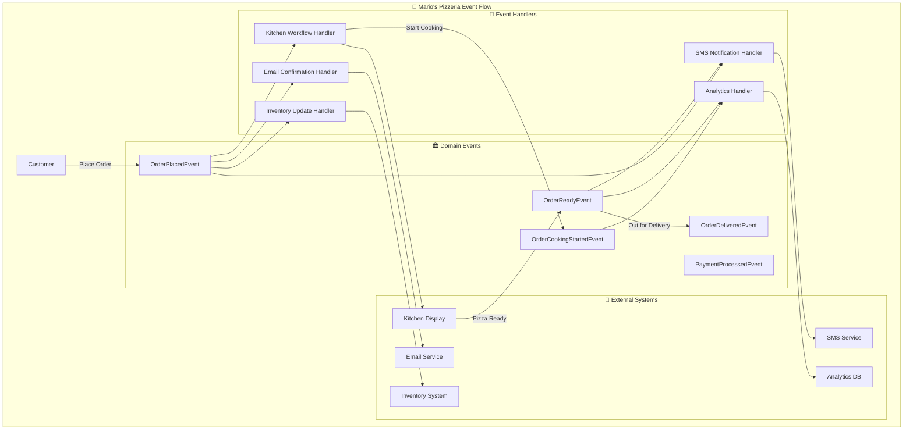
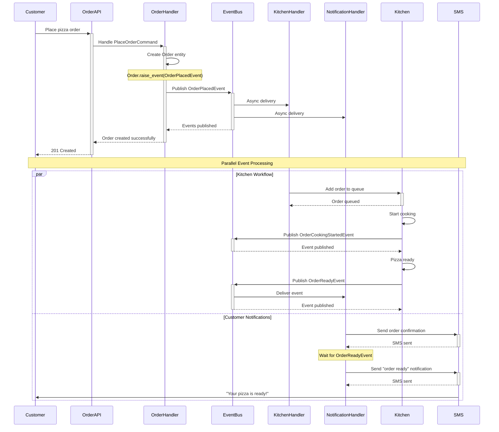

# 📡 Event-Driven Architecture Pattern

!!! warning "🚧 Under Construction"
This page is currently being developed with comprehensive examples from Mario's Pizzeria. More detailed implementations and code samples are being added.

Event-Driven Architecture uses events to communicate between decoupled components, enabling loose coupling, scalability, and reactive system behavior.

## 🎯 Overview

Event-Driven Architecture (EDA) promotes loose coupling through asynchronous event communication. Mario's Pizzeria demonstrates this pattern through domain events that coordinate kitchen operations, customer notifications, and order tracking.



## ✅ Benefits

### 1. **Loose Coupling**

Components communicate through events without direct dependencies:

```python
# Order placement doesn't know about kitchen or notifications
class PlaceOrderHandler(CommandHandler[PlaceOrderCommand, OperationResult[OrderDto]]):
    async def handle_async(self, command: PlaceOrderCommand) -> OperationResult[OrderDto]:
        order = Order.create(command.customer_id, command.items)
        await self._repository.save_async(order)

        # Domain entity raises event - handler doesn't know who listens
        # OrderPlacedEvent is automatically published by the framework

        return self.created(self.mapper.map(order, OrderDto))

# Multiple handlers can respond to events independently
class KitchenWorkflowHandler(EventHandler[OrderPlacedEvent]):
    async def handle_async(self, event: OrderPlacedEvent):
        await self._kitchen_service.add_to_queue_async(event.order_id)

class CustomerNotificationHandler(EventHandler[OrderPlacedEvent]):
    async def handle_async(self, event: OrderPlacedEvent):
        await self._sms_service.send_confirmation_async(
            event.customer_phone, event.order_id
        )
```

### 2. **Scalability**

Event handlers can be scaled independently based on load:

```python
# High-volume analytics can be processed separately
class OrderAnalyticsHandler(EventHandler[OrderPlacedEvent]):
    async def handle_async(self, event: OrderPlacedEvent):
        # This can be processed in background/separate service
        analytics_data = AnalyticsEvent(
            event_type="order_placed",
            customer_id=event.customer_id,
            order_value=event.total_amount,
            timestamp=event.occurred_at
        )
        await self._analytics_service.track_async(analytics_data)
```

### 3. **Resilience**

Failed event handlers don't affect the main workflow:

```python
# If SMS fails, order processing continues
class ResilientNotificationHandler(EventHandler[OrderReadyEvent]):
    async def handle_async(self, event: OrderReadyEvent):
        try:
            await self._sms_service.notify_customer_async(
                event.customer_phone,
                f"Your order #{event.order_id} is ready!"
            )
        except Exception as ex:
            # Log error but don't fail the entire workflow
            self._logger.error(f"SMS notification failed: {ex}")
            # Could queue for retry or use alternative notification
```

## 🔄 Data Flow

The pizza preparation workflow demonstrates event-driven data flow:



## 🎯 Use Cases

Event-Driven Architecture is ideal for:

- **Microservices**: Decoupled service communication
- **Real-time Systems**: Immediate response to state changes
- **Complex Workflows**: Multi-step processes with branching logic
- **Integration**: Connecting disparate systems

## 🍕 Implementation in Mario's Pizzeria

### Domain Events

```python
# Domain events represent important business occurrences
@dataclass
class OrderPlacedEvent(DomainEvent):
    order_id: str
    customer_id: str
    customer_phone: str
    items: List[OrderItemDto]
    total_amount: Decimal
    delivery_address: str
    estimated_delivery_time: datetime

@dataclass
class OrderReadyEvent(DomainEvent):
    order_id: str
    customer_id: str
    customer_phone: str
    preparation_time: timedelta
    pickup_instructions: str

@dataclass
class InventoryLowEvent(DomainEvent):
    ingredient_id: str
    ingredient_name: str
    current_quantity: int
    minimum_threshold: int
    supplier_info: SupplierDto
```

### Event Handlers

```python
# Kitchen workflow responds to order events
class KitchenWorkflowHandler(EventHandler[OrderPlacedEvent]):
    def __init__(self,
                 kitchen_service: KitchenService,
                 inventory_service: InventoryService):
        self._kitchen = kitchen_service
        self._inventory = inventory_service

    async def handle_async(self, event: OrderPlacedEvent):
        # Check ingredient availability
        availability = await self._inventory.check_ingredients_async(event.items)
        if not availability.all_available:
            # Raise event for procurement
            await self._event_bus.publish_async(
                InventoryLowEvent(
                    ingredient_id=availability.missing_ingredients[0],
                    current_quantity=availability.current_stock,
                    minimum_threshold=availability.required_stock
                )
            )

        # Add to kitchen queue
        kitchen_order = KitchenOrder(
            order_id=event.order_id,
            items=event.items,
            priority=self._calculate_priority(event),
            estimated_prep_time=self._calculate_prep_time(event.items)
        )

        await self._kitchen.add_to_queue_async(kitchen_order)

        # Raise cooking started event
        await self._event_bus.publish_async(
            OrderCookingStartedEvent(
                order_id=event.order_id,
                estimated_ready_time=datetime.utcnow() + kitchen_order.estimated_prep_time
            )
        )

# Customer communication handler
class CustomerCommunicationHandler:
    def __init__(self,
                 sms_service: SMSService,
                 email_service: EmailService):
        self._sms = sms_service
        self._email = email_service

    @event_handler(OrderPlacedEvent)
    async def send_order_confirmation(self, event: OrderPlacedEvent):
        confirmation_message = f"""
        🍕 Order Confirmed!

        Order #{event.order_id}
        Total: ${event.total_amount}
        Estimated delivery: {event.estimated_delivery_time.strftime('%H:%M')}

        We'll notify you when your pizza is ready!
        """

        await self._sms.send_async(event.customer_phone, confirmation_message)
        await self._email.send_order_confirmation_async(event)

    @event_handler(OrderReadyEvent)
    async def send_ready_notification(self, event: OrderReadyEvent):
        ready_message = f"""
        🎉 Your pizza is ready!

        Order #{event.order_id}
        Pickup instructions: {event.pickup_instructions}

        Please collect within 10 minutes for best quality.
        """

        await self._sms.send_async(event.customer_phone, ready_message)

# Analytics and reporting handler
class AnalyticsHandler:
    @event_handler(OrderPlacedEvent)
    async def track_order_metrics(self, event: OrderPlacedEvent):
        metrics = OrderMetrics(
            order_id=event.order_id,
            customer_id=event.customer_id,
            order_value=event.total_amount,
            item_count=len(event.items),
            order_time=event.occurred_at,
            customer_type=await self._get_customer_type(event.customer_id)
        )

        await self._analytics_db.save_metrics_async(metrics)

    @event_handler(OrderReadyEvent)
    async def track_preparation_metrics(self, event: OrderReadyEvent):
        prep_metrics = PreparationMetrics(
            order_id=event.order_id,
            preparation_time=event.preparation_time,
            efficiency_score=self._calculate_efficiency(event.preparation_time)
        )

        await self._analytics_db.save_prep_metrics_async(prep_metrics)
```

### Event Bus Configuration

```python
# Configure event routing and handlers
class EventBusConfiguration:
    def configure_events(self, services: ServiceCollection):
        # Register event handlers
        services.add_scoped(KitchenWorkflowHandler)
        services.add_scoped(CustomerCommunicationHandler)
        services.add_scoped(AnalyticsHandler)
        services.add_scoped(InventoryManagementHandler)

        # Configure event routing
        services.add_event_handler(OrderPlacedEvent, KitchenWorkflowHandler)
        services.add_event_handler(OrderPlacedEvent, CustomerCommunicationHandler)
        services.add_event_handler(OrderPlacedEvent, AnalyticsHandler)

        services.add_event_handler(OrderReadyEvent, CustomerCommunicationHandler)
        services.add_event_handler(OrderReadyEvent, AnalyticsHandler)

        services.add_event_handler(InventoryLowEvent, InventoryManagementHandler)
```

### CloudEvents Integration

```python
# CloudEvents for external system integration
class CloudEventPublisher:
    def __init__(self, event_bus: EventBus):
        self._event_bus = event_bus

    async def publish_order_event(self, order_event: OrderPlacedEvent):
        # Convert domain event to CloudEvent for external systems
        cloud_event = CloudEvent(
            source="mario-pizzeria/orders",
            type="com.mariopizzeria.order.placed",
            subject=f"order/{order_event.order_id}",
            data={
                "orderId": order_event.order_id,
                "customerId": order_event.customer_id,
                "totalAmount": float(order_event.total_amount),
                "items": [item.to_dict() for item in order_event.items],
                "estimatedDelivery": order_event.estimated_delivery_time.isoformat()
            },
            datacontenttype="application/json"
        )

        await self._event_bus.publish_cloud_event_async(cloud_event)
```

## 🧪 Testing Event-Driven Systems

```python
# Test event handling independently
class TestKitchenWorkflowHandler:
    def setup_method(self):
        self.mock_kitchen = Mock(spec=KitchenService)
        self.mock_inventory = Mock(spec=InventoryService)
        self.handler = KitchenWorkflowHandler(self.mock_kitchen, self.mock_inventory)

    async def test_order_placed_adds_to_kitchen_queue(self):
        # Arrange
        event = OrderPlacedEvent(
            order_id="123",
            customer_id="456",
            items=[OrderItemDto(name="Margherita", size="Large")]
        )

        self.mock_inventory.check_ingredients_async.return_value = IngredientAvailability(
            all_available=True
        )

        # Act
        await self.handler.handle_async(event)

        # Assert
        self.mock_kitchen.add_to_queue_async.assert_called_once()
        kitchen_order = self.mock_kitchen.add_to_queue_async.call_args[0][0]
        assert kitchen_order.order_id == "123"

# Integration testing with event bus
class TestEventIntegration:
    async def test_order_placement_triggers_all_handlers(self):
        # Arrange
        event_bus = InMemoryEventBus()
        kitchen_handler = Mock(spec=KitchenWorkflowHandler)
        notification_handler = Mock(spec=CustomerCommunicationHandler)

        event_bus.subscribe(OrderPlacedEvent, kitchen_handler)
        event_bus.subscribe(OrderPlacedEvent, notification_handler)

        event = OrderPlacedEvent(order_id="123", customer_id="456")

        # Act
        await event_bus.publish_async(event)

        # Assert
        kitchen_handler.handle_async.assert_called_once_with(event)
        notification_handler.send_order_confirmation.assert_called_once_with(event)
```

## 🔗 Related Patterns

- **[CQRS Pattern](cqrs.md)** - Commands often produce domain events
- **[Clean Architecture](clean-architecture.md)** - Events enable layer decoupling
- **[Repository Pattern](repository.md)** - Events can trigger repository operations

---

_This pattern guide demonstrates Event-Driven Architecture using Mario's Pizzeria's kitchen workflow and customer communication systems. Events enable loose coupling and reactive behavior across the entire pizza ordering experience._ 📡
