# 📡 Event-Driven Architecture Pattern

**Estimated reading time: 20 minutes**

Event-Driven Architecture uses events to communicate between decoupled components, enabling loose coupling, scalability, and reactive system behavior.

## 🎯 What & Why

### The Problem: Tight Coupling in Synchronous Systems

Without event-driven architecture, components become tightly coupled through direct method calls:

```python
# ❌ Problem: Order handler tightly coupled to all downstream systems
class PlaceOrderHandler(CommandHandler):
    def __init__(
        self,
        repository: IOrderRepository,
        kitchen_service: KitchenService,
        sms_service: SMSService,
        email_service: EmailService,
        inventory_service: InventoryService,
        analytics_service: AnalyticsService
    ):
        # Handler knows about ALL downstream systems
        self._repository = repository
        self._kitchen = kitchen_service
        self._sms = sms_service
        self._email = email_service
        self._inventory = inventory_service
        self._analytics = analytics_service

    async def handle_async(self, command: PlaceOrderCommand):
        # Create order
        order = Order.create(command.customer_id, command.items)
        await self._repository.save_async(order)

        # ❌ Direct calls to every system - tightly coupled
        await self._kitchen.add_to_queue_async(order.id)
        await self._sms.send_confirmation_async(order.customer_phone)
        await self._email.send_confirmation_async(order.customer_email)
        await self._inventory.reserve_ingredients_async(order.items)
        await self._analytics.track_order_async(order)

        # ❌ If SMS service is down, entire order placement fails
        # ❌ Adding new notification channel requires changing this handler
        # ❌ All operations execute sequentially, slowing response time

        return self.created(order_dto)
```

**Problems with this approach:**

1. **High Coupling**: Handler depends on 6+ services directly
2. **Brittleness**: If any downstream service fails, the entire operation fails
3. **Poor Scalability**: All operations execute sequentially in one request
4. **Hard to Extend**: Adding new functionality requires modifying handler
5. **Testing Complexity**: Must mock all dependencies for testing

### The Solution: Event-Driven Decoupling

With event-driven architecture, components communicate through events:

```python
# ✅ Solution: Handler only knows about domain, publishes event
class PlaceOrderHandler(CommandHandler):
    def __init__(
        self,
        repository: IOrderRepository,
        mapper: Mapper
    ):
        # Handler only depends on repository
        self._repository = repository
        self._mapper = mapper

    async def handle_async(self, command: PlaceOrderCommand):
        # Create order
        order = Order.create(command.customer_id, command.items)

        # Domain entity raises event automatically
        # order.raise_event(OrderPlacedEvent(...))

        await self._repository.save_async(order)

        # ✅ Event automatically published by framework
        # ✅ Handler doesn't know who listens to the event
        # ✅ Multiple handlers process event independently and asynchronously
        # ✅ If SMS fails, order placement still succeeds

        return self.created(self._mapper.map(order, OrderDto))

# Independent event handlers respond to OrderPlacedEvent
class KitchenWorkflowHandler(EventHandler[OrderPlacedEvent]):
    async def handle_async(self, event: OrderPlacedEvent):
        await self._kitchen_service.add_to_queue_async(event.order_id)

class CustomerNotificationHandler(EventHandler[OrderPlacedEvent]):
    async def handle_async(self, event: OrderPlacedEvent):
        await self._sms_service.send_confirmation_async(event.customer_phone)

class InventoryHandler(EventHandler[OrderPlacedEvent]):
    async def handle_async(self, event: OrderPlacedEvent):
        await self._inventory_service.reserve_ingredients_async(event.items)

class AnalyticsHandler(EventHandler[OrderPlacedEvent]):
    async def handle_async(self, event: OrderPlacedEvent):
        await self._analytics_service.track_order_async(event)
```

**Benefits of event-driven approach:**

1. **Loose Coupling**: Components don't know about each other
2. **Independent Scaling**: Each handler scales independently
3. **Fault Isolation**: Failed handlers don't affect core workflow
4. **Easy Extension**: Add new handlers without changing existing code
5. **Parallel Processing**: Handlers execute concurrently
6. **Simple Testing**: Test handlers in isolation

## 🎯 Overview

Event-Driven Architecture (EDA) promotes loose coupling through asynchronous event communication. Mario's Pizzeria demonstrates this pattern through domain events that coordinate kitchen operations, customer notifications, and order tracking.

```mermaid
flowchart TD
    subgraph "🍕 Mario's Pizzeria Event Flow"
        Customer[Customer]

        subgraph Domain["🏛️ Domain Events"]
            OrderPlaced[OrderPlacedEvent]
            PaymentProcessed[PaymentProcessedEvent]
            OrderCooking[OrderCookingStartedEvent]
            OrderReady[OrderReadyEvent]
            OrderDelivered[OrderDeliveredEvent]
        end

        subgraph Handlers["📡 Event Handlers"]
            KitchenHandler[Kitchen Workflow Handler]
            NotificationHandler[SMS Notification Handler]
            InventoryHandler[Inventory Update Handler]
            AnalyticsHandler[Analytics Handler]
            EmailHandler[Email Confirmation Handler]
        end

        subgraph External["🔌 External Systems"]
            Kitchen[Kitchen Display]
            SMS[SMS Service]
            Email[Email Service]
            Analytics[Analytics DB]
            Inventory[Inventory System]
        end
    end

    Customer -->|"Place Order"| OrderPlaced

    OrderPlaced --> KitchenHandler
    OrderPlaced --> NotificationHandler
    OrderPlaced --> InventoryHandler
    OrderPlaced --> EmailHandler

    KitchenHandler -->|"Start Cooking"| OrderCooking
    KitchenHandler --> Kitchen

    OrderCooking --> AnalyticsHandler

    Kitchen -->|"Pizza Ready"| OrderReady
    OrderReady --> NotificationHandler
    OrderReady --> AnalyticsHandler

    NotificationHandler --> SMS
    EmailHandler --> Email
    InventoryHandler --> Inventory
    AnalyticsHandler --> Analytics

    OrderReady -->|"Out for Delivery"| OrderDelivered
```



## ✅ Benefits

### 1. **Loose Coupling**

Components communicate through events without direct dependencies:

```python
# Order placement doesn't know about kitchen or notifications
class PlaceOrderHandler(CommandHandler[PlaceOrderCommand, OperationResult[OrderDto]]):
    async def handle_async(self, command: PlaceOrderCommand) -> OperationResult[OrderDto]:
        order = Order.create(command.customer_id, command.items)
        await self._repository.save_async(order)

        # Domain entity raises event - handler doesn't know who listens
        # OrderPlacedEvent is automatically published by the framework

        return self.created(self.mapper.map(order, OrderDto))

# Multiple handlers can respond to events independently
class KitchenWorkflowHandler(EventHandler[OrderPlacedEvent]):
    async def handle_async(self, event: OrderPlacedEvent):
        await self._kitchen_service.add_to_queue_async(event.order_id)

class CustomerNotificationHandler(EventHandler[OrderPlacedEvent]):
    async def handle_async(self, event: OrderPlacedEvent):
        await self._sms_service.send_confirmation_async(
            event.customer_phone, event.order_id
        )
```

### 2. **Scalability**

Event handlers can be scaled independently based on load:

```python
# High-volume analytics can be processed separately
class OrderAnalyticsHandler(EventHandler[OrderPlacedEvent]):
    async def handle_async(self, event: OrderPlacedEvent):
        # This can be processed in background/separate service
        analytics_data = AnalyticsEvent(
            event_type="order_placed",
            customer_id=event.customer_id,
            order_value=event.total_amount,
            timestamp=event.occurred_at
        )
        await self._analytics_service.track_async(analytics_data)
```

### 3. **Resilience**

Failed event handlers don't affect the main workflow:

```python
# If SMS fails, order processing continues
class ResilientNotificationHandler(EventHandler[OrderReadyEvent]):
    async def handle_async(self, event: OrderReadyEvent):
        try:
            await self._sms_service.notify_customer_async(
                event.customer_phone,
                f"Your order #{event.order_id} is ready!"
            )
        except Exception as ex:
            # Log error but don't fail the entire workflow
            self._logger.error(f"SMS notification failed: {ex}")
            # Could queue for retry or use alternative notification
```

## 🔄 Data Flow

The pizza preparation workflow demonstrates event-driven data flow:


## 🎯 Use Cases

Event-Driven Architecture is ideal for:

- **Microservices**: Decoupled service communication
- **Real-time Systems**: Immediate response to state changes
- **Complex Workflows**: Multi-step processes with branching logic
- **Integration**: Connecting disparate systems

## 🍕 Implementation in Mario's Pizzeria

### Domain Events

```python
# Domain events represent important business occurrences
@dataclass
class OrderPlacedEvent(DomainEvent):
    order_id: str
    customer_id: str
    customer_phone: str
    items: List[OrderItemDto]
    total_amount: Decimal
    delivery_address: str
    estimated_delivery_time: datetime

@dataclass
class OrderReadyEvent(DomainEvent):
    order_id: str
    customer_id: str
    customer_phone: str
    preparation_time: timedelta
    pickup_instructions: str

@dataclass
class InventoryLowEvent(DomainEvent):
    ingredient_id: str
    ingredient_name: str
    current_quantity: int
    minimum_threshold: int
    supplier_info: SupplierDto
```

### Event Handlers

```python
# Kitchen workflow responds to order events
class KitchenWorkflowHandler(EventHandler[OrderPlacedEvent]):
    def __init__(self,
                 kitchen_service: KitchenService,
                 inventory_service: InventoryService):
        self._kitchen = kitchen_service
        self._inventory = inventory_service

    async def handle_async(self, event: OrderPlacedEvent):
        # Check ingredient availability
        availability = await self._inventory.check_ingredients_async(event.items)
        if not availability.all_available:
            # Raise event for procurement
            await self._event_bus.publish_async(
                InventoryLowEvent(
                    ingredient_id=availability.missing_ingredients[0],
                    current_quantity=availability.current_stock,
                    minimum_threshold=availability.required_stock
                )
            )

        # Add to kitchen queue
        kitchen_order = KitchenOrder(
            order_id=event.order_id,
            items=event.items,
            priority=self._calculate_priority(event),
            estimated_prep_time=self._calculate_prep_time(event.items)
        )

        await self._kitchen.add_to_queue_async(kitchen_order)

        # Raise cooking started event
        await self._event_bus.publish_async(
            OrderCookingStartedEvent(
                order_id=event.order_id,
                estimated_ready_time=datetime.utcnow() + kitchen_order.estimated_prep_time
            )
        )

# Customer communication handler
class CustomerCommunicationHandler:
    def __init__(self,
                 sms_service: SMSService,
                 email_service: EmailService):
        self._sms = sms_service
        self._email = email_service

    @event_handler(OrderPlacedEvent)
    async def send_order_confirmation(self, event: OrderPlacedEvent):
        confirmation_message = f"""
        🍕 Order Confirmed!

        Order #{event.order_id}
        Total: ${event.total_amount}
        Estimated delivery: {event.estimated_delivery_time.strftime('%H:%M')}

        We'll notify you when your pizza is ready!
        """

        await self._sms.send_async(event.customer_phone, confirmation_message)
        await self._email.send_order_confirmation_async(event)

    @event_handler(OrderReadyEvent)
    async def send_ready_notification(self, event: OrderReadyEvent):
        ready_message = f"""
        🎉 Your pizza is ready!

        Order #{event.order_id}
        Pickup instructions: {event.pickup_instructions}

        Please collect within 10 minutes for best quality.
        """

        await self._sms.send_async(event.customer_phone, ready_message)

# Analytics and reporting handler
class AnalyticsHandler:
    @event_handler(OrderPlacedEvent)
    async def track_order_metrics(self, event: OrderPlacedEvent):
        metrics = OrderMetrics(
            order_id=event.order_id,
            customer_id=event.customer_id,
            order_value=event.total_amount,
            item_count=len(event.items),
            order_time=event.occurred_at,
            customer_type=await self._get_customer_type(event.customer_id)
        )

        await self._analytics_db.save_metrics_async(metrics)

    @event_handler(OrderReadyEvent)
    async def track_preparation_metrics(self, event: OrderReadyEvent):
        prep_metrics = PreparationMetrics(
            order_id=event.order_id,
            preparation_time=event.preparation_time,
            efficiency_score=self._calculate_efficiency(event.preparation_time)
        )

        await self._analytics_db.save_prep_metrics_async(prep_metrics)
```

### Event Bus Configuration

```python
# Configure event routing and handlers
class EventBusConfiguration:
    def configure_events(self, services: ServiceCollection):
        # Register event handlers
        services.add_scoped(KitchenWorkflowHandler)
        services.add_scoped(CustomerCommunicationHandler)
        services.add_scoped(AnalyticsHandler)
        services.add_scoped(InventoryManagementHandler)

        # Configure event routing
        services.add_event_handler(OrderPlacedEvent, KitchenWorkflowHandler)
        services.add_event_handler(OrderPlacedEvent, CustomerCommunicationHandler)
        services.add_event_handler(OrderPlacedEvent, AnalyticsHandler)

        services.add_event_handler(OrderReadyEvent, CustomerCommunicationHandler)
        services.add_event_handler(OrderReadyEvent, AnalyticsHandler)

        services.add_event_handler(InventoryLowEvent, InventoryManagementHandler)
```

### CloudEvents Integration

```python
# CloudEvents for external system integration
class CloudEventPublisher:
    def __init__(self, event_bus: EventBus):
        self._event_bus = event_bus

    async def publish_order_event(self, order_event: OrderPlacedEvent):
        # Convert domain event to CloudEvent for external systems
        cloud_event = CloudEvent(
            source="mario-pizzeria/orders",
            type="com.mariopizzeria.order.placed",
            subject=f"order/{order_event.order_id}",
            data={
                "orderId": order_event.order_id,
                "customerId": order_event.customer_id,
                "totalAmount": float(order_event.total_amount),
                "items": [item.to_dict() for item in order_event.items],
                "estimatedDelivery": order_event.estimated_delivery_time.isoformat()
            },
            datacontenttype="application/json"
        )

        await self._event_bus.publish_cloud_event_async(cloud_event)
```

## 🧪 Testing Event-Driven Systems

### Unit Testing Event Handlers

```python
import pytest
from unittest.mock import AsyncMock, Mock

@pytest.mark.asyncio
async def test_kitchen_workflow_handler():
    # Arrange
    mock_kitchen = AsyncMock(spec=KitchenService)
    mock_inventory = AsyncMock(spec=InventoryService)
    mock_inventory.check_ingredients_async.return_value = IngredientAvailability(
        all_available=True
    )

    handler = KitchenWorkflowHandler(mock_kitchen, mock_inventory)

    event = OrderPlacedEvent(
        order_id="order_123",
        customer_id="cust_456",
        items=[OrderItemDto(pizza_name="Margherita", size="large", quantity=2)],
        total_amount=Decimal("31.98")
    )

    # Act
    await handler.handle_async(event)

    # Assert
    mock_inventory.check_ingredients_async.assert_called_once()
    mock_kitchen.add_to_queue_async.assert_called_once()

    kitchen_order = mock_kitchen.add_to_queue_async.call_args[0][0]
    assert kitchen_order.order_id == "order_123"

@pytest.mark.asyncio
async def test_notification_handler_resilience():
    # Arrange
    mock_sms = AsyncMock(spec=SMSService)
    mock_sms.send_async.side_effect = Exception("SMS service unavailable")
    mock_logger = Mock()

    handler = CustomerNotificationHandler(mock_sms, mock_logger)
    event = OrderReadyEvent(order_id="123", customer_phone="+1234567890")

    # Act - should not raise exception
    await handler.handle_async(event)

    # Assert - error logged but execution continued
    mock_logger.error.assert_called_once()
```

### Integration Testing with Event Bus

```python
@pytest.mark.integration
class TestEventIntegration:
    @pytest.fixture
    def event_bus(self):
        """Create in-memory event bus for testing"""
        return InMemoryEventBus()

    @pytest.mark.asyncio
    async def test_order_placement_triggers_all_handlers(self, event_bus):
        # Arrange
        kitchen_handler = Mock(spec=KitchenWorkflowHandler)
        kitchen_handler.handle_async = AsyncMock()

        notification_handler = Mock(spec=CustomerNotificationHandler)
        notification_handler.send_order_confirmation = AsyncMock()

        analytics_handler = Mock(spec=AnalyticsHandler)
        analytics_handler.track_order_metrics = AsyncMock()

        # Subscribe handlers
        event_bus.subscribe(OrderPlacedEvent, kitchen_handler)
        event_bus.subscribe(OrderPlacedEvent, notification_handler)
        event_bus.subscribe(OrderPlacedEvent, analytics_handler)

        event = OrderPlacedEvent(
            order_id="order_123",
            customer_id="cust_456",
            items=[],
            total_amount=Decimal("20.00")
        )

        # Act
        await event_bus.publish_async(event)

        # Assert - all handlers received event
        kitchen_handler.handle_async.assert_called_once_with(event)
        notification_handler.send_order_confirmation.assert_called_once_with(event)
        analytics_handler.track_order_metrics.assert_called_once_with(event)

    @pytest.mark.asyncio
    async def test_handler_failure_does_not_affect_others(self, event_bus):
        # Arrange
        failing_handler = Mock(spec=EventHandler)
        failing_handler.handle_async = AsyncMock(side_effect=Exception("Handler failed"))

        successful_handler = Mock(spec=EventHandler)
        successful_handler.handle_async = AsyncMock()

        event_bus.subscribe(OrderPlacedEvent, failing_handler)
        event_bus.subscribe(OrderPlacedEvent, successful_handler)

        event = OrderPlacedEvent(order_id="123", customer_id="456")

        # Act
        await event_bus.publish_async(event)

        # Assert - successful handler still executed
        failing_handler.handle_async.assert_called_once()
        successful_handler.handle_async.assert_called_once()
```

## ⚠️ Common Mistakes

### 1. Event Coupling (Tight Event Dependencies)

```python
# ❌ Wrong - events coupled to specific consumers
@dataclass
class OrderPlacedEvent(DomainEvent):
    order_id: str
    customer_id: str
    # ❌ Event knows about SMS service details
    sms_provider: str
    sms_api_key: str
    # ❌ Event knows about kitchen system details
    kitchen_display_id: str
    kitchen_printer_ip: str

# ✅ Correct - events contain only domain information
@dataclass
class OrderPlacedEvent(DomainEvent):
    order_id: str
    customer_id: str
    customer_phone: str
    items: List[OrderItemDto]
    total_amount: Decimal
    delivery_address: str
    # ✅ Generic domain data - handlers decide how to use it
```

### 2. Large Events with Too Much Data

```python
# ❌ Wrong - event contains entire order aggregate
@dataclass
class OrderPlacedEvent(DomainEvent):
    order: Order  # ❌ Entire aggregate with all data
    customer: Customer  # ❌ Complete customer aggregate
    menu: Menu  # ❌ Entire menu for price lookup
    inventory: InventorySnapshot  # ❌ Full inventory state

# ✅ Correct - event contains only essential data
@dataclass
class OrderPlacedEvent(DomainEvent):
    order_id: str  # ✅ ID for handlers to fetch details if needed
    customer_id: str
    items: List[OrderItemDto]  # ✅ Only essential order information
    total_amount: Decimal
    # Handlers can query repository for more details if needed
```

### 3. Missing Error Handling

```python
# ❌ Wrong - event handler can crash entire system
class CustomerNotificationHandler(EventHandler[OrderReadyEvent]):
    async def handle_async(self, event: OrderReadyEvent):
        # ❌ No error handling - exception bubbles up
        await self._sms_service.send_async(
            event.customer_phone,
            f"Your order #{event.order_id} is ready!"
        )

# ✅ Correct - resilient event handler with error handling
class CustomerNotificationHandler(EventHandler[OrderReadyEvent]):
    async def handle_async(self, event: OrderReadyEvent):
        try:
            await self._sms_service.send_async(
                event.customer_phone,
                f"Your order #{event.order_id} is ready!"
            )
        except SMSServiceException as ex:
            # ✅ Log error and continue
            self._logger.error(
                f"SMS notification failed for order {event.order_id}: {ex}"
            )
            # ✅ Optional: queue for retry
            await self._retry_queue.enqueue_async(
                RetryMessage(event=event, attempt=1)
            )
        except Exception as ex:
            # ✅ Catch unexpected errors
            self._logger.exception(
                f"Unexpected error in notification handler: {ex}"
            )
```

### 4. Synchronous Processing of Events

```python
# ❌ Wrong - processing events synchronously blocks the request
class PlaceOrderHandler(CommandHandler):
    async def handle_async(self, command: PlaceOrderCommand):
        order = Order.create(command.customer_id, command.items)
        await self._repository.save_async(order)

        # ❌ Waiting for all event handlers before responding
        event = OrderPlacedEvent(order_id=order.id, ...)
        await self._event_bus.publish_and_wait_async(event)  # ❌ Blocks

        return self.created(order_dto)

# ✅ Correct - fire-and-forget event publishing
class PlaceOrderHandler(CommandHandler):
    async def handle_async(self, command: PlaceOrderCommand):
        order = Order.create(command.customer_id, command.items)
        await self._repository.save_async(order)

        # ✅ Events published asynchronously, don't wait
        # Domain events automatically published by framework

        return self.created(order_dto)  # ✅ Respond immediately
```

### 5. Event Versioning Ignored

```python
# ❌ Wrong - breaking changes to event structure
@dataclass
class OrderPlacedEvent(DomainEvent):
    order_id: str
    # ❌ Removed customer_phone, breaking existing handlers
    # customer_phone: str  # REMOVED
    customer_email: str  # ❌ Added new required field

# ✅ Correct - backward-compatible event evolution
@dataclass
class OrderPlacedEventV2(DomainEvent):
    order_id: str
    customer_phone: Optional[str] = None  # ✅ Keep old field as optional
    customer_email: Optional[str] = None  # ✅ New field is optional
    customer_contact_info: ContactInfo = None  # ✅ New structured approach

    event_version: str = "2.0"  # ✅ Version tracking

# OR use event transformation
class EventAdapter:
    def transform(self, old_event: OrderPlacedEvent) -> OrderPlacedEventV2:
        return OrderPlacedEventV2(
            order_id=old_event.order_id,
            customer_phone=old_event.customer_phone,
            customer_email=None,
            event_version="2.0"
        )
```

## 🚫 When NOT to Use

### 1. Simple CRUD Operations

For straightforward create/read/update/delete operations with no side effects:

```python
# Event-driven is overkill for simple CRUD
@app.get("/menu/pizzas")
async def get_pizzas(db: Database):
    # Simple read - no need for events
    return await db.pizzas.find().to_list(None)

@app.post("/customers")
async def create_customer(customer: CreateCustomerDto, db: Database):
    # Simple creation with no business logic - no need for events
    return await db.customers.insert_one(customer.dict())
```

### 2. Transactions Requiring Strong Consistency

When operations must complete together or not at all:

```python
# Event-driven doesn't guarantee transactional consistency
# Use Unit of Work pattern instead

async def transfer_loyalty_points(from_customer: str, to_customer: str, points: int):
    # ❌ Events won't work - need atomic transaction
    # If deduct succeeds but add fails, data becomes inconsistent

    # ✅ Use Unit of Work or database transaction
    async with self._unit_of_work.begin_transaction():
        await self._customer_repo.deduct_points_async(from_customer, points)
        await self._customer_repo.add_points_async(to_customer, points)
        await self._unit_of_work.commit_async()
```

### 3. Synchronous Request-Response Flows

When caller needs immediate response from downstream operation:

```python
# ❌ Event-driven not suitable - caller needs immediate result
async def validate_customer_credit(customer_id: str) -> bool:
    # Caller needs immediate yes/no answer
    # Can't wait for asynchronous event processing

    # ✅ Use direct service call instead
    return await self._credit_service.check_credit_async(customer_id)
```

### 4. Small Applications with Simple Workflows

For small apps without complex workflows or integration needs:

```python
# Simple pizza menu app with no integrations
# Event-driven architecture adds unnecessary complexity

# ✅ Direct service calls are simpler
class SimplePizzaService:
    async def create_order(self, order_data: dict):
        order = Order(**order_data)
        await self._db.orders.insert_one(order)
        return order  # No events needed
```

## 📝 Key Takeaways

1. **Loose Coupling**: Events enable components to communicate without knowing about each other
2. **Async Processing**: Event handlers execute independently and asynchronously
3. **Fault Isolation**: Failed handlers don't affect core business operations
4. **Scalability**: Scale event handlers independently based on load
5. **Extensibility**: Add new handlers without modifying existing code
6. **Domain Events**: Capture important business occurrences in domain layer
7. **Error Handling**: Handlers must be resilient with proper error handling
8. **Event Design**: Keep events small with only essential domain information
9. **Testing**: Test handlers in isolation with mocked dependencies
10. **Use Judiciously**: Not suitable for transactional operations or simple CRUD

## 🔗 Related Patterns

- [CQRS Pattern](cqrs.md) - Commands often produce domain events for queries to consume
- [Clean Architecture](clean-architecture.md) - Events enable layer decoupling without dependencies
- [Repository Pattern](repository.md) - Events can trigger repository operations in handlers
- [Domain-Driven Design](domain-driven-design.md) - Domain entities raise events for business occurrences

---

_This pattern guide demonstrates Event-Driven Architecture using Mario's Pizzeria's kitchen workflow and customer communication systems. Events enable loose coupling and reactive behavior across the entire pizza ordering experience._ 📡
