# 🎯 Event Sourcing Pattern

Event Sourcing is a data storage pattern where state changes are stored as a sequence of immutable events rather
than updating data in place. Instead of persisting current state directly, the pattern captures all changes as
events that can be replayed to reconstruct state at any point in time, providing complete audit trails, temporal
queries, and business intelligence capabilities.

## 🎯 Pattern Intent

Replace traditional state-based persistence with an append-only event log that serves as the authoritative source
of
truth. Enable system reconstruction, audit trails, temporal queries, and business analytics through immutable event
sequences while maintaining data integrity and providing deep insights into system behavior over time.

## 🏗️ Pattern Structure

```mermaid
flowchart TD
    subgraph "🎯 Event Sourcing Core"
        A["📝 Domain Events<br/>Immutable Facts"]
        B["📚 Event Store<br/>Append-Only Log"]
        C["🔄 Event Stream<br/>Ordered Sequence"]
        D["🏗️ Aggregate Root<br/>Business Logic"]
    end

    subgraph "📊 State Management"
        E["⚡ Current State<br/>Computed from Events"]
        F["🕰️ Historical State<br/>Point-in-Time Queries"]
        G["📈 Event Replay<br/>State Reconstruction"]
        H["📸 Snapshots<br/>Performance Optimization"]
    end

    subgraph "📋 Read Models"
        I["📊 Projections<br/>Optimized Views"]
        J["🔍 Query Models<br/>Specialized Indexes"]
        K["📈 Analytics Views<br/>Business Intelligence"]
        L["🎯 Denormalized Data<br/>Fast Queries"]
    end

    A --> B
    B --> C
    C --> D
    D --> E

    C --> F
    B --> G
    E --> H

    C --> I
    I --> J
    I --> K
    I --> L

    style B fill:#e1f5fe,stroke:#0277bd,stroke-width:3px
    style C fill:#f3e5f5,stroke:#7b1fa2,stroke-width:2px
    style E fill:#e8f5e8,stroke:#2e7d32,stroke-width:2px

    classDef projections fill:#fff3e0,stroke:#f57c00,stroke-width:2px
    class I,J,K,L projections

    classDef state fill:#fce4ec,stroke:#ad1457,stroke-width:2px
    class E,F,G,H state
```



## 🍕 Pattern Implementation

### Core Event Sourcing Components

```python
from neuroglia.data.abstractions import AggregateRoot, DomainEvent
from neuroglia.eventing import event_handler
from multipledispatch import dispatch
from dataclasses import dataclass
from decimal import Decimal
from datetime import datetime
from typing import List, Optional, Dict, Any
import uuid

# Domain Events - Immutable Facts
@dataclass
class PizzaOrderPlacedEvent(DomainEvent):
    """Event representing a pizza order being placed"""
    order_id: str
    customer_id: str
    items: List[Dict[str, Any]]
    total_amount: Decimal
    placed_at: datetime

@dataclass
class PizzaOrderConfirmedEvent(DomainEvent):
    """Event representing order confirmation"""
    order_id: str
    estimated_delivery_time: datetime
    kitchen_notes: str
    confirmed_at: datetime

@dataclass
class PaymentProcessedEvent(DomainEvent):
    """Event representing successful payment"""
    order_id: str
    payment_method: str
    amount: Decimal
    transaction_id: str
    processed_at: datetime

@dataclass
class OrderStatusChangedEvent(DomainEvent):
    """Event representing order status changes"""
    order_id: str
    previous_status: str
    new_status: str
    changed_at: datetime
    reason: Optional[str] = None

# Aggregate Root with Event Sourcing
class PizzaOrder(AggregateRoot[str]):
    """Pizza order aggregate using event sourcing"""

    def __init__(self, order_id: str = None):
        super().__init__(order_id or str(uuid.uuid4()))

        # Current state computed from events
        self._customer_id = ""
        self._items = []
        self._total_amount = Decimal('0.00')
        self._status = "PENDING"
        self._placed_at = None
        self._estimated_delivery = None
        self._payment_status = "UNPAID"
        self._kitchen_notes = ""

    # Business Logic Methods - Produce Events
    def place_order(self, customer_id: str, items: List[Dict[str, Any]], total_amount: Decimal):
        """Place a new pizza order - produces PizzaOrderPlacedEvent"""

        # Business rule validation
        if not items:
            raise ValueError("Order must contain at least one item")
        if total_amount <= 0:
            raise ValueError("Order total must be positive")

        # Create and register domain event
        event = PizzaOrderPlacedEvent(
            order_id=self.id(),
            customer_id=customer_id,
            items=items,
            total_amount=total_amount,
            placed_at=datetime.utcnow()
        )

        # Apply event to update state and register for persistence
        self.state.on(self.register_event(event))

    def confirm_order(self, estimated_delivery_time: datetime, kitchen_notes: str = ""):
        """Confirm order - produces PizzaOrderConfirmedEvent"""

        # Business rule validation
        if self._status != "PENDING":
            raise ValueError(f"Cannot confirm order in status: {self._status}")

        event = PizzaOrderConfirmedEvent(
            order_id=self.id(),
            estimated_delivery_time=estimated_delivery_time,
            kitchen_notes=kitchen_notes,
            confirmed_at=datetime.utcnow()
        )

        self.state.on(self.register_event(event))

    def process_payment(self, payment_method: str, transaction_id: str):
        """Process payment - produces PaymentProcessedEvent"""

        if self._payment_status == "PAID":
            raise ValueError("Order is already paid")

        event = PaymentProcessedEvent(
            order_id=self.id(),
            payment_method=payment_method,
            amount=self._total_amount,
            transaction_id=transaction_id,
            processed_at=datetime.utcnow()
        )

        self.state.on(self.register_event(event))

    def change_status(self, new_status: str, reason: str = None):
        """Change order status - produces OrderStatusChangedEvent"""

        if self._status == new_status:
            return  # No change needed

        event = OrderStatusChangedEvent(
            order_id=self.id(),
            previous_status=self._status,
            new_status=new_status,
            changed_at=datetime.utcnow(),
            reason=reason
        )

        self.state.on(self.register_event(event))

    # State Reconstruction from Events using @dispatch
    @dispatch(PizzaOrderPlacedEvent)
    def state_manager(self, event: PizzaOrderPlacedEvent):
        """Apply order placed event to reconstruct state"""
        self._customer_id = event.customer_id
        self._items = event.items.copy()
        self._total_amount = event.total_amount
        self._status = "PENDING"
        self._placed_at = event.placed_at

    @dispatch(PizzaOrderConfirmedEvent)
    def state_manager(self, event: PizzaOrderConfirmedEvent):
        """Apply order confirmed event to reconstruct state"""
        self._status = "CONFIRMED"
        self._estimated_delivery = event.estimated_delivery_time
        self._kitchen_notes = event.kitchen_notes

    @dispatch(PaymentProcessedEvent)
    def state_manager(self, event: PaymentProcessedEvent):
        """Apply payment processed event to reconstruct state"""
        self._payment_status = "PAID"
        # Automatically move to cooking if order is confirmed and paid
        if self._status == "CONFIRMED":
            self._status = "COOKING"

    @dispatch(OrderStatusChangedEvent)
    def state_manager(self, event: OrderStatusChangedEvent):
        """Apply status change event to reconstruct state"""
        self._status = event.new_status

    # Property Accessors for Current State
    @property
    def customer_id(self) -> str:
        return self._customer_id

    @property
    def items(self) -> List[Dict[str, Any]]:
        return self._items.copy()

    @property
    def total_amount(self) -> Decimal:
        return self._total_amount

    @property
    def status(self) -> str:
        return self._status

    @property
    def payment_status(self) -> str:
        return self._payment_status

    @property
    def placed_at(self) -> Optional[datetime]:
        return self._placed_at

    @property
    def estimated_delivery(self) -> Optional[datetime]:
        return self._estimated_delivery
```

### Event Store Configuration

```python
from neuroglia.data.infrastructure.event_sourcing.event_store import ESEventStore
from neuroglia.data.infrastructure.event_sourcing.abstractions import EventStoreOptions
from neuroglia.hosting.web import WebApplicationBuilder

def configure_event_store(builder: WebApplicationBuilder):
    """Configure EventStoreDB for event sourcing"""

    # Event store configuration
    database_name = "mario_pizzeria"
    consumer_group = "pizzeria-api-v1"

    ESEventStore.configure(
        builder,
        EventStoreOptions(
            database_name=database_name,
            consumer_group=consumer_group,
            connection_string="esdb://localhost:2113?tls=false",
            credentials={"username": "admin", "password": "changeit"}
        )
    )

    # Configure event sourcing repository for write model
    EventSourcingRepository.configure(builder, PizzaOrder, str)

    return builder

# Repository Pattern for Event-Sourced Aggregates
class EventSourcingRepository:
    """Repository for event-sourced aggregates"""

    def __init__(self, event_store: EventStore, aggregator: Aggregator):
        self.event_store = event_store
        self.aggregator = aggregator

    async def save_async(self, aggregate: PizzaOrder) -> PizzaOrder:
        """Save aggregate events to event store"""

        # Get uncommitted events from aggregate
        events = aggregate.get_uncommitted_events()
        if not events:
            return aggregate

        # Persist events to event store
        stream_id = f"PizzaOrder-{aggregate.id()}"
        await self.event_store.append_async(
            stream_id=stream_id,
            events=events,
            expected_version=aggregate.version
        )

        # Mark events as committed
        aggregate.mark_events_as_committed()

        return aggregate

    async def get_by_id_async(self, order_id: str) -> Optional[PizzaOrder]:
        """Load aggregate by ID from event store"""

        stream_id = f"PizzaOrder-{order_id}"

        # Read events from event store
        events = await self.event_store.read_async(
            stream_id=stream_id,
            direction=StreamReadDirection.FORWARDS
        )

        if not events:
            return None

        # Reconstruct aggregate from events
        aggregate = PizzaOrder(order_id)
        for event_record in events:
            aggregate.state_manager(event_record.data)
            aggregate.version = event_record.stream_revision

        return aggregate
```

### Event-Driven Projections Pattern

```python
from neuroglia.eventing import event_handler
from neuroglia.data.abstractions import Repository

@dataclass
class PizzaOrderProjection:
    """Optimized read model for pizza order queries"""

    id: str
    customer_id: str
    customer_name: str  # Denormalized for fast queries
    customer_email: str  # Denormalized for fast queries
    item_count: int
    total_amount: Decimal
    status: str
    payment_status: str
    placed_at: datetime
    estimated_delivery: Optional[datetime]
    last_updated: datetime

    # Analytics fields computed from events
    time_to_confirmation: Optional[int] = None  # seconds
    time_to_payment: Optional[int] = None  # seconds

class PizzaOrderProjectionHandler:
    """Handles domain events to update read model projections"""

    def __init__(self, read_repository: Repository[PizzaOrderProjection, str]):
        self.read_repository = read_repository

    @event_handler(PizzaOrderPlacedEvent)
    async def handle_order_placed(self, event: PizzaOrderPlacedEvent):
        """Create read model projection when order is placed"""

        # Fetch customer details for denormalization
        customer = await self._get_customer_details(event.customer_id)

        projection = PizzaOrderProjection(
            id=event.order_id,
            customer_id=event.customer_id,
            customer_name=customer.name if customer else "Unknown",
            customer_email=customer.email if customer else "",
            item_count=len(event.items),
            total_amount=event.total_amount,
            status="PENDING",
            payment_status="UNPAID",
            placed_at=event.placed_at,
            estimated_delivery=None,
            last_updated=event.placed_at
        )

        await self.read_repository.add_async(projection)

    @event_handler(PizzaOrderConfirmedEvent)
    async def handle_order_confirmed(self, event: PizzaOrderConfirmedEvent):
        """Update projection when order is confirmed"""

        projection = await self.read_repository.get_by_id_async(event.order_id)
        if projection:
            # Calculate time to confirmation
            time_to_confirmation = int((event.confirmed_at - projection.placed_at).total_seconds())

            projection.status = "CONFIRMED"
            projection.estimated_delivery = event.estimated_delivery_time
            projection.time_to_confirmation = time_to_confirmation
            projection.last_updated = event.confirmed_at

            await self.read_repository.update_async(projection)

    @event_handler(PaymentProcessedEvent)
    async def handle_payment_processed(self, event: PaymentProcessedEvent):
        """Update projection when payment is processed"""

        projection = await self.read_repository.get_by_id_async(event.order_id)
        if projection:
            # Calculate time to payment
            time_to_payment = int((event.processed_at - projection.placed_at).total_seconds())

            projection.payment_status = "PAID"
            projection.time_to_payment = time_to_payment
            projection.last_updated = event.processed_at

            await self.read_repository.update_async(projection)

    @event_handler(OrderStatusChangedEvent)
    async def handle_status_changed(self, event: OrderStatusChangedEvent):
        """Update projection when order status changes"""

        projection = await self.read_repository.get_by_id_async(event.order_id)
        if projection:
            projection.status = event.new_status
            projection.last_updated = event.changed_at

            await self.read_repository.update_async(projection)

    async def _get_customer_details(self, customer_id: str) -> Optional[Any]:
        """Fetch customer details for denormalization"""
        # Implementation would fetch from customer service/repository
        return None
```

### Temporal Queries Pattern

```python
class TemporalQueryService:
    """Service for temporal queries on event-sourced aggregates"""

    def __init__(self, event_store: EventStore, aggregator: Aggregator):
        self.event_store = event_store
        self.aggregator = aggregator

    async def get_order_status_at_time(self, order_id: str, as_of_time: datetime) -> Optional[str]:
        """Get order status as it was at a specific point in time"""

        stream_id = f"PizzaOrder-{order_id}"

        # Read events up to the specified time
        events = await self.event_store.read_async(
            stream_id=stream_id,
            direction=StreamReadDirection.FORWARDS,
            from_position=0,
            to_time=as_of_time
        )

        if not events:
            return None

        # Reconstruct state at that point in time
        order = PizzaOrder(order_id)
        for event_record in events:
            order.state_manager(event_record.data)

        return order.status

    async def get_order_timeline(self, order_id: str) -> List[Dict[str, Any]]:
        """Get complete timeline of order changes"""

        stream_id = f"PizzaOrder-{order_id}"

        events = await self.event_store.read_async(
            stream_id=stream_id,
            direction=StreamReadDirection.FORWARDS
        )

        timeline = []
        for event_record in events:
            event_data = event_record.data

            timeline_entry = {
                'timestamp': event_record.created_at,
                'event_type': type(event_data).__name__,
                'description': self._get_event_description(event_data),
                'details': self._extract_event_details(event_data)
            }
            timeline.append(timeline_entry)

        return timeline

    def _get_event_description(self, event: DomainEvent) -> str:
        """Generate human-readable description for events"""
        descriptions = {
            'PizzaOrderPlacedEvent': 'Order placed by customer',
            'PizzaOrderConfirmedEvent': 'Order confirmed by restaurant',
            'PaymentProcessedEvent': 'Payment processed successfully',
            'OrderStatusChangedEvent': f'Status changed to {event.new_status}'
        }
        return descriptions.get(type(event).__name__, 'Event occurred')

    def _extract_event_details(self, event: DomainEvent) -> Dict[str, Any]:
        """Extract relevant details from events for timeline"""
        if isinstance(event, PizzaOrderPlacedEvent):
            return {
                'customer_id': event.customer_id,
                'item_count': len(event.items),
                'total_amount': float(event.total_amount)
            }
        elif isinstance(event, PaymentProcessedEvent):
            return {
                'payment_method': event.payment_method,
                'transaction_id': event.transaction_id,
                'amount': float(event.amount)
            }
        elif isinstance(event, OrderStatusChangedEvent):
            return {
                'previous_status': event.previous_status,
                'new_status': event.new_status,
                'reason': event.reason
            }

        return {}
```

### Business Intelligence Pattern

```python
class PizzeriaAnalyticsService:
    """Service for analyzing business patterns from events"""

    def __init__(self, event_store: EventStore):
        self.event_store = event_store

    async def get_order_analytics(self, from_date: datetime, to_date: datetime) -> Dict[str, Any]:
        """Analyze order patterns over time"""

        # Query all order events in date range
        placed_events = await self.event_store.get_events_by_type_async(
            PizzaOrderPlacedEvent,
            from_date=from_date,
            to_date=to_date
        )

        confirmed_events = await self.event_store.get_events_by_type_async(
            PizzaOrderConfirmedEvent,
            from_date=from_date,
            to_date=to_date
        )

        if not placed_events:
            return {"message": "No orders found in date range"}

        # Calculate analytics
        total_orders = len(placed_events)
        total_revenue = sum(e.total_amount for e in placed_events)
        confirmed_orders = len(confirmed_events)
        confirmation_rate = (confirmed_orders / total_orders) * 100 if total_orders > 0 else 0

        # Analyze order sizes and items
        all_items = []
        for event in placed_events:
            all_items.extend(event.items)

        average_order_value = total_revenue / total_orders if total_orders > 0 else 0

        return {
            "period": {"from": from_date.isoformat(), "to": to_date.isoformat()},
            "total_orders": total_orders,
            "confirmed_orders": confirmed_orders,
            "confirmation_rate": round(confirmation_rate, 2),
            "total_revenue": float(total_revenue),
            "average_order_value": float(average_order_value),
            "total_items_sold": len(all_items),
            "popular_items": self._analyze_popular_items(all_items),
            "daily_breakdown": self._calculate_daily_breakdown(placed_events)
        }

    def _analyze_popular_items(self, items: List[Dict[str, Any]]) -> List[Dict[str, Any]]:
        """Analyze most popular items"""
        item_counts = {}

        for item in items:
            item_name = item.get('name', 'Unknown')
            item_counts[item_name] = item_counts.get(item_name, 0) + item.get('quantity', 1)

        # Sort by popularity
        popular_items = sorted(item_counts.items(), key=lambda x: x[1], reverse=True)

        return [
            {"item_name": name, "total_sold": count}
            for name, count in popular_items[:10]  # Top 10
        ]

    def _calculate_daily_breakdown(self, events: List[PizzaOrderPlacedEvent]) -> List[Dict[str, Any]]:
        """Calculate daily order breakdown"""
        daily_data = {}

        for event in events:
            day_key = event.placed_at.date().isoformat()
            if day_key not in daily_data:
                daily_data[day_key] = {"count": 0, "revenue": Decimal('0.00')}

            daily_data[day_key]["count"] += 1
            daily_data[day_key]["revenue"] += event.total_amount

        return [
            {
                "date": date,
                "order_count": data["count"],
                "daily_revenue": float(data["revenue"])
            }
            for date, data in sorted(daily_data.items())
        ]
```

## 🧪 Testing Patterns

### Aggregate Testing Pattern

```python
import pytest
from decimal import Decimal
from datetime import datetime, timedelta

class TestPizzaOrderAggregate:
    """Unit tests for PizzaOrder aggregate using event sourcing"""

    def test_place_order_raises_correct_event(self):
        """Test that placing an order raises the correct event"""
        order = PizzaOrder()
        customer_id = "customer-123"
        items = [{"name": "Margherita", "quantity": 2, "price": 12.50}]
        total = Decimal("25.00")

        order.place_order(customer_id, items, total)

        events = order.get_uncommitted_events()

        assert len(events) == 1
        assert isinstance(events[0], PizzaOrderPlacedEvent)
        assert events[0].customer_id == customer_id
        assert events[0].total_amount == total
        assert order.status == "PENDING"

    def test_confirm_order_updates_status_and_raises_event(self):
        """Test order confirmation produces correct event and state"""
        order = self._create_placed_order()

        estimated_delivery = datetime.utcnow() + timedelta(minutes=30)
        kitchen_notes = "Extra cheese"

        order.confirm_order(estimated_delivery, kitchen_notes)

        # Check event was raised
        events = order.get_uncommitted_events()
        confirm_events = [e for e in events if isinstance(e, PizzaOrderConfirmedEvent)]

        assert len(confirm_events) == 1
        assert confirm_events[0].estimated_delivery_time == estimated_delivery
        assert confirm_events[0].kitchen_notes == kitchen_notes

        # Check state was updated
        assert order.status == "CONFIRMED"
        assert order.estimated_delivery == estimated_delivery

    def test_payment_processing_updates_payment_status(self):
        """Test payment processing updates status correctly"""
        order = self._create_confirmed_order()

        payment_method = "credit_card"
        transaction_id = "txn-123456"

        order.process_payment(payment_method, transaction_id)

        # Check event was raised
        events = order.get_uncommitted_events()
        payment_events = [e for e in events if isinstance(e, PaymentProcessedEvent)]

        assert len(payment_events) == 1
        assert payment_events[0].payment_method == payment_method
        assert payment_events[0].transaction_id == transaction_id

        # Check state updates
        assert order.payment_status == "PAID"
        assert order.status == "COOKING"  # Auto-transition to cooking

    def test_state_reconstruction_from_events(self):
        """Test that aggregate state can be reconstructed from events"""
        order = PizzaOrder("test-order-123")

        # Create events to simulate event store loading
        placed_event = PizzaOrderPlacedEvent(
            order_id="test-order-123",
            customer_id="customer-456",
            items=[{"name": "Pepperoni", "quantity": 1}],
            total_amount=Decimal("15.00"),
            placed_at=datetime.utcnow()
        )

        confirmed_event = PizzaOrderConfirmedEvent(
            order_id="test-order-123",
            estimated_delivery_time=datetime.utcnow() + timedelta(minutes=25),
            kitchen_notes="No onions",
            confirmed_at=datetime.utcnow()
        )

        # Apply events to reconstruct state
        order.state_manager(placed_event)
        order.state_manager(confirmed_event)

        # Verify state reconstruction
        assert order.customer_id == "customer-456"
        assert order.total_amount == Decimal("15.00")
        assert order.status == "CONFIRMED"
        assert len(order.items) == 1

    def test_business_rule_validation(self):
        """Test business rule validation prevents invalid operations"""
        order = PizzaOrder()

        # Test empty items validation
        with pytest.raises(ValueError, match="Order must contain at least one item"):
            order.place_order("customer-123", [], Decimal("0.00"))

        # Test negative total validation
        with pytest.raises(ValueError, match="Order total must be positive"):
            order.place_order("customer-123", [{"name": "Pizza"}], Decimal("-10.00"))

        # Test confirmation of non-pending order
        order = self._create_placed_order()
        order.change_status("DELIVERED")  # Change to delivered status

        with pytest.raises(ValueError, match="Cannot confirm order in status: DELIVERED"):
            order.confirm_order(datetime.utcnow(), "test")

    def _create_placed_order(self) -> PizzaOrder:
        """Helper to create a placed order"""
        order = PizzaOrder()
        order.place_order(
            "customer-123",
            [{"name": "Margherita", "quantity": 1, "price": 12.50}],
            Decimal("12.50")
        )
        order.mark_events_as_committed()  # Clear events for clean testing
        return order

    def _create_confirmed_order(self) -> PizzaOrder:
        """Helper to create a confirmed order"""
        order = self._create_placed_order()
        order.confirm_order(datetime.utcnow() + timedelta(minutes=30), "Test order")
        order.mark_events_as_committed()
        return order

class TestEventSourcingIntegration:
    """Integration tests for event sourcing workflow"""

    @pytest.mark.asyncio
    async def test_complete_aggregate_lifecycle(self, event_store_repository):
        """Test complete aggregate lifecycle with event store persistence"""

        # Create and place order
        order = PizzaOrder()
        order.place_order(
            "customer-integration-test",
            [{"name": "Integration Pizza", "quantity": 1, "price": 20.00}],
            Decimal("20.00")
        )

        # Save to event store
        saved_order = await event_store_repository.save_async(order)
        assert saved_order.version > 0

        # Load from event store
        loaded_order = await event_store_repository.get_by_id_async(saved_order.id())
        assert loaded_order is not None
        assert loaded_order.customer_id == "customer-integration-test"
        assert loaded_order.total_amount == Decimal("20.00")
        assert loaded_order.status == "PENDING"

        # Modify and save again
        loaded_order.confirm_order(datetime.utcnow() + timedelta(minutes=35), "Integration test")
        updated_order = await event_store_repository.save_async(loaded_order)

        # Verify persistence of changes
        final_order = await event_store_repository.get_by_id_async(updated_order.id())
        assert final_order.status == "CONFIRMED"
        assert final_order.estimated_delivery is not None
```

## 🚀 Framework Integration

### Service Registration Pattern

```python
from neuroglia.hosting import WebApplicationBuilder
from neuroglia.data.infrastructure.event_sourcing import EventSourcingRepository

def configure_event_sourcing_services(builder: WebApplicationBuilder):
    """Configure event sourcing services with dependency injection"""

    # Configure event store
    configure_event_store(builder)

    # Register event-sourced aggregate repositories
    builder.services.add_scoped(EventSourcingRepository[PizzaOrder, str])

    # Register event handlers for projections
    builder.services.add_scoped(PizzaOrderProjectionHandler)

    # Register query services
    builder.services.add_scoped(TemporalQueryService)
    builder.services.add_scoped(PizzeriaAnalyticsService)

    # Register read model repositories for projections
    builder.services.add_scoped(Repository[PizzaOrderProjection, str])

# Application startup with event sourcing
def create_event_sourced_application():
    """Create application with event sourcing support"""
    builder = WebApplicationBuilder()

    # Configure event sourcing
    configure_event_sourcing_services(builder)

    # Build application
    app = builder.build()

    return app
```

## 🎯 Pattern Benefits

### Advantages

- **Complete Audit Trail**: Every state change is captured as an immutable event
- **Temporal Queries**: Query system state at any point in time
- **Business Intelligence**: Rich analytics from event stream analysis
- **Event Replay**: Reconstruct state and debug issues through event replay
- **Scalability**: Events can be replayed to create specialized read models
- **Integration**: Events provide natural integration points between bounded contexts

### When to Use

- Systems requiring complete audit trails and compliance
- Applications needing temporal queries and historical analysis
- Business domains with complex state transitions
- Systems requiring sophisticated business intelligence and reporting
- Applications with high read/write ratio where specialized read models provide value
- Domains where understanding "how we got here" is as important as current state

### When Not to Use

- Simple CRUD applications with minimal business logic
- Systems with very high write volumes where event storage becomes a bottleneck
- Applications where eventual consistency is not acceptable
- Teams lacking experience with event-driven architecture and eventual consistency
- Systems where the complexity of event sourcing outweighs the benefits

## 🔗 Related Patterns

### Complementary Patterns

- **[CQRS](cqrs-mediation.md)** - Command/Query separation works naturally with event sourcing
- **[Repository](repository.md)** - Event sourcing repositories for aggregate persistence
- **[Domain-Driven Design](domain-driven-design.md)** - Aggregates and domain events are core DDD concepts
- **[Reactive Programming](reactive-programming.md)** - Event streams integrate with reactive patterns
- **[Event-Driven Architecture](event-driven-architecture.md)** - Events provide integration between services
- **[Dependency Injection](dependency-injection.md)** - Service registration for event sourcing infrastructure

### Integration Examples

Event Sourcing works particularly well with CQRS, where commands modify event-sourced aggregates and queries read from optimized projections built from the same event streams.

---

**Next Steps**: Explore [CQRS & Mediation](cqrs-mediation.md) for command/query separation with event sourcing or [Repository](repository.md) for aggregate persistence patterns.
