# 🎯 Event Sourcing Pattern

_Estimated reading time: 35 minutes_

Event Sourcing is a data storage pattern where state changes are stored as a sequence of immutable events rather
than updating data in place. Instead of persisting current state directly, the pattern captures all changes as
events that can be replayed to reconstruct state at any point in time, providing complete audit trails, temporal
queries, and business intelligence capabilities.

## 💡 What & Why

### ❌ The Problem: Lost History with State-Based Persistence

Traditional state-based persistence overwrites data, losing the history of how we arrived at the current state:

```python
# ❌ PROBLEM: Traditional state-based persistence loses history
class Order:
    def __init__(self, order_id: str):
        self.order_id = order_id
        self.status = "pending"
        self.total = Decimal("0.00")
        self.updated_at = datetime.now()

class OrderRepository:
    async def save_async(self, order: Order):
        # Overwrites existing record - history is LOST!
        await self.db.orders.update_one(
            {"order_id": order.order_id},
            {"$set": {
                "status": order.status,
                "total": order.total,
                "updated_at": order.updated_at
            }},
            upsert=True
        )

# Usage in handler
async def confirm_order(order_id: str):
    order = await repository.get_by_id(order_id)
    order.status = "confirmed"  # Previous status LOST forever!
    order.total = Decimal("45.99")
    order.updated_at = datetime.now()
    await repository.save_async(order)  # Overwrites, no history

# Questions we CANNOT answer:
# - When was the order placed?
# - What was the original total before discounts?
# - Who changed the status and when?
# - What was the sequence of status changes?
# - Why was the order modified?
```

**Problems with State-Based Persistence:**

- ❌ **Lost History**: No record of what happened, only current state
- ❌ **No Audit Trail**: Cannot prove compliance or answer "who did what when?"
- ❌ **No Time Travel**: Cannot reconstruct state at any point in the past
- ❌ **No Business Intelligence**: Cannot analyze trends or patterns over time
- ❌ **Data Loss**: Accidental updates or deletes destroy information permanently
- ❌ **Debugging Nightmares**: Cannot replay events to reproduce bugs

### ✅ The Solution: Event Sourcing with Immutable Event Log

Event sourcing stores every state change as an immutable event, preserving complete history:

```python
# ✅ SOLUTION: Event sourcing preserves complete history
from neuroglia.data.abstractions import AggregateRoot, DomainEvent
from dataclasses import dataclass
from typing import List

# Domain Events - Immutable facts about what happened
@dataclass
class OrderPlacedEvent(DomainEvent):
    order_id: str
    customer_id: str
    items: List[dict]
    total: Decimal
    placed_at: datetime

@dataclass
class OrderConfirmedEvent(DomainEvent):
    order_id: str
    confirmed_by: str
    confirmed_at: datetime

@dataclass
class DiscountAppliedEvent(DomainEvent):
    order_id: str
    discount_code: str
    original_total: Decimal
    discount_amount: Decimal
    new_total: Decimal
    applied_at: datetime

# Event-Sourced Aggregate
class Order(AggregateRoot):
    def __init__(self, order_id: str):
        super().__init__()
        self.order_id = order_id
        self.status = "pending"
        self.total = Decimal("0.00")
        self.customer_id = None
        self.items = []

    @staticmethod
    def place(customer_id: str, items: List[dict]) -> "Order":
        """Factory method to create new order"""
        order = Order(str(uuid.uuid4()))
        total = sum(Decimal(str(item["price"])) * item["quantity"] for item in items)

        # Raise event - this is stored forever!
        order.raise_event(OrderPlacedEvent(
            order_id=order.order_id,
            customer_id=customer_id,
            items=items,
            total=total,
            placed_at=datetime.now()
        ))
        return order

    def confirm(self, confirmed_by: str):
        """Confirm the order"""
        if self.status != "pending":
            raise ValueError(f"Cannot confirm order in status {self.status}")

        # Raise event - immutable record!
        self.raise_event(OrderConfirmedEvent(
            order_id=self.order_id,
            confirmed_by=confirmed_by,
            confirmed_at=datetime.now()
        ))

    def apply_discount(self, discount_code: str, discount_amount: Decimal):
        """Apply discount to order"""
        original_total = self.total
        new_total = original_total - discount_amount

        # Raise event - preserves original price!
        self.raise_event(DiscountAppliedEvent(
            order_id=self.order_id,
            discount_code=discount_code,
            original_total=original_total,
            discount_amount=discount_amount,
            new_total=new_total,
            applied_at=datetime.now()
        ))

    # Event handlers - apply events to update state
    def on_order_placed(self, event: OrderPlacedEvent):
        self.customer_id = event.customer_id
        self.items = event.items
        self.total = event.total

    def on_order_confirmed(self, event: OrderConfirmedEvent):
        self.status = "confirmed"

    def on_discount_applied(self, event: DiscountAppliedEvent):
        self.total = event.new_total

# Event Store Repository
class EventSourcedOrderRepository:
    def __init__(self, event_store: IEventStore):
        self.event_store = event_store

    async def save_async(self, order: Order):
        """Save events, not state!"""
        events = order.get_uncommitted_events()
        await self.event_store.append_async(order.order_id, events)
        order.mark_events_as_committed()

    async def get_by_id_async(self, order_id: str) -> Order:
        """Reconstruct state from events!"""
        events = await self.event_store.get_events_async(order_id)
        order = Order(order_id)

        # Replay events to rebuild current state
        for event in events:
            if isinstance(event, OrderPlacedEvent):
                order.on_order_placed(event)
            elif isinstance(event, OrderConfirmedEvent):
                order.on_order_confirmed(event)
            elif isinstance(event, DiscountAppliedEvent):
                order.on_discount_applied(event)

        return order

# Usage - Complete history preserved!
async def process_order():
    # Create and place order
    order = Order.place("customer-123", [
        {"name": "Margherita", "price": "12.99", "quantity": 2}
    ])
    await repository.save_async(order)  # Events stored!

    # Confirm order
    order = await repository.get_by_id_async(order.order_id)
    order.confirm("employee-456")
    await repository.save_async(order)  # More events stored!

    # Apply discount
    order = await repository.get_by_id_async(order.order_id)
    order.apply_discount("WELCOME10", Decimal("2.60"))
    await repository.save_async(order)  # Even more events!

    # Now we can answer ALL these questions:
    # ✅ When was the order placed? (OrderPlacedEvent.placed_at)
    # ✅ What was the original total? (OrderPlacedEvent.total)
    # ✅ Who confirmed it? (OrderConfirmedEvent.confirmed_by)
    # ✅ What discount was applied? (DiscountAppliedEvent.discount_code)
    # ✅ What was the price before discount? (DiscountAppliedEvent.original_total)
    # ✅ Complete audit trail for compliance!
```

**Benefits of Event Sourcing:**

- ✅ **Complete History**: Every change is recorded as an immutable event
- ✅ **Audit Trail**: Know exactly who did what and when for compliance
- ✅ **Time Travel**: Reconstruct state at any point in the past
- ✅ **Business Intelligence**: Analyze trends, patterns, and behaviors over time
- ✅ **Debugging**: Replay events to reproduce and fix bugs
- ✅ **Event-Driven Integration**: Events naturally integrate with other systems
- ✅ **Projections**: Build specialized read models from event streams

## 🎯 Pattern Intent

Replace traditional state-based persistence with an append-only event log that serves as the authoritative source
of
truth. Enable system reconstruction, audit trails, temporal queries, and business analytics through immutable event
sequences while maintaining data integrity and providing deep insights into system behavior over time.

## 🏗️ Pattern Structure

```mermaid
flowchart TD
    subgraph "🎯 Event Sourcing Core"
        A["📝 Domain Events<br/>Immutable Facts"]
        B["📚 Event Store<br/>Append-Only Log"]
        C["🔄 Event Stream<br/>Ordered Sequence"]
        D["🏗️ Aggregate Root<br/>Business Logic"]
    end

    subgraph "📊 State Management"
        E["⚡ Current State<br/>Computed from Events"]
        F["🕰️ Historical State<br/>Point-in-Time Queries"]
        G["📈 Event Replay<br/>State Reconstruction"]
        H["📸 Snapshots<br/>Performance Optimization"]
    end

    subgraph "📋 Read Models"
        I["📊 Projections<br/>Optimized Views"]
        J["🔍 Query Models<br/>Specialized Indexes"]
        K["📈 Analytics Views<br/>Business Intelligence"]
        L["🎯 Denormalized Data<br/>Fast Queries"]
    end

    A --> B
    B --> C
    C --> D
    D --> E

    C --> F
    B --> G
    E --> H

    C --> I
    I --> J
    I --> K
    I --> L

    style B fill:#e1f5fe,stroke:#0277bd,stroke-width:3px
    style C fill:#f3e5f5,stroke:#7b1fa2,stroke-width:2px
    style E fill:#e8f5e8,stroke:#2e7d32,stroke-width:2px

    classDef projections fill:#fff3e0,stroke:#f57c00,stroke-width:2px
    class I,J,K,L projections

    classDef state fill:#fce4ec,stroke:#ad1457,stroke-width:2px
    class E,F,G,H state
```



## 🍕 Pattern Implementation

### Core Event Sourcing Components

```python
from neuroglia.data.abstractions import AggregateRoot, DomainEvent
from neuroglia.eventing import event_handler
from multipledispatch import dispatch
from dataclasses import dataclass
from decimal import Decimal
from datetime import datetime
from typing import List, Optional, Dict, Any
import uuid

# Domain Events - Immutable Facts
@dataclass
class PizzaOrderPlacedEvent(DomainEvent):
    """Event representing a pizza order being placed"""
    order_id: str
    customer_id: str
    items: List[Dict[str, Any]]
    total_amount: Decimal
    placed_at: datetime

@dataclass
class PizzaOrderConfirmedEvent(DomainEvent):
    """Event representing order confirmation"""
    order_id: str
    estimated_delivery_time: datetime
    kitchen_notes: str
    confirmed_at: datetime

@dataclass
class PaymentProcessedEvent(DomainEvent):
    """Event representing successful payment"""
    order_id: str
    payment_method: str
    amount: Decimal
    transaction_id: str
    processed_at: datetime

@dataclass
class OrderStatusChangedEvent(DomainEvent):
    """Event representing order status changes"""
    order_id: str
    previous_status: str
    new_status: str
    changed_at: datetime
    reason: Optional[str] = None

# Aggregate Root with Event Sourcing
class PizzaOrder(AggregateRoot[str]):
    """Pizza order aggregate using event sourcing"""

    def __init__(self, order_id: str = None):
        super().__init__(order_id or str(uuid.uuid4()))

        # Current state computed from events
        self._customer_id = ""
        self._items = []
        self._total_amount = Decimal('0.00')
        self._status = "PENDING"
        self._placed_at = None
        self._estimated_delivery = None
        self._payment_status = "UNPAID"
        self._kitchen_notes = ""

    # Business Logic Methods - Produce Events
    def place_order(self, customer_id: str, items: List[Dict[str, Any]], total_amount: Decimal):
        """Place a new pizza order - produces PizzaOrderPlacedEvent"""

        # Business rule validation
        if not items:
            raise ValueError("Order must contain at least one item")
        if total_amount <= 0:
            raise ValueError("Order total must be positive")

        # Create and register domain event
        event = PizzaOrderPlacedEvent(
            order_id=self.id(),
            customer_id=customer_id,
            items=items,
            total_amount=total_amount,
            placed_at=datetime.utcnow()
        )

        # Apply event to update state and register for persistence
        self.state.on(self.register_event(event))

    def confirm_order(self, estimated_delivery_time: datetime, kitchen_notes: str = ""):
        """Confirm order - produces PizzaOrderConfirmedEvent"""

        # Business rule validation
        if self._status != "PENDING":
            raise ValueError(f"Cannot confirm order in status: {self._status}")

        event = PizzaOrderConfirmedEvent(
            order_id=self.id(),
            estimated_delivery_time=estimated_delivery_time,
            kitchen_notes=kitchen_notes,
            confirmed_at=datetime.utcnow()
        )

        self.state.on(self.register_event(event))

    def process_payment(self, payment_method: str, transaction_id: str):
        """Process payment - produces PaymentProcessedEvent"""

        if self._payment_status == "PAID":
            raise ValueError("Order is already paid")

        event = PaymentProcessedEvent(
            order_id=self.id(),
            payment_method=payment_method,
            amount=self._total_amount,
            transaction_id=transaction_id,
            processed_at=datetime.utcnow()
        )

        self.state.on(self.register_event(event))

    def change_status(self, new_status: str, reason: str = None):
        """Change order status - produces OrderStatusChangedEvent"""

        if self._status == new_status:
            return  # No change needed

        event = OrderStatusChangedEvent(
            order_id=self.id(),
            previous_status=self._status,
            new_status=new_status,
            changed_at=datetime.utcnow(),
            reason=reason
        )

        self.state.on(self.register_event(event))

    # State Reconstruction from Events using @dispatch
    @dispatch(PizzaOrderPlacedEvent)
    def state_manager(self, event: PizzaOrderPlacedEvent):
        """Apply order placed event to reconstruct state"""
        self._customer_id = event.customer_id
        self._items = event.items.copy()
        self._total_amount = event.total_amount
        self._status = "PENDING"
        self._placed_at = event.placed_at

    @dispatch(PizzaOrderConfirmedEvent)
    def state_manager(self, event: PizzaOrderConfirmedEvent):
        """Apply order confirmed event to reconstruct state"""
        self._status = "CONFIRMED"
        self._estimated_delivery = event.estimated_delivery_time
        self._kitchen_notes = event.kitchen_notes

    @dispatch(PaymentProcessedEvent)
    def state_manager(self, event: PaymentProcessedEvent):
        """Apply payment processed event to reconstruct state"""
        self._payment_status = "PAID"
        # Automatically move to cooking if order is confirmed and paid
        if self._status == "CONFIRMED":
            self._status = "COOKING"

    @dispatch(OrderStatusChangedEvent)
    def state_manager(self, event: OrderStatusChangedEvent):
        """Apply status change event to reconstruct state"""
        self._status = event.new_status

    # Property Accessors for Current State
    @property
    def customer_id(self) -> str:
        return self._customer_id

    @property
    def items(self) -> List[Dict[str, Any]]:
        return self._items.copy()

    @property
    def total_amount(self) -> Decimal:
        return self._total_amount

    @property
    def status(self) -> str:
        return self._status

    @property
    def payment_status(self) -> str:
        return self._payment_status

    @property
    def placed_at(self) -> Optional[datetime]:
        return self._placed_at

    @property
    def estimated_delivery(self) -> Optional[datetime]:
        return self._estimated_delivery
```

### Event Store Configuration

```python
from neuroglia.data.infrastructure.event_sourcing.event_store import ESEventStore
from neuroglia.data.infrastructure.event_sourcing.abstractions import EventStoreOptions
from neuroglia.hosting.web import WebApplicationBuilder

def configure_event_store(builder: WebApplicationBuilder):
    """Configure EventStoreDB for event sourcing"""

    # Event store configuration
    database_name = "mario_pizzeria"
    consumer_group = "pizzeria-api-v1"

    ESEventStore.configure(
        builder,
        EventStoreOptions(
            database_name=database_name,
            consumer_group=consumer_group,
            connection_string="esdb://localhost:2113?tls=false",
            credentials={"username": "admin", "password": "changeit"}
        )
    )

    # Configure event sourcing repository for write model
    EventSourcingRepository.configure(builder, PizzaOrder, str)

    return builder

# Repository Pattern for Event-Sourced Aggregates
class EventSourcingRepository:
    """Repository for event-sourced aggregates"""

    def __init__(self, event_store: EventStore, aggregator: Aggregator):
        self.event_store = event_store
        self.aggregator = aggregator

    async def save_async(self, aggregate: PizzaOrder) -> PizzaOrder:
        """Save aggregate events to event store"""

        # Get uncommitted events from aggregate
        events = aggregate.get_uncommitted_events()
        if not events:
            return aggregate

        # Persist events to event store
        stream_id = f"PizzaOrder-{aggregate.id()}"
        await self.event_store.append_async(
            stream_id=stream_id,
            events=events,
            expected_version=aggregate.version
        )

        # Mark events as committed
        aggregate.mark_events_as_committed()

        return aggregate

    async def get_by_id_async(self, order_id: str) -> Optional[PizzaOrder]:
        """Load aggregate by ID from event store"""

        stream_id = f"PizzaOrder-{order_id}"

        # Read events from event store
        events = await self.event_store.read_async(
            stream_id=stream_id,
            direction=StreamReadDirection.FORWARDS
        )

        if not events:
            return None

        # Reconstruct aggregate from events
        aggregate = PizzaOrder(order_id)
        for event_record in events:
            aggregate.state_manager(event_record.data)
            aggregate.version = event_record.stream_revision

        return aggregate
```

### Event-Driven Projections Pattern

```python
from neuroglia.eventing import event_handler
from neuroglia.data.abstractions import Repository

@dataclass
class PizzaOrderProjection:
    """Optimized read model for pizza order queries"""

    id: str
    customer_id: str
    customer_name: str  # Denormalized for fast queries
    customer_email: str  # Denormalized for fast queries
    item_count: int
    total_amount: Decimal
    status: str
    payment_status: str
    placed_at: datetime
    estimated_delivery: Optional[datetime]
    last_updated: datetime

    # Analytics fields computed from events
    time_to_confirmation: Optional[int] = None  # seconds
    time_to_payment: Optional[int] = None  # seconds

class PizzaOrderProjectionHandler:
    """Handles domain events to update read model projections"""

    def __init__(self, read_repository: Repository[PizzaOrderProjection, str]):
        self.read_repository = read_repository

    @event_handler(PizzaOrderPlacedEvent)
    async def handle_order_placed(self, event: PizzaOrderPlacedEvent):
        """Create read model projection when order is placed"""

        # Fetch customer details for denormalization
        customer = await self._get_customer_details(event.customer_id)

        projection = PizzaOrderProjection(
            id=event.order_id,
            customer_id=event.customer_id,
            customer_name=customer.name if customer else "Unknown",
            customer_email=customer.email if customer else "",
            item_count=len(event.items),
            total_amount=event.total_amount,
            status="PENDING",
            payment_status="UNPAID",
            placed_at=event.placed_at,
            estimated_delivery=None,
            last_updated=event.placed_at
        )

        await self.read_repository.add_async(projection)

    @event_handler(PizzaOrderConfirmedEvent)
    async def handle_order_confirmed(self, event: PizzaOrderConfirmedEvent):
        """Update projection when order is confirmed"""

        projection = await self.read_repository.get_by_id_async(event.order_id)
        if projection:
            # Calculate time to confirmation
            time_to_confirmation = int((event.confirmed_at - projection.placed_at).total_seconds())

            projection.status = "CONFIRMED"
            projection.estimated_delivery = event.estimated_delivery_time
            projection.time_to_confirmation = time_to_confirmation
            projection.last_updated = event.confirmed_at

            await self.read_repository.update_async(projection)

    @event_handler(PaymentProcessedEvent)
    async def handle_payment_processed(self, event: PaymentProcessedEvent):
        """Update projection when payment is processed"""

        projection = await self.read_repository.get_by_id_async(event.order_id)
        if projection:
            # Calculate time to payment
            time_to_payment = int((event.processed_at - projection.placed_at).total_seconds())

            projection.payment_status = "PAID"
            projection.time_to_payment = time_to_payment
            projection.last_updated = event.processed_at

            await self.read_repository.update_async(projection)

    @event_handler(OrderStatusChangedEvent)
    async def handle_status_changed(self, event: OrderStatusChangedEvent):
        """Update projection when order status changes"""

        projection = await self.read_repository.get_by_id_async(event.order_id)
        if projection:
            projection.status = event.new_status
            projection.last_updated = event.changed_at

            await self.read_repository.update_async(projection)

    async def _get_customer_details(self, customer_id: str) -> Optional[Any]:
        """Fetch customer details for denormalization"""
        # Implementation would fetch from customer service/repository
        return None
```

### Temporal Queries Pattern

```python
class TemporalQueryService:
    """Service for temporal queries on event-sourced aggregates"""

    def __init__(self, event_store: EventStore, aggregator: Aggregator):
        self.event_store = event_store
        self.aggregator = aggregator

    async def get_order_status_at_time(self, order_id: str, as_of_time: datetime) -> Optional[str]:
        """Get order status as it was at a specific point in time"""

        stream_id = f"PizzaOrder-{order_id}"

        # Read events up to the specified time
        events = await self.event_store.read_async(
            stream_id=stream_id,
            direction=StreamReadDirection.FORWARDS,
            from_position=0,
            to_time=as_of_time
        )

        if not events:
            return None

        # Reconstruct state at that point in time
        order = PizzaOrder(order_id)
        for event_record in events:
            order.state_manager(event_record.data)

        return order.status

    async def get_order_timeline(self, order_id: str) -> List[Dict[str, Any]]:
        """Get complete timeline of order changes"""

        stream_id = f"PizzaOrder-{order_id}"

        events = await self.event_store.read_async(
            stream_id=stream_id,
            direction=StreamReadDirection.FORWARDS
        )

        timeline = []
        for event_record in events:
            event_data = event_record.data

            timeline_entry = {
                'timestamp': event_record.created_at,
                'event_type': type(event_data).__name__,
                'description': self._get_event_description(event_data),
                'details': self._extract_event_details(event_data)
            }
            timeline.append(timeline_entry)

        return timeline

    def _get_event_description(self, event: DomainEvent) -> str:
        """Generate human-readable description for events"""
        descriptions = {
            'PizzaOrderPlacedEvent': 'Order placed by customer',
            'PizzaOrderConfirmedEvent': 'Order confirmed by restaurant',
            'PaymentProcessedEvent': 'Payment processed successfully',
            'OrderStatusChangedEvent': f'Status changed to {event.new_status}'
        }
        return descriptions.get(type(event).__name__, 'Event occurred')

    def _extract_event_details(self, event: DomainEvent) -> Dict[str, Any]:
        """Extract relevant details from events for timeline"""
        if isinstance(event, PizzaOrderPlacedEvent):
            return {
                'customer_id': event.customer_id,
                'item_count': len(event.items),
                'total_amount': float(event.total_amount)
            }
        elif isinstance(event, PaymentProcessedEvent):
            return {
                'payment_method': event.payment_method,
                'transaction_id': event.transaction_id,
                'amount': float(event.amount)
            }
        elif isinstance(event, OrderStatusChangedEvent):
            return {
                'previous_status': event.previous_status,
                'new_status': event.new_status,
                'reason': event.reason
            }

        return {}
```

### Business Intelligence Pattern

```python
class PizzeriaAnalyticsService:
    """Service for analyzing business patterns from events"""

    def __init__(self, event_store: EventStore):
        self.event_store = event_store

    async def get_order_analytics(self, from_date: datetime, to_date: datetime) -> Dict[str, Any]:
        """Analyze order patterns over time"""

        # Query all order events in date range
        placed_events = await self.event_store.get_events_by_type_async(
            PizzaOrderPlacedEvent,
            from_date=from_date,
            to_date=to_date
        )

        confirmed_events = await self.event_store.get_events_by_type_async(
            PizzaOrderConfirmedEvent,
            from_date=from_date,
            to_date=to_date
        )

        if not placed_events:
            return {"message": "No orders found in date range"}

        # Calculate analytics
        total_orders = len(placed_events)
        total_revenue = sum(e.total_amount for e in placed_events)
        confirmed_orders = len(confirmed_events)
        confirmation_rate = (confirmed_orders / total_orders) * 100 if total_orders > 0 else 0

        # Analyze order sizes and items
        all_items = []
        for event in placed_events:
            all_items.extend(event.items)

        average_order_value = total_revenue / total_orders if total_orders > 0 else 0

        return {
            "period": {"from": from_date.isoformat(), "to": to_date.isoformat()},
            "total_orders": total_orders,
            "confirmed_orders": confirmed_orders,
            "confirmation_rate": round(confirmation_rate, 2),
            "total_revenue": float(total_revenue),
            "average_order_value": float(average_order_value),
            "total_items_sold": len(all_items),
            "popular_items": self._analyze_popular_items(all_items),
            "daily_breakdown": self._calculate_daily_breakdown(placed_events)
        }

    def _analyze_popular_items(self, items: List[Dict[str, Any]]) -> List[Dict[str, Any]]:
        """Analyze most popular items"""
        item_counts = {}

        for item in items:
            item_name = item.get('name', 'Unknown')
            item_counts[item_name] = item_counts.get(item_name, 0) + item.get('quantity', 1)

        # Sort by popularity
        popular_items = sorted(item_counts.items(), key=lambda x: x[1], reverse=True)

        return [
            {"item_name": name, "total_sold": count}
            for name, count in popular_items[:10]  # Top 10
        ]

    def _calculate_daily_breakdown(self, events: List[PizzaOrderPlacedEvent]) -> List[Dict[str, Any]]:
        """Calculate daily order breakdown"""
        daily_data = {}

        for event in events:
            day_key = event.placed_at.date().isoformat()
            if day_key not in daily_data:
                daily_data[day_key] = {"count": 0, "revenue": Decimal('0.00')}

            daily_data[day_key]["count"] += 1
            daily_data[day_key]["revenue"] += event.total_amount

        return [
            {
                "date": date,
                "order_count": data["count"],
                "daily_revenue": float(data["revenue"])
            }
            for date, data in sorted(daily_data.items())
        ]
```

## 🧪 Testing Patterns

### Aggregate Testing Pattern

```python
import pytest
from decimal import Decimal
from datetime import datetime, timedelta

class TestPizzaOrderAggregate:
    """Unit tests for PizzaOrder aggregate using event sourcing"""

    def test_place_order_raises_correct_event(self):
        """Test that placing an order raises the correct event"""
        order = PizzaOrder()
        customer_id = "customer-123"
        items = [{"name": "Margherita", "quantity": 2, "price": 12.50}]
        total = Decimal("25.00")

        order.place_order(customer_id, items, total)

        events = order.get_uncommitted_events()

        assert len(events) == 1
        assert isinstance(events[0], PizzaOrderPlacedEvent)
        assert events[0].customer_id == customer_id
        assert events[0].total_amount == total
        assert order.status == "PENDING"

    def test_confirm_order_updates_status_and_raises_event(self):
        """Test order confirmation produces correct event and state"""
        order = self._create_placed_order()

        estimated_delivery = datetime.utcnow() + timedelta(minutes=30)
        kitchen_notes = "Extra cheese"

        order.confirm_order(estimated_delivery, kitchen_notes)

        # Check event was raised
        events = order.get_uncommitted_events()
        confirm_events = [e for e in events if isinstance(e, PizzaOrderConfirmedEvent)]

        assert len(confirm_events) == 1
        assert confirm_events[0].estimated_delivery_time == estimated_delivery
        assert confirm_events[0].kitchen_notes == kitchen_notes

        # Check state was updated
        assert order.status == "CONFIRMED"
        assert order.estimated_delivery == estimated_delivery

    def test_payment_processing_updates_payment_status(self):
        """Test payment processing updates status correctly"""
        order = self._create_confirmed_order()

        payment_method = "credit_card"
        transaction_id = "txn-123456"

        order.process_payment(payment_method, transaction_id)

        # Check event was raised
        events = order.get_uncommitted_events()
        payment_events = [e for e in events if isinstance(e, PaymentProcessedEvent)]

        assert len(payment_events) == 1
        assert payment_events[0].payment_method == payment_method
        assert payment_events[0].transaction_id == transaction_id

        # Check state updates
        assert order.payment_status == "PAID"
        assert order.status == "COOKING"  # Auto-transition to cooking

    def test_state_reconstruction_from_events(self):
        """Test that aggregate state can be reconstructed from events"""
        order = PizzaOrder("test-order-123")

        # Create events to simulate event store loading
        placed_event = PizzaOrderPlacedEvent(
            order_id="test-order-123",
            customer_id="customer-456",
            items=[{"name": "Pepperoni", "quantity": 1}],
            total_amount=Decimal("15.00"),
            placed_at=datetime.utcnow()
        )

        confirmed_event = PizzaOrderConfirmedEvent(
            order_id="test-order-123",
            estimated_delivery_time=datetime.utcnow() + timedelta(minutes=25),
            kitchen_notes="No onions",
            confirmed_at=datetime.utcnow()
        )

        # Apply events to reconstruct state
        order.state_manager(placed_event)
        order.state_manager(confirmed_event)

        # Verify state reconstruction
        assert order.customer_id == "customer-456"
        assert order.total_amount == Decimal("15.00")
        assert order.status == "CONFIRMED"
        assert len(order.items) == 1

    def test_business_rule_validation(self):
        """Test business rule validation prevents invalid operations"""
        order = PizzaOrder()

        # Test empty items validation
        with pytest.raises(ValueError, match="Order must contain at least one item"):
            order.place_order("customer-123", [], Decimal("0.00"))

        # Test negative total validation
        with pytest.raises(ValueError, match="Order total must be positive"):
            order.place_order("customer-123", [{"name": "Pizza"}], Decimal("-10.00"))

        # Test confirmation of non-pending order
        order = self._create_placed_order()
        order.change_status("DELIVERED")  # Change to delivered status

        with pytest.raises(ValueError, match="Cannot confirm order in status: DELIVERED"):
            order.confirm_order(datetime.utcnow(), "test")

    def _create_placed_order(self) -> PizzaOrder:
        """Helper to create a placed order"""
        order = PizzaOrder()
        order.place_order(
            "customer-123",
            [{"name": "Margherita", "quantity": 1, "price": 12.50}],
            Decimal("12.50")
        )
        order.mark_events_as_committed()  # Clear events for clean testing
        return order

    def _create_confirmed_order(self) -> PizzaOrder:
        """Helper to create a confirmed order"""
        order = self._create_placed_order()
        order.confirm_order(datetime.utcnow() + timedelta(minutes=30), "Test order")
        order.mark_events_as_committed()
        return order

class TestEventSourcingIntegration:
    """Integration tests for event sourcing workflow"""

    @pytest.mark.asyncio
    async def test_complete_aggregate_lifecycle(self, event_store_repository):
        """Test complete aggregate lifecycle with event store persistence"""

        # Create and place order
        order = PizzaOrder()
        order.place_order(
            "customer-integration-test",
            [{"name": "Integration Pizza", "quantity": 1, "price": 20.00}],
            Decimal("20.00")
        )

        # Save to event store
        saved_order = await event_store_repository.save_async(order)
        assert saved_order.version > 0

        # Load from event store
        loaded_order = await event_store_repository.get_by_id_async(saved_order.id())
        assert loaded_order is not None
        assert loaded_order.customer_id == "customer-integration-test"
        assert loaded_order.total_amount == Decimal("20.00")
        assert loaded_order.status == "PENDING"

        # Modify and save again
        loaded_order.confirm_order(datetime.utcnow() + timedelta(minutes=35), "Integration test")
        updated_order = await event_store_repository.save_async(loaded_order)

        # Verify persistence of changes
        final_order = await event_store_repository.get_by_id_async(updated_order.id())
        assert final_order.status == "CONFIRMED"
        assert final_order.estimated_delivery is not None
```

## 🚀 Framework Integration

### Service Registration Pattern

```python
from neuroglia.hosting import WebApplicationBuilder
from neuroglia.data.infrastructure.event_sourcing import EventSourcingRepository

def configure_event_sourcing_services(builder: WebApplicationBuilder):
    """Configure event sourcing services with dependency injection"""

    # Configure event store
    configure_event_store(builder)

    # Register event-sourced aggregate repositories
    builder.services.add_scoped(EventSourcingRepository[PizzaOrder, str])

    # Register event handlers for projections
    builder.services.add_scoped(PizzaOrderProjectionHandler)

    # Register query services
    builder.services.add_scoped(TemporalQueryService)
    builder.services.add_scoped(PizzeriaAnalyticsService)

    # Register read model repositories for projections
    builder.services.add_scoped(Repository[PizzaOrderProjection, str])

# Application startup with event sourcing
def create_event_sourced_application():
    """Create application with event sourcing support"""
    builder = WebApplicationBuilder()

    # Configure event sourcing
    configure_event_sourcing_services(builder)

    # Build application
    app = builder.build()

    return app
```

## 🎯 Pattern Benefits

### Advantages

- **Complete Audit Trail**: Every state change is captured as an immutable event
- **Temporal Queries**: Query system state at any point in time
- **Business Intelligence**: Rich analytics from event stream analysis
- **Event Replay**: Reconstruct state and debug issues through event replay
- **Scalability**: Events can be replayed to create specialized read models
- **Integration**: Events provide natural integration points between bounded contexts

### When to Use

- Systems requiring complete audit trails and compliance
- Applications needing temporal queries and historical analysis
- Business domains with complex state transitions
- Systems requiring sophisticated business intelligence and reporting
- Applications with high read/write ratio where specialized read models provide value
- Domains where understanding "how we got here" is as important as current state

### When Not to Use

- Simple CRUD applications with minimal business logic
- Systems with very high write volumes where event storage becomes a bottleneck
- Applications where eventual consistency is not acceptable
- Teams lacking experience with event-driven architecture and eventual consistency
- Systems where the complexity of event sourcing outweighs the benefits

## ⚠️ Common Mistakes

### 1. **Storing Mutable State Instead of Events**

```python
# ❌ WRONG: Storing state snapshots, not events
class OrderRepository:
    async def save_async(self, order: Order):
        # This is NOT event sourcing - it's just state persistence!
        await self.event_store.save_state(order.order_id, {
            "status": order.status,
            "total": order.total,
            "items": order.items
        })

# ✅ CORRECT: Store immutable events
class OrderRepository:
    async def save_async(self, order: Order):
        # Store the events that describe what happened
        events = order.get_uncommitted_events()
        await self.event_store.append_async(order.order_id, events)
        order.mark_events_as_committed()
```

### 2. **Large, Unfocused Events (Fat Events)**

```python
# ❌ WRONG: One massive event with everything
@dataclass
class OrderChangedEvent(DomainEvent):
    order_id: str
    customer_id: str
    items: List[dict]
    status: str
    payment_method: str
    delivery_address: dict
    discount_code: str
    total: Decimal
    notes: str
    # What actually changed??? Who knows!

# ✅ CORRECT: Focused, specific events
@dataclass
class OrderPlacedEvent(DomainEvent):
    order_id: str
    customer_id: str
    items: List[dict]
    total: Decimal

@dataclass
class DeliveryAddressChangedEvent(DomainEvent):
    order_id: str
    old_address: dict
    new_address: dict

@dataclass
class DiscountAppliedEvent(DomainEvent):
    order_id: str
    discount_code: str
    discount_amount: Decimal
```

### 3. **Not Versioning Events**

```python
# ❌ WRONG: Changing event structure without versioning
@dataclass
class OrderPlacedEvent(DomainEvent):
    order_id: str
    customer_id: str
    items: List[dict]
    # Later, someone adds a field - breaks old events!
    customer_email: str  # New field breaks event replay!

# ✅ CORRECT: Version events properly
@dataclass
class OrderPlacedEventV1(DomainEvent):
    version: int = 1
    order_id: str
    customer_id: str
    items: List[dict]

@dataclass
class OrderPlacedEventV2(DomainEvent):
    version: int = 2
    order_id: str
    customer_id: str
    customer_email: str  # New field in V2
    items: List[dict]

# Event upcasting for old events
class EventUpcaster:
    def upcast(self, event: DomainEvent) -> DomainEvent:
        if isinstance(event, OrderPlacedEventV1):
            # Convert V1 to V2
            return OrderPlacedEventV2(
                order_id=event.order_id,
                customer_id=event.customer_id,
                customer_email="unknown@example.com",  # Default for old events
                items=event.items
            )
        return event
```

### 4. **Rebuilding State from Events Every Time (No Snapshots)**

```python
# ❌ WRONG: Always replaying ALL events (slow for old aggregates)
class OrderRepository:
    async def get_by_id_async(self, order_id: str) -> Order:
        # If order has 10,000 events, this is SLOW!
        events = await self.event_store.get_events_async(order_id)
        order = Order(order_id)
        for event in events:  # Replaying 10,000 events every time!
            order.apply(event)
        return order

# ✅ CORRECT: Use snapshots for performance
class OrderRepository:
    async def get_by_id_async(self, order_id: str) -> Order:
        # Try to load snapshot first
        snapshot = await self.snapshot_store.get_snapshot_async(order_id)

        if snapshot:
            order = snapshot.aggregate
            # Only replay events AFTER the snapshot
            events = await self.event_store.get_events_async(
                order_id,
                from_version=snapshot.version
            )
        else:
            order = Order(order_id)
            # No snapshot, replay all events
            events = await self.event_store.get_events_async(order_id)

        for event in events:
            order.apply(event)

        return order

    async def save_async(self, order: Order):
        events = order.get_uncommitted_events()
        await self.event_store.append_async(order.order_id, events)

        # Create snapshot every 100 events
        if order.version % 100 == 0:
            await self.snapshot_store.save_snapshot_async(order)

        order.mark_events_as_committed()
```

### 5. **Not Handling Event Store Failures**

```python
# ❌ WRONG: No error handling for event persistence
async def handle_async(self, command: PlaceOrderCommand):
    order = Order.place(command.customer_id, command.items)
    await self.repository.save_async(order)  # What if this fails?
    return self.created(order)

# ✅ CORRECT: Handle event store failures gracefully
async def handle_async(self, command: PlaceOrderCommand):
    try:
        order = Order.place(command.customer_id, command.items)
        await self.repository.save_async(order)
        return self.created(order)

    except EventStoreConnectionError as ex:
        logger.error(f"Event store unavailable: {ex}")
        return self.internal_server_error("Unable to process order. Please try again.")

    except EventStoreConcurrencyError as ex:
        logger.warning(f"Concurrency conflict for order {order.order_id}")
        return self.conflict("Order was modified by another process. Please retry.")

    except Exception as ex:
        logger.exception(f"Unexpected error saving order events: {ex}")
        return self.internal_server_error("An unexpected error occurred.")
```

### 6. **Querying Event Store Directly Instead of Projections**

```python
# ❌ WRONG: Querying by replaying events (very slow!)
async def get_orders_by_customer(customer_id: str) -> List[Order]:
    # This is TERRIBLE for performance!
    all_orders = []
    order_ids = await self.event_store.get_all_aggregate_ids()

    for order_id in order_ids:  # Could be thousands!
        events = await self.event_store.get_events_async(order_id)
        order = Order(order_id)
        for event in events:
            order.apply(event)

        if order.customer_id == customer_id:
            all_orders.append(order)

    return all_orders

# ✅ CORRECT: Use projections for queries
class OrderReadModel:
    """Projection built from events for fast queries"""
    order_id: str
    customer_id: str
    status: str
    total: Decimal
    placed_at: datetime

class OrderProjection:
    """Builds read models from events"""
    def __init__(self, read_model_repository: OrderReadModelRepository):
        self.repository = read_model_repository

    async def handle(self, event: OrderPlacedEvent):
        """Update read model when order placed"""
        read_model = OrderReadModel(
            order_id=event.order_id,
            customer_id=event.customer_id,
            status="placed",
            total=event.total,
            placed_at=event.placed_at
        )
        await self.repository.save_async(read_model)

    async def handle(self, event: OrderConfirmedEvent):
        """Update read model when order confirmed"""
        read_model = await self.repository.get_by_id_async(event.order_id)
        read_model.status = "confirmed"
        await self.repository.save_async(read_model)

# Now queries are fast!
async def get_orders_by_customer(customer_id: str) -> List[OrderReadModel]:
    # Query optimized read model, not event store!
    return await self.read_model_repository.find_by_customer_async(customer_id)
```

## 🚫 When NOT to Use

### 1. **Simple CRUD Applications**

```python
# Event sourcing adds unnecessary complexity for simple data management
class ContactListApplication:
    """Simple contact management doesn't need event sourcing"""
    async def add_contact(self, name: str, email: str):
        # Just save the contact - no need for events
        contact = Contact(name=name, email=email)
        await self.db.contacts.insert_one(contact.__dict__)

    async def update_email(self, contact_id: str, new_email: str):
        # Direct update is fine - no need to store history
        await self.db.contacts.update_one(
            {"_id": contact_id},
            {"$set": {"email": new_email}}
        )
```

### 2. **High-Volume Write Systems (Without Proper Infrastructure)**

```python
# Event sourcing can become a bottleneck with very high write volumes
class RealTimeAnalytics:
    """Processing millions of events per second"""
    async def record_metric(self, metric: Metric):
        # For high-volume metrics, event sourcing may be overkill
        # Consider time-series databases or streaming platforms instead
        await self.timeseries_db.write_point(metric)
```

### 3. **Systems Requiring Immediate Consistency**

```python
# Event sourcing typically involves eventual consistency
class BankingTransfer:
    """Financial transactions requiring immediate consistency"""
    async def transfer_money(self, from_account: str, to_account: str, amount: Decimal):
        # Banking transfers need immediate consistency
        # Event sourcing's eventual consistency is problematic here
        # Use traditional ACID transactions instead
        async with self.db.begin_transaction() as tx:
            await tx.debit(from_account, amount)
            await tx.credit(to_account, amount)
            await tx.commit()
```

### 4. **Small Teams Without Event Sourcing Experience**

```python
# Event sourcing has a steep learning curve
class StartupMVP:
    """Early-stage product with small team"""
    # Avoid event sourcing initially - focus on shipping features
    # Add event sourcing later if audit trail becomes critical
    async def create_user(self, user_data: dict):
        # Simple state-based persistence is fine for MVPs
        user = User(**user_data)
        await self.db.users.insert_one(user.__dict__)
```

### 5. **Data That Truly Doesn't Need History**

```python
# Not all data benefits from historical tracking
class UserPreferences:
    """User UI preferences that don't need history"""
    async def update_theme(self, user_id: str, theme: str):
        # Who cares what theme the user had yesterday?
        # Just store current preference
        await self.db.preferences.update_one(
            {"user_id": user_id},
            {"$set": {"theme": theme}},
            upsert=True
        )
```

## 🏗️ Event Publishing Architecture

_Last updated: December 2, 2025 - Verified through diagnostic logging_

### Overview

A critical design decision in Neuroglia's event sourcing implementation is **where domain events are published** to the mediator pipeline. Understanding this architecture is essential for:

- Building correct event-driven applications
- Avoiding duplicate event processing
- Ensuring reliable event delivery
- Implementing read model projections

### The Two Possible Approaches

In a CQRS + Event Sourcing architecture, domain events can be published in two locations:

1. **Write Path**: Immediately after `EventSourcingRepository` persists events to EventStoreDB
2. **Read Path**: When `ReadModelReconciliator` receives events from EventStoreDB persistent subscription

### Neuroglia's Design: Read Path Only

**Neuroglia publishes events ONLY from the Read Path.** This is a deliberate architectural choice with specific benefits.

#### Implementation

The `EventSourcingRepository` intentionally overrides the base `Repository._publish_domain_events()` method to do nothing:

```python
# neuroglia/data/infrastructure/event_sourcing/event_sourcing_repository.py

class EventSourcingRepository(Generic[TAggregate, TKey], Repository[TAggregate, TKey]):

    async def _publish_domain_events(self, entity: TAggregate) -> None:
        """
        Override base class event publishing for event-sourced aggregates.

        Event sourcing repositories DO NOT publish events directly because:
        1. Events are already persisted to the EventStore
        2. ReadModelReconciliator subscribes to EventStore and publishes ALL events
        3. Publishing here would cause DOUBLE PUBLISHING

        For event-sourced aggregates:
        - Events are persisted to EventStore by _do_add_async/_do_update_async
        - ReadModelReconciliator.on_event_record_stream_next_async() publishes via mediator
        - This ensures single, reliable event publishing from the source of truth
        """
        # Do nothing - ReadModelReconciliator handles event publishing from EventStore
        pass
```

#### Complete Data Flow


### Why This Design?

#### 1. Single Source of Truth

EventStoreDB is the authoritative source for all domain events. By publishing only from the EventStoreDB subscription:

- ✅ Events are guaranteed to be persisted before publishing
- ✅ No risk of publishing events that failed to persist
- ✅ Order of events is preserved exactly as stored
- ✅ No race conditions between Write and Read paths

#### 2. Reliable Delivery

The persistent subscription mechanism provides:

- **At-least-once delivery**: Events are redelivered until ACKed
- **Checkpoint tracking**: Resume from last processed event after restart
- **Consumer groups**: Multiple instances can share event processing workload
- **Guaranteed ordering**: Events within a stream are processed in order

#### 2.1 Sequential Event Processing per Aggregate

**Added in v0.7.6**: The `ReadModelReconciliator` now ensures that events from the same aggregate are processed **sequentially** to prevent race conditions.

**The Problem (Before Fix)**:

When an aggregate emits multiple domain events in a single operation (e.g., creating a ToolGroup and immediately adding a Selector), the events could be processed concurrently:

```python
# Command handler creates aggregate with multiple events
tool_group = ToolGroup(name="Test", description="...")  # Emits ToolGroupCreatedEvent
tool_group.add_selector(selector, added_by=user_id)      # Emits SelectorAddedEvent
await self.repository.add_async(tool_group)               # Both events persisted

# Without sequential processing:
# ❌ SelectorAddedProjectionHandler might run BEFORE ToolGroupCreatedProjectionHandler
# ❌ Result: "ToolGroup not found in Read Model for selector add!"
```

**The Solution**:

The `ReadModelReconciliator` now groups events by aggregate ID and processes them sequentially:

```python
from neuroglia.data.infrastructure.event_sourcing import (
    ReadModelConciliationOptions,
    ReadModelReconciliator
)

# Default: Sequential processing per aggregate (recommended)
options = ReadModelConciliationOptions(
    consumer_group="my-projections",
    sequential_processing=True  # Default
)

# Result: Events from same aggregate processed in order
# 1. ToolGroupCreatedProjectionHandler runs (creates document)
# 2. SelectorAddedProjectionHandler runs (updates document) ✅
```

**Configuration Options**:

- `sequential_processing=True` (default): Events from the same aggregate are processed sequentially while events from different aggregates can be processed in parallel
- `sequential_processing=False`: Legacy behavior where all events may be processed concurrently (use only if handlers are truly independent)

**Key Benefits**:

- ✅ **Prevents race conditions** in projection handlers
- ✅ **Maintains causal ordering** within aggregate event streams
- ✅ **Preserves parallelism** across different aggregates for throughput
- ✅ **Automatic aggregate ID extraction** from event data or stream ID

#### 3. No Duplicate Publishing

Since events are published from exactly one location (`ReadModelReconciliator`), there's no risk of:

- ❌ Double publishing (once from Write Path, once from Read Path)
- ❌ Race conditions causing inconsistent state
- ❌ Duplicate CloudEvents emitted
- ❌ Projection handlers called multiple times for same event

#### 4. Eventual Consistency Model

This design embraces eventual consistency correctly:

- Commands complete quickly (just persist to EventStoreDB)
- Read model updates happen asynchronously in background
- CloudEvents are emitted after successful read model projection
- Clear separation between Write Model (immediate) and Read Model (eventual)

### Contrast with State-Based Repositories

For **state-based repositories** (like `MotorRepository` for MongoDB), the base class `Repository._publish_domain_events()` **IS called** because:

- Events are not stored separately from entity state
- No subscription mechanism exists to deliver events later
- Events must be published immediately after state persistence
- This is the only opportunity to process domain events

```python
# State-based repository DOES publish events
class MotorRepository(Repository[TEntity, TKey]):
    async def add_async(self, entity: TEntity) -> None:
        await self._do_add_async(entity)  # Persist to MongoDB
        await self._publish_domain_events(entity)  # ✅ PUBLISHES via mediator
```

### Implications for Developers

#### Command Handlers

Command handlers return **immediately** after persisting to EventStoreDB:

```python
class CreateTaskCommandHandler(CommandHandler[CreateTaskCommand, OperationResult[TaskDto]]):
    async def handle_async(self, command: CreateTaskCommand) -> OperationResult[TaskDto]:
        # Create aggregate and raise domain event
        task = Task.create(command.title, command.description)

        # Persist to EventStore - returns immediately
        await self.repository.add_async(task)

        # ⚠️ Read model NOT YET updated at this point!
        # Domain event handlers have NOT yet been called!
        # CloudEvents have NOT yet been emitted!

        return self.created(self.mapper.map(task, TaskDto))
```

#### Event Handlers (Projections)

Event handlers are called asynchronously from the Read Path:

```python
class TaskCreatedProjectionHandler(EventHandler[TaskCreatedDomainEvent]):
    async def handle_async(self, event: TaskCreatedDomainEvent):
        # This executes in ReadModelReconciliator context
        # NOT in command handler context!

        await self.read_model_repository.create_async(ReadModelTask(
            id=event.aggregate_id,
            title=event.title,
            description=event.description,
            created_at=event.timestamp
        ))

        # CloudEvent will be emitted AFTER this handler completes
```

#### Query Handlers

Queries read from eventually-consistent read models:

```python
class GetTaskByIdQueryHandler(QueryHandler[GetTaskByIdQuery, TaskDto]):
    async def handle_async(self, query: GetTaskByIdQuery) -> TaskDto:
        # Reads from MongoDB read model
        # May not reflect very recent writes (eventual consistency)
        task = await self.read_model_repository.get_by_id_async(query.task_id)
        return self.mapper.map(task, TaskDto)
```

### Best Practices

#### 1. Design for Idempotency

Projection handlers should be idempotent since events may be redelivered:

```python
class TaskCreatedProjectionHandler(EventHandler[TaskCreatedDomainEvent]):
    async def handle_async(self, event: TaskCreatedDomainEvent):
        # ✅ GOOD: Use upsert to handle redelivery
        await self.collection.update_one(
            {"_id": event.aggregate_id},
            {"$set": {
                "title": event.title,
                "description": event.description,
                "created_at": event.timestamp
            }},
            upsert=True
        )

        # ❌ BAD: Insert will fail on redelivery
        # await self.collection.insert_one({...})
```

#### 2. Keep Handlers Fast

Don't block the event processing pipeline:

```python
class OrderConfirmedHandler(EventHandler[OrderConfirmedEvent]):
    async def handle_async(self, event: OrderConfirmedEvent):
        # ✅ GOOD: Fast database update
        await self.update_read_model(event)

        # ❌ BAD: Slow external API calls block pipeline
        # await self.send_confirmation_email(event)  # Do this elsewhere!

        # ✅ BETTER: Queue for async processing
        await self.task_queue.enqueue(SendConfirmationEmailTask(event))
```

#### 3. Handle Failures Gracefully

If a handler fails, the event will be redelivered:

```python
class PaymentProcessedHandler(EventHandler[PaymentProcessedEvent]):
    async def handle_async(self, event: PaymentProcessedEvent):
        try:
            await self.update_payment_read_model(event)
        except Exception as ex:
            # Log error - event will be redelivered
            self.logger.error(f"Failed to project PaymentProcessed: {ex}")
            raise  # Let ReadModelReconciliator handle retry
```

### Verification

This architecture was verified through diagnostic logging on December 2, 2025:

```log
10:36:29,143  ✅ Command 'CreateTaskCommand' completed
10:36:29,147  📥 READ PATH: Received TaskCreatedDomainEvent from subscription
10:36:29,148  📥 READ PATH: Publishing TaskCreatedDomainEvent via mediator
10:36:29,153  Found 3 pipeline behaviors for TaskCreatedDomainEvent
10:36:29,154  📥 Projecting TaskCreated
10:36:29,235  ✅ Projected TaskCreated to Read Model
10:36:29,240  Emitting CloudEvent 'io.tools-provider.task.created.v1'
10:36:29,242  ACK sent for event
10:36:29,264  Published cloudevent
```

**Key observations:**

1. ✅ No "📤 WRITE PATH" log for event-sourced aggregates
2. ✅ Only "📥 READ PATH" publishes domain events
3. ✅ CloudEvent emitted exactly once
4. ✅ ACK sent after successful processing

### Related Issues & Fixes

#### esdbclient Bug: Missing subscription_id

**Status**: Patched in `src/neuroglia/data/infrastructure/event_sourcing/patches.py`
**Issue**: https://github.com/pyeventsourcing/kurrentdbclient/issues/35

The async `AsyncPersistentSubscription.init()` doesn't propagate `subscription_id` to `_read_reqs`, causing ACKs to be sent with empty subscription ID. Neuroglia includes a runtime patch that fixes this automatically.

#### Neuroglia Fix: Wrong ACK ID for Resolved Links

**Status**: Fixed in v0.6.20

When using `resolveLinktos=true` (category streams like `$ce-*`), ACKs must use `e.ack_id` (link event ID), not `e.id` (resolved event ID). This is now correctly handled in `ESEventStore._consume_events_async()`.

### Summary

- ✅ **Events published ONLY from Read Path** via `ReadModelReconciliator`
- ✅ **Write Path returns immediately** after persisting to EventStoreDB
- ✅ **No duplicate event processing** - single publishing location
- ✅ **Reliable delivery** via persistent subscriptions
- ✅ **Eventual consistency** between Write and Read models
- ✅ **Idempotent handlers** handle redelivery correctly
- ✅ **CloudEvents emitted** after successful projection

This architecture ensures reliable, predictable event processing in event-sourced applications.

## 📝 Key Takeaways

- **Event sourcing stores state changes as immutable events**, preserving complete history
- **Every state change is an event** that can be replayed to reconstruct state
- **Audit trails and compliance** are automatic benefits of event sourcing
- **Projections enable optimized read models** built from event streams
- **Snapshots improve performance** by avoiding full event replay for old aggregates
- **Event versioning is critical** to handle schema evolution over time
- **Use projections for queries**, not direct event store queries
- **Event sourcing adds complexity** - only use when benefits outweigh costs
- **Best for domains with complex workflows** and audit requirements
- **Framework provides EventStore and AggregateRoot** for event sourcing support

## 🔗 Related Patterns

### Complementary Patterns

- **[CQRS](cqrs.md)** - Command/Query separation works naturally with event sourcing
- **[Repository](repository.md)** - Event sourcing repositories for aggregate persistence
- **[Domain-Driven Design](domain-driven-design.md)** - Aggregates and domain events are core DDD concepts
- **[Reactive Programming](reactive-programming.md)** - Event streams integrate with reactive patterns
- **[Event-Driven Architecture](event-driven.md)** - Events provide integration between services
- **[Dependency Injection](dependency-injection.md)** - Service registration for event sourcing infrastructure

### Integration Examples

Event Sourcing works particularly well with CQRS, where commands modify event-sourced aggregates and queries read from optimized projections built from the same event streams.

---

**Next Steps**: Explore [CQRS & Mediation](cqrs.md) for command/query separation with event sourcing or [Repository](repository.md) for aggregate persistence patterns.
