# 🎯 Architecture Patterns

Architecture patterns form the foundation of maintainable, scalable software systems. The Neuroglia framework implements and promotes proven architectural patterns that support clean code principles, testability, and long-term maintainability.

## 🏛️ Core Architectural Patterns

### [🏗️ Clean Architecture](clean-architecture.md)

The foundation pattern that organizes code into layers with clear dependency rules. Demonstrates the four-layer architecture with Mario's Pizzeria as a comprehensive example.

**Key Concepts:**

- Domain-driven layer separation
- Dependency inversion principle
- Business logic isolation
- Infrastructure abstraction

**What You'll Learn:**

- Four-layer architecture implementation
- Dependency flow and injection patterns
- Domain entity design with business logic
- Integration layer abstraction

### [📡 CQRS (Command Query Responsibility Segregation)](cqrs.md)

Separates read and write operations for optimal performance and scalability. Demonstrates command handlers for writes and query handlers for optimized reads.

**Key Concepts:**

- Command/Query separation
- Optimized read models
- Write model integrity
- Performance optimization

**What You'll Learn:**

- Command and query pattern implementation
- Handler-based request processing
- Read model optimization strategies
- Event integration with CQRS

### [🔄 Event-Driven Architecture](event-driven.md)

Implements reactive systems using domain events and event handlers. Shows how to build loosely coupled systems that respond to business events.

**Key Concepts:**

- Domain event patterns
- Event handlers and workflows
- Asynchronous processing
- System decoupling

**What You'll Learn:**

- Domain event design and publishing
- Event handler implementation
- Kitchen workflow automation
- CloudEvents integration

### [💾 Repository Pattern](repository.md)

Abstracts data access logic with multiple storage implementations. Demonstrates file-based, MongoDB, and in-memory repositories with consistent interfaces.

**Key Concepts:**

- Data access abstraction
- Storage implementation flexibility
- Consistent query interfaces
- Testing with mock repositories

**What You'll Learn:**

- Repository interface design
- Multiple storage backend implementation
- Async data access patterns
- Repository testing strategies

### [🌐 Resource-Oriented Architecture](resource-oriented-architecture.md)

Resource-oriented design principles for building RESTful APIs and resource-centric applications. Focuses on identifying resources, defining operations, and implementing HTTP-based interactions.

**Key Concepts:**

- Resource identification and modeling
- RESTful API design principles
- HTTP verb mapping and semantics
- Resource lifecycle management

**What You'll Learn:**

- Resource-oriented design principles
- RESTful API architecture patterns
- HTTP protocol integration
- Resource state management

### [👀 Watcher & Reconciliation Patterns](watcher-reconciliation-patterns.md)

Kubernetes-inspired patterns for watching resource changes and implementing reconciliation loops. Essential for building reactive systems and operators.

**Key Concepts:**

- Resource state observation
- Reconciliation loop patterns
- Event-driven state management
- Declarative resource management

**What You'll Learn:**

- Resource watching implementation
- Reconciliation loop design
- Event-driven update patterns
- State synchronization strategies

### [⚡ Watcher & Reconciliation Execution](watcher-reconciliation-execution.md)

Execution engine for watcher and reconciliation patterns with support for error handling, retries, and monitoring.

**Key Concepts:**

- Execution orchestration
- Error handling and recovery
- Performance monitoring
- Reliable state persistence

**What You'll Learn:**

- Execution pipeline design
- Error handling strategies
- Monitoring and observability
- Performance optimization

## 🍕 Mario's Pizzeria: Unified Example

All patterns use **Mario's Pizzeria** as a consistent domain example, showing how patterns work together in a real-world system:

## 🚀 Pattern Integration

### How Patterns Work Together

1. **Clean Architecture** provides the structural foundation
2. **CQRS** organizes application layer responsibilities
3. **Event-Driven** enables reactive domain workflows
4. **Repository** abstracts infrastructure concerns
5. **Resource-Oriented** defines API contract and interaction patterns
6. **Watcher & Reconciliation** enables reactive resource management

### Implementation Order

```mermaid
flowchart LR
    A[1. Clean Architecture<br/>🏗️ Layer Structure] --> B[2. CQRS Patterns<br/>📡 Commands & Queries]
    B --> C[3. Event-Driven<br/>🔄 Domain Events]
    C --> D[4. Repository Pattern<br/>💾 Data Access]
    D --> E[5. Resource-Oriented<br/>🌐 API Design]
    E --> F[6. Watcher Patterns<br/>👀 Reactive Management]

    style A fill:#e8f5e8
    style B fill:#e3f2fd
    style C fill:#fff3e0
    style D fill:#f3e5f5
    style E fill:#e1f5fe
    style F fill:#fce4ec
```

## 🎯 Business Domain Examples

Each pattern demonstrates practical implementation through Mario's Pizzeria scenarios:

- **Order Processing**: Complete workflow from placement to delivery
- **Menu Management**: Product catalog with pricing and availability
- **Kitchen Operations**: Queue management and cooking workflows
- **Customer Communications**: Event-driven notifications
- **Payment Processing**: External service integration patterns

## 🧪 Testing Strategies

All patterns include comprehensive testing approaches:

- **Unit Testing**: Isolated component testing with mocks
- **Integration Testing**: Cross-layer interaction testing
- **End-to-End Testing**: Complete workflow validation
- **Performance Testing**: Scalability and response time validation

## 📚 Pattern Learning Path

### Beginner Path

1. Start with [Clean Architecture](clean-architecture.md) fundamentals
2. Understand layer separation and dependency rules
3. Implement basic CRUD operations

### Intermediate Path

1. Add [CQRS](cqrs.md) for read/write separation
2. Implement [Repository Pattern](repository.md) for data access
3. Create comprehensive test coverage

### Advanced Path

1. Integrate [Event-Driven Architecture](event-driven.md)
2. Build reactive workflows and sagas
3. Implement complex business scenarios

## 🔗 Related Documentation

- [🚀 Framework Features](../features/) - Implementation-specific features
- [📖 Implementation Guides](../guides/) - Step-by-step tutorials
- [🍕 Mario's Pizzeria](../mario-pizzeria.md) - Complete system example
- [💼 Sample Applications](../samples/) - Production-ready examples

---

These patterns form the architectural foundation for building maintainable, testable, and scalable applications. Each pattern page includes detailed code examples, Mermaid diagrams, and practical implementation guidance using the Mario's Pizzeria domain.
