# 🎯 Architecture Patterns

Architecture patterns form the foundation of maintainable, scalable software systems. The Neuroglia framework implements and promotes proven architectural patterns that support clean code principles, testability, and long-term maintainability.

## 🏛️ Pattern Overview

| Pattern                                                                          | Purpose                                                                                          | Key Concepts                                                                                                                                                                          | What You'll Learn                                                                                                                                                          | Mario's Pizzeria Use Case                                                 | When to Use                                  |
| -------------------------------------------------------------------------------- | ------------------------------------------------------------------------------------------------ | ------------------------------------------------------------------------------------------------------------------------------------------------------------------------------------- | -------------------------------------------------------------------------------------------------------------------------------------------------------------------------- | ------------------------------------------------------------------------- | -------------------------------------------- |
| **[🏗️ Clean Architecture](clean-architecture.md)**                               | Foundation pattern that organizes code into layers with clear dependency rules                   | • Domain-driven layer separation • Dependency inversion principle • Business logic isolation • Infrastructure abstraction                                                 | • Four-layer architecture implementation • Dependency flow and injection patterns • Domain entity design with business logic • Integration layer abstraction   | Order processing across API, Application, Domain, and Integration layers  | All applications - structural foundation     |
| **[🏛️ Domain Driven Design](domain-driven-design.md)**                           | Core domain abstractions and patterns for rich business models with event-driven capabilities    | • Rich domain entities with business logic • Aggregate roots and consistency boundaries • Domain events and integration events • Event sourcing vs traditional approaches | • Entity and aggregate root implementation • Domain event design and handling • Transaction flows with multiple events • Data flow across architectural layers | Pizza orders with business rules, events, and cross-layer data flow       | Complex business domains, rich models        |
| **[🏛️ Persistence Patterns](persistence-patterns.md)**                           | Alternative persistence approaches with different complexity levels and capabilities             | • Simple Entity + State Persistence • Complex AggregateRoot + Event Sourcing • Hybrid approaches • Pattern decision frameworks                                            | • Complexity level comparison • Implementation patterns for each approach • Decision criteria and guidelines • Migration strategies between patterns           | Customer profiles (simple) vs Order processing (complex) patterns         | All applications - choose right complexity   |
| **[🔄 Unit of Work Pattern](unit-of-work.md)**                                   | Coordination layer for domain event collection and dispatching across persistence patterns       | • Aggregate registration and tracking • Automatic event collection • Pipeline integration • Flexible entity support                                                       | • UnitOfWork implementation and usage • Event coordination patterns • Pipeline behavior integration • Testing strategies for event workflows                   | Order processing with automatic event dispatching after state persistence | Event-driven systems, domain coordination    |
| **[� Pipeline Behaviors](pipeline-behaviors.md)**                                | Cross-cutting concerns implemented as composable behaviors around command/query execution        | • Decorator pattern implementation • Behavior chaining and ordering • Cross-cutting concerns • Pre/post processing logic                                                  | • Creating custom pipeline behaviors • Behavior registration and ordering • Validation, logging, caching patterns • Transaction and error handling             | Validation, logging, and transaction management around order processing   | Cross-cutting concerns, AOP patterns         |
| **[�💉 Dependency Injection](dependency-injection.md)**                          | Manages object dependencies and lifecycle through inversion of control patterns                  | • Service registration and resolution • Lifetime management patterns • Constructor injection • Interface-based abstractions                                               | • Service container configuration • Lifetime scope patterns • Testing with mock dependencies • Clean dependency management                                     | PizzeriaService dependencies managed through DI container                 | Complex dependency graphs, testability       |
| **[📡 CQRS & Mediation](cqrs.md)**                                               | Separates read/write operations with mediator pattern for decoupled request handling             | • Command/Query separation • Mediator request routing • Pipeline behaviors • Handler-based processing                                                                     | • Command and query handler implementation • Mediation pattern usage • Cross-cutting concerns via behaviors • Event integration with CQRS                      | PlaceOrderCommand vs GetOrderQuery with mediator routing                  | Complex business logic, high-scale systems   |
| **[🔄 Event-Driven Architecture](event-driven.md)**                              | Implements reactive systems using domain events and event handlers                               | • Domain event patterns • Event handlers and workflows • Asynchronous processing • System decoupling                                                                      | • Domain event design and publishing • Event handler implementation • Kitchen workflow automation • CloudEvents integration                                    | OrderPlaced → Kitchen processing → OrderReady → Customer notification     | Loose coupling, reactive workflows           |
| **[🎯 Event Sourcing](event-sourcing.md)**                                       | Stores state changes as immutable events for complete audit trails and temporal queries          | • Event-based persistence • Aggregate state reconstruction • Temporal queries • Event replay capabilities                                                                 | • Event-sourced aggregate design • Event store integration • Read model projections • Business intelligence from events                                        | Order lifecycle tracked through immutable events with full history        | Audit requirements, temporal analysis        |
| **[🌊 Reactive Programming](reactive-programming.md)**                           | Enables asynchronous event-driven architectures using Observable streams                         | • Observable stream patterns • Asynchronous event processing • Stream transformations • Background service integration                                                    | • RxPY integration patterns • Stream processing and subscription • Real-time data flows • Background service implementation                                    | Real-time order tracking and kitchen capacity monitoring                  | Real-time systems, high-throughput events    |
| **[💾 Repository Pattern](repository.md)**                                       | Abstracts data access logic with multiple storage implementations                                | • Data access abstraction • Storage implementation flexibility • Consistent query interfaces • Testing with mock repositories                                             | • Repository interface design • Multiple storage backend implementation • Async data access patterns • Repository testing strategies                           | OrderRepository with File, MongoDB, and InMemory implementations          | Data persistence, testability                |
| **[🌐 Resource-Oriented Architecture](resource-oriented-architecture.md)**       | Resource-oriented design principles for building RESTful APIs and resource-centric applications  | • Resource identification and modeling • RESTful API design principles • HTTP verb mapping and semantics • Resource lifecycle management                                  | • Resource-oriented design principles • RESTful API architecture patterns • HTTP protocol integration • Resource state management                              | Orders, Menu, Kitchen as REST resources with full CRUD operations         | RESTful APIs, microservices                  |
| **[👀 Watcher & Reconciliation Patterns](watcher-reconciliation-patterns.md)**   | Kubernetes-inspired patterns for watching resource changes and implementing reconciliation loops | • Resource state observation • Reconciliation loop patterns • Event-driven state management • Declarative resource management                                             | • Resource watching implementation • Reconciliation loop design • Event-driven update patterns • State synchronization strategies                              | Kitchen capacity monitoring and order queue reconciliation                | Reactive systems, state synchronization      |
| **[⚡ Watcher & Reconciliation Execution](watcher-reconciliation-execution.md)** | Execution engine for watcher and reconciliation patterns with error handling and monitoring      | • Execution orchestration • Error handling and recovery • Performance monitoring • Reliable state persistence                                                             | • Execution pipeline design • Error handling strategies • Monitoring and observability • Performance optimization                                              | Automated kitchen workflow execution with retry logic and monitoring      | Production systems, reliability requirements |

## 🍕 Mario's Pizzeria: Unified Example

All patterns use **Mario's Pizzeria** as a consistent domain example, showing how patterns work together in a real-world system:

```mermaid
graph TB
    subgraph "🏗️ Clean Architecture Layers"
        API[🌐 API Layer<br/>Controllers & DTOs]
        APP[💼 Application Layer<br/>Commands & Queries]
        DOM[🏛️ Domain Layer<br/>Entities & Events]
        INT[🔌 Integration Layer<br/>Repositories & Services]
    end

    subgraph "📡 CQRS Implementation"
        CMD[Commands<br/>PlaceOrder, StartCooking]
        QRY[Queries<br/>GetOrder, GetMenu]
    end

    subgraph "🔄 Event-Driven Flow"
        EVT[Domain Events<br/>OrderPlaced, OrderReady]
        HDL[Event Handlers<br/>Kitchen, Notifications]
    end

    subgraph "💾 Data Access"
        REPO[Repositories<br/>Order, Menu, Customer]
        STOR[Storage<br/>File, MongoDB, Memory]
    end

    API --> APP
    APP --> DOM
    APP --> INT

    APP --> CMD
    APP --> QRY

    DOM --> EVT
    EVT --> HDL

    INT --> REPO
    REPO --> STOR

    style API fill:#e3f2fd
    style APP fill:#f3e5f5
    style DOM fill:#e8f5e8
    style INT fill:#fff3e0
```

## 🚀 Pattern Integration

### How Patterns Work Together

| Order | Pattern                      | Role in System                 | Dependencies                 | Integration Points                                |
| ----- | ---------------------------- | ------------------------------ | ---------------------------- | ------------------------------------------------- |
| 1     | **Clean Architecture**       | Structural foundation          | None                         | Provides layer structure for all other patterns   |
| 2     | **Dependency Injection**     | Service management foundation  | Clean Architecture           | Manages service lifetimes across all layers       |
| 3     | **CQRS & Mediation**         | Application layer organization | Clean Architecture, DI       | Commands/Queries with mediator routing            |
| 4     | **Event-Driven**             | Reactive domain workflows      | Clean Architecture, CQRS, DI | Domain events published by command handlers       |
| 5     | **Event Sourcing**           | Event-based persistence        | Event-Driven, Repository, DI | Events as source of truth with aggregate patterns |
| 6     | **Reactive Programming**     | Asynchronous stream processing | Event-Driven, DI             | Observable streams for real-time event processing |
| 7     | **Repository**               | Infrastructure abstraction     | Clean Architecture, DI       | Implements Integration layer data access          |
| 8     | **Resource-Oriented**        | API contract definition        | Clean Architecture, CQRS, DI | REST endpoints expose commands/queries            |
| 9     | **Watcher & Reconciliation** | Reactive resource management   | Event-Driven, Repository, DI | Observes events, updates via repositories         |

### Implementation Order

```mermaid
flowchart LR
    A[1. Clean Architecture<br/>🏗️ Layer Structure] --> B[2. Dependency Injection<br/>💉 Service Management]
    B --> C[3. CQRS & Mediation<br/>📡 Commands & Queries]
    C --> D[4. Event-Driven<br/>🔄 Domain Events]
    D --> E[5. Event Sourcing<br/>🎯 Event Persistence]
    E --> F[6. Reactive Programming<br/>🌊 Stream Processing]
    F --> G[7. Repository Pattern<br/>💾 Data Access]
    G --> H[8. Resource-Oriented<br/>🌐 API Design]
    H --> I[9. Watcher Patterns<br/>👀 Reactive Management]

    style A fill:#e8f5e8
    style B fill:#f8bbd9
    style C fill:#e3f2fd
    style D fill:#fff3e0
    style E fill:#ffecb5
    style F fill:#b3e5fc
    style G fill:#f3e5f5
    style H fill:#e1f5fe
    style I fill:#fce4ec
```

## 🎯 Business Domain Examples

| Domain Area                    | Pattern Application                                    | Implementation Details                                          | Benefits Demonstrated                                                 |
| ------------------------------ | ------------------------------------------------------ | --------------------------------------------------------------- | --------------------------------------------------------------------- |
| **🍕 Order Processing**        | Clean Architecture + CQRS + Event Sourcing + DI        | Complete workflow from placement to delivery with event history | Layer separation, mediation routing, audit trails, service management |
| **📋 Menu Management**         | Repository + Resource-Oriented + DI                    | Product catalog with pricing and availability via REST API      | Data abstraction, RESTful design, dependency management               |
| **👨‍🍳 Kitchen Operations**      | Event-Driven + Reactive Programming + Watcher Patterns | Real-time queue management with stream processing               | Reactive processing, observable streams, state synchronization        |
| **📱 Customer Communications** | Event-Driven + Reactive Programming                    | Real-time notifications through reactive event streams          | Stream processing, asynchronous messaging, real-time updates          |
| **💳 Payment Processing**      | Clean Architecture + Repository + DI                   | External service integration with proper abstraction            | Infrastructure abstraction, testability, service integration          |
| **📊 Analytics & Reporting**   | Event Sourcing + Reactive Programming                  | Business intelligence from event streams with real-time views   | Temporal queries, stream aggregation, historical analysis             |

## 🧪 Testing Strategies

| Testing Type               | Scope                    | Pattern Focus                            | Tools & Techniques                         | Example Scenarios                                 |
| -------------------------- | ------------------------ | ---------------------------------------- | ------------------------------------------ | ------------------------------------------------- |
| **🔬 Unit Testing**        | Individual components    | All patterns with isolated mocks         | pytest, Mock objects, dependency injection | Test OrderEntity business logic, Command handlers |
| **🔗 Integration Testing** | Cross-layer interactions | Clean Architecture layer communication   | TestClient, database containers            | Test API → Application → Domain flow              |
| **🌐 End-to-End Testing**  | Complete workflows       | Full pattern integration                 | Automated scenarios, real dependencies     | Complete pizza order workflow validation          |
| **⚡ Performance Testing** | Scalability validation   | CQRS read optimization, Event throughput | Load testing, metrics collection           | Query performance, event processing rates         |

## 📚 Pattern Learning Paths

| Level               | Focus Area                | Recommended Patterns                                                                                                                                                                                    | Learning Objectives                                                                                                           | Practical Outcomes                                          |
| ------------------- | ------------------------- | ------------------------------------------------------------------------------------------------------------------------------------------------------------------------------------------------------- | ----------------------------------------------------------------------------------------------------------------------------- | ----------------------------------------------------------- |
| **🌱 Beginner**     | Foundation & Structure    | 1. [Clean Architecture](clean-architecture.md) 2. [Domain Driven Design](domain-driven-design.md) 3. [Dependency Injection](dependency-injection.md) 4. [Repository Pattern](repository.md) | • Layer separation principles • Rich domain model design • Service lifetime management • Data access abstraction  | Pizza ordering system with rich domain models and proper DI |
| **🚀 Intermediate** | Separation & Optimization | 1. [CQRS & Mediation](cqrs.md) 2. [Event-Driven Architecture](event-driven.md) 3. [Resource-Oriented Architecture](resource-oriented-architecture.md)                                           | • Read/write operation separation • Mediator pattern usage • Event-driven workflows • RESTful API design          | Scalable pizza API with command/query separation and events |
| **⚡ Advanced**     | Reactive & Distributed    | 1. [Event Sourcing](event-sourcing.md) 2. [Reactive Programming](reactive-programming.md) 3. [Watcher & Reconciliation](watcher-reconciliation-patterns.md)                                     | • Event-based persistence • Stream processing patterns • Reactive system design • State reconciliation strategies | Complete event-sourced pizzeria with real-time capabilities |

## 🔗 Related Documentation

- [🚀 Framework Features](../features/) - Implementation-specific features
- [📖 Implementation Guides](../guides/) - Step-by-step tutorials
- [🍕 Mario's Pizzeria](../mario-pizzeria.md) - Complete system example
- [💼 Sample Applications](../samples/) - Production-ready examples
- [🔐 OAuth, OIDC & JWT](../references/oauth-oidc-jwt.md) - Authentication and authorization patterns

---

These patterns form the architectural foundation for building maintainable, testable, and scalable applications. Each pattern page includes detailed code examples, Mermaid diagrams, and practical implementation guidance using the Mario's Pizzeria domain.
