# 🏛️ Persistence Patterns in Neuroglia

This guide explains the **persistence pattern alternatives** available in the Neuroglia framework and their corresponding **complexity levels**, helping you choose the right approach for your domain requirements.

## 🎯 Pattern Overview

Neuroglia supports **three distinct persistence patterns**, each with different complexity levels and use cases:

| Pattern                                                                               | Complexity | Best For                              | Infrastructure |
| ------------------------------------------------------------------------------------- | ---------- | ------------------------------------- | -------------- |
| **[Simple Entity + State Persistence](#-pattern-1-simple-entity--state-persistence)** | ⭐⭐☆☆☆    | CRUD apps, rapid development          | Any database   |
| **[Aggregate Root + Event Sourcing](#️-pattern-2-aggregate-root--event-sourcing)**    | ⭐⭐⭐⭐⭐ | Complex domains, audit requirements   | Event store    |
| **[Hybrid Approach](#-pattern-3-hybrid-approach)**                                    | ⭐⭐⭐☆☆   | Mixed requirements, gradual migration | Both           |

All patterns use the **same infrastructure** (CQRS, Domain Events, Repository Pattern) but with different complexity levels and persistence strategies.

> **📝 Note**: This documentation supersedes the deprecated [Unit of Work pattern](unit-of-work.md). The framework now uses **repository-based event publishing** where the command handler serves as the transaction boundary.

## 📊 Architecture Decision Matrix

### When to Choose Each Pattern

```mermaid
graph TD
    START[New Feature/Domain] --> COMPLEXITY{Domain Complexity?}

    COMPLEXITY -->|Simple CRUD| SIMPLE[Simple Entity + State]
    COMPLEXITY -->|Complex Business Logic| COMPLEX[Aggregate Root + Events]
    COMPLEXITY -->|Mixed Requirements| HYBRID[Hybrid Approach]

    SIMPLE --> SIMPLE_FEATURES[✅ Direct DB queries<br/>✅ Fast development<br/>✅ Easy testing<br/>⚠️ Limited audit trails]

    COMPLEX --> COMPLEX_FEATURES[✅ Rich domain logic<br/>✅ Full audit trails<br/>✅ Temporal queries<br/>⚠️ Higher complexity]

    HYBRID --> HYBRID_FEATURES[✅ Best of both worlds<br/>✅ Incremental adoption<br/>✅ Domain-specific choices<br/>⚠️ Mixed complexity]

    SIMPLE_FEATURES --> IMPL_SIMPLE[Entity + domain_events<br/>Repository pattern<br/>State-based persistence]
    COMPLEX_FEATURES --> IMPL_COMPLEX[AggregateRoot + EventStore<br/>Event sourcing<br/>Projections]
    HYBRID_FEATURES --> IMPL_HYBRID[Mix both patterns<br/>per bounded context]
```



## 🔧 Pattern 1: Simple Entity + State Persistence

**Complexity Level**: ⭐⭐☆☆☆ (Simple)

### Overview

The **simplest approach** for most applications. Uses regular entities with direct state persistence while still supporting domain events and clean architecture principles.

### Core Characteristics

- **Entity Inheritance**: Inherit from `Entity` base class
- **State Persistence**: Direct database state storage (SQL/NoSQL)
- **Domain Events**: Simple event raising for integration
- **Traditional Queries**: Direct database queries and joins
- **Low Complexity**: Minimal learning curve and setup

### Implementation Example

```python
from neuroglia.data.abstractions import Entity, DomainEvent
from dataclasses import dataclass
from decimal import Decimal
import uuid

# 1. Simple Domain Event
@dataclass(frozen=True)
class ProductCreatedEvent(DomainEvent):
    product_id: str
    name: str
    price: Decimal
    created_at: datetime

# 2. Simple Entity with Business Logic
class Product(Entity):
    def __init__(self, name: str, price: Decimal):
        super().__init__()
        self._id = str(uuid.uuid4())
        self.name = name
        self.price = price
        self.is_active = True
        self.created_at = datetime.utcnow()

        # Raise domain event for integration
        self._raise_domain_event(ProductCreatedEvent(
            product_id=self.id,
            name=self.name,
            price=self.price,
            created_at=self.created_at
        ))

    def update_price(self, new_price: Decimal) -> None:
        """Business method with validation and events."""
        if new_price <= 0:
            raise ValueError("Price must be positive")

        if new_price != self.price:
            old_price = self.price
            self.price = new_price

            # Raise integration event
            self._raise_domain_event(ProductPriceUpdatedEvent(
                product_id=self.id,
                old_price=old_price,
                new_price=new_price,
                updated_at=datetime.utcnow()
            ))

    def deactivate(self) -> None:
        """Business method to deactivate product."""
        if self.is_active:
            self.is_active = False
            self._raise_domain_event(ProductDeactivatedEvent(
                product_id=self.id,
                deactivated_at=datetime.utcnow()
            ))

    # Minimal domain event infrastructure
    def _raise_domain_event(self, event: DomainEvent) -> None:
        if not hasattr(self, '_pending_events'):
            self._pending_events = []
        self._pending_events.append(event)

    @property
    def domain_events(self) -> List[DomainEvent]:
        """Expose events for Unit of Work collection."""
        return getattr(self, '_pending_events', []).copy()

    def clear_pending_events(self) -> None:
        """Clear events after dispatching."""
        if hasattr(self, '_pending_events'):
            self._pending_events.clear()

# 3. Traditional Repository with State Persistence
class ProductRepository:
    def __init__(self, db_context):
        self.db_context = db_context

    async def save_async(self, product: Product) -> None:
        """Save entity state directly to database."""
        await self.db_context.products.replace_one(
            {"_id": product.id},
            {
                "_id": product.id,
                "name": product.name,
                "price": float(product.price),
                "is_active": product.is_active,
                "created_at": product.created_at,
                "updated_at": datetime.utcnow()
            },
            upsert=True
        )

    async def get_by_id_async(self, product_id: str) -> Optional[Product]:
        """Load entity state from database."""
        doc = await self.db_context.products.find_one({"_id": product_id})
        if not doc:
            return None

        # Reconstruct entity from state
        product = Product.__new__(Product)
        product._id = doc["_id"]
        product.name = doc["name"]
        product.price = Decimal(str(doc["price"]))
        product.is_active = doc["is_active"]
        product.created_at = doc["created_at"]
        return product

# 4. Simple Command Handler
class UpdateProductPriceHandler(CommandHandler[UpdateProductPriceCommand, OperationResult]):
    """
    Command Handler as Transaction Boundary

    The handler coordinates the transaction:
    1. Loads entity from repository
    2. Executes business logic (raises domain events)
    3. Saves entity via repository
    4. Repository automatically publishes pending domain events
    """

    def __init__(self, product_repository: ProductRepository):
        self.product_repository = product_repository

    async def handle_async(self, command: UpdateProductPriceCommand) -> OperationResult:
        # Load entity
        product = await self.product_repository.get_by_id_async(command.product_id)
        if not product:
            return self.not_found("Product not found")

        # Business logic with events
        product.update_price(command.new_price)  # Raises ProductPriceUpdatedEvent

        # State persistence + automatic event publishing
        await self.product_repository.save_async(product)
        # Repository does:
        # 1. Saves product state to database
        # 2. Gets uncommitted events from product
        # 3. Publishes each event to event bus
        # 4. Clears uncommitted events from entity

        return self.ok({"product_id": product.id, "new_price": product.price})
```

### Understanding the Transaction Boundary

````

### Understanding the Transaction Boundary

**Key Concept**: The **Command Handler IS the transaction boundary**

```python
async def handle_async(self, command: UpdateProductPriceCommand) -> OperationResult:
    # ┌─────────────────────────────────────────────┐
    # │  TRANSACTION SCOPE (Command Handler)       │
    # │                                             │
    # │  1️⃣ Load entity                            │
    product = await self.repository.get_by_id_async(command.product_id)
    # │                                             │
    # │  2️⃣ Execute domain logic (raises events)   │
    product.update_price(command.new_price)
    # │     - Domain event stored in entity        │
    # │     - NOT yet published                    │
    # │                                             │
    # │  3️⃣ Save changes (transaction commit)      │
    await self.repository.save_async(product)
    # │     ✅ State persisted                      │
    # │     ✅ Events published                     │
    # │     ✅ Events cleared from entity           │
    # │                                             │
    # └─────────────────────────────────────────────┘

    return self.ok(result)
````

### Repository Responsibilities

The repository handles **both persistence and event publishing**:

```python

```

### Repository Responsibilities

````

### Repository Responsibilities

The repository handles **both persistence and event publishing**:

```python
class MongoProductRepository(ProductRepository):
    async def save_async(self, product: Product) -> None:
        """
        Repository is responsible for:
        1. Persisting entity state
        2. Publishing pending domain events
        3. Clearing events after publishing
        """
        # 1. Save state to database
        await self.db_context.products.replace_one(
            {"_id": product.id},
            {
                "_id": product.id,
                "name": product.name,
                "price": float(product.price),
                "is_active": product.is_active,
                "updated_at": datetime.utcnow()
            },
            upsert=True
        )

        # 2. Get pending domain events from entity
        uncommitted_events = product.get_uncommitted_events()

        # 3. Publish each event to event bus
        for event in uncommitted_events:
            await self.event_bus.publish_async(event)

                # 4. Clear events from entity
        product.clear_uncommitted_events()
````

### Domain Events vs Repository vs Command Handler

**Understanding the Roles**:

| Component           | Responsibility                                      | When it Acts                     |
| ------------------- | --------------------------------------------------- | -------------------------------- |
| **Domain Entity**   | Raises events when state changes                    | During business logic execution  |
| **Domain Event**    | Represents a business fact that happened            | Created by entity, queued        |
| **Event Handler**   | Reacts to domain events (side effects, integration) | After repository publishes event |
| **Repository**      | Persists state + publishes pending events           | When save_async() is called      |
| **Command Handler** | Transaction boundary, coordinates the workflow      | Entire handle_async() scope      |

**Example Flow**:

```python
# Command Handler (Transaction Boundary)
class UpdateProductPriceHandler(CommandHandler):
    async def handle_async(self, command):
        # 1️⃣ LOAD PHASE
        product = await self.repository.get_by_id_async(command.product_id)

        # 2️⃣ BUSINESS LOGIC PHASE
        product.update_price(command.new_price)
        # ↳ Domain entity raises ProductPriceUpdatedEvent
        # ↳ Event stored in entity._uncommitted_events list
        # ↳ Event NOT yet published

        # 3️⃣ PERSISTENCE PHASE
        await self.repository.save_async(product)
        # ↳ Repository saves product state to database
        # ↳ Repository gets uncommitted events from product
        # ↳ Repository publishes events to event bus
        # ↳ Event handlers receive and process events
        # ↳ Repository clears uncommitted events from product

        # 4️⃣ RETURN PHASE
        return self.ok(result)
```

**Key Insight**: Events are raised **during business logic** but published **during persistence**. This ensures:

- ✅ Events only published if database save succeeds
- ✅ Transactional consistency between state and events
- ✅ Event handlers see committed state
- ✅ No manual event publishing needed

### Database Schema Example (MongoDB)

```javascript
// Simple document structure - no events stored
{
  "_id": "product-123",
  "name": "Laptop",
  "price": 999.99,
  "is_active": true,
  "created_at": ISODate("2024-01-01T10:00:00Z"),
  "updated_at": ISODate("2024-01-15T14:30:00Z")
}

// Queries are straightforward
db.products.find({is_active: true, price: {$lt: 1000}})
db.products.aggregate([
  {$match: {is_active: true}},
  {$group: {_id: null, avg_price: {$avg: "$price"}}}
])
```

### Benefits & Trade-offs

#### ✅ Benefits

- **Simple to understand and implement**
- **Fast development and iteration**
- **Direct database queries and reporting**
- **Lower infrastructure requirements**
- **Easy testing and debugging**
- **Familiar to traditional developers**
- **Still supports domain events for integration**

#### ⚠️ Trade-offs

- **Limited audit trail capabilities**
- **No built-in temporal queries**
- **Manual implementation of complex business rules**
- **Event history not automatically preserved**

### Best Use Cases

- **CRUD-heavy applications**
- **Rapid prototyping and MVPs**
- **Simple business domains**
- **Traditional database infrastructure**
- **Teams new to DDD/event sourcing**
- **Performance-critical applications**

## 🏗️ Pattern 2: Aggregate Root + Event Sourcing

**Complexity Level**: ⭐⭐⭐⭐⭐ (Complex)

### Overview

The **most sophisticated approach** for complex domains. Uses aggregate roots with full event sourcing, providing rich business logic, complete audit trails, and temporal query capabilities.

### Core Characteristics

- **Aggregate Root**: Inherit from `AggregateRoot[TState, TKey]`
- **Event Sourcing**: Events are the source of truth
- **Rich Domain Logic**: Complex business rules and invariants
- **Event Store**: Specialized storage for events
- **Projections**: Read models built from events
- **Temporal Queries**: Query state at any point in time

### Implementation Example

```python
from neuroglia.data.abstractions import AggregateRoot, DomainEvent
from dataclasses import dataclass
from enum import Enum
from typing import List, Optional
import uuid
from datetime import datetime

# 1. Rich Domain Events
@dataclass(frozen=True)
class OrderPlacedEvent(DomainEvent):
    order_id: str
    customer_id: str
    items: List[dict]
    total_amount: Decimal
    placed_at: datetime

@dataclass(frozen=True)
class OrderItemAddedEvent(DomainEvent):
    order_id: str
    product_id: str
    quantity: int
    unit_price: Decimal
    added_at: datetime

@dataclass(frozen=True)
class OrderCancelledEvent(DomainEvent):
    order_id: str
    reason: str
    cancelled_at: datetime

# 2. Aggregate State
class OrderStatus(Enum):
    DRAFT = "draft"
    PLACED = "placed"
    SHIPPED = "shipped"
    DELIVERED = "delivered"
    CANCELLED = "cancelled"

@dataclass
class OrderItem:
    product_id: str
    quantity: int
    unit_price: Decimal

    @property
    def line_total(self) -> Decimal:
        return self.unit_price * self.quantity

class OrderState:
    def __init__(self):
        self.status = OrderStatus.DRAFT
        self.customer_id: Optional[str] = None
        self.items: List[OrderItem] = []
        self.placed_at: Optional[datetime] = None
        self.cancelled_at: Optional[datetime] = None
        self.cancellation_reason: Optional[str] = None

    @property
    def total_amount(self) -> Decimal:
        return sum(item.line_total for item in self.items)

    # Event handlers that modify state
    def on(self, event: DomainEvent) -> None:
        if isinstance(event, OrderPlacedEvent):
            self.status = OrderStatus.PLACED
            self.customer_id = event.customer_id
            self.items = [OrderItem(**item_data) for item_data in event.items]
            self.placed_at = event.placed_at

        elif isinstance(event, OrderItemAddedEvent):
            self.items.append(OrderItem(
                product_id=event.product_id,
                quantity=event.quantity,
                unit_price=event.unit_price
            ))

        elif isinstance(event, OrderCancelledEvent):
            self.status = OrderStatus.CANCELLED
            self.cancelled_at = event.cancelled_at
            self.cancellation_reason = event.reason

# 3. Aggregate Root with Rich Business Logic
class OrderAggregate(AggregateRoot[OrderState, str]):
    def __init__(self, order_id: Optional[str] = None):
        super().__init__(OrderState(), order_id or str(uuid.uuid4()))

    def place_order(self, customer_id: str, items: List[dict]) -> None:
        """Rich business logic with comprehensive validation."""
        # Business rule: Cannot place empty orders
        if not items:
            raise DomainException("Order must contain at least one item")

        # Business rule: Cannot modify placed orders
        if self.state.status != OrderStatus.DRAFT:
            raise DomainException(f"Cannot place order in status: {self.state.status}")

        # Business rule: Validate customer
        if not customer_id:
            raise DomainException("Customer ID is required")

        # Business rule: Validate items
        for item in items:
            if item.get('quantity', 0) <= 0:
                raise DomainException("Item quantity must be positive")
            if item.get('unit_price', 0) <= 0:
                raise DomainException("Item price must be positive")

        # Apply event - this changes state AND records event
        event = OrderPlacedEvent(
            order_id=self.id,
            customer_id=customer_id,
            items=items,
            total_amount=sum(Decimal(str(item['unit_price'])) * item['quantity'] for item in items),
            placed_at=datetime.utcnow()
        )

        self.state.on(event)      # Apply to current state
        self.register_event(event)  # Record for persistence and replay

    def add_item(self, product_id: str, quantity: int, unit_price: Decimal) -> None:
        """Add item with business rule enforcement."""
        # Business rule: Can only add items to draft orders
        if self.state.status != OrderStatus.DRAFT:
            raise DomainException("Cannot modify non-draft orders")

        # Business rule: Validate item
        if quantity <= 0:
            raise DomainException("Quantity must be positive")
        if unit_price <= 0:
            raise DomainException("Price must be positive")

        # Business rule: Check for duplicates (example business logic)
        existing_item = next((item for item in self.state.items if item.product_id == product_id), None)
        if existing_item:
            raise DomainException(f"Product {product_id} already in order. Use update instead.")

        event = OrderItemAddedEvent(
            order_id=self.id,
            product_id=product_id,
            quantity=quantity,
            unit_price=unit_price,
            added_at=datetime.utcnow()
        )

        self.state.on(event)
        self.register_event(event)

    def cancel_order(self, reason: str) -> None:
        """Cancel order with business rules."""
        # Business rule: Can only cancel placed orders
        if self.state.status not in [OrderStatus.DRAFT, OrderStatus.PLACED]:
            raise DomainException(f"Cannot cancel order in status: {self.state.status}")

        # Business rule: Require cancellation reason
        if not reason or reason.strip() == "":
            raise DomainException("Cancellation reason is required")

        event = OrderCancelledEvent(
            order_id=self.id,
            reason=reason.strip(),
            cancelled_at=datetime.utcnow()
        )

        self.state.on(event)
        self.register_event(event)

    @property
    def can_add_items(self) -> bool:
        """Business query method."""
        return self.state.status == OrderStatus.DRAFT

    @property
    def is_modifiable(self) -> bool:
        """Business query method."""
        return self.state.status in [OrderStatus.DRAFT]

# 4. Event Store Repository
class EventSourcedOrderRepository:
    def __init__(self, event_store):
        self.event_store = event_store

    async def save_async(self, order: OrderAggregate) -> None:
        """Save uncommitted events to event store."""
        uncommitted_events = order.get_uncommitted_events()
        if uncommitted_events:
            await self.event_store.append_events_async(
                stream_id=f"order-{order.id}",
                events=uncommitted_events,
                expected_version=order.version
            )
            order.mark_events_committed()

    async def get_by_id_async(self, order_id: str) -> Optional[OrderAggregate]:
        """Rebuild aggregate from event history."""
        events = await self.event_store.get_events_async(f"order-{order_id}")
        if not events:
            return None

        # Rebuild aggregate by replaying all events
        order = OrderAggregate(order_id)
        for event in events:
            order.state.on(event)

        order.version = len(events) - 1
        return order

    async def get_by_id_at_time_async(self, order_id: str, at_time: datetime) -> Optional[OrderAggregate]:
        """Temporal query - get aggregate state at specific time."""
        events = await self.event_store.get_events_before_async(f"order-{order_id}", at_time)
        if not events:
            return None

        # Rebuild state up to specific point in time
        order = OrderAggregate(order_id)
        for event in events:
            order.state.on(event)

        return order

# 5. Complex Command Handler
class PlaceOrderHandler(CommandHandler[PlaceOrderCommand, OperationResult[OrderDto]]):
    """
    Command Handler as Transaction Boundary (Event Sourcing)

    Even with event sourcing, the handler remains the transaction boundary.
    The repository handles event persistence and publishing.
    """

    def __init__(self, order_repository: EventSourcedOrderRepository):
        self.order_repository = order_repository

    async def handle_async(self, command: PlaceOrderCommand) -> OperationResult[OrderDto]:
        try:
            # Create new aggregate
            order = OrderAggregate()

            # Rich business logic with validation
            order.place_order(command.customer_id, command.items)
            # ↳ Raises OrderPlacedEvent
            # ↳ Event stored in aggregate._uncommitted_events

            # Event sourcing persistence
            await self.order_repository.save_async(order)
            # ↳ Repository appends new events to event store
            # ↳ Repository publishes events to event bus
            # ↳ Repository marks events as committed
            # ↳ Event handlers process events asynchronously

            # Return rich result
            return self.created(OrderDto.from_aggregate(order))

        except DomainException as ex:
            return self.bad_request(str(ex))
        except Exception as ex:
            return self.internal_server_error(f"Failed to place order: {str(ex)}")
```

````

### Event Store Schema Example

```javascript
// Events are stored as immutable history
{
  "_id": "evt-12345",
  "stream_id": "order-abc123",
  "event_type": "OrderPlacedEvent",
  "event_version": 1,
  "timestamp": ISODate("2024-01-01T10:00:00Z"),
  "data": {
    "order_id": "abc123",
    "customer_id": "cust456",
    "items": [
      {"product_id": "prod789", "quantity": 2, "unit_price": 29.99}
    ],
    "total_amount": 59.98,
    "placed_at": "2024-01-01T10:00:00Z"
  }
}

// Temporal queries - state at any point in time
events = db.events.find({
  stream_id: "order-abc123",
  timestamp: {$lte: ISODate("2024-01-01T12:00:00Z")}
}).sort({event_version: 1})

// Projections for read models
db.order_summary.aggregate([
  {$match: {event_type: "OrderPlacedEvent"}},
  {$group: {
    _id: "$data.customer_id",
    total_orders: {$sum: 1},
    total_amount: {$sum: "$data.total_amount"}
  }}
])
````

### Benefits & Trade-offs

#### ✅ Benefits

- **Complete audit trail and compliance**
- **Rich business logic enforcement**
- **Temporal queries (state at any point in time)**
- **Event-driven integrations**
- **Scalable read models through projections**
- **Business rule consistency**
- **Historical analysis capabilities**

#### ⚠️ Trade-offs

- **Significant complexity increase**
- **Event store infrastructure required**
- **Event versioning and migration challenges**
- **Projection building and maintenance**
- **Eventual consistency considerations**
- **Steeper learning curve**

### Best Use Cases

- **Complex business domains with rich logic**
- **Audit and compliance requirements**
- **Temporal analysis and reporting**
- **Event-driven system integrations**
- **High consistency requirements**
- **Long-term maintainability over initial complexity**

## 🔄 Pattern 3: Hybrid Approach

**Complexity Level**: ⭐⭐⭐☆☆ (Moderate)

### Overview

The **pragmatic approach** that combines both patterns within the same application, using the right tool for each domain area based on complexity and requirements.

### Implementation Strategy

```python
# Order Management - Complex domain with event sourcing
class OrderAggregate(AggregateRoot[OrderState, str]):
    def place_order(self, customer_id: str, items: List[OrderItem]):
        # Complex business logic with event sourcing
        self._validate_order_invariants(customer_id, items)
        event = OrderPlacedEvent(self.id, customer_id, items, datetime.utcnow())
        self.state.on(event)
        self.register_event(event)

# Product Catalog - Simple CRUD with state persistence
class Product(Entity):
    def update_price(self, new_price: Decimal):
        # Simple business logic with state persistence
        self.price = new_price
        self._raise_domain_event(ProductPriceUpdatedEvent(self.id, new_price))

# Customer Profile - Mixed approach based on operation complexity
class Customer(Entity):
    def update_profile(self, name: str, email: str):
        # Simple state update
        self.name = name
        self.email = email
        self._raise_domain_event(CustomerProfileUpdatedEvent(self.id, name, email))

    def process_loyalty_upgrade(self, new_tier: str, earned_points: int):
        # More complex business logic that could warrant event sourcing
        if self._qualifies_for_tier(new_tier, earned_points):
            self.loyalty_tier = new_tier
            self.loyalty_points += earned_points
            self._raise_domain_event(CustomerLoyaltyUpgradedEvent(
                self.id, new_tier, earned_points, self._calculate_benefits()
            ))

# Single handler coordinating both patterns
class ProcessOrderHandler(CommandHandler):
    async def handle_async(self, command: ProcessOrderCommand):
        # Event-sourced aggregate for complex order logic
        order = await self.order_repository.get_by_id_async(command.order_id)
        order.confirm_payment(command.payment_details)
        await self.order_repository.save_async(order)
        self.unit_of_work.register_aggregate(order)

        # Simple entity for inventory update
        for item in order.state.items:
            inventory = await self.inventory_repository.get_by_product_id(item.product_id)
            inventory.reduce_stock(item.quantity)  # Simple state update
            await self.inventory_repository.save_async(inventory)
            self.unit_of_work.register_aggregate(inventory)

        # Customer update using appropriate complexity level
        customer = await self.customer_repository.get_by_id_async(order.state.customer_id)
        customer.record_purchase(order.state.total_amount)  # Could be simple or complex
        await self.customer_repository.save_async(customer)
        self.unit_of_work.register_aggregate(customer)

        return self.ok({"order_id": order.id})
```

### Benefits & Trade-offs

#### ✅ Benefits

- **Right tool for each domain area**
- **Incremental adoption of event sourcing**
- **Flexible based on changing requirements**
- **Team can learn gradually**
- **Optimize for specific use cases**

#### ⚠️ Trade-offs

- **Mixed complexity across codebase**
- **Multiple infrastructure requirements**
- **Team needs to understand both patterns**
- **Consistency in approach decisions**

## 🎯 Decision Framework

### Step 1: Assess Domain Complexity

**Ask these questions for each bounded context:**

```mermaid
flowchart TD
    START[New Bounded Context] --> Q1{Complex Business Rules?}

    Q1 -->|Yes| Q2{Audit Requirements?}
    Q1 -->|No| SIMPLE[Simple Entity + State]

    Q2 -->|Yes| Q3{Temporal Queries Needed?}
    Q2 -->|No| Q4{Performance Critical?}

    Q3 -->|Yes| COMPLEX[Aggregate Root + Events]
    Q3 -->|No| Q5{Team Experience?}

    Q4 -->|Yes| SIMPLE
    Q4 -->|No| Q5

    Q5 -->|High| COMPLEX
    Q5 -->|Low| SIMPLE

    SIMPLE --> SIMPLE_IMPL[✅ Entity inheritance<br/>✅ State persistence<br/>✅ Simple events<br/>✅ Direct queries]

    COMPLEX --> COMPLEX_IMPL[✅ AggregateRoot<br/>✅ Event sourcing<br/>✅ Rich domain logic<br/>✅ Event store]
```



### Step 2: Evaluate Technical Constraints

| Constraint             | Simple Entity   | Aggregate Root          | Hybrid         |
| ---------------------- | --------------- | ----------------------- | -------------- |
| **Team Experience**    | ✅ Any level    | ❌ Advanced DDD         | ⚠️ Mixed       |
| **Infrastructure**     | ✅ Any database | ❌ Event store required | ⚠️ Both needed |
| **Development Speed**  | ✅ Very fast    | ❌ Slower initial       | ⚠️ Variable    |
| **Query Performance**  | ✅ Direct DB    | ❌ Projection building  | ⚠️ Mixed       |
| **Audit Requirements** | ❌ Manual       | ✅ Automatic            | ⚠️ Partial     |

### Step 3: Implementation Planning

#### For Simple Entity + State Persistence

1. **Define Entities**: Inherit from `Entity`, add business methods
2. **Design Events**: Simple integration events for key business occurrences
3. **Create Repositories**: Traditional state-based persistence
4. **Write Handlers**: Straightforward command/query handlers

#### For Aggregate Root + Event Sourcing

1. **Design Aggregate Boundaries**: Identify consistency boundaries
2. **Model Events**: Rich domain events with full business context
3. **Define State**: Separate state classes with event handlers
4. **Create Aggregates**: Complex business logic with invariant enforcement
5. **Setup Event Store**: Specialized event storage infrastructure
6. **Build Projections**: Read models for queries

#### For Hybrid Approach

1. **Analyze Each Context**: Apply decision framework per bounded context
2. **Start Simple**: Begin with Entity pattern, migrate to AggregateRoot as needed
3. **Consistent Patterns**: Use same pattern within bounded context
4. **Clear Documentation**: Document which pattern is used where and why

## 🔗 Integration with Framework Features

All persistence patterns integrate seamlessly with Neuroglia's core features:

### CQRS Integration

```python
# Commands use appropriate persistence pattern
class CreateOrderHandler(CommandHandler):  # Can use Entity or AggregateRoot
    pass

# Queries work with both patterns
class GetOrderHandler(QueryHandler):       # Queries state or projections
    pass
```

### Unit of Work Integration

```python
# Same UnitOfWork works with both patterns
class OrderHandler(CommandHandler):
    async def handle_async(self, command):
        # Works with Entity
        product = Product(command.name, command.price)
        self.unit_of_work.register_aggregate(product)

        # Works with AggregateRoot
        order = OrderAggregate()
        order.place_order(command.customer_id, command.items)
        self.unit_of_work.register_aggregate(order)

        # Same event dispatching for both
        return self.created(result)
```

### Pipeline Behaviors Integration

```python
# Same pipeline works with both patterns
services.add_scoped(PipelineBehavior, ValidationBehavior)           # Validate inputs
services.add_scoped(PipelineBehavior, TransactionBehavior)          # Manage transactions
services.add_scoped(PipelineBehavior, DomainEventDispatchingMiddleware)  # Dispatch events
services.add_scoped(PipelineBehavior, LoggingBehavior)             # Log execution
```

## 📚 Related Documentation

- **[🔄 Unit of Work Pattern](unit-of-work.md)** - Coordination layer for both patterns
- **[🎯 Simple CQRS](../features/simple-cqrs.md)** - Command/Query handling for both patterns
- **[🔧 Pipeline Behaviors](pipeline-behaviors.md)** - Cross-cutting concerns
- **[🏛️ Domain Driven Design](domain-driven-design.md)** - Comprehensive DDD guidance
- **[📦 Repository Pattern](repository.md)** - Data access abstraction
- **[📡 Event-Driven Architecture](event-driven.md)** - Event handling patterns

Choose the persistence pattern that fits your domain complexity and team capabilities. Start simple and evolve toward complexity only when the business value justifies the additional investment.
