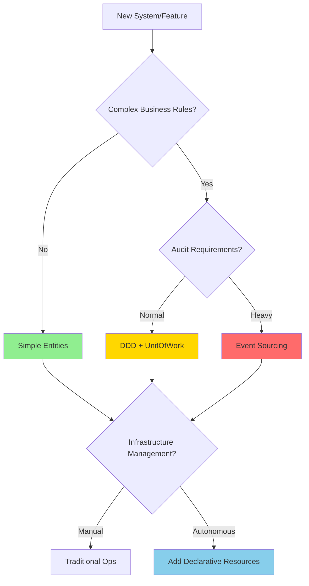
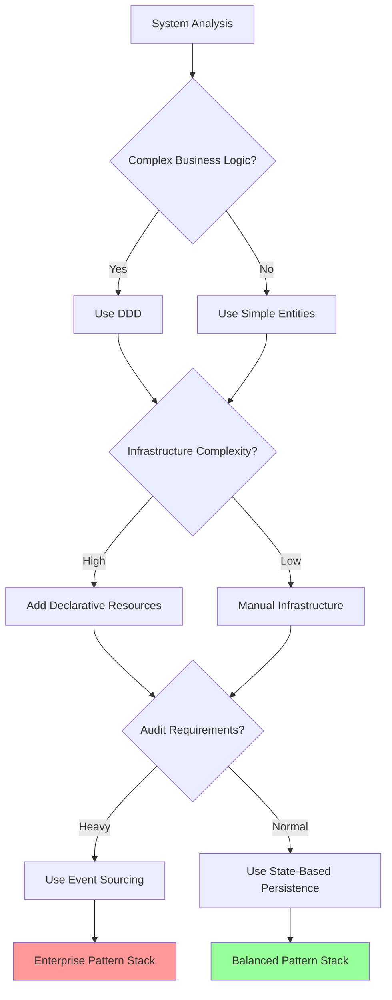

# 🎯 How to Choose the Right Data Modeling Patterns

> **🚧 Work in Progress**: This documentation is being updated to include beginner-friendly explanations with What & Why sections, Common Mistakes, and When NOT to Use guidance. The content below is accurate but will be enhanced soon.

This document provides a comprehensive guide for choosing and progressing through different data modeling patterns in the Neuroglia framework, from simple entities to complex event-sourced aggregates with declarative resource management. It shows the natural evolution path and when to adopt each pattern based on system complexity and requirements.

## 🎯 The Evolution Path

Data modeling in complex systems naturally evolves through distinct stages, each adding capabilities to handle increasing complexity. The Neuroglia framework supports this progression seamlessly:

**🔄 Evolution Stages:**

1. **Simple Entities** → Basic CRUD operations with direct repository access
2. **DDD Aggregates + UnitOfWork** → Rich domain models with transactional consistency and side effects
3. **Event Sourcing** → Complete audit trail with write/read model separation
4. **Declarative Resources** → Autonomous infrastructure management and reconciliation

**🎯 Key Insight**: Each stage builds upon the previous one, and you can adopt them incrementally as your system's complexity grows. Most systems benefit from combining multiple patterns for different aspects of the domain.

## 🏗️ Pattern Progression: From Simple to Complex

### 📝 Stage 1: Simple Entities with Direct Repository Access

**When to use**: Simple CRUD applications, minimal business logic, straightforward data operations.

**Implementation Pattern:**

```python
# Simple entity - just data structure
class Order(Entity):
    def __init__(self, customer_id: str, items: List[OrderItem]):
        super().__init__()
        self.customer_id = customer_id
        self.items = items
        self.status = OrderStatus.PENDING
        self.total = sum(item.price * item.quantity for item in items)

# Generic repository for basic persistence
class OrderRepository(Repository[Order, str]):
    async def save(self, order: Order) -> None:
        await self.collection.replace_one({"_id": order.id}, order.to_dict(), upsert=True)

# Direct command handler - no transactions, no events
class CreateOrderHandler(CommandHandler[CreateOrderCommand, OperationResult[OrderDto]]):
    def __init__(self, order_repository: OrderRepository, mapper: Mapper):
        self.order_repository = order_repository
        self.mapper = mapper

    async def handle_async(self, command: CreateOrderCommand) -> OperationResult[OrderDto]:
        # Simple: create entity and save directly
        order = Order(command.customer_id, command.items)
        await self.order_repository.save(order)

        order_dto = self.mapper.map(order, OrderDto)
        return self.created(order_dto)
```

**Characteristics:**

- ✅ **Simplicity**: Minimal complexity, easy to understand
- ✅ **Performance**: Direct database operations, no overhead
- ❌ **No Transactions**: Each operation is isolated
- ❌ **No Events**: No side effects or integration capabilities
- ❌ **Limited Business Logic**: Basic validation only

### 🏛️ Stage 2: DDD Aggregates with UnitOfWork Pattern

**When to use**: Complex business rules, need for transactional consistency, side effects coordination.

**Implementation Pattern:**

```python
# Rich aggregate root with business logic and domain events
class Order(AggregateRoot):
    def __init__(self, customer_id: str, items: List[OrderItem]):
        super().__init__()
        self.customer_id = customer_id
        self.items = items
        self.status = OrderStatus.PENDING
        self.total = self._calculate_total()

        # Domain event for side effects
        self.raise_event(OrderCreatedEvent(
            order_id=self.id,
            customer_id=self.customer_id,
            total_amount=self.total
        ))

    def confirm_payment(self, payment_method: PaymentMethod) -> None:
        if self.status != OrderStatus.PENDING:
            raise BusinessRuleViolationError("Can only confirm pending orders")

        self.status = OrderStatus.CONFIRMED
        self.payment_method = payment_method

        # Business event triggers kitchen workflow
        self.raise_event(OrderPaymentConfirmedEvent(
            order_id=self.id,
            total_amount=self.total
        ))

# Command handler with UnitOfWork for transactional consistency
class ConfirmPaymentHandler(CommandHandler[ConfirmPaymentCommand, OperationResult]):
    def __init__(self, order_repository: OrderRepository, unit_of_work: IUnitOfWork):
        self.order_repository = order_repository
        self.unit_of_work = unit_of_work

    async def handle_async(self, command: ConfirmPaymentCommand) -> OperationResult:
        # Load aggregate
        order = await self.order_repository.get_by_id_async(command.order_id)

        # Execute business logic (generates domain events)
        order.confirm_payment(command.payment_method)

        # Save state changes
        await self.order_repository.save_async(order)

        # Register aggregate for event collection and dispatch
        self.unit_of_work.register_aggregate(order)

        # Events automatically dispatched after successful persistence
        return self.success()
```

**Characteristics:**

- ✅ **Rich Business Logic**: Complex domain rules and validation
- ✅ **Transactional Consistency**: UnitOfWork coordinates persistence and events
- ✅ **Domain Events**: Side effects triggered after successful persistence
- ✅ **State-Based Storage**: Current aggregate state saved to database
- ❌ **No Audit Trail**: Historical changes not preserved
- ❌ **Tight Coupling**: Write and read models are the same

### 📚 Stage 3: Event Sourcing with Read Model Separation

**When to use**: Audit requirements, temporal queries, complex read models, regulatory compliance.

**Implementation Pattern:**

```python
# Event-sourced aggregate - state derived from events
class Order(EventSourcedAggregateRoot):
    def __init__(self, order_id: str = None):
        super().__init__(order_id)
        self.customer_id = None
        self.items = []
        self.status = OrderStatus.PENDING
        self.total = Decimal('0.00')

    def create_order(self, customer_id: str, items: List[OrderItem]) -> None:
        # Generate event instead of directly modifying state
        event = OrderCreatedEvent(
            order_id=self.id,
            customer_id=customer_id,
            items=items,
            total_amount=sum(item.price * item.quantity for item in items)
        )
        self.apply_event(event)

    def confirm_payment(self, payment_method: PaymentMethod) -> None:
        if self.status != OrderStatus.PENDING:
            raise BusinessRuleViolationError("Can only confirm pending orders")

        event = OrderPaymentConfirmedEvent(
            order_id=self.id,
            payment_method=payment_method,
            confirmed_at=datetime.utcnow()
        )
        self.apply_event(event)

    # Event application methods (state transitions)
    def _apply_order_created_event(self, event: OrderCreatedEvent) -> None:
        self.customer_id = event.customer_id
        self.items = event.items
        self.total = event.total_amount

    def _apply_order_payment_confirmed_event(self, event: OrderPaymentConfirmedEvent) -> None:
        self.status = OrderStatus.CONFIRMED
        self.payment_method = event.payment_method

# Event store for write model (stores events, not state)
class EventSourcedOrderRepository(EventStore[Order]):
    async def save_async(self, aggregate: Order) -> None:
        # Store all uncommitted events
        events = aggregate.get_uncommitted_events()
        await self.append_events_async(aggregate.id, events, aggregate.version)
        aggregate.mark_events_as_committed()

    async def get_by_id_async(self, order_id: str) -> Order:
        # Rebuild aggregate from stored events
        events = await self.get_events_async(order_id)
        order = Order(order_id)
        order.load_from_history(events)
        return order

# Separate read model for queries
@dataclass
class OrderReadModel:
    order_id: str
    customer_id: str
    status: str
    total_amount: Decimal
    created_at: datetime
    confirmed_at: Optional[datetime] = None

# Read model projector (rebuilds read models when events occur)
class OrderReadModelProjector(DomainEventHandler[OrderCreatedEvent, OrderPaymentConfirmedEvent]):
    def __init__(self, read_model_repository: Repository[OrderReadModel, str]):
        self.read_model_repository = read_model_repository

    async def handle_async(self, event: OrderCreatedEvent) -> None:
        read_model = OrderReadModel(
            order_id=event.order_id,
            customer_id=event.customer_id,
            status=OrderStatus.PENDING.value,
            total_amount=event.total_amount,
            created_at=event.occurred_at
        )
        await self.read_model_repository.save_async(read_model)

    async def handle_async(self, event: OrderPaymentConfirmedEvent) -> None:
        read_model = await self.read_model_repository.get_by_id_async(event.order_id)
        read_model.status = OrderStatus.CONFIRMED.value
        read_model.confirmed_at = event.occurred_at
        await self.read_model_repository.save_async(read_model)
```

**Characteristics:**

- ✅ **Complete Audit Trail**: Every change preserved as immutable events
- ✅ **Temporal Queries**: Can reconstruct state at any point in time
- ✅ **Optimized Read Models**: Separate, specialized views for queries
- ✅ **Event Replay**: Can rebuild read models from scratch
- ❌ **Increased Complexity**: Event application, projections, eventual consistency
- ❌ **Storage Overhead**: Events accumulate over time

### 🌐 Stage 4: Declarative Resources with Autonomous Reconciliation

**When to use**: Infrastructure management, autonomous operations, complex system coordination.

**Implementation Pattern:**

```python
# Declarative resource - desired vs actual state
@dataclass
class KitchenCapacityResource(Resource):
    spec: KitchenCapacitySpec
    status: KitchenCapacityStatus

    @classmethod
    def increase_capacity_for_order(cls, order_value: Decimal) -> 'KitchenCapacityResource':
        # Calculate required capacity based on business rules
        required_ovens = math.ceil(order_value / Decimal('100.00'))

        return cls(
            spec=KitchenCapacitySpec(
                required_ovens=required_ovens,
                target_throughput=order_value * Decimal('0.1')
            ),
            status=KitchenCapacityStatus(
                current_ovens=0,
                current_throughput=Decimal('0.00'),
                reconciliation_state="pending"
            )
        )

# Resource controller - autonomous reconciliation engine
class KitchenCapacityController(ResourceControllerBase[KitchenCapacityResource]):
    def __init__(self, infrastructure_client: InfrastructureClient, event_bus: EventBus):
        super().__init__()
        self.infrastructure_client = infrastructure_client
        self.event_bus = event_bus

    async def _do_reconcile(self, resource: KitchenCapacityResource) -> ReconciliationResult:
        desired_ovens = resource.spec.required_ovens
        current_ovens = resource.status.current_ovens

        if desired_ovens > current_ovens:
            # Provision additional capacity
            await self.infrastructure_client.provision_oven()
            resource.status.current_ovens += 1
            resource.status.reconciliation_state = "provisioning"

            # Publish integration event
            await self.event_bus.publish(KitchenCapacityIncreasedEvent(
                resource_id=resource.id,
                new_capacity=resource.status.current_ovens
            ))

        elif desired_ovens < current_ovens:
            # Scale down capacity
            await self.infrastructure_client.decommission_oven()
            resource.status.current_ovens -= 1
            resource.status.reconciliation_state = "scaling_down"

        else:
            resource.status.reconciliation_state = "stable"

        return ReconciliationResult.success()

# Integration event handler - bridges business domain to infrastructure
class OrderPaymentConfirmedIntegrationHandler(IntegrationEventHandler[OrderPaymentConfirmedEvent]):
    def __init__(self, resource_repository: Repository[KitchenCapacityResource, str]):
        self.resource_repository = resource_repository

    async def handle_async(self, event: OrderPaymentConfirmedEvent) -> None:
        # Business event triggers infrastructure adaptation
        capacity_resource = KitchenCapacityResource.increase_capacity_for_order(event.total_amount)
        await self.resource_repository.save_async(capacity_resource)

        # Resource controller will automatically reconcile the infrastructure
```

**Characteristics:**

- ✅ **Autonomous Operations**: Self-healing, self-scaling infrastructure
- ✅ **Declarative Management**: Specify desired state, system achieves it
- ✅ **Integration Events**: Bridge between business domain and infrastructure
- ✅ **Eventual Consistency**: Continuous reconciliation toward desired state
- ❌ **Operational Complexity**: Requires robust monitoring and error handling
- ❌ **Debugging Complexity**: Async reconciliation can be harder to trace## � Combining Patterns: Real-World Integration

### 💡 Multi-Stage System Example

Most complex systems benefit from using different patterns for different aspects. Here's how they work together:

```python
# Stage 1: Simple entities for basic data (User profiles, settings)
class UserProfile(Entity):
    def update_email(self, new_email: str) -> None:
        self.email = new_email
        self.updated_at = datetime.utcnow()

# Stage 2: DDD aggregates for core business logic (Orders, payments)
class Order(AggregateRoot):
    def confirm_payment(self, payment_info: PaymentInfo) -> None:
        if not self._validate_payment(payment_info):
            raise InvalidPaymentError("Payment validation failed")

        self.status = OrderStatus.CONFIRMED
        self.raise_event(OrderPaymentConfirmedEvent(
            order_id=self.id,
            amount=self.total_amount
        ))

# Stage 3: Event sourcing for audit-critical domains (Financial transactions)
class PaymentTransaction(EventSourcedAggregateRoot):
    def process_payment(self, amount: Decimal, method: PaymentMethod) -> None:
        event = PaymentProcessedEvent(
            transaction_id=self.id,
            amount=amount,
            method=method,
            processed_at=datetime.utcnow()
        )
        self.apply_event(event)

# Stage 4: Declarative resources for infrastructure (Kitchen capacity, delivery routes)
class DeliveryRouteResource(Resource):
    spec: DeliveryRouteSpec      # Desired route optimization
    status: DeliveryRouteStatus  # Current route state

# Integration through events and shared UnitOfWork
class OrderConfirmationHandler(DomainEventHandler[OrderPaymentConfirmedEvent]):
    async def handle_async(self, event: OrderPaymentConfirmedEvent) -> None:
        # Trigger financial transaction (event sourced)
        transaction = PaymentTransaction.create_for_order(event.order_id, event.amount)
        transaction.process_payment(event.amount, PaymentMethod.CREDIT_CARD)

        # Update delivery capacity (declarative resource)
        delivery_resource = await self.get_delivery_resource()
        delivery_resource.spec.add_delivery_requirement(event.order_id)

        # Both handled by UnitOfWork for transactional consistency
        self.unit_of_work.register_aggregate(transaction)
        self.unit_of_work.register_aggregate(delivery_resource)
```

## 🎯 Decision Framework: When to Use Each Pattern

### 📊 Pattern Selection Matrix

| Criteria                      | Simple Entities | DDD + UnitOfWork | Event Sourcing | Declarative Resources |
| ----------------------------- | --------------- | ---------------- | -------------- | --------------------- |
| **Business Complexity**       | Low             | High             | High           | N/A (Infrastructure)  |
| **Audit Requirements**        | None            | Basic            | Complete       | Operational only      |
| **Team Experience**           | Any             | Intermediate     | Advanced       | Advanced              |
| **Performance Needs**         | High            | Good             | Complex        | Excellent             |
| **Consistency Requirements**  | Eventual        | Strong           | Strong         | Eventual              |
| **Infrastructure Complexity** | Manual          | Manual           | Manual         | Autonomous            |

### 🚦 Decision Tree



### 🎯 Progression Guidelines

**🚀 Start Simple, Evolve Gradually**

1. **Begin with Simple Entities** for basic CRUD operations
2. **Add DDD + UnitOfWork** when business complexity grows
3. **Consider Event Sourcing** when audit trails become critical
4. **Introduce Declarative Resources** for infrastructure automation

**⚡ Migration Strategies**

```python
# Phase 1: Simple Entity
class Order(Entity):
    status: OrderStatus
    items: List[OrderItem]

# Phase 2: Add Domain Events (DDD)
class Order(AggregateRoot):
    def confirm_order(self):
        self.status = OrderStatus.CONFIRMED
        self.raise_event(OrderConfirmedEvent(...))

# Phase 3: Add Event Sourcing (if needed)
class Order(EventSourcedAggregateRoot):
    def confirm_order(self):
        event = OrderConfirmedEvent(...)
        self.apply_event(event)

# Phase 4: Add Infrastructure Resources
class OrderProcessingResource(Resource):
    spec: ProcessingCapacitySpec
    status: ProcessingCapacityStatus
```

## 🧪 Testing Strategy by Pattern

### 🧪 Simple Entities Testing

```python
class TestUserProfile:
    def test_update_email(self):
        # Arrange
        profile = UserProfile(user_id="123", email="old@example.com")

        # Act
        profile.update_email("new@example.com")

        # Assert
        assert profile.email == "new@example.com"
        assert profile.updated_at is not None
```

### 🧪 DDD + UnitOfWork Testing

```python
class TestOrderAggregate:
    async def test_confirm_payment_with_events(self):
        # Arrange
        order = Order(customer_id="123", items=[pizza_item])
        payment_handler = ConfirmPaymentHandler(order_repo, unit_of_work)

        # Act
        result = await payment_handler.handle_async(ConfirmPaymentCommand(
            order_id=order.id,
            payment_method=PaymentMethod.CREDIT_CARD
        ))

        # Assert - Business logic
        assert result.is_success
        assert order.status == OrderStatus.CONFIRMED

        # Assert - Domain events
        events = order.get_uncommitted_events()
        assert len(events) == 1
        assert isinstance(events[0], OrderPaymentConfirmedEvent)

        # Assert - Side effects triggered
        mock_event_bus.publish.assert_called_with(events[0])
```

### 🧪 Event Sourcing Testing

```python
class TestEventSourcedOrder:
    async def test_event_application_and_replay(self):
        # Arrange - Create events
        events = [
            OrderCreatedEvent(order_id="123", customer_id="456", items=[...]),
            OrderPaymentConfirmedEvent(order_id="123", payment_method="CREDIT")
        ]

        # Act - Replay events
        order = Order("123")
        order.load_from_history(events)

        # Assert - State derived from events
        assert order.customer_id == "456"
        assert order.status == OrderStatus.CONFIRMED

        # Test new event application
        order.ship_order()
        new_events = order.get_uncommitted_events()
        assert len(new_events) == 1
        assert isinstance(new_events[0], OrderShippedEvent)
```

### 🧪 Declarative Resources Testing

```python
class TestKitchenCapacityController:
    async def test_reconciliation_scales_up(self):
        # Arrange - Resource needs more capacity
        resource = KitchenCapacityResource(
            spec=KitchenCapacitySpec(required_ovens=5),
            status=KitchenCapacityStatus(current_ovens=2)
        )

        controller = KitchenCapacityController(mock_infra_client, event_bus)

        # Act - Trigger reconciliation
        result = await controller._do_reconcile(resource)

        # Assert - Infrastructure provisioned
        assert result.is_success
        mock_infra_client.provision_oven.assert_called()

        # Assert - Status updated
        assert resource.status.current_ovens == 3
        assert resource.status.reconciliation_state == "provisioning"

        # Assert - Integration event published
        event_bus.publish.assert_called_with(
            KitchenCapacityIncreasedEvent(resource_id=resource.id, new_capacity=3)
        )
```

## 🎯 Common Anti-Patterns and Solutions

### ❌ Anti-Pattern 1: Wrong Pattern for Complexity Level

```python
# ❌ Using DDD for simple CRUD
class UserSettings(AggregateRoot):  # Overkill!
    def update_theme(self, theme: str):
        if theme not in VALID_THEMES:
            raise InvalidThemeError()
        self.theme = theme
        self.raise_event(UserThemeChangedEvent(...))  # Unnecessary complexity

# ✅ Simple entity is sufficient
class UserSettings(Entity):
    def update_theme(self, theme: str):
        if theme not in VALID_THEMES:
            raise ValueError(f"Invalid theme: {theme}")
        self.theme = theme
```

### ❌ Anti-Pattern 2: Missing Transactional Boundaries

```python
# ❌ No UnitOfWork - events fired before persistence
class BadOrderHandler:
    async def handle(self, command: CreateOrderCommand):
        order = Order(command.customer_id, command.items)

        # Events fired immediately - could fail before save!
        await self.event_bus.publish_all(order.get_uncommitted_events())
        await self.order_repo.save(order)  # Could fail!

# ✅ UnitOfWork ensures events only fire after successful persistence
class GoodOrderHandler:
    async def handle(self, command: CreateOrderCommand):
        order = Order(command.customer_id, command.items)
        await self.order_repo.save(order)

        # UnitOfWork handles event dispatch after commit
        self.unit_of_work.register_aggregate(order)
```

### ❌ Anti-Pattern 3: Event Sourcing Without Read Models

```python
# ❌ Querying event store directly for read operations
class BadOrderQueryHandler:
    async def get_orders_by_customer(self, customer_id: str):
        # Terrible performance - rebuilding aggregates for queries!
        orders = []
        for order_id in await self.get_order_ids_by_customer(customer_id):
            events = await self.event_store.get_events(order_id)
            order = Order(order_id)
            order.load_from_history(events)
            orders.append(order)
        return orders

# ✅ Dedicated read models for efficient queries
class GoodOrderQueryHandler:
    async def get_orders_by_customer(self, customer_id: str):
        # Fast query against optimized read model
        return await self.order_read_model_repo.find_by_customer(customer_id)
```

## 🏆 Best Practices Summary

### 📋 Pattern Selection Checklist

**Before choosing a pattern, ask:**

1. **Business Complexity**: How complex are the business rules?

   - Simple → Simple Entities
   - Complex → DDD Aggregates

2. **Audit Requirements**: Do you need complete history?

   - No → State-based persistence
   - Yes → Event Sourcing

3. **Infrastructure Complexity**: How much operational automation is needed?

   - Manual → Traditional repositories
   - Autonomous → Declarative Resources

4. **Team Experience**: What's the team's skill level?

   - Junior → Start simple, evolve gradually
   - Senior → Can adopt complex patterns immediately

5. **Performance Requirements**: What are the latency/throughput needs?
   - High performance → Avoid event sourcing complexity
   - Audit critical → Accept event sourcing overhead

## 🧪 Testing Implications

### Testing Both Patterns Together

```python
class TestOrderWithInfrastructure:
    async def test_order_placement_triggers_infrastructure_scaling(self):
        # Arrange: Setup both domain and infrastructure
        order_service = self.get_service(OrderService)
        kitchen_controller = self.get_service(KitchenCapacityController)

        # Act: Domain operation
        result = await order_service.place_order(large_order_command)

        # Assert: Both business and infrastructure effects
        assert result.is_success

        # Business assertion (DDD)
        order = await self.order_repo.get_by_id(result.data.order_id)
        assert order.status == OrderStatus.CONFIRMED

        # Infrastructure assertion (Declarative)
        kitchen_resource = await self.resource_repo.get_kitchen_capacity()
        assert kitchen_resource.spec.required_capacity > initial_capacity

        # Event coordination assertion
        events = self.event_collector.get_events()
        assert any(isinstance(e, OrderPlacedEvent) for e in events)
        assert any(isinstance(e, KitchenCapacityUpdatedEvent) for e in events)
```

## 🎯 Decision Framework

### Choose Your Pattern Combination



### Pattern Selection Criteria

| Criteria                  | Weight | DDD               | Declarative       | Event Sourcing | State-Based  |
| ------------------------- | ------ | ----------------- | ----------------- | -------------- | ------------ |
| Business Complexity       | High   | ✅ Essential      | ➖ Optional       | ⚠️ Consider    | ✅ Good      |
| Infrastructure Complexity | High   | ➖ Optional       | ✅ Essential      | ➖ Optional    | ✅ Good      |
| Audit Requirements        | High   | ✅ Good           | ➖ Optional       | ✅ Essential   | ⚠️ Limited   |
| Team Experience           | Medium | ⚠️ Learning curve | ⚠️ Learning curve | ❌ Complex     | ✅ Familiar  |
| Performance Requirements  | Medium | ✅ Good           | ✅ Excellent      | ⚠️ Complex     | ✅ Excellent |
| Operational Complexity    | Medium | ➖ Manual         | ✅ Autonomous     | ⚠️ Complex     | ✅ Simple    |

## 🚀 Migration Strategies

### From Simple to Complex

```python
# Phase 1: Start with simple entities
class Order(Entity):
    def add_pizza(self, pizza):
        self.pizzas.append(pizza)
        # Direct database save

# Phase 2: Add domain events (still state-based)
class Order(AggregateRoot):
    def add_pizza(self, pizza):
        self.pizzas.append(pizza)
        self.raise_event(PizzaAddedEvent(...))  # Added events

# Phase 3: Add declarative infrastructure
class KitchenCapacityResource:
    spec: KitchenCapacitySpec
    status: KitchenCapacityStatus
    # Autonomous scaling based on order events

# Phase 4: Consider event sourcing (if needed)
class Order(EventSourcedAggregateRoot):
    def add_pizza(self, pizza):
        self.apply_event(PizzaAddedEvent(...))  # Event-sourced
```

## 📚 Framework Support Matrix

| Pattern                   | Neuroglia Support | Implementation Effort | Learning Curve       |
| ------------------------- | ----------------- | --------------------- | -------------------- |
| **DDD + State-Based**     | ✅ Full support   | ⭐⭐⭐ Medium         | ⭐⭐⭐ Medium        |
| **Declarative Resources** | ✅ Full support   | ⭐⭐⭐⭐ High         | ⭐⭐⭐⭐ High        |
| **Event Sourcing**        | ✅ Full support   | ⭐⭐⭐⭐⭐ Very High  | ⭐⭐⭐⭐⭐ Very High |
| **Combined Approach**     | ✅ Full support   | ⭐⭐⭐⭐ High         | ⭐⭐⭐⭐ High        |

## 🎯 Conclusion: The Progressive Data Modeling Approach

The key insight from this analysis is that **data modeling patterns form a natural progression** rather than competing alternatives. Each pattern builds upon the previous one, adding capabilities to handle increasing system complexity:

### 🔄 The Evolution Principle

1. **Start Simple**: Begin with simple entities for basic functionality
2. **Add Sophistication**: Introduce DDD when business rules become complex
3. **Enable Auditability**: Add event sourcing when history tracking is critical
4. **Automate Operations**: Include declarative resources for infrastructure management

### 🎯 Pattern Synergy

The most powerful systems combine multiple patterns strategically:

- **Simple Entities** for basic data (user preferences, configuration)
- **DDD Aggregates** for core business logic (orders, payments, workflows)
- **Event Sourcing** for audit-critical domains (financial transactions, compliance)
- **Declarative Resources** for infrastructure (scaling, provisioning, monitoring)

### 🚀 Practical Recommendations

**For New Projects:**

1. **Start with Stage 1** (Simple Entities) to validate core functionality
2. **Evolve to Stage 2** (DDD + UnitOfWork) as business complexity grows
3. **Consider Stage 3** (Event Sourcing) only when audit requirements are clear
4. **Add Stage 4** (Declarative Resources) when operational complexity demands automation

**For Existing Projects:**

- **Assess current pain points** to determine which pattern addresses them
- **Migrate incrementally** - don't try to adopt all patterns simultaneously
- **Focus on the biggest problem first** (business complexity vs operational complexity)

### 💡 Key Success Factors

1. **Match Pattern to Problem**: Don't use complex patterns for simple problems
2. **Embrace Progressive Enhancement**: Each stage adds capabilities without breaking existing functionality
3. **Leverage Neuroglia's Integration**: The framework handles the coordination between patterns seamlessly
4. **Test Thoroughly**: Each pattern has specific testing requirements and techniques

The Neuroglia framework's strength lies in supporting this evolutionary approach, allowing teams to adopt sophisticated patterns gradually while maintaining system stability and developer productivity.

## 🔗 Related Documentation

- [🏗️ Clean Architecture](clean-architecture.md) - Structural foundation for all patterns
- [🏛️ Domain Driven Design](domain-driven-design.md) - Rich domain modeling with aggregates
- [📚 Event Sourcing](event-sourcing.md) - Complete audit trails and temporal queries
- [� Resource Oriented Architecture](resource-oriented-architecture.md) - Declarative infrastructure management
- [🔄 Unit of Work Pattern](unit-of-work.md) - Transactional consistency across patterns
- [📡 Event-Driven Architecture](event-driven.md) - Integration foundation for all approaches
