# 🔄 Reactive Programming Pattern

_Estimated reading time: 30 minutes_

The Reactive Programming pattern enables asynchronous, event-driven architectures using Observable streams for handling
event flows, background processing, and real-time data transformations. This pattern excels in scenarios requiring
responsiveness to continuous data streams and loose coupling between event producers and consumers.

## 💡 What & Why

### ❌ The Problem: Blocking Operations and Complex Event Coordination

Traditional imperative programming blocks on operations and makes event coordination complex:

```python
# ❌ PROBLEM: Blocking operations and complex event handling
class KitchenDashboardService:
    async def monitor_orders(self):
        # Polling approach - inefficient and blocks!
        while True:
            # Block waiting for new orders
            orders = await self.db.orders.find({"status": "pending"}).to_list()

            for order in orders:
                # Process each order sequentially - slow!
                await self.process_order(order)
                await self.update_capacity()
                await self.notify_kitchen_staff(order)

            # Wait before checking again - delay!
            await asyncio.sleep(5)  # 5 second delay before next check

    async def process_multiple_events(self):
        # Complex coordination of multiple event sources
        order_events = []
        payment_events = []
        inventory_events = []

        # Subscribe to multiple sources (complex!)
        asyncio.create_task(self.poll_orders(order_events))
        asyncio.create_task(self.poll_payments(payment_events))
        asyncio.create_task(self.poll_inventory(inventory_events))

        # Manually coordinate events (error-prone!)
        while True:
            if order_events and payment_events:
                order = order_events.pop(0)
                payment = payment_events.pop(0)

                # What if events are out of sync?
                # What if one stream is faster than another?
                # How do we handle backpressure?
                await self.match_order_with_payment(order, payment)

            await asyncio.sleep(0.1)

# Problems:
# ❌ Blocking operations (polling, waiting)
# ❌ Inefficient (constant polling even with no events)
# ❌ Complex coordination of multiple event streams
# ❌ No backpressure handling
# ❌ Difficult to compose operations (filter, map, aggregate)
# ❌ Hard to handle errors in streams
# ❌ No built-in retry or timeout mechanisms
```

**Problems with Imperative Event Handling:**

- ❌ **Blocking**: Operations wait synchronously, wasting resources
- ❌ **Polling Overhead**: Constantly checking for events even when none exist
- ❌ **Complex Coordination**: Manually managing multiple event streams
- ❌ **No Backpressure**: Can't handle fast producers overwhelming slow consumers
- ❌ **Poor Composability**: Difficult to chain transformations
- ❌ **Error Handling**: Must manually handle errors in each step
- ❌ **Resource Intensive**: Many threads/tasks needed for concurrent streams

### ✅ The Solution: Reactive Streams with Observable Pattern

Reactive programming uses Observable streams for declarative, non-blocking event processing:

```python
# ✅ SOLUTION: Reactive streams with Observable pattern
from rx.subject.subject import Subject
from rx import operators as ops
from neuroglia.reactive import AsyncRx

# Create observable stream for order events
order_stream = Subject()

# Declaratively define event processing pipeline
subscription = order_stream.pipe(
    # Filter: Only process orders above $20
    ops.filter(lambda order: order.total > 20),

    # Map: Transform to kitchen view
    ops.map(lambda order: {
        "order_id": order.id,
        "items": order.items,
        "priority": "high" if order.total > 100 else "normal"
    }),

    # Buffer: Group orders in 10-second windows
    ops.buffer_with_time(10.0),

    # Filter: Only process non-empty buffers
    ops.filter(lambda buffer: len(buffer) > 0),

    # Map: Create batch for kitchen
    ops.map(lambda orders: {
        "batch_id": str(uuid.uuid4()),
        "orders": orders,
        "order_count": len(orders)
    })
).subscribe(
    on_next=lambda batch: asyncio.create_task(self.process_batch(batch)),
    on_error=lambda error: logger.error(f"Stream error: {error}"),
    on_completed=lambda: logger.info("Stream completed")
)

# Events are pushed (non-blocking, reactive!)
async def on_order_placed(event: OrderPlacedEvent):
    order = Order.from_event(event)
    order_stream.on_next(order)  # Push event into stream

# Complex event coordination made EASY!
class ReactiveKitchenService:
    def __init__(self):
        self.order_stream = Subject()
        self.payment_stream = Subject()
        self.inventory_stream = Subject()

    def setup_reactive_pipeline(self):
        # Combine multiple streams declaratively
        combined_stream = AsyncRx.combine_latest(
            self.order_stream,
            self.payment_stream,
            self.inventory_stream
        ).pipe(
            # Only when ALL three have events
            ops.filter(lambda tuple: all(tuple)),

            # Transform combined data
            ops.map(lambda tuple: {
                "order": tuple[0],
                "payment": tuple[1],
                "inventory": tuple[2]
            }),

            # Validate we can fulfill
            ops.filter(lambda data: self.can_fulfill(data)),

            # Add retry logic
            ops.retry(3),

            # Add timeout
            ops.timeout(30.0)
        ).subscribe(
            on_next=lambda data: asyncio.create_task(self.fulfill_order(data)),
            on_error=lambda error: self.handle_stream_error(error)
        )

    async def can_fulfill(self, data: dict) -> bool:
        """Check if order can be fulfilled"""
        order = data["order"]
        inventory = data["inventory"]

        for item in order.items:
            if inventory.get(item["product_id"], 0) < item["quantity"]:
                return False
        return True

# Real-time analytics with reactive streams
class OrderAnalyticsService:
    def __init__(self):
        self.order_stream = Subject()

    def setup_analytics(self):
        # Real-time metrics using sliding windows
        self.order_stream.pipe(
            # Sliding 5-minute window
            ops.window_with_time(300.0),

            # Aggregate orders in each window
            ops.flat_map(lambda window: window.pipe(
                ops.to_list(),
                ops.map(lambda orders: {
                    "window_end": datetime.now(),
                    "total_orders": len(orders),
                    "total_revenue": sum(o.total for o in orders),
                    "avg_order_value": sum(o.total for o in orders) / len(orders) if orders else 0
                })
            ))
        ).subscribe(
            on_next=lambda metrics: self.publish_metrics(metrics)
        )

# Benefits:
# ✅ Non-blocking - events processed as they arrive
# ✅ Declarative - pipeline defined once, reused forever
# ✅ Composable - easy to chain operations (filter, map, buffer)
# ✅ Backpressure - built-in handling of fast producers
# ✅ Error handling - built into stream operators
# ✅ Retry/timeout - declarative failure handling
# ✅ Resource efficient - single stream handles many events
```

**Benefits of Reactive Programming:**

- ✅ **Non-Blocking**: Events processed asynchronously without waiting
- ✅ **Push-Based**: Events pushed when available, no polling overhead
- ✅ **Composable**: Declaratively chain transformations (filter, map, reduce)
- ✅ **Backpressure**: Handle fast producers and slow consumers gracefully
- ✅ **Error Resilience**: Built-in retry, timeout, and error handling
- ✅ **Resource Efficient**: Single stream processes thousands of events
- ✅ **Real-Time**: Immediate event processing for responsive systems

## 🎯 Pattern Intent

Transform applications from imperative, blocking operations to declarative, non-blocking event streams that react to
data changes and events as they occur. Reactive programming enables building responsive, resilient, and scalable systems
that handle high-throughput event processing with minimal latency.

## 🏗️ Pattern Structure

```mermaid
flowchart TD
    subgraph "🔄 Reactive Core"
        A["📡 Event Sources<br/>Domain Events, External APIs"]
        B["🌊 Observable Streams<br/>RxPY Integration"]
        C["🔄 AsyncRx Bridge<br/>Async/Await Integration"]
        D["📋 Stream Processing<br/>Filter, Map, Reduce"]
    end

    subgraph "🎯 Event Processing Pipeline"
        E["🔍 Event Filtering<br/>Business Logic"]
        F["🔄 Event Transformation<br/>Data Mapping"]
        G["🎭 Event Aggregation<br/>State Updates"]
        H["📤 Event Distribution<br/>Multiple Handlers"]
    end

    subgraph "🏭 Background Services"
        I["📊 Event Store Reconciliation<br/>Read Model Updates"]
        J["🔔 Notification Services<br/>Real-time Alerts"]
        K["📈 Analytics Processing<br/>Business Intelligence"]
        L["🧹 Maintenance Tasks<br/>Scheduled Operations"]
    end

    A --> B
    B --> C
    C --> D
    D --> E
    E --> F
    F --> G
    G --> H

    H --> I
    H --> J
    H --> K
    H --> L

    style B fill:#e1f5fe,stroke:#0277bd,stroke-width:3px
    style C fill:#f3e5f5,stroke:#7b1fa2,stroke-width:2px
    style D fill:#e8f5e8,stroke:#2e7d32,stroke-width:2px

    classDef pipeline fill:#fff3e0,stroke:#f57c00,stroke-width:2px
    class E,F,G,H pipeline

    classDef services fill:#fce4ec,stroke:#ad1457,stroke-width:2px
    class I,J,K,L services
```



## 🍕 Pattern Implementation

### Core Reactive Components

```python
import asyncio
from typing import List, Callable, Optional, Dict, Any
from rx.subject.subject import Subject
from rx.core.typing import Disposable
from rx import operators as ops
from neuroglia.reactive import AsyncRx
from neuroglia.eventing import DomainEvent
from dataclasses import dataclass
from datetime import datetime
from enum import Enum

# Domain Events for Reactive Processing
class OrderStatus(str, Enum):
    PLACED = "placed"
    CONFIRMED = "confirmed"
    COOKING = "cooking"
    READY = "ready"
    DELIVERED = "delivered"

@dataclass
class OrderStatusChangedEvent(DomainEvent):
    order_id: str
    previous_status: OrderStatus
    new_status: OrderStatus
    timestamp: datetime
    estimated_completion: datetime

@dataclass
class KitchenCapacityEvent(DomainEvent):
    available_ovens: int
    current_orders: int
    estimated_wait_minutes: int

# Reactive Event Processor Pattern
class ReactiveEventProcessor:
    """Central reactive processor for event streams"""

    def __init__(self):
        # Observable streams for different event types
        self.order_status_stream = Subject()
        self.kitchen_capacity_stream = Subject()
        self.customer_notification_stream = Subject()

        # Subscription management for cleanup
        self.subscriptions: List[Disposable] = []

        # Setup reactive processing pipelines
        self._setup_reactive_pipelines()

    def _setup_reactive_pipelines(self):
        """Configure reactive processing pipelines with stream transformations"""

        # Order status processing pipeline
        order_subscription = AsyncRx.subscribe(
            self.order_status_stream.pipe(
                # Filter only significant status changes
                ops.filter(lambda event: self._is_significant_status_change(event)),
                # Enrich with additional context
                ops.map(lambda event: self._enrich_order_event(event)),
                # Buffer for batch processing efficiency
                ops.buffer_with_time(timespan=1.0)
            ),
            lambda events: asyncio.create_task(self._process_order_event_batch(events))
        )
        self.subscriptions.append(order_subscription)

        # Kitchen capacity monitoring pipeline
        kitchen_subscription = AsyncRx.subscribe(
            self.kitchen_capacity_stream.pipe(
                # Throttle rapid capacity updates
                ops.throttle_first(0.5),
                # Transform to capacity metrics
                ops.map(lambda event: self._calculate_capacity_metrics(event))
            ),
            lambda metrics: asyncio.create_task(self._update_capacity_dashboard(metrics))
        )
        self.subscriptions.append(kitchen_subscription)

        # Customer notification pipeline
        notification_subscription = AsyncRx.subscribe(
            self.customer_notification_stream.pipe(
                # Group by customer for consolidated notifications
                ops.group_by(lambda event: event.customer_id),
                # Debounce to prevent notification spam
                ops.debounce(1.5)
            ),
            lambda event: asyncio.create_task(self._send_customer_notification(event))
        )
        self.subscriptions.append(notification_subscription)

    # Event Publishers
    def publish_order_status_change(self, event: OrderStatusChangedEvent):
        """Publish order status change to reactive stream"""
        self.order_status_stream.on_next(event)

        # Trigger customer notification for customer-facing statuses
        if event.new_status in [OrderStatus.READY, OrderStatus.DELIVERED]:
            self.customer_notification_stream.on_next(event)

    def publish_kitchen_capacity_update(self, event: KitchenCapacityEvent):
        """Publish kitchen capacity update to reactive stream"""
        self.kitchen_capacity_stream.on_next(event)

    # Stream Processing Methods
    def _is_significant_status_change(self, event: OrderStatusChangedEvent) -> bool:
        """Filter logic for significant status changes"""
        significant_transitions = {
            (OrderStatus.PLACED, OrderStatus.CONFIRMED),
            (OrderStatus.CONFIRMED, OrderStatus.COOKING),
            (OrderStatus.COOKING, OrderStatus.READY),
            (OrderStatus.READY, OrderStatus.DELIVERED)
        }
        return (event.previous_status, event.new_status) in significant_transitions

    def _enrich_order_event(self, event: OrderStatusChangedEvent) -> Dict[str, Any]:
        """Enrich events with additional processing context"""
        return {
            'original_event': event,
            'processing_timestamp': datetime.now(),
            'priority_score': self._calculate_priority_score(event),
            'estimated_impact': self._estimate_kitchen_impact(event)
        }

    async def _process_order_event_batch(self, enriched_events: List[Dict[str, Any]]):
        """Process batched events for efficiency"""
        if not enriched_events:
            return

        print(f"🔄 Processing batch of {len(enriched_events)} order events")

        # Extract original events for processing
        events = [e['original_event'] for e in enriched_events]

        # Batch update order tracking
        order_ids = [e.order_id for e in events]
        await self._batch_update_order_dashboard(order_ids)

        # Update kitchen workflow for cooking transitions
        cooking_events = [e for e in events if e.new_status == OrderStatus.COOKING]
        if cooking_events:
            await self._update_kitchen_workflow(cooking_events)

    # Cleanup Management
    def dispose(self):
        """Properly dispose of all reactive subscriptions"""
        for subscription in self.subscriptions:
            subscription.dispose()
        self.subscriptions.clear()
```

### Stream Transformation Patterns

```python
class StreamTransformationPatterns:
    """Common reactive stream transformation patterns"""

    @staticmethod
    def create_filtering_pipeline(source_stream: Subject, predicate: Callable) -> Subject:
        """Create filtered stream with predicate"""
        filtered_stream = Subject()

        subscription = AsyncRx.subscribe(
            source_stream.pipe(ops.filter(predicate)),
            lambda item: filtered_stream.on_next(item)
        )

        return filtered_stream, subscription

    @staticmethod
    def create_transformation_pipeline(source_stream: Subject, transformer: Callable) -> Subject:
        """Create transformed stream with mapping function"""
        transformed_stream = Subject()

        subscription = AsyncRx.subscribe(
            source_stream.pipe(ops.map(transformer)),
            lambda item: transformed_stream.on_next(item)
        )

        return transformed_stream, subscription

    @staticmethod
    def create_aggregation_pipeline(source_stream: Subject, window_seconds: float) -> Subject:
        """Create aggregated stream with time-based windows"""
        aggregated_stream = Subject()

        subscription = AsyncRx.subscribe(
            source_stream.pipe(
                ops.buffer_with_time(timespan=window_seconds),
                ops.filter(lambda items: len(items) > 0),
                ops.map(lambda items: StreamTransformationPatterns._aggregate_items(items))
            ),
            lambda aggregated: aggregated_stream.on_next(aggregated)
        )

        return aggregated_stream, subscription

    @staticmethod
    def _aggregate_items(items: List[Any]) -> Dict[str, Any]:
        """Aggregate items in a time window"""
        return {
            'count': len(items),
            'items': items,
            'timestamp': datetime.now(),
            'window_start': items[0].timestamp if items else None,
            'window_end': items[-1].timestamp if items else None
        }
```

### Background Service Pattern

```python
from neuroglia.hosting.abstractions import HostedService
from apscheduler.schedulers.asyncio import AsyncIOScheduler

class ReactiveBackgroundService(HostedService):
    """Background service using reactive patterns for task processing"""

    def __init__(self, scheduler: AsyncIOScheduler):
        self.scheduler = scheduler
        self.task_request_stream = Subject()
        self.task_completion_stream = Subject()
        self.subscription: Optional[Disposable] = None

    async def start_async(self):
        """Start reactive background processing"""
        print("⚡ Starting reactive background service")

        self.scheduler.start()

        # Setup reactive task processing pipeline
        self.subscription = AsyncRx.subscribe(
            self.task_request_stream.pipe(
                # Filter valid tasks
                ops.filter(lambda task: self._is_valid_task(task)),
                # Transform to executable tasks
                ops.map(lambda task: self._prepare_task_execution(task))
            ),
            lambda prepared_task: asyncio.create_task(self._execute_task(prepared_task))
        )

    async def stop_async(self):
        """Stop reactive background processing"""
        if self.subscription:
            self.subscription.dispose()
        self.scheduler.shutdown(wait=False)
        print("⏹️ Stopped reactive background service")

    def schedule_task(self, task_descriptor: 'TaskDescriptor'):
        """Schedule task through reactive stream"""
        self.task_request_stream.on_next(task_descriptor)

    def _is_valid_task(self, task: 'TaskDescriptor') -> bool:
        """Validate task before processing"""
        return (
            hasattr(task, 'id') and task.id and
            hasattr(task, 'scheduled_time') and task.scheduled_time and
            hasattr(task, 'task_type') and task.task_type
        )

    def _prepare_task_execution(self, task: 'TaskDescriptor') -> Dict[str, Any]:
        """Prepare task for execution with reactive context"""
        return {
            'task': task,
            'preparation_time': datetime.now(),
            'execution_context': self._create_execution_context(task)
        }

    async def _execute_task(self, prepared_task: Dict[str, Any]):
        """Execute task and publish completion events"""
        task = prepared_task['task']

        try:
            # Execute the task
            result = await self._run_task(task)

            # Publish success event
            completion_event = TaskCompletionEvent(
                task_id=task.id,
                status='completed',
                result=result,
                completed_at=datetime.now()
            )
            self.task_completion_stream.on_next(completion_event)

        except Exception as ex:
            # Publish failure event
            failure_event = TaskCompletionEvent(
                task_id=task.id,
                status='failed',
                error=str(ex),
                completed_at=datetime.now()
            )
            self.task_completion_stream.on_next(failure_event)
```

## 🌊 Stream Processing Patterns

### Event Aggregation Pattern

```python
class EventAggregationPattern:
    """Pattern for aggregating events in reactive streams"""

    def __init__(self):
        self.source_events = Subject()
        self.aggregated_events = Subject()
        self._setup_aggregation_pipeline()

    def _setup_aggregation_pipeline(self):
        """Setup event aggregation with multiple aggregation strategies"""

        # Time-based aggregation (5-second windows)
        time_aggregated = self.source_events.pipe(
            ops.buffer_with_time(timespan=5.0),
            ops.filter(lambda events: len(events) > 0),
            ops.map(lambda events: self._create_time_aggregate(events))
        )

        # Count-based aggregation (every 10 events)
        count_aggregated = self.source_events.pipe(
            ops.buffer_with_count(10),
            ops.map(lambda events: self._create_count_aggregate(events))
        )

        # Combine aggregation strategies
        combined_aggregated = time_aggregated.merge(count_aggregated)

        # Subscribe to combined stream
        AsyncRx.subscribe(
            combined_aggregated,
            lambda aggregate: self.aggregated_events.on_next(aggregate)
        )

    def _create_time_aggregate(self, events: List[DomainEvent]) -> Dict[str, Any]:
        """Create time-based event aggregate"""
        return {
            'type': 'time_aggregate',
            'event_count': len(events),
            'events': events,
            'time_window': 5.0,
            'aggregate_timestamp': datetime.now()
        }

    def _create_count_aggregate(self, events: List[DomainEvent]) -> Dict[str, Any]:
        """Create count-based event aggregate"""
        return {
            'type': 'count_aggregate',
            'event_count': len(events),
            'events': events,
            'count_threshold': 10,
            'aggregate_timestamp': datetime.now()
        }
```

## 🧪 Testing Patterns

### Reactive Component Testing

```python
import pytest
from unittest.mock import Mock, AsyncMock

class TestReactiveEventProcessor:

    def setup_method(self):
        self.processor = ReactiveEventProcessor()
        self.test_events = []

        # Mock external dependencies
        self.processor._batch_update_order_dashboard = AsyncMock()
        self.processor._update_kitchen_workflow = AsyncMock()
        self.processor._send_customer_notification = AsyncMock()

    @pytest.mark.asyncio
    async def test_order_status_event_triggers_processing(self):
        """Test order status events trigger reactive processing"""
        # Arrange
        event = OrderStatusChangedEvent(
            order_id="TEST-001",
            previous_status=OrderStatus.PLACED,
            new_status=OrderStatus.CONFIRMED,
            timestamp=datetime.now(),
            estimated_completion=datetime.now()
        )

        # Act
        self.processor.publish_order_status_change(event)
        await asyncio.sleep(0.1)  # Allow reactive processing

        # Assert - Verify reactive pipeline was triggered
        assert len(self.processor.subscriptions) > 0

    @pytest.mark.asyncio
    async def test_kitchen_capacity_stream_throttling(self):
        """Test kitchen capacity updates are properly throttled"""
        # Arrange
        events = [
            KitchenCapacityEvent(available_ovens=i, current_orders=5, estimated_wait_minutes=10)
            for i in range(5)
        ]

        # Act - Rapid fire events
        for event in events:
            self.processor.publish_kitchen_capacity_update(event)
            await asyncio.sleep(0.1)

        # Assert - Should be throttled (fewer calls than events)
        await asyncio.sleep(1.0)  # Wait for throttling window

        # Verify throttling behavior through dashboard update calls
        call_count = self.processor._update_capacity_dashboard.call_count
        assert call_count < len(events)  # Should be throttled

    @pytest.mark.asyncio
    async def test_subscription_cleanup(self):
        """Test proper cleanup of reactive subscriptions"""
        # Arrange
        initial_subscription_count = len(self.processor.subscriptions)

        # Act
        self.processor.dispose()

        # Assert
        assert len(self.processor.subscriptions) == 0

    def teardown_method(self):
        """Cleanup test resources"""
        self.processor.dispose()

class TestStreamTransformationPatterns:

    def setup_method(self):
        self.source_stream = Subject()
        self.received_items = []

    @pytest.mark.asyncio
    async def test_filtering_pipeline(self):
        """Test stream filtering patterns"""
        # Arrange
        def is_even(x): return x % 2 == 0

        filtered_stream, subscription = StreamTransformationPatterns.create_filtering_pipeline(
            self.source_stream, is_even
        )

        # Subscribe to results
        AsyncRx.subscribe(filtered_stream, lambda item: self.received_items.append(item))

        # Act
        for i in range(10):
            self.source_stream.on_next(i)

        await asyncio.sleep(0.1)

        # Assert
        assert self.received_items == [0, 2, 4, 6, 8]

        # Cleanup
        subscription.dispose()

    @pytest.mark.asyncio
    async def test_transformation_pipeline(self):
        """Test stream transformation patterns"""
        # Arrange
        def double(x): return x * 2

        transformed_stream, subscription = StreamTransformationPatterns.create_transformation_pipeline(
            self.source_stream, double
        )

        # Subscribe to results
        AsyncRx.subscribe(transformed_stream, lambda item: self.received_items.append(item))

        # Act
        self.source_stream.on_next(5)
        self.source_stream.on_next(10)

        await asyncio.sleep(0.1)

        # Assert
        assert self.received_items == [10, 20]

        # Cleanup
        subscription.dispose()

    def teardown_method(self):
        """Cleanup test streams"""
        if hasattr(self, 'source_stream'):
            self.source_stream.dispose()
```

## 🚀 Framework Integration

### Service Registration Pattern

```python
from neuroglia.hosting import WebApplicationBuilder
from neuroglia.dependency_injection import ServiceLifetime

def configure_reactive_services(builder: WebApplicationBuilder):
    """Configure reactive programming services with dependency injection"""

    # Register core reactive services
    builder.services.add_singleton(ReactiveEventProcessor)
    builder.services.add_singleton(EventAggregationPattern)
    builder.services.add_scoped(StreamTransformationPatterns)

    # Register background services
    builder.services.add_hosted_service(ReactiveBackgroundService)

    # Configure reactive infrastructure
    builder.services.add_singleton(AsyncIOScheduler)

    # Register domain-specific reactive services
    builder.services.add_singleton(ReactiveOrderProcessor)
    builder.services.add_singleton(ReactiveAnalyticsDashboard)

# Application startup with reactive configuration
def create_reactive_application():
    """Create application with reactive programming support"""
    builder = WebApplicationBuilder()

    # Configure reactive services
    configure_reactive_services(builder)

    # Build application
    app = builder.build()

    return app
```

## 🎯 Pattern Benefits

### Advantages

- **Responsiveness**: React to events immediately with minimal latency
- **Scalability**: Handle high-throughput event streams efficiently through stream composition
- **Decoupling**: Loose coupling between event producers and consumers
- **Composability**: Declaratively chain and transform event streams
- **Error Resilience**: Built-in retry and error handling mechanisms
- **Resource Efficiency**: Non-blocking operations with efficient resource utilization

### When to Use

- Real-time data processing and analytics
- Event-driven architectures with high event volumes
- Background services requiring continuous processing
- UI applications needing responsive user interactions
- Integration scenarios with multiple event sources
- Systems requiring complex event correlation and aggregation

### When Not to Use

- Simple, synchronous data processing workflows
- Applications with infrequent, isolated operations
- Systems where event ordering must be strictly guaranteed
- Resource-constrained environments unable to support reactive infrastructure
- Teams lacking experience with asynchronous programming patterns

## ⚠️ Common Mistakes

### 1. **Not Disposing Subscriptions (Memory Leaks)**

```python
# ❌ WRONG: Creating subscriptions without disposing them
class OrderMonitorService:
    def start_monitoring(self):
        # Creating subscription but never disposing it!
        self.order_stream.subscribe(
            on_next=lambda order: self.process_order(order)
        )
        # If this method is called multiple times, subscriptions accumulate!

# ✅ CORRECT: Properly dispose subscriptions
class OrderMonitorService:
    def __init__(self):
        self.subscription = None

    def start_monitoring(self):
        # Dispose old subscription if exists
        if self.subscription:
            self.subscription.dispose()

        # Create new subscription
        self.subscription = self.order_stream.subscribe(
            on_next=lambda order: self.process_order(order)
        )

    def stop_monitoring(self):
        # Always dispose when done
        if self.subscription:
            self.subscription.dispose()
            self.subscription = None
```

### 2. **Blocking Operations Inside Reactive Streams**

```python
# ❌ WRONG: Blocking operations in stream (defeats the purpose!)
order_stream.pipe(
    ops.map(lambda order: self.calculate_total(order)),
    ops.map(lambda order: time.sleep(2)),  # BLOCKING SLEEP!
    ops.map(lambda order: requests.get(f"/api/validate/{order.id}"))  # BLOCKING HTTP!
).subscribe(on_next=self.process_order)

# ✅ CORRECT: Use async operations
order_stream.pipe(
    ops.map(lambda order: self.calculate_total(order)),
    ops.flat_map(lambda order: AsyncRx.from_async(
        self.validate_order_async(order)  # Async operation!
    ))
).subscribe(on_next=self.process_order)
```

### 3. **Not Handling Errors in Streams**

```python
# ❌ WRONG: No error handling (stream terminates on first error!)
order_stream.pipe(
    ops.map(lambda order: self.process_order(order))
    # If process_order throws, stream terminates forever!
).subscribe(on_next=lambda result: print(result))

# ✅ CORRECT: Handle errors gracefully
order_stream.pipe(
    ops.map(lambda order: self.process_order(order)),
    ops.catch(lambda error: Subject.return_value(None)),  # Continue on error
    ops.retry(3)  # Retry failed operations
).subscribe(
    on_next=lambda result: print(result),
    on_error=lambda error: logger.error(f"Stream error: {error}")
)
```

### 4. **Creating New Streams in Map Operations**

```python
# ❌ WRONG: Creating nested streams (complex and inefficient!)
order_stream.pipe(
    ops.map(lambda order: Subject().pipe(  # New stream for each order!
        ops.map(lambda x: x * 2),
        ops.filter(lambda x: x > 10)
    ))
).subscribe(on_next=self.process)

# ✅ CORRECT: Use flat_map for nested async operations
order_stream.pipe(
    ops.flat_map(lambda order: self.get_order_details_async(order)),
    ops.filter(lambda details: details.total > 10)
).subscribe(on_next=self.process)
```

### 5. **Not Managing Backpressure**

```python
# ❌ WRONG: Fast producer overwhelming slow consumer
fast_producer_stream.subscribe(
    on_next=lambda data: self.slow_processing(data)  # Can't keep up!
)

# ✅ CORRECT: Use buffering or throttling
fast_producer_stream.pipe(
    ops.buffer_with_time(1.0),  # Buffer 1 second of events
    ops.flat_map(lambda buffer: self.batch_process(buffer))
).subscribe(on_next=self.handle_result)

# Or throttle
fast_producer_stream.pipe(
    ops.throttle_first(0.1)  # Only take one event per 100ms
).subscribe(on_next=self.slow_processing)
```

### 6. **Mixing Sync and Async Code Incorrectly**

```python
# ❌ WRONG: Mixing sync/async without proper bridging
async def process_async(order):
    result = await self.repository.save_async(order)
    return result

# This won't work correctly - async function in sync map!
order_stream.pipe(
    ops.map(lambda order: process_async(order))  # Returns coroutine, not result!
).subscribe(on_next=print)

# ✅ CORRECT: Use AsyncRx for async operations
order_stream.pipe(
    ops.flat_map(lambda order: AsyncRx.from_async(process_async(order)))
).subscribe(on_next=print)
```

## 🚫 When NOT to Use

### 1. **Simple Sequential Processing**

```python
# Reactive is overkill for simple sequential operations
class SimpleReportGenerator:
    async def generate_report(self):
        # Just process sequentially
        data = await self.db.fetch_data()
        processed = self.transform(data)
        await self.save_report(processed)
        # No need for reactive streams here
```

### 2. **Infrequent, One-Off Operations**

```python
# Don't use reactive for one-time operations
class DatabaseMigration:
    async def migrate(self):
        # One-time migration script
        records = await self.old_db.fetch_all()
        for record in records:
            await self.new_db.insert(record)
        # Direct approach is simpler
```

### 3. **Strict Ordering Requirements**

```python
# Reactive streams can process events out of order
class FinancialTransactionProcessor:
    """Bank transactions MUST be processed in strict order"""
    async def process_transactions(self):
        # Use sequential processing for strict ordering
        transactions = await self.queue.dequeue_all()
        for tx in transactions:  # Sequential, in order
            await self.apply_transaction(tx)
        # Reactive parallelism would break ordering guarantees
```

### 4. **Resource-Constrained Environments**

```python
# Reactive infrastructure has overhead
class EmbeddedIoTDevice:
    """Running on microcontroller with 512KB RAM"""
    def process_sensor_data(self):
        # Direct processing without reactive overhead
        data = self.sensor.read()
        if data > threshold:
            self.trigger_alert()
```

### 5. **Teams Unfamiliar with Reactive Patterns**

```python
# Reactive has a steep learning curve
class NewTeamProject:
    """Team new to async programming"""
    # Start with simpler async/await patterns
    async def process_order(self, order_id: str):
        order = await self.repository.get_async(order_id)
        await self.process_payment(order)
        await self.send_confirmation(order)
        # Add reactive patterns later when team is ready
```

## 📝 Key Takeaways

- **Reactive programming enables non-blocking event processing** with Observable streams
- **Push-based model** eliminates polling overhead and reduces latency
- **Composable operators** (filter, map, buffer, throttle) enable declarative pipelines
- **Built-in backpressure handling** manages fast producers and slow consumers
- **Error resilience** with retry, timeout, and catch operators
- **Always dispose subscriptions** to prevent memory leaks
- **Use AsyncRx bridge** for async/await integration
- **Best for high-volume event streams** and real-time processing
- **Avoid for simple sequential operations** where reactive adds complexity
- **Framework provides rx integration** through neuroglia.reactive module

## 🔗 Related Patterns

### Complementary Patterns

- **[Event Sourcing](event-sourcing.md)** - Reactive event store reconciliation and stream processing
- **[CQRS](cqrs-mediation.md)** - Reactive command/query processing pipelines
- **[Observer](observer.md)** - Foundation pattern for reactive event subscription
- **[Event-Driven Architecture](event-driven-architecture.md)** - Reactive event processing and distribution
- **[Repository](repository.md)** - Reactive data access with stream-based queries
- **[Dependency Injection](dependency-injection.md)** - Service registration for reactive components

### Integration Examples

The Reactive Programming pattern integrates naturally with other architectural patterns, particularly in event-driven systems where multiple patterns work together to create responsive, scalable applications.

---

**Next Steps**: Explore [Event Sourcing](event-sourcing.md) for reactive event store integration or [CQRS & Mediation](cqrs-mediation.md) for reactive command/query processing patterns.
