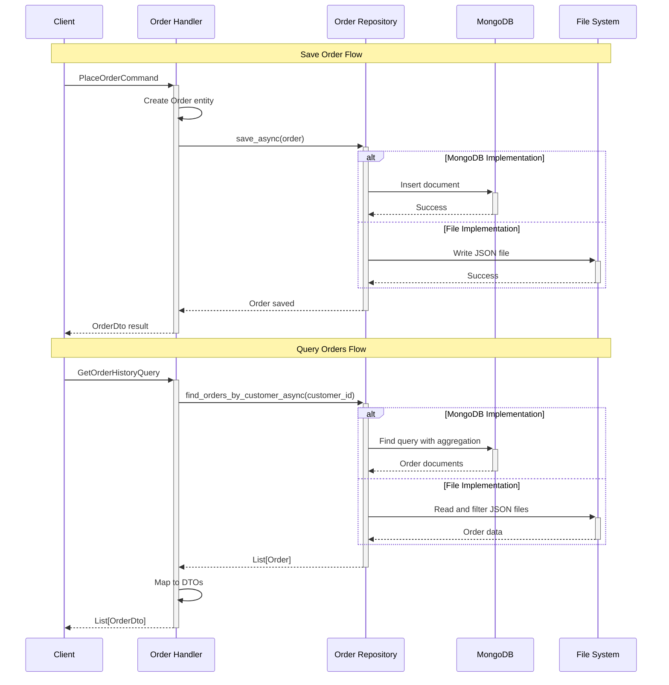

# 🗄️ Repository Pattern

_Estimated reading time: 15 minutes_

## 🎯 What & Why

The **Repository Pattern** abstracts data access logic behind a uniform interface, decoupling your business logic from specific storage mechanisms. It acts as an in-memory collection of domain objects, allowing you to swap storage implementations without changing business code.

### The Problem Without Repository Pattern

```python
# ❌ Without Repository - business logic tightly coupled to MongoDB
class PlaceOrderHandler(CommandHandler):
    def __init__(self, mongo_client: MongoClient):
        self.db = mongo_client.orders_db
        self.collection = self.db.orders

    async def handle_async(self, command: PlaceOrderCommand):
        # Business logic mixed with MongoDB-specific code
        order_doc = {
            "_id": str(uuid.uuid4()),
            "customer_id": command.customer_id,
            "items": [{"pizza": item.pizza, "qty": item.quantity} for item in command.items],
            "total": sum(item.price * item.quantity for item in command.items),
            "created_at": datetime.utcnow()
        }

        # Direct MongoDB operations in business logic
        await self.collection.insert_one(order_doc)

        # Can't test without real MongoDB
        # Can't switch to PostgreSQL without rewriting all handlers
        # Can't use different storage for different entities
```

**Problems:**

- Business logic knows about MongoDB documents and queries
- Testing requires real database (slow, brittle)
- Switching databases requires rewriting all handlers
- Complex queries scattered across codebase
- No abstraction for domain objects

### The Solution With Repository Pattern

```python
# ✅ With Repository - clean abstraction
class PlaceOrderHandler(CommandHandler):
    def __init__(
        self,
        order_repository: IOrderRepository,  # Interface, not implementation
        mapper: Mapper
    ):
        self.order_repository = order_repository
        self.mapper = mapper

    async def handle_async(self, command: PlaceOrderCommand):
        # Pure business logic with domain objects
        order = Order.create(
            customer_id=command.customer_id,
            items=command.items
        )

        # Simple, storage-agnostic persistence
        await self.order_repository.save_async(order)

        return self.created(self.mapper.map(order, OrderDto))

# ✅ Easy to test with in-memory implementation
# ✅ Swap to PostgreSQL by changing DI registration
# ✅ Domain objects, not database documents
# ✅ Complex queries encapsulated in repository
```

**Benefits:**

- Business logic uses domain objects, not database structures
- Easy testing with in-memory or mock repositories
- Swap storage implementations via dependency injection
- Centralized query logic in repository methods
- Storage-agnostic handler code

## 🏗️ Core Components

The Repository pattern consists of three key layers:

## 🏗️ Core Components

The Repository pattern consists of three key layers:

### 1. Repository Interface (Domain Layer)

Defines storage operations as domain concepts:

```python
from abc import ABC, abstractmethod
from typing import Generic, TypeVar, Optional, List
from datetime import datetime

TEntity = TypeVar('TEntity')
TKey = TypeVar('TKey')

# Base repository interface
class IRepository(ABC, Generic[TEntity, TKey]):
    """Abstract repository for all entities"""

    @abstractmethod
    async def get_by_id_async(self, id: TKey) -> Optional[TEntity]:
        """Get entity by ID"""
        pass

    @abstractmethod
    async def save_async(self, entity: TEntity) -> None:
        """Save or update entity"""
        pass

    @abstractmethod
    async def delete_async(self, id: TKey) -> bool:
        """Delete entity by ID"""
        pass

    @abstractmethod
    async def find_all_async(self) -> List[TEntity]:
        """Get all entities"""
        pass

# Order-specific repository interface with domain queries
class IOrderRepository(IRepository[Order, str]):
    """Order repository with business-specific queries"""

    @abstractmethod
    async def find_by_customer_async(self, customer_id: str) -> List[Order]:
        """Find all orders for a customer"""
        pass

    @abstractmethod
    async def find_by_status_async(self, status: OrderStatus) -> List[Order]:
        """Find orders by status"""
        pass

    @abstractmethod
    async def find_pending_deliveries_async(self) -> List[Order]:
        """Find orders pending delivery"""
        pass

    @abstractmethod
    async def get_daily_revenue_async(self, date: datetime.date) -> Decimal:
        """Calculate total revenue for a specific date"""
        pass
```

**Key Points:**

- Lives in **domain layer** (defines what, not how)
- Methods use domain language ("find_by_customer", not "query_collection")
- Returns domain entities, not database records
- No implementation details (no SQL, MongoDB, etc.)

### 2. Repository Implementation (Integration Layer)

Implements the interface for specific storage:

```python
from motor.motor_asyncio import AsyncIOMotorCollection

class MongoOrderRepository(IOrderRepository):
    """MongoDB implementation of order repository"""

    def __init__(self, collection: AsyncIOMotorCollection):
        self._collection = collection

    async def get_by_id_async(self, order_id: str) -> Optional[Order]:
        doc = await self._collection.find_one({"_id": order_id})
        return self._to_entity(doc) if doc else None

    async def save_async(self, order: Order) -> None:
        doc = self._to_document(order)
        await self._collection.replace_one(
            {"_id": order.id},
            doc,
            upsert=True
        )

    async def find_by_customer_async(self, customer_id: str) -> List[Order]:
        cursor = self._collection.find({"customer_id": customer_id})
        docs = await cursor.to_list(None)
        return [self._to_entity(doc) for doc in docs]

    async def get_daily_revenue_async(self, date: datetime.date) -> Decimal:
        start = datetime.combine(date, datetime.min.time())
        end = datetime.combine(date, datetime.max.time())

        pipeline = [
            {
                "$match": {
                    "created_at": {"$gte": start, "$lt": end},
                    "status": {"$ne": "cancelled"}
                }
            },
            {
                "$group": {
                    "_id": None,
                    "total": {"$sum": "$total"}
                }
            }
        ]

        result = await self._collection.aggregate(pipeline).to_list(1)
        return Decimal(str(result[0]["total"])) if result else Decimal("0")

    def _to_document(self, order: Order) -> dict:
        """Convert domain entity to MongoDB document"""
        return {
            "_id": order.id,
            "customer_id": order.customer_id,
            "items": [self._item_to_dict(item) for item in order.items],
            "total": float(order.total),
            "status": order.status.value,
            "created_at": order.created_at,
            "updated_at": order.updated_at
        }

    def _to_entity(self, doc: dict) -> Order:
        """Convert MongoDB document to domain entity"""
        order = Order(
            id=doc["_id"],
            customer_id=doc["customer_id"],
            items=[self._dict_to_item(item) for item in doc["items"]]
        )
        order.status = OrderStatus(doc["status"])
        order.created_at = doc["created_at"]
        order.updated_at = doc["updated_at"]
        return order
```

**Key Points:**

- Lives in **integration layer** (implements how)
- Handles database-specific operations (queries, documents, connections)
- Converts between domain entities and storage format
- Encapsulates complex queries (aggregations, joins)

### 3. Dependency Injection Configuration

Wires interface to implementation:

### 3. Dependency Injection Configuration

Wires interface to implementation:

```python
from neuroglia.hosting.web import WebApplicationBuilder

def configure_repositories(builder: WebApplicationBuilder):
    """Configure repository implementations"""
    services = builder.services

    # Register MongoDB implementation
    services.add_singleton(
        lambda sp: MongoClient(sp.get_service(AppSettings).mongodb_url)
    )

    # Register repositories with scoped lifetime
    services.add_scoped(
        IOrderRepository,
        lambda sp: MongoOrderRepository(
            sp.get_service(MongoClient).orders_db.orders
        )
    )

    services.add_scoped(
        ICustomerRepository,
        lambda sp: MongoCustomerRepository(
            sp.get_service(MongoClient).orders_db.customers
        )
    )

# In tests, swap to in-memory implementation
def configure_test_repositories(builder: WebApplicationBuilder):
    services = builder.services
    services.add_singleton(IOrderRepository, InMemoryOrderRepository)
    services.add_singleton(ICustomerRepository, InMemoryCustomerRepository)
```

## 💡 Real-World Example: Mario's Pizzeria

Complete repository implementation for order management:

### Order Repository Interface

```python
# domain/repositories/order_repository.py
from abc import ABC, abstractmethod
from typing import List, Optional
from datetime import date, datetime
from decimal import Decimal

class IOrderRepository(ABC):
    """Repository for order aggregate management"""

    # Basic CRUD
    @abstractmethod
    async def get_by_id_async(self, order_id: str) -> Optional[Order]:
        pass

    @abstractmethod
    async def save_async(self, order: Order) -> None:
        pass

    @abstractmethod
    async def delete_async(self, order_id: str) -> bool:
        pass

    # Business queries
    @abstractmethod
    async def find_by_customer_async(
        self,
        customer_id: str,
        skip: int = 0,
        limit: int = 20
    ) -> List[Order]:
        """Get paginated orders for a customer"""
        pass

    @abstractmethod
    async def find_active_orders_async(self) -> List[Order]:
        """Get all orders that are pending, preparing, or ready"""
        pass

    @abstractmethod
    async def find_by_status_async(self, status: OrderStatus) -> List[Order]:
        """Get all orders with specific status"""
        pass

    @abstractmethod
    async def find_by_date_range_async(
        self,
        start_date: datetime,
        end_date: datetime
    ) -> List[Order]:
        """Get orders within date range"""
        pass

    # Analytics queries
    @abstractmethod
    async def get_daily_sales_async(self, date: date) -> DailySalesReport:
        """Get sales statistics for a specific date"""
        pass

    @abstractmethod
    async def get_popular_pizzas_async(self, days: int = 30) -> List[PopularPizzaStat]:
        """Get most ordered pizzas in last N days"""
        pass

    @abstractmethod
    async def count_by_customer_async(self, customer_id: str) -> int:
        """Count total orders for a customer"""
        pass
```

### MongoDB Implementation

```python
# integration/repositories/mongo_order_repository.py
from motor.motor_asyncio import AsyncIOMotorCollection
from datetime import datetime, date
from decimal import Decimal

class MongoOrderRepository(IOrderRepository):
    """MongoDB implementation of order repository"""

    def __init__(self, collection: AsyncIOMotorCollection):
        self._collection = collection
        self._ensure_indexes()

    def _ensure_indexes(self):
        """Create database indexes for performance"""
        # Run these on startup
        # await self._collection.create_index("customer_id")
        # await self._collection.create_index("status")
        # await self._collection.create_index("created_at")
        pass

    async def get_by_id_async(self, order_id: str) -> Optional[Order]:
        doc = await self._collection.find_one({"_id": order_id})
        return self._document_to_entity(doc) if doc else None

    async def save_async(self, order: Order) -> None:
        doc = self._entity_to_document(order)
        await self._collection.replace_one(
            {"_id": order.id},
            doc,
            upsert=True
        )

    async def delete_async(self, order_id: str) -> bool:
        result = await self._collection.delete_one({"_id": order_id})
        return result.deleted_count > 0

    async def find_by_customer_async(
        self,
        customer_id: str,
        skip: int = 0,
        limit: int = 20
    ) -> List[Order]:
        cursor = self._collection.find(
            {"customer_id": customer_id}
        ).sort("created_at", -1).skip(skip).limit(limit)

        docs = await cursor.to_list(None)
        return [self._document_to_entity(doc) for doc in docs]

    async def find_active_orders_async(self) -> List[Order]:
        cursor = self._collection.find({
            "status": {"$in": ["pending", "preparing", "ready"]}
        }).sort("created_at", 1)

        docs = await cursor.to_list(None)
        return [self._document_to_entity(doc) for doc in docs]

    async def get_daily_sales_async(self, target_date: date) -> DailySalesReport:
        start = datetime.combine(target_date, datetime.min.time())
        end = datetime.combine(target_date, datetime.max.time())

        pipeline = [
            {
                "$match": {
                    "created_at": {"$gte": start, "$lt": end},
                    "status": {"$ne": "cancelled"}
                }
            },
            {
                "$group": {
                    "_id": None,
                    "total_orders": {"$sum": 1},
                    "total_revenue": {"$sum": "$total"},
                    "avg_order_value": {"$avg": "$total"}
                }
            }
        ]

        result = await self._collection.aggregate(pipeline).to_list(1)

        if result:
            data = result[0]
            return DailySalesReport(
                date=target_date,
                total_orders=data["total_orders"],
                total_revenue=Decimal(str(data["total_revenue"])),
                average_order_value=Decimal(str(data["avg_order_value"]))
            )

        return DailySalesReport(
            date=target_date,
            total_orders=0,
            total_revenue=Decimal("0"),
            average_order_value=Decimal("0")
        )

    async def get_popular_pizzas_async(self, days: int = 30) -> List[PopularPizzaStat]:
        start_date = datetime.now() - timedelta(days=days)

        pipeline = [
            {
                "$match": {
                    "created_at": {"$gte": start_date},
                    "status": {"$ne": "cancelled"}
                }
            },
            {"$unwind": "$items"},
            {
                "$group": {
                    "_id": "$items.pizza_name",
                    "order_count": {"$sum": "$items.quantity"},
                    "total_revenue": {
                        "$sum": {
                            "$multiply": ["$items.price", "$items.quantity"]
                        }
                    }
                }
            },
            {"$sort": {"order_count": -1}},
            {"$limit": 10}
        ]

        results = await self._collection.aggregate(pipeline).to_list(None)

        return [
            PopularPizzaStat(
                pizza_name=doc["_id"],
                order_count=doc["order_count"],
                total_revenue=Decimal(str(doc["total_revenue"]))
            )
            for doc in results
        ]

    def _entity_to_document(self, order: Order) -> dict:
        """Convert domain entity to MongoDB document"""
        return {
            "_id": order.id,
            "customer_id": order.customer_id,
            "items": [
                {
                    "pizza_name": item.pizza_name,
                    "size": item.size.value,
                    "quantity": item.quantity,
                    "price": float(item.price),
                    "toppings": item.toppings
                }
                for item in order.items
            ],
            "subtotal": float(order.subtotal),
            "tax": float(order.tax),
            "delivery_fee": float(order.delivery_fee),
            "total": float(order.total),
            "status": order.status.value,
            "delivery_address": order.delivery_address,
            "special_instructions": order.special_instructions,
            "created_at": order.created_at,
            "updated_at": order.updated_at
        }

    def _document_to_entity(self, doc: dict) -> Order:
        """Convert MongoDB document to domain entity"""
        items = [
            OrderItem(
                pizza_name=item["pizza_name"],
                size=PizzaSize(item["size"]),
                quantity=item["quantity"],
                price=Decimal(str(item["price"])),
                toppings=item.get("toppings", [])
            )
            for item in doc["items"]
        ]

        order = Order(
            id=doc["_id"],
            customer_id=doc["customer_id"],
            items=items,
            delivery_address=doc["delivery_address"],
            special_instructions=doc.get("special_instructions")
        )

        order.status = OrderStatus(doc["status"])
        order.created_at = doc["created_at"]
        order.updated_at = doc["updated_at"]

        return order
```

### In-Memory Implementation (Testing)

```python
# integration/repositories/in_memory_order_repository.py
import copy
from typing import Dict, List, Optional

class InMemoryOrderRepository(IOrderRepository):
    """In-memory implementation for testing"""

    def __init__(self):
        self._orders: Dict[str, Order] = {}

    async def get_by_id_async(self, order_id: str) -> Optional[Order]:
        order = self._orders.get(order_id)
        return copy.deepcopy(order) if order else None

    async def save_async(self, order: Order) -> None:
        self._orders[order.id] = copy.deepcopy(order)

    async def delete_async(self, order_id: str) -> bool:
        if order_id in self._orders:
            del self._orders[order_id]
            return True
        return False

    async def find_by_customer_async(
        self,
        customer_id: str,
        skip: int = 0,
        limit: int = 20
    ) -> List[Order]:
        orders = [
            copy.deepcopy(order)
            for order in self._orders.values()
            if order.customer_id == customer_id
        ]
        orders.sort(key=lambda o: o.created_at, reverse=True)
        return orders[skip:skip + limit]

    async def find_active_orders_async(self) -> List[Order]:
        active_statuses = {OrderStatus.PENDING, OrderStatus.PREPARING, OrderStatus.READY}
        return [
            copy.deepcopy(order)
            for order in self._orders.values()
            if order.status in active_statuses
        ]

    async def get_daily_sales_async(self, target_date: date) -> DailySalesReport:
        total_orders = 0
        total_revenue = Decimal("0")

        for order in self._orders.values():
            if (order.created_at.date() == target_date and
                order.status != OrderStatus.CANCELLED):
                total_orders += 1
                total_revenue += order.total

        avg = total_revenue / total_orders if total_orders > 0 else Decimal("0")

        return DailySalesReport(
            date=target_date,
            total_orders=total_orders,
            total_revenue=total_revenue,
            average_order_value=avg
        )

    def clear(self):
        """Helper method for test cleanup"""
        self._orders.clear()
```

### Application Setup

```python
# main.py
from neuroglia.hosting.web import WebApplicationBuilder

def create_app():
    builder = WebApplicationBuilder()

    # Configure repositories based on environment
    if builder.environment == "production":
        configure_mongo_repositories(builder)
    else:
        configure_in_memory_repositories(builder)

    # Configure core services
    Mediator.configure(builder, ["application.commands", "application.queries"])
    Mapper.configure(builder, ["application.mapping", "api.dtos"])

    # Register application services
    builder.services.add_scoped(OrderService)

    # Build app
    return builder.build()

def configure_mongo_repositories(builder: WebApplicationBuilder):
    """Production: MongoDB repositories"""
    services = builder.services

    # Register MongoDB client
    services.add_singleton(
        lambda sp: MongoClient(sp.get_service(AppSettings).mongodb_url)
    )

    # Register repositories
    services.add_scoped(
        IOrderRepository,
        lambda sp: MongoOrderRepository(
            sp.get_service(MongoClient).pizzeria_db.orders
        )
    )

def configure_in_memory_repositories(builder: WebApplicationBuilder):
    """Development/Testing: In-memory repositories"""
    services = builder.services
    services.add_singleton(IOrderRepository, InMemoryOrderRepository)
```

## 🔧 Advanced Patterns

### 1. Repository with Caching

Add caching layer for frequently accessed data:

```python
class CachedOrderRepository(IOrderRepository):
    """Repository with Redis caching"""

    def __init__(
        self,
        base_repository: IOrderRepository,
        cache: Redis,
        cache_ttl: int = 300
    ):
        self._repository = base_repository
        self._cache = cache
        self._ttl = cache_ttl

    async def get_by_id_async(self, order_id: str) -> Optional[Order]:
        # Try cache first
        cache_key = f"order:{order_id}"
        cached = await self._cache.get(cache_key)

        if cached:
            return json.loads(cached, cls=OrderDecoder)

        # Cache miss - get from database
        order = await self._repository.get_by_id_async(order_id)

        if order:
            # Store in cache
            await self._cache.setex(
                cache_key,
                self._ttl,
                json.dumps(order, cls=OrderEncoder)
            )

        return order

    async def save_async(self, order: Order) -> None:
        # Save to database
        await self._repository.save_async(order)

        # Invalidate cache
        cache_key = f"order:{order.id}"
        await self._cache.delete(cache_key)
```

### 2. Specification Pattern for Complex Queries

Encapsulate query logic in reusable specifications:

```python
from abc import ABC, abstractmethod

class Specification(ABC, Generic[T]):
    """Base specification for filtering"""

    @abstractmethod
    def is_satisfied_by(self, entity: T) -> bool:
        pass

    @abstractmethod
    def to_mongo_query(self) -> dict:
        pass

class ActiveOrdersSpecification(Specification[Order]):
    """Specification for active orders"""

    def is_satisfied_by(self, order: Order) -> bool:
        return order.status in [
            OrderStatus.PENDING,
            OrderStatus.PREPARING,
            OrderStatus.READY
        ]

    def to_mongo_query(self) -> dict:
        return {
            "status": {
                "$in": ["pending", "preparing", "ready"]
            }
        }

class CustomerOrdersSpecification(Specification[Order]):
    """Specification for customer's orders"""

    def __init__(self, customer_id: str):
        self.customer_id = customer_id

    def is_satisfied_by(self, order: Order) -> bool:
        return order.customer_id == self.customer_id

    def to_mongo_query(self) -> dict:
        return {"customer_id": self.customer_id}

# Usage in repository
class MongoOrderRepository(IOrderRepository):
    async def find_by_specification_async(
        self,
        spec: Specification[Order]
    ) -> List[Order]:
        query = spec.to_mongo_query()
        cursor = self._collection.find(query)
        docs = await cursor.to_list(None)
        return [self._document_to_entity(doc) for doc in docs]

# Combine specifications
spec = AndSpecification(
    ActiveOrdersSpecification(),
    CustomerOrdersSpecification("customer_123")
)
orders = await repository.find_by_specification_async(spec)
```

### 3. Unit of Work Pattern Integration

Coordinate multiple repositories in a transaction:

```python
class UnitOfWork:
    """Coordinates repository operations and transactions"""

    def __init__(self, session: AsyncIOMotorClientSession):
        self._session = session
        self._order_repository = MongoOrderRepository(session.collection)
        self._customer_repository = MongoCustomerRepository(session.collection)

    @property
    def orders(self) -> IOrderRepository:
        return self._order_repository

    @property
    def customers(self) -> ICustomerRepository:
        return self._customer_repository

    async def commit_async(self):
        """Commit all changes"""
        await self._session.commit_transaction()

    async def rollback_async(self):
        """Rollback all changes"""
        await self._session.abort_transaction()

# Usage in handler
class PlaceOrderHandler(CommandHandler):
    async def handle_async(self, command: PlaceOrderCommand):
        async with self.unit_of_work.begin_transaction():
            # Update customer
            customer = await self.unit_of_work.customers.get_by_id_async(
                command.customer_id
            )
            customer.increment_order_count()
            await self.unit_of_work.customers.save_async(customer)

            # Create order
            order = Order.create(command.customer_id, command.items)
            await self.unit_of_work.orders.save_async(order)

            # Commit both changes together
            await self.unit_of_work.commit_async()
```

## 🧪 Testing with Repositories

### Unit Testing Handlers

```python
import pytest
from unittest.mock import AsyncMock, Mock

@pytest.mark.asyncio
async def test_place_order_handler():
    # Arrange
    mock_repository = AsyncMock(spec=IOrderRepository)
    mock_mapper = Mock(spec=Mapper)

    handler = PlaceOrderHandler(
        Mock(),  # service_provider
        mock_repository,
        mock_mapper
    )

    command = PlaceOrderCommand(
        customer_id="cust_123",
        items=[OrderItemDto(pizza_name="Margherita", size="large", quantity=2)]
    )

    # Act
    result = await handler.handle_async(command)

    # Assert
    assert result.is_success
    mock_repository.save_async.assert_called_once()
    saved_order = mock_repository.save_async.call_args[0][0]
    assert saved_order.customer_id == "cust_123"
    assert len(saved_order.items) == 1

@pytest.mark.asyncio
async def test_get_customer_orders_query():
    # Arrange
    mock_repository = AsyncMock(spec=IOrderRepository)
    mock_repository.find_by_customer_async.return_value = [
        Order(customer_id="cust_123", items=[]),
        Order(customer_id="cust_123", items=[])
    ]

    handler = GetCustomerOrdersHandler(Mock(), mock_repository, Mock())
    query = GetCustomerOrdersQuery(customer_id="cust_123")

    # Act
    result = await handler.handle_async(query)

    # Assert
    assert result.is_success
    assert len(result.data) == 2
    mock_repository.find_by_customer_async.assert_called_once_with("cust_123", 0, 20)
```

### Integration Testing with Real Repository

```python
@pytest.mark.integration
class TestMongoOrderRepository:
    @pytest.fixture
    async def repository(self, mongo_client):
        """Create repository with test database"""
        collection = mongo_client.test_db.orders
        await collection.delete_many({})  # Clean slate
        return MongoOrderRepository(collection)

    @pytest.mark.asyncio
    async def test_save_and_retrieve_order(self, repository):
        # Arrange
        order = Order(
            customer_id="test_customer",
            items=[
                OrderItem("Margherita", PizzaSize.LARGE, 2, Decimal("15.99"))
            ],
            delivery_address="123 Test St"
        )

        # Act
        await repository.save_async(order)
        retrieved = await repository.get_by_id_async(order.id)

        # Assert
        assert retrieved is not None
        assert retrieved.id == order.id
        assert retrieved.customer_id == "test_customer"
        assert len(retrieved.items) == 1
        assert retrieved.items[0].pizza_name == "Margherita"

    @pytest.mark.asyncio
    async def test_daily_sales_calculation(self, repository):
        # Arrange
        today = date.today()
        orders = [
            Order(customer_id="cust1", items=[
                OrderItem("Margherita", PizzaSize.LARGE, 1, Decimal("15.99"))
            ]),
            Order(customer_id="cust2", items=[
                OrderItem("Pepperoni", PizzaSize.MEDIUM, 2, Decimal("12.99"))
            ])
        ]

        for order in orders:
            await repository.save_async(order)

        # Act
        report = await repository.get_daily_sales_async(today)

        # Assert
        assert report.total_orders == 2
        assert report.total_revenue > Decimal("0")
```

## ⚠️ Common Mistakes

### 1. Leaking Storage Details into Domain

```python
# ❌ Wrong - MongoDB query in handler
class GetOrdersHandler(QueryHandler):
    async def handle_async(self, query: GetOrdersQuery):
        # Domain layer shouldn't know about MongoDB
        orders = await self.repository._collection.find({
            "customer_id": query.customer_id,
            "status": {"$ne": "cancelled"}
        }).to_list(None)

# ✅ Correct - domain-level method
class GetOrdersHandler(QueryHandler):
    async def handle_async(self, query: GetOrdersQuery):
        orders = await self.repository.find_active_by_customer_async(
            query.customer_id
        )
```

### 2. Returning Database Objects

```python
# ❌ Wrong - returning MongoDB document
class OrderRepository:
    async def get_by_id_async(self, order_id: str) -> dict:
        return await self._collection.find_one({"_id": order_id})

# ✅ Correct - returning domain entity
class OrderRepository:
    async def get_by_id_async(self, order_id: str) -> Optional[Order]:
        doc = await self._collection.find_one({"_id": order_id})
        return self._document_to_entity(doc) if doc else None
```

### 3. Not Using Dependency Injection

```python
# ❌ Wrong - creating repository directly
class PlaceOrderHandler:
    def __init__(self):
        self.repository = MongoOrderRepository(
            MongoClient("mongodb://localhost").db.orders
        )  # ❌ Hard-coded, can't test, can't swap

# ✅ Correct - injecting interface
class PlaceOrderHandler:
    def __init__(self, order_repository: IOrderRepository):
        self.repository = order_repository  # ✅ Testable, swappable
```

## 🚫 When NOT to Use

### 1. Simple CRUD with No Business Logic

If you're just passing data through without any business logic:

```python
# Repository might be overkill - consider using ORM directly
@app.get("/orders/{id}")
async def get_order(id: str, db: Database):
    return await db.orders.find_one({"_id": id})
```

### 2. High-Performance Read-Heavy Systems

For read-heavy systems with complex queries, consider CQRS with separate read models:

```python
# Instead of repository, use optimized read model
class OrderReadModel:
    """Denormalized, optimized for queries"""
    async def get_order_details_async(self, order_id: str):
        # Single query with all data pre-joined
        pass
```

### 3. Event Sourcing Systems

Event-sourced aggregates typically use event stores, not traditional repositories:

```python
# Use event store instead of repository
class OrderEventStore:
    async def load_events_async(self, order_id: str) -> List[DomainEvent]:
        pass

    async def append_events_async(self, order_id: str, events: List[DomainEvent]):
        pass
```

## 📝 Key Takeaways

1. **Interface in Domain**: Repository interfaces belong in domain layer
2. **Implementation in Integration**: Concrete repositories belong in integration layer
3. **Domain Objects**: Always return domain entities, never database objects
4. **Testability**: Use in-memory implementations for fast unit tests
5. **Swappable**: Change storage by changing DI registration
6. **Query Encapsulation**: Complex queries belong in repository, not handlers
7. **Dependency Injection**: Always inject interface, not implementation

## 🔗 Related Patterns

- [Clean Architecture](clean-architecture.md) - Repositories implement integration layer
- [CQRS Pattern](cqrs.md) - Separate repositories for commands and queries
- [Unit of Work Pattern](unit-of-work.md) - Coordinate multiple repositories
- [Dependency Injection](dependency-injection.md) - Wire repositories to handlers
- [Event-Driven Architecture](event-driven.md) - Repositories can publish domain events

---

_This pattern guide demonstrates the Repository pattern using Mario's Pizzeria's data access layer, showing storage abstraction and testing strategies._ 🗄️````

## ✅ Benefits

### 1. **Storage Independence**

Business logic doesn't depend on specific storage implementations:

```python
# Domain service works with any repository implementation
class OrderService:
    def __init__(self, order_repository: OrderRepository):
        self._repository = order_repository  # Interface, not implementation

    async def process_order(self, order: Order) -> bool:
        # Business logic is storage-agnostic
        if order.total > Decimal('100'):
            order.apply_discount(Decimal('0.1'))  # 10% discount for large orders

        await self._repository.save_async(order)
        return True

# Can swap implementations without changing business logic
# services.add_scoped(OrderRepository, MongoOrderRepository)  # Production
# services.add_scoped(OrderRepository, InMemoryOrderRepository)  # Testing
```

### 2. **Testability**

Easy to mock repositories for unit testing:

```python
class TestOrderService:
    def setup_method(self):
        self.mock_repository = Mock(spec=OrderRepository)
        self.service = OrderService(self.mock_repository)

    async def test_large_order_gets_discount(self):
        # Arrange
        order = Order(customer_id="123", total=Decimal('150'))

        # Act
        result = await self.service.process_order(order)

        # Assert
        assert order.total == Decimal('135')  # 10% discount applied
        self.mock_repository.save_async.assert_called_once_with(order)
```

### 3. **Centralized Querying**

Complex queries are encapsulated in the repository:

```python
class OrderRepository(Repository[Order, str]):
    async def find_orders_by_customer_async(self, customer_id: str) -> List[Order]:
        """Find all orders for a specific customer"""
        pass

    async def find_orders_by_date_range_async(
        self,
        start_date: datetime,
        end_date: datetime
    ) -> List[Order]:
        """Find orders within a date range"""
        pass

    async def find_popular_pizzas_async(self, days: int = 30) -> List[PopularPizzaStats]:
        """Get pizza popularity statistics"""
        pass
```

## 🔄 Data Flow

Order management demonstrates repository data flow:



## 🎯 Use Cases

Repository pattern is ideal for:

- **Multiple Storage Options**: Support different databases/storage systems
- **Complex Queries**: Encapsulate sophisticated data access logic
- **Testing**: Easy mocking and unit testing
- **Legacy Integration**: Abstract away legacy system complexity

## 🍕 Implementation in Mario's Pizzeria

### Repository Interface

```python
# Abstract base repository for all entities
class Repository(ABC, Generic[TEntity, TKey]):
    @abstractmethod
    async def get_by_id_async(self, id: TKey) -> Optional[TEntity]:
        """Get entity by ID"""
        pass

    @abstractmethod
    async def save_async(self, entity: TEntity) -> None:
        """Save or update entity"""
        pass

    @abstractmethod
    async def delete_async(self, id: TKey) -> bool:
        """Delete entity by ID"""
        pass

    @abstractmethod
    async def find_all_async(self) -> List[TEntity]:
        """Get all entities"""
        pass

# Order-specific repository interface
class OrderRepository(Repository[Order, str]):
    @abstractmethod
    async def find_by_customer_async(self, customer_id: str) -> List[Order]:
        """Find orders for a specific customer"""
        pass

    @abstractmethod
    async def find_by_status_async(self, status: OrderStatus) -> List[Order]:
        """Find orders by status"""
        pass

    @abstractmethod
    async def find_by_date_range_async(
        self,
        start_date: datetime,
        end_date: datetime
    ) -> List[Order]:
        """Find orders within date range"""
        pass

    @abstractmethod
    async def get_daily_sales_async(self, date: datetime.date) -> DailySalesReport:
        """Get sales report for specific date"""
        pass
```

### MongoDB Implementation

```python
class MongoOrderRepository(OrderRepository):
    def __init__(self, collection: Collection):
        self._collection = collection

    async def get_by_id_async(self, order_id: str) -> Optional[Order]:
        document = await self._collection.find_one({"_id": order_id})
        return self._document_to_entity(document) if document else None

    async def save_async(self, order: Order) -> None:
        document = self._entity_to_document(order)
        await self._collection.replace_one(
            {"_id": order.id},
            document,
            upsert=True
        )

    async def find_by_customer_async(self, customer_id: str) -> List[Order]:
        cursor = self._collection.find({"customer_id": customer_id})
        documents = await cursor.to_list(None)
        return [self._document_to_entity(doc) for doc in documents]

    async def find_by_status_async(self, status: OrderStatus) -> List[Order]:
        cursor = self._collection.find({"status": status.value})
        documents = await cursor.to_list(None)
        return [self._document_to_entity(doc) for doc in documents]

    async def get_daily_sales_async(self, date: datetime.date) -> DailySalesReport:
        start_datetime = datetime.combine(date, datetime.min.time())
        end_datetime = datetime.combine(date, datetime.max.time())

        pipeline = [
            {
                "$match": {
                    "created_at": {
                        "$gte": start_datetime,
                        "$lt": end_datetime
                    },
                    "status": {"$ne": "cancelled"}
                }
            },
            {
                "$group": {
                    "_id": None,
                    "total_orders": {"$sum": 1},
                    "total_revenue": {"$sum": "$total"},
                    "avg_order_value": {"$avg": "$total"}
                }
            }
        ]

        result = await self._collection.aggregate(pipeline).to_list(1)
        if result:
            data = result[0]
            return DailySalesReport(
                date=date,
                total_orders=data["total_orders"],
                total_revenue=Decimal(str(data["total_revenue"])),
                average_order_value=Decimal(str(data["avg_order_value"]))
            )

        return DailySalesReport(date=date, total_orders=0, total_revenue=Decimal('0'))

    def _entity_to_document(self, order: Order) -> dict:
        return {
            "_id": order.id,
            "customer_id": order.customer_id,
            "items": [
                {
                    "name": item.pizza_name,
                    "size": item.size,
                    "quantity": item.quantity,
                    "price": float(item.price)
                }
                for item in order.items
            ],
            "total": float(order.total),
            "status": order.status.value,
            "delivery_address": order.delivery_address,
            "special_instructions": order.special_instructions,
            "created_at": order.created_at,
            "updated_at": order.updated_at
        }

    def _document_to_entity(self, document: dict) -> Order:
        items = [
            OrderItem(
                pizza_name=item["name"],
                size=PizzaSize(item["size"]),
                quantity=item["quantity"],
                price=Decimal(str(item["price"]))
            )
            for item in document["items"]
        ]

        order = Order(
            id=document["_id"],
            customer_id=document["customer_id"],
            items=items,
            delivery_address=document["delivery_address"],
            special_instructions=document.get("special_instructions")
        )

        order.status = OrderStatus(document["status"])
        order.created_at = document["created_at"]
        order.updated_at = document["updated_at"]

        return order
```

### File-Based Implementation

```python
class FileOrderRepository(OrderRepository):
    def __init__(self, data_directory: str):
        self._data_dir = Path(data_directory)
        self._data_dir.mkdir(exist_ok=True)

    async def get_by_id_async(self, order_id: str) -> Optional[Order]:
        file_path = self._data_dir / f"{order_id}.json"
        if not file_path.exists():
            return None

        async with aiofiles.open(file_path, 'r') as f:
            data = json.loads(await f.read())
            return self._dict_to_entity(data)

    async def save_async(self, order: Order) -> None:
        file_path = self._data_dir / f"{order.id}.json"
        data = self._entity_to_dict(order)

        async with aiofiles.open(file_path, 'w') as f:
            await f.write(json.dumps(data, indent=2, cls=DecimalEncoder))

    async def find_by_customer_async(self, customer_id: str) -> List[Order]:
        orders = []
        async for file_path in self._iterate_order_files():
            async with aiofiles.open(file_path, 'r') as f:
                data = json.loads(await f.read())
                if data["customer_id"] == customer_id:
                    orders.append(self._dict_to_entity(data))
        return orders

    async def get_daily_sales_async(self, date: datetime.date) -> DailySalesReport:
        total_orders = 0
        total_revenue = Decimal('0')

        async for file_path in self._iterate_order_files():
            async with aiofiles.open(file_path, 'r') as f:
                data = json.loads(await f.read())
                order_date = datetime.fromisoformat(data["created_at"]).date()

                if order_date == date and data["status"] != "cancelled":
                    total_orders += 1
                    total_revenue += Decimal(str(data["total"]))

        avg_order_value = total_revenue / total_orders if total_orders > 0 else Decimal('0')

        return DailySalesReport(
            date=date,
            total_orders=total_orders,
            total_revenue=total_revenue,
            average_order_value=avg_order_value
        )

    async def _iterate_order_files(self):
        for file_path in self._data_dir.glob("*.json"):
            yield file_path
```

### In-Memory Implementation (Testing)

```python
class InMemoryOrderRepository(OrderRepository):
    def __init__(self):
        self._orders: Dict[str, Order] = {}

    async def get_by_id_async(self, order_id: str) -> Optional[Order]:
        return self._orders.get(order_id)

    async def save_async(self, order: Order) -> None:
        # Create deep copy to avoid reference issues in tests
        self._orders[order.id] = copy.deepcopy(order)

    async def delete_async(self, order_id: str) -> bool:
        if order_id in self._orders:
            del self._orders[order_id]
            return True
        return False

    async def find_all_async(self) -> List[Order]:
        return list(self._orders.values())

    async def find_by_customer_async(self, customer_id: str) -> List[Order]:
        return [order for order in self._orders.values()
                if order.customer_id == customer_id]

    async def find_by_status_async(self, status: OrderStatus) -> List[Order]:
        return [order for order in self._orders.values()
                if order.status == status]

    def clear(self):
        """Helper method for testing"""
        self._orders.clear()
```

### Repository Registration

```python
class RepositoryConfiguration:
    def configure_repositories(self, services: ServiceCollection, config: AppConfig):
        if config.storage_type == "mongodb":
            # MongoDB implementation
            services.add_singleton(lambda sp: MongoClient(config.mongodb_connection))
            services.add_scoped(lambda sp: MongoOrderRepository(
                sp.get_service(MongoClient).orders_db.orders
            ))

        elif config.storage_type == "file":
            # File-based implementation
            services.add_scoped(lambda sp: FileOrderRepository(config.data_directory))

        elif config.storage_type == "memory":
            # In-memory implementation (testing)
            services.add_singleton(InMemoryOrderRepository)

        # Register interface to implementation
        services.add_scoped(OrderRepository,
                          lambda sp: sp.get_service(config.repository_implementation))
```

## 🧪 Testing with Repositories

```python
# Unit testing with mocked repositories
class TestOrderService:
    def setup_method(self):
        self.mock_repository = Mock(spec=OrderRepository)
        self.service = OrderService(self.mock_repository)

    async def test_get_customer_orders(self):
        # Arrange
        expected_orders = [
            Order(customer_id="123", items=[]),
            Order(customer_id="123", items=[])
        ]
        self.mock_repository.find_by_customer_async.return_value = expected_orders

        # Act
        result = await self.service.get_customer_orders("123")

        # Assert
        assert len(result) == 2
        self.mock_repository.find_by_customer_async.assert_called_once_with("123")

# Integration testing with real repositories
class TestOrderRepositoryIntegration:
    def setup_method(self):
        self.repository = InMemoryOrderRepository()

    async def test_save_and_retrieve_order(self):
        # Arrange
        order = Order(
            customer_id="123",
            items=[OrderItem("Margherita", PizzaSize.LARGE, 1, Decimal('15.99'))]
        )

        # Act
        await self.repository.save_async(order)
        retrieved = await self.repository.get_by_id_async(order.id)

        # Assert
        assert retrieved is not None
        assert retrieved.customer_id == "123"
        assert len(retrieved.items) == 1
```

## 🔗 Related Patterns

- **[Clean Architecture](clean-architecture.md)** - Repositories belong in the integration layer
- **[CQRS Pattern](cqrs.md)** - Separate repositories for commands and queries
- **[Event-Driven Pattern](event-driven.md)** - Repositories can publish domain events

---

_This pattern guide demonstrates the Repository pattern using Mario's Pizzeria's data access layer. The abstraction enables storage flexibility and comprehensive testing strategies._ 🗄️
