# 🗄️ Repository Pattern

!!! warning "🚧 Under Construction"
This page is currently being developed with comprehensive examples from Mario's Pizzeria. More detailed implementations and code samples are being added.

The Repository pattern abstracts data access logic and provides a uniform interface for accessing domain objects, regardless of the underlying storage mechanism.

## 🎯 Overview

The Repository pattern encapsulates the logic needed to access data sources, centralizing common data access functionality for better maintainability and decoupling infrastructure from the domain model. Mario's Pizzeria demonstrates this through order, menu, and customer data management.

```mermaid
flowchart TD
    subgraph "🍕 Mario's Pizzeria Data Access"
        subgraph Domain["🏛️ Domain Layer"]
            OrderEntity[Order Entity]
            MenuEntity[Menu Entity]
            CustomerEntity[Customer Entity]
        end

        subgraph Application["💼 Application Layer"]
            OrderHandler[Order Handlers]
            MenuHandler[Menu Handlers]
            CustomerHandler[Customer Handlers]
        end

        subgraph Repositories["🗄️ Repository Interfaces"]
            IOrderRepo[IOrderRepository]
            IMenuRepo[IMenuRepository]
            ICustomerRepo[ICustomerRepository]
        end

        subgraph Implementation["🔌 Repository Implementations"]
            MongoOrderRepo[MongoOrderRepository]
            FileMenuRepo[FileMenuRepository]
            SqlCustomerRepo[SqlCustomerRepository]
            InMemoryRepo[InMemoryRepository]
        end

        subgraph Storage["💾 Storage Systems"]
            MongoDB[(MongoDB)]
            FileSystem[(JSON Files)]
            PostgreSQL[(PostgreSQL)]
            Memory[(In-Memory)]
        end
    end

    OrderHandler --> IOrderRepo
    MenuHandler --> IMenuRepo
    CustomerHandler --> ICustomerRepo

    IOrderRepo -.-> MongoOrderRepo
    IMenuRepo -.-> FileMenuRepo
    ICustomerRepo -.-> SqlCustomerRepo

    MongoOrderRepo --> MongoDB
    FileMenuRepo --> FileSystem
    SqlCustomerRepo --> PostgreSQL
    InMemoryRepo --> Memory

    IOrderRepo -.-> InMemoryRepo
    IMenuRepo -.-> InMemoryRepo
    ICustomerRepo -.-> InMemoryRepo
```



## ✅ Benefits

### 1. **Storage Independence**

Business logic doesn't depend on specific storage implementations:

```python
# Domain service works with any repository implementation
class OrderService:
    def __init__(self, order_repository: OrderRepository):
        self._repository = order_repository  # Interface, not implementation

    async def process_order(self, order: Order) -> bool:
        # Business logic is storage-agnostic
        if order.total > Decimal('100'):
            order.apply_discount(Decimal('0.1'))  # 10% discount for large orders

        await self._repository.save_async(order)
        return True

# Can swap implementations without changing business logic
# services.add_scoped(OrderRepository, MongoOrderRepository)  # Production
# services.add_scoped(OrderRepository, InMemoryOrderRepository)  # Testing
```

### 2. **Testability**

Easy to mock repositories for unit testing:

```python
class TestOrderService:
    def setup_method(self):
        self.mock_repository = Mock(spec=OrderRepository)
        self.service = OrderService(self.mock_repository)

    async def test_large_order_gets_discount(self):
        # Arrange
        order = Order(customer_id="123", total=Decimal('150'))

        # Act
        result = await self.service.process_order(order)

        # Assert
        assert order.total == Decimal('135')  # 10% discount applied
        self.mock_repository.save_async.assert_called_once_with(order)
```

### 3. **Centralized Querying**

Complex queries are encapsulated in the repository:

```python
class OrderRepository(Repository[Order, str]):
    async def find_orders_by_customer_async(self, customer_id: str) -> List[Order]:
        """Find all orders for a specific customer"""
        pass

    async def find_orders_by_date_range_async(
        self,
        start_date: datetime,
        end_date: datetime
    ) -> List[Order]:
        """Find orders within a date range"""
        pass

    async def find_popular_pizzas_async(self, days: int = 30) -> List[PopularPizzaStats]:
        """Get pizza popularity statistics"""
        pass
```

## 🔄 Data Flow

Order management demonstrates repository data flow:


## 🎯 Use Cases

Repository pattern is ideal for:

- **Multiple Storage Options**: Support different databases/storage systems
- **Complex Queries**: Encapsulate sophisticated data access logic
- **Testing**: Easy mocking and unit testing
- **Legacy Integration**: Abstract away legacy system complexity

## 🍕 Implementation in Mario's Pizzeria

### Repository Interface

```python
# Abstract base repository for all entities
class Repository(ABC, Generic[TEntity, TKey]):
    @abstractmethod
    async def get_by_id_async(self, id: TKey) -> Optional[TEntity]:
        """Get entity by ID"""
        pass

    @abstractmethod
    async def save_async(self, entity: TEntity) -> None:
        """Save or update entity"""
        pass

    @abstractmethod
    async def delete_async(self, id: TKey) -> bool:
        """Delete entity by ID"""
        pass

    @abstractmethod
    async def find_all_async(self) -> List[TEntity]:
        """Get all entities"""
        pass

# Order-specific repository interface
class OrderRepository(Repository[Order, str]):
    @abstractmethod
    async def find_by_customer_async(self, customer_id: str) -> List[Order]:
        """Find orders for a specific customer"""
        pass

    @abstractmethod
    async def find_by_status_async(self, status: OrderStatus) -> List[Order]:
        """Find orders by status"""
        pass

    @abstractmethod
    async def find_by_date_range_async(
        self,
        start_date: datetime,
        end_date: datetime
    ) -> List[Order]:
        """Find orders within date range"""
        pass

    @abstractmethod
    async def get_daily_sales_async(self, date: datetime.date) -> DailySalesReport:
        """Get sales report for specific date"""
        pass
```

### MongoDB Implementation

```python
class MongoOrderRepository(OrderRepository):
    def __init__(self, collection: Collection):
        self._collection = collection

    async def get_by_id_async(self, order_id: str) -> Optional[Order]:
        document = await self._collection.find_one({"_id": order_id})
        return self._document_to_entity(document) if document else None

    async def save_async(self, order: Order) -> None:
        document = self._entity_to_document(order)
        await self._collection.replace_one(
            {"_id": order.id},
            document,
            upsert=True
        )

    async def find_by_customer_async(self, customer_id: str) -> List[Order]:
        cursor = self._collection.find({"customer_id": customer_id})
        documents = await cursor.to_list(None)
        return [self._document_to_entity(doc) for doc in documents]

    async def find_by_status_async(self, status: OrderStatus) -> List[Order]:
        cursor = self._collection.find({"status": status.value})
        documents = await cursor.to_list(None)
        return [self._document_to_entity(doc) for doc in documents]

    async def get_daily_sales_async(self, date: datetime.date) -> DailySalesReport:
        start_datetime = datetime.combine(date, datetime.min.time())
        end_datetime = datetime.combine(date, datetime.max.time())

        pipeline = [
            {
                "$match": {
                    "created_at": {
                        "$gte": start_datetime,
                        "$lt": end_datetime
                    },
                    "status": {"$ne": "cancelled"}
                }
            },
            {
                "$group": {
                    "_id": None,
                    "total_orders": {"$sum": 1},
                    "total_revenue": {"$sum": "$total"},
                    "avg_order_value": {"$avg": "$total"}
                }
            }
        ]

        result = await self._collection.aggregate(pipeline).to_list(1)
        if result:
            data = result[0]
            return DailySalesReport(
                date=date,
                total_orders=data["total_orders"],
                total_revenue=Decimal(str(data["total_revenue"])),
                average_order_value=Decimal(str(data["avg_order_value"]))
            )

        return DailySalesReport(date=date, total_orders=0, total_revenue=Decimal('0'))

    def _entity_to_document(self, order: Order) -> dict:
        return {
            "_id": order.id,
            "customer_id": order.customer_id,
            "items": [
                {
                    "name": item.pizza_name,
                    "size": item.size,
                    "quantity": item.quantity,
                    "price": float(item.price)
                }
                for item in order.items
            ],
            "total": float(order.total),
            "status": order.status.value,
            "delivery_address": order.delivery_address,
            "special_instructions": order.special_instructions,
            "created_at": order.created_at,
            "updated_at": order.updated_at
        }

    def _document_to_entity(self, document: dict) -> Order:
        items = [
            OrderItem(
                pizza_name=item["name"],
                size=PizzaSize(item["size"]),
                quantity=item["quantity"],
                price=Decimal(str(item["price"]))
            )
            for item in document["items"]
        ]

        order = Order(
            id=document["_id"],
            customer_id=document["customer_id"],
            items=items,
            delivery_address=document["delivery_address"],
            special_instructions=document.get("special_instructions")
        )

        order.status = OrderStatus(document["status"])
        order.created_at = document["created_at"]
        order.updated_at = document["updated_at"]

        return order
```

### File-Based Implementation

```python
class FileOrderRepository(OrderRepository):
    def __init__(self, data_directory: str):
        self._data_dir = Path(data_directory)
        self._data_dir.mkdir(exist_ok=True)

    async def get_by_id_async(self, order_id: str) -> Optional[Order]:
        file_path = self._data_dir / f"{order_id}.json"
        if not file_path.exists():
            return None

        async with aiofiles.open(file_path, 'r') as f:
            data = json.loads(await f.read())
            return self._dict_to_entity(data)

    async def save_async(self, order: Order) -> None:
        file_path = self._data_dir / f"{order.id}.json"
        data = self._entity_to_dict(order)

        async with aiofiles.open(file_path, 'w') as f:
            await f.write(json.dumps(data, indent=2, cls=DecimalEncoder))

    async def find_by_customer_async(self, customer_id: str) -> List[Order]:
        orders = []
        async for file_path in self._iterate_order_files():
            async with aiofiles.open(file_path, 'r') as f:
                data = json.loads(await f.read())
                if data["customer_id"] == customer_id:
                    orders.append(self._dict_to_entity(data))
        return orders

    async def get_daily_sales_async(self, date: datetime.date) -> DailySalesReport:
        total_orders = 0
        total_revenue = Decimal('0')

        async for file_path in self._iterate_order_files():
            async with aiofiles.open(file_path, 'r') as f:
                data = json.loads(await f.read())
                order_date = datetime.fromisoformat(data["created_at"]).date()

                if order_date == date and data["status"] != "cancelled":
                    total_orders += 1
                    total_revenue += Decimal(str(data["total"]))

        avg_order_value = total_revenue / total_orders if total_orders > 0 else Decimal('0')

        return DailySalesReport(
            date=date,
            total_orders=total_orders,
            total_revenue=total_revenue,
            average_order_value=avg_order_value
        )

    async def _iterate_order_files(self):
        for file_path in self._data_dir.glob("*.json"):
            yield file_path
```

### In-Memory Implementation (Testing)

```python
class InMemoryOrderRepository(OrderRepository):
    def __init__(self):
        self._orders: Dict[str, Order] = {}

    async def get_by_id_async(self, order_id: str) -> Optional[Order]:
        return self._orders.get(order_id)

    async def save_async(self, order: Order) -> None:
        # Create deep copy to avoid reference issues in tests
        self._orders[order.id] = copy.deepcopy(order)

    async def delete_async(self, order_id: str) -> bool:
        if order_id in self._orders:
            del self._orders[order_id]
            return True
        return False

    async def find_all_async(self) -> List[Order]:
        return list(self._orders.values())

    async def find_by_customer_async(self, customer_id: str) -> List[Order]:
        return [order for order in self._orders.values()
                if order.customer_id == customer_id]

    async def find_by_status_async(self, status: OrderStatus) -> List[Order]:
        return [order for order in self._orders.values()
                if order.status == status]

    def clear(self):
        """Helper method for testing"""
        self._orders.clear()
```

### Repository Registration

```python
class RepositoryConfiguration:
    def configure_repositories(self, services: ServiceCollection, config: AppConfig):
        if config.storage_type == "mongodb":
            # MongoDB implementation
            services.add_singleton(lambda sp: MongoClient(config.mongodb_connection))
            services.add_scoped(lambda sp: MongoOrderRepository(
                sp.get_service(MongoClient).orders_db.orders
            ))

        elif config.storage_type == "file":
            # File-based implementation
            services.add_scoped(lambda sp: FileOrderRepository(config.data_directory))

        elif config.storage_type == "memory":
            # In-memory implementation (testing)
            services.add_singleton(InMemoryOrderRepository)

        # Register interface to implementation
        services.add_scoped(OrderRepository,
                          lambda sp: sp.get_service(config.repository_implementation))
```

## 🧪 Testing with Repositories

```python
# Unit testing with mocked repositories
class TestOrderService:
    def setup_method(self):
        self.mock_repository = Mock(spec=OrderRepository)
        self.service = OrderService(self.mock_repository)

    async def test_get_customer_orders(self):
        # Arrange
        expected_orders = [
            Order(customer_id="123", items=[]),
            Order(customer_id="123", items=[])
        ]
        self.mock_repository.find_by_customer_async.return_value = expected_orders

        # Act
        result = await self.service.get_customer_orders("123")

        # Assert
        assert len(result) == 2
        self.mock_repository.find_by_customer_async.assert_called_once_with("123")

# Integration testing with real repositories
class TestOrderRepositoryIntegration:
    def setup_method(self):
        self.repository = InMemoryOrderRepository()

    async def test_save_and_retrieve_order(self):
        # Arrange
        order = Order(
            customer_id="123",
            items=[OrderItem("Margherita", PizzaSize.LARGE, 1, Decimal('15.99'))]
        )

        # Act
        await self.repository.save_async(order)
        retrieved = await self.repository.get_by_id_async(order.id)

        # Assert
        assert retrieved is not None
        assert retrieved.customer_id == "123"
        assert len(retrieved.items) == 1
```

## 🔗 Related Patterns

- **[Clean Architecture](clean-architecture.md)** - Repositories belong in the integration layer
- **[CQRS Pattern](cqrs.md)** - Separate repositories for commands and queries
- **[Event-Driven Pattern](event-driven.md)** - Repositories can publish domain events

---

_This pattern guide demonstrates the Repository pattern using Mario's Pizzeria's data access layer. The abstraction enables storage flexibility and comprehensive testing strategies._ 🗄️
