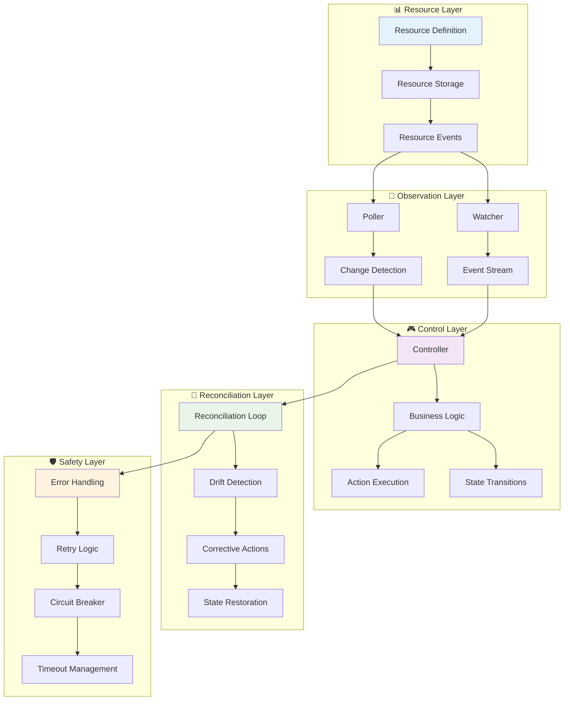

# 🎯 Resource Oriented Architecture (ROA)

> **🚧 Work in Progress**: This documentation is being updated to include beginner-friendly explanations with What & Why sections, Common Mistakes, and When NOT to Use guidance. The content below is accurate but will be enhanced soon.

Resource Oriented Architecture is a powerful pattern for building systems that manage resources through their lifecycle,
similar to how Kubernetes manages cluster resources. Neuroglia provides comprehensive support for ROA patterns including
watchers, controllers, and reconciliation loops.

## 🎯 Overview

ROA provides:

- **📊 Resource Management**: Declarative resource definitions with desired vs actual state
- **👀 Watchers**: Continuous monitoring of resource changes through polling or event streams
- **🎮 Controllers**: Business logic that responds to resource changes and implements state transitions
- **🔄 Reconciliation**: Periodic loops that ensure system consistency and handle drift detection
- **🛡️ Safety Mechanisms**: Timeout handling, error recovery, and corrective actions

## 🏗️ Architecture Overview



## 🏗️ Core Components

### Resource Definition

Resources are declarative objects that define desired state:

```python
@dataclass
class LabInstanceResource:
    api_version: str = "lab.neuroglia.com/v1"
    kind: str = "LabInstance"
    metadata: Dict[str, Any] = None
    spec: Dict[str, Any] = None      # Desired state
    status: Dict[str, Any] = None    # Current state
```

### Watcher Pattern

Watchers continuously monitor resources for changes:

```python
class LabInstanceWatcher:
    async def start_watching(self):
        while self.is_running:
            # Poll for changes since last known version
            changes = self.storage.list_resources(since_version=self.last_resource_version)

            for resource in changes:
                await self._handle_resource_change(resource)

            await asyncio.sleep(self.poll_interval)
```

### Controller Pattern

Controllers respond to resource changes with business logic:

```python
class LabInstanceController:
    async def handle_resource_event(self, resource: LabInstanceResource):
        current_state = resource.status.get('state')

        if current_state == ResourceState.PENDING.value:
            await self._start_provisioning(resource)
        elif current_state == ResourceState.PROVISIONING.value:
            await self._check_provisioning_status(resource)
```

### Reconciliation Loop

Reconcilers ensure eventual consistency:

```python
class LabInstanceScheduler:
    async def start_reconciliation(self):
        while self.is_running:
            await self._reconcile_all_resources()
            await asyncio.sleep(self.reconcile_interval)

    async def _reconcile_resource(self, resource):
        # Check for stuck states, timeouts, and drift
        # Take corrective actions as needed
```

## 🚀 Key Patterns

### 1. Declarative State Management

Resources define **what** should exist, not **how** to create it:

```python
# Desired state (spec)
spec = {
    'template': 'python-basics',
    'duration': '60m',
    'studentEmail': 'student@example.com'
}

# Current state (status)
status = {
    'state': 'ready',
    'endpoint': 'https://lab-instance.example.com',
    'readyAt': '2025-09-09T21:34:19Z'
}
```

### 2. Event-Driven Processing

Watchers detect changes and notify controllers immediately:

```
Resource Change → Watcher Detection → Controller Response → State Update
```

### 3. Asynchronous Reconciliation

Controllers handle immediate responses while reconcilers provide safety:

```python
# Controller: Immediate response to events
async def handle_resource_event(self, resource):
    if resource.state == PENDING:
        await self.start_provisioning(resource)

# Reconciler: Periodic safety checks
async def reconcile_resource(self, resource):
    if self.is_stuck_provisioning(resource):
        await self.mark_as_failed(resource)
```

### 4. State Machine Implementation

Resources progress through well-defined states:

```
PENDING → PROVISIONING → READY → (cleanup) → DELETING → DELETED
    ↓                      ↓
  FAILED              ← FAILED
```

## ⚡ Execution Model

### Timing and Coordination

- **Watchers**: Poll every 2-5 seconds for near-real-time responsiveness
- **Controllers**: Respond immediately to detected changes
- **Reconcilers**: Run every 10-30 seconds for consistency checks

### Concurrent Processing

All components run concurrently:

```python
async def main():
    # Start all components concurrently
    watcher_task = asyncio.create_task(watcher.start_watching())
    scheduler_task = asyncio.create_task(scheduler.start_reconciliation())

    # Controllers are event-driven (no separate task needed)
    watcher.add_event_handler(controller.handle_resource_event)
```

## 🛡️ Safety and Reliability

### Timeout Handling

Reconcilers detect and handle stuck states:

```python
if resource.state == PROVISIONING and age > timeout_threshold:
    await self.mark_as_failed(resource, "Provisioning timeout")
```

### Error Recovery

Controllers and reconcilers implement retry logic:

```python
try:
    await self.provision_lab_instance(resource)
except Exception as e:
    resource.status['retries'] = resource.status.get('retries', 0) + 1
    if resource.status['retries'] < max_retries:
        await self.schedule_retry(resource)
    else:
        await self.mark_as_failed(resource, str(e))
```

### Drift Detection

Reconcilers verify that actual state matches desired state:

```python
async def check_drift(self, resource):
    actual_state = await self.get_actual_infrastructure_state(resource)
    desired_state = resource.spec

    if actual_state != desired_state:
        await self.correct_drift(resource, actual_state, desired_state)
```

## 📊 Observability

### Metrics and Logging

ROA components provide rich observability:

```python
logger.info(f"🔍 Watcher detected change: {resource_id} -> {state}")
logger.info(f"🎮 Controller processing: {resource_id} (state: {state})")
logger.info(f"🔄 Reconciling {len(resources)} resources")
logger.warning(f"⚠️ Reconciler: Resource stuck: {resource_id}")
```

### Resource Versioning

Track changes with resource versions:

```python
resource.metadata['resourceVersion'] = str(self.next_version())
resource.metadata['lastModified'] = datetime.now(timezone.utc).isoformat()
```

## 🔧 Configuration

### Tuning Parameters

Adjust timing for your use case:

```python
# Development: Fast feedback
watcher = LabInstanceWatcher(storage, poll_interval=1.0)
scheduler = LabInstanceScheduler(storage, reconcile_interval=5.0)

# Production: Balanced performance
watcher = LabInstanceWatcher(storage, poll_interval=5.0)
scheduler = LabInstanceScheduler(storage, reconcile_interval=30.0)
```

### Scaling Considerations

- **Multiple Watchers**: Use resource sharding for scale
- **Controller Parallelism**: Process multiple resources concurrently
- **Reconciler Batching**: Group operations for efficiency

## 🎯 Use Cases

ROA is ideal for:

- **Infrastructure Management**: Cloud resources, containers, services
- **Workflow Orchestration**: Multi-step processes with dependencies
- **Resource Lifecycle**: Provisioning, monitoring, cleanup
- **System Integration**: Managing external system state
- **DevOps Automation**: CI/CD pipelines, deployment management

## 🔗 Related Documentation

- **[🏗️ Watcher & Reconciliation Patterns](watcher-reconciliation-patterns.md)** - Detailed pattern explanations
- **[⚡ Execution Flow](watcher-reconciliation-execution.md)** - How components coordinate
- **[🧪 Lab Resource Manager Sample](../samples/lab-resource-manager.md)** - Complete ROA implementation
- **[🎯 CQRS & Mediation](cqrs-mediation.md)** - Command/Query patterns used in ROA
- **[🗄️ Data Access](data-access.md)** - Repository patterns for resource storage
