# 🔄 Unit of Work Pattern

The Unit of Work pattern maintains a list of objects affected by a business transaction and coordinates writing out changes while resolving concurrency problems. In the Neuroglia framework, it provides automatic domain event collection and dispatching, enabling both **event-sourced** and **state-based persistence** patterns.

## 🎯 Pattern Overview

The Unit of Work pattern serves as a **coordination mechanism** between your domain aggregates and the infrastructure, ensuring that:

- **Transactional Consistency**: All changes within a business operation succeed or fail together
- **Event Coordination**: Domain events are collected and dispatched automatically after successful operations
- **Aggregate Tracking**: Modified entities are tracked during the request lifecycle
- **Clean Separation**: Domain logic remains pure while infrastructure handles persistence concerns

### 🏗️ Architecture Integration

```mermaid
graph TB
    subgraph "💼 Application Layer"
        CH[Command Handler]
        QH[Query Handler]
    end

    subgraph "🔄 Unit of Work"
        UOW[IUnitOfWork]
        AGG_LIST[Registered Aggregates]
        EVENT_COLL[Domain Event Collection]
    end

    subgraph "🏛️ Domain Layer"
        ENT1[Entity/Aggregate 1]
        ENT2[Entity/Aggregate 2]
        DE[Domain Events]
    end

    subgraph "🔧 Infrastructure"
        REPO[Repositories]
        DB[(Database)]
        MW[Pipeline Middleware]
    end

    CH --> UOW
    CH --> ENT1
    CH --> ENT2
    ENT1 --> DE
    ENT2 --> DE
    UOW --> AGG_LIST
    UOW --> EVENT_COLL
    CH --> REPO
    REPO --> DB
    MW --> UOW
    MW --> DE
```



## 🔧 Core Interface

The `IUnitOfWork` interface provides a simple contract for aggregate and event management:

```python
from abc import ABC, abstractmethod
from typing import List
from neuroglia.data.abstractions import AggregateRoot, DomainEvent

class IUnitOfWork(ABC):
    """Unit of Work pattern for coordinating aggregate changes and domain events."""

    @abstractmethod
    def register_aggregate(self, aggregate: AggregateRoot) -> None:
        """Registers an aggregate for event collection and tracking."""

    @abstractmethod
    def get_domain_events(self) -> List[DomainEvent]:
        """Gets all domain events from registered aggregates."""

    @abstractmethod
    def clear(self) -> None:
        """Clears all registered aggregates and collected events."""

    @abstractmethod
    def has_changes(self) -> bool:
        """Determines if any aggregates have pending changes."""
```

## 📦 Implementation Patterns

### 1. **Basic Usage in Command Handlers**

```python
class CreateOrderHandler(CommandHandler[CreateOrderCommand, OperationResult[OrderDto]]):
    def __init__(self,
                 order_repository: OrderRepository,
                 unit_of_work: IUnitOfWork):
        self.order_repository = order_repository
        self.unit_of_work = unit_of_work

    async def handle_async(self, command: CreateOrderCommand) -> OperationResult[OrderDto]:
        # 1. Create domain entity (raises domain events)
        order = Order.create(command.customer_id, command.items)

        # 2. Persist state
        await self.order_repository.save_async(order)

        # 3. Register for automatic event dispatching
        self.unit_of_work.register_aggregate(order)

        # 4. Return result - events dispatched automatically by middleware
        return self.created(OrderDto.from_entity(order))
```

### 2. **Multiple Aggregates in Single Transaction**

```python
class ProcessPaymentHandler(CommandHandler):
    async def handle_async(self, command: ProcessPaymentCommand) -> OperationResult:
        # Multiple aggregates modified in single business transaction

        # Update order
        order = await self.order_repository.get_by_id_async(command.order_id)
        order.mark_paid(command.payment_id)  # Raises OrderPaidEvent
        await self.order_repository.save_async(order)
        self.unit_of_work.register_aggregate(order)

        # Update customer account
        customer = await self.customer_repository.get_by_id_async(order.customer_id)
        customer.record_purchase(order.total_amount)  # Raises PurchaseRecordedEvent
        await self.customer_repository.save_async(customer)
        self.unit_of_work.register_aggregate(customer)

        # Update inventory
        for item in order.items:
            inventory = await self.inventory_repository.get_by_product_id(item.product_id)
            inventory.reduce_stock(item.quantity)  # Raises StockReducedEvent
            await self.inventory_repository.save_async(inventory)
            self.unit_of_work.register_aggregate(inventory)

        # All events from all aggregates dispatched together
        return self.ok({"order_id": order.id, "payment_processed": True})
```

## 🎭 Persistence Pattern Flexibility

The Unit of Work pattern supports **multiple persistence approaches** with the same infrastructure:

### **Pattern 1: Simple Entity with State Persistence**

_→ Complexity Level: ⭐⭐☆☆☆_

**Best for**: CRUD operations, simple domains, traditional persistence

```python
class Product(Entity):  # ← Just Entity, no AggregateRoot needed!
    """Simple entity with domain events for state-based persistence."""

    def __init__(self, name: str, price: float):
        super().__init__()
        self._id = str(uuid.uuid4())
        self.name = name
        self.price = price

        # Raise domain event
        self._raise_domain_event(ProductCreatedEvent(self.id, name, price))

    def update_price(self, new_price: float):
        """Business logic with domain event."""
        if new_price != self.price:
            old_price = self.price
            self.price = new_price
            self._raise_domain_event(PriceChangedEvent(self.id, old_price, new_price))

    # Minimal event infrastructure
    def _raise_domain_event(self, event: DomainEvent):
        if not hasattr(self, '_pending_events'):
            self._pending_events = []
        self._pending_events.append(event)

    @property
    def domain_events(self) -> List[DomainEvent]:
        return getattr(self, '_pending_events', []).copy()

    def clear_pending_events(self):
        if hasattr(self, '_pending_events'):
            self._pending_events.clear()

# Usage - Same UnitOfWork, simpler entity
class UpdateProductPriceHandler(CommandHandler):
    async def handle_async(self, command: UpdateProductPriceCommand):
        product = await self.product_repository.get_by_id_async(command.product_id)
        product.update_price(command.new_price)  # Raises PriceChangedEvent

        await self.product_repository.save_async(product)  # Save state to DB
        self.unit_of_work.register_aggregate(product)      # Auto-dispatch events

        return self.ok(ProductDto.from_entity(product))
```

**Characteristics**:

- ✅ Direct state persistence to database
- ✅ Simple entity inheritance (`Entity`)
- ✅ Automatic domain event dispatching
- ✅ No event store required
- ✅ Traditional database schemas
- ✅ Easy to understand and implement

### **Pattern 2: Aggregate Root with Event Sourcing**

_→ Complexity Level: ⭐⭐⭐⭐⭐_

**Best for**: Complex domains, audit requirements, temporal queries

```python
class OrderAggregate(AggregateRoot[OrderState, UUID]):
    """Complex aggregate with full event sourcing."""

    def place_order(self, customer_id: str, items: List[OrderItem]):
        """Rich business logic with event sourcing."""
        # Business rules validation
        if not items:
            raise DomainException("Order must have at least one item")

        total = sum(item.price * item.quantity for item in items)
        if total <= 0:
            raise DomainException("Order total must be positive")

        # Apply event to change state
        event = OrderPlacedEvent(
            order_id=self.id,
            customer_id=customer_id,
            items=items,
            total_amount=total,
            placed_at=datetime.utcnow()
        )

        # Event sourcing: event changes state + is stored for replay
        self.state.on(event)  # Apply to current state
        self.register_event(event)  # Register for persistence

    def add_item(self, product_id: str, quantity: int, price: Decimal):
        """Add item with business rule validation."""
        if self.state.status != OrderStatus.DRAFT:
            raise DomainException("Cannot modify confirmed order")

        event = ItemAddedEvent(self.id, product_id, quantity, price)
        self.state.on(event)
        self.register_event(event)

# Usage - Same UnitOfWork, event-sourced aggregate
class PlaceOrderHandler(CommandHandler):
    async def handle_async(self, command: PlaceOrderCommand):
        order = OrderAggregate()
        order.place_order(command.customer_id, command.items)  # Raises OrderPlacedEvent

        await self.order_repository.save_async(order)  # Save events to event store
        self.unit_of_work.register_aggregate(order)    # Auto-dispatch events

        return self.created(OrderDto.from_aggregate(order))
```

**Characteristics**:

- ✅ Complete event sourcing with event store
- ✅ Full aggregate pattern with `AggregateRoot[TState, TKey]`
- ✅ Rich business logic and invariant enforcement
- ✅ Temporal queries and audit trails
- ✅ Event replay and projection capabilities
- ✅ Complex consistency boundaries

### **Pattern 3: Hybrid Approach**

_→ Complexity Level: ⭐⭐⭐☆☆_

**Best for**: Mixed requirements, gradual migration, pragmatic solutions

```python
# Mix both patterns in the same application
class OrderProcessingHandler(CommandHandler):
    async def handle_async(self, command: ProcessOrderCommand):
        # Event-sourced aggregate for complex business logic
        order = await self.order_repository.get_by_id_async(command.order_id)
        order.process_payment(command.payment_info)  # Complex event-sourced logic
        await self.order_repository.save_async(order)
        self.unit_of_work.register_aggregate(order)

        # Simple entity for straightforward updates
        inventory = await self.inventory_repository.get_by_product_id(command.product_id)
        inventory.reduce_stock(command.quantity)  # Simple state-based persistence
        await self.inventory_repository.save_async(inventory)
        self.unit_of_work.register_aggregate(inventory)

        # Both patterns work together seamlessly
        return self.ok()
```

## 🔧 Infrastructure Integration

### **Pipeline Integration**

The Unit of Work integrates seamlessly with the mediation pipeline through `DomainEventDispatchingMiddleware`:

```python
# Automatic setup
services = ServiceCollection()
services.add_mediator()
services.add_state_based_persistence()  # Includes UnitOfWork + Event Dispatching

# Pipeline execution flow:
# 1. Command received
# 2. [Optional] Transaction begins
# 3. Command handler executes
# 4. Handler registers aggregates with UnitOfWork
# 5. Command completes successfully
# 6. DomainEventDispatchingMiddleware collects events
# 7. Events dispatched through mediator
# 8. [Optional] Transaction commits
# 9. UnitOfWork cleared for next request
```

### **Event Collection Mechanism**

The UnitOfWork uses **duck typing** to collect events from any object, supporting both patterns:

```python
def get_domain_events(self) -> List[DomainEvent]:
    """Flexible event collection supporting multiple patterns."""
    events = []

    for aggregate in self._aggregates:
        # Event-sourced aggregates (AggregateRoot)
        if hasattr(aggregate, 'get_uncommitted_events'):
            events.extend(aggregate.get_uncommitted_events())

        # State-based entities (Entity + domain_events)
        elif hasattr(aggregate, 'domain_events'):
            events.extend(aggregate.domain_events)

        # Fallback to internal events
        elif hasattr(aggregate, '_pending_events'):
            events.extend(aggregate._pending_events)

    return events
```

## 📋 Complexity Comparison

| **Aspect**                | **Entity + State Persistence** | **AggregateRoot + Event Sourcing** |
| ------------------------- | ------------------------------ | ---------------------------------- |
| **Learning Curve**        | ⭐⭐☆☆☆ Simple                 | ⭐⭐⭐⭐⭐ Complex                 |
| **Setup Complexity**      | ⭐⭐☆☆☆ Minimal                | ⭐⭐⭐⭐☆ Significant              |
| **Database Requirements** | Any SQL/NoSQL database         | Event store + projections          |
| **Query Capabilities**    | Direct database queries        | Event replay + projections         |
| **Business Logic**        | Method-based                   | Event-driven state machines        |
| **Audit & History**       | Manual implementation          | Built-in temporal queries          |
| **Performance**           | Direct database access         | Event replay overhead              |
| **Scalability**           | Traditional scaling            | Event-driven scaling               |

## 🎯 When to Use Each Pattern

### **Choose Entity + State Persistence When**

- ✅ Building CRUD-heavy applications
- ✅ Team is new to DDD/event sourcing
- ✅ Simple business rules and workflows
- ✅ Traditional database infrastructure
- ✅ Performance is critical
- ✅ Quick prototyping and development

### **Choose AggregateRoot + Event Sourcing When**

- ✅ Complex business domains with rich logic
- ✅ Audit trails and compliance requirements
- ✅ Temporal queries and historical analysis
- ✅ Event-driven integrations
- ✅ High consistency requirements
- ✅ Long-term maintainability over complexity

### **Choose Hybrid Approach When**

- ✅ Mixed complexity across domain areas
- ✅ Migrating from traditional to event-sourced systems
- ✅ Different persistence requirements per bounded context
- ✅ Pragmatic balance between complexity and capability

## 🔗 Integration with Other Patterns

### **CQRS Integration**

The Unit of Work pattern works seamlessly with [CQRS](../simple-cqrs.md):

```python
# Commands use UnitOfWork for writes
class CreateProductHandler(CommandHandler):
    async def handle_async(self, command):
        product = Product(command.name, command.price)
        await self.repository.save_async(product)
        self.unit_of_work.register_aggregate(product)  # Events dispatched
        return self.created(product)

# Queries bypass UnitOfWork for reads
class GetProductHandler(QueryHandler):
    async def handle_async(self, query):
        return await self.repository.get_by_id_async(query.product_id)
        # No UnitOfWork needed for read operations
```

### **Pipeline Behaviors Integration**

Unit of Work integrates with [Pipeline Behaviors](../pipeline-behaviors.md):

```python
# Transaction behavior + Domain event dispatching
services.add_scoped(PipelineBehavior, TransactionBehavior)        # 1st: Manages DB transactions
services.add_scoped(PipelineBehavior, DomainEventDispatchingMiddleware)  # 2nd: Dispatches events after success
services.add_scoped(PipelineBehavior, LoggingBehavior)            # 3rd: Logs execution

# Execution order ensures events only dispatch after successful transaction commit
```

### **Repository Pattern Integration**

Unit of Work coordinates with [Repository Pattern](../repository.md):

```python
# Repository handles persistence, UnitOfWork handles events
class OrderHandler(CommandHandler):
    async def handle_async(self, command):
        order = Order.create(command.data)     # Domain logic
        await self.repository.save_async(order)  # Repository persistence
        self.unit_of_work.register_aggregate(order)  # UnitOfWork event coordination
        return self.created(order)
```

## 🧪 Testing Strategies

### **Unit Testing Domain Events**

```python
def test_product_creation_raises_event():
    """Test domain events are raised correctly."""
    product = Product("Laptop", 999.99)

    events = product.domain_events
    assert len(events) == 1
    assert isinstance(events[0], ProductCreatedEvent)
    assert events[0].name == "Laptop"
    assert events[0].price == 999.99

def test_price_update_raises_event():
    """Test business operations raise appropriate events."""
    product = Product("Laptop", 999.99)
    product.clear_pending_events()  # Clear creation event

    product.update_price(899.99)

    events = product.domain_events
    assert len(events) == 1
    assert isinstance(events[0], PriceChangedEvent)
    assert events[0].old_price == 999.99
    assert events[0].new_price == 899.99
```

### **Integration Testing with UnitOfWork**

```python
@pytest.mark.asyncio
async def test_command_handler_registers_aggregates():
    """Test complete command handler workflow with UnitOfWork."""
    # Setup
    unit_of_work = UnitOfWork()
    repository = InMemoryProductRepository()
    handler = CreateProductHandler(repository, unit_of_work)

    # Execute
    command = CreateProductCommand("Laptop", 999.99)
    result = await handler.handle_async(command)

    # Verify
    assert result.is_success
    assert unit_of_work.has_changes()

    events = unit_of_work.get_domain_events()
    assert len(events) == 1
    assert isinstance(events[0], ProductCreatedEvent)

@pytest.mark.asyncio
async def test_middleware_dispatches_events():
    """Test automatic event dispatching through middleware."""
    # Setup
    mock_mediator = Mock()
    middleware = DomainEventDispatchingMiddleware(unit_of_work, mock_mediator)

    # Setup aggregate with events
    product = Product("Test Product", 10.0)
    unit_of_work.register_aggregate(product)

    # Execute
    async def successful_handler():
        return OperationResult("OK", 200)

    command = CreateProductCommand("Test Product", 10.0)
    result = await middleware.handle_async(command, successful_handler)

    # Verify
    assert result.is_success
    mock_mediator.publish_async.assert_called_once()
    assert not unit_of_work.has_changes()  # Cleared after dispatching
```

## 🚨 Best Practices

### **Entity Design Patterns**

```python
# ✅ Good: Business-focused methods with events
class Order(Entity):
    def place_order(self, items: List[OrderItem]):
        self._validate_order_items(items)
        self.status = OrderStatus.PLACED
        self._raise_event(OrderPlacedEvent(self.id, items))

    def add_item(self, item: OrderItem):
        if self.status != OrderStatus.DRAFT:
            raise DomainException("Cannot modify placed order")

        self.items.append(item)
        self._raise_event(ItemAddedEvent(self.id, item))

# ❌ Avoid: Property setters that bypass business rules
class Order(Entity):
    @property
    def status(self, value):
        self._status = value  # No validation, no events!
```

### **Event Design Patterns**

```python
# ✅ Good: Rich, immutable events with business context
@dataclass(frozen=True)
class OrderPlacedEvent(DomainEvent):
    order_id: str
    customer_id: str
    items: List[OrderItem]
    total_amount: Decimal
    placed_at: datetime

# ❌ Avoid: Anemic events without context
@dataclass
class OrderEvent(DomainEvent):
    order_id: str  # Too generic, lacks business meaning
```

### **UnitOfWork Usage Patterns**

```python
# ✅ Good: Register aggregates after business operations
async def handle_async(self, command):
    order = Order.create(command.items)        # Business logic first
    await self.repository.save_async(order)    # Persistence second
    self.unit_of_work.register_aggregate(order)  # Event coordination last
    return self.created(order)

# ❌ Avoid: Registering before business operations complete
async def handle_async(self, command):
    order = Order()
    self.unit_of_work.register_aggregate(order)  # Too early!
    order.add_items(command.items)              # Business logic after registration
    return self.created(order)
```

## 📚 Related Documentation

- **[🎯 Simple CQRS](../simple-cqrs.md)** - Command and Query handling patterns
- **[🔧 Pipeline Behaviors](../pipeline-behaviors.md)** - Cross-cutting concern patterns
- **[🏛️ State-Based Persistence](../state-based-persistence.md)** - Detailed state persistence guide
- **[🏛️ Domain Driven Design](../domain-driven-design.md)** - Comprehensive DDD patterns
- **[📦 Repository Pattern](../repository.md)** - Data access abstraction patterns
- **[📡 Event-Driven Architecture](../event-driven.md)** - Event handling and integration patterns

The Unit of Work pattern provides the coordination layer that makes domain-driven design practical and maintainable, supporting both simple and complex persistence scenarios within the same architectural framework.
