# 🔐 OAuth 2.0, OpenID Connect & JWT Reference

This comprehensive guide covers OAuth 2.0, OpenID Connect (OIDC), and JSON Web Tokens (JWT) implementation using the Neuroglia framework, with practical examples from Mario's Pizzeria.

Based on official IETF specifications and OpenID Foundation standards, this reference provides production-ready patterns for implementing enterprise-grade authentication and authorization.

## 🎯 What is OAuth 2.0?

**OAuth 2.0** ([RFC 6749](https://tools.ietf.org/html/rfc6749)) is an authorization framework that enables applications to obtain limited access to user accounts.
It works by delegating user authentication to an authorization server and allowing third-party applications to
obtain limited access tokens instead of passwords.

### Key OAuth 2.0 Concepts

- **Resource Owner**: The user who owns the data (pizzeria customer/staff)
- **Client**: The application requesting access (Mario's Pizzeria web app)
- **Authorization Server**: Issues access tokens (Keycloak, Auth0, etc.)
- **Resource Server**: Hosts protected resources (Mario's Pizzeria API)
- **Access Token**: Credential used to access protected resources
- **Scope**: Permissions granted to the client (orders:read, kitchen:manage)

## 🆔 What is OpenID Connect (OIDC)?

**OpenID Connect** ([OpenID Connect Core 1.0](https://openid.net/specs/openid-connect-core-1_0.html)) is an identity layer built on top of OAuth 2.0. While OAuth 2.0 handles authorization (what you can do), OIDC adds authentication (who you are).

### OIDC Adds to OAuth 2.0

- **ID Token**: Contains user identity information (JWT format)
- **UserInfo Endpoint**: Provides additional user profile data
- **Standardized Claims**: Email, name, roles, etc.
- **Discovery**: Automatic configuration discovery

## 🏷️ What are JSON Web Tokens (JWT)?

**JWT** ([RFC 7519](https://tools.ietf.org/html/rfc7519)) is a compact, URL-safe means of representing claims between two parties. In our pizzeria context, JWTs contain user identity and permissions.

### JWT Structure

```
Header.Payload.Signature
```

**Example JWT for Mario's Pizzeria:**

```javascript
// Header
{
  "alg": "RS256",
  "typ": "JWT",
  "kid": "pizzeria-key-1"
}

// Payload
{
  "sub": "customer_12345",
  "name": "Mario Rossi",
  "email": "mario@example.com",
  "roles": ["customer"],
  "scope": "orders:read orders:write menu:read",
  "iss": "https://auth.mariospizzeria.com",
  "aud": "pizzeria-api",
  "exp": 1695734400,
  "iat": 1695648000
}

// Signature (generated by authorization server)
```

## 🔄 OAuth 2.0 Authorization Flow

Here's how a customer logs into Mario's Pizzeria:

```mermaid
sequenceDiagram
    participant User as 👤 Customer
    participant Client as 🍕 Pizzeria Web App
    participant AuthServer as 🔐 Keycloak (Auth Server)
    participant API as 🌐 Pizzeria API

    Note over User,API: OAuth 2.0 Authorization Code Flow

    User->>+Client: 1. Click "Login"
    Client->>+AuthServer: 2. Redirect to authorization endpoint<br/>?client_id=pizzeria&scope=orders:read+orders:write
    AuthServer->>+User: 3. Show login form
    User->>AuthServer: 4. Enter credentials
    AuthServer->>-User: 5. Redirect with authorization code<br/>?code=ABC123

    User->>+Client: 6. Return to app with code
    Client->>+AuthServer: 7. Exchange code for tokens<br/>POST /token
    AuthServer->>-Client: 8. Return access_token + id_token

    Note over Client,API: Making Authenticated API Calls

    Client->>+API: 9. GET /orders<br/>Authorization: Bearer <access_token>
    API->>API: 10. Validate JWT signature & claims
    API->>-Client: 11. Return order data

    Client->>-User: 12. Display user's orders
```



## 🔍 JWT Validation Process

When Mario's Pizzeria API receives a request, it validates the JWT:

```mermaid
flowchart TD
    A[🌐 API Receives Request] --> B{JWT Present?}
    B -->|No| C[❌ Return 401 Unauthorized]
    B -->|Yes| D[📝 Parse JWT Header/Payload]

    D --> E{Valid Signature?}
    E -->|No| F[❌ Return 401 Invalid Token]
    E -->|Yes| G{Token Expired?}

    G -->|Yes| H[❌ Return 401 Token Expired]
    G -->|No| I{Valid Issuer?}

    I -->|No| J[❌ Return 401 Invalid Issuer]
    I -->|Yes| K{Valid Audience?}

    K -->|No| L[❌ Return 401 Invalid Audience]
    K -->|Yes| M{Required Scope?}

    M -->|No| N[❌ Return 403 Insufficient Scope]
    M -->|Yes| O[✅ Allow Request]

    O --> P[🍕 Process Business Logic]

    style A fill:#E3F2FD
    style O fill:#E8F5E8
    style P fill:#E8F5E8
    style C,F,H,J,L,N fill:#FFEBEE
```



## 🏗️ Keycloak Integration with Neuroglia Framework

Here's how to integrate Keycloak (or any OIDC provider) with Mario's Pizzeria:

### 1. JWT Authentication Middleware

```python
from neuroglia.dependency_injection import ServiceCollection
from neuroglia.mvc import ControllerBase
from fastapi import HTTPException, Depends
from fastapi.security import HTTPBearer, HTTPAuthorizationCredentials
import jwt
from typing import Dict, List

class JWTAuthService:
    def __init__(self,
                 issuer: str = "https://keycloak.mariospizzeria.com/auth/realms/pizzeria",
                 audience: str = "pizzeria-api",
                 jwks_url: str = "https://keycloak.mariospizzeria.com/auth/realms/pizzeria/protocol/openid_connect/certs"):
        self.issuer = issuer
        self.audience = audience
        self.jwks_url = jwks_url
        self._public_keys = {}

    async def validate_token(self, token: str) -> Dict:
        """Validate JWT token and return claims"""
        try:
            # Decode without verification first to get kid
            unverified_header = jwt.get_unverified_header(token)
            kid = unverified_header.get('kid')

            # Get public key for signature verification
            public_key = await self._get_public_key(kid)

            # Verify and decode token
            payload = jwt.decode(
                token,
                public_key,
                algorithms=['RS256'],
                issuer=self.issuer,
                audience=self.audience,
                options={"verify_exp": True}
            )

            return payload

        except jwt.ExpiredSignatureError:
            raise HTTPException(status_code=401, detail="Token has expired")
        except jwt.InvalidTokenError as e:
            raise HTTPException(status_code=401, detail=f"Invalid token: {str(e)}")

    def check_scope(self, required_scope: str, token_scopes: str) -> bool:
        """Check if required scope is present in token scopes"""
        scopes = token_scopes.split(' ') if token_scopes else []
        return required_scope in scopes

    async def _get_public_key(self, kid: str):
        """Fetch and cache public keys from JWKS endpoint"""
        # Implementation would fetch from Keycloak JWKS endpoint
        # and cache the public keys for signature verification
        pass
```

### 2. Scope-Based Authorization Decorators

```python
from functools import wraps
from fastapi import HTTPException

def require_scope(required_scope: str):
    """Decorator to require specific OAuth scope"""
    def decorator(func):
        @wraps(func)
        async def wrapper(*args, **kwargs):
            # Get current user token from dependency injection
            auth_service = kwargs.get('auth_service')  # Injected
            token_data = kwargs.get('current_user')    # From JWT validation

            if not auth_service.check_scope(required_scope, token_data.get('scope', '')):
                raise HTTPException(
                    status_code=403,
                    detail=f"Insufficient permissions. Required scope: {required_scope}"
                )

            return await func(*args, **kwargs)
        return wrapper
    return decorator
```

### 3. Protected Controllers with OAuth Scopes

```python
from neuroglia.mvc import ControllerBase
from classy_fastapi.decorators import get, post, put, delete
from fastapi import Depends

class OrdersController(ControllerBase):
    def __init__(self,
                 service_provider: ServiceProviderBase,
                 mapper: Mapper,
                 mediator: Mediator,
                 auth_service: JWTAuthService):
        super().__init__(service_provider, mapper, mediator)
        self.auth_service = auth_service

    @get("/", response_model=List[OrderDto])
    @require_scope("orders:read")
    async def get_orders(self,
                        current_user: dict = Depends(get_current_user)) -> List[OrderDto]:
        """Get orders - requires orders:read scope"""
        # Customers see only their orders, staff see all
        if "customer" in current_user.get("roles", []):
            query = GetOrdersByCustomerQuery(customer_id=current_user["sub"])
        else:
            query = GetAllOrdersQuery()

        result = await self.mediator.execute_async(query)
        return self.process(result)

    @post("/", response_model=OrderDto, status_code=201)
    @require_scope("orders:write")
    async def create_order(self,
                          create_order_dto: CreateOrderDto,
                          current_user: dict = Depends(get_current_user)) -> OrderDto:
        """Create new order - requires orders:write scope"""
        command = self.mapper.map(create_order_dto, PlaceOrderCommand)
        command.customer_id = current_user["sub"]  # From JWT

        result = await self.mediator.execute_async(command)
        return self.process(result)

class KitchenController(ControllerBase):

    @get("/status", response_model=KitchenStatusDto)
    @require_scope("kitchen:read")
    async def get_kitchen_status(self,
                                current_user: dict = Depends(get_current_user)) -> KitchenStatusDto:
        """Get kitchen status - requires kitchen:read scope"""
        query = GetKitchenStatusQuery()
        result = await self.mediator.execute_async(query)
        return self.process(result)

    @post("/orders/{order_id}/start")
    @require_scope("kitchen:manage")
    async def start_cooking_order(self,
                                 order_id: str,
                                 current_user: dict = Depends(get_current_user)) -> OrderDto:
        """Start cooking order - requires kitchen:manage scope"""
        command = StartCookingCommand(
            order_id=order_id,
            kitchen_staff_id=current_user["sub"]
        )
        result = await self.mediator.execute_async(command)
        return self.process(result)
```

### 4. User Context and Dependency Injection

```python
from fastapi import Depends
from fastapi.security import HTTPBearer

security = HTTPBearer()

async def get_current_user(
    credentials: HTTPAuthorizationCredentials = Depends(security),
    auth_service: JWTAuthService = Depends()
) -> dict:
    """Extract and validate user from JWT token"""
    token = credentials.credentials
    user_data = await auth_service.validate_token(token)
    return user_data

def configure_auth_services(services: ServiceCollection):
    """Configure authentication services"""
    services.add_singleton(JWTAuthService)
    services.add_scoped(lambda sp: get_current_user)
```

## 🎭 Role-Based Access Control

Mario's Pizzeria defines different user roles with specific scopes:

```python
ROLE_SCOPES = {
    "customer": [
        "orders:read",      # View own orders
        "orders:write",     # Place new orders
        "menu:read"         # Browse menu
    ],
    "kitchen_staff": [
        "orders:read",      # View all orders
        "kitchen:read",     # View kitchen status
        "kitchen:manage",   # Manage cooking queue
        "menu:read"         # View menu
    ],
    "manager": [
        "orders:read",      # View all orders
        "orders:write",     # Create orders for customers
        "kitchen:read",     # Monitor kitchen
        "kitchen:manage",   # Manage kitchen operations
        "menu:read",        # View menu
        "menu:write",       # Update menu items
        "reports:read"      # View analytics
    ],
    "admin": [
        "admin"             # Full access to everything
    ]
}
```

## 🔧 Keycloak Configuration

[Keycloak](https://www.keycloak.org/) is an open-source identity and access management solution that implements OAuth 2.0 and OpenID Connect standards.

### Realm Configuration

```json
{
  "realm": "pizzeria",
  "enabled": true,
  "displayName": "Mario's Pizzeria",
  "accessTokenLifespan": 3600,
  "ssoSessionMaxLifespan": 86400,
  "clients": [
    {
      "clientId": "pizzeria-web",
      "enabled": true,
      "protocol": "openid-connect",
      "redirectUris": ["https://mariospizzeria.com/auth/callback"],
      "webOrigins": ["https://mariospizzeria.com"],
      "defaultClientScopes": ["profile", "email", "roles"]
    },
    {
      "clientId": "pizzeria-api",
      "enabled": true,
      "bearerOnly": true,
      "protocol": "openid-connect"
    }
  ],
  "clientScopes": [
    {
      "name": "orders:read",
      "description": "Read order information"
    },
    {
      "name": "orders:write",
      "description": "Create and modify orders"
    },
    {
      "name": "kitchen:read",
      "description": "View kitchen status"
    },
    {
      "name": "kitchen:manage",
      "description": "Manage kitchen operations"
    }
  ]
}
```

## 📱 Frontend Integration Example

```javascript
// React/JavaScript frontend example
class PizzeriaAuthService {
  constructor() {
    this.keycloakConfig = {
      url: "https://keycloak.mariospizzeria.com/auth",
      realm: "pizzeria",
      clientId: "pizzeria-web",
    };
  }

  async login() {
    // Redirect to Keycloak login
    const authUrl =
      `${this.keycloakConfig.url}/realms/${this.keycloakConfig.realm}/protocol/openid_connect/auth` +
      `?client_id=${this.keycloakConfig.clientId}` +
      `&response_type=code` +
      `&scope=openid profile email orders:read orders:write menu:read` +
      `&redirect_uri=${encodeURIComponent(window.location.origin + "/auth/callback")}`;

    window.location.href = authUrl;
  }

  async makeAuthenticatedRequest(url, options = {}) {
    const token = localStorage.getItem("access_token");

    return fetch(url, {
      ...options,
      headers: {
        Authorization: `Bearer ${token}`,
        "Content-Type": "application/json",
        ...options.headers,
      },
    });
  }

  // Example: Place order with authentication
  async placeOrder(orderData) {
    const response = await this.makeAuthenticatedRequest("/api/orders", {
      method: "POST",
      body: JSON.stringify(orderData),
    });

    if (response.status === 401) {
      // Token expired, redirect to login
      this.login();
      return;
    }

    if (response.status === 403) {
      throw new Error("Insufficient permissions to place order");
    }

    return response.json();
  }
}
```

## 🧪 Testing Authentication

```python
import pytest
from unittest.mock import Mock, patch

class TestAuthenticatedEndpoints:
    def setup_method(self):
        self.auth_service = Mock(spec=JWTAuthService)
        self.test_user = {
            "sub": "customer_123",
            "name": "Mario Rossi",
            "email": "mario@example.com",
            "roles": ["customer"],
            "scope": "orders:read orders:write menu:read"
        }

    async def test_get_orders_with_valid_token(self, test_client):
        """Test getting orders with valid customer token"""
        self.auth_service.validate_token.return_value = self.test_user
        self.auth_service.check_scope.return_value = True

        headers = {"Authorization": "Bearer valid_token"}
        response = await test_client.get("/orders", headers=headers)

        assert response.status_code == 200
        # Should only return customer's own orders

    async def test_get_orders_insufficient_scope(self, test_client):
        """Test getting orders without required scope"""
        user_without_scope = {**self.test_user, "scope": "menu:read"}
        self.auth_service.validate_token.return_value = user_without_scope
        self.auth_service.check_scope.return_value = False

        headers = {"Authorization": "Bearer limited_token"}
        response = await test_client.get("/orders", headers=headers)

        assert response.status_code == 403
        assert "Insufficient permissions" in response.json()["detail"]

    async def test_kitchen_access_staff_only(self, test_client):
        """Test kitchen endpoints require staff role"""
        staff_user = {
            "sub": "staff_456",
            "roles": ["kitchen_staff"],
            "scope": "kitchen:read kitchen:manage"
        }
        self.auth_service.validate_token.return_value = staff_user
        self.auth_service.check_scope.return_value = True

        headers = {"Authorization": "Bearer staff_token"}
        response = await test_client.get("/kitchen/status", headers=headers)

        assert response.status_code == 200

    async def test_expired_token(self, test_client):
        """Test expired token handling"""
        from jwt import ExpiredSignatureError
        self.auth_service.validate_token.side_effect = ExpiredSignatureError()

        headers = {"Authorization": "Bearer expired_token"}
        response = await test_client.get("/orders", headers=headers)

        assert response.status_code == 401
        assert "expired" in response.json()["detail"].lower()
```

## 📋 Security Best Practices

Following [OAuth 2.0 Security Best Current Practice](https://datatracker.ietf.org/doc/draft-ietf-oauth-security-topics/) and [JWT Best Current Practices](https://datatracker.ietf.org/doc/draft-ietf-oauth-jwt-bcp/):

### 1. Token Security

- **Short-lived access tokens** (15-60 minutes)
- **Secure refresh token rotation**
- **HTTPS only** in production
- **Secure storage** (HttpOnly cookies for web)

### 2. Scope Management

- **Principle of least privilege** - minimal required scopes
- **Granular permissions** - specific scopes for each operation
- **Role-based defaults** - sensible scope sets per role

### 3. API Security

- **Rate limiting** on authentication endpoints
- **Input validation** on all endpoints
- **Audit logging** for sensitive operations
- **CORS configuration** for web clients

## 🚀 Production Deployment

```yaml
# docker-compose.yml for production
version: "3.8"
services:
  keycloak:
    image: quay.io/keycloak/keycloak:latest
    environment:
      KEYCLOAK_ADMIN: admin
      KEYCLOAK_ADMIN_PASSWORD: ${KEYCLOAK_ADMIN_PASSWORD}
      KC_DB: postgres
      KC_DB_URL: jdbc:postgresql://postgres:5432/keycloak
      KC_DB_USERNAME: keycloak
      KC_DB_PASSWORD: ${DB_PASSWORD}
    command: start --optimized
    depends_on:
      - postgres
    ports:
      - "8080:8080"

  pizzeria-api:
    build: .
    environment:
      JWT_ISSUER: "https://keycloak.mariospizzeria.com/auth/realms/pizzeria"
      JWT_AUDIENCE: "pizzeria-api"
      JWKS_URL: "https://keycloak.mariospizzeria.com/auth/realms/pizzeria/protocol/openid_connect/certs"
    depends_on:
      - keycloak
    ports:
      - "8000:8000"
```

## � Authoritative References & Specifications

### OAuth 2.0 Official Specifications

- **[RFC 6749: The OAuth 2.0 Authorization Framework](https://tools.ietf.org/html/rfc6749)** - Core OAuth 2.0 specification
- **[RFC 6750: OAuth 2.0 Bearer Token Usage](https://tools.ietf.org/html/rfc6750)** - Bearer tokens specification
- **[RFC 7636: Proof Key for Code Exchange (PKCE)](https://tools.ietf.org/html/rfc7636)** - Enhanced security for public clients
- **[RFC 8628: OAuth 2.0 Device Authorization Grant](https://tools.ietf.org/html/rfc8628)** - Device flow specification
- **[OAuth 2.1 Draft](https://datatracker.ietf.org/doc/draft-ietf-oauth-v2-1/)** - Latest OAuth evolution with security enhancements

### OpenID Connect Official Specifications

- **[OpenID Connect Core 1.0](https://openid.net/specs/openid-connect-core-1_0.html)** - Core OIDC specification
- **[OpenID Connect Discovery 1.0](https://openid.net/specs/openid-connect-discovery-1_0.html)** - Automatic configuration discovery
- **[OpenID Connect Session Management 1.0](https://openid.net/specs/openid-connect-session-1_0.html)** - Session management specification
- **[OpenID Connect Front-Channel Logout 1.0](https://openid.net/specs/openid-connect-frontchannel-1_0.html)** - Front-channel logout
- **[OpenID Connect Back-Channel Logout 1.0](https://openid.net/specs/openid-connect-backchannel-1_0.html)** - Back-channel logout

### JSON Web Token (JWT) Specifications

- **[RFC 7519: JSON Web Token (JWT)](https://tools.ietf.org/html/rfc7519)** - Core JWT specification
- **[RFC 7515: JSON Web Signature (JWS)](https://tools.ietf.org/html/rfc7515)** - JWT signature algorithms
- **[RFC 7516: JSON Web Encryption (JWE)](https://tools.ietf.org/html/rfc7516)** - JWT encryption specification
- **[RFC 7517: JSON Web Key (JWK)](https://tools.ietf.org/html/rfc7517)** - Cryptographic key representation
- **[RFC 7518: JSON Web Algorithms (JWA)](https://tools.ietf.org/html/rfc7518)** - Cryptographic algorithms for JWS/JWE

### Security Best Practices & Guidelines

- **[OAuth 2.0 Security Best Current Practice](https://datatracker.ietf.org/doc/draft-ietf-oauth-security-topics/)** - IETF security recommendations
- **[OAuth 2.0 Threat Model and Security Considerations](https://tools.ietf.org/html/rfc6819)** - Security threat analysis
- **[JWT Best Current Practices](https://datatracker.ietf.org/doc/draft-ietf-oauth-jwt-bcp/)** - JWT security best practices
- **[OWASP Authentication Cheat Sheet](https://cheatsheetseries.owasp.org/cheatsheets/Authentication_Cheat_Sheet.html)** - Authentication security guidance

### Identity Provider Documentation

- **[Keycloak Documentation](https://www.keycloak.org/documentation)** - Open-source identity provider
- **[Auth0 Documentation](https://auth0.com/docs)** - Commercial identity-as-a-service platform
- **[Microsoft Entra ID (Azure AD)](https://docs.microsoft.com/en-us/azure/active-directory/)** - Microsoft identity platform
- **[Google Identity Platform](https://developers.google.com/identity)** - Google identity services
- **[AWS Cognito](https://docs.aws.amazon.com/cognito/)** - Amazon identity services

### Python Libraries & Tools

- **[PyJWT](https://pyjwt.readthedocs.io/)** - JWT implementation for Python
- **[python-jose](https://python-jose.readthedocs.io/)** - JavaScript Object Signing and Encryption for Python
- **[Authlib](https://docs.authlib.org/)** - Comprehensive OAuth/OIDC library for Python
- **[FastAPI Security](https://fastapi.tiangolo.com/tutorial/security/)** - FastAPI security utilities
- **[requests-oauthlib](https://requests-oauthlib.readthedocs.io/)** - OAuth support for Python Requests

### Testing & Development Tools

- **[JWT.io](https://jwt.io/)** - JWT debugger and decoder
- **[OAuth.tools](https://oauth.tools/)** - OAuth flow testing tools
- **[OpenID Connect Playground](https://openidconnect.net/)** - OIDC flow testing
- **[OIDC Debugger](https://oidcdebugger.com/)** - OpenID Connect debugging tool

### Educational Resources

- **[OAuth 2 Simplified](https://www.oauth.com/)** - Comprehensive OAuth 2.0 guide by Aaron Parecki
- **[OpenID Connect Explained](https://connect2id.com/learn/openid-connect)** - OIDC learning resources
- **[JWT Introduction](https://jwt.io/introduction)** - JWT fundamentals and use cases
- **[The Nuts and Bolts of OAuth 2.0](https://www.udemy.com/course/oauth-2-simplified/)** - Video course on OAuth 2.0

## �🔗 Related Documentation

- **[Mario's Pizzeria Sample](../mario-pizzeria.md)** - Complete pizzeria implementation using these patterns
- **[Dependency Injection](../patterns/dependency-injection.md)** - How to configure authentication services
- **[MVC Controllers](../features/mvc-controllers.md)** - Building protected API endpoints
- **[Getting Started](../getting-started.md)** - Setting up your first authenticated Neuroglia application

This comprehensive authentication guide demonstrates how to implement enterprise-grade security using
OAuth 2.0, OpenID Connect, and JWT tokens with the Neuroglia framework. The examples show real-world
patterns for protecting APIs, managing user permissions, and integrating with identity providers like Keycloak.
