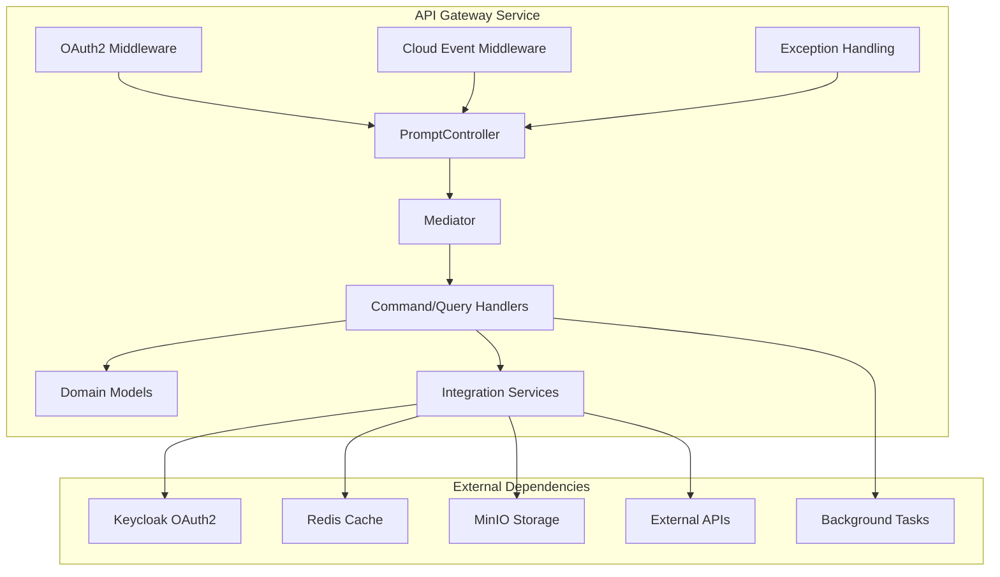

# 🚀 API Gateway Sample Application

The API Gateway sample demonstrates how to build a modern microservice gateway using the Neuroglia framework. This
application showcases advanced patterns including OAuth2 authentication, external service integration, background task
processing, and cloud event handling.

## 🎯 What You'll Learn

- **Microservice Gateway Patterns**: How to build a centralized API gateway for service orchestration
- **OAuth2 Authentication & Authorization**: Implementing JWT-based security with Keycloak integration
- **External Service Integration**: Connecting to multiple external APIs with proper abstraction
- **Background Task Processing**: Asynchronous task execution with Redis-backed job scheduling
- **Object Storage Integration**: File management with MinIO S3-compatible storage
- **Cloud Events**: Event-driven communication between microservices
- **Advanced Dependency Injection**: Complex service configuration and lifetime management

## 🏗️ Architecture Overview



The API Gateway follows a **distributed microservice pattern** where:

- **Gateway Layer**: Centralized entry point for multiple downstream services
- **Authentication Layer**: OAuth2/JWT-based security with external identity provider
- **Integration Layer**: Multiple external service clients with proper abstraction
- **DTOs**: Data transfer objects for external communication

## 🚀 Key Features Demonstrated

### 1. **OAuth2 Authentication & Security**

```python
# JWT token validation with Keycloak
@post("/item", response_model=ItemPromptCommandResponseDto)
async def create_new_item_prompt(
    self,
    command_dto: CreateNewItemPromptCommandDto,
    key: str = Depends(validate_mosaic_authentication)
) -> Any:
    # Protected endpoint with API key validation
```

### 2. **Multi-Service Integration**

```python
# External service clients
MinioStorageManager.configure(builder)          # Object storage
MosaicApiClient.configure(builder)              # External API
AsyncStringCacheRepository.configure(builder)   # Redis caching
BackgroundTaskScheduler.configure(builder)      # Async processing
```

### 3. **Advanced Domain Model**

```python
@map_to(PromptResponseDto)
@dataclass
class PromptResponse:
    id: str
    prompt_id: str
    content: str
    status: PromptStatus
    metadata: dict[str, Any]
    created_at: datetime.datetime
```

### 4. **Background Task Processing**

```python
# Asynchronous task execution
BackgroundTaskScheduler.configure(builder, ["application.tasks"])

# Redis-backed job queue
background_job_store: dict[str, str | int] = {
    "redis_host": "redis47",
    "redis_port": 6379,
    "redis_db": 0
}
```

### 5. **Cloud Events Integration**

```python
# Event publishing and consumption
CloudEventIngestor.configure(builder, ["application.events.integration"])
CloudEventPublisher.configure(builder)
app.add_middleware(CloudEventMiddleware, service_provider=app.services)
```

## 🔧 Configuration & Settings

### Application Settings

```python
class AiGatewaySettings(ApplicationSettings):
    # OAuth2 Configuration
    jwt_authority: str = "http://keycloak47/realms/mozart"
    jwt_audience: str = "ai-gateways"
    required_scope: str = "api"

    # External Service Settings
    s3_endpoint: str                    # MinIO storage
    connection_strings: dict[str, str]  # Redis, databases
    mosaic_api_keys: list[str]         # API authentication

    # Background Processing
    background_job_store: dict[str, str | int]
    redis_max_connections: int = 10
```

### Service Registration

```python
# Core framework services
Mapper.configure(builder, application_modules)
Mediator.configure(builder, application_modules)
JsonSerializer.configure(builder)

# Custom application services
AsyncStringCacheRepository.configure(builder, Prompt, str)
BackgroundTaskScheduler.configure(builder, ["application.tasks"])
MinioStorageManager.configure(builder)
LocalFileSystemManager.configure(builder)

# External integrations
builder.services.add_singleton(AiGatewaySettings, singleton=app_settings)
```

## 🧪 Testing Strategy

### Unit Tests

```python
class TestPromptController:
    def setup_method(self):
        self.mock_mediator = Mock(spec=Mediator)
        self.mock_mapper = Mock(spec=Mapper)
        self.controller = PromptController(
            service_provider=Mock(),
            mapper=self.mock_mapper,
            mediator=self.mock_mediator
        )

    @pytest.mark.asyncio
    async def test_create_prompt_success(self):
        # Test successful prompt creation
        command_dto = CreateNewItemPromptCommandDto(content="test")
        result = await self.controller.create_new_item_prompt(command_dto, "valid-key")

        assert result.status == "created"
        self.mock_mediator.execute_async.assert_called_once()
```

### Integration Tests

```python
@pytest.mark.integration
class TestApiGatewayIntegration:
    @pytest.mark.asyncio
    async def test_full_prompt_workflow(self, test_client):
        # Test complete workflow from API to external services
        response = await test_client.post(
            "/api/prompts/item",
            json={"content": "test prompt"},
            headers={"Authorization": "Bearer valid-token"}
        )

        assert response.status_code == 201
        assert "id" in response.json()
```

## 📚 Implementation Details

### 1. **Controller Layer** (`api/controllers/`)

- **PromptController**: Main API endpoints for prompt management
- **AppController**: Application health and metadata endpoints
- **InternalController**: Internal service endpoints
- **Authentication Schemes**: OAuth2 and API key validation

### 2. **Application Layer** (`application/`)

- **Commands**: Write operations (CreateNewPromptCommand)
- **Queries**: Read operations (GetPromptByIdQuery)
- **Services**: Business logic orchestration
- **Tasks**: Background job definitions
- **Events**: Integration event handlers

### 3. **Domain Layer** (`domain/`)

- **Prompt**: Core domain entity with business rules
- **PromptResponse**: Value object for API responses
- **Domain Events**: Business event definitions
- **Validation**: Domain-specific validation logic

### 4. **Integration Layer** (`integration/`)

- **External API Clients**: Mosaic, GenAI, Mozart APIs
- **Storage Services**: MinIO object storage, Redis caching
- **Background Services**: Task scheduling and execution
- **DTOs**: Data transfer objects for external communication

## 🔄 Background Processing

The API Gateway demonstrates advanced background processing patterns:

```python
# Task scheduling configuration
BackgroundTaskScheduler.configure(builder, ["application.tasks"])

# Redis-backed job store
builder.services.add_singleton(AiGatewaySettings, singleton=app_settings)

# Asynchronous task execution
@task_handler
class ProcessPromptTask:
    async def execute_async(self, prompt_id: str):
        # Long-running prompt processing
        prompt = await self.prompt_service.get_by_id(prompt_id)
        result = await self.genai_client.process_prompt(prompt)
        await self.storage_service.store_result(result)
```

## 🌐 External Service Integration

### MinIO Object Storage

```python
class MinioStorageManager:
    async def upload_file_async(self, bucket: str, key: str, data: bytes) -> str:
        # S3-compatible object storage
        return await self.client.put_object(bucket, key, data)
```

### Redis Caching

```python
class AsyncStringCacheRepository:
    async def get_async(self, key: str) -> Optional[str]:
        return await self.redis_client.get(key)

    async def set_async(self, key: str, value: str, ttl: int = None):
        await self.redis_client.set(key, value, ex=ttl)
```

### External API Integration

```python
class MosaicApiClient:
    async def submit_prompt_async(self, prompt: PromptDto) -> PromptResponseDto:
        # OAuth2 authenticated API calls
        token = await self.get_access_token()
        response = await self.http_client.post(
            "/api/prompts",
            json=prompt.dict(),
            headers={"Authorization": f"Bearer {token}"}
        )
        return PromptResponseDto.parse_obj(response.json())
```

## 🚀 Getting Started

### 1. **Prerequisites**

```bash
# Install dependencies
pip install -r requirements.txt

# Configure external services
docker-compose up -d redis keycloak minio
```

### 2. **Configuration**

```bash
# Set environment variables
export JWT_AUTHORITY="http://localhost:8080/realms/mozart"
export S3_ENDPOINT="http://localhost:9000"
export REDIS_URL="redis://localhost:6379"
```

### 3. **Run the Application**

```bash
# Start the API Gateway
python samples/api-gateway/main.py

# Access Swagger UI
open http://localhost:8000/docs
```

### 4. **Test the API**

```bash
# Get access token from Keycloak
curl -X POST http://localhost:8080/realms/mozart/protocol/openid-connect/token \
  -H "Content-Type: application/x-www-form-urlencoded" \
  -d "grant_type=client_credentials&client_id=ai-gateway&client_secret=secret"

# Call protected endpoint
curl -X POST http://localhost:8000/api/prompts/item \
  -H "Authorization: Bearer $TOKEN" \
  -H "Content-Type: application/json" \
  -d '{"content": "Generate a sample prompt"}'
```

## 🔗 Related Documentation

- [CQRS & Mediation](../patterns/cqrs.md) - Command/Query patterns
- [Dependency Injection](../patterns/dependency-injection.md) - Service configuration
- [Data Access](../features/data-access.md) - Repository patterns
- [OpenBank Sample](openbank.md) - Event sourcing comparison
- [Desktop Controller Sample](desktop_controller.md) - Background services

## 🔍 Comparison with OpenBank Sample

The API Gateway and OpenBank samples demonstrate different architectural patterns within the Neuroglia framework. Here's a detailed comparison:

### Architecture Patterns

| Aspect                    | API Gateway                         | OpenBank                  |
| ------------------------- | ----------------------------------- | ------------------------- |
| **Primary Pattern**       | Microservice Gateway                | Event Sourcing + DDD      |
| **Data Persistence**      | Multi-store (Redis, MinIO, MongoDB) | Event Store + Read Models |
| **State Management**      | Stateless with caching              | Event-sourced aggregates  |
| **External Integration**  | Multiple external APIs              | Focused domain model      |
| **Background Processing** | Async task queues                   | Event-driven projections  |

### Domain Complexity

#### API Gateway - **Integration-Focused**

```python
# Simple domain model focused on orchestration
@dataclass
class PromptResponse:
    id: str
    prompt_id: str
    content: str
    status: PromptStatus
    metadata: dict[str, Any]
```

#### OpenBank - **Rich Domain Model**

```python
# Complex aggregate with business rules
class BankAccountV1(AggregateRoot[str]):
    def record_transaction(self, amount: Decimal, transaction_type: BankTransactionTypeV1):
        # Complex business logic and invariants
        if transaction_type == BankTransactionTypeV1.DEBIT:
            if self.state.balance + amount < -self.state.overdraft_limit:
                raise InsufficientFundsException()

        # Event sourcing
        self.raise_event(BankAccountTransactionRecordedDomainEventV1(...))
```

### Data Persistence Strategy

#### API Gateway - **Multi-Store Architecture**

```python
# Multiple specialized storage systems
AsyncStringCacheRepository.configure(builder, Prompt, str)  # Redis caching
MinioStorageManager.configure(builder)                      # Object storage
BackgroundTaskScheduler.configure(builder)                 # Job queue

# Standard CRUD operations
async def save_prompt(self, prompt: Prompt):
    await self.cache_repository.set_async(prompt.id, prompt.content)
    await self.storage_manager.upload_async(prompt.id, prompt.data)
```

#### OpenBank - **Event Sourcing**

```python
# Event-driven persistence
ESEventStore.configure(builder, EventStoreOptions(database_name, consumer_group))

# Write model: Event sourcing
DataAccessLayer.WriteModel.configure(
    builder,
    ["samples.openbank.domain.models"],
    lambda builder_, entity_type, key_type: EventSourcingRepository.configure(...)
)

# Read model: Projections
DataAccessLayer.ReadModel.configure(
    builder,
    ["samples.openbank.integration.models"],
    lambda builder_, entity_type, key_type: MongoRepository.configure(...)
)
```

### Authentication & Security

#### API Gateway - **OAuth2 + API Keys**

```python
# Multiple authentication schemes
@post("/item", dependencies=[Depends(validate_mosaic_authentication)])
async def create_item_prompt(self, command_dto: CreateNewItemPromptCommandDto):
    # API key validation for external services

@get("/status", dependencies=[Depends(validate_token)])
async def get_status(self):
    # JWT token validation for internal services
```

#### OpenBank - **Domain-Focused Security**

```python
# Business rule enforcement
class BankAccountV1(AggregateRoot[str]):
    def record_transaction(self, amount: Decimal, transaction_type: BankTransactionTypeV1):
        # Domain-level authorization
        if not self.is_authorized_for_transaction(amount):
            raise UnauthorizedTransactionException()
```

### External Service Integration

#### API Gateway - **Extensive Integration**

```python
# Multiple external service clients
class MosaicApiClient:
    async def submit_prompt_async(self, prompt: PromptDto) -> PromptResponseDto:
        token = await self.oauth_client.get_token_async()
        return await self.http_client.post("/api/prompts", prompt, token)

class GenAiClient:
    async def process_prompt_async(self, prompt: str) -> str:
        return await self.ai_service.generate_response(prompt)

class MinioStorageManager:
    async def store_file_async(self, bucket: str, key: str, data: bytes):
        return await self.s3_client.put_object(bucket, key, data)
```

#### OpenBank - **Minimal Integration**

```python
# Focused on domain logic, minimal external dependencies
class CreateBankAccountCommandHandler:
    async def handle_async(self, command: CreateBankAccountCommand):
        # Pure domain logic without external service calls
        owner = await self.person_repository.get_by_id_async(command.owner_id)
        account = BankAccountV1(str(uuid.uuid4()), owner, command.initial_balance)
        await self.account_repository.save_async(account)
```

### Background Processing

#### API Gateway - **Task Queue Pattern**

```python
# Redis-backed job queues
BackgroundTaskScheduler.configure(builder, ["application.tasks"])

@task_handler
class ProcessPromptTask:
    async def execute_async(self, prompt_id: str):
        prompt = await self.prompt_service.get_by_id(prompt_id)
        result = await self.genai_client.process_prompt(prompt)
        await self.storage_service.store_result(result)
```

#### OpenBank - **Event-Driven Projections**

```python
# Event handlers for read model updates
class BankAccountEventHandler:
    @event_handler(BankAccountCreatedDomainEventV1)
    async def handle_account_created(self, event: BankAccountCreatedDomainEventV1):
        projection = BankAccountProjection.from_event(event)
        await self.read_model_repository.save_async(projection)
```

### Testing Strategies

#### API Gateway - **Integration-Heavy Testing**

```python
@pytest.mark.integration
class TestApiGatewayIntegration:
    async def test_full_prompt_workflow(self, test_client, mock_external_services):
        # Test complete workflow including external services
        response = await test_client.post("/api/prompts/item", json=prompt_data)

        # Verify external service calls
        mock_external_services.genai_client.process_prompt.assert_called_once()
        mock_external_services.storage_manager.upload.assert_called_once()
```

#### OpenBank - **Domain-Focused Testing**

```python
class TestBankAccountAggregate:
    def test_transaction_recording(self):
        # Pure domain logic testing
        account = BankAccountV1("123", owner, Decimal("1000"))
        account.record_transaction(Decimal("-100"), BankTransactionTypeV1.DEBIT)

        # Verify business rules and events
        assert account.state.balance == Decimal("900")
        events = account.get_uncommitted_events()
        assert isinstance(events[-1], BankAccountTransactionRecordedDomainEventV1)
```

### Use Case Recommendations

#### Choose **API Gateway Pattern** when

- ✅ Building microservice orchestration layers
- ✅ Integrating multiple external services
- ✅ Need background job processing
- ✅ Require complex authentication schemes
- ✅ Working with heterogeneous data stores
- ✅ Building service mesh entry points

#### Choose **Event Sourcing Pattern** when

- ✅ Need complete audit trails
- ✅ Complex business logic and invariants
- ✅ Temporal queries are important
- ✅ Regulatory compliance requirements
- ✅ High consistency requirements
- ✅ Rich domain models with behavior

### Framework Features Utilized

| Feature                   | API Gateway Usage        | OpenBank Usage                  |
| ------------------------- | ------------------------ | ------------------------------- |
| **CQRS/Mediation**        | Service orchestration    | Domain command/query separation |
| **Dependency Injection**  | External service clients | Repository abstractions         |
| **Event Handling**        | Integration events       | Domain events + projections     |
| **Data Access**           | Multi-repository pattern | Event sourcing + read models    |
| **Background Processing** | Async task queues        | Event-driven handlers           |
| **Mapping**               | DTO transformations      | Domain-to-DTO mapping           |
| **Validation**            | API contract validation  | Business rule enforcement       |

Both samples showcase different strengths of the Neuroglia framework, demonstrating its flexibility in supporting various architectural patterns while maintaining clean architecture principles.
