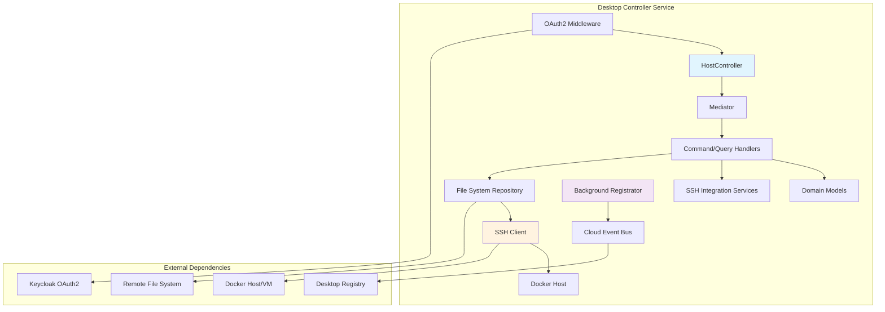

# 🖥️ Desktop Controller Sample Application

The Desktop Controller sample demonstrates how to build a remote desktop management system using the Neuroglia framework. This application showcases system integration patterns including SSH-based remote control, background service registration, cloud event publishing, and OAuth2 security for enterprise desktop management.

## 🎯 What You'll Learn

- **Remote System Control**: SSH-based command execution on host systems
- **Background Service Patterns**: Periodic self-registration and heartbeat services  
- **Cloud Event Publishing**: Automated service discovery and registration events
- **System Integration**: Host system information gathering and state management
- **OAuth2 Security**: Enterprise authentication with secure SSH key management
- **File System Integration**: Remote file management and data persistence
- **Docker Host Communication**: Container-to-host communication patterns

## 🏗️ Architecture Overview



This architecture enables secure remote control of desktop systems through containerized services that communicate with their host environments via SSH while maintaining enterprise security standards.

## 🚀 Key Features Demonstrated

### 1. **SSH-Based Remote Control**

```python
# Secure command execution on host systems
class SecuredHost:
    async def run_command_async(self, command: HostCommand) -> HostCommandResult:
        stdin, stdout, stderr = await asyncio.to_thread(
            self.ssh_client.exec_command, command.line
        )
        
        exit_status = stdout.channel.recv_exit_status()
        return HostCommandResult(
            command=command.line,
            exit_status=exit_status,
            stdout=stdout.read().decode(),
            stderr=stderr.read().decode()
        )
```

### 2. **Background Service Registration**

```python
# Periodic self-registration with cloud events
class DesktopRegistrator(HostedService):
    async def start_async(self):
        while not self.cancellation_token.is_cancelled:
            await self._register_desktop()
            await asyncio.sleep(self.registration_interval_seconds)
    
    async def _register_desktop(self):
        event = DesktopHostRegistrationRequestedIntegrationEventV1(
            desktop_id=self.desktop_id,
            host_ip_address=self.host_ip,
            registration_timestamp=datetime.utcnow()
        )
        await self.cloud_event_publisher.publish_async(event)
```

### 3. **Host System Information Management**

```python
# Domain model for host information
@dataclass
class HostInfo(Entity[str]):
    desktop_id: str
    host_ip_address: str
    host_state: HostState
    last_seen: datetime
    is_locked: bool
    system_info: dict[str, Any]
    
    def update_system_state(self, new_state: HostState):
        self.host_state = new_state
        self.last_seen = datetime.utcnow()
```

### 4. **Command/Query Pattern for Remote Operations**

```python
# Remote command execution
@dataclass
class SetHostLockCommand(Command):
    script_name: str = "/usr/local/bin/lock.sh"

class HostLockCommandsHandler(CommandHandler[SetHostLockCommand, OperationResult[Any]]):
    async def handle_async(self, command: SetHostLockCommand) -> OperationResult[Any]:
        host_command = HostCommand(line=command.script_name)
        result = await self.docker_host_command_runner.run_async(host_command)
        
        if result.exit_status == 0:
            return self.success("Host locked successfully")
        return self.bad_request(f"Lock command failed: {result.stderr}")
```

### 5. **OAuth2 with SSH Security**

```python
# Dual security: OAuth2 for API + SSH for host access
@get("/info", dependencies=[Depends(validate_token)])
async def get_host_info(self):
    query = ReadHostInfoQuery()
    result = await self.mediator.execute_async(query)
    return self.process(result)
```

## 🔧 Configuration & Settings

### Application Settings

```python
class DesktopControllerSettings(ApplicationSettings):
    # OAuth2 Configuration
    jwt_authority: str = "http://keycloak47/realms/mozart"
    jwt_audience: str = "desktops"
    required_scope: str = "api"
    
    # SSH Configuration
    docker_host_user_name: str = "sys-admin"
    docker_host_host_name: str = "host.docker.internal"
    
    # File System Configuration
    remotefs_base_folder: str = "/tmp"
    hostinfo_filename: str = "hostinfo.json"
    userinfo_filename: str = "userinfo.json"
    
    # Registration Configuration
    desktop_registration_interval: int = 30  # seconds
```

### SSH Client Configuration

```python
class SshClientSettings(BaseModel):
    username: str
    hostname: str
    port: int = 22
    private_key_filename: str = "/app/id_rsa"

# SSH key setup required:
# 1. Generate SSH key pair
# 2. Mount private key to container at /app/id_rsa
# 3. Add public key to host's ~/.ssh/authorized_keys
```

## 🧪 Testing Strategy

### Unit Tests

```python
class TestHostController:
    def test_host_lock_command_success(self):
        # Test successful host locking
        command = SetHostLockCommand(script_name="/usr/local/bin/lock.sh")
        
        # Mock SSH client response
        mock_result = HostCommandResult(
            command="/usr/local/bin/lock.sh",
            exit_status=0,
            stdout="Host locked",
            stderr=""
        )
        
        result = await handler.handle_async(command)
        assert result.is_success
        assert "locked successfully" in result.data
```

### Integration Tests

```python
class TestDesktopControllerIntegration:
    @pytest.mark.integration
    async def test_ssh_host_communication(self):
        # Test actual SSH communication with test host
        ssh_client = SecuredHost(test_ssh_settings)
        command = HostCommand(line="echo 'test'")
        
        result = await ssh_client.run_command_async(command)
        
        assert result.exit_status == 0
        assert "test" in result.stdout
```

## 📚 Implementation Details

### 1. **Controller Layer** (`api/controllers/`)

- **HostController**: Host system management and information endpoints
- **UserController**: User session and information management
- **HostScriptController**: Custom script execution on host systems
- **OAuth2Scheme**: Authentication and authorization middleware

### 2. **Application Layer** (`application/`)

- **Commands**: System control operations (lock, unlock, script execution)
- **Queries**: System information retrieval (host info, user info, lock status)
- **Services**: Background registration, SSH command execution
- **Events**: Integration events for desktop registration

### 3. **Domain Layer** (`domain/`)

- **HostInfo**: Desktop system information and state
- **UserInfo**: User session and authentication state
- **HostIsLocked**: Lock state management for security
- **Domain Events**: System state change notifications

### 4. **Integration Layer** (`integration/`)

- **SSH Services**: Secure host communication via SSH
- **File System Repository**: Remote file management
- **Cloud Event Models**: External service communication
- **Enums**: System state and configuration enumerations

## 🌐 External Service Integration

### SSH Host Communication

```python
class SecuredDockerHost:
    """SSH-based secure communication with Docker host system"""
    
    async def execute_system_command(self, command: str) -> CommandResult:
        ssh_command = HostCommand(line=command)
        return await self.secured_host.run_command_async(ssh_command)
```

### Cloud Event Publishing

```python
class DesktopRegistrationEvent:
    """Periodic registration with external desktop registry"""
    
    event_type = "com.cisco.mozart.desktop.registered.v1"
    
    async def publish_registration(self):
        cloud_event = CloudEvent(
            type=self.event_type,
            source=f"desktop-controller/{self.desktop_id}",
            data=DesktopHostRegistrationRequestedIntegrationEventV1(
                desktop_id=self.desktop_id,
                host_ip_address=self.get_host_ip(),
                capabilities=self.get_host_capabilities()
            )
        )
        await self.cloud_event_bus.publish_async(cloud_event)
```

### Remote File System Access

```python
class RemoteFileSystemRepository:
    """File-based data persistence on host system"""
    
    async def save_host_info(self, host_info: HostInfo):
        json_data = self.json_serializer.serialize(host_info)
        await self.write_file_async("hostinfo.json", json_data)
    
    async def write_file_async(self, filename: str, content: str):
        # Use SSH to write files to host filesystem
        command = f"echo '{content}' > {self.base_path}/{filename}"
        await self.ssh_client.run_command_async(HostCommand(line=command))
```

## 🚀 Getting Started

### Prerequisites

```bash
# 1. Docker and Docker Desktop installed
# 2. SSH key pair generated
ssh-keygen -t rsa -b 4096 -f ~/.ssh/desktop_controller_key

# 3. Copy public key to target host
ssh-copy-id -i ~/.ssh/desktop_controller_key.pub user@target-host
```

### Running the Application

```bash
# 1. Clone and setup
git clone <repository>
cd samples/desktop-controller

# 2. Configure environment
cp .env.example .env
# Edit .env with your settings

# 3. Mount SSH private key and run
docker run -d 
  -p 8080:80 
  -v ~/.ssh/desktop_controller_key:/app/id_rsa:ro 
  -e DOCKER_HOST_USER_NAME=sys-admin 
  -e JWT_AUTHORITY=http://your-keycloak/realms/mozart 
  desktop-controller:latest

# 4. Test the API
curl -H "Authorization: Bearer <token>" 
     http://localhost:8080/api/host/info
```

### Development Setup

```bash
# 1. Install dependencies
poetry install

# 2. Configure SSH access
sudo cp ~/.ssh/desktop_controller_key ./id_rsa
sudo chmod 600 ./id_rsa

# 3. Start development server
poetry run python main.py

# 4. Access Swagger UI
open http://localhost:8080/docs
```

## 🔗 Related Documentation

- [OAuth2 Security](../features/oauth2-security.md) - Authentication patterns
- [Background Services](../features/background-services.md) - Hosted service patterns
- [Cloud Events](../features/cloud-events.md) - Event publishing and consumption
- [System Integration](../features/system-integration.md) - External system communication
- [API Gateway Sample](api_gateway.md) - Service gateway patterns
- [OpenBank Sample](openbank.md) - Event sourcing and CQRS patterns

## 🔍 Comparison with Other Samples

### Architecture Patterns

#### Desktop Controller - **System Integration Focused**

```python
# SSH-based system control
class HostController(ControllerBase):
    @post("/lock")
    async def lock_host(self):
        command = SetHostLockCommand()
        result = await self.mediator.execute_async(command)
        return self.process(result)

# Background service registration
class DesktopRegistrator(HostedService):
    async def start_async(self):
        while not self.stopping:
            await self.register_desktop()
            await asyncio.sleep(30)
```

#### API Gateway - **Service Orchestration**

```python
# External API orchestration
class PromptController(ControllerBase):
    @post("/prompts")
    async def create_prompt(self, dto: CreatePromptDto):
        command = self.mapper.map(dto, CreatePromptCommand)
        result = await self.mediator.execute_async(command)
        return self.process(result)
```

#### OpenBank - **Rich Domain Model**

```python
# Event-sourced business logic
class BankAccount(AggregateRoot[str]):
    def try_add_transaction(self, transaction: BankTransaction) -> bool:
        if self.can_process_transaction(transaction):
            self.state.on(self.register_event(TransactionRecorded(transaction)))
            return True
        return False
```

### Domain Complexity

#### Desktop Controller - **System State Management**

- **Focus**: Host system control and monitoring
- **Entities**: HostInfo, UserInfo, SystemState
- **Operations**: Lock/unlock, script execution, information gathering
- **State**: Current system state with periodic updates

#### API Gateway - **Service Integration**

- **Focus**: Request routing and external service coordination
- **Entities**: Prompt, PromptResponse, ServiceConfiguration
- **Operations**: Create, process, route requests
- **State**: Request/response transformation and routing

#### OpenBank - **Business Domain Model**

- **Focus**: Financial business rules and transactions
- **Entities**: BankAccount, Person, Transaction
- **Operations**: Account creation, money transfer, balance inquiry
- **State**: Event-sourced business state with full history

### Data Persistence Strategy

#### Desktop Controller - **File-Based + Remote Storage**

```python
# File-based persistence on remote host
class RemoteFileSystemRepository:
    async def save_host_info(self, host_info: HostInfo):
        json_content = self.serializer.serialize(host_info)
        await self.write_remote_file("hostinfo.json", json_content)
```

#### API Gateway - **Multi-Store Architecture**

```python
# Multiple storage backends
services.add_scoped(MinioStorageManager)      # Object storage
services.add_scoped(RedisCache)               # Caching
services.add_scoped(MongoRepository)          # Document storage
```

#### OpenBank - **Event Sourcing**

```python
# Event store with projections
class EventStoreRepository:
    async def save_async(self, aggregate: AggregateRoot):
        events = aggregate._pending_events
        await self.event_store.append_events_async(aggregate.id, events)
```

### Authentication & Security

#### Desktop Controller - **OAuth2 + SSH Keys**

```python
# Dual security model
@get("/info", dependencies=[Depends(validate_token)])
async def get_host_info(self):
    # OAuth2 for API access + SSH for host communication
    pass

# SSH key management
class SshClientSettings:
    private_key_filename: str = "/app/id_rsa"
```

#### API Gateway - **OAuth2 + API Keys**

```python
# Multiple authentication schemes
@post("/item", dependencies=[Depends(validate_oauth2_token)])
async def create_item_oauth(self, item_data: ItemDto):
    pass

@get("/health", dependencies=[Depends(validate_api_key)])
async def health_check(self):
    pass
```

#### OpenBank - **Domain-Focused Security**

```python
# Business rule-based security
class BankAccount:
    def withdraw(self, amount: Decimal, user: Person):
        if not self.is_owner(user):
            raise UnauthorizedOperationException()
        if not self.has_sufficient_funds(amount):
            raise InsufficientFundsException()
```

### External Service Integration

#### Desktop Controller - **System Integration**

```python
# Direct system integration via SSH
class DockerHostCommandRunner:
    async def run_async(self, command: HostCommand) -> HostCommandResult:
        return await self.ssh_client.execute_command(command)

# Cloud event publishing for registration
class DesktopRegistrator:
    async def register_desktop(self):
        event = DesktopRegistrationEvent(self.host_info)
        await self.cloud_event_bus.publish_async(event)
```

#### API Gateway - **Extensive Integration**

```python
# Multiple external service clients
services.add_scoped(MosaicApiClient)
services.add_scoped(MinioStorageManager)
services.add_scoped(RedisCache)
services.add_scoped(GenAiApiClient)
```

#### OpenBank - **Minimal Integration**

```python
# Domain-focused with minimal external dependencies
services.add_singleton(EventStoreClient)
services.add_scoped(MongoRepository)  # For read models
```

### Background Processing

#### Desktop Controller - **Periodic Registration**

```python
# Background service for system registration
class DesktopRegistrator(HostedService):
    async def start_async(self):
        self.registration_task = asyncio.create_task(self.registration_loop())
    
    async def registration_loop(self):
        while not self.stopping:
            await self.register_with_registry()
            await asyncio.sleep(self.interval)
```

#### API Gateway - **Task Queue Pattern**

```python
# Redis-backed background task processing
@dataclass
class ProcessPromptTask(BackgroundTask):
    prompt_id: str
    user_id: str

class PromptProcessingService:
    async def queue_processing_task(self, prompt: Prompt):
        task = ProcessPromptTask(prompt.id, prompt.user_id)
        await self.task_scheduler.schedule_async(task)
```

#### OpenBank - **Event-Driven Projections**

```python
# Domain event-driven read model updates
class BankAccountProjectionHandler:
    @dispatch(BankAccountCreatedDomainEventV1)
    async def handle_async(self, event: BankAccountCreatedDomainEventV1):
        projection = BankAccountProjection.from_event(event)
        await self.projection_repository.save_async(projection)
```

### Testing Strategies

#### Desktop Controller - **System Integration Testing**

```python
# SSH integration tests
@pytest.mark.integration
class TestSSHIntegration:
    async def test_host_command_execution(self):
        ssh_client = SecuredHost(test_settings)
        result = await ssh_client.run_command_async(HostCommand("echo test"))
        assert result.exit_status == 0
        assert "test" in result.stdout

# Background service testing
class TestDesktopRegistrator:
    async def test_periodic_registration(self):
        registrator = DesktopRegistrator(mock_cloud_event_bus)
        await registrator.start_async()
        # Verify registration events are published
```

#### API Gateway - **Integration-Heavy Testing**

```python
# External service integration tests
@pytest.mark.integration
class TestExternalServices:
    async def test_mosaic_api_integration(self):
        client = MosaicApiClient(test_settings)
        response = await client.get_data_async("test-id")
        assert response.status_code == 200

# Background task testing
class TestTaskProcessing:
    async def test_prompt_processing_workflow(self):
        task = ProcessPromptTask("prompt-123", "user-456")
        result = await self.task_processor.process_async(task)
        assert result.is_success
```

#### OpenBank - **Domain-Focused Testing**

```python
# Rich domain behavior testing
class TestBankAccount:
    def test_account_creation_raises_creation_event(self):
        account = BankAccount()
        account.create_account("owner-123", Decimal("1000.00"))
        
        events = account._pending_events
        assert len(events) == 1
        assert isinstance(events[0], BankAccountCreatedDomainEventV1)

# Event sourcing testing
class TestEventStore:
    async def test_aggregate_reconstruction_from_events(self):
        events = [creation_event, transaction_event]
        account = await self.repository.load_from_events(events)
        assert account.balance == expected_balance
```

### Use Case Recommendations

#### Choose **Desktop Controller Pattern** when

- ✅ Building system administration and control applications
- ✅ Managing remote desktop or VM environments
- ✅ Implementing SSH-based automation and control
- ✅ Creating enterprise desktop management solutions
- ✅ Needing periodic service registration and discovery
- ✅ Integrating containerized apps with host systems
- ✅ Building secure remote command execution systems

#### Choose **API Gateway Pattern** when

- ✅ Building microservice entry points and orchestration
- ✅ Implementing complex external service integration
- ✅ Creating service mesh control planes
- ✅ Needing advanced authentication and authorization
- ✅ Building background task processing systems
- ✅ Implementing file storage and caching solutions

#### Choose **Event Sourcing Pattern** when

- ✅ Rich domain models with behavior
- ✅ Complete audit trails and temporal queries
- ✅ Event-driven architecture with projections
- ✅ Financial or business-critical applications
- ✅ CQRS with separate read/write models

### Framework Features Utilized

The Desktop Controller sample demonstrates unique aspects of the Neuroglia framework:

- **Background Services**: `HostedService` for long-running registration tasks
- **SSH Integration**: Custom integration services for secure system communication
- **Cloud Event Publishing**: External service registration and discovery
- **File-Based Repositories**: Remote filesystem data persistence
- **OAuth2 Security**: Enterprise authentication with secure key management
- **System Integration Patterns**: Container-to-host communication strategies

Both samples showcase different strengths of the Neuroglia framework, demonstrating its flexibility in supporting various architectural patterns while maintaining clean architecture principles.

## Overview

### Controller's Interactions

TODO

### Controller's Context

TODO

## Design

TODO
  
## Development

### Setup

```sh

# 0. Prerequisites:
#    Have Python 3.12 installed
# 
#    - Create/Activate a local python environment (e.g. with pyenv)
#      pyenv virtualenv 3.12.2 desktop-controller
#      pyenv activate desktop-controller
# 
#    - Start Docker Desktop locally
#
# 1. Clone the repository
cd ~/

git clone git@....

cd desktop-controller

# pip install pre-commit
pre-commit install

# pip install poetry
poetry lock && poetry install 

# 2. Start the docker-compose stack
# sudo apt-get install make
make up

# Access Swagger UI
open http://localhost:8080/docs
```

## 💡 Key Implementation Highlights

The Desktop Controller sample uniquely demonstrates:

### **1. Dual Security Architecture**

- **API Security**: OAuth2/JWT for REST API access
- **System Security**: SSH key-based authentication for host communication
- **Separation of Concerns**: Different security models for different access layers

### **2. Container-to-Host Communication**

- **SSH Bridge**: Secure communication between containerized service and host system
- **Command Execution**: Remote shell command execution with result capture
- **File System Access**: Remote file management on host filesystem

### **3. Background Service Registration**

- **Self-Discovery**: Periodic registration with external service registry
- **Cloud Events**: Standards-based event publishing for service discovery
- **Heartbeat Pattern**: Continuous availability signaling

### **4. System Integration Patterns**

- **Host Information Gathering**: Real-time system state collection
- **Remote Control Operations**: Secure desktop management capabilities
- **State Persistence**: File-based data storage for inter-application communication

This sample showcases how the Neuroglia framework can effectively bridge containerized microservices with host system management, providing enterprise-grade security and reliability for remote desktop control scenarios.

Both the Desktop Controller and other samples demonstrate the framework's versatility in handling diverse architectural patterns - from event-sourced business applications to system integration and service orchestration solutions.
