# 💼 Sample Applications

Comprehensive sample applications that demonstrate real-world implementation of the Neuroglia framework. Each sample showcases different architectural patterns, integration scenarios, and business domains to provide practical guidance for building production-ready systems.

## � Featured Samples

### [�🏦 OpenBank - Event Sourcing Banking System](openbank.md)

A complete banking system demonstrating **Event Sourcing**, **CQRS**, and **Domain-Driven Design** patterns for financial applications.

**What You'll Learn:**

- Complete event sourcing with KurrentDB (EventStoreDB)
- CQRS with separate write and read models
- Domain-driven design with rich aggregates
- Read model reconciliation and eventual consistency
- Snapshot strategy for aggregate performance
- Complex financial domain modeling

**Best For:**

- 🏦 Financial systems requiring complete audit trails
- 📊 Applications needing time-travel debugging
- 🔒 Audit-critical systems (compliance, regulations)
- 💼 Complex business rules with event replay
- 🔄 Systems with eventual consistency requirements

**Technology Stack:**

- KurrentDB (EventStoreDB) for event persistence
- MongoDB for read models
- FastAPI for REST APIs
- CloudEvents for integration
- Comprehensive domain events

**Complexity Level:** 🔴 **Advanced** - Requires understanding of event sourcing and CQRS patterns

[**→ Explore OpenBank Documentation**](openbank.md)

---

### [🎨 Simple UI - SubApp Pattern with JWT Authentication](simple-ui.md)

A modern single-page application demonstrating **SubApp architecture**, **stateless JWT authentication**, and **role-based access control**.

**What You'll Learn:**

- FastAPI SubApp mounting for UI/API separation
- Stateless JWT authentication architecture
- Role-based access control (RBAC) at application layer
- Bootstrap 5 frontend integration
- Parcel bundler for modern JavaScript
- Clean separation between UI and API concerns

**Best For:**

- 🖥️ Internal dashboards and admin tools
- 📋 Task management applications
- 🎨 Content management systems
- 👥 Applications requiring role-based permissions
- 🔐 Systems needing stateless authentication

**Technology Stack:**

- FastAPI SubApp pattern
- JWT for stateless authentication
- Bootstrap 5 for responsive UI
- Parcel for asset bundling
- localStorage for client-side token storage

**Complexity Level:** 🟡 **Intermediate** - Good introduction to authentication and RBAC

[**→ Explore Simple UI Documentation**](simple-ui.md)

---

## 🏭 Production-Ready Examples

### [� Mario's Pizzeria - Order Management System](../mario-pizzeria.md)

**Tutorial Sample** - A friendly introduction to Neuroglia framework through a pizza restaurant order management system. Perfect for learning CQRS, mediator pattern, and basic microservice architecture.

**🎯 Use Cases:** Learning the framework, order management, small business systems

**📚 Key Patterns:** CQRS commands/queries, mediator, background services

**� Complexity:** Beginner-Friendly

[**→ Full Tutorial**](../mario-pizzeria.md)

---

### [🌐 API Gateway - Microservice Orchestration](api_gateway.md)

Demonstrates microservice coordination, request routing, and cross-cutting concerns like authentication, rate limiting, and monitoring.

**Domain Focus:**

- Service discovery and routing
- Authentication and authorization
- Request/response transformation
- Circuit breaker patterns

**Key Patterns:**

- Gateway aggregation pattern
- Service mesh integration
- Distributed tracing
- Health check orchestration

**Technology Stack:**

- FastAPI for gateway implementation
- Redis for caching and rate limiting
- Prometheus for metrics
- Distributed logging

### [🖥️ Desktop Controller - Background Services](desktop_controller.md)

Shows how to build background services that interact with system resources, handle long-running operations, and manage desktop environments.

**Domain Focus:**

- System resource management
- Process orchestration
- File system operations
- Desktop environment control

**Key Patterns:**

- Background service patterns
- Resource locking mechanisms
- Process lifecycle management
- System integration patterns

**Technology Stack:**

- Background service hosting
- File system watchers
- System API integration
- Inter-process communication

## � Learning Paths

### 🚀 Quick Start (1-2 Hours)

Perfect for understanding core Neuroglia concepts quickly:

1. **[🍕 Mario's Pizzeria Tutorial](../mario-pizzeria.md)** - Start here to learn CQRS and mediator patterns
2. Try creating orders via REST API and observe command/query separation
3. Explore background service implementation for order processing

### 🏗️ Intermediate (Half Day)

Build on basics with authentication and UI integration:

1. Complete Quick Start path
2. **[🎨 Simple UI Sample](simple-ui.md)** - Understand SubApp pattern and JWT authentication
3. **[RBAC & Authorization Guide](../guides/rbac-authorization.md)** - Implement role-based access control
4. Build a custom authenticated endpoint with permission checking

### 🎓 Advanced (1-2 Days)

Master event sourcing and distributed patterns:

1. Complete Intermediate path
2. **[🏦 OpenBank Sample](openbank.md)** - Deep dive into event sourcing with KurrentDB
3. Study read model reconciliation and snapshot strategies
4. Experiment with time-travel debugging using event replay
5. Explore API Gateway and Desktop Controller patterns
6. Build a custom event-sourced aggregate with projections

---

## 🚀 Getting Started with Samples

### Quick Start Guide

1. **Choose Your Domain**: Select the sample that matches your use case
2. **Review Architecture**: Understand the patterns and structure
3. **Run Locally**: Follow setup instructions for local development
4. **Explore Code**: Study the implementation details
5. **Adapt and Extend**: Customize for your specific needs

## 🧪 Development and Testing

### Local Development Setup

Each sample includes:

- **Docker Compose**: Complete local environment
- **Development Scripts**: Build, test, and run commands
- **Database Migrations**: Schema and data setup
- **Mock Services**: External dependency simulation

### Testing Strategies

```mermaid
graph LR
    A[Unit Tests<br/>🧪 Components] --> B[Integration Tests<br/>🔗 Services]
    B --> C[End-to-End Tests<br/>🎯 Workflows]
    C --> D[Performance Tests<br/>⚡ Load Testing]

    style A fill:#e8f5e8
    style B fill:#e3f2fd
    style C fill:#fff3e0
    style D fill:#f3e5f5
```

### Deployment Options

- **Local Development**: Docker Compose environments
- **Cloud Deployment**: Kubernetes manifests and Helm charts
- **CI/CD Pipelines**: GitHub Actions and Jenkins examples
- **Monitoring Setup**: Observability and logging configuration

## 📊 Sample Comparison Matrix

| Feature           | Mario's Pizzeria | Simple UI          | OpenBank           | API Gateway     | Desktop Controller  |
| ----------------- | -------------------- | ------------------ | ------------------ | --------------- | ------------------- |
| **Complexity**    | � Beginner           | 🟡 Intermediate    | �🔴 Advanced       | 🟡 Intermediate | � Intermediate      |
| **Domain**        | Food Service         | UI + Auth          | Financial          | Integration     | System Resources    |
| **Architecture**  | CQRS + Mediator      | SubApp + JWT       | Event Sourcing     | Gateway Pattern | Background Services |
| **Storage**       | In-Memory            | JWT + localStorage | EventStore + Mongo | Redis + SQL     | File System         |
| **Best For**      | Learning Framework   | Auth & RBAC        | Audit Trails       | Microservices   | IoT & Devices       |
| **Learning Time** | 1-2 hours            | Half day           | 1-2 days           | Half day        | Half day            |

## 🎓 Learning Outcomes

### What You'll Learn

- **Real-world Implementation**: See patterns in action
- **Best Practices**: Production-ready code examples
- **Testing Strategies**: Comprehensive test coverage
- **Deployment Patterns**: Multiple deployment scenarios
- **Performance Optimization**: Scalability considerations

### Skills Developed

- **Architecture Design**: Pattern selection and implementation
- **Domain Modeling**: Business logic representation
- **Integration Patterns**: External system coordination
- **Testing Mastery**: Test strategy development
- **Operations Knowledge**: Deployment and monitoring

## 🔗 Related Documentation

- [🎯 Architecture Patterns](../patterns/index.md) - Foundational design patterns
- [🚀 Framework Features](../features/index.md) - Detailed feature documentation
- [📖 RBAC & Authorization Guide](../guides/rbac-authorization.md) - Comprehensive authorization patterns
- [📘 Getting Started](../getting-started.md) - Framework introduction with sample exploration

---

Each sample application is production-ready and includes comprehensive documentation, tests, and deployment guides. They serve as both learning resources and starting templates for your own applications.
