# 💼 Sample Applications

Comprehensive sample applications that demonstrate real-world implementation of the Neuroglia framework. Each sample showcases different architectural patterns, integration scenarios, and business domains to provide practical guidance for building production-ready systems.

## 🏦 Production-Ready Examples

### [🏦 OpenBank - Event Sourcing Banking System](openbank.md)

A complete banking system demonstrating event sourcing, CQRS, and financial domain modeling. Shows how to handle complex business rules, audit trails, and regulatory compliance.

**Domain Focus:**

- Account management
- Transaction processing
- Balance calculations
- Regulatory compliance

**Key Patterns:**

- Event sourcing with snapshots
- Complex domain aggregates
- Financial calculations with precision
- Audit trail implementation

**Technology Stack:**

- EventStoreDB for event persistence
- MongoDB for read models
- FastAPI for REST APIs
- Comprehensive test coverage

### [🌐 API Gateway - Microservice Orchestration](api_gateway.md)

Demonstrates microservice coordination, request routing, and cross-cutting concerns like authentication, rate limiting, and monitoring.

**Domain Focus:**

- Service discovery and routing
- Authentication and authorization
- Request/response transformation
- Circuit breaker patterns

**Key Patterns:**

- Gateway aggregation pattern
- Service mesh integration
- Distributed tracing
- Health check orchestration

**Technology Stack:**

- FastAPI for gateway implementation
- Redis for caching and rate limiting
- Prometheus for metrics
- Distributed logging

### [🖥️ Desktop Controller - Background Services](desktop_controller.md)

Shows how to build background services that interact with system resources, handle long-running operations, and manage desktop environments.

**Domain Focus:**

- System resource management
- Process orchestration
- File system operations
- Desktop environment control

**Key Patterns:**

- Background service patterns
- Resource locking mechanisms
- Process lifecycle management
- System integration patterns

**Technology Stack:**

- Background service hosting
- File system watchers
- System API integration
- Inter-process communication

### [🧪 Lab Resource Manager - Kubernetes Operator](lab-resource-manager.md)

Kubernetes operator pattern implementation for managing laboratory resources, demonstrating watcher patterns, reconciliation loops, and cloud-native development.

**Domain Focus:**

- Laboratory equipment management
- Resource allocation and scheduling
- Experiment workflow orchestration
- Usage tracking and reporting

**Key Patterns:**

- Kubernetes operator pattern
- Watcher and reconciliation loops
- Resource state management
- Cloud-native architecture

**Technology Stack:**

- Kubernetes API integration
- Custom Resource Definitions (CRDs)
- Controller runtime
- Cloud storage integration

## 🎯 Sample Application Architecture

Each sample demonstrates different architectural focuses:

## 🚀 Getting Started with Samples

### Quick Start Guide

1. **Choose Your Domain**: Select the sample that matches your use case
2. **Review Architecture**: Understand the patterns and structure
3. **Run Locally**: Follow setup instructions for local development
4. **Explore Code**: Study the implementation details
5. **Adapt and Extend**: Customize for your specific needs

### Sample Complexity Levels

#### 🟢 Beginner Level

- **Desktop Controller**: Straightforward background services
- Clear separation of concerns
- Basic integration patterns

#### 🟡 Intermediate Level

- **API Gateway**: Microservice coordination
- Cross-cutting concerns implementation
- Distributed system patterns

#### 🔴 Advanced Level

- **OpenBank**: Complex event sourcing
- **Lab Resource Manager**: Kubernetes operators
- Advanced domain modeling

## 🧪 Development and Testing

### Local Development Setup

Each sample includes:

- **Docker Compose**: Complete local environment
- **Development Scripts**: Build, test, and run commands
- **Database Migrations**: Schema and data setup
- **Mock Services**: External dependency simulation

### Testing Strategies

```mermaid
graph LR
    A[Unit Tests<br/>🧪 Components] --> B[Integration Tests<br/>🔗 Services]
    B --> C[End-to-End Tests<br/>🎯 Workflows]
    C --> D[Performance Tests<br/>⚡ Load Testing]

    style A fill:#e8f5e8
    style B fill:#e3f2fd
    style C fill:#fff3e0
    style D fill:#f3e5f5
```

### Deployment Options

- **Local Development**: Docker Compose environments
- **Cloud Deployment**: Kubernetes manifests and Helm charts
- **CI/CD Pipelines**: GitHub Actions and Jenkins examples
- **Monitoring Setup**: Observability and logging configuration

## 📊 Sample Comparison Matrix

| Feature          | OpenBank           | API Gateway       | Desktop Controller  | Lab Resource Manager |
| ---------------- | ------------------ | ----------------- | ------------------- | -------------------- |
| **Complexity**   | 🔴 Advanced        | 🟡 Intermediate   | 🟢 Beginner         | 🔴 Advanced          |
| **Domain**       | Financial          | Integration       | System              | Scientific           |
| **Architecture** | Event Sourcing     | Gateway Pattern   | Background Services | Operator Pattern     |
| **Storage**      | EventStore + Mongo | Redis + SQL       | File System         | Kubernetes etcd      |
| **Integration**  | REST APIs          | Multiple Services | System APIs         | Kubernetes APIs      |
| **Deployment**   | Cloud/On-Premise   | Cloud Native      | Desktop/Server      | Kubernetes Only      |

## 🎓 Learning Outcomes

### What You'll Learn

- **Real-world Implementation**: See patterns in action
- **Best Practices**: Production-ready code examples
- **Testing Strategies**: Comprehensive test coverage
- **Deployment Patterns**: Multiple deployment scenarios
- **Performance Optimization**: Scalability considerations

### Skills Developed

- **Architecture Design**: Pattern selection and implementation
- **Domain Modeling**: Business logic representation
- **Integration Patterns**: External system coordination
- **Testing Mastery**: Test strategy development
- **Operations Knowledge**: Deployment and monitoring

## 🔗 Related Documentation

- [🎯 Architecture Patterns](../patterns/) - Foundational design patterns
- [🚀 Framework Features](../features/) - Detailed feature documentation
- [📖 Implementation Guides](../guides/) - Step-by-step tutorials
- [🍕 Mario's Pizzeria](../mario-pizzeria.md) - Unified domain example

## 🚀 Next Steps

1. **Explore Sample Code**: Clone and run the samples locally
2. **Study Implementation**: Review architecture decisions and patterns
3. **Adapt for Your Needs**: Use samples as starting templates
4. **Contribute Back**: Share improvements and additional samples

---

Each sample application is production-ready and includes comprehensive documentation, tests, and deployment guides. They serve as both learning resources and starting templates for your own applications.
