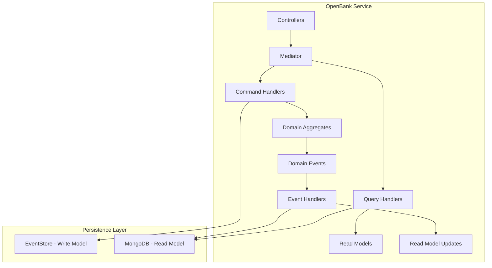

# 🏦 OpenBank Sample Application

The OpenBank sample demonstrates **event sourcing** and **domain-driven design** patterns using the Neuroglia framework. This application showcases how to build a banking system with complete audit trails, event-driven architecture, and CQRS implementation.

## 🎯 What You'll Learn

- **Event Sourcing**: Complete audit trail with event-driven state reconstruction
- **Domain-Driven Design**: Rich domain models with business logic and invariants
- **CQRS Implementation**: Separate read and write models for optimal performance
- **Aggregate Root Pattern**: Domain entity lifecycle management and consistency
- **Event Store Integration**: Persistent event streams with EventStoreDB
- **Domain Events**: Business event modeling and handling
- **Clean Architecture**: Strict layer separation and dependency inversion

## 🏗️ Architecture Overview



The OpenBank follows an **event-sourced domain model** where:

- **Write Model**: Event-sourced aggregates stored in EventStoreDB
- **Read Model**: Denormalized projections stored in MongoDB  
- **Event Handlers**: Update read models based on domain events
- **Complete Audit Trail**: Every state change is captured as an immutable event

## 🚀 Key Features Demonstrated

### 1. **Event-Sourced Aggregates**

```python
class BankAccountV1(AggregateRoot[str]):
    def __init__(self, id: str, owner: Person, initial_balance: Decimal):
        super().__init__(id)
        
        # Raise domain event
        self.raise_event(BankAccountCreatedDomainEventV1(
            aggregate_id=id,
            owner_id=owner.id,
            initial_balance=initial_balance,
            created_at=datetime.utcnow()
        ))
    
    def record_transaction(self, amount: Decimal, transaction_type: BankTransactionTypeV1):
        # Business rule validation
        if transaction_type == BankTransactionTypeV1.DEBIT:
            if self.state.balance + amount < -self.state.overdraft_limit:
                raise InsufficientFundsException()
        
        # Record the transaction event
        self.raise_event(BankAccountTransactionRecordedDomainEventV1(
            aggregate_id=self.id,
            transaction_id=str(uuid.uuid4()),
            amount=amount,
            transaction_type=transaction_type
        ))
```

### 2. **Event Store Configuration**

```python
# Event sourcing repository setup
ESEventStore.configure(builder, EventStoreOptions(database_name, consumer_group))

# Write model with event sourcing
DataAccessLayer.WriteModel.configure(
    builder, 
    ["samples.openbank.domain.models"], 
    lambda builder_, entity_type, key_type: EventSourcingRepository.configure(
        builder_, entity_type, key_type
    )
)

# Read model with MongoDB
DataAccessLayer.ReadModel.configure(
    builder,
    ["samples.openbank.integration.models", "samples.openbank.application.events"],
    lambda builder_, entity_type, key_type: MongoRepository.configure(
        builder_, entity_type, key_type, database_name
    )
)
```

### 3. **Aggregate State Management**

```python
@map_to(BankAccountDto)
class BankAccountStateV1(AggregateState[str]):
    owner_id: str
    transactions: List[BankTransactionV1] = []
    balance: Decimal
    overdraft_limit: Decimal

    @dispatch(BankAccountCreatedDomainEventV1)
    def on(self, e: BankAccountCreatedDomainEventV1):
        self.id = e.aggregate_id
        self.owner_id = e.owner_id
        self.balance = e.initial_balance
        self.overdraft_limit = Decimal("0.00")

    @dispatch(BankAccountTransactionRecordedDomainEventV1)
    def on(self, e: BankAccountTransactionRecordedDomainEventV1):
        transaction = BankTransactionV1(
            id=e.transaction_id,
            amount=e.amount,
            type=e.transaction_type,
            recorded_at=e.occurred_at
        )
        self.transactions.append(transaction)
        self.balance += e.amount
```

### 4. **Domain Event Handlers**

```python
class BankAccountEventHandler:
    @event_handler(BankAccountCreatedDomainEventV1)
    async def handle_account_created(self, event: BankAccountCreatedDomainEventV1):
        # Update read model projections
        account_projection = BankAccountProjection(
            id=event.aggregate_id,
            owner_id=event.owner_id,
            balance=event.initial_balance,
            created_at=event.occurred_at
        )
        await self.read_model_repository.save_async(account_projection)
```

### 5. **Command and Query Separation**

```python
# Command for state changes
@dataclass
class CreateBankAccountCommand(Command[OperationResult[BankAccountDto]]):
    owner_id: str
    initial_balance: Decimal

class CreateBankAccountCommandHandler(CommandHandler[CreateBankAccountCommand, OperationResult[BankAccountDto]]):
    async def handle_async(self, command: CreateBankAccountCommand) -> OperationResult[BankAccountDto]:
        owner = await self.person_repository.get_by_id_async(command.owner_id)
        
        account = BankAccountV1(
            id=str(uuid.uuid4()),
            owner=owner,
            initial_balance=command.initial_balance
        )
        
        await self.write_repository.save_async(account)
        return self.created(self.mapper.map(account.state, BankAccountDto))

# Query for data retrieval
@dataclass
class AccountsByOwnerQuery(Query[List[BankAccountDto]]):
    owner_id: str

class AccountsByOwnerQueryHandler(QueryHandler[AccountsByOwnerQuery, List[BankAccountDto]]):
    async def handle_async(self, query: AccountsByOwnerQuery) -> List[BankAccountDto]:
        accounts = await self.read_repository.find_async(
            {"owner_id": query.owner_id}
        )
        return [self.mapper.map(acc, BankAccountDto) for acc in accounts]
```

## 🧪 Testing Strategy

### Event Sourcing Tests

```python
class TestBankAccountAggregate:
    def test_account_creation_raises_event(self):
        owner = Person("john.doe@example.com", "John", "Doe")
        account = BankAccountV1("acc-123", owner, Decimal("1000.00"))
        
        events = account.get_uncommitted_events()
        assert len(events) == 1
        assert isinstance(events[0], BankAccountCreatedDomainEventV1)
        assert events[0].initial_balance == Decimal("1000.00")

    def test_transaction_recording_updates_balance(self):
        account = self._create_test_account()
        
        account.record_transaction(Decimal("-100.00"), BankTransactionTypeV1.DEBIT)
        
        assert account.state.balance == Decimal("900.00")
        events = account.get_uncommitted_events()
        assert any(isinstance(e, BankAccountTransactionRecordedDomainEventV1) for e in events)

    def test_insufficient_funds_raises_exception(self):
        account = self._create_test_account()
        
        with pytest.raises(InsufficientFundsException):
            account.record_transaction(Decimal("-2000.00"), BankTransactionTypeV1.DEBIT)
```

### Integration Tests

```python
@pytest.mark.integration
class TestBankingWorkflow:
    @pytest.mark.asyncio
    async def test_complete_banking_workflow(self, test_client):
        # Create person
        person_response = await test_client.post("/api/persons", json={
            "email": "john@example.com",
            "firstName": "John", 
            "lastName": "Doe"
        })
        person_id = person_response.json()["id"]
        
        # Create bank account
        account_response = await test_client.post("/api/accounts/create", json={
            "ownerId": person_id,
            "initialBalance": "1000.00"
        })
        account_id = account_response.json()["id"]
        
        # Record transaction
        transaction_response = await test_client.post("/api/transactions/record", json={
            "accountId": account_id,
            "amount": "-100.00",
            "type": "DEBIT"
        })
        
        # Verify final state
        account_response = await test_client.get(f"/api/accounts/{account_id}")
        assert account_response.json()["balance"] == "900.00"
```

## 📚 Implementation Details

### 1. **Domain Layer** (`domain/models/`)

- **BankAccount**: Event-sourced aggregate root with business logic
- **Person**: Value object for account ownership
- **BankTransaction**: Value object for financial operations
- **Address**: Supporting value object for person details

### 2. **Application Layer** (`application/`)

- **Commands**: Account creation, transaction recording
- **Queries**: Account lookup, transaction history
- **Event Handlers**: Read model projection updates
- **Mapping**: Object-to-object transformations

### 3. **Integration Layer** (`integration/`)

- **Read Models**: Denormalized projections for queries
- **DTOs**: API data transfer objects
- **Commands**: External command contracts

### 4. **API Layer** (`api/controllers/`)

- **AccountsController**: Account management endpoints
- **PersonsController**: Person management endpoints  
- **TransactionsController**: Transaction operations

## 🔄 Event Sourcing Benefits

### Complete Audit Trail

```python
# Every state change is captured as an immutable event
events = [
    BankAccountCreatedDomainEventV1(account_id="123", initial_balance=1000.00),
    BankAccountTransactionRecordedDomainEventV1(account_id="123", amount=-100.00),
    BankAccountTransactionRecordedDomainEventV1(account_id="123", amount=50.00),
]

# State can be reconstructed from events
current_balance = sum(event.amount for event in events if hasattr(event, 'amount'))
```

### Temporal Queries

```python
# Query account state at any point in time
async def get_account_balance_at_date(self, account_id: str, date: datetime) -> Decimal:
    events = await self.event_store.get_events_async(
        account_id, 
        to_date=date
    )
    
    account = BankAccountV1.from_events(events)
    return account.state.balance
```

### Business Intelligence

```python
# Analyze transaction patterns
async def get_transaction_analytics(self, from_date: datetime, to_date: datetime):
    events = await self.event_store.get_events_by_type_async(
        BankAccountTransactionRecordedDomainEventV1,
        from_date=from_date,
        to_date=to_date
    )
    
    return {
        "total_transactions": len(events),
        "total_amount": sum(e.amount for e in events),
        "avg_transaction": sum(e.amount for e in events) / len(events)
    }
```

## 🚀 Getting Started

### 1. **Prerequisites**

```bash
# Install dependencies
pip install -r requirements.txt

# Start infrastructure
docker-compose up -d eventstore mongodb
```

### 2. **Run the Application**

```bash
# Start OpenBank API
python samples/openbank/api/main.py

# Access Swagger UI
open http://localhost:8000/docs
```

### 3. **Test the API**

```bash
# Create a person
curl -X POST http://localhost:8000/api/persons \
  -H "Content-Type: application/json" \
  -d '{"email": "john@example.com", "firstName": "John", "lastName": "Doe"}'

# Create a bank account
curl -X POST http://localhost:8000/api/accounts/create \
  -H "Content-Type: application/json" \
  -d '{"ownerId": "person-id", "initialBalance": "1000.00"}'

# Record a transaction
curl -X POST http://localhost:8000/api/transactions/record \
  -H "Content-Type: application/json" \
  -d '{"accountId": "account-id", "amount": "-100.00", "type": "DEBIT"}'
```

## 🔗 Related Documentation

- [Event Sourcing](../features/event-sourcing.md) - Event sourcing patterns
- [CQRS & Mediation](../features/cqrs-mediation.md) - Command/Query separation
- [Data Access](../features/data-access.md) - Repository patterns
- [API Gateway Sample](api_gateway.md) - Microservice gateway comparison